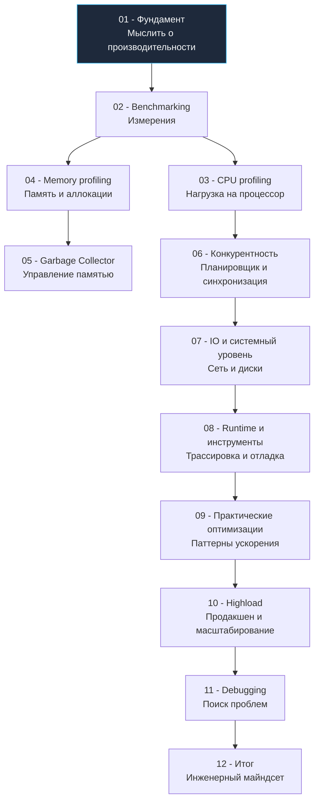
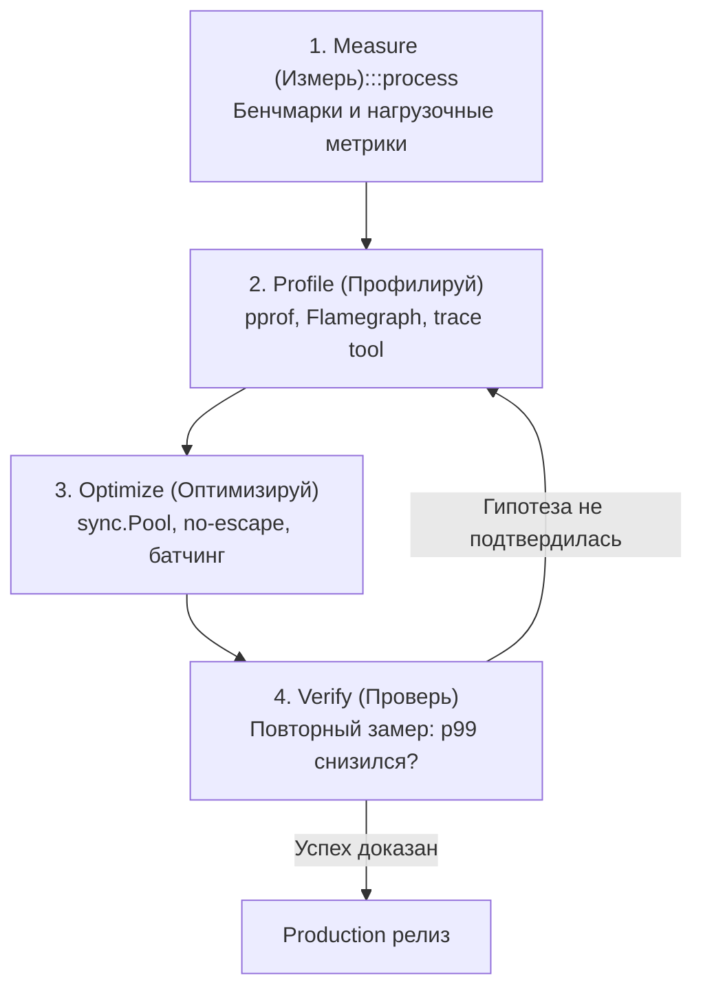

## Добро пожаловать: почему производительность — это не «потом»

В индустрии программного обеспечения существует опасное заблуждение: считать производительность второстепенной задачей, которую «можно подкрутить перед релизом». В мире высоконагруженного бэкенда на Go, где одиночный микросервис обязан перемалывать десятки и сотни тысяч запросов в секунду, а незапланированная пауза Garbage Collector в 10 миллисекунд способна вызвать каскадный отказ сотен клиентов по тайм-ауту, производительность — это фундаментальная **архитектурная характеристика**, а не косметический тюнинг.

> *«Преждевременная оптимизация — корень всех зол. Но мы не должны упускать критические 3% кода, где сосредоточена вся стоимость вычислений.»*  
> — Дональд Кнут

Этот раздел инженерной энциклопедии не предназначен для заучивания поверхностных рецептов или «магических трюков». Его цель — сформировать строгий **инженерный майндсет**, при котором вы:

- смотрите на исходный код глазами процессора: через призму тактов CPU, иерархии кэшей L1–L3 и конвейерных инструкций;
- отчётливо понимаете физическую цену каждого системного вызова в ядро Linux и каждой аллокации в куче;
- не гадаете по невнятным текстовым логам, а препарируете распределения p99 latency и понимаете природу хвостовых задержек;
- проектируете архитектуру сервиса так, чтобы её можно было профилировать на лету в боевом окружении без риска и без необходимости запускать тяжеловесный флаг `-race` на проде.

Раздел адресован инженерам, стремящимся пройти путь от наивного принципа «работает — и ладно» до квалификации **Senior/Lead Go Engineer**, способного с математической точностью доказать команде и бизнесу, *почему* сервис работает быстро или медленно, и какие физические законы кремния за этим стоят.

---

## Обзор структуры раздела

Двенадцать взаимосвязанных подразделов выстроены по принципу восхождения: от фундаментальных законов теории систем к замерам, профилированию рантайма и ликвидации инцидентов под экстремальной нагрузкой.

### 01. Фундамент
Прежде чем браться за профайлер, мы закладываем теоретический базис.  
В статьях [[2. Latency vs throughput]], [[3. CPU bound vs IO bound задачи]] и [[4. Amdahl law и масштабирование]] вы вспомните классические законы, которые управляют любой вычислительной системой — от мобильного процессора до кластера K8s.  
[[5. Mechanical sympathy в backend разработке]] объясняет, почему знание иерархии памяти и кэш-линий CPU напрямую влияет на выбор структуры данных в Go.  
Завершается блок разговором о метриках: [[6. Метрики. p50, p95, p99]] и [[7. Tail latency и почему она важна]] — без них вы не сможете доказать, что ваша оптимизация действительно помогла.

### 02. Benchmarking
Сердце инженерного подхода — строгое воспроизводимое измерение.  
Вы изучите [[2. Benchmarking в Go]] и [[3. go test -bench под капотом]], чтобы понимать, как стандартный инструмент превращает ваш код в контролируемый эксперимент.  
Особое внимание уделим ловушкам: [[4. Подводные камни benchmark тестов]] (dead code elimination, эффекты прогрева, шум ОС), а также разнице между micro и macro бенчмарками ([[5. microbenchmarks vs macrobenchmarks]]). Без стабилизации результатов ([[6. Стабилизация результатов]]) и умения сравнивать версии ([[8. Сравнение версий кода]]) все замеры — это лишь иллюзия контроля.

### 03. CPU profiling
Когда приложение упирается в процессор, на сцену выходит `pprof`.  
Мы разберем [[1. pprof. Введение]], [[2. CPU profiling в Go]] и [[3. Flamegraph]] — инструментарий, с которым вы будете засыпать и просыпаться.  
Далее копнём глубже: [[4. Top functions анализ]] научит приоритизировать горячие точки, [[5. Inline и влияние на performance]] покажет, как решения компилятора умножают или съедают такты, а [[6. Branch prediction и код]] и [[7. SIMD и Go]] — как писать код, дружественный спекулятивному исполнению и векторным инструкциям. Венчает подраздел [[8. Cache friendliness]] — мост между вашим кодом и L1-кэшем ядра.

### 04. Memory profiling
Go берёт на себя управление памятью, но Senior обязан знать, где именно.  
[[1. Memory model Go]] освежит модель памяти языка и гарантии. Затем [[2. Heap vs stack]] и [[3. Escape analysis]] — фундамент понимания аллокаций: когда значение «убегает» в кучу и во что это обходится.  
С помощью [[4. Allocation profiling]] и [[5. pprof memory profile]] вы научитесь видеть каждый выделенный байт, диагностировать [[6. Утечки памяти]], [[7. Fragmentation]] и анализировать [[8. Object lifetime]] — как долго живут объекты и когда их подметает GC.

### 05. Garbage Collector
GC в Go — низколатентный и конкурентный, но не волшебный.  
После [[1. GC в Go. Обзор]] мы разберем алгоритм [[2. Tri color marking]], причины [[3. Stop the world]] (да, они есть), механику [[4. Concurrent GC]] и роль [[5. Write barriers]].  
Вы узнаете, как измерять [[6. GC pause и latency]] и вооружитесь практическими ручками тюнинга: [[7. GOGC и tuning]] и [[8. GOMEMLIMIT]]. А в [[9. Когда GC становится bottleneck]] поймете, когда оптимизация памяти важнее оптимизации CPU.

### 06. Конкурентность
Горутины легковесны, но их взаимодействие — источник самых неприятных проблем производительности.  
Мы начнем с модели [[1. Scheduler Go. G-M-P модель]] и [[2. Goroutines под капотом]], разберем [[3. Work stealing]] и цену [[4. Контекстные переключения]].  
Затем перейдем к синхронизации: [[5. Sync primitives и их стоимость]], [[6. Mutex vs channel]], [[7. Contention и lock profiling]]. Особый акцент — на низкоуровневые ловушки вроде [[8. False sharing]] и [[9. Cache line и выравнивание]], где ошибка может стоить 40% производительности.

### 07. IO и системный уровень
Даже идеально написанный код упирается в syscall.  
[[1. Системные вызовы и их стоимость]] напомнит, во сколько обходится переход в Ring 0. Мы изучим [[2. IO bottlenecks]], природу [[3. Network latency]] и, самое важное для Go-сетевого кода, — [[4. epoll, kqueue и netpoller]].  
Практические техники: [[5. Zero copy подходы]], [[6. Buffer reuse]], [[7. File IO оптимизация]] и [[8. Connection pooling]] — всё, что делает сетевой и дисковый ввод-вывод быстрым и предсказуемым.

### 08. Runtime и инструменты
Внутренности рантайма и инструменты, которые редко используют, но Senior обязан знать.  
Мы погрузимся в [[1. runtime пакет]], разберем [[2. trace tool]] и [[3. execution tracer]] для анализа событий рантайма, научимся делать [[4. goroutine dump]] и использовать [[5. block profile]] и [[6. mutex profile]]. Статья [[7. scheduler trace]] раскроет, как работает планировщик, а [[8. debug tools]] соберет арсенал от `GODEBUG` до `go tool compile`.

### 09. Практические оптимизации
Теоретический фундамент превращается в код.  
Конкретные идиомы: [[1. Уменьшение аллокаций]], [[2. sync Pool]], [[3. Reuse объектов]]. Методики [[4. Предвыделение памяти]], [[5. Оптимизация структур данных]] и [[6. Cache friendly структуры]] дадут тактическое преимущество. Завершают подраздел принципы [[7. Удаление лишних абстракций]], [[8. Inline оптимизации]] и, для самых требовательных участков, [[9. Zero allocation подход]].

### 10. Highload
Оптимизация в вакууме — ничто; оптимизация под нагрузкой — всё.  
[[1. Load testing]] с инструментами типа `vegeta` или `k6`, [[2. Profiling в production]] с minimal overhead, [[3. Feature flags для оптимизаций]] и [[4. Canary releases]] — как внедрять изменения безопасно.  
Мы обсудим [[5. Performance regression detection]] в CI, [[6. Capacity planning]], [[7. Autoscaling]], [[8. Observability и performance]] и научимся формулировать цели через [[9. SLO и SLA]].

### 11. Debugging
Когда всё пошло не по плану.  
[[1. Debugging в Go]] как дисциплина, [[2. Delve debugger]] для интерактивного исследования, [[3. Race detector в проде]] (хотя лучше не доводить), [[4. Логи и debugging]], [[5. Postmortem анализ]] и [[6. Core dumps]] — чтобы разобрать аварию по косточкам. В [[7. Debugging latency проблем]] закрепим системный подход к поиску недетерминированных «тормозов».

### 12. Итог
Финальная статья [[1. Итоги раздела. Performance engineering mindset]] соберет все нити в единую картину и опишет, как применять полученные знания в ежедневной работе, код-ревью и проектировании систем.

---

## Как мыслить о производительности: принципы, а не рецепты

> [!NOTE]
> Мышление «делай X, потому что это быстро» не работает. Работает — «измеряй, понимай, улучшай, проверяй».

### 1. Данные превыше всего (Metrics-Driven)

Первое и нерушимое правило performance engineering: **без объективных цифр вы не оптимизируете — вы гадаете на кофейной гуще**.

Прежде чем вносить изменения в продакшен-код, инженер обязан точно ответить на четыре вопроса:
- Какая конкретно операция тормозит сервис? (хвостовая задержка: latency p95 / p99)
- Какой поток запросов в секунду мы обрабатываем? (пропускная способность: throughput)
- Какую долю процессорного времени сжирает сборщик мусора? (`GODEBUG=gctrace=1`)
- Где концентрируются аллокации памяти? (`pprof -alloc_space`)

Именно поэтому модуль стартует с метрик, а не со случайных правок кода: [[6. Метрики. p50, p95, p99]] и [[2. Latency vs throughput]] — ваш главный щит против псевдооптимизаций.

---

### 2. Знай свою «модель стоимости»

Писать высокопроизводительный код на Go — значит обладать ясной ментальной моделью **относительной стоимости** операций на современном «железе».

Ориентировочная шкала задержек:
- Обращение к регистрам CPU / чтение из кэша L1: **~1 нс** (1–4 такта);
- Промах мимо L1, попадание в L3 / невыровненный доступ: **~10–50 нс**;
- Вызов `make([]byte, 4096)` с аллокацией в куче: **~100–200 нс** (плюс скрытая работа GC в будущем);
- Переключение контекста, системный вызов ядра или состязание за мьютекс с засыпанием горутины: **от 1 мкс до нескольких миллисекунд**.

В этом разделе мы непрерывно опираемся на [[5. Mechanical sympathy в backend разработке]] — способность сопоставлять абстракцию исходного кода с реальными кремниевыми транзисторами. Без этой связи невозможно понять, почему замена связного списка на непрерывный слайс ускоряет обход в 5–10 раз благодаря пространственной локальности кэша (Cache Locality), или почему буферизованный канал под высокой нагрузкой может уступать простому мьютексу.

---

### 3. Избегай преждевременной оптимизации, но уважай архитектуру

Классическое предостережение Дональда Кнута («premature optimization is the root of all evil») часто истолковывают превратно, оправдывая небрежный и заведомо неэффективный код. В реальности оно означает:
- Не жертвуйте чистотой и читаемостью кода ради микрооптимизаций, чья необходимость не подтверждена профайлером.
- Всегда начинайте с оптимальных структур данных и алгоритмов ($O$-нотация), а не с низкоуровневых битовых трюков.
- Помните, что **архитектурные решения** (шардирование данных, кэширование, пулы соединений, асинхронные очереди) приносят кратный, десятикратный выигрыш, тогда как локальные правки — единицы процентов.

Наш курс научит вас чётко разделять ситуации: когда достаточно довериться компилятору и разрешить ему заинлайнить функцию ([[5. Inline и влияние на performance]]), а когда пора пересматривать схему реляционной БД или сетевой протокол.

---

### 4. Цикл оптимизации: Measure → Profile → Optimize → Verify

Этот четырёхэтапный цикл — фундаментальный алгоритм работы инженера:

1. **Measure (Измерь):** Снимите объективные базовые показатели под воспроизводимой нагрузкой (`go test -bench`).
2. **Profile (Профилируй):** Подключите `pprof` (CPU, memory, block, mutex) или трассировщик (`go tool trace`), чтобы математически выявить главное узкое место. См. [[2. CPU profiling в Go]], [[5. pprof memory profile]], [[7. Contention и lock profiling]].
3. **Optimize (Оптимизируй):** Примените таргетированную технику: использование `sync.Pool`, исключение утечек в кучу (escape analysis), предварительное выделение капасити слайсов или батчинг системных вызовов.
4. **Verify (Проверь):** Повторите бенчмарк в идентичных условиях; строго докажите, что p95/p99 задержка реально снизилась, а профиль памяти не деградировал.

Без фазы Verify вы рискуете задеплоить «оптимизацию», которая прекрасно выглядела на синтетическом микротесте, но рухнет под реальным трафиком из-за деградации кэшей CPU.

> [!tip] Собеседование
> **Вопрос:** Как вы подходите к оптимизации нового микросервиса на Go?
> **Ожидаемый ответ:** Ни в коем случае не оптимизирую вслепую по интуиции. Сначала разворачиваю стенд нагрузочного тестирования ([[1. Load testing]]), снимаю CPU и memory профили через `pprof`, нахожу топ-5 функций по числу аллокаций и времени работы процессора. Обязательно проверяю наличие contention на мьютексах ([[7. Contention и lock profiling]]). Если хвостовая задержка p99 latency вызвана паузами сборщика мусора — анализирую GC pause и калибрую параметры `GOGC` и `GOMEMLIMIT`. Все изменения проверяю итеративно, сравнивая бенчмарки между версиями инструментами вроде `benchstat` ([[8. Сравнение версий кода]]).

---

### 5. Mechanical Sympathy: говорим на языке железа

Язык Go предоставляет разработчику удобную модель с автоматическим управлением памятью и легковесными горутинами, но он не отменяет физических ограничений серверов. Компилятор Go, планировщик и Garbage Collector исполняются поверх аппаратных кэш-линий, таблиц трансляции страниц TLB, топологий NUMA и планировщика ядра Linux.

В статьях разделов 06 и 07 мы разберём эти взаимосвязи во всех деталях:
- **False sharing** ([[8. False sharing]]) драматически роняет пропускную способность многоядерного процессора из-за паразитных сбросов строк кэша по протоколу когерентности MESI.
- **Слайс байт против связного списка** — разница заключается не только в расходе памяти, но и в упреждающей выборке процессора (Hardware Prefetcher) и отсутствии Cache Misses.
- **Буферизованный канал** — это не просто кольцевой буфер `hchan` в оперативной памяти, а сложные парковки и пробуждения горутин через рантайм-вызовы `gopark` и `goready`.

Игнорировать эти эффекты на позиции Senior — значит добровольно оставлять неиспользованными от 30% до 50% вычислительной мощности вашей инфраструктуры.

---

### 6. Производительность — это фича, а не свойство

В распределённых высоконагруженных системах производительность напрямую определяет соглашения об уровне обслуживания (SLO), бюджет на серверную инфраструктуру в облаке и финансовый результат компании.

Мы изучим, как автоматизировать перформанс-контроль в CI ([[5. Performance regression detection]]), как собирать непрерывные профили с живых инстансов с минимальным оверхедом ([[2. Profiling в production]]) и как научно планировать мощности серверов на базе [[6. Capacity planning]].

---

## Mechanical Sympathy: Почему этот раздел хардкорный

> [!info] Под капотом
> Когда в вашем коде вызывается метод `json.Unmarshal`, под капотом разворачивается целая лавина низкоуровневых событий: рефлексия порождает тысячи временных структур, escape-анализ отправляет их в кучу, сборщик мусора запускает трехцветную раскраску три-колор и write barriers, а ядро Linux вынуждено переключать аппаратные контексты между вашими потоками выполнения.
> 
> Этот раздел научит вас видеть всё происходящее насквозь: от внутреннего устройства хэш-таблицы `hmap` до ассемблерного кода функций, заинлайненных компилятором Go.

С таким фундаментальным пониманием вы перестаете быть просто программистом, пишущим код по наитию. Вы становитесь инженером, способным спроектировать сервис, обрабатывающий **100 000 RPS на одном сервере**, или с цифрами на руках аргументировать, почему для этой задачи архитектурно необходимо три ноды.

Мы начинаем с фундамента — понятий latency, throughput и правил калибровки измерительных приборов. Следующая статья: [[2. Latency vs throughput]].