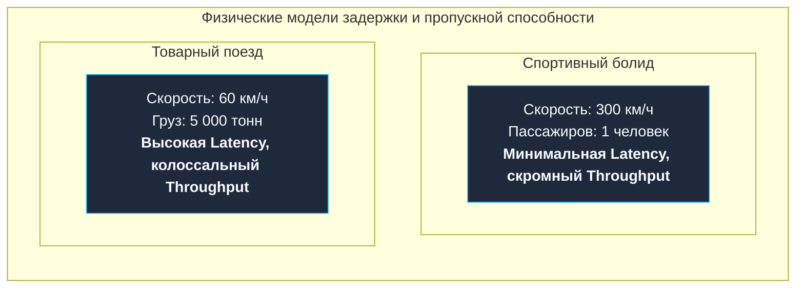
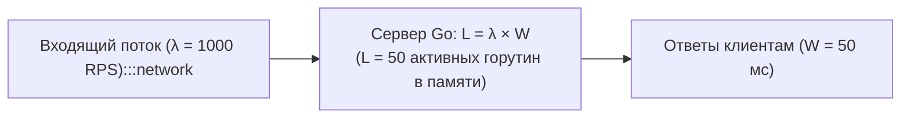
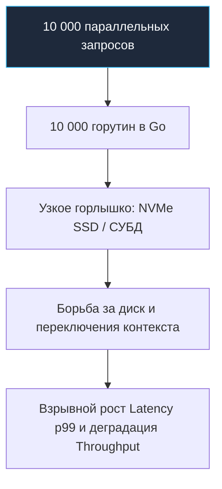
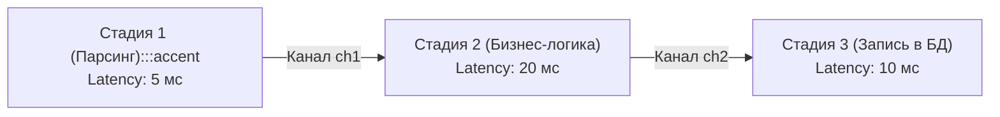

## Что такое Latency и Throughput

В инженерной практике термины «быстродействие» и «производительность» часто используют как синонимы, что порождает грубейшие архитектурные ошибки. Система может отвечать на отдельный запрос молниеносно, но захлёбываться уже при сотне одновременных пользователей. И наоборот: сервис может перемалывать колоссальные объёмы данных в секунду, заставляя каждого отдельного клиента томиться в мучительном ожидании.

Чтобы мыслить о производительности строго, мы обязаны развести два фундаментальных понятия:

- **Latency (задержка / время отклика):** время, необходимое системе для выполнения одной неделимой операции от момента её инициации клиентом до получения готового результата. В веб-разработке это время ожидания ответа браузером или мобильным приложением (миллисекунды или микросекунды).
- **Throughput (пропускная способность):** количество полезных операций или объём данных, который система способна успешно обработать за единицу времени. В бэкенде это классическая метрика «запросов в секунду» (RPS — Requests Per Second) или мегабайт в секунду.



Бытовая аналогия: спортивный двухместный автомобиль преодолевает дистанцию между городами за 1 час (минимальная задержка — latency), но перевозит всего одного пассажира. Тяжёлый товарный поезд ползёт ту же дистанцию 5 часов (высокая задержка), но доставляет 5 000 тонн груза за один рейс (огромная пропускная способность — throughput).

Другая физическая модель — водопроводная труба. **Latency** — это время, за которое конкретная капля воды проходит путь от вентиля до крана. **Throughput** — это объём воды (литры в секунду), вытекающий из трубы, определяемый её диаметром и напором насоса.

Фундаментальный вывод: **latency и throughput не являются строго обратно пропорциональными величинами**. Быстрое исполнение одной изолированной функции в бенчмарке не гарантирует высокую пропускную способность под реальной нагрузкой, а рекордный throughput распределённой системы часто достигается ценой сознательного увеличения задержки отдельных запросов (например, за счёт пакетной обработки — батчинга).

---

## Закон Литтла — мост между Latency и Throughput

Каким математическим законом связаны задержка, пропускная способность и конкурентность? Этот мост описывается классической теоремой теории массового обслуживания — **Законом Литтла (Little’s Law)**:

$$L = \lambda \times W$$

где:
- $L$ (Queue Length / In-Flight Requests) — среднее число запросов, одновременно находящихся внутри системы (уровень конкурентности — concurrency);
- $\lambda$ (Arrival Rate / Throughput) — средняя интенсивность входящего потока (количество обработанных запросов в секунду);
- $W$ (Wait Time / Latency) — среднее время пребывания одного запроса в системе (полная задержка).



В Go-сервисе переменная $L$ имеет совершенно осязаемое физическое воплощение: это **количество горутин, одновременно исполняющих обработку запросов** в данный момент времени.

> [!tip] Собеседование
> **Вопрос:** Объясните закон Литтла на примере HTTP-сервера.
> **Ожидаемый ответ:** Закон Литтла гласит: $L = \lambda \times W$. Если наш сервис стабильно обрабатывает поток $\lambda = 1000\text{ запросов/с}$ со средней задержкой $W = 50\text{ мс}$ ($0.05\text{ с}$), то в каждый момент времени внутри рантайма одновременно выполняется $L = 1000 \times 0.05 = 50$ горутин.
> 
> Если внешняя база данных начнёт отвечать медленнее, и задержка $W$ подскочит до $100\text{ мс}$, то для сохранения прежней пропускной способности в 1000 RPS сервер будет вынужден одновременно удерживать уже $L = 1000 \times 0.1 = 100$ горутин. Если же сервер упрётся в лимиты памяти или соединений, начнётся лавинообразный рост очередей и деградация сервиса.

---

## Почему различие критично в Go

Программисты, переходящие в Go из экосистем с тяжёлыми системными потоками операционной системы (Java, C++, C#), часто поддаются эйфории от дешевизны горутин. Начальный стек горутины составляет всего около 2 КБ, что позволяет легко запустить хоть 100 000 горутин на скромном сервере.

Однако **легковесность создания горутины не делает бесплатным её исполнение процессором**. Физические ядра CPU, каналы оперативной памяти и сетевые интерфейсы остаются строго ограниченными ресурсами.



> [!warning] Ловушка / Gotcha
> Запуск 10 000 горутин для 10 000 одновременных клиентов даёт иллюзию колоссального throughput. Но если каждая горутина выполняет блокирующий системный вызов к диску или тяжёлый запрос к PostgreSQL, латентность каждой отдельной операции катастрофически деградирует из-за конкуренции за дисковую очередь и очередей планировщика ядра Linux. В итоге реальный throughput упадёт ниже плинтуса. Никогда не путайте понятия «много параллельных задач» и «быстрая обработка».

Инженер обязан понимать, какой ценой покупается пропускная способность. Например, внедрение буферизированных каналов и агрегация мелких записей в буфер (`bufio.Writer`) резко увеличивает throughput ценой небольшой дополнительной задержки на накопление батча.

---

## Измерение Latency и Throughput

### Latency

Оценивать задержку по среднему арифметическому значению (Average Latency) категорически запрещено — это самообман. Серверные задержки всегда исследуют через **перцентили**:

- **p50 (медиана):** типичное время ответа для половины пользователей.
- **p95:** 95% запросов завершились быстрее этого порога; показывает границу стабильности.
- **p99 (хвостовая задержка — Tail Latency):** наихудший опыт 1% пользователей. Именно этот хвост определяет стабильность сложных микросервисных цепочек.

Подробнее эта математика раскрывается в статьях [[6. Метрики. p50, p95, p99]] и [[7. Tail latency и почему она важна]].

В Go-коде задержка одиночной операции замеряется стандартным `time.Since(start)`, а распределение задержек внутри конвейера анализируется через бенчмарки пакета `testing.B` и инструмент трассировки `go tool trace`.

### Throughput

Пропускная способность измеряется в операциях в секунду:
- RPS (Requests Per Second) для веб-серверов и API Gateway;
- IOPS (I/O Operations Per Second) для баз данных и дисковых подсистем;
- сообщений в секунду для брокеров Apache Kafka и NATS.

Throughput калибруется инструментами генерации открытой нагрузки ([[1. Load testing]]), микробенчмарками ([[2. Benchmarking в Go]]) и телеметрией Prometheus ([[8. Observability и performance]]).

---

## Mechanical Sympathy: что под капотом влияет на Latency и Throughput

1. **Системные вызовы и смена колец защиты (Syscalls):**  
   Каждый переход процессора из пространства пользователя (Ring 3) в пространство ядра (Ring 0) через инструкцию `SYSCALL` обходится в сотни наносекунд аппаратного оверхеда. Множество мелких вызовов `write()` раздувают latency каждого запроса и сжигают такты CPU. Буферизация и сброс данных крупными блоками увеличивают суммарный throughput ценой незначительного роста задержки на сборку пакета.
2. **Планировщик Go и модель G-M-P:**  
   Когда тысячи горутин жадно делят вычислительные мощности (см. [[1. Scheduler Go. G-M-P модель]]), планировщик тратит такты на переключение контекстов и распределение работы (Work Stealing). Если искусственно задать `GOMAXPROCS` выше реального числа физических ядер CPU, планировщик ОС начнёт вытеснять системные потоки `M`, порождая промахи кэша L1i/L1d и взрывной рост задержки.
3. **Сборщик мусора (Garbage Collector):**  
   Конкурентный трёхцветный GC в Go минимизирует паузы полной остановки мира (см. [[6. GC pause и latency]]). Однако во время фазы активной маркировки рантайм выделяет до 25% ресурсов CPU на работу маркёров (Mark Assist), отбирая их у горутин приложения. Это напрямую срезает пиковый throughput и увеличивает задержку запросов, интенсивно аллоцирующих память в куче.
4. **Когерентность кэшей и False Sharing:**  
   Когда горутины на соседних физических ядрах одновременно модифицируют независимые переменные, расположенные в пределах одной 64-байтной кэш-линии процессора ([[8. False sharing]]), протокол когерентности MESI непрерывно инвалидирует кэши L1/L2. Задержка операций возрастает в десятки раз, а суммарный throughput деградирует.

---

## Горутины, конвейеры и соотношение Latency/Throughput

Представим конвейер обработки данных (Pipeline), разбитый на три последовательные стадии, соединённые каналами. Каждая стадия выполняется в отдельной горутине:



- **Узкое горлышко (Bottleneck):** Максимальный throughput конвейера всегда определяется **самой медленной стадией** (в данном примере — Стадией 2, способной выдать не более $1 / 0.02 = 50\text{ оп/с}$).
- **Влияние буферизации каналов:** Если каналы не буферизированы, Стадия 1 будет простаивать в ожидании освобождения Стадии 2. Добавление буфера в канал сглаживает пики входящего трафика и повышает Throughput. Однако, если Стадия 2 устойчиво отстаёт, буфер переполняется, и каждый элемент проводит в очереди дополнительное время. **Throughput стабилизируется, но Latency каждого элемента возрастает на время ожидания в буфере!**

> [!info] Под капотом
> Каналы в Go внутри представлены структурой `hchan`, содержащей циклический буферный массив, мьютекс и двухсвязные списки заблокированных горутин `sudog`. Буферизация позволяет отправителю записать данные и мгновенно продолжить выполнение без переключения контекста, повышая суммарный throughput ценой задержки хранения в очереди.

---

## Выбор приоритета: Latency vs Throughput

В реальных продуктовых системах инженер всегда выбирает компромисс, исходя из SLA бизнеса:

- **HFT и торговые шлюзы (High-Frequency Trading):** Абсолютный приоритет минимальной и предсказуемой задержки (Ultra-Low Latency). Ради выигрыша 5 микросекунд разработчики жертвуют пропускной способностью, выделяют под горутины изолированные ядра CPU (Core Pinning) и избегают очередей.
- **Пакетная обработка и ETL (Batch Processing):** Абсолютный приоритет Throughput. Обработать 100 миллионов записей за ночь — главная задача; завершится ли конкретная запись за 10 миллисекунд или за 5 секунд — не имеет значения.
- **Интерактивные веб-сервисы:** Прагматичный баланс. Требуется удерживать хвостовую задержку p99 в рамках строгих SLO (например, <150 мс), не раздувая кластер серверов сверх меры.

### Паттерн: Защита Latency через ограничение конкурентности

Чтобы перегрузка не разрушила задержку веб-сервера, применяется паттерн ограничения конкурентности с помощью семафора на базе буферизированного канала:

```go
// Ограничиваем число одновременно выполняемых запросов
sem := make(chan struct{}, maxConcurrency)

http.HandleFunc("/", func(w http.ResponseWriter, r *http.Request) {
    // Пытаемся занять слот в семафоре
    sem <- struct{}{}
    defer func() { <-sem }()

    // Выполняем полезную работу в предсказуемых условиях
    processRequest(w, r)
})
```

В этом сценарии мы сознательно ограничиваем пиковый throughput сервиса ради того, чтобы задержка допущенных в обработку запросов оставалась стабильной и не деградировала до таймаутов.

---

## Связь с законом Амдала

[[4. Amdahl law и масштабирование]] строго доказывает: предельное ускорение системы при распараллеливании ограничено долей её последовательного кода.

Если 20% логики алгоритма принципиально последовательны (например, запись в общую структуру под мьютексом), то даже на 1000-ядерном процессоре вы не сможете ускорить систему более чем в 5 раз. При этом попытка запустить 1000 горутин лишь увеличит задержку из-за конкуренции за мьютекс и очередей планировщика.

> [!warning] Ловушка / Gotcha
> Попытка распараллелить вычислительную CPU-bound задачу на 64 горутины на скромном 8-ядерном сервере приведёт к парадоксальному результату: throughput сервиса упадёт, а latency взлетит. Процессор захлебнётся в борьбе за кэш-линии и переключения контекста. Доверяйте только объективным замерам!

---

## Измерение в Go: пример бенчмарка

Для раздельной оценки задержки одиночного вызова и пропускной способности под параллельной нагрузкой в пакете `testing` применяются различные режимы:

```go
// Замер изолированной задержки последовательного исполнения
func BenchmarkLatency(b *testing.B) {
    for i := 0; i < b.N; i++ {
        // Эмулируем целевую операцию
        time.Sleep(10 * time.Microsecond)
    }
}

// Замер пропускной способности при конкурентном исполнении
func BenchmarkThroughput(b *testing.B) {
    b.RunParallel(func(pb *testing.PB) {
        for pb.Next() {
            // Конкурентная работа без взаимных блокировок
            computeHash()
        }
    })
}
```

Глубокие техники анализа и калибровки тестов рассматриваются в статьях [[2. Benchmarking в Go]] и [[3. go test -bench под капотом]].

---

## Итог

1. **Latency** (задержка одной операции) и **Throughput** (число операций в единицу времени) — различные, но математически связанные через Закон Литтла метрики.
2. В языке Go горутины позволяют легко достичь огромного Throughput, но удержание стабильной Latency требует понимания физики: блокировок ввода-вывода, работы сборщика мусора и структуры кэшей процессора.
3. Оптимизация — это искусство осознанных компромиссов. Пакетная обработка увеличивает пропускную способность ценой задержки; ограничение параллелизма спасает задержку ценой пропускной способности.
4. Никогда не полагайтесь на интуицию: калибруйте обе метрики под реальной нагрузкой.

В следующей статье [[3. CPU bound vs IO bound задачи]] мы научимся безошибочно классифицировать характер нагрузки и точно определять, в какой именно аппаратный ресурс упирается наше Go-приложение.