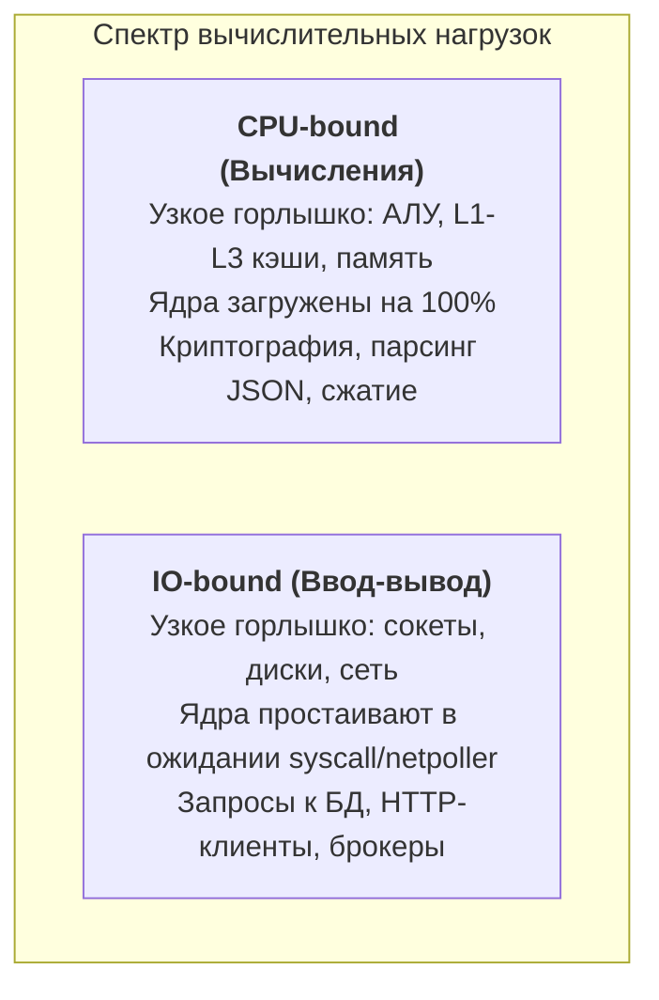
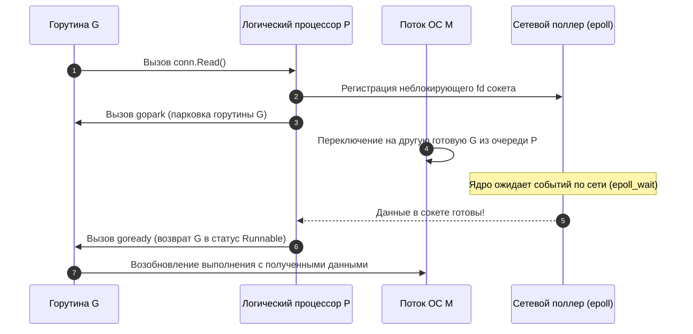

## Классификация задач по типу узкого места

В предыдущей статье [[2. Latency vs throughput]] мы развели понятия задержки и пропускной способности. Теперь пришло время ответить на фундаментальный диагностический вопрос: **чем именно занято время процессора**, когда наш сервис выполняет полезную работу? Тратит ли он драгоценные такты на математические расчёты или томится в ожидании ответа от сетевой карты и дискового контроллера?

Классификация нагрузок на «вычислительно-ограниченные» (CPU-bound) и «ограниченные вводом-выводом» (IO-bound) — это инженерный фундамент. От неё зависит всё: от настройки пулов горутин и калибровки `GOMEMLIMIT` до выбора профилировочных инструментов и оптимизации многопоточности в Go.



---

### Определения

**CPU-bound (вычислительно-ограниченная) задача** — задача, чья предельная скорость выполнения лимитирована исключительно производительностью процессора: тактовой частотой ядер, шириной конвейера инструкций, эффективностью предсказателя переходов и пропускной способностью подсистемы памяти. Арифметико-логическое устройство (АЛУ) работает на пределе возможностей, а время ожидания периферийных устройств стремится к нулю.

**IO-bound (ограниченная вводом-выводом) задача** — задача, чья скорость упирается в задержку (latency) или пропускную способность (bandwidth) внешних устройств ввода-вывода: сети, дискового массива, терминала или межпроцессного взаимодействия (IPC). Вычислительные ядра большую часть времени простаивают в ожидании поступления очередного пакета или прерывания от контроллера.

В реальной жизни абсолютно «чистые» нагрузки встречаются редко. Типичный веб-хэндлер представляет собой смешанный конвейер:
1. Распарсить JSON-запрос из байтового среза (CPU-bound);
2. Сделать запрос по сети к реляционной СУБД или Redis (IO-bound);
3. Вычислить скидку или проверить права доступа (CPU-bound);
4. Сериализовать ответ и отправить его клиенту по сокету (CPU + IO).

Ключевое мастерство инженера — безошибочно выявить **доминирующее ограничение** системы в конкретный момент времени под реальной нагрузкой.

---

### Почему Go-разработчику это важно

Лёгкость горутин и удобство их создания через ключевое слово `go` создают у начинающих разработчиков опасную иллюзию: кажется, будто можно просто запустить 50 000 горутин и рантайм сам решит все проблемы производительности. Это фатальное заблуждение.

- **Для CPU-bound нагрузки:** Создание горутин сверх числа логических процессоров `GOMAXPROCS` контрпродуктивно. Оно порождает бесполезную борьбу за кванты планировщика, сбросы конвейера CPU, вымывание L1-кэша и деградацию throughput (см. [[1. Scheduler Go. G-M-P модель]], [[4. Контекстные переключения]]).
- **Для IO-bound нагрузки:** Напротив, искусственное занижение числа горутин приведёт к простою сетевых интерфейсов и падению общей пропускной способности. Однако их бесконтрольное разрастание исчерпает память под стеки, переполнит очереди ожидания и разрушит хвостовую задержку ([[7. Tail latency и почему она важна]]).

Точная классификация определяет стратегию оптимизации: настраивать ли алгоритмику и локальность кэша или оптимизировать мультиплексирование сокетов и пулы соединений.

---

## Как определить тип границы: признаки и инструменты

### Признаки CPU-bound

- Метрика `%user` в системных утилитах `top` или `htop` стабильно держится около 100% на всех выделенных ядрах.
- Высокая суммарная утилизация CPU при минимальном значении ожидания ввода-вывода (`%iowait` близко к 0).
- Пропускная способность (Throughput) практически не растёт при увеличении пула горутин сверх числа доступных физических ядер.
- В топе CPU-профайлера (`pprof -top`) доминируют вычислительные функции: математические расчёты, сериализация, хэширование (`runtime.memhash`, `crypto/sha256`) или работа сборщика мусора.
- В трассировщике `go tool trace` фазы исполнения `Proc start` длятся долго и не прерываются вызовами `Proc stop`.

### Признаки IO-bound

- Процессорные ядра загружены слабо (утилизация CPU ниже 60–70%), либо наблюдается заметный процент `%iowait` (при блокирующем дисковом вводе-выводе).
- Пропускная способность сервиса линейно масштабируется при увеличении числа параллельных соединений/горутин до достижения физического предела пропускной способности сети или базы данных.
- CPU-профайлер показывает, что значительная часть времени уходит в ожидание сетевого поллера: `runtime.netpollblock`, `syscall.Read`, `epollwait`.
- Профайлеры задержек блокировок (`block` profile, [[5. block profile]]) и мьютексов (`mutex` profile, [[6. mutex profile]]) фиксируют длительные задержки на каналах и сокетах.

---

### Профайлеры и трассировка

В инструментарии Go заложены точные средства объективной классификации:

- **CPU profiling** (`runtime/pprof`, [[2. CPU profiling в Go]]): собирает сэмплы исключительно в те моменты, когда горутина *активно исполняется* на ядре процессора. Если горутина спит в ожидании сетевого ответа, она физически не попадёт в сэмплы CPU-профайлера!
- **Block profile** ([[5. block profile]]): фиксирует события блокировок горутин — ожидание каналов, захват мьютексов, паузы ввода-вывода. Это идеальный инструмент для препарирования IO-bound задержек.
- **Execution tracer** (`go tool trace`, [[3. execution tracer]]): визуализирует жизненный цикл горутин в трёх канонических состояниях рантайма:
  - `Executing` (горутина активно сжигает такты CPU);
  - `Runnable` (горутина готова исполняться, но ожидает свободного логического процессора $P$);
  - `Waiting` (горутина заблокирована на канале, мьютексе или системном вызове ввода-вывода).

Если трассировка показывает доминирование состояния `Waiting` — вы имеете дело с классическим IO-bound поведением.

> [!tip] Собеседование
> **Вопрос:** Как быстро определить, является ли сервис CPU-bound или IO-bound, не имея сложного мониторинга?
> **Ответ:** Достаточно сопоставить значение `GOMAXPROCS` и реальную загрузку процессора сервером под нагрузкой. Если все ядра загружены под 100%, а задержка линейно растёт с добавлением параллельных клиентов — сервис упёрся в CPU. Если ядра загружены менее чем на 70%, а задержка растёт при увеличении concurrency — узкое место кроется во вводе-выводе (БД, сторонние API, диск). Снятие 30-секундного профиля CPU (`curl localhost:6060/debug/pprof/profile?seconds=30`) расставит все точки над i.

---

## Механика ОС и Go при разной нагрузке

Поведение рантайма Go при вычислительной и сетевой нагрузке кардинально различается на системном уровне.

### CPU-bound: монопольное владение ядром

Когда горутина выполняет непрерывные вычисления (например, факторизацию матриц или перебор хэшей), она не совершает добровольных системных вызовов. Планировщик Go организует вытеснение (Preemption) с помощью проверок флагов стека при вызовах функций или через асинхронные сигналы операционной системы (`SIGURG` в современных версиях Go).

Внутри модели планировщика G-M-P:
- Логический процессор $P$ может исполнять в единицу времени строго одну горутину $G$ на одном потоке ОС $M$.
- Если число активных вычислительных горутин превышает количество доступных процессоров `GOMAXPROCS`, лишние горутины выстраиваются в локальные очереди `runqueue` и ждут своего кванта времени.
- Постоянные переключения между ними вызывают сбросы регистров, промахи мимо кэша инструкций L1i и накладные расходы планировщика ([[4. Контекстные переключения]]). Кроме того, если горутины работают с общими данными, неизбежно возникает паразитный сброс кэш-линий — False Sharing ([[8. False sharing]]).

**Инженерный закон:** Для чистых CPU-bound задач оптимальное число одновременно исполняющихся горутин строго равно **числу доступных ядер (GOMAXPROCS)**. Дальнейшее умножение горутин лишь увеличивает накладные расходы.

---

### IO-bound: передача управления без блокировки

Когда горутина обращается к сетевому соединению (например, вызывает метод `conn.Read()`), в работу вступает компонент рантайма — **сетевой поллер (Netpoller)** (см. [[4. epoll, kqueue и netpoller]]). В Linux он базируется на механизме системного вызова `epoll`, в macOS и BSD — на `kqueue`, а в Windows — на I/O Completion Ports (IOCP).



В отличие от традиционных потоков C/C++, горутина в Go не блокирует поток операционной системы $M$ на время ожидания сетевого пакета! Она переводится рантаймом в спящее состояние парковки (`gopark`), а освободившийся поток $M$ мгновенно берет следующую горутину из очереди $P$ или крадет задачу у соседнего процессора через алгоритм Work Stealing ([[3. Work stealing]]).

Благодаря этому Go-сервер легко удерживает 100 000 открытых сетевых сокетов, задействуя всего десяток потоков ядра ОС.

### Исключение: Блокирующий файловый ввод-вывод

Сетевые сокеты в Linux можно опрашивать асинхронно через `epoll`. Но со стандартными файлами на диске это не работает: традиционные вызовы `os.ReadFile`, `read()` и `write()` к файловой системе являются блокирующими (блокируют поток ОС целиком).

Когда горутина совершает блокирующий файловый вызов, рантайм Go вынужден выполнить системные процедуры:
- `entersyscallblock`: логический процессор $P$ открепляется от заблокированного потока $M$.
- Поток $M$ остаётся ждать завершения дисковой операции, а процессор $P$ захватывает другой свободный поток из пула рантайма (или порождает новый системный поток ОС).
- `exitsyscall`: после завершения чтения горутина пытается вновь привязать поток к свободному процессору $P$.

Именно поэтому интенсивный файловый ввод-вывод создаёт гораздо более тяжёлую нагрузку на планировщик ОС, чем работа с сетью.

> [!info] Под капотом
> В исходниках `runtime` функции `entersyscallblock` и `exitsyscall` реализуют протокол передачи процессора $P$. Если ваше приложение бесконтрольно читает файлы на диске в 10 000 горутин, рантайм Go может создать сотни потоков ОС $M$, что приведёт к исчерпанию лимитов дескрипторов ядра и повышенному расходу оперативной памяти на стеки ОС.

---

## Mechanical Sympathy: что происходит на уровне CPU и памяти

Для **CPU-bound** задач критичны:
- **Предсказание ветвлений (Branch Prediction):** современный процессор пытается предугадать путь исполнения условий `if/else` (см. [[6. Branch prediction и код]]). Ошибка предсказания приводит к очистке глубокого конвейера инструкций и потере 15–20 тактов.
- **Промахи кэша (Cache Misses):** промах мимо кэша L1 и поход в основную память DRAM обходится в 60–100 наносекунд (200 тактов простоя АЛУ). Поэтому компактные последовательные срезы данных колоссально выигрывают у разрозненных указателей связных списков.
- **Векторизация SIMD:** компилятор Go может использовать векторные инструкции регистров AVX/NEON ([[7. SIMD и Go]]) для параллельной обработки байтовых массивов за один такт.

Для **IO-bound** задач ключевую роль играют аппаратные контроллеры:
- **Прямой доступ к памяти (DMA — Direct Memory Access):** сетевая карта сама сбрасывает принятые кадры Ethernet в оперативную память сервера, не отвлекая CPU.
- **Аппаратные прерывания (Hardware Interrupts):** завершив передачу пакета, контроллер прерывает процессор, ядро Linux переводит сокет в статус готового к чтению, а Netpoller разблокирует спящую горутину.
- **Zero-Copy архитектура:** минимизация копирований между пространством ядра и буферами приложения ([[5. Zero copy подходы]]).

---

## Связь с масштабированием и законом Амдала

Характер нагрузки определяет предел масштабируемости сервиса:

- **CPU-bound задачи подчиняются [[4. Amdahl law и масштабирование]]:** ускорение сервиса строго ограничено долей последовательного кода. Если 10% алгоритма не поддаются параллелизму (например, запись под общим мьютексом), то даже на компьютере с 1 000 ядер максимальное теоретическое ускорение составит не более 10 раз.
- **IO-bound задачи подчиняются Закону Густавсона (Gustafson's Law):** с ростом числа ядер мы можем пропорционально увеличивать объём одновременно обслуживаемых независимых соединений, упираясь лишь в физический канал сети и пропускную способность шины PCIe.

---

## Стратегии оптимизации в зависимости от типа границы

### Если приложение CPU-bound:

1. **Ограничьте число горутин:** зафиксируйте размер пула вычислительных воркеров на уровне `GOMAXPROCS`, исключив избыточный шедулинг.
2. **Оптимизируйте алгоритмы:** снижайте вычислительную сложность $O(N^2) \rightarrow O(N \log N)$, применяйте предрасчитанные таблицы поиска (Lookup Tables).
3. **Обеспечьте Cache Friendliness ([[8. Cache friendliness]]):** выравнивайте поля структур в памяти, упаковывайте данные в непрерывные срезы, избавляйтесь от лишних указателей.
4. **Помогайте компилятору инлайнить функции ([[5. Inline и влияние на performance]]):** делайте горячие методы лаконичными, чтобы компилятор встраивал их тело прямо в место вызова без накладных расходов на вызов функции.
5. **Профилируйте CPU:** находите топ функций по числу сэмплов в `pprof` и точечно оптимизируйте горячие ветви.

### Если приложение IO-bound:

1. **Увеличивайте конкурентность:** масштабируйте количество горутин до тех пор, пока система не упрётся в пропускную способность сетевой карты, базы данных или лимиты соединений.
2. **Буферизируйте ввод-вывод:** используйте `bufio.Reader/Writer` (`bufio.Reader` и `bufio.Writer`), пулы соединений (`sql.DB`, `net.Conn`), чтобы амортизировать накладные расходы на системные вызовы ядра ([[1. Системные вызовы и их стоимость]]).
3. **Используйте пулы постоянных соединений:** переиспользуйте открытые TCP-сокеты (`sql.DB`, `net.Conn`, `http.Client`), исключая избыточный тройной handshake при каждом запросе.
4. **Применяйте асинхронные шаблоны:** распределяйте независимые сетевые запросы через паттерн fan-out/fan-in с контролем хвостовых задержек ([[7. Tail latency и почему она важна]]).
5. **Оптимизируйте дисковый ввод-вывод:** используйте асинхронный системный интерфейс `io_uring` в ядре Linux либо изолируйте дисковые операции в выделенный ограниченный пул горутин.

---

## Пример: определение типа и адаптация

Рассмотрим практический сервис, совмещающий оба типа нагрузок:

```go
package main

import (
	"crypto/sha256"
	"fmt"
	"net/http"
	_ "net/http/pprof"
	"time"
)

// cpuBound симулирует интенсивные вычисления
func cpuBound() [32]byte {
	data := []byte("some data to hash")
	// Выполняем активную работу на регистрах и АЛУ
	for i := 0; i < 100000; i++ {
		data = append(data, byte(i%256))
	}
	return sha256.Sum256(data)
}

// ioBound симулирует блокирующее сетевое взаимодействие
func ioBound() string {
	resp, err := http.Get("https://httpbin.org/get")
	if err != nil {
		return err.Error()
	}
	defer resp.Body.Close()
	return resp.Status
}

func handler(w http.ResponseWriter, r *http.Request) {
	// Смешанный сценарий: вычисления + сетевой запрос
	_ = cpuBound()
	status := ioBound()
	fmt.Fprintf(w, "Status: %s\n", status)
}

func main() {
	// Запускаем диагностический эндпоинт pprof на порту 6060
	go func() {
		_ = http.ListenAndServe("localhost:6060", nil)
	}()

	http.HandleFunc("/", handler)
	_ = http.ListenAndServe(":8080", nil)
}
```

Снимем 30-секундный профиль процессора:
```bash
go tool pprof -http=:8081 localhost:6060/debug/pprof/profile?seconds=30
```

Если во вкладке Top доминируют вызовы `crypto/sha256` и `runtime.memhash` — узким местом является алгоритмический блок `cpuBound`. Если же в профиле блокировок (`debug/pprof/block`) видно долгое ожидание в сокете `net.(*netFD).Read` — оптимизировать нужно сетевой вызов `http.Get`.

---

## Частые ошибки и ловушки

- **Ложная диагностика первопричины:** Видя высокую утилизацию CPU, разработчик слепо увеличивает число горутин, усугубляя ситуацию конкуренцией за логические процессоры.
- **Иллюзия неблокирующего диска:** Традиционные файловые операции в стандартной библиотеке блокируют поток ОС $M$. Неконтролируемый запуск файловых операций может породить сотни потоков ядра. Для экстремальной производительности применяют `io_uring`.
- **Игнорирование хвостовых задержек в IO-bound:** Большое количество одновременных запросов к СУБД способно удерживать средний Throughput, но хвостовой перцентиль p99 улетит в бесконечность из-за очереди на соединение.
- **Скрытая конкуренция за CPU со стороны Garbage Collector:** Интенсивные аллокации в теле цикла приводят к тому, что фаза разметки GC отбирает до четверти тактов процессора, заставляя чистый алгоритм выглядеть медленным (см. [[9. Когда GC становится bottleneck]]).

> [!warning] Ловушка / Gotcha: Сетевой поллер в профиле
> В высоконагруженных сетевых Go-сервисах функции `runtime.findrunnable` или `epollwait` могут занимать заметное место в профиле. Не путайте это с вычислительной нагрузкой: если поток находится внутри `epollwait`, он не «сжигает» процессор, а находится в режиме энергосберегающего сна ядра Linux, ожидая сетевого пакета.

---

## Итог

1. **CPU-bound и IO-bound** — полярные типы нагрузок, требующие диаметрально противоположных инженерных решений.
2. Для **CPU-bound** задач идеальный пул горутин строго ограничен `GOMAXPROCS`. В фокусе внимания — $O$-сложность, эффективность кэшей CPU и снижение аллокаций.
3. Для **IO-bound** задач число горутин масштабируется в тысячи раз благодаря Netpoller. В фокусе внимания — пулы постоянных соединений, неблокирующий опрос сокетов и буферизация.
4. Используйте профайлеры CPU, Block-профилирование и трассировщик `go tool trace`, чтобы принимать решения на основе объективных измерений.

В следующей статье мы применим полученное понимание к математическому расчёту пределов масштабирования: [[4. Amdahl law и масштабирование]].