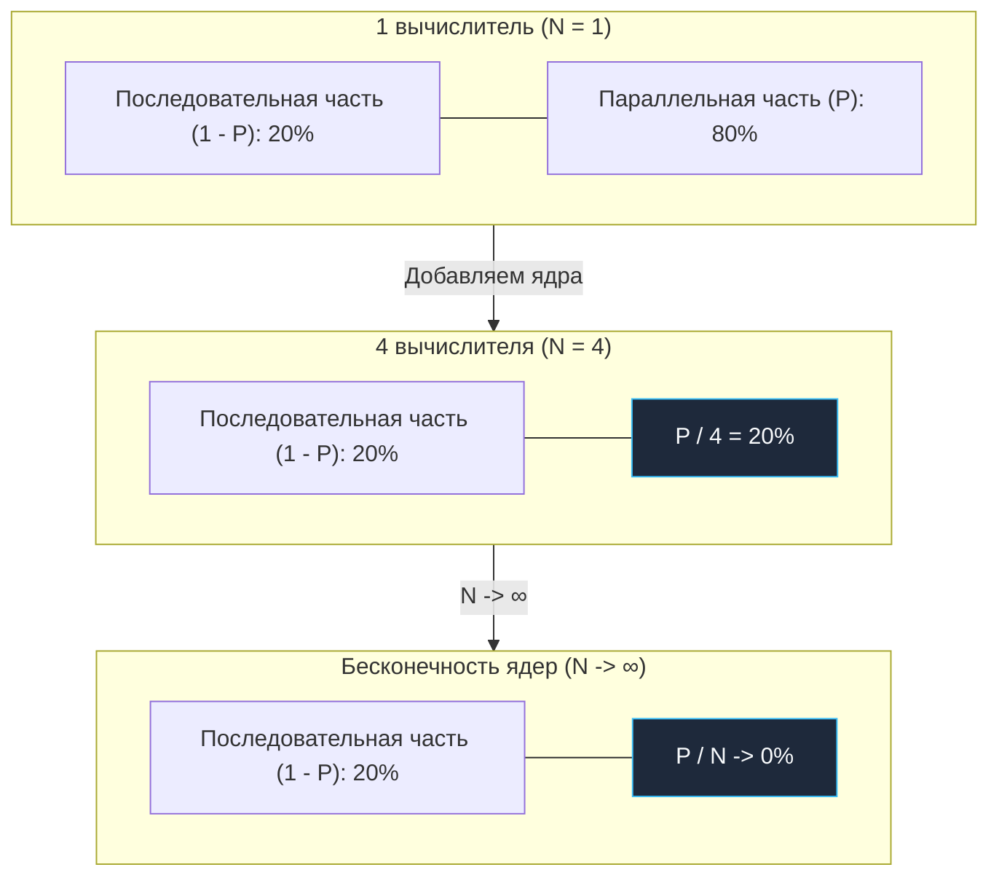
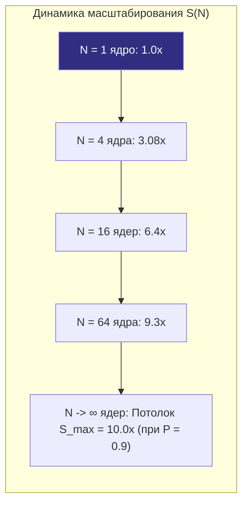
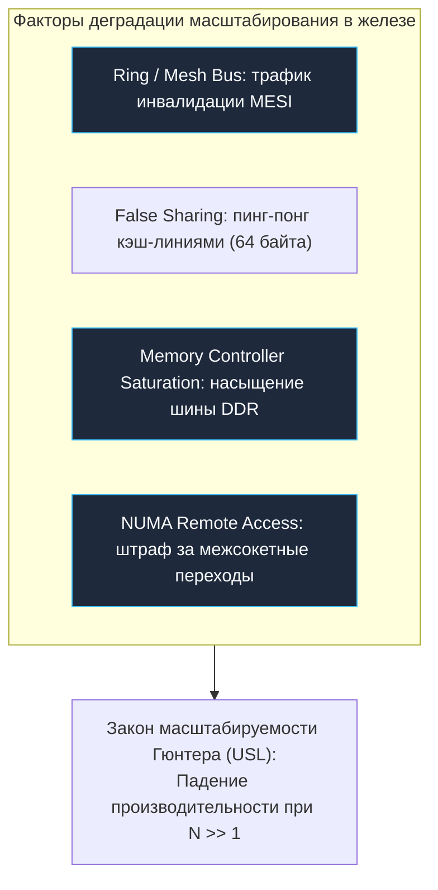

## Закон Амдала: математика масштабирования

В [[2. Latency vs throughput]] мы развели по разным углам ринга время отклика и пропускную способность, а в [[3. CPU bound vs IO bound задачи]] классифицировали вычислительную нагрузку по типу лимитирующего ресурса. Теперь вооружимся строгой количественной моделью, которая отвечает на один из самых дорогих вопросов в промышленной инженерии: *«Если мы удвоим количество вычислительных ядер или серверов, насколько именно ускорится наша система?»*

Эта фундаментальная модель — **закон Амдала** (Amdahl's Law).

Джин Амдал сформулировал свой знаменитый принцип в 1967 году на весенней объединенной компьютерной конференции AFIPS. В то время индустрия стояла на перепутье: одни верили в безграничную мощь массивного параллелизма (проекты вроде ILLIAC IV), другие сомневались. Амдал задал прагматичный вопрос: *какое теоретически достижимое ускорение может получить задача, если некоторая её часть принципиально не поддаётся распараллеливанию и обязана выполняться строго последовательно?*

В контексте серверной разработки на Go закон Амдала — это не сухая академическая теорема из учебников по дискретной математике. Это повседневный инструмент архитектора. Он уберегает инженерные команды от фатальной ошибки: выделения многоядерных инстансов на 64 или 128 vCPU для сервисов, производительность которых на самом деле зажата в тисках одного невидимого мьютекса или последовательной синхронизации рантайма.

> [!NOTE] Метафора Кернигана: Девять женщин и один ребёнок
> В фольклоре управления разработкой ПО со времен Фредерика Брукса («Мифический человеко-месяц») бытует афоризм: *«Девять женщин не могут родить ребёнка за один месяц»*. 
> Если вы строите дом, вы можете нанять сто каменщиков, и они сложат кирпичные стены в десять раз быстрее, чем десять рабочих. Но когда дело доходит до заливки фундамента из бетона, ему требуется ровно 28 суток для набора марочной прочности. Вы можете согнать на стройплощадку хоть тысячу инженеров, включить миллиард ядер и запустить миллион горутин — пока сохнет бетон (последовательная фаза), работа стоит. Бетонная стяжка и есть то самое последовательное горлышко, определяющее предел скорости всей стройки.

---

### Формулировка

Пусть общее время выполнения задачи на одном вычислителе равно $T(1) = 1$. Разделим его на две составляющие:
- $P$ — доля времени выполнения задачи, которая **может** быть идеально распараллелена ($0 \le P \le 1$).
- $1 - P$ — доля времени, которая **обязана** выполняться строго последовательно (serial fraction).
- $N$ — количество равноправных вычислителей (ядер CPU, потоков ОС или горутин при условии их равномерного параллельного исполнения на свободных ядрах).

Если параллельная часть ускоряется пропорционально числу вычислителей в $N$ раз, то новое время выполнения $T(N)$ составит:

$$T(N) = (1 - P) + \frac{P}{N}$$

Тогда коэффициент ускорения (speedup) $S(N)$, определяемый как отношение времени выполнения на одном ядре к времени выполнения на $N$ ядрах, выражается классической формулой закона Амдала:

$$S(N) = \frac{T(1)}{T(N)} = \frac{1}{(1 - P) + \frac{P}{N}}$$

```
                       1
  S(N) = ─────────────────────────
                  P
         (1 - P) + ───
                   N
```

#### Асимптотический предел (The Asymptotic Ceiling)

Что произойдет, если мы устремим число ядер к бесконечности ($N \to \infty$)? Дробь $\frac{P}{N}$ устремится к нулю, и мы получим теоретический потолок ускорения:

$$S_{max} = \lim_{N \to \infty} S(N) = \frac{1}{1 - P}$$

Этот математический вывод отрезвляет любого инженера: **даже на гипотетической машине с бесконечным числом ядер процессорного кластера последовательная часть задачи ставит непреодолимый потолок производительности.**

Посмотрим на сухие цифры:
- **$P = 0.50$ (50% параллельно, 50% последовательно):** $S_{max} = 1 / 0.5 = 2.0\times$. Сколько бы тысяч ядер вы ни выделили сервису, он никогда не станет работать быстрее, чем в 2 раза по сравнению с одним ядром.
- **$P = 0.80$ (80% параллельно, 20% последовательно):** $S_{max} = 1 / 0.2 = 5.0\times$. 20% последовательного кода ограничивают ускорение пятикратной планкой.
- **$P = 0.95$ (95% параллельно, 5% последовательно):** $S_{max} = 1 / 0.05 = 20.0\times$. На 16 ядрах ускорение составит $S(16) \approx 9.14\times$, на 64 ядрах — $15.06\times$, а потолок в $20\times$ недостижим даже на суперкомпьютере.
- **$P = 0.99$ (99% параллельно, 1% последовательно):** казалось бы, идеальный параллельный код! Но $S_{max} = 1 / 0.01 = 100.0\times$. Больше чем в 100 раз ускорить систему невозможно в принципе.

---

### Визуализация эффекта

На следующей диаграмме наглядно показано, как с ростом числа вычислителей параллельная часть сжимается, а последовательный блок $1 - P$ остается неизменным и со временем начинает абсолютно доминировать в суммарной задержке:



А если представить зависимость результирующего ускорения от количества задействованных вычислительных узлов:



На практике это означает, что скромное последовательное «бутылочное горлышко» размером всего в несколько процентов катастрофически снижает отдачу от инвестиций в многоядерное серверное железо. Инженер уровня Senior обязан уметь выявлять такие участки и планомерно уменьшать величину $(1 - P)$.

---

## Закон Амдала и Go: горутины, потоки и синхронизация

Начинающие разработчики часто попадают в концептуальную ловушку: *"Go позволяет запустить миллион горутин буквально в несколько мегабайт памяти. Следовательно, мы можем легко разбить любую задачу на сотни тысяч параллельных частей и обойти ограничения масштабирования!"*

Это фундаментальное заблуждение.

Закон Амдала оперирует не абстрактными «задачами в очереди» и не зелеными потоками, а **фактически выполненной параллельной работой во времени**. Каждая горутина, производящая полезные вычисления над регистрами и памятью, требует реального физического ядра процессора.

Как мы помним из [[1. Scheduler Go. G-M-P модель]], архитектура планировщика Go опирается на три сущности:
- **G (Goroutine):** контекст выполнения, стек и программный счетчик.
- **M (Machine):** поток операционной системы (OS thread).
- **P (Processor):** логический процессор рантайма, контекст для исполнения Go-кода, количество которых строго зафиксировано переменной `GOMAXPROCS`.

Одновременно исполнять машинный код могут не более `GOMAXPROCS` горутин. Все остальные миллионы горутин терпеливо ждут своей очереди в локальных очередях `runq` или глобальной очереди `sched.runq`. Таким образом, в формуле Амдала параметр $N$ для CPU-bound вычислений в Go жестко ограничен сверху:

$$N \le \text{GOMAXPROCS} \le N_{physical\_cores}$$

Если вы запустите 10 000 горутин, выполняющих тяжелую математику на машине с 8 ядрами, эффективное ускорение будет рассчитываться для $N = 8$, а тысячи дополнительных горутин лишь добавят накладные расходы на переключение контекстов и балансировку очередей (work stealing).

### Анатомия скрытых последовательных участков в Go

В любом реальном приложении на Go возникают последовательные участки (serial bottlenecks), которые снижают эффективное значение $P$:

1. **Критические секции синхронизации (`sync.Mutex` и `sync.RWMutex`):**  
   Когда несколько горутин обращаются к разделяемому состоянию (например, общему словарю, счетчику или пулу соединений), мьютекс принудительно выстраивает их в цепочку. Пока одна горутина находится внутри критической секции, остальные либо крутятся в spin-цикле, прожигая такты CPU, либо засыпают через системный семафор. Время внутри критической секции — это чистый $1 - P$.
2. **Точки сбора результатов и каналы:**  
   Паттерны вроде Fan-out / Fan-in требуют агрегации данных. Чтение из небуферизованного канала или ожидание группы горутин через `sync.WaitGroup.Wait()` неизбежно превращается в барьер синхронизации.
3. **Атомарные инструкции с высокой конкуренцией (`sync/atomic`):**  
   Хотя атомики не вызывают контекстных переключений операционной системы, на уровне микроархитектуры процессорные ядра обязаны монополизировать кэш-линию через протоколы когерентности кэшей. В условиях жесткого contention'а атомарные операции сериализуются на шине памяти.
4. **Управление памятью и сборщик мусора (Garbage Collector):**  
   Фазы остановки мира Stop-The-World ([[3. Stop the world]]), такие как sweep termination и mark termination, принудительно останавливают все $P$. Кроме того, если аллокатор рантайма сталкивается с нехваткой страниц в локальном кэше `mcache`, он обращается к глобальному пулу `mcentral` под мьютексом.
5. **Блокирующие системные вызовы ядра:**  
   Синхронные операции дискового ввода-вывода выводят поток $M$ из под контроля $P$ через системные вызовы `entersyscall` / `exitsyscall` (см. [[1. Системные вызовы и их стоимость]]), требуя времени на запуск нового потока ОС или передачу $P$.

Каждый из этих факторов увеличивает долю $1 - P$, обрушивая потенциал многоядерной системы.

---

### Пример расчёта в Go-сервисе

Представим сетевой HTTP-микросервис, обрабатывающий аналитические запросы. Детальный разбор времени обработки одного HTTP-запроса показывает:

```go
func handler(w http.ResponseWriter, r *http.Request) {
    // 1. Последовательная часть: парсинг HTTP-заголовков,
    // валидация авторизационного JWT-токена и маршрутизация: 2% времени.

    // 2. Параллельная вычислительная часть: расчет скоринга: 98% времени.
    // ОДНАКО: внутри этого алгоритма каждая горутина обязана зарегистрировать
    // промежуточный скор в общем инкрементном кэше статистики,
    // защищенном глобальным sync.Mutex.
    // Захват и ожидание этой блокировки занимает 5% от общего времени запроса.
}
```

Разложим доли выполнения:
- Казалось бы, независимый параллельный код занимает 98% ($P_{raw} = 0.98$).
- Но критическая секция под мьютексом внутри «параллельной» части **не может выполняться одновременно несколькими ядрами**. Она автоматически переносится в последовательную компоненту!
- Реальная параллельная доля:
  $$P = 0.98 - 0.05 = 0.93 \quad (93\%)$$
- Последовательная доля:
  $$1 - P = 0.02 + 0.05 = 0.07 \quad (7\%)$$

Рассчитаем ожидаемое ускорение сервиса при развертывании на сервере с $N = 8$ процессорными ядрами:

$$S(8) = \frac{1}{0.07 + \frac{0.93}{8}} = \frac{1}{0.07 + 0.11625} = \frac{1}{0.18625} \approx 5.37\times$$

А если бы мы убрали contention на мьютексе (например, использовали per-worker структуры или lock-free шардирование) и сохранили $P = 0.98$:

$$S_{ideal}(8) = \frac{1}{0.02 + \frac{0.98}{8}} = \frac{1}{0.02 + 0.1225} = \frac{1}{0.1425} \approx 7.02\times$$

Маленькая пятипроцентная задержка на мьютексе отняла почти четверть ($23.5\%$) всей производительности 8-ядерного сервера! А на сервере с 64 ядрами разрыв станет катастрофическим: $11.8\times$ вместо $28.3\times$.

> [!tip] Собеседование: Оценка масштабируемости
> **Вопрос:** В ходе нагрузочного тестирования и профилирования бэкенда на Go выяснилось, что 10% времени обработки запроса уходит на ожидание глобального мьютекса в общем кэше, а оставшиеся 90% — на независимую обработку данных. Какое максимальное ускорение получит сервис, если бизнес выделит сервер с 128 ядрами CPU вместо текущего 4-ядерного?
> 
> **Ответ кандидата уровня Senior:**  
> Ожидание мьютекса — это строго последовательный участок, так как критическая секция в каждый момент времени может исполняться ровно одним потоком. Следовательно, эффективная последовательная доля $1 - P = 0.10$ (10%), а максимальная параллельная доля $P = 0.90$.  
> Согласно закону Амдала, асимптотический потолок ускорения при любом числе ядер равен:
> $$S_{max} = \frac{1}{1 - P} = \frac{1}{0.10} = 10\times$$
> На 4 ядрах текущее ускорение составляло:
> $$S(4) = \frac{1}{0.10 + 0.90 / 4} = \frac{1}{0.325} \approx 3.08\times$$
> На 128 ядрах ускорение составит:
> $$S(128) = \frac{1}{0.10 + 0.90 / 128} = \frac{1}{0.10 + 0.00703} \approx 9.34\times$$
> Относительный прирост от перехода с 4 до 128 ядер (увеличение оборудования в 32 раза!) даст ускорение всего в $9.34 / 3.08 \approx 3.03$ раза. Инвестиции в 128-ядерный сервер экономически нецелесообразны. Первоочередная инженерная задача — устранить сериализацию мьютекса через шардирование, локальные буферы или `sync.Pool`.

---

## Mechanical Sympathy: что в «железе» усиливает закон Амдала

Закон Амдала сформулирован в идеальном математическом мире: он предполагает, что разделение задачи на $N$ частей не создает дополнительных накладных расходов, а процессоры общаются между собой со скоростью мысли.

Реальное кремниевое железо устроено иначе. На практике параллельное исполнение порождает аппаратный оверхед, который с ростом числа ядер начинает не просто замедлять ускорение, а порой делает систему медленнее, чем на одном ядре!

Рассмотрим ключевые аппаратные факторы с позиции Mechanical Sympathy:

### 1. Согласованность кэшей и протокол MESI (Cache Coherence Overhead)
Каждое ядро современного CPU оснащено сверхбыстрыми индивидуальными кэшами L1 (латентность ~1–1.5 нс) и L2 (~3–4 нс). Кэш L3 является общим для ядер кристалла (~10–15 нс). 
Когда горутины, исполняемые на разных ядрах, читают и модифицируют разделяемые данные (даже через атомики), аппаратный протокол когерентности (MESI/MOESI) вынужден поддерживать единый снимок памяти.
Если ядро Core 1 пишет в переменную, кэш-линия в кэшах Core 2..Core 8 мгновенно инвалидируется (состояние *Invalid*). Чтобы другие ядра прочитали новое значение, кэш-линия должна быть передана по межъядерной кольцевой шине (Ring Bus или Mesh Interconnect). 
Особое коварство здесь представляет ложное разделение (**False Sharing**, см. [[8. False sharing]]), когда независимые переменные разных горутин случайно попадают в одну 64-байтную кэш-линию. Возникает эффект cache bouncing: кэш-линия бешено мечется между ядрами, прожигая сотни тактов на такт полезной работы. Этот аппаратный трафик превращает параллельные вычисления в последовательную очередь на межъядерной шине!

### 2. Ограничение пропускной способности памяти (Memory Bus Saturation)
Даже если алгоритм идеально параллелен и не содержит ни одного мьютекса или атомика (embarrassingly parallel), ядра делят между собой общую шину оперативной памяти и контроллеры DDR. Если рабочее множество задачи не помещается в кэш L3 и все $N$ ядер одновременно запрашивают данные из RAM, пропускная способность контроллера памяти (Memory Bandwidth) исчерпывается. Возникает конкуренция на уровне банков памяти: ядра встают в аппаратный wait-state.

### 3. Ошибки предсказания ветвлений и сбросы конвейера
В параллельном коде логика синхронизации изобилует условными проверками (`if`, циклы спин-блокировок). Ошибки блока предсказания переходов (**Branch Prediction**, см. [[6. Branch prediction и код]]) приводят к сбросу 14–20 стадий инструкционного конвейера процессора, превращая такты вычислителей в тепло.

### 4. Прерывания ОС и NUMA-эффекты
В многосокетных серверах память разделена на NUMA-узлы. Обращение ядра одного сокета к памяти другого сокета через шину UPI/Infinity Fabric стоит в 2–3 раза дороже локального доступа. Кроме того, планировщик Linux периодически переключает потоки между ядрами (thread migration), сбрасывая горячие кэши L1/L2.



> [!warning] Подводный камень: Универсальный закон масштабируемости Гюнтера (USL)
> Нил Гюнтер (Neil Gunther) расширил закон Амдала до **Universal Scalability Law (USL)**, добавив учет согласованности (coherency / crosstalk):
> 
> $$S(N) = \frac{N}{1 + \sigma(N - 1) + \kappa N(N - 1)}$$
> 
> - $\sigma$ (контеншн) — классическая последовательная доля Амдала (очереди к мьютексам).
> - $\kappa$ (когерентность) — накладные расходы на поддержание согласованности кэшей и перекрестный обмен сообщениями между узлами ($O(N^2)$ взаимодействий).
> 
> Если $\kappa > 0$, функция $S(N)$ после достижения некоторого оптимума $N^*$ **разворачивается вниз**. Добавление новых ядер или серверов не просто перестает ускорять систему, а начинает лавинообразно замедлять её (Retrograde Scalability). Именно с этим сталкиваются разработчики, когда сервис на 64 vCPU внезапно обрабатывает меньше RPS, чем на 16 vCPU.

---

## Закон Амдала против закона Густавсона

В инженерных дискуссиях часто возникает путаница между законом Амдала и законом Густавсона-Барсиса (Gustafson's Law, 1988). Они отвечают на принципиально разные практические вопросы:

| Критерий сравнения | Закон Амдала (Amdahl's Law) | Закон Густавсона (Gustafson's Law) |
|---|---|---|
| **Главный вопрос** | «Насколько *быстрее* мы решим фиксированную задачу при росте ядер?» | «Насколько *большую* задачу мы решим за фиксированное время при росте ядер?» |
| **Модель нагрузки** | **Strong Scaling** (фиксированный объем данных) | **Weak Scaling** (объем данных масштабируется пропорционально ядрам) |
| **Ограничение** | Фиксированная последовательная доля ставит жесткий предел | Последовательная доля становится ничтожно мала относительно растущего объема данных |
| **Формула** | $S(N) = \frac{1}{(1 - P) + \frac{P}{N}}$ | $S(N) = N - \alpha (N - 1)$, где $\alpha = 1 - P$ |
| **Типичное применение** | Задержка единичного HTTP-запроса, обработка транзакции | Массовая фоновая пакетная обработка, Big Data, MapReduce, аналитика |

В серверных бэкендах, базах данных и распределенных очередях обе модели работают бок о бок:
1. **На уровне системы в целом (Throughput / Weak Scaling):**  
   Когда растет входящий поток пользователей, мы добавляем серверы и ядра. Если запросы полностью независимы (share-nothing архитектура), мы решаем более крупную задачу за то же время. Здесь работает закон Густавсона, и масштабирование выглядит практически линейным.
2. **На уровне обработки каждого отдельного запроса (Latency / Strong Scaling):**  
   Если мы пытаемся распараллелить обработку одного тяжелого пользовательского запроса (например, сложный расчет корзины или поиск по графу) на 16 горутин внутри одного процесса, мы мгновенно упираемся в закон Амдала. Любая точка синхронизации делает добавление ядер бесполезным.

---

## Измерение «P» в реальном коде на Go

Инженеру не пристало гадать об архитектурных константах на кофейной гуще. Долю параллельной работы $P$ можно и нужно точно измерять экспериментальным путем.

### Практическая методика измерения через `testing.B`

Если мы знаем время выполнения задачи $T(1)$ на одном ядре и $T(N)$ на $N$ ядрах, мы можем найти коэффициент ускорения $S = \frac{T(1)}{T(N)}$.  
Подставив $S$ в формулу закона Амдала и решив уравнение относительно $P$, получаем расчетную формулу:

$$P = \frac{N \cdot (S - 1)}{S \cdot (N - 1)}$$

Встроенный тестовый фреймворк Go предоставляет для этого идеальный инструмент — флаг `-cpu`. Методика состоит из трех шагов:
1. **Запустить бенчмарк с `-cpu=1`**, чтобы измерить базовое время выполнения одного экземпляра задачи с помощью `testing.B`.
2. **Запустить с `-cpu=N`** (где $N$ — число доступных физических ядер) при фиксированной нагрузке и засечь новое время выполнения.
3. **Вычислить ускорение $S$**, после чего решить уравнение относительно параллельной доли $P$: $P = \frac{N \cdot (S - 1)}{S \cdot (N - 1)}$.

Запуск бенчмарка с автоматическим перебором количества задействованных ядер:
```bash
go test -bench=BenchmarkParallelWork -cpu=1,2,4,8,16 -count=5 -benchmem | tee bench.txt
```

Рассмотрим реальный пример бенчмарка для проверки масштабируемости алгоритма:

```go
package scaling_test

import (
	"sync"
	"sync/atomic"
	"testing"
)

// BenchmarkAmdahl демонстрирует измерение масштабируемости.
func BenchmarkAmdahl(b *testing.B) {
	b.Run("HighContention", func(b *testing.B) {
		var mu sync.Mutex
		var sharedCounter int64

		b.ResetTimer()
		b.RunParallel(func(pb *testing.PB) {
			for pb.Next() {
				// Параллельная работа: 90% времени (имитация вычислений)
				acc := 0
				for i := 0; i < 1000; i++ {
					acc += i * i
				}

				// Последовательная критическая секция: 10% времени
				mu.Lock()
				sharedCounter += int64(acc)
				mu.Unlock()
			}
		})
		_ = sharedCounter
	})

	b.Run("LockFreeSharded", func(b *testing.B) {
		var counter atomic.Int64

		b.ResetTimer()
		b.RunParallel(func(pb *testing.PB) {
			var localAcc int64
			for pb.Next() {
				// Вычисления полностью локальны для горутины
				for i := 0; i < 1000; i++ {
					localAcc += int64(i * i)
				}
			}
			// Слияние результатов только на выходе из горутины
			counter.Add(localAcc)
		})
	})
}
```

Прогнав `benchstat` по результатам запуска с флагом `-cpu=1,2,4,8`, вы немедленно увидите, где кривая масштабирования уплощается в горизонтальную линию из-за контеншна.

### Профилирование блокировок и трассировка

Если кривая ускорения отклоняется от идеальной, подключите профилировщики Go рантайма:
1. **Профиль блокировок мьютексов (`-mutexprofile`, см. [[6. mutex profile]]):**  
   Показывает строки кода, на которых горутины тратят больше всего времени в ожидании освобождения мьютексов.
   ```bash
   go test -bench=BenchmarkAmdahl -mutexprofile=mutex.pprof
   go tool pprof -top mutex.pprof
   ```
2. **Профиль задержек синхронизации (`-blockprofile`, см. [[5. block profile]]):**  
   Фиксирует засыпания горутин на операциях с каналами, семафорами и планировщиком.
3. **Execution Tracer (`go tool trace`, см. [[3. execution tracer]]):**  
   Дает покадровую миллисекундную развертку работы всех $P$ и $M$. Трассировщик наглядно покажет, сколько времени горутины проводят в состоянии `Waiting` из-за конкуренции за мьютексы и каналы, и сколько тактов процессоры простаивают в цикле поиска работы `runtime.findrunnable` (work stealing).

---

## Практические выводы для Go-разработчика

1. **Не плодите горутины без нужды:**  
   Помните, что параллелизм выгоден лишь тогда, когда есть реальная независимая работа для свободных физических ядер. Запуск тысячи горутин для алгоритма с $P = 0.10$ приведет только к раздуванию стеков в оперативной памяти и перегрузке планировщика рантайма.
2. **Минимизируйте размер критических секций:**  
   Никогда не выполняйте длительные операции под мьютексом: сетевые запросы, сериализацию JSON/Protobuf, форматирование строк и дисковый ввод-вывод обязаны происходить **до** захвата блокировки или **после** её освобождения.
3. **Заменяйте разделяемые блокировки шардированием:**  
   Если избежать мьютекса невозможно, разделите данные на независимые корзины (шарды).

```go
// Пример: шардирование для снижения последовательной доли 1 - P
package cache

import (
	"hash/fnv"
	"sync"
)

type ShardedCache struct {
	shards    []*CacheShard
	numShards int
}

type CacheShard struct {
	mu    sync.RWMutex
	store map[string]interface{}
}

func NewShardedCache(numShards int) *ShardedCache {
	sc := &ShardedCache{
		shards:    make([]*CacheShard, numShards),
		numShards: numShards,
	}
	for i := 0; i < numShards; i++ {
		sc.shards[i] = &CacheShard{
			store: make(map[string]interface{}),
		}
	}
	return sc
}

func (sc *ShardedCache) hash(key string) int {
	h := fnv.New32a()
	_, _ = h.Write([]byte(key))
	return int(h.Sum32())
}

func (sc *ShardedCache) Get(key string) (interface{}, bool) {
	shard := sc.shards[sc.hash(key)%sc.numShards]
	shard.mu.RLock()
	defer shard.mu.RUnlock()
	val, ok := shard.store[key]
	return val, ok
}

func (sc *ShardedCache) Set(key string, val interface{}) {
	shard := sc.shards[sc.hash(key)%sc.numShards]
	shard.mu.Lock()
	defer shard.mu.Unlock()
	shard.store[key] = val
}
```

Разбиение кэша на 64 или 256 шардов пропорционально снижает вероятность коллизий между параллельными горутинами, увеличивая эффективную параллельную долю $P$ с 0.80 до 0.99+.

4. **Помните о невидимой последовательной работе GC:**  
   Аллокации в куче на первый взгляд независимы, однако порождают мусор, который активирует фазы Stop-The-World сборщика мусора ([[3. Stop the world]]). Тонкая настройка переменных окружения `GOGC` ([[7. GOGC и tuning]]) и `GOMEMLIMIT` ([[8. GOMEMLIMIT]]) снижает частоту запусков GC и сокращает глобальные паузы.
5. **Применяйте thread-local и worker-local агрегацию:**  
   Вместо модификации глобального счетчика через `atomic.AddInt64` в каждом запросе, накапливайте статистику в локальных буферах горутины и сбрасывайте пачками (batching). Это исключает постоянную инвалидацию кэш-линий между ядрами.

---

## Итог

- **Закон Амдала** устанавливает жесткую математическую связь между последовательной долей задачи ($1 - P$) и предельным коэффициентом ускорения ($S_{max} = \frac{1}{1 - P}$) при неограниченном росте вычислителей.
- В Go параллелизм ограничен сверху значением `GOMAXPROCS` и физическим числом ядер; простое создание тысяч горутин не способно обойти фундаментальные законы физики.
- Реальное ускорение в серверном железе всегда ниже идеальной формулы Амдала из-за аппаратных издержек: протоколов когерентности кэшей MESI, насыщения шины памяти DDR и эффектов ложного разделения кэш-линий (**False Sharing**).
- **Универсальный закон масштабируемости Гюнтера (USL)** доказывает, что при наличии перекрестного взаимодействия между ядрами масштабирование может стать отрицательным (Retrograde Scalability).
- Для выявления последовательных узких мест используйте бенчмарки с флагом `-cpu=1,2,4,8`, профилировщик мьютексов `go test -mutexprofile` и трассировщик `go tool trace`.
- **Закон Густавсона** объясняет масштабируемость независимых запросов при росте нагрузки (Weak Scaling), тогда как закон Амдала властвует над ускорением одного конкретного запроса (Strong Scaling).

Понимание закона Амдала — это фундамент перехода от наивного «давайте просто накинем побольше ядер» к осознанной инженерной оптимизации. В следующей лекции [[5. Mechanical sympathy в backend разработке]] мы сделаем следующий логический шаг: заглянем внутрь кремниевого процессора и изучим, как организация структур данных в памяти и выравнивание байтов определяют скорость исполнения современного Go-кода.