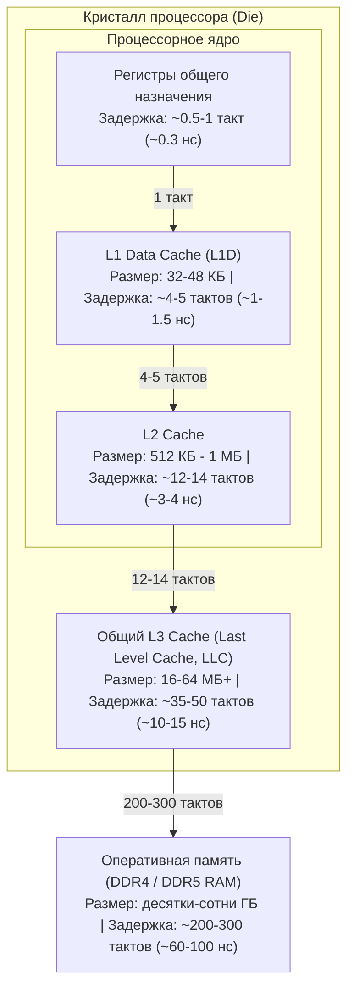
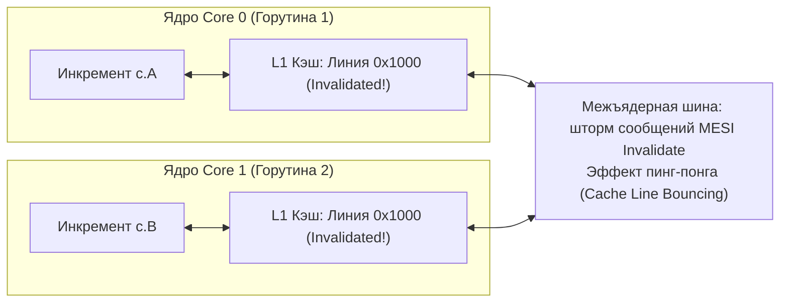
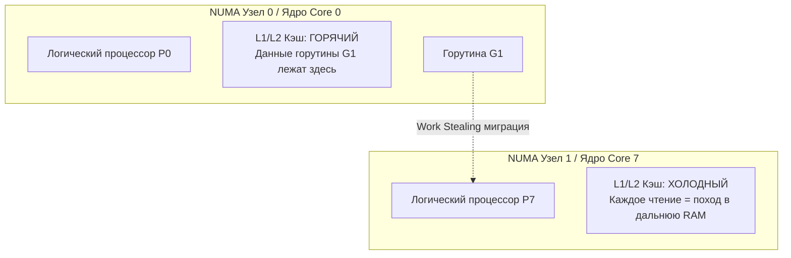

## Что такое Mechanical Sympathy

Термин **Mechanical Sympathy** («механическая эмпатия» или «механическое сочувствие») пришёл в программирование из мира королевских автогонок Formula 1. Легендарный трехкратный чемпион мира сэр Джеки Стюарт (Jackie Stewart) однажды заметил:  
> *«Вам вовсе не обязательно быть дипломированным инженером, чтобы стать первоклассным гонщиком. Но вы обязаны обладать Mechanical Sympathy — чувствовать механизм машины каждой клеточкой тела. Вы должны понимать, как смыкаются шестерни в коробке передач, как греется резина в повороте и что происходит с поршнями при переключении вниз, иначе вы просто разнесете мотор на тридцатом круге»*.

В мир разработки программного обеспечения этот термин перенес британский инженер Мартин Томпсон (Martin Thompson), создатель ультранизколатентной финансовой архитектуры LMAX Disruptor. В приложении к бэкенду **Mechanical Sympathy означает способность инженера проектировать программное обеспечение, глубоко понимая, как именно абстракции языка программирования и компилятора ложатся на физические транзисторы, шины и кэши кремниевого процессора**.

Это не про фанатичное написание всего бэкенда на ассемблере ради экономии трех наносекунд. Это про **архитектурную осознанность**:
- Почему простая замена `container/list` на плоский слайс ускоряет алгоритм в 20 раз при идентичной асимптотике $O(N)$?
- Почему сервис, потребляющий 2 гигабайта памяти, после простой перестановки полей в структурах начинает расходовать 1.2 гигабайта и работает в полтора раза быстрее?
- Почему 8 горутин на 8-ядерном процессоре обрабатывают больше транзакций в секунду, чем 800 горутин, и почему добавление ядер способно обрушить пропускную способность?

Для Go-разработчика уровня Senior и Lead механическая эмпатия — единственный надежный компас. Язык Go дарит нам великолепные, высокоуровневые абстракции: лаконичный синтаксис, автоматическую сборку мусора, невидимый планировщик горутин и удобные сетевые сокеты. Но плата за эти абстракции выражается в физических величинах: процессорных тактах, сбросах конвейера, промахах кэша (Cache Misses) и блокировках системных шин. Без понимания физики процессов инженер обречен блуждать в потемках, когда под боевой нагрузкой задержка p99 начинает непредсказуемо «плыть», а профилировщик CPU рапортует, что процессор загружен на 100%, выполняя при этом ничтожный объем полезной работы.

В предыдущих главах мы заложили системный фундамент: разобрали [[1. Обзор раздела. Как мыслить о производительности]], взвесили баланс [[2. Latency vs throughput]], научились диагностировать [[3. CPU bound vs IO bound задачи]] и рассчитали математический предел распараллеливания по [[4. Amdahl law и масштабирование]]. Теперь мы снимем крышку процессора и посмотрим, как физическое железо выполняет наш код.

---

## Почему абстракции врут: иерархия памяти

Центральный процессор (CPU) современного сервера оперирует на тактовых частотах от 3.0 до 4.5 ГГц. Это означает, что один базовый такт кремниевого генератора длится всего **~0.25–0.33 наносекунды**. За один такой такт современное суперскалярное ядро способно декодировать и выдать на исполнение до 4–6 микроинструкций.

Однако данные, над которыми производятся вычисления, хранятся в модулях оперативной памяти (DDR4/DDR5 RAM). Физический путь электрического сигнала от кристалла CPU через сокет, проводники материнской платы, контроллер памяти и конденсаторы микросхем DRAM занимает от **60 до 100 наносекунд**.

> [!NOTE] Масштаб времени Кернигана: Если бы 1 такт CPU длился 1 секунду
> Вообразить наносекунды человеческому мозгу практически невозможно. Но если мы мысленно замедлим время и приравняем **1 такт процессора к 1 секунде нашей жизни**, физическая реальность предстанет в шокирующем свете:
> - **1 такт CPU (регистры):** 1 секунда (взять ручку со стола прямо перед собой).
> - **Кэш L1 (4 такта):** 4 секунды (потянуться за справочником на соседнюю полку).
> - **Кэш L2 (12 тактов):** 12 секунд (встать и взять книгу из шкафа в дальнем углу кабинета).
> - **Кэш L3 (40 тактов):** 40 секунд (выйти в коридор офиса к кулеру с водой).
> - **Оперативная память RAM (200–300 тактов):** **4–5 минут** (спуститься на лифте и дойти до кофейни на соседней улице).
> - **Чтение блока из NVMe SSD:** **2–4 суток** (собрать чемодан и съездить в командировку в другой город).
> - **Сетевой пинг внутри одного датацентра (0.5 мс):** **2–3 месяца** (прожить целый рабочий квартал).
> - **Сетевой запрос между континентами (100 мс):** **10–12 лет** (закончить школу и университет!).
> 
> Если процессор вынужден идти в оперативную память за каждым байтом, он уподобляется профессору, который пишет научную статью, но за каждым словом уходит пешком в кофейню на пять минут. Всё остальное время суперкомпьютер стоимостью в десятки тысяч долларов просто «курит» в ожидании ответа шины данных.

Чтобы скрыть эту колоссальную пропасть в скорости, инженеры кремниевой индустрии создали многоуровневую пирамиду статической памяти (SRAM) — кэши L1, L2 и L3:



Программист на Go, оперирующий высокоуровневыми структурами данных, слайсами, мапами и горутинами, обязан постоянно помнить об этой пирамиде. Каждый промах мимо L1 или L2 кэша обходится в десятки и сотни тактов простоя процессорного конвейера (CPU stall).

---

### Кэш-линия: атомарная единица обмена

Процессор никогда не считывает и не записывает в оперативную память отдельные байты (даже если инструкция запрашивает один `byte` или `bool`). Физический контроллер памяти всегда обменивается данными блоками фиксированной длины — **кэш-линиями** (Cache Lines).

На подавляющем большинстве современных процессоров с архитектурами x86-64 (Intel Xeon, AMD EPYC) и ARM64 (Apple Silicon, AWS Graviton, Ampere Altra) **размер кэш-линии равен ровно 64 байтам** (512 бит), выровненным по 64-байтной границе адресов:

```
Адрес памяти: [ ... 0x00 ] ─── 64 байта данных ─── [ 0x3F ] [ 0x40 ... ]
Содержимое:   [ Поле 1 | Поле 2 | Поле 3 | ...              ]
```

Это аппаратное правило порождает два важнейших следствия для разработчика:
1. **Пространственный бонус:** Загружая из памяти одно 8-байтное число `int64`, процессор бесплатно доставляет в кэш следующие 56 байт. Если ваши данные лежат плотно друг за другом, последующие обращения будут мгновенными обращениями в кэш L1!
2. **Конкурентная угроза (False Sharing):** Если две независимые переменные двух разных потоков или горутин случайно окажутся внутри одной и той же 64-байтной линии, ядра будут непрерывно отбирать эту линию друг у друга. Это явление называется **ложным разделением данных** (**False Sharing**, см. [[8. False sharing]]).

> [!info] Под капотом: Протокол когерентности кэшей MESI / MOESI
> Чтобы все ядра многоядерного процессора видели единую непротиворечивую картину оперативной памяти, аппаратура кристалла реализует аппаратный протокол когерентности — **MESI** (Modified, Exclusive, Shared, Invalid) или его расширения (MOESI в AMD, MESIF в Intel).
> 
> Состояния линии в кэше:
> - **M (Modified):** Данные изменены текущим ядром, актуальны только здесь; копия в оперативной памяти устарела.
> - **E (Exclusive):** Линия присутствует только в кэше текущего ядра и совпадает с RAM.
> - **S (Shared):** Линия присутствует в кэшах нескольких ядер в режиме "только чтение".
> - **I (Invalid):** Данные в кэше устарели и не могут быть прочитаны.
> 
> Когда ядро Core 0 решает записать данные в кэш-линию, находящуюся в состоянии `Shared`, оно обязано разослать широковещательное сообщение **Invalidate** всем остальным ядрам кристалла через межъядерную шину. Все остальные ядра помечают свою копию как `Invalid`. Если в следующий такт ядро Core 1 пытается прочитать или изменить свою переменную из этой же линии, оно получает аппаратный промах (Cache Miss) и вынуждено ждать, пока Core 0 сбросит измененную линию в общий L3 кэш или RAM!

---

### Пример False Sharing в Go

Проиллюстрируем, как отсутствие механической эмпатии способно превратить параллельный код в катастрофу:

```go
package counter

// Counter страдает от False Sharing: поля A и B лежат рядом
type Counter struct {
	A uint64 // 8 байт (смещение 0..7)
	// Между A и B нет зазора — они делят общую 64-байтную кэш-линию!
	B uint64 // 8 байт (смещение 8..15)
}

func (c *Counter) IncA() {
	for i := 0; i < 1e6; i++ {
		c.A++
	}
}

func (c *Counter) IncB() {
	for i := 0; i < 1e6; i++ {
		c.B++
	}
}
```



Если мы запустим функции `IncA` и `IncB` в двух параллельных горутинах на разных ядрах, бенчмарк покажет парадоксальный результат: параллельное выполнение будет работать в 3–5 раз **медленнее**, чем последовательное выполнение на одном ядре! Ядра тратят 95% времени не на инкремент чисел, а на передачу прав на владение общей кэш-линией по кольцевой шине.

#### Решение проблемы: аппаратное выравнивание (Padding)

Чтобы изолировать переменные в независимые кэш-линии, необходимо разнести их с помощью заполнителя (padding):

```go
package counter

type CounterAligned struct {
	A uint64
	_ [56]byte // заполнитель до следующей 64-байтной границы (8 + 56 = 64)
	B uint64
}
```

Разнесение полей `A` и `B` в разные 64-байтные блоки позволяет каждому ядру захватить свою линию в монопольное состояние `Modified` (или `Exclusive`), полностью устранив конфликт на межъядерной шине. Скорость вычислений возрастает кратно.

В стандартной библиотеке Go и продакшен-системах (например, в пулах буферов и метриках Prometheus) этот прием используется повсеместно. Экспериментальный внутренний пакет рантайма `internal/cpu` или явное добавление байтового паддинга — классический инструмент highload-инженера. Детальный разбор техник выравнивания приведен в статьях [[9. Cache line и выравнивание]] и [[8. False sharing]].

---

## Пространственная и временная локальность

Высокопроизводительный код на Go опирается на два фундаментальных закона локальности данных:

1. **Временная локальность (Temporal Locality):** Если программа обратилась к ячейке памяти по адресу $X$, с высокой вероятностью она повторно обратится к этой же ячейке в ближайшем будущем (например, переменная-аккумулятор в цикле).
2. **Пространственная локальность (Spatial Locality):** Если программа обратилась к адресу $X$, с высокой вероятностью следующие обращения произойдут к соседним адресам $X+1, X+2, \dots$ (например, последовательное сканирование массива).

Аппаратный блок процессора — **Hardware Prefetcher** — непрерывно следит за адресами памяти, которые запрашивает ядро. Если префетчер видит монотонный линейный доступ к адресам с постоянным шагом (stride), он заблаговременно подгружает следующие кэш-линии из RAM в кэш L2 и L1 **до того**, как инструкция CPU реально их запросит!

### Слайс против связного списка

Сравним две классические структуры данных при решении одной и той же задачи суммирования чисел:

```go
// 1. Слайс — непрерывный монолитный блок в оперативной памяти
sum := 0
for _, v := range slice {
    sum += v
}

// 2. Связный список (container/list) — каждый узел аллоцирован независимо
for node := list.Front(); node != nil; node = node.Next() {
    sum += node.Value.(int)
}
```

С точки зрения асимптотического анализа $O(N)$ оба алгоритма безупречны: они выполняют ровно $N$ итераций и $N$ сложений. Но на реальном оборудовании слайс работает в **20–50 раз быстрее**:

```
Слайс в памяти:  [ v0 | v1 | v2 | v3 | v4 | v5 | v6 | v7 ] -> Одна кэш-линия 64 байта!
Префетчер:       Загружает линию 0x00, видит паттерн -> автоматически подтягивает 0x40, 0x80...

Список в памяти: [ Node 1 ] ──(указатель)──> [ Node 2 ] ──(указатель)──> [ Node 3 ]
                 (0x10A0)                    (0x9F40)                   (0x3B20)
Процессор:       Разыменование указателя -> Cache Miss -> простаивает 200 тактов на каждый узел!
```

1. В слайсе 64-байтный блок кэша вмещает сразу 8 элементов типа `int64`. Процессор платит задержкой только один раз на 8 элементов, а префетчер полностью обнуляет латентность следующих шагов.
2. В связном списке каждый узел создается отдельным вызовом `new()` и разбросан сборщиком мусора по случайным адресам кучи. Разыменование указателя `node.Next` — это так называемый **Pointer Chasing** (погоня за указателями). Процессор не может предсказать адрес следующего узла, префетчер бессилен, а ядро замирает на 60–100 наносекунд на каждом шаге цикла.

---

### Структуры и компоновка полей

Компилятор Go обязан размещать поля структуры в памяти с соблюдением требований процессорной архитектуры к **выравниванию (alignment)**. Для типа размера $K$ байт его адрес в памяти должен быть кратен $K$:
- `bool`, `uint8`, `int8` (1 байт) — по границе 1 байта.
- `uint16`, `int16` (2 байта) — по границе 2 байт.
- `uint32`, `int32`, `float32` (4 байта) — по границе 4 байт.
- `uint64`, `int64`, `float64`, указатели `*T`, интерфейсы, строки (8 байт на 64-битных системах) — по границе 8 байт.

Если программист располагает поля в структуре хаотично, компилятор вынужден вставлять между ними невидимые байты-заполнители (**Padding**):

```go
type Bad struct {
	a bool   // 1 байт
	         // [7 байт паддинга, чтобы b встало на 8-байтную границу!]
	b uint64 // 8 байт
	c bool   // 1 байт
	         // [7 байт паддинга, чтобы размер структуры был кратен 8!]
} // Итого: 24 байта памяти (из них 14 байт — мусор!)

type Good struct {
	a bool   // 1 байт
	c bool   // 1 байт
	         // [6 байт паддинга]
	b uint64 // 8 байт
} // Итого: 16 байт памяти (сэкономлено 33% пространства!)
```

Визуализация расположения в памяти:

```
Bad (24 байта):
[ a ] [ pad 7B ................. ] [ b (8 байт) ] [ c ] [ pad 7B ................. ]

Good (16 байт):
[ a ] [ c ] [ pad 6B ........... ] [ b (8 байт) ]
```

Экономия 8 байт кажется мелочью. Но если в вашей системе в памяти кэшируется 10 000 000 таких объектов:
- `Bad` потребует **240 МБ** оперативной памяти.
- `Good` потребует **160 МБ** оперативной памяти.

Вы не просто сэкономили 80 мегабайт RAM: вы увеличили плотность упаковки данных в кэше L3 на **33%**. Это означает, что на треть больше горячих структур останется в сверхбыстром кэше процессора, не вылетая в медленную память. Это напрямую повышает throughput сервиса ([[6. Cache friendly структуры]]).

---

## Ветвления и предсказатель переходов

Современные процессоры суперскалярны: они разбивают выполнение инструкций на 14–20 последовательных стадий (конвейер инструкций — Pipeline). Чтобы конвейер никогда не пустовал, ядро декодирует инструкции на десятки тактов вперед.

Но что происходит, когда в коде встречается инструкция условного перехода (`if`, `switch`, условие завершения цикла `for`)? Адрес следующей инструкции станет известен только после того, как условие будет полностью вычислено в АЛУ. Ждать вычисления — значит остановить конвейер на десятки тактов.

Чтобы не простаивать, процессор использует сложнейший нейросетевой аппаратный блок — **Branch Predictor** (предсказатель ветвлений). Он запоминает предысторию переходов и *спекулятивно* начинает выполнять ту ветку, которая кажется наиболее вероятной.
- Если предсказатель угадал — программа летит вперед без малейших задержек.
- Если предсказатель ошибся (**Branch Misprediction**) — процессор обязан экстренно аннулировать все спекулятивно выполненные инструкции, очистить конвейер (Pipeline Flush) и загрузить правильную ветку с нуля. Штраф за ошибку предсказания составляет **от 15 до 25 процессорных тактов**.

Рассмотрим классический пример:

```go
// 1. Непредсказуемый поток случайных данных:
for i := 0; i < len(data); i++ {
    if data[i] > 0 { // 50% true, 50% false случайным образом
        sum += data[i]
    }
}
```

Предсказатель ветвлений не способен угадать бросок монетки. Процент ошибок может достигать 50%, и процессор непрерывно сбрасывает свой конвейер.

Если же предварительно отсортировать массив:

```go
// 2. Отсортированный поток данных:
sort.Ints(data)
for i := 0; i < len(data); i++ {
    if data[i] > 0 { // Сначала всегда false, затем всегда true!
        sum += data[i]
    }
}
```

Предсказатель мгновенно адаптируется: сначала он на 100% уверен в ветке `false`, а после единственной ошибки на границе нуля — на 100% уверен в ветке `true`. Производительность цикла возрастает в **2–3 раза** даже с учетом времени сортировки! Подробнее архитектура предсказания раскрыта в [[6. Branch prediction и код]].

---

## SIMD: векторные инструкции

Современные микропроцессоры поддерживают векторные расширения **SIMD** (Single Instruction, Multiple Data): SSE, AVX2, AVX-512 на x86-64 и Neon/SVE на ARM64. 
Обычная скалярная инструкция складывает два 64-битных регистра за один такт. Векторная инструкция AVX-512 загружает в 512-битный регистр сразу **восемь** чисел `uint64` (или шестнадцать `float32`) и складывает их параллельно за один такт ALU!

```
Скалярная инструкция (ADD):
[ A0 ] + [ B0 ] = [ C0 ]

Векторная инструкция SIMD (VADDPS):
[ A0 | A1 | A2 | A3 | A4 | A5 | A6 | A7 ]
   +    +    +    +    +    +    +    +
[ B0 | B1 | B2 | B3 | B4 | B5 | B6 | B7 ]
   =    =    =    =    =    =    =    =
[ C0 | C1 | C2 | C3 | C4 | C5 | C6 | C7 ]   (Все 8 сложений за 1 такт!)
```

Официальный компилятор Go (`gc`) пока не умеет автоматически векторизовывать циклы (в отличие от компиляторов C/C++ и Rust на базе LLVM). Однако высокопроизводительные библиотеки (например, криптография, парсинг JSON вроде `simdjson-go`, алгоритмы сжатия данных) используют прямой Go-ассемблер или пакеты вроде `github.com/klauspost/cpuid/v2` для динамического определения инструкций процессора и `github.com/tetratelabs/wazero`. Подробнее о векторных возможностях Go читайте в [[7. SIMD и Go]].

---

## Escape Analysis, стек и куча

С точки зрения Mechanical Sympathy, размещение объекта в памяти — это вопрос не просто удобства, а физической скорости доступа:

1. **Стековая память горутины:**  
   Стек исключительно горяч. Вершина стека постоянно крутится в сверхбыстром кэше L1 процессорного ядра. Выделение памяти на стеке сводится к вычитанию константы из регистра указателя стека `RSP` (одна инструкция `SUBQ $N, RSP`, 0 наносекунд). Освобождение — прибавление к `RSP`.
2. **Куча (Heap):**  
   Память в куче фрагментирована и размазана по адресному пространству. Выделение требует обращения к аллокатору рантайма (`mcache`, `mcentral`), а освобождение возлагается на фоновый сборщик мусора (GC).

Механизм **Escape Analysis** компилятора Go ([[3. Escape analysis]]) определяет: покидает ли ссылка на объект область видимости текущей функции. Если нет — объект остается на стеке.

Принципы проектирования с учетом mechanical sympathy:
- **Передача по значению для небольших структур:** Передача структуры до 16–24 байт по значению через регистры CPU (согласно ABIInternal в Go 1.17+) быстрее, чем передача по указателю, так как исключает разыменование памяти и риск утечки объекта в кучу.
- **Минимизация указателей в структурах данных:** Структуры без указателей не только экономят память, но и освобождают сборщик мусора от необходимости сканировать их поля во время фазы маркировки.
- **Переиспользование объектов через `sync.Pool`:** Пакет `sync.Pool` ([[2. sync Pool]]) эксплуатирует временную локальность: объект возвращается в пул и при повторном извлечении горутиной на том же ядре гарантированно оказывается горячим в кэше L2/L3.

---

## Сборщик мусора и кэш

Конкурентный трехцветный сборщик мусора Go ([[1. GC в Go. Обзор]], [[4. Concurrent GC]]) спроектирован так, чтобы паузы Stop-The-World были минимальными (<1 мс). Но плата за эту отзывчивость проявляется на уровне кэшей:

1. **Загрязнение кэша (Cache Pollution):** Фоновые маркеры GC (worker mark goroutines) обходят гигабайты кучи, читая граф указателей. Считывая миллионы холодных объектов, сборщик мусора неизбежно вытесняет из кэшей L1, L2 и L3 горячие бизнес-данные вашего приложения.
2. **Накладные расходы Write Barrier:** Чтобы гарантировать корректность трехцветной раскраски в параллельном режиме, рантайм Go активирует **Write Barriers** ([[5. Write barriers]]). При каждой перезаписи указателя в куче выполняется дополнительная проверка и вызов `runtime.gcWriteBarrier`. В горячих циклах это может стоить до 10–20% производительности.

Понимание этих механизмов подталкивает к осознанной настройке лимитов памяти через `GOGC` ([[7. GOGC и tuning]]) и `GOMEMLIMIT` ([[8. GOMEMLIMIT]]), а также снижению числа указателей в критических структурах.

---

## Планировщик горутин и локальность кэша

Планировщик Go распределяет горутины по логическим процессорам $P$, которые в свою очередь привязаны к потокам операционной системы $M$ ([[1. Scheduler Go. G-M-P модель]]).  
Когда один логический процессор $P$ оказывается перегружен, алгоритм балансировки нагрузки **Work Stealing** ([[3. Work stealing]]) крадет половину горутин из его локальной очереди и переносит на другой свободный $P$.

Однако этот перенос имеет скрытую аппаратную цену:
- На ядре Core 0 горутина оставила прогретый кэш L1/L2 и горячие записи в буфере трансляции адресов (TLB).
- Будучи украденной ядром Core 7 на другом физическом кристалле или сокете (NUMA-узел), горутина начинает выполнение на «ледяном» кэше. Первые тысячи обращений к памяти будут аппаратными Cache Misses, порождая микросекундные всплески задержек.



Для подавляющего большинства сервисов автоматическая балансировка work stealing — это благо. Но в ультранизколатентных системах (High-Frequency Trading, обработка биржевых стаканов) инженеры используют привязку потоков к ядрам через `runtime.LockOSThread()` в связке с системными утилитами `taskset`, подсистемами `cgroups` или изоляцией ядер в ядре Linux (`isolcpus`), чтобы исключить миграцию горутин и сброс кэшей.

> [!tip] Собеседование: Миграция горутин и потеря локальности
> **Вопрос:** Почему при анализе задержек высоконагруженного сервиса мы можем наблюдать резкие периодические скачки latency отдельных горутин, хотя объем вычислений не менялся? Как это диагностировать?
> 
> **Ответ кандидата уровня Senior:**  
> Одной из ключевых причин является миграция горутины между логическими процессорами $P$ (Work Stealing) или вытеснение потока $M$ планировщиком ядра Linux на другое физическое ядро CPU (в особенности на другой сокет в архитектуре NUMA). При смене ядра горутина полностью теряет локальность в кэшах L1 и L2, а также попадает на холодный буфер ассоциативной трансляции страниц памяти (TLB).  
> Первые обращения к памяти приводят к лавине промахов (Cache Misses) и задержкам на чтение из L3 или RAM.  
> **Инструменты диагностики:**
> 1. В Go включить трассировщик выполнения `go tool trace` ([[3. execution tracer]]) и изучить дорожки потоков $P$ и события смены процессора горутиной.
> 2. В Linux запустить профилировщик аппаратных событий:
>    ```bash
>    perf stat -e cache-misses,cache-references,context-switches,cpu-migrations -p <PID>
>    ```
>    Высокая частота `cpu-migrations` и коррелирующий рост `cache-misses` подтвердят гипотезу.

---

## Инструменты для проверки механической эмпатии

Чтобы механическая эмпатия не превратилась в умозрительное философствование, инженер обязан владеть инструментами объективного аппаратного контроля:

### 1. Системный профилировщик ядра Linux `perf`
Утилита `perf` считывает аппаратные счетчики производительности (Performance Monitoring Counters, PMC), встроенные прямо в кремний CPU:

```bash
perf stat -e task-clock,cycles,instructions,cache-misses,branch-misses ./my_binary
```

Ключевой показатель, на который следует обращать внимание — **IPC (Instructions Per Cycle)**, вычисляемый как отношение `instructions / cycles`:
- **IPC > 2.0:** Отличный показатель. Процессор загружен полезной работой, конвейер полон.
- **IPC < 0.7:** Система «задушена» ожиданием памяти или сбросами ветвлений. Процессор тратит больше тактов на простой, чем на исполнение кода.

Для детального анализа промахов кэша:
```bash
perf stat -e cache-misses,cache-references ./my_binary
```

### 2. Встроенный инструментарий Go
- **`go tool pprof` с CPU-профилем:**  
  Показывает горячие точки (hot spots) выполнения функций, но не даёт прямой информации о кэше. Косвенный признак неэффективности кэша: процессор тратит неожиданно много времени в простых циклах перебора.
- **Бенчмаркинг с флагами детального анализа (`-benchmem`, `-cpuprofile`, `-trace`):**  
  Запуск бенчмарков с флагами `-benchmem`, `-cpuprofile` и `-trace` позволяет собрать профили памяти, тактов процессора и покадровой трассировки исполнения горутин.
- **Проверка ассемблерного листинга:**  
  Команда `go tool compile -S main.go` позволяет своими глазами увидеть сгенерированные инструкции ассемблера, регистровое соглашение ABIInternal и вызовы write barrier'ов рантайма.
- **Анализ escape analysis:**  
  Команда `go build -gcflags="-m -m" main.go` детально выводит причины, по которым каждая конкретная переменная сбегает в кучу (`escapes to heap`) или остается на стеке.

---

## Итог: Mechanical Sympathy как инженерная дисциплина

- **Mechanical Sympathy** — это проектирование систем с уважением к законам физики и архитектуре кремниевого процессора.
- **Иерархия памяти диктует скорость:** кэш L1 (~1 нс) в сотни раз быстрее оперативной памяти RAM (~80 нс). Структуры данных с высокой пространственной и временной локальностью (слайсы, плотно упакованные `struct`) всегда побеждают структуры с хаотичными указателями (связные списки).
- **Кэш-линия (64 байта) — неделимый кирпич обмена:** Случайное размещение разделяемых независимых переменных в одной кэш-линии приводит к катастрофическому эффекту **False Sharing** ([[8. False sharing]]), который устраняется аппаратным выравниванием и паддингом ([[9. Cache line и выравнивание]]).
- **Выравнивание полей структуры:** правильный порядок полей исключает скрытые байты паддинга, экономя десятки процентов памяти и увеличивая плотность упаковки данных в кэше L3.
- **Конвейер и ветвления:** ошибки предсказателя переходов стоят до 20 тактов; сортировка данных и предсказуемые ветвления радикально ускоряют горячие циклы ([[6. Branch prediction и код]]).
- **Аппаратный контроль через `perf`:** метрика IPC (инструкций за такт) и счетчики `cache-misses` объективно показывают, работает ли процессор с максимальной отдачей.

В следующей лекции [[6. Метрики. p50, p95, p99]] мы поднимемся от микроархитектуры кремниевых кристаллов к метрикам пользовательского восприятия сервиса. Мы разберем, почему среднее арифметическое — самая опасная ложь в мониторинге, как устроены перцентили задержек и почему p99 latency является главным зеркалом здоровья высоконагруженного бэкенда.