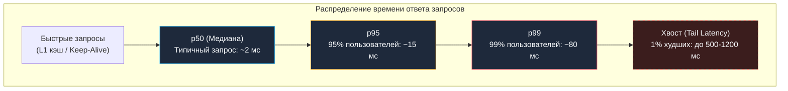

## Почему среднее арифметическое лжёт

В [[2. Latency vs throughput]] мы развели по разным категориям время отклика одной операции и суммарную пропускную способность системы. Теперь перед инженером встает практический и обманчиво простой вопрос: **как именно измерять и выражать latency сервиса в числах?**

Самый частый ответ начинающего разработчика — *«посчитать среднее время ответа (Average / Mean Latency)»*.  
В промышленной разработке высоконагруженных бэкендов этот ответ — грубейшая методологическая ошибка.

> [!NOTE] Афоризм Кернигана: Средняя глубина брода
> В фольклоре статистики есть поучительная притча: *«Статистик ростом в два метра утонул в реке, средняя глубина которой составляла всего один метр»*.  
> Или другой классический пример: если в придорожный бар, где сидят десять обычных рабочих, заходит миллиардер, средний доход посетителя бара мгновенно превышает сотни миллионов долларов. Но стал ли хоть один рабочий от этого богаче?  
> Среднее арифметическое полностью стирает экстремумы. Оно рисует иллюзию всеобщего благополучия там, где реальность трещит по швам.

Представим реальный сетевой HTTP-сервер. За одну секунду он обработал 100 клиентских запросов:
- 99 запросов выполнились штатно за **10 миллисекунд**.
- 1 запрос попал на фазу остановки мира сборщика мусора (GC Stop-The-World) или задержку сетевого сокета и продлился **500 миллисекунд**.

Посчитаем среднее арифметическое:

$$\text{Mean} = \frac{99 \times 10 + 1 \times 500}{100} = \frac{990 + 500}{100} = \frac{1490}{100} = 14.9 \text{ мс}$$

Менеджер или неопытный разработчик смотрит на дашборд с цифрой **14.9 мс** и заявляет: *«Сервис летает! Задержка выросла всего на 4.9 мс относительно идеала»*.

Но суровая инженерная реальность выглядит иначе: **каждый сотый пользователь столкнулся с полусекундным «залипанием» экрана**. А если этот запрос — платежная транзакция, авторизация в SSO или внутренний gRPC-вызов между микросервисами, эта полусекундная задержка каскадом обрушит тайм-ауты всей распределенной системы. Среднее арифметическое сработало как идеальная маскировка катастрофы.

Метрики производительности, основанные на среднем, принципиально не способны показать поведение так называемого «хвоста» распределения. Именно поэтому во всей современной инженерии надежности и Site Reliability Engineering (SRE) принят иной математический аппарат — **перцентили (процентили)**.

---

## Перцентили: p50, p95, p99 и другие

**Перцентиль (квантиль)** — это статистическая мера, показывающая пороговое значение, ниже которого укладывается заданный процент всех наблюдений в выборке.

В мониторинге времени ответа веб-сервисов и баз данных используются следующие канонические перцентили:
- **p50 (медиана):** ровно 50% запросов выполнились быстрее этого значения, а 50% — медленнее. Медиана отсекает любые аномальные выбросы и объективно отражает опыт «типичного пользователя» системы.
- **p95:** 95% запросов выполнились быстрее этой отметки, и лишь 5% оказались медленнее. Это надежный показатель стабильности сервиса для подавляющего большинства клиентов.
- **p99:** ровно 99% запросов быстрее этого порога, и лишь 1 из 100 запросов превысил его. Это ключевой индикатор «хвостовой задержки» (**Tail Latency**, см. [[7. Tail latency и почему она важна]]). Именно на p99 ориентируются SLA/SLO критически важных сервисов.

В высоконагруженных системах с миллионными потоками RPS (Google, Amazon, крупные финансовые биржи) используют еще более глубокие квантили:
- **p99.9 (p999):** один медленный запрос на тысячу.
- **p99.99 (p9999):** один медленный запрос на десять тысяч.

Чем выше перцентиль, тем ближе он к абсолютному максимуму выборки ($\text{Max Latency}$), и тем драматичнее на него влияют скрытые микрозадержки операционной системы и рантайма.



> [!info] Под капотом: Математика вычисления квантилей
> Математически $p$-й перцентиль вычисляется по строго отсортированной выборке размера $N$: берут значение с индексом `ceil(p/100 * N)`. В формульном виде порядковый ранг элемента определяется выражением:
> 
> $$\text{Rank} = \left\lceil \frac{p}{100} \times N \right\rceil$$
> 
> Например, для выборки из $N = 1000$ замеров значение 99-го перцентиля (p99) будет соответствовать элементу с индексом `ceil(99/100 * 1000)` = 990.  
> При малых размерах выборки $N$ перцентили дают грубую статистическую оценку с высокой погрешностью. Поэтому в продакшен-мониторинге для непрерывных потоков метрик применяют не хранение сырых массивов, а приближенные вероятностные алгоритмы и гистограммы с экспоненциальными корзинами.

---

## Как выглядят распределения задержек в реальности

В школьных и институтских курсах физики многие привыкли к симметричному нормальному распределению Гаусса (колоколообразной кривой). Если бы задержки сервиса подчинялись закону Гаусса, среднее арифметическое совпадало бы с медианой (p50), а p99 находился бы на расстоянии трех стандартных отклонений ($3\sigma$).

Но в реальных компьютерных системах задержки **никогда не бывают распределены нормально**. Распределение времени ответа бэкенда обладает двумя фундаментальными свойствами:

### 1. Мультимодальность (Multimodal Distribution)
Реальное распределение имеет не один, а несколько выраженных «горбов» (мод). Каждый горб соответствует физическому уровню, на котором завершилась обработка запроса:
- **Горб 1 (~10–50 микросекунд):** запрос обработан мгновенно из горячего кэша в оперативной памяти инстанса (L1/L2/L3 попадание).
- **Горб 2 (~1–5 миллисекунд):** кэш промахнулся; потребовался сетевой системный вызов к локальной базе данных Redis / PostgreSQL.
- **Горб 3 (~50–200 миллисекунд):** запрос попал на холодное дисковое чтение, фазу Stop-The-World сборщика мусора Go, ретрай TCP-пакета или переключение контекста планировщика.

```
Количество
запросов
  ▲         Горб 1: In-Memory Cache
  │           ╭─╮
  │          ╭╯ ╰╮
  │          │   │         Горб 2: DB Query
  │          │   │           ╭─╮
  │          │   │          ╭╯ ╰╮                Горб 3: GC STW / Disk
  │         ╭╯   ╰╮        ╭╯   ╰╮                  ╭───╮
──┴─────────┴─────┴────────┴─────┴──────────────────┴───┴──────► Latency (мс)
           [  p50  ]      [     p95     ]          [   p99   ]
```

### 2. Тяжелый правый хвост (Heavy-Tail Distribution)
Кривая задержек асимметрична и вытянута вправо на колоссальное расстояние. За счет блокировок мьютексов, очередей в сетевых картах и конкуренции за ядро CPU всегда существует ненулевая вероятность того, что отдельный запрос зависнет на секунды.

Именно поэтому картина, когда **p50 = 2 мс, p95 = 25 мс, а p99 = 800 мс** — абсолютно типична для боевого микросервиса. Попытка посчитать «среднее» даст число порядка 15–30 мс, которое не имеет никакого физического смысла: ни один реальный пользователь не получил ответ за 15 мс — они получали его либо за 2 мс, либо ждали почти секунду!

---

## Вычисление процентилей в Go

### Локальное точное вычисление (Exact Percentile)

Для локальных бенчмарков, CLI-утилит и нагрузочных тестов простейший способ вычисления точных перцентилей — собрать все замеры времени в слайс `[]time.Duration`, отсортировать его и взять элемент по расчетному индексу:

```go
package metrics

import (
	"math"
	"sort"
	"time"
)

// Percentile вычисляет p-й квантиль отсортированной выборки data (0 < p <= 100).
func Percentile(data []time.Duration, p float64) time.Duration {
	if len(data) == 0 {
		return 0
	}
	// Сортировка среза по возрастанию задержки O(N log N)
	sort.Slice(data, func(i, j int) bool { return data[i] < data[j] })

	// Расчет порядкового индекса
	idx := int(math.Ceil(p/100.0*float64(len(data)))) - 1
	if idx < 0 {
		idx = 0
	}
	if idx >= len(data) {
		idx = len(data) - 1
	}
	return data[idx]
}
```

### Продакшен-мониторинг: Гистограммы Prometheus

Хранить все миллионы значений задержек в памяти продакшен-сервиса ради точной сортировки невозможно — это приведет к исчерпанию оперативной памяти (OOM).

Поэтому промышленные системы мониторинга агрегируют данные в **гистограммы (Histograms)**. Пространство возможных задержек разбивается на фиксированные интервалы — **корзины (Buckets)**. При завершении каждого запроса инкрементируется счетчик соответствующей корзины ($O(1)$ по времени, $O(1)$ по памяти).

В экосистеме Go официальным стандартом де-факто является клиентская библиотека Prometheus (`github.com/prometheus/client_golang`):

```go
package metrics

import (
	"github.com/prometheus/client_golang/prometheus"
	"github.com/prometheus/client_golang/prometheus/promauto"
)

var RequestDuration = promauto.NewHistogramVec(
	prometheus.HistogramOpts{
		Name: "http_request_duration_seconds",
		Help: "Длительность обработки входящих HTTP-запросов в секундах",
		// Стандартные корзины Prometheus:
		// .005, .01, .025, .05, .1, .25, .5, 1, 2.5, 5, 10 секунд
		Buckets: prometheus.DefBuckets,
	},
	[]string{"handler", "method"},
)
```

На стороне сервера Prometheus функция PromQL `histogram_quantile` восстанавливает приближенное значение перцентиля:

```promql
histogram_quantile(0.99, sum(rate(http_request_duration_seconds_bucket[5m])) by (le))
```

> [!warning] Ловушка / Gotcha: Линейная интерполяция корзин Prometheus
> Функция `histogram_quantile` в Prometheus не знает точных значений внутри корзины — она предполагает, что значения внутри диапазона распределены **равномерно (линейная интерполяция)**.
> 
> Если ваши корзины настроены неудачно (например, предпоследняя корзина `le="1.0"`, а следующая — `le="+Inf"`), то любой запрос с задержкой 1.2 с, 5 с или 60 с попадет в бесконечную корзину. В результате расчетный p99 в Grafana будет фатально искажен и занижен!  
> **Золотое правило:** Верхние границы корзин гистограммы обязаны с запасом перекрывать целевые значения ваших SLO, а шаг корзин в районе p95–p99 должен быть максимально гранулированным (экспоненциальный шаг $\times 1.5$ или $\times 2.0$).

---

## Сбор метрик в production Go-сервисе

Если сервис должен рассчитывать приближенные квантили прямо внутри процесса (in-process) без внешнего Prometheus (например, для динамического rate-limiting или circuit breaker), используются алгоритмы вроде HdrHistogram (`github.com/codahale/hdrhistogram`) или вероятностное **резервуарное сэмплирование (Reservoir Sampling)**.

Резервуарный сэмплер сохраняет репрезентативную случайную выборку фиксированного размера $K$ из непрерывного потока бесконечной длины:

```go
package tracker

import (
	"math"
	"math/rand"
	"sort"
	"sync"
	"time"
)

// LatencyTracker потокобезопасно накапливает выборку задержек.
type LatencyTracker struct {
	mu         sync.Mutex
	samples    []time.Duration
	maxSamples int
	rng        *rand.Rand
	count      int64
}

func NewLatencyTracker(maxSamples int) *LatencyTracker {
	return &LatencyTracker{
		maxSamples: maxSamples,
		samples:    make([]time.Duration, 0, maxSamples),
		rng:        rand.New(rand.NewSource(time.Now().UnixNano())),
	}
}

// Record фиксирует длительность операции по алгоритму резервуарного сэмплирования.
func (lt *LatencyTracker) Record(d time.Duration) {
	lt.mu.Lock()
	defer lt.mu.Unlock()

	lt.count++
	if len(lt.samples) < lt.maxSamples {
		lt.samples = append(lt.samples, d)
		return
	}

	// Алгоритм R (Waterman / Knuth): заменяем элемент с вероятностью maxSamples / count
	idx := lt.rng.Intn(int(lt.count))
	if idx < lt.maxSamples {
		lt.samples[idx] = d
	}
}

// Percentile рассчитывает p-й перцентиль по накопленной выборке.
func (lt *LatencyTracker) Percentile(p float64) time.Duration {
	lt.mu.Lock()
	defer lt.mu.Unlock()

	if len(lt.samples) == 0 {
		return 0
	}

	sorted := make([]time.Duration, len(lt.samples))
	copy(sorted, lt.samples)
	sort.Slice(sorted, func(i, j int) bool { return sorted[i] < sorted[j] })

	idx := int(math.Ceil(p/100.0*float64(len(sorted)))) - 1
	if idx < 0 {
		idx = 0
	}
	if idx >= len(sorted) {
		idx = len(sorted) - 1
	}
	return sorted[idx]
}
```

В промышленной разработке высоконагруженных сервисов такие ручные структуры вытесняются высокоэффективными lock-free структурами HdrHistogram, гарантирующими константное время записи $O(1)$ и нулевые аллокации памяти.

---

## Связь с SLO и SLA

В современной SRE-культуре метрики задержек напрямую связываются с бизнес-обязательствами:
- **SLA (Service Level Agreement):** юридический договор с внешними клиентами. Формулируется исключительно в квантилях: *«99% всех входящих API-запросов в течение календарного месяца должны завершаться быстрее 250 мс»*. Нарушение p99 влечет за собой финансовые штрафы (Service Credits).
- **SLO (Service Level Objective):** внутренний целевой ориентир инженерной команды, который всегда жестче внешнего SLA (например, *«p99 ≤ 150 мс»*). Запас между SLO и SLA формирует бюджет ошибок (Error Budget).
- **SLI (Service Level Indicator):** фактическое значение метрики, снимаемое с дашборда мониторинга прямо сейчас.

Инженер Go использует перцентили для расчета емкости кластера (**Capacity Planning**, см. [[6. Capacity planning]]) и настройки алертов дежурной смены.

> [!tip] Собеседование: Выбор между p95 и p99
> **Вопрос:** Почему при проектировании дашбордов мониторинга бэкенда опытные инженеры настраивают алерты и на p95, и на p99 одновременно? В чем их принципиальная разница?
> 
> **Ответ кандидата уровня Senior:**  
> - **p95** реагирует на системную, широкую деградацию базы данных или сети, затрагивающую существенную долю пользователей (каждого двадцатого). Если поплыл p95 — сервис перегружен или исчерпал базовые ресурсы (CPU/соединения).
> - **p99** реагирует на локальные, скрытые узкие места: паузы сборщика мусора (GC STW), редкие блокировки мьютексов, тайм-ауты одного из шардов БД или переполнение очереди планировщика.  
> В микросервисной архитектуре, где один фронтенд-запрос параллельно опрашивает 50 микросервисов, даже редкая задержка p99 на одном узле с вероятностью $1 - (0.99)^{50} \approx 39.5\%$ замедлит ответ конечному пользователю! Поэтому для внутренних RPC-сервисов p99 критически важен.

---

## Mechanical Sympathy: почему возникают хвостовые выбросы

Если код написан без ошибок и алгоритмическая сложность фиксирована, откуда берутся выбросы в p99? С точки зрения [[5. Mechanical sympathy в backend разработке]], время ответа запроса формируется каскадом аппаратных и рантайм-факторов:

1. **Очереди в планировщике Go (G-M-P Scheduling Delay):**  
   Если все `GOMAXPROCS` процессоров $P$ заняты выполнением других горутин, вновь созданная горутина ставится в конец очереди `runq`. Время её ожидания напрямую зависит от текущей нагрузки на CPU.
2. **Конкуренция за мьютексы (`sync.Mutex` Contention):**  
   Быстрый путь мьютекса в Go — атомарная операция CAS в пространстве пользователя (2–3 наносекунды). Но если блокировка уже захвачена, горутина после нескольких spin-циклов засыпает на системном семафоре ядра Linux (`futex`). Пробуждение через системный вызов занимает уже тысячи наносекунд.
3. **Паузы сборщика мусора (GC Stop-The-World):**  
   Фазы sweep termination и mark termination сборщика мусора Go останавливают мир ([[3. Stop the world]]). Хотя средняя пауза составляет менее 0.5 мс, запрос, попавший в этот миг, получает чистый штраф к задержке.
4. **Блокирующие системные вызовы и сеть:**  
   Синхронные дисковые операции (`os.File`) и сетевые ретрансмиты TCP (packet loss) создают резкие ступенчатые задержки от 200 мс до 1–3 секунд ([[1. Системные вызовы и их стоимость]]).
5. **Аппаратные промахи и NUMA-эффекты:**  
   Попадание в L1-кэш занимает ~1 нс, чтение из RAM — ~80–100 нс, а чтение из памяти удаленного сокета (NUMA remote access) — более 200 нс.

В соответствии с **законом Литтла** ([[2. Latency vs throughput]]):

$$L = \lambda \times W$$

Если входящий поток $\lambda$ временно превышает пропускную способность, среднее число запросов в очереди $L$ начинает расти лавинообразно. Запросы, оказавшиеся в глубине очереди, испытывают кумулятивную задержку ожидания, которая и раздувает тяжелый хвост p99/p99.9.

> [!info] Под капотом: Netpoller и эффект Thundering Herd
> В рантайме Go сетевой поллер (`netpoll`) опирается на системный механизм epoll (в Linux) или kqueue (в macOS/BSD). Горутины, ожидающие данных из сетевого сокета, паркуются рантаймом. Когда ядро ОС сигнализирует о готовности дескриптора, сетевой поллер переводит горутины в состояние `_Grunnable`.  
> Если под высокой нагрузкой одновременно пробуждаются сотни горутин, возникает локальный эффект «громоподобного стада» (thundering herd): планировщик тратит такты процессора на растаскивание горутин по очередям логических процессоров $P$, создавая микросекундные всплески в p99 latency.

---

## Инструментарий Go для метрик задержек

Для комплексного анализа задержек и их перцентилей в экосистеме Go используются следующие уровни наблюдаемости ([[8. Observability и performance]]):

1. **Встроенный рантайм-пакет `runtime/metrics`:**  
   Предоставляет сверхдешевые низкоуровневые метрики рантайма. Позволяет скоррелировать рост p99 с активностью сборщика мусора:
   - `/gc/pauses:seconds` — распределение длительностей пауз Stop-The-World.
   - `/sched/latencies:seconds` — время нахождения горутин в очереди планировщика до получения кванта времени процессора.
   - `/gc/scan/latency:microseconds` — задержки сканирования кучи.
2. **Пакет `expvar`:**  
   Стандартный пакет для публикации произвольных переменных состояния через HTTP в формате JSON (`/debug/vars`). Позволяет зарегистрировать кастомную функцию `expvar.Func`, рассчитывающую квантили на лету.
3. **Клиентская библиотека Prometheus (`promhttp`):**  
   Индустриальный стандарт. Экспортирует гистограммы и сводки (summaries) через HTTP-эндпоинт `/metrics`.
4. **OpenTelemetry (OTel Go SDK):**  
   Вендор-нейтральный стандарт трассировки и метрик, позволяющий сквозным образом связать хвостовые всплески задержек конкретного HTTP-запроса с детальным трейсом распределенной системы.

---

## Практический пример: измеряем p99 и выявляем выбросы

Создадим боевой демонстрационный HTTP-сервер, настроенный на сбор гистограмм Prometheus с экспоненциальными корзинами, и симулируем периодические хвостовые выбросы:

```go
package main

import (
	"math/rand"
	"net/http"
	"runtime"
	"time"

	"github.com/prometheus/client_golang/prometheus"
	"github.com/prometheus/client_golang/prometheus/promhttp"
)

var (
	// Создаем гистограмму с экспоненциальным шагом корзин:
	// от 1 мс с коэффициентом 2.0 (15 корзин: 1ms, 2ms, 4ms, 8ms ... ~16s)
	reqDuration = prometheus.NewHistogram(prometheus.HistogramOpts{
		Name:    "req_duration_seconds",
		Help:    "Длительность выполнения HTTP запросов",
		Buckets: prometheus.ExponentialBuckets(0.001, 2.0, 15),
	})
)

func init() {
	prometheus.MustRegister(reqDuration)
}

func apiHandler(w http.ResponseWriter, r *http.Request) {
	start := time.Now()
	defer func() {
		reqDuration.Observe(time.Since(start).Seconds())
	}()

	// Имитируем штатную полезную нагрузку: 10 миллисекунд
	time.Sleep(10 * time.Millisecond)

	// Симулируем редкий хвостовой выброс (1% запросов попадает на GC паузу)
	if rand.Intn(100) < 1 {
		runtime.GC()
	}

	w.WriteHeader(http.StatusOK)
	_, _ = w.Write([]byte("OK\n"))
}

func main() {
	http.HandleFunc("/api/data", apiHandler)
	http.Handle("/metrics", promhttp.Handler())

	// Сервер метрик и API на порту 2112
	_ = http.ListenAndServe(":2112", nil)
}
```

Подав нагрузку через нагрузочный генератор (`hey` или `wrk`), выполним запрос метрик через `curl localhost:2112/metrics`:

```bash
curl localhost:2112/metrics | grep req_duration_seconds_bucket
```

На графике Grafana выражение `histogram_quantile(0.99, rate(req_duration_seconds_bucket[1m]))` мгновенно выявит периодические хвостовые пики до 40–80 мс, тогда как график среднего времени ответа останется абсолютно ровным около 10–11 мс. Корреляция с системной метрикой `go_gc_duration_seconds` сразу укажет на причину аномалии.

---

## Культура измерения: от разработчика до инженера

Переход от мышления средними величинами к перцентилям — главный водораздел между рядовым кодером и зрелым бэкенд-инженером:
- Недопустимо говорить: *«Мы оптимизировали функцию, и сервис стал работать в среднем быстрее»*.
- Профессиональный инженер формулирует: *«Оптимизация пула буферов снизила p50 на 15%, а сокращение блокировок мьютекса снизило p99 с 450 мс до 60 мс при сохранении SLA»*.

Любое профилирование CPU ([[2. CPU profiling в Go]]) и памяти ([[5. pprof memory profile]]), а также запуск бенчмарков ([[2. Benchmarking в Go]]) обязаны сопровождаться контролем дисперсии и оценкой стабильности хвоста распределения.

---

## Итог

- **Среднее арифметическое (Mean) категорически непригодно** для оценки latency в бэкенде, так как полностью скрывает редкие катастрофические задержки пользователей.
- **Перцентили p50, p95, p99 и p99.9** объективно показывают качество работы сервиса как для типичных пользователей, так и для наихудших пограничных сценариев.
- Распределения задержек в компьютерных системах **мультимодальны** (отражают уровни кэш/диск/сеть) и имеют **тяжелый правый хвост** (heavy-tail).
- Для продакшен-мониторинга в Go используются гистограммы с экспоненциальными корзинами в Prometheus или OTel. Корзины должны настраиваться с учетом целевых SLO.
- Внутрипроцессный расчет квантилей реализуется через резервуарное сэмплирование или библиотеки HdrHistogram.
- **Mechanical Sympathy** вскрывает истоки хвостов: очереди планировщика G-M-P, конкуренция за блокировки `sync.Mutex`, паузы сборщика мусора и потери пакетов на сети.

В следующей лекции [[7. Tail latency и почему она важна]] мы детально исследуем феномен хвостовых задержек: почему в распределенной архитектуре из сотен микросервисов p99 latency одного сервиса становится кошмаром для всей системы, и какие инженерные шаблоны (hedged requests, deadline propagation, circuit breakers) позволяют обуздать этот шторм.