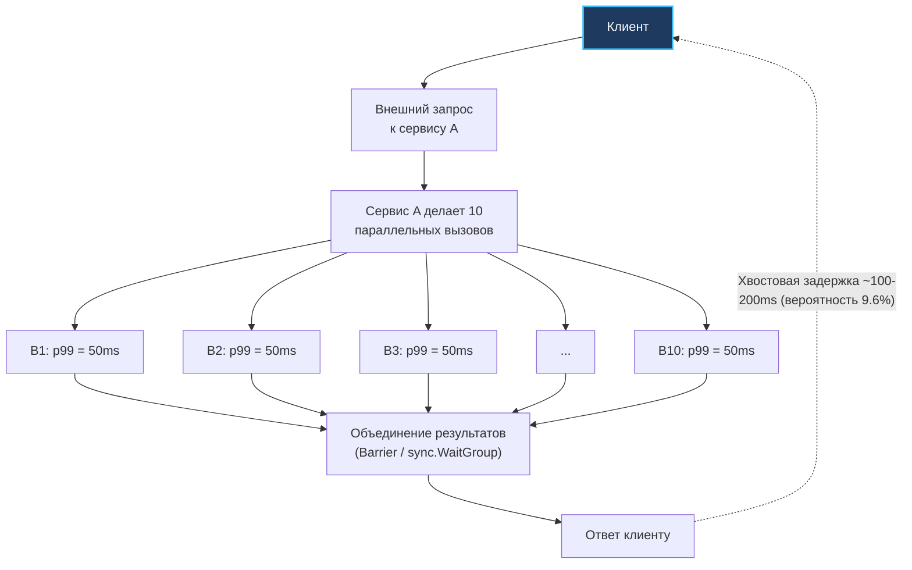

## Почему хвост важнее головы

В [[6. Метрики. p50, p95, p99]] мы наглядно доказали, почему среднее арифметическое способно ввести в заблуждение даже опытного инженера, и ввели понятие перцентилей. Теперь настало время заглянуть в самый опасный сектор распределения — в область за пределами 99-го и 99.9-го перцентилей. Речь пойдет о **Tail Latency** (хвостовой задержке).

Именно хвостовая задержка разрушает пользовательский опыт, исчерпывает бюджеты ошибок (Error Budgets) по соглашениям об уровне обслуживания (SLO) и делает современные микросервисные архитектуры пугающе хрупкими.

Почему хвостовая задержка важнее медианы? Потому что в распределенных системах **задержки не усредняются — они катастрофически накапливаются**.

> [!NOTE] Классический закон Джеффа Дина: «The Tail at Scale»
> В 2013 году легендарные инженеры Google Джефф Дин (Jeff Dean) и Луис Андре Баррозу (Luiz André Barroso) опубликовали в журнале Communications of the ACM фундаментальную работу *«The Tail at Scale»*. В ней они сформулировали математический парадокс распределенных систем.
> 
> Представьте типичный поисковый или рекомендательный сервис: чтобы сгенерировать одну веб-страницу, бэкенд-шлюз выполняет параллельный опрос (fan-out) **100 независимых шардов базы данных или микросервисов**.  
> Допустим, каждый отдельный шард работает великолепно: его p99 задержка составляет 50 миллисекунд (это означает, что вероятность того, что отдельный узел задержится дольше 50 мс, равна всего $1\% = 0.01$).
> 
> Какова вероятность того, что *хотя бы один* из ста узлов задержится и тем самым задержит весь ответ пользователю?
> 
> $$P(\text{Хвост всего запроса}) = 1 - (1 - 0.01)^{100} = 1 - (0.99)^{100} \approx 1 - 0.366 = 0.634 \quad (63.4\%!)$$
> 
> Задумайтесь над этим числом: **почти две трети (63.4%) всех пользователей испытают мучительную хвостовую задержку**, несмотря на то, что 99% отдельных микросервисов работают с идеальной скоростью!

Для Go-разработчика, проектирующего серверные системы на легковесных горутинах, эта проблема стоит острее, чем в любом другом языке. Go делает запуск сотен параллельных подзапросов тривиальной задачей: одна строчка `go func()` с `sync.WaitGroup` — и у вас готов паттерн fan-out. Но если вы не научитесь обуздывать хвосты, ваш сервис станет жертвой собственной масштабируемости.

---

## Физика хвостов: закон больших чисел и очереди

Хвостовая задержка никогда не возникает на пустом месте. В распределенных архитектурах она рождается из двух фундаментальных физических источников:

1. **Мультипликативное накопление независимых случайных задержек:**  
   Даже если каждый компонент имеет отличную медиану, при умножении параллельных вызовов вероятность «не повезти» хотя бы с одним растет по экспоненциальному закону.
2. **Коррелированные системные выбросы:**  
   События, которые бьют не по одному изолированному запросу, а одновременно замораживают сотни горутин: фазы Stop-The-World сборщика мусора, всплески загрузки CPU, аппаратные прерывания от сетевой карты (NIC interrupts), сбросы очередей записи на SSD или глобальная блокировка общего мьютекса.

### Модель накопления в fan-out

Рассмотрим классическую архитектуру агрегации данных:



Если сервис A совершает 10 параллельных вызовов к базам данных и микросервисам с вероятностью медленного ответа $1\%$, то вероятность того, что хотя бы один окажется в хвосте, составляет `1 - (0.99)^10 ≈ 9.6%`:

$$1 - (0.99)^{10} \approx 9.6\%$$

То есть практически каждый десятый внешний клиент сервиса A получит задержку, превышающую 50 мс.  
Более того, если время выполнения аппроксимируется экспоненциальным распределением (характерным для задержек пакетных сетей), математическое ожидание максимума из $N$ независимых величин растет пропорционально логарифму:

$$E[\max(X_1, \dots, X_N)] \approx \mu \cdot \ln(N)$$

Это означает, что хвостовая задержка сервиса A гарантированно вырастет со 50 мс до 120–200 мс без малейших изменений в коде сервисов B1...B10!

---

### Очереди и закон Литтла

Вспомним фундаментальный закон Литтла из [[2. Latency vs throughput]]:

$$L = \lambda \times W$$

Где $L$ — среднее число запросов в системе, $\lambda$ — пропускная способность (интенсивность потока запросов), $W$ — среднее время пребывания запроса в системе.

В теории массового обслуживания (система M/M/1 с пуассоновским входящим потоком с интенсивностью $\lambda$ и экспоненциальным временем обслуживания со средней интенсивностью $\mu$) среднее время пребывания запроса в системе выражается формулой:

$$W = \frac{1}{\mu - \lambda}$$

Коэффициент загрузки системы равен $\rho = \frac{\lambda}{\mu}$. Когда входящий поток приближается к предельной пропускной способности узла ($\rho \to 1.0$, то есть $\lambda \to \mu$), знаменатель дроби стремится к нулю, и время ожидания в очереди $W \to \infty$!

```
Время отклика (Latency)
  ▲
  │                                   Крутой взрыв задержки!
  │                                           ╭───
  │                                          ╭╯
  │                                         ╭╯
  │                                       ╭─╯
  │                                     ╭─╯
  │                             ╭───────╯
  │─────────────────────────────╯
  └───────────────────────────────────────────────► Коэффициент загрузки (ρ = λ/μ)
  0%                         70%       90%   100%
```

Этот нелинейный гиперболический взрыв задержек — главный закон теории очередей. Когда сервер загружен на 50%, очередь пуста. При 80% загрузки появляются умеренные задержки. Но стоит загрузке подняться до 92–95%, как время ожидания в очередях вырастает в 10–20 раз!  
Для бэкенда на Go это означает: любой кратковременный всплеск аллокаций или кратковременная пауза сборщика мусора мгновенно забивает очереди горутин, порождая огромный гиперэкспоненциальный хвост задержек.

---

## Источники хвостов в Go-рантайме

> [!info] Под капотом: Рантайм не бесплатен
> Даже идеально оптимизированный машинный код выполняется поверх сложнейшей среды рантайма Go. Рантайм обязан координировать параллелизм, очищать память и взаимодействовать с ядром ОС — и в критические моменты эти механизмы способны вносить внезапные микросекундные задержки.

Разложим ключевые источники хвостовых задержек в рантайме Go:

### 1. Сборщик мусора (GC)
Современный конкурентный трехцветный сборщик мусора Go ([[1. GC в Go. Обзор]], [[4. Concurrent GC]]) спроектирован так, чтобы не замораживать приложение на долгие секунды. Однако фазы остановки мира (Stop-The-World, STW) никуда не исчезли:
- **Sweep termination STW:** подготовка к началу маркировки.
- **Mark termination STW:** завершение маркировки и сброс очередей указателей ([[3. Stop the world]]).

В штатном режиме эти паузы длятся считанные микросекунды (10–50 мкс). Но если в системе наблюдается нехватка физической памяти или жесткий contention на `mcentral`, длительность STW может подскочить до нескольких миллисекунд. Для медианы (p50) эта миллисекунда абсолютно незаметна, но для p99 и p999 она становится тем самым пиком, пробивающим потолок SLA.

Кроме того, фоновые горутины маркировки памяти (GC mark workers) забирают ровно **25% процессорной мощности** всех ядер кристалла. При высокой нагрузке эта потеря процессорного бюджета вызывает задержки в обработке бизнес-запросов. Настройка переменных окружения `GOGC` ([[7. GOGC и tuning]]) и `GOMEMLIMIT` ([[8. GOMEMLIMIT]]) — базовые инструменты сдерживания аппетитов GC.

### 2. Планировщик горутин
Модель G-M-P ([[1. Scheduler Go. G-M-P модель]]) великолепно распределяет задачи по ядрам. Но если число готовых к исполнению горутин (`_Grunnable`) превышает значение `GOMAXPROCS`, они вынуждены ждать в очередях `runq`. 
Если горутина вытесняется по тайм-ауту прерывания (асинхронный преемпшн на базе сигналов в Go 1.14+) или ожидает канал, она теряет квант процессора. Возврат к исполнению зависит от загрузки системы и может занять от десятков микросекунд до миллисекунд.

Алгоритм **Work Stealing** ([[3. Work stealing]]) балансирует очереди, но кража горутин происходит с задержкой. Более того, при миграции горутины на ядро другого NUMA-узла теряются прогретые кэши L1/L2 и записи TLB ([[5. Mechanical sympathy в backend разработке]]), порождая микросекундную паузу на чтение холодной памяти.

### 3. Системные вызовы и блокировки
Блокирующие системные вызовы ([[1. Системные вызовы и их стоимость]]) — синхронный дисковый ввод-вывод без флага `O_NONBLOCK`, блокирующие операции `flock` или резолвинг DNS через системный `cgo` — принудительно открепляют поток ОС $M$ от логического процессора $P$ (`entersyscallblock`).  
Если в пуле рантайма нет свободных потоков $M$, рантайм вызывает `clone()` / `pthread_create()` для создания нового треда ОС. Запуск потока на уровне ядра Linux занимает от 0.5 до 2 миллисекунд!  
Аналогично, если горутины сталкиваются с конкуренцией за `sync.Mutex` и переходят от спин-блокировки к системному семафору `futex`, латентность пробуждения исчисляется микросекундами. Выявить такие задержки помогают профили блокировок ([[5. block profile]]) и мьютексов ([[6. mutex profile]]).

### 4. Ложное разделение кэша (False sharing)
Если две горутины на разных ядрах параллельно модифицируют независимые переменные, расположенные в пределах одной 64-байтной кэш-линии ([[8. False sharing]]), ядра тратят время на шторм сообщений инвалидации по протоколу MESI. В моменты пиковой конкуренции это приводит к внезапным непредсказуемым провалам производительности.

### 5. Сеть и netpoller
Сетевой поллер Go ([[4. epoll, kqueue и netpoller]]) опирается на события готовности дескрипторов ядра. Когда пакет приходит на сетевой адаптер, ядро обрабатывает аппаратное прерывание (hard IRQ), затем софтовое прерывание (ksoftirqd), помещает дескриптор в epoll ready list, и лишь затем рантайм Go переводит горутину в очередь `runnable`.  
При одновременном завершении тысяч операций ввода-вывода (thundering herd) рантайм тратит заметное время на пробуждение и постановку горутин в очереди, растягивая правый хвост.

---

## Методы борьбы с хвостовой задержкой в Go

Senior-инженер бэкенда не надеется на удачу. Борьба с хвостовой задержкой — это активная инженерная дисциплина, опирающаяся на набор проверенных паттернов.

### 1. Установка жестких таймаутов и дедлайнов
Каждый сетевой запрос к внешней системе, базе данных или внутреннему микросервису обязан иметь строгий дедлайн. В Go каноническим механизмом управления временем жизни операции является `context.Context` с вызовом `context.WithTimeout`:

```go
// Отсекаем зависший запрос через 50 миллисекунд
ctx, cancel := context.WithTimeout(r.Context(), 50*time.Millisecond)
defer cancel()

req, err := http.NewRequestWithContext(ctx, http.MethodGet, targetURL, nil)
if err != nil {
    return nil, err
}
resp, err := client.Do(req)
```

Таймаут гарантирует, что медленный запрос не будет удерживать ресурсы бесконечно. Однако сам по себе таймаут не спасает пользователя от ошибки — он лишь грубо обрывает операцию. Чтобы спасти пользовательский запрос, применяют хеджирование.

---

### 2. Хеджирование запросов (Request Hedging)

Паттерн **Request Hedging** (хеджированные запросы) — жемчужина архитектуры Google:
1. Мы отправляем базовый запрос к инстансу сервиса.
2. Если ответ не пришел в течение ожидаемого времени (например, порога p95 задержки — допустим, 25 мс), мы **не обрываем** первый запрос, а **параллельно отправляем дублирующий запрос** к другому независимому экземпляру реплики!
3. Кто ответит первым — тот и побеждает. Зависший или опоздавший запрос немедленно отменяется через `context.CancelFunc`.

Реализуем классический идиоматичный паттерн хеджирования в Go:

```go
package hedging

import (
	"context"
	"errors"
	"time"
)

// HedgedCall выполняет fn. Если в течение delay ответа нет,
// параллельно запускается второй экземпляр fn к альтернативной реплике.
func HedgedCall[T any](
	ctx context.Context,
	delay time.Duration,
	fn func(ctx context.Context) (T, error),
) (T, error) {
	ctx, cancel := context.WithCancel(ctx)
	defer cancel()

	type result struct {
		val T
		err error
	}

	resCh := make(chan result, 2)

	// Запуск первого (основного) запроса
	go func() {
		val, err := fn(ctx)
		resCh <- result{val: val, err: err}
	}()

	// Таймер для запуска хеджированного дубликата
	timer := time.NewTimer(delay)
	defer timer.Stop()

	var firstErr error

	select {
	case res := <-resCh:
		if res.err == nil {
			return res.val, nil
		}
		firstErr = res.err
	case <-timer.C:
		// Время p95 истекло: запускаем хеджирующий запрос к другой реплике
		go func() {
			val, err := fn(ctx)
			resCh <- result{val: val, err: err}
		}()
	case <-ctx.Done():
		var zero T
		return zero, ctx.Err()
	}

	// Ожидаем ответ от первого или второго исполнителя
	for i := 0; i < 2; i++ {
		select {
		case res := <-resCh:
			if res.err == nil {
				return res.val, nil
			}
			firstErr = res.err
		case <-ctx.Done():
			var zero T
			return zero, ctx.Err()
		}
	}

	var zero T
	if firstErr != nil {
		return zero, firstErr
	}
	return zero, errors.New("hedging: all attempts failed")
}
```

Хеджирование кардинально срезает хвост p99: если вероятность задержки на одном узле составляет 1%, вероятность одновременной задержки двух независимых узлов составляет $0.01 \times 0.01 = 0.0001$ (0.01% — p99.99!). При этом дополнительный сетевой оверхед составляет всего лишь 5% дополнительных запросов (так как хеджирование активируется только после p95).

> [!warning] Подводный камень: Шторм повторов (Hedging & Retry Storm)
> Хеджирование — мощное, но опасное оружие. Если бэкенд начал тормозить не из-за случайной локальной сетевой задержки, а по причине глобальной 100% перегрузки CPU или базы данных, отправка дополнительных дублирующих запросов превратится в лавинообразный DDoS собственного сервиса.  
> **Обязательное правило:** Хеджирование должно ограничиваться токен-бакетом (например, не более 5–10% от общего числа входящих RPS) и блокироваться при срабатывании Circuit Breaker.

---

### 3. Приоритезация и обратное давление (Backpressure)

Когда нагрузка приближается к насыщению, система должна сбрасывать низкоприоритетный трафик (фоновую аналитику, синхронизацию аватарок), сохраняя вычислительные ресурсы для транзакций и критических запросов:

```go
package priority

import (
	"context"
	"errors"
)

var ErrOverloaded = errors.New("system overloaded: low priority request rejected")

type PrioritySemaphore struct {
	high chan struct{}
	low  chan struct{}
}

func NewPrioritySemaphore(highLimit, lowLimit int) *PrioritySemaphore {
	return &PrioritySemaphore{
		high: make(chan struct{}, highLimit),
		low:  make(chan struct{}, lowLimit),
	}
}

func (ps *PrioritySemaphore) Acquire(ctx context.Context, highPri bool) error {
	if highPri {
		select {
		case ps.high <- struct{}{}:
			return nil
		case <-ctx.Done():
			return ctx.Err()
		}
	}

	// Низкий приоритет: не встаем в очередь, если лимит исчерпан
	select {
	case ps.low <- struct{}{}:
		return nil
	default:
		return ErrOverloaded
	}
}

func (ps *PrioritySemaphore) Release(highPri bool) {
	if highPri {
		<-ps.high
	} else {
		<-ps.low
	}
}
```

Концепция **Backpressure** исключает рост очередей: лучше сразу отказать клиенту быстрым ответом `HTTP 429 Too Many Requests`, чем принять запрос, поставить его в конец очереди и заставить ждать 5 секунд до неминуемого сброса по тайм-ауту.

---

### 4. Настройка сборщика мусора и аллокаций

Минимизация аллокаций памяти на критическом пути выполнения ([[1. Уменьшение аллокаций]]) напрямую снижает объем мусора, генерируемого в секунду.  
Использование пулов памяти `sync.Pool` ([[2. sync Pool]]) переиспользует временные структуры и слайсы байт, сохраняя их теплыми в кэшах L2/L3 процессора.  
Тонкая настройка `GOGC` ([[7. GOGC и tuning]]) и жесткого лимита `GOMEMLIMIT` ([[8. GOMEMLIMIT]]) предотвращает внезапные спазмы памяти и стабилизирует поведение сборщика под пиковыми нагрузками.

### 5. Избегание горячих блокировок и false sharing

- **Шардирование мьютексов:** замена одного глобального `sync.Mutex` на массив шардированных мьютексов (разделение по ключу хэширования) сокращает время ожидания в очереди блокировки в десятки раз.
- **Выравнивание структур:** применение байтового паддинга до границы 64-байтной кэш-линии ([[9. Cache line и выравнивание]]) ликвидирует аппаратное ложное разделение кэша (False Sharing) и стабилизирует время доступа к атомикам.

### 6. Асинхронная обработка и отложенные работы

Все операции, не влияющие непосредственно на формирование ответа пользователю (отправка писем, аналитические логи, прогрев вторичных кэшей), обязаны немедленно выноситься из синхронного цикла обработки запроса в фоновые горутины или распределенные брокеры сообщений ([[13. Очереди, брокеры сообщений и оркестраторы]]). Чем меньше шагов на критическом пути — тем меньше дисперсия задержки.

---

## Мониторинг хвостов: инструменты для Go

Для регулярного аудита и поиска скрытых источников хвостовых задержек в Go применяются:

1. **`go tool trace` (Execution Tracer, см. [[3. execution tracer]]):**  
   Абсолютно незаменимый инструмент для поиска хвостов. В отличие от статистического CPU-профилировщика (который усредняет замеры за секунды), трассировщик показывает миллисекундную покадровую развертку: паузы GC, моменты ожидания в очередях планировщика, блокировки на сетевых сокетах и переключение контекстов.
2. **Профили блокировок и мьютексов (`-blockprofile`, `-mutexprofile`):**  
   Показывают совокупное время, проведенное горутинами в состоянии ожидания освобождения примитивов синхронизации (см. [[5. block profile]] и [[6. mutex profile]]).
3. **Гистограммы Prometheus с экспоненциальными корзинами:**  
   Позволяют строить кривые p95, p99 и p99.9 в реальном времени под боевой нагрузкой.
4. **Распределенная трассировка (OpenTelemetry / Jaeger):**  
   Позволяет визуализировать каскадный fan-out и моментально pinpoint'ить конкретный удаленный сервис, чей ответ застрял в хвосте.
5. **Нагрузочное тестирование с измерением перцентилей ([[1. Load testing]]):**  
   Генерация реалистичной открытой модели нагрузки с помощью инструментов с поддержкой квантилей (Vegeta, k6).

> [!tip] Собеседование: Расследование роста p99 в Go-микросервисе
> **Вопрос:** В продакшене у ключевого Go-микросервиса медиана p50 составляет 5 мс, но p99 неожиданно вырос с 30 мс до 650 мс. Ошибок в логах нет, CPU загружен на 60%. Каков ваш систематический план расследования причин инцидента?
> 
> **Ответ кандидата уровня Senior:**  
> 1. **Корреляция с метриками рантайма:**  
>    Проверю корреляцию с GC-метриками (`/gc/pause:seconds`, `/gc/pauses:seconds`), загрузкой CPU, частотой аллокаций и числом горутин, а также метрикой времени ожидания горутин в очереди планировщика `/sched/latencies:seconds`.
> 2. **Снятие детальных профилей рантайма:**  
>    В момент деградации сниму трассировку выполнения `curl http://service/debug/pprof/trace?seconds=5` и открою через `go tool trace`. Изучу: нет ли длинных фаз `Mark Termination` или блокировок тредов $M$ на системных вызовах (`entersyscallblock`).
> 3. **Анализ конкуренции за блокировки:**  
>    Сниму `mutex.pprof` и `block.pprof`. Проверю, нет ли контеншна за разделяемые ресурсы (`sync.Mutex`, небуферизованные каналы, пулы соединений `sql.DB` или `http.Client`).
> 4. **Аппаратный аудит через `perf`:**  
>    В терминале сервера выполню:
>    ```bash
>    perf stat -e cache-misses,context-switches,cpu-migrations -p <PID>
>    ```
>    Высокая частота миграций и промахов кэша укажет на вытеснение потоков ядром ОС или эффект False Sharing.
> 5. **Анализ внешних зависимостей и fan-out:**  
>    По распределенным трейсам OpenTelemetry проверю внешние зависимости. Если сервис делает fan-out запросы к базе данных или внешним API, проверю наличие дедлайнов в `context.WithTimeout` и возможность внедрения паттерна Request Hedging.

---

## Итог: хвост как архитектурный компас

- **Хвостовая задержка (Tail Latency)** — фундаментальное свойство распределенных систем. В операциях с параллельным fan-out вызовом вероятность столкнуться с хвостом экспоненциально возрастает ($1 - (1-p)^N$), превращая редкий 1% выброс в проблему для большинства клиентов.
- Теория очередей (закон Литтла и система M/M/1) доказывает, что при приближении загрузки к 90%+ время ожидания в очереди взрывается гиперболически.
- В рантайме Go главные виновники хвостовых задержек — паузы сборщика мусора (GC STW), очереди планировщика G-M-P, блокирующие системные вызовы ядра и аппаратное ложное разделение кэша (False Sharing).
- Ключевые архитектурные методы подавления хвостов: жесткие таймауты контекста, **Request Hedging** (запуск дублирующих запросов после p95), приоритезация трафика и обратное давление (**Backpressure**), шардирование мьютексов и пулы `sync.Pool`.
- Инструменты диагностики: покадровый трассировщик `go tool trace`, профили блокировок `pprof`, счетчики `perf` и гистограммы Prometheus.

Хвостовая задержка — самое честное зеркало здоровья бэкенда. Она беспощадно вскрывает архитектурные компромиссы, которые невозможно заметить на графиках медианы.  
На этом мы завершаем фундаментальный подраздел. В следующем подразделе мы перейдем к практике измерений и вооружимся главным рабочим инструментом инженера: начнем с фундаментального принципа [[1. Почему нельзя оптимизировать без измерений]].