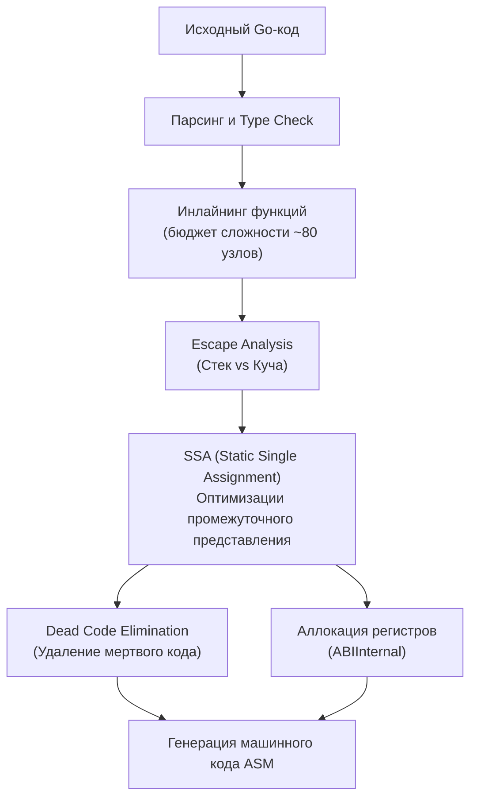
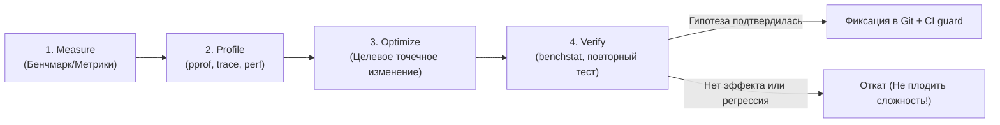

## Оптимизация без измерений — это не оптимизация

В предыдущем подразделе мы возвели прочный фундамент инженерного мышления: развели по разным категориям время отклика и пропускную способность ([[2. Latency vs throughput]]), классифицировали вычислительную нагрузку по лимитирующим ресурсам ([[3. CPU bound vs IO bound задачи]]), вывели математический предел ускорения по закону Амдала ([[4. Amdahl law и масштабирование]]), погрузились в кремниевое железо через призму механической эмпатии ([[5. Mechanical sympathy в backend разработке]]) и изучили поведение хвостов распределений ([[6. Метрики. p50, p95, p99]], [[7. Tail latency и почему она важна]]).

Теперь мы переступаем порог практической оптимизации. И на входе в эту дисциплину высечено золотое правило: **никогда не оптимизируйте код без объективных измерений**.

Это не просто вежливый совет для новичков. Это фундаментальная инженерная аксиома. Нарушение этого закона неизбежно приводит к трем классическим бедам:
1. Вы усложняете архитектуру и делаете код нечитаемым ради «ускорения», которого не существует.
2. Вы «оптимизируете» участок, на который процессор тратит 0.01% своего времени, оставляя без внимания слона посреди комнаты.
3. Вы получаете мнимый локальный выигрыш в синтетическом цикле, который под боевой нагрузкой превращается в катастрофическую деградацию производительности.

> [!NOTE] Афоризмы Кернигана и Пайка: Измеряйте, не гадайте
> В классической книге *«The Elements of Programming Style»* (1974) Брайан Керниган и Филлип Плоджер сформулировали кредо, не потерявшее ни грамма актуальности спустя полвека:
> > *«Не ковыряйте код наугад, чтобы сделать его быстрее — найдите лучший алгоритм. Сначала сделайте программу работающей, затем правильной, и лишь потом — быстрой»*.
> 
> А один из отцов-основателей языка Go Роб Пайк (Rob Pike) в своих знаменитых «Пяти правилах программирования» поставил измерения на первые два места:
> > **Правило 1:** *«Вы не можете знать заранее, где программа тратит свое время. Узкие места возникают в самых неожиданных местах. Не пытайтесь угадывать и вставлять хаки для скорости до тех пор, пока измерениями не доказали, где именно находится bottleneck»*.  
> > **Правило 2:** *«Измеряйте. Не настраивайте скорость, пока не измерили профилировщиком. И даже после измерений не оптимизируйте, если этот фрагмент кода не доминирует над остальными»*.

---

## Ловушка интуиции: почему «очевидное» не работает

Почему даже опытные разработчики снова и снова попадаются на удочку преждевременных оптимизаций? 

Человеческий мозг устроен так, что ищет простые, прямолинейные эвристики: *«указатели всегда быстрее копирования значений»*, *«пул объектов всегда снижает нагрузку на память»*, *«битовые сдвиги быстрее умножения»*, *«связный список быстрее слайса при вставках»*.

В простом мире 8-битных микроконтроллеров 1970-х годов эти правила еще могли работать. Но в современном мире многоядерных процессоров x86-64 и ARM64, оптимизирующих компиляторов Go, суперскалярных конвейеров, трехуровневых кэшей и конкурентных сборщиков мусора **интуиция программиста систематически ошибается**.

### 1. Иллюзия алгоритмической сложности: Слайс против Списка
Хрестоматийный пример: разработчик решает реализовать очередь и заменяет плоский срез (`[]T`) на двусвязный список (`container/list`). Логика «на бумаге»: удаление из начала слайса требует сдвига всех элементов ($O(N)$), а переброска указателей в списке стоит $O(1)$. 
Но запускаем бенчмарк на выборке из 10 000 элементов — и срез опережает связный список в **30–50 раз**! Почему? Потому что связный список размазан по куче, заставляя процессор совершать промахи кэша на каждом разыменовании указателя, в то время как аппаратный префетчер процессора бесплатно подгружает плотный слайс целыми 64-байтными кэш-линиями ([[5. Mechanical sympathy в backend разработке]]). Теоретическое $O(1)$ в памяти разбилось о законы физики кремния.

### 2. Иллюзия бесплатного переиспользования: `sync.Pool`
Другой популярный миф в Go: *«Обернем все короткоживущие структуры в `sync.Pool` ([[2. sync Pool]]), чтобы GC отдыхал»*.  
Но если объект имеет крошечный размер (до 32–64 байт) и компилятор Go благодаря Escape Analysis оставляет его на стеке функции, добавление `sync.Pool` превращается в диверсию:
- Вместо бесплатного перемещения указателя стека `RSP` (0 наносекунд) программа начинает тратить такты на упаковку структуры в интерфейс `any` (что само по себе провоцирует аллокацию в куче!).
- Добавляются накладные расходы на обращение к локальному пулу процессора `poolLocal` и атомарные блокировки.
- Выигрыш от GC равен нулю, а задержка функции возрастает в 3 раза.

**Производительность эмерджентна**. Она не заложена в отдельных строчках кода — она рождается на стыке исходного текста, дерева абстрактного синтаксиса компилятора, рантайма Go, планировщика ядра Linux и физической микроархитектуры процессора. Предсказать результат этого ансамбля «на глаз» невозможно. Единственный объективный судья — **воспроизводимое измерение**.

---

## Компилятор Go: непредсказуемый союзник

Между тем, что вы написали в файле `.go`, и тем, что выполняет процессор, стоит компилятор Go (`cmd/compile`). Он непрерывно развивается: то, что требовало ручной оптимизации в Go 1.10, сегодня компилятор делает сам и лучше вас. Более того, компилятор выполняет агрессивные оптимизации, которые могут превратить вашу «ручную настройку» в фарс:



1. **Инлайнинг функций ([[5. Inline и влияние на performance]]):**  
   Компилятор автоматически встраивает тело небольших функций прямо в точку вызова, устраняя пролог, эпилог и передачу параметров. Но если функция превышает бюджет сложности (порядка 80 AST-узлов), инлайнинг отключается. Вы добавили безобидное логирование или вызов `defer` — функция вылетела из инлайнинга, и цикл замедлился в 4 раза. Без бенчмарка вы никогда об этом не узнаете.
2. **Escape Analysis ([[3. Escape analysis]]):**  
   Компилятор решает, может ли переменная остаться на сверхбыстром стеке или обязана сбежать в кучу. Одно неосторожное приведение к интерфейсу `fmt.Println(val)` заставляет переменную сбежать в кучу, порождая аллокацию и работу для сборщика мусора.
3. **Dead Code Elimination (Удаление мертвого кода):**  
   Если результат вычислений в вашей функции не используется и не имеет побочных эффектов, компилятор Go имеет полное право полностью выбросить весь этот блок из машинного кода! В бенчмарках это приводит к иллюзии «мгновенного исполнения» ([[4. Подводные камни benchmark тестов]]).

---

## Пример: два способа конкатенации строк

Рассмотрим классический пример из повседневной практики. Интуиция любого программиста твердит: *«Оператор `+` для строк в цикле — табу. Строки неизменяемы, на каждом шаге выделяется новый буфер. Всегда используйте `strings.Builder`!»*

Сравним два подхода:

```go
package concat

import "strings"

// ConcatPlus: интуитивно "медленный" способ
func ConcatPlus(parts []string) string {
	var s string
	for _, p := range parts {
		s += p
	}
	return s
}

// ConcatBuilder: интуитивно "быстрый" способ
func ConcatBuilder(parts []string) string {
	var b strings.Builder
	for _, p := range parts {
		b.WriteString(p)
	}
	return b.String()
}
```

Проверим наши предположения через бенчмарк на разных объемах данных:

```go
func BenchmarkConcat(b *testing.B) {
	cases := []struct {
		name string
		data []string
	}{
		{"Small_3_items", []string{"hello", " ", "world"}},
		{"Medium_100_items", makeStrings(100)},
	}

	for _, tc := range cases {
		b.Run("Plus_"+tc.name, func(b *testing.B) {
			b.ReportAllocs()
			for i := 0; i < b.N; i++ {
				_ = ConcatPlus(tc.data)
			}
		})
		b.Run("Builder_"+tc.name, func(b *testing.B) {
			b.ReportAllocs()
			for i := 0; i < b.N; i++ {
				_ = ConcatBuilder(tc.data)
			}
		})
	}
}
```

Результаты запуска повергнут поклонников универсальных правил в изумление:
- **На 100 элементах:** `strings.Builder` опережает `+` более чем в **40 раз**, сокращая аллокации с 99 до 1. Интуиция права.
- **Но на 3 элементах:** `ConcatPlus` работает **быстрее**, чем `strings.Builder`, расходуя меньше памяти!  
  Почему? Потому что компилятор Go для 2–3 конкатенаций вызывает внутреннюю функцию рантайма `runtime.concatstrings`, которая заранее вычисляет суммарную длину и делает ровно **одну** аллокацию нужного размера. А `strings.Builder` вынужден инициализировать внутреннюю структуру, слайс байт и выполнять проверки емкости.

Интуитивное правило «всегда используй Builder» оказалось неверным для коротких строк. Только замер в конкретном контексте дает истинный ответ.

---

## «Быстрый» код, убитый GC

Представьте типичный случай из продакшена: инженер стремится оптимизировать горячий путь обработки сетевых запросов. Чтобы свести аллокации к нулю, он создает глобальный пул структур или разделяемый буфер, защищенный `sync.Mutex`.

На синтетическом бенчмарке в один поток результат ошеломляет: 0 B/op, 0 allocs/op, время обработки сократилось на 30%. Победа?

Код выкатывается в продакшен. На сервере с 64 процессорными ядрами при входящем потоке 50 000 RPS происходит катастрофа:
- Нагрузка на CPU взлетает до 100%.
- Задержка p99 подскакивает с 10 мс до 1500 мс ([[7. Tail latency и почему она важна]]).
- Система захлебывается в тайм-аутах.

Что произошло? Инженер не измерил конкуренцию за блокировки (**Lock Contention**, см. [[7. Contention и lock profiling]]). 64 ядра встали в глухую очередь к единственному мьютексу. Попытка сэкономить несколько байт аллокаций уничтожила параллелизм сервиса. Если бы автор провел измерения под конкурентной нагрузкой с профилированием блокировок (`-mutexprofile`), он бы мгновенно увидел contention и сохранил локальные аллокации на горутину.

---

## Data-Driven Performance: культура принятия решений

Инженерный уровень Senior и Lead определяется тем, как специалист обосновывает изменения в кодовой базе.
- **Разработчик Junior:** *«Я переписал этот метод, потому что читал на Хабре, что так быстрее»*.
- **Инженер Senior:** *«Я замерил текущий профиль: 38% времени уходило на сериализацию. Переход на кодогенерацию сократил p50 на 22%, p99 на 14%, аллокации снизились на 35%. Результаты benchstat подтверждают статистическую значимость ($p < 0.001$). Дополнительная когнитивная сложность — 25 строк кода. Изменение оправдано, вливаем в main»*.



Этот строгий цикл — **Measure → Profile → Optimize → Verify**, заложенный в [[1. Обзор раздела. Как мыслить о производительности]], исключает самообман.

### Инструменты измерения для Go-разработчика

В арсенале современного Go-инженера есть полный спектр инструментов для каждого уровня детализации:

1. **Микробенчмарки (`go test -bench`):**  
   Первая линия обороны. Изолирует функцию или алгоритм и измеряет время одной итерации (нс/операцию) и расход памяти.
2. **Статистический анализатор `benchstat`:**  
   Математический инструмент для сравнения серий запусков бенчмарков «до» и «после», отсекающий аппаратный шум.
3. **Профилировщик `pprof` ([[2. CPU profiling в Go]], [[5. pprof memory profile]], [[5. block profile]], [[6. mutex profile]]):**  
   Показывает, на какие именно функции, системные вызовы и блокировки тратится реальное процессорное время и память.
4. **Трассировщик выполнения `go tool trace` ([[3. execution tracer]]):**  
   Покадровая развертка взаимодействия горутин, работы планировщика рантайма и пауз сборщика мусора.
5. **Нагрузочное тестирование ([[1. Load testing]]):**  
   Проверка системы целиком в реалистичных условиях боевого трафика (инструменты k6, Vegeta, wrk).
6. **Автоматический контроль регрессий в CI/CD ([[5. Performance regression detection]]):**  
   Автоматический прогон бенчмарков на выделенных runner'ах для каждого Pull Request'а, блокирующий деградацию производительности.

### Пример реального workflow оптимизации

1. **Сигнал мониторинга:** Нагрузочный тест фиксирует, что при достижении 5 000 RPS сервис перестает укладываться в целевой SLO (p99 превышает 150 мс).
2. **Профилирование под нагрузкой:** Снимаем CPU-профиль сервиса: 32% времени тратится на стандартный `json.Unmarshal`.
3. **Изолированный бенчмарк:** Пишем воспроизводимый бенчмарк на анмаршалинг боевого JSON-пейлоада.
4. **Тестирование гипотезы:** Пробуем альтернативный высокопроизводительный генератор парсеров (`easyjson` или `sonic`).
5. **Сравнение через `benchstat`:** Проверяем ускорение на микроуровне.
6. **Сквозная верификация:** Внедряем изменение в сервис, повторяем нагрузочный тест на 5 000 RPS. Убеждаемся, что p99 опустился до 40 мс, а CPU разгрузился на 25%.
7. **Фиксация защиты:** Включаем бенчмарк в репозиторий с проверкой регрессий, чтобы будущие рефакторинги не вернули неэффективный код.

---

## Mechanical Sympathy: почему измерения важны на всех уровнях

Отказ от измерений игнорирует физическую природу компьютера:

- **Кэши процессора:** Вы переставили поля структуры, чтобы упаковать ее компактнее. Интуитивно — стало лучше. Но без замера промахов кэша через системную утилиту `perf stat` вы не заметите, что случайно сблизили два часто модифицируемых поля и создали ложное разделение кэша (**False Sharing**, см. [[8. False sharing]]), снизив скорость параллельного исполнения в 4 раза.
- **Системные вызовы ядра:** Вы завернули сетевой ввод-вывод в `bufio.Writer`, надеясь амортизировать системные вызовы ([[1. Системные вызовы и их стоимость]]). Но какого размера буфер выбрать: 4 КБ, 64 КБ или 1 МБ? Только профилирование системных вызовов (`strace` или `perf trace`) покажет, сколько реальных системных вызовов `write()` доходит до ядра Linux.

---

## Ментальный сдвиг: от «сделать быстро» к «измерить и сделать быстрее»

Умение вовремя остановиться и не писать «оптимизированный» код — признак профессиональной зрелости инженера. 

Сложный, изощренный код с ручным управлением памятью, битовой магией и ассемблерными вставками стоит дорого: его тяжело читать, тяжело тестировать и смертельно опасно модифицировать. Если этот код ускоряет операцию, которая выполняется один раз при старте сервера, цена такой оптимизации — чистый убыток для бизнеса.

> [!tip] Собеседование: Обоснование отказа от оптимизации
> **Вопрос:** На код-ревью коллега предлагает переписать читаемый бизнес-код на низкоуровневые трюки со `sync.Pool`, аргументируя это тем, что «так мы сэкономим память». Как аргументированно ответить коллеге?
> 
> **Ответ кандидата уровня Senior:**  
> 1. Напомнить базовый инженерный принцип: любое усложнение кода должно быть экономически оправдано.
> 2. Попросить предоставить два обязательных артефакта:
>    - Профиль продакшена (`pprof`), доказывающий, что именно эта структура создает существенную нагрузку на GC (более 5–10% аллокаций сервиса).
>    - Воспроизводимый бенчмарк с замером аллокаций (`-benchmem`) и прогоном через `benchstat`, подтверждающий статистически значимый выигрыш.
> 3. Продемонстрировать на бенчмарке, что для объектов, не сбегающих в кучу (на стеке), `sync.Pool` лишь увеличивает задержку и замусоривает кодовую базу.

---

## Итог

- **Оптимизация без измерений — это стрельба вслепую.** Интуиция разработчика регулярно терпит крах при столкновении с оптимизирующим компилятором Go, рантаймом и многоуровневыми кэшами процессора.
- **Компилятор Go трансформирует код:** инлайнинг, Escape Analysis и устранение мертвого кода делают наивный анализ исходного текста бессмысленным.
- **Любая оптимизация циклична:** Measure → Profile → Optimize → Verify. Без этапа проверки через `benchstat` оптимизация считается незавершенной.
- **Учитывайте цену сложности:** простой и понятный код предпочтительнее «быстрого», если выигрыш не подтвержден профилировщиком на критическом пути выполнения.
- **Культура Data-Driven Performance** опирается на строгий инструментарий Go: бенчмарки, `pprof`, `go tool trace`, `perf` и автоматические проверки в CI.

В следующей лекции [[2. Benchmarking в Go]] мы перейдем от философии измерений к техническому устройству главного исследовательского инструмента Go-разработчика: разберем механику пакета `testing`, устройство структуры `testing.B` и принципы написания безупречных бенчмарков.