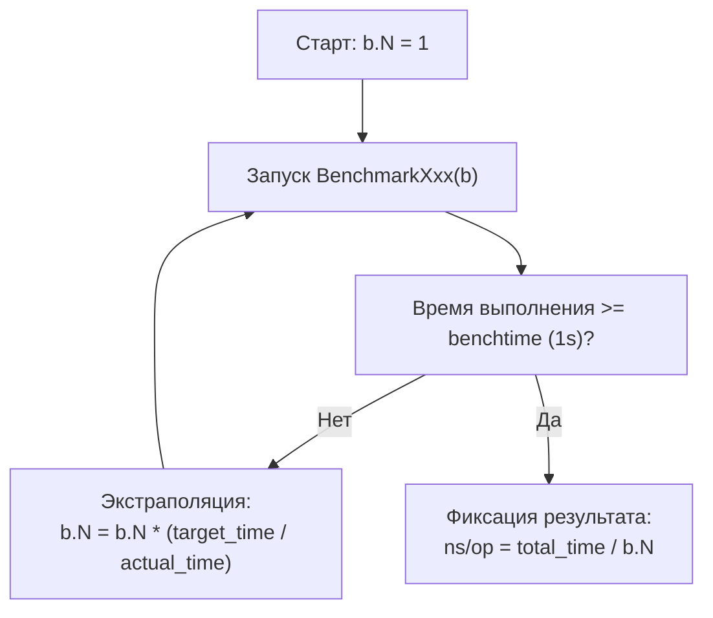
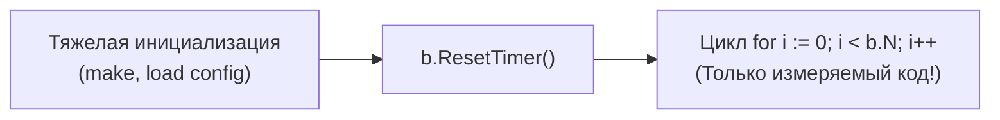
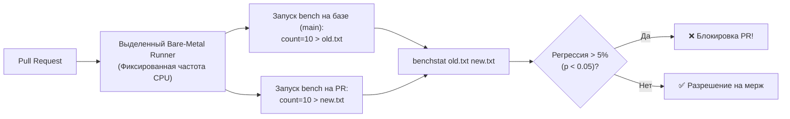

## Введение: бенчмарк как первый шаг измерения

В [[1. Почему нельзя оптимизировать без измерений]] мы сформулировали железную аксиому инженерного проектирования: **любая оптимизация без объективных цифр — это самообман**.

Но как именно добыть эти цифры? В мире C/C++ разработчикам десятилетиями приходилось вручную подключать сторонние библиотеки вроде Google Benchmark, оборачивать вызовы в функции замера тактов процессора `rdtsc` и бороться с плавающими ошибками системных таймеров.  
Создатели языка Go подошли к вопросу с фундаментальной инженерной основательностью: инструмент бенчмаркинга встроен непосредственно в стандартную библиотеку и инструментарий компилятора (`testing` и `go test -bench`).

Вам не нужны внешние зависимости. Одной командой в консоли Go-разработчик запускает изолированное измерение скорости алгоритма, автоматически калибрует число итераций, снимает профили выделения оперативной памяти и подключает профилировщики процессора (`pprof`).

Эта статья — исчерпывающее практическое руководство по написанию, запуску и интерпретации бенчмарков в Go. Мы разберем синтаксис, анатомию вывода консоли, управление таймерами, параллельные измерения и ключевые правила, отделяющие надежные инженерные замеры от фальшивых иллюзий. А глубокие детали внутренней кухни (алгоритм геометрической прогрессии подбора `b.N`, устройство таймеров ОС) мы продолжим изучать в [[3. go test -bench под капотом]].

---

## Основы: функция `Benchmark`

Бенчмарк в Go — это специальная функция с сигнатурой:

```go
func BenchmarkXxx(b *testing.B)
```

Она подчиняется строгим правилам организации тестового кода Go:
1. Функция обязана находиться в файле с суффиксом `*_test.go` (например, `string_bench_test.go`).
2. Имя функции обязано начинаться с префикса `Benchmark`, после которого следует заглавная буква или знак подчеркивания.
3. Функция принимает единственный аргумент — указатель на управляющую структуру `*testing.B`.

Структура `*testing.B` управляет жизненным циклом замера: отсчитывает кванты времени, задает количество повторений через поле `b.N` и собирает статистику аллокаций.

### Классический шаблон бенчмарка

```go
package stringbench_test

import (
	"fmt"
	"testing"
)

func BenchmarkSprintf(b *testing.B) {
	// Подготовительный код (при необходимости) выполняется здесь
	
	// Главный измерительный цикл: ровно b.N итераций!
	for i := 0; i < b.N; i++ {
		_ = fmt.Sprintf("hello %d", i)
	}
}
```

Запустим бенчмарк из терминала с флагом замера памяти `-benchmem`:

```bash
go test -bench=^BenchmarkSprintf$ -benchmem
```

В консоли появится каноническая строка отчета:

```
goos: linux
goarch: amd64
pkg: stringbench
cpu: 13th Gen Intel(R) Core(TM) i7-13700K
BenchmarkSprintf-8   	10000000	       112.3 ns/op	      16 B/op	       2 allocs/op
PASS
ok  	stringbench	1.245s
```

Разберем каждую колонку этого отчета:
- **`BenchmarkSprintf-8`**: имя запущенного бенчмарка. Суффикс `-8` указывает на значение `GOMAXPROCS` (число задействованных логических процессоров рантайма).
- **`10000000`**: финальное значение счетчика `b.N`. Чтобы замер был статистически достоверен, рантайм выполнил тело цикла ровно 10 миллионов раз.
- **`112.3 ns/op`** (наносекунд на операцию): среднее амортизированное время выполнения одной итерации цикла.
- **`16 B/op, 2 allocs/op`** — средние байты и количество аллокаций на итерацию (`16 B/op`: 16 байт в куче за операцию, `2 allocs/op`: 2 вызова аллокатора).

> [!NOTE] Метафора Кернигана: Высокоскоростная стрельба
> Попытка измерить единичное выполнение быстрой функции длительностью 50 наносекунд ручным таймером подобна попытке засечь время пролета пули обычным механическим секундомером. Вы гарантированно измерите не скорость пули, а время реакции своего пальца и шум механизма кнопки.  
> Чтобы преодолеть квантовую погрешность таймера операционной системы, фреймворк `testing.B` запускает пулеметную очередь из миллионов повторений ($b.N$). Разделив общее время очереди на число выстрелов, мы получаем безупречно точную наносекундную цену одной операции.

---

## Адаптивный подбор `b.N`

Почему разработчик никогда не должен задавать количество повторений цикла вручную? Потому что код исполняется на совершенно разном железе: от скромного Raspberry Pi до 128-ядерного сервера AMD EPYC.

Фреймворк Go использует **адаптивный алгоритм калибровки**:
1. Сначала тестовый раннер запускает функцию с $b.N = 1$.
2. Если выполнение заняло меньше установленного целевого окна (по умолчанию флаг `-benchtime=1s` задает длительность в 1 секунду), раннер вычисляет приближенную скорость операции.
3. Значение $b.N$ ступенчато увеличивается (в геометрической прогрессии: 1, 100, 10 000, 1 000 000...), пока суммарное время работы бенчмарка не превысит целевое окно `-benchtime`.



Этот механизм гарантирует, что бенчмарк выполняется достаточно долго, чтобы нивелировать кратковременный шум планировщика ОС, прогреть кэши L1/L2 процессора и дать стабильное среднее значение.

> [!warning] Ловушка / Gotcha: Нелинейные кэши и фаза прогрева
> Если тестируемый алгоритм имеет состояние (например, внутренний кэш, кольцевой буфер или таблицу переходов), то при малых $b.N$ (на первых шагах калибровки) кэш будет холодным, а при больших $b.N$ — горячим.  
> Либо наоборот: если кэш имеет ограниченную емкость (скажем, 1 000 элементов), то при $b.N = 1000$ все попадания будут быстрыми, а при $b.N = 10\,000\,000$ кэш начнет постоянно вымываться в медленную память.  
> **Правило:** Бенчмарк обязан либо явно сбрасывать состояние перед замером, либо подготавливать данные такого объема, который соответствует боевому сценарию.

---

## Таймеры: управление измеряемым интервалом

Очень часто до начала измеряемой операции требуется провести тяжелую подготовку: выделить большой массив, распарсить конфигурационный файл или инициализировать структуры данных. Если включить эту подготовку в замер, результаты будут безнадежно испорчены.

Структура `*testing.B` предоставляет три фундаментальных метода управления секундомером:



- **`b.ResetTimer()`**: сбрасывает накопленное время выполнения и обнуляет счетчики аллокаций памяти. Вызывается **строго перед началом цикла** `for i := 0; i < b.N`.
- **`b.StopTimer()`**: временно приостанавливает отсчет времени и сбор статистики памяти.
- **`b.StartTimer()`**: возобновляет учет времени.

### Практический пример использования таймеров

```go
package bench_test

import "testing"

func BenchmarkSliceAppend(b *testing.B) {
	// Дорогая подготовительная фаза: выделение и заполнение эталонного слайса.
	// Время этой операции НЕ должно попасть в отчет!
	data := make([]int, 0, 1000)
	for i := 0; i < 1000; i++ {
		data = append(data, i)
	}

	// Сбрасываем таймер: отсчет начнется с нуля прямо сейчас
	b.ResetTimer()

	for i := 0; i < b.N; i++ {
		// Целевая операция: переиспользование среза и добавление 3 элементов
		_ = append(data[:0], 1, 2, 3)
	}
}
```

Если внутри самого цикла `for i := 0; i < b.N` вам необходимо производить периодические накладные действия (например, генерировать случайные данные для каждого шага), их можно обернуть в пару `b.StopTimer()` и `b.StartTimer()`. Аналогично, `StopTimer/StartTimer` применяются, когда внутри цикла нужно исключить часть подготовительной работы:

```go
for i := 0; i < b.N; i++ {
    b.StopTimer()
    input := generateRandomPayload() // не учитывается в наносекундах бенчмарка
    b.StartTimer()

    processPayload(input) // измеряется
}
```

> [!CAUTION] Внимание: Накладные расходы StopTimer / StartTimer
> Вызовы `StopTimer()` и `StartTimer()` (`StopTimer/StartTimer`) не бесплатны: каждый из них выполняет системный замер времени. Если целевая операция `processPayload` длится всего 10–20 наносекунд, вызовы `StopTimer` внесут в измерения погрешность, превышающую саму измеряемую работу! Для сверхбыстрых операций входные данные следует генерировать заранее в виде массива до цикла и вызова `b.ResetTimer()`.

> [!info] Под капотом: Монотонные часы операционной системы
> Рантайм Go производит замеры длительности бенчмарков с использованием монотонных таймеров ядра ОС (`CLOCK_MONOTONIC` в Linux, `mach_absolute_time` в macOS). В отличие от астрономического времени `CLOCK_REALTIME`, монотонные часы никогда не прыгают назад из-за синхронизации NTP или перевода стрелок на зимнее время. Однако кванты времени ОС, аппаратные прерывания и переключения контекста создают микрошум. Именно поэтому Go усредняет миллионы повторений, сглаживая случайные аппаратные всплески.

---

## Параллельные бенчмарки: `RunParallel`

Обычный бенчмарк с циклом `for i := 0; i < b.N` выполняется строго в одной горутине на одном процессорном ядре. Но реальный серверный бэкенд на Go конкурентен!  
Как измерить поведение разделяемых структур данных под перекрестным огнем сотен параллельных горутин? Как обнаружить конкуренцию за мьютексы (Lock Contention) или ложное разделение кэш-линий (**False Sharing**, см. [[8. False sharing]])?

Для этого `testing.B` предоставляет высокоэффективный метод `b.RunParallel`:

```go
package bench_test

import (
	"sync/atomic"
	"testing"
)

func BenchmarkParallelAdd(b *testing.B) {
	var counter int64

	// RunParallel создает пул горутин и распределяет b.N итераций между ними
	b.RunParallel(func(pb *testing.PB) {
		// Каждая горутина крутит свой локальный цикл, пока pb.Next() возвращает true
		for pb.Next() {
			atomic.AddInt64(&counter, 1)
		}
	})
}
```

### Как устроен `pb.Next()` под капотом

Внутри `b.RunParallel`:
1. Фреймворк запускает количество горутин, равное `GOMAXPROCS` (числу ядер).
2. Общее число итераций $b.N$ делится между всеми горутинами.
3. Каждая горутина вызывает метод `pb.Next()`. Под капотом `pb.Next()` атомарно захватывает пачки итераций через `atomic.AddUint64`, минимизируя накладные расходы на координацию. Когда лимит $b.N$ исчерпан, `pb.Next()` возвращает `false`, и горутина штатно завершается.

Если вы хотите смоделировать нагрузку, многократно превышающую количество физических ядер (например, симуляция сотен сетевых клиентов для IO-bound задач), используйте метод `b.SetParallelism(p int)`:

```go
// b.SetParallelism(p int) устанавливает множитель: итоговое число горутин = GOMAXPROCS * p
b.SetParallelism(10) // На 8-ядерной машине будет запущено 80 горутин
```

> [!tip] Собеседование: `b.RunParallel` против ручного `sync.WaitGroup`
> **Вопрос:** Почему при измерении конкурентного кода категорически рекомендуется использовать `b.RunParallel`, а не запускать горутины вручную через `go func()` с `sync.WaitGroup` внутри цикла `for i := 0; i < b.N`?
> 
> **Ответ кандидата уровня Senior:**  
> Ручной запуск горутин внутри цикла `for i := 0; i < b.N` фатально искажает результаты:
> 1. В замер времени включаются колоссальные накладные расходы на аллокацию стеков горутин в куче (`runtime.newproc`), работу планировщика рантайма и синхронизацию барьера `wg.Wait()`. В результате бенчмарк измеряет не скорость вашего алгоритма, а скорость создания горутин в Go!
> 2. `b.RunParallel` создает горутины **до** включения измерительного секундомера, прогревает их и синхронизирует стартовым барьером.
> 3. `b.RunParallel` корректно делит общее число $b.N$ между воркерами, гарантируя математическую эквивалентность наносекунд на одну полезную операцию.

---

## Суббенчмарки: `b.Run`

Для структурирования измерений и проведения сравнительного анализа вариантов (Table-Driven Benchmarks) используется метод `b.Run`. Он позволяет запускать именованные изолированные под-бенчмарки внутри одной функции:

```go
package bench_test

import (
	"strings"
	"testing"
)

func BenchmarkConcat(b *testing.B) {
	parts := []string{"Hello", " ", "World", "!", " ", "Go", " ", "is", " ", "fast"}

	b.Run("Plus", func(b *testing.B) {
		b.ReportAllocs()
		for i := 0; i < b.N; i++ {
			var s string
			for _, p := range parts {
				s += p
			}
			_ = s
		}
	})

	b.Run("Builder", func(b *testing.B) {
		b.ReportAllocs()
		for i := 0; i < b.N; i++ {
			var sb strings.Builder
			for _, p := range parts {
				sb.WriteString(p)
			}
			_ = sb.String()
		}
	})
}
```

Вывод запуска:
```
BenchmarkConcat/Plus-8       	 2000000	       600 ns/op	     144 B/op	       9 allocs/op
BenchmarkConcat/Builder-8    	10000000	       120 ns/op	      32 B/op	       1 allocs/op
```

Преимущества суббенчмарков:
- Общая подготовительная часть пишется один раз.
- Можно точечно отфильтровать запуск через флаг `-bench`:  
  `go test -bench=BenchmarkConcat/Builder` (запустит только ветку `Builder`).

---

## Метрики аллокаций: `-benchmem` и `ReportAllocs`

Скорость вычислений в Go неразрывно связана с управлением памятью. Любая аллокация в куче стоит от 20 до 50 наносекунд в момент создания и многократно дороже — когда сборщик мусора вынужден сканировать и утилизировать этот объект ([[7. Tail latency и почему она важна]]).

Чтобы видеть скрытую стоимость памяти, бенчмарки всегда запускаются с флагом `-benchmem`, либо активируются в коде через метод `b.ReportAllocs()`:

```go
func BenchmarkProcess(b *testing.B) {
    b.ReportAllocs() // принудительно включит вывод B/op и allocs/op
    for i := 0; i < b.N; i++ {
        process()
    }
}
```

- **`B/op`** (Bytes per operation): совокупный объем оперативной памяти, запрошенный в куче за одну операцию.
- **`allocs/op`** (Allocations per operation): количество обращений к аллокатору рантайма (`runtime.newobject`, `runtime.makeslice`).

Инженерное правило: **сокращение `allocs/op` до нуля — самый надежный способ стабилизировать p99 latency высоконагруженного сервиса**.

---

## Как избежать «мёртвого кода» и обмана измерений

Современный компилятор Go оснащен мощными оптимизаторами: устранением мертвого кода (**Dead Code Elimination**) и сверткой констант (**Constant Folding**).

Если функция не имеет побочных эффектов (не пишет в файлы, сокеты или глобальные переменные), а возвращаемое ею значение нигде не читается, оптимизатор компилятора Go вправе **полностью вырезать вызов функции из машинного кода**.

Посмотрим на классическую ошибку новичка:

```go
// ОШИБКА: Компилятор видит, что результат sumRange нигде не используется!
func BenchmarkSumBroken(b *testing.B) {
    for i := 0; i < b.N; i++ {
        sumRange(1, 100) // ВЕСЬ ЭТОТ ВЫЗОВ ВЫРЕЗАЕТСЯ КОМПИЛЯТОРОМ!
    }
}
```

Результат такого бенчмарка покажет фантастические `0.23 ns/op` — время пустого регистрационного цикла `DEC/JNZ`. Разработчик радуется мнимой «сверхзвуковой скорости», а в реальности код даже не запускался!

### Каноническое решение: экспорт через пакетную переменную

Чтобы гарантировать, что компилятор не удалит вычисления, результат функции необходимо сохранить в переменную уровня пакета:

```go
package mathbench_test

import "testing"

// result объявлен на уровне пакета.
// Компилятор Go не может доказать, что эта переменная не будет прочитана
// другим кодом, поэтому он обязан честно вычислить значение!
var result int

func BenchmarkSum(b *testing.B) {
	var s int
	for i := 0; i < b.N; i++ {
		s += sumRange(1, 100)
	}
	result = s // надежно предотвращает Dead Code Elimination
}
```

Альтернативный подход — использовать функцию `runtime.KeepAlive(&result)`, которая принудительно сообщает компилятору и сборщику мусора, что объект остается достижимым вплоть до этой точки. Подробный разбор всех ловушек компилятора представлен в [[4. Подводные камни benchmark тестов]].

---

## Флаги `-bench` и окружение

Каждый Senior Go-инженер обязан знать ключевые флаги утилиты тестирования:

| Флаг | Назначение | Пример использования |
|---|---|---|
| **`-bench <regexp>`** | Регулярное выражение для выбора запускаемых бенчмарков (`.` — все) | `go test -bench='^BenchmarkJSON'` |
| **`-benchmem`** | Включение подробного отчета по аллокациям (`B/op`, `allocs/op`) | `go test -bench=. -benchmem` |
| **`-benchtime <duration>`** | Целевая длительность бенчмарка (или фиксированное число итераций `1000x`). По умолчанию 1 с. | `-benchtime=5s` или `-benchtime=1000x` |
| **`-count <N>`** | Количество независимых повторов каждого бенчмарка (для статистики) | `-count=10` |
| **`-cpu <list>`** | Список значений `GOMAXPROCS` для проверки масштабируемости | `-cpu=1,2,4,8` |
| **`-cpuprofile <file>`** | Запись бинарного профиля процессора для анализа в `pprof` | `-cpuprofile=cpu.pprof` |
| **`-memprofile <file>`** | Запись бинарного профиля распределения памяти | `-memprofile=mem.pprof` |
| **`-blockprofile <file>`**| Запись профиля задержек блокировок на каналах и планировщике | `-blockprofile=block.pprof` |
| **`-mutexprofile <file>`**| Запись профиля конкуренции за мьютексы (`sync.Mutex`) | `-mutexprofile=mutex.pprof` |
| **`-timeout <duration>`** | Предельный тайм-аут на выполнение всего тестового бинарника | `-timeout=30m` |

Пример профессионального комплексного прогона с сохранением профилей для последующего аудита ([[7. Профилирование внутри benchmark]]):

```bash
go test -bench=. -benchmem -count=5 -cpuprofile=cpu.out -memprofile=mem.out > bench.txt
```

---

## Стабилизация и повторяемость

Одиночный запуск бенчмарка в консоли **ничего не доказывает**. Разброс между двумя последовательными нажатиями Enter на рабочем ноутбуке может достигать 15–25%!  
Причины аппаратной нестабильности:
- Фоновые процессы операционной системы (браузер, Slack, индексация диска).
- Динамическое масштабирование частоты процессора (Intel Turbo Boost, AMD Core Performance Boost).
- Термальный троттлинг (Thermal Throttling): при нагреве процессор сбрасывает частоту, и десятый прогон работает медленнее первого.

### Золотой стандарт стабилизации:

1. **Многократные повторы (`-count=10`):** запускайте серию из минимум 10 прогонов.
2. **Математический анализ через `benchstat`:** используйте официальную утилиту статистического анализа (`golang.org/x/perf/cmd/benchstat`). Она рассчитывает доверительные интервалы и критерий Манна-Уитни, подтверждая реальность ускорения.
3. **Фиксация частоты процессора:** на серверах бенчмаркинга переводите процессор в детерминированный режим:
   ```bash
   sudo cpupower frequency-set -g performance
   ```
4. **Изоляция ядер:** запускайте бенчмарки на выделенных ядрах с помощью утилит `taskset` или изоляции `cgroups`.

Детальные протоколы стабилизации изложены в [[6. Стабилизация результатов]].

---

## Mechanical Sympathy: влияние окружения на бенчмарк

Исполнение бенчмарка подчиняется законам микроархитектуры:
- **Шум от сборщика мусора:** Если тестируемый код активно выделяет память, сборщик мусора Go может включиться прямо в середине измерительного цикла, исказив результаты единичных итераций.
- **Ложное разделение (False Sharing):** Если параллельный бенчмарк оперирует разделяемыми структурами без 64-байтного паддинга ([[8. False sharing]]), вы увидите пессимистичную картину, вызванную аппаратным трафиком когерентности MESI между ядрами.
- **Инструментальный аудит `perf`:** Системный профилировщик `perf stat` позволяет проверить аппаратные счетчики прямо во время работы бенчмарка:
  ```bash
  perf stat -e cycles,instructions,cache-misses,branch-misses go test -bench=.
  ```

Флаг сборки `-gcflags="-N -l"` отключает инлайнинг и оптимизации. Он полезен для отладки в delve, но **категорически запрещен** при боевом бенчмаркинге, так как превращает замер в бессмыслицу.

---

## Бенчмарк в CI/CD: защита от регрессий

Бенчмарк, запущенный один раз на ноутбуке разработчика, быстро забывается. Профессиональные команды превращают бенчмарки в **автоматический барьер качества (Quality Gate)** в пайплайнах CI/CD ([[5. Performance regression detection]]):



1. Хранить эталонные результаты в репозитории (например, `testdata/benchmarks.txt`).
2. В CI выполнять `go test -bench=. -count=10 > new.txt` (а также сохранять замеры базовой ветки `main` в `old.txt`).
3. Сравнивать результаты утилитой `benchstat old.txt new.txt`.
4. Блокировать PR при обнаружении статистически значимой регрессии производительности или роста аллокаций.

---

## Итог

- Встроенный фреймворк `go test -bench` — эталонный инструмент разработчика Go, сочетающий автоматическую калибровку $b.N$, замеры памяти и профилирование.
- **Управление временем:** метод `b.ResetTimer()` исключает подготовку из измерений, а пара `StopTimer`/`StartTimer` изолирует фоновые операции.
- **Конкурентные замеры:** `b.RunParallel` с `pb.Next()` корректно распределяет итерации по горутинам, моделируя многоядерную нагрузку без накладных расходов на создание тредов.
- **Защита от оптимизатора:** сохранение результата в глобальную переменную пакета надежно предотвращает удаление измеряемого кода компилятором (Dead Code Elimination).
- **Флаг `-benchmem` обязателен:** контроль `B/op` и `allocs/op` позволяет устранить скрытые причины будущих задержек GC.
- **Статистическая дисциплина:** одиночные замеры бессмысленны; используйте `-count=10` и валидацию через `benchstat`.

Теперь, овладев синтаксисом и практикой бенчмаркинга, мы готовы погрузиться в самое сердце механизма. В следующей лекции [[3. go test -bench под капотом]] мы снимем капот с тестового раннера Go и увидим математику алгоритма подбора $b.N$, механику системных таймеров и секреты работы планировщика во время замеров.