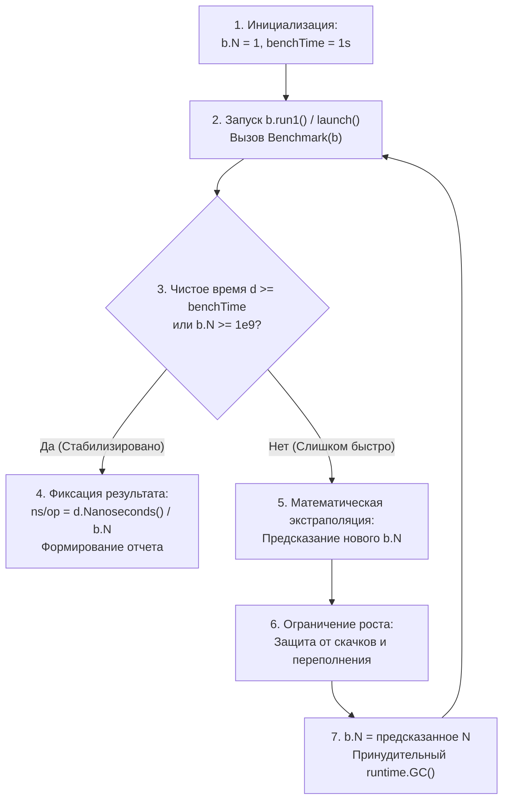
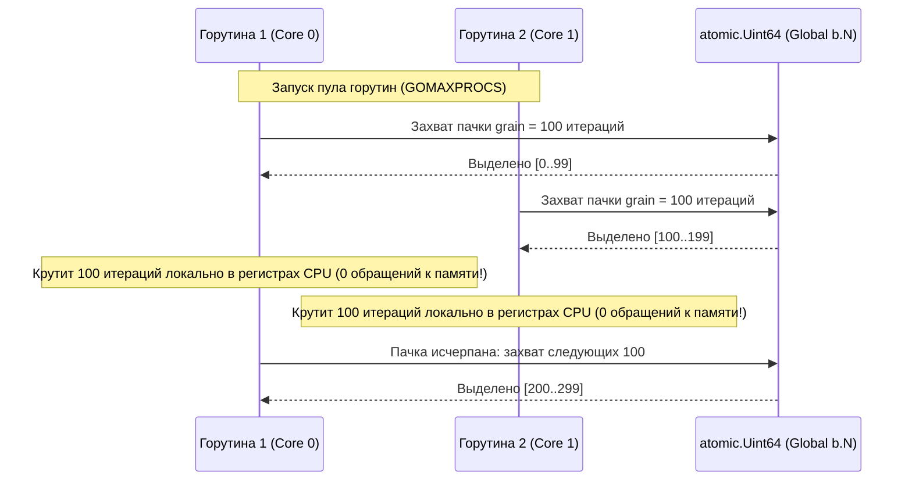

## Как `go test -bench` устроен внутри

В [[2. Benchmarking в Go]] мы освоили практическую сторону бенчмаркинга: написание функций `BenchmarkXxx`, использование флага `-benchmem`, работу с таймерами и запуск конкурентных замеров через `b.RunParallel`.

Но для инженера уровня Senior и Lead инструмент не должен оставаться «черным ящиком». Если вы не понимаете внутреннюю механику `go test -bench`, вы неизбежно попадете в ловушку необъяснимых артефактов:
- Почему один и тот же бенчмарк на одной машине делает $10^7$ итераций, а на другой — $10^5$?
- Почему вызов `b.ResetTimer()` в середине функции может неожиданно завысить результаты?
- Каким образом `b.RunParallel` умудряется загружать все ядра процессора, не превращая сам счетчик итераций в бутылочное горлышко межъядерной синхронизации?

Чтобы ответить на эти вопросы, мы снимем крышку с тестового раннера Go и совершим увлекательное погружение в исходный код стандартной библиотеки — в файл `src/testing/benchmark.go` (в современных версиях Go 1.21–1.24+).

---

## Анатомия структуры `testing.B`

Когда вы запускаете `go test -bench`, рантайм для каждого найденного бенчмарка инстанциирует внутреннюю структуру `testing.B`. Взглянем на ее ключевые поля в исходном коде `src/testing/benchmark.go`:

```go
type B struct {
	common                          // общие поля с testing.T (логирование, статус, мьютекс)
	importPath       string         // путь к пакету
	context          *benchContext  // контекст запуска бенчмарков
	N                int            // текущее количество итераций целевого цикла!
	previousN        int            // N на предыдущей калибровочной итерации
	previousDuration time.Duration  // длительность предыдущего прогона
	benchFunc        func(b *B)     // пользовательская функция BenchmarkXxx
	benchTime        benchTimeFlag  // целевое время (флаг -benchtime, по умолчанию 1s)
	bytes            int64          // объем обработанных байт (устанавливается через b.SetBytes)
	missingBytes     bool
	timerOn          bool           // флаг: включен ли секундомер прямо сейчас
	showAllocResult  bool           // флаг: выводить ли B/op и allocs/op
	result           BenchmarkResult// итоговые метрики после завершения
	parallelism      int            // множитель горутин для RunParallel (по умолчанию 1)
	
	// Внутренние таймеры и счетчики памяти:
	start            time.Time      // временная метка последнего вызова StartTimer
	duration         time.Duration  // суммарно накопленное чистое время
	netAllocs        uint64         // дельта аллокаций памяти
	netBytes         uint64         // дельта байт в куче
}
```

Каждый запуск бенчмарка — это серия управляемых экспериментов, в которых структура `B` передается в пользовательскую функцию, накапливает метрики и динамически корректирует поле `b.N`.

---

## Адаптивный алгоритм определения `b.N`

Сердце фреймворка бенчмаркинга Go — адаптивный цикл подбора числа итераций. Его математическая задача — **найти минимальное значение $b.N$, при котором суммарное время исполнения превысит целевой порог `-benchtime` (по умолчанию 1 секунда)**.

Почему выбрана именно 1 секунда?  
Одна секунда — это достаточный интервал, чтобы:
1. Амортизировать накладные расходы на системный вызов чтения времени (`CLOCK_MONOTONIC`).
2. Сгладить случайные флуктуации от планировщика ОС и переключения контекстов.
3. Прогреть кэши L1/L2/L3 процессора и дать аппаратному префетчеру выйти на стабильный режим работы.

Взглянем на внутренний алгоритм калибровки:



### Математика экстраполяции: как Go рассчитывает следующее `b.N`

В ранних версиях Go итерации просто умножались на фиксированные коэффициенты (1, 2, 5, 10...). В современном рантайме в функции `testing.B.launch()` (ранее `runN`) используется адаптивная формула экстраполяции.

Пусть текущий прогон выполнил $N_{cur}$ итераций за чистое время $T_{cur}$. Желаемое время замера равно $T_{target}$ (`benchTime`).  
Ориентировочная скорость одной операции составляет:

$$t_{op} = \frac{T_{cur}}{N_{cur}}$$

Тогда необходимое число итераций для достижения целевого окна $T_{target}$ можно предсказать как:

$$N_{pred} = \left\lfloor \frac{T_{target}}{t_{op}} \right\rfloor = \left\lfloor \frac{T_{target} \times N_{cur}}{T_{cur}} \right\rfloor$$

Чтобы гарантированно перешагнуть границу $T_{target}$ на следующем шаге и не выполнять лишних промежуточных калибровок, рантайт закладывает коэффициент запаса в **20%** ($\times 1.2$):

$$N_{next} = \left\lfloor N_{pred} \times 1.2 \right\rfloor$$

Однако реальный мир нелинеен, поэтому в коде `src/testing/benchmark.go` действуют жесткие защитные ограничители (Clamping):
1. **Нижний предел роста:** $N$ обязано вырасти как минимум на единицу: $N_{next} \ge N_{cur} + 1$.
2. **Верхний предел роста:** $N$ не может вырасти более чем в **100 раз** за один шаг: $N_{next} \le N_{cur} \times 100$. Это защищает от ситуаций, когда случайная миллисекундная пауза ОС на первом шаге ($N=1$) привела бы к гигантскому перерасчету до миллиарда и зависанию бенчмарка.
3. **Абсолютный потолок:** Значение $b.N$ жестко ограничено константой **$10^9$ (один миллиард)**. Это гарантирует, что даже для пустых функций цикл никогда не уйдет в бесконечность.

> [!info] Под капотом: Реализация в `src/testing/benchmark.go`
> В исходном коде рантайма Go функция `launch()` содержит предохранители, отслеживающие аномалии:
> Если операция длилась настолько долго, что даже при $b.N = 1$ время превысило целевое (например, сложный криптографический расчет занял 2.5 секунды), раннер останавливается немедленно. Финальный результат будет зафиксирован с $N = 1$.

---

## Как работают таймеры: `ResetTimer`, `StopTimer` и `StartTimer`

Точность бенчмарка зависит от того, насколько чисто мы отделяем измеряемую работу от накладных расходов.

Рассмотрим внутреннее устройство трех методов секундомера:

### 1. `StartTimer()`
```go
func (b *B) StartTimer() {
	if !b.timerOn {
		b.start = time.Now()
		b.timerOn = true
	}
}
```
Метод фиксирует стартовую отметку времени `b.start` с помощью монотонных системных часов.

### 2. `StopTimer()`
```go
func (b *B) StopTimer() {
	if b.timerOn {
		b.duration += time.Since(b.start)
		b.timerOn = false
	}
}
```
Метод вычисляет интервал, прошедший с момента последнего старта, прибавляет его к накопительному полю `b.duration` и сбрасывает флаг активности секундомера `timerOn`.

### 3. `ResetTimer()`
```go
func (b *B) ResetTimer() {
	if b.timerOn {
		b.start = time.Now()
	}
	b.duration = 0
	b.netAllocs = 0
	b.netBytes = 0
}
```
Обратите внимание на критическую деталь: `b.ResetTimer()` **не останавливает** таймер! Если секундомер был включен, он просто сбрасывает накопленный `duration`, зануляет счетчики памяти `netAllocs` / `netBytes` и перезаписывает `b.start = time.Now()`.

> [!warning] Ловушка / Gotcha: Секундомер тикает после `ResetTimer()`
> Распространеннейшая ошибка начинающих разработчиков:
> ```go
> func BenchmarkBad(b *testing.B) {
>     heavySetup()
>     b.ResetTimer() // Таймер сброшен, НО ОН ТИКАЕТ!
>     
>     // ОШИБКА: Дополнительная подготовка, которая попадет в замер!
>     extraInit() 
>     
>     for i := 0; i < b.N; i++ {
>         targetWork()
>     }
> }
> ```
> Вызов `b.ResetTimer()` обязан стоять **непосредственно перед ключевым словом `for`**! Любая строчка кода, оставленная между `ResetTimer()` и циклом, будет замерена и разделится на $b.N$, искажая наносекунды.

Используйте `b.ResetTimer/StopTimer/StartTimer` строго по назначению: подготовку отделяйте через `ResetTimer()`, а паузы внутри цикла оборачивайте парой `StopTimer()` / `StartTimer()`.

---

## Влияние сборщика мусора

Сборщик мусора в Go — полноправный участник любого процесса. Внутри `testing.B` сборщик мусора **не отключается и не изолируется**.

Однако авторы рантайма Go внедрили тонкий механизм минимизации взаимного влияния:
1. Перед началом каждого прогона калибровки (перед запуском функции с новым значением `b.N`) раннер принудительно вызывает `runtime.GC()`. Это очищает кучу от мусора, оставленного предыдущим прогоном калибровки, и возвращает аллокатор в предсказуемое состояние.
2. Но в процессе выполнения самого цикла `for i := 0; i < b.N` сборщик мусора работает в обычном конкурентном режиме. Если измеряемый код активно аллоцирует память, сборщик мусора неизбежно проснется прямо во время замера.
3. Время пауз Stop-The-World (STW) и процессорные такты фоновых потоков GC mark workers **будут честно включены в накопленный `duration`**, увеличивая результирующее значение `ns/op`.

Именно поэтому бенчмарк всегда следует запускать с флагом `-benchmem` и вызывать `b.ReportAllocs()`:
- Если `allocs/op == 0`, вы измеряете чистый процессорный алгоритм, и GC не влияет на результат.
- Если `allocs/op > 0`, помните: показанные наносекунды отражают не только скорость вашего кода, но и налог на работу сборщика мусора. В [[4. Подводные камни benchmark тестов]] мы подробно разберем, как избавиться от этого шума.

---

## Монотонные часы и `time.Now`

Вплоть до версии Go 1.9 системное время опиралось на астрономические часы, что приводило к сбоям бенчмарков при синхронизации NTP. Начиная с Go 1.9, вызов `time.Now()` возвращает составную структуру: астрономическое время для отображения и **монотонное время (Monotonic Clock)** для измерения интервалов (`time.Since()`).

В операционных системах Linux монотонный отсчет базируется на системном интерфейсе `clock_gettime(CLOCK_MONOTONIC)` (или быстром механизме vDSO на базе регистра процессора `RDTSC`, не требующем переключения в Ring 0 ядра).

Благодаря архитектуре `src/testing/benchmark.go`, системные часы опрашиваются всего дважды за прогон:
- Один раз при старте цикла `b.start = time.Now()`.
- Один раз при завершении цикла `time.Since(b.start)`.

Полученная разница делится на миллионы итераций $b.N$. Это означает, что **стоимость системного вызова `time.Now()` полностью амортизируется и стремится к нулю**.

---

## Работа `b.RunParallel` изнутри

Параллельные бенчмарки через `b.RunParallel` — шедевр инженерной мысли команды Go.

Если бы разработчики рантайма реализовали `RunParallel` наивно, через общий счетчик `atomic.AddInt64(&b.N, -1)` на каждой итерации, все ядра процессора мгновенно уперлись бы в катастрофическое аппаратное узкое место: постоянную инвалидацию кэш-линии счетчика по протоколу MESI (False Sharing и Bus Lock). Бенчмарк измерял бы не скорость вашего сервиса, а скорость шины межъядерной синхронизации!

### Гениальное решение: Пакетный захват итераций в `testing.PB`

Посмотрим, как устроен тип `PB` (Parallel Benchmark) в `src/testing/benchmark.go`:

```go
type PB struct {
	globalN *atomic.Uint64 // указатель на общий счетчик оставшихся итераций
	grain   uint64         // размер пачки итераций (Batch Size)
	bN      uint64         // локальный лимит для текущей пачки
	localN  uint64         // локальный счетчик итераций горутины
}
```



Каждая рабочая горутина вызывает пользовательскую функцию, принимающую аргумент `*testing.PB`.  
Когда горутина вызывает метод `pb.Next()`:
1. Она не лезет в общую память на каждом шаге! Она инкрементирует свой **локальный регистровый счетчик `localN`**.
2. Только когда локальная пачка (`grain`, обычно от 100 до 1 000 итераций) полностью исчерпана, горутина выполняет единственную атомарную инструкцию `atomic.AddUint64(globalN, -grain)` для захвата следующей порции работы.
3. Это сводит contention за межъядерную шину практически к нулю!

Число параллельных воркеров вычисляется по формуле `procs = GOMAXPROCS * b.parallelism` (по умолчанию `b.parallelism = 1`):

$$\text{procs} = \text{GOMAXPROCS} \times b.parallelism$$

Главная горутина бенчмарка ожидает завершения всех воркеров через внутренний барьер синхронизации, после чего останавливает секундомер. Итоговый `ns/op` представляет собой реальное совокупное процессорное время, деленное на $b.N$, честно отражая масштабируемость системы.

> [!tip] Собеседование: Накладные расходы `RunParallel` при одном ядре
> **Вопрос:** Если мы запустим `b.RunParallel` на сервере с `GOMAXPROCS=1`, почему полученные цифры `ns/op` могут немного отличаться от обычного последовательного бенчмарка?
> 
> **Ответ кандидата уровня Senior:**  
> 1. В `RunParallel` даже при одном логическом процессоре $P$ вызов `pb.Next()` выполняет проверку границ локальной пачки и периодический атомарный вызов, что добавляет несколько дополнительных машинных инструкций в цикл.
> 2. Адаптивный подбор $b.N$ для параллельного запуска выполняет предварительный грубый замер для расчета гранулярности пачки (`grain`), поэтому результирующее число итераций $N$ может отличаться, что влияет на амортизацию.
> 3. Планировщик рантайма при наличии нескольких горутин задействует работу очередей `runq`, создавая микроскопический оверхед.

---

## Сбор профилей внутри бенчмарка

Когда вы передаете флаги профилирования:
- `-cpuprofile=cpu.pprof`
- `-memprofile=mem.pprof`
- `-blockprofile=block.pprof`
- `-mutexprofile=mutex.pprof`

Фреймворк `testing` не записывает профили на этапах калибровки (при малых $b.N = 1, 100$), иначе профиль был бы замусорен накладными расходами калибровочных вычислений.

Профилировщик `runtime/pprof` активируется **строго перед началом финального, стабилизированного прогона**, когда значение $b.N$ уже окончательно зафиксировано! Сразу после выхода из измерительного цикла запись профиля останавливается и сбрасывается на диск. Это гарантирует 100% совпадение горячих точек в `pprof` с показаниями `ns/op` в консоли ([[7. Профилирование внутри benchmark]]).

---

## Механическая эмпатия: откуда берётся дисперсия

Даже если тестовый код математически идеален, запуск одного и того же бинарника пять раз подряд даст пять слегка различающихся чисел: `112 ns/op`, `118 ns/op`, `109 ns/op`, `125 ns/op`...

С точки зрения кремниевой архитектуры (Mechanical Sympathy), дисперсию создают следующие физические факторы:
1. **Динамическое масштабирование частоты процессора (DVFS):**  
   Технологии Intel Turbo Boost и AMD Precision Boost непрерывно регулируют тактовую частоту ядра в зависимости от температуры кристалла и энергопотребления. Первый прогон на «холодном» кристалле разгоняется до 4.8 ГГц, а к десятому прогону процессор нагревается, снижает частоту до 4.1 ГГц и за замедление кода выдает нагрев радиатора!
2. **Миграция потоков планировщиком ядра Linux:**  
   Ядро операционной системы может вытеснить поток $M$ на другое физическое ядро. В этот момент полностью теряется горячий кэш L1/L2, вызывая лавину Cache Misses при первом чтении данных.
3. **Аппаратные прерывания ядра:**  
   Сетевая карта, таймер операционной системы или контроллер NVMe вызывают аппаратные прерывания (IRQ). Ядро процессора переключается на обработчик прерывания, крадя сотни тактов у бенчмарка.
4. **Рандомизация адресного пространства (ASLR):**  
   При каждом новом запуске операционная система размещает стек и кучу по новым случайным адресам памяти. Это приводит к разной частоте конфликтов в кэшах прямого отображения (Cache Set Associativity).

Для подавления этих факторов на специализированных тестовых серверах фиксируют частоту процессора через `cpupower frequency-set -g performance`, изолируют процессорные ядра через системные утилиты `taskset` и `isolcpus` и отключают Turbo Boost ([[6. Стабилизация результатов]]).

---

## Сравнение с бенчмарками в других экосистемах

Понимание архитектурных компромиссов Go становится особенно наглядным при сравнении с альтернативными платформами:

| Характеристика | Go (`testing.B`) | Java (`JMH`) | C++ (`Google Benchmark`) | C# (`BenchmarkDotNet`) |
|---|---|---|---|---|
| **Модель компиляции** | AOT (Ahead-of-Time) | JIT (HotSpot C1/C2) | AOT (GCC / Clang) | JIT (Tiered Compilation) |
| **Проблема прогрева компилятора** | Отсутствует (код уже скомпилирован в машинный) | Колоссальная (требуются тысячи warm-up итераций) | Отсутствует | Требуется прогрев JIT |
| **Борьба с Dead Code** | Ручная (пакетные переменные / `KeepAlive`) | Автоматическая (механизм `Blackhole`) | Встроенная (`DoNotOptimize`) | Встроенная (возврат значений) |
| **Интеграция с GC** | GC работает параллельно; `ReportAllocs` | Изоляция аллокаций, замер GC pressure | GC отсутствует (ручной `malloc`) | Автоматический мониторинг Gen0/1/2 |
| **Калибровка итераций** | Адаптивная по времени (`-benchtime`) | Адаптивная по эпохам и квантилям | Адаптивная по времени | Адаптивная по времени |

Бенчмаркинг в Go подкупает своей простотой, феноменальной скоростью запуска и отсутствием капризных эффектов JIT-компиляции. Однако он требует высокой инженерной дисциплины разработчика в части управления памятью и защиты от оптимизаций компилятора.

---

## Итог

- Фреймворк `go test -bench` опирается на адаптивный калибровочный цикл в `src/testing/benchmark.go`, экстраполирующий $b.N$ с коэффициентом 1.2 и ограничением шага до 100×.
- Методы таймеров `b.ResetTimer/StopTimer/StartTimer` манипулируют внутренними полями `duration`, `netAllocs` и флагом `timerOn`, полностью амортизируя стоимость монотонного времени `CLOCK_MONOTONIC`.
- Секундомер продолжает тикать после `ResetTimer()`: вызывайте сброс непосредственно перед входом в измерительный цикл.
- `b.RunParallel` использует высокоэффективную схему пакетного захвата итераций (`PB.grain`), устраняя конкуренцию за атомарный счетчик и ложное разделение кэш-линий между ядрами.
- Запись профилей (`-cpuprofile`, `-memprofile`) активируется только на финальном стабилизированном прогоне, гарантируя идеальное соответствие профиля и наносекундных метрик.
- Аппаратная дисперсия (DVFS, троттлинг, миграции ядер) нейтрализуется многократными прогонами (`-count=10`) и статистическим анализом через `benchstat`.

Теперь, когда механика `testing.B` раскрыта до последнего бита, мы готовы перейти к исследованию скрытых мин и коварных ловушек: в следующей лекции [[4. Подводные камни benchmark тестов]] мы разберем, как оптимизаторы компилятора превращают ваши замеры в мираж и как писать бенчмарки с математической честностью.