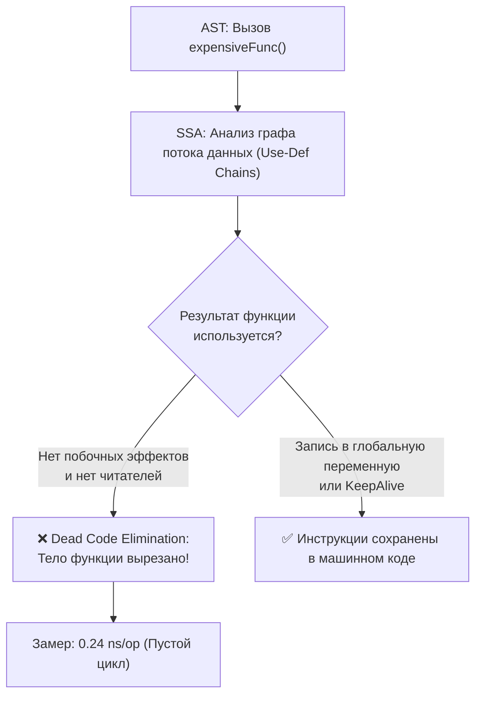
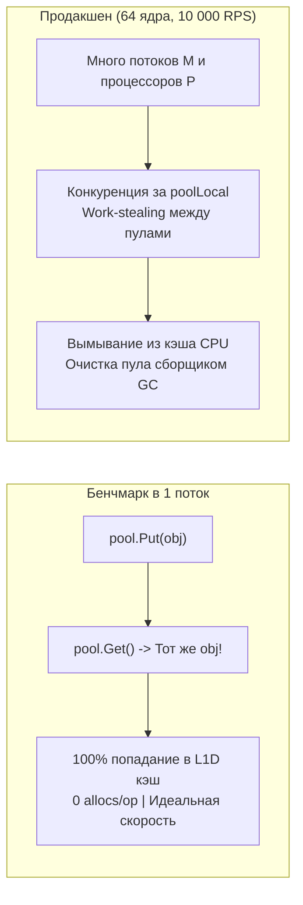

## Введение: когда бенчмарк лжёт

В предыдущих главах мы освоили практический синтаксис фреймворка бенчмаркинга ([[2. Benchmarking в Go]]) и разобрали его внутреннюю анатомию ([[3. go test -bench под капотом]]). Мы знаем, как калибруется счетчик `b.N`, как работают методы таймеров и как распределяются итерации в `b.RunParallel`.

Но весь этот арсенал превращается в опасную иллюзию, если сам бенчмарк написан с методологической ошибкой.

Практика показывает суровую истину: **написать корректный, правдивый бенчмарк часто сложнее, чем написать сам тестируемый алгоритм**. 

Современный компилятор Go с каждым релизом становится умнее, агрессивнее удаляя «бесполезный» с его точки зрения код. Фоновый сборщик мусора рантайма способен вмешаться в замер в самый случайный момент. Процессорные кэши L1/L2 и механизмы предсказания ветвлений создают мираж фантастической скорости, который мгновенно рассеивается под реальной боевой нагрузкой.

Если инженер принимает архитектурные решения на основе искаженных данных, он внедряет «оптимизацию», которая в продакшене не просто не дает выигрыша, а катастрофически обрушивает и latency, и throughput сервиса.

В этой лекции мы препарируем **главные подводные камни бенчмарков в Go**: от компиляторной элиминации до коварных эффектов кэшей и пулов памяти. Для каждой ловушки мы разберем физическую причину, покажем пример ошибки и предоставим надежный способ защиты.

> [!warning] Ловушка / Gotcha
> Если вы запускаете бенчмарк без `-benchmem` и без проверки ассемблерного выхлопа, вы не измеряете код — вы меряете оптимизации компилятора, которые могут измениться в следующем минорном релизе Go.

---

## 1. Dead Code Elimination (удаление мёртвого кода)

Самая массовая и коварная ловушка в микротестах производительности.

Если функция производит вычисления, но возвращаемый результат нигде дальше не читается и не имеет побочных эффектов (не пишет в сокет, файл, канал или глобальную память), оптимизирующий компилятор Go на стадии SSA (Static Single Assignment) признает эти инструкции **мертвым кодом (Dead Code)** и полностью вырезает их из результирующего бинарника!

```go
// НЕВЕРНО: компилятор выбросит вызов expensiveFunc!
func BenchmarkDeadCode(b *testing.B) {
	for i := 0; i < b.N; i++ {
		expensiveFunc()
	}
}
```



Разработчик запускает тест и видит ошеломляющие `0.24 ns/op`. Ему кажется, что алгоритм работает со сверхсветовой скоростью, тогда как процессор крутит пустой регистровый цикл `DEC/JNZ`, вообще не вызывая функцию!

### Как защититься

1. **Присвоить результат переменной уровня пакета:**
   Компилятор компилирует пакет как независимую единицу. Он не может доказать, что глобальная экспортируемая или неэкспортируемая переменная пакета не будет прочитана другим кодом или тестом, и вынужден честно сгенерировать машинные инструкции вычисления:

```go
// Глобальная переменная уровня пакета
var result int32

func BenchmarkKeepAlive(b *testing.B) {
	var r int32
	for i := 0; i < b.N; i++ {
		r = expensiveFunc()
	}
	// Сохраняем финальный результат в пакетную переменную ПОСЛЕ цикла
	result = r
}
```

2. **Использовать функцию `runtime.KeepAlive`:**  
   Вызов `runtime.KeepAlive(&result)` (доступен начиная с Go 1.14) явно сообщает компилятору и сборщику мусора, что объект по указателю обязан оставаться достижимым вплоть до этой точки программы.
3. **В параллельных бенчмарках (`RunParallel`):**  
   Для агрегации результатов используйте атомарные операции (`atomic.StoreInt32`, `atomic.AddInt64`) или локальные переменные внутри горутины, сбрасываемые в глобальную переменную по завершении воркера.

> [!info] Под капотом: Фаза deadcode в компиляторе Go
> В дереве компилятора Go (`cmd/compile/internal/ssa`) фаза `deadcode` обходит граф управления потоком (Control Flow Graph). Каждое значение, не имеющее исходящих ребер использования (use-def chains) и не помеченное как обладающее побочным эффектом (memory store, syscall), исключается из финального ассемблерного листинга. Запись в глобальную переменную генерирует инструкцию `MOV`, адресующую статическую секцию данных `.data` / `.bss`, что делает удаление вычисления невозможным.

---

## 2. Неверная работа с таймерами

Вторая по частоте ошибка — смешивание подготовительной фазы с измеряемой нагрузкой, либо некорректное использование методов секундомера `testing.B`.

```go
// НЕВЕРНО: инициализация входит в замер
func BenchmarkSliceAppend(b *testing.B) {
	for i := 0; i < b.N; i++ {
		s := make([]int, 1000000) // Дорогая аллокация кучи на каждом шаге!
		s = append(s, 1)          // Мы хотели измерить только append!
	}
}
```

В таком тесте 99.9% времени будет занимать системный вызов ядра `mmap` и очистка страниц оперативной памяти, а не целевая операция добавления элемента.

### Исправление с помощью `b.ResetTimer()`

```go
func BenchmarkSliceAppendFixed(b *testing.B) {
	s := make([]int, 1000000)
	b.ResetTimer() // Сбрасываем накопленное время и аллокации
	for i := 0; i < b.N; i++ {
		s = append(s, 1)
	}
}
```

> [!warning] Ловушка / Gotcha: `ResetTimer()` не сбрасывает `b.N`
> `b.ResetTimer()` обнуляет накопленное время, но **не обнуляет `b.N`**. Это значит, что первая итерация всё равно будет учтена в замере. Если первый вызов существенно медленнее (холодный кэш, ленивая инициализация), результат окажется смещённым. Для таких случаев делают «прогревочный» проход вне таймера.

Если внутри самого цикла требуется производить периодические накладные действия, используйте `b.StopTimer()` / `b.StartTimer()`, однако помните: эти вызовы стоят десятки наносекунд и в сверхкоротких циклах сами вносят искажения.

---

## 3. Влияние GC и аллокаций

Рантайм Go не изолирует бенчмарк от фонового сборщика мусора. Если измеряемая функция активно порождает мусор в куче, сборщик мусора гарантированно вмешается в замер.

```go
func BenchmarkStringBuilder(b *testing.B) {
	for i := 0; i < b.N; i++ {
		var sb strings.Builder
		for j := 0; j < 1000; j++ {
			sb.WriteString("hello")
		}
		_ = sb.String()
	}
}
```

На первых шагах адаптации ($b.N = 1, 100$) куча чиста, сборщик мусора спит, и время операции кажется великолепным. Но когда $b.N$ доходит до $100\,000$, куча переполняется, триггерится фаза Concurrent Mark и паузы Stop-The-World. Результирующий `ns/op` внезапно подскакивает в 3–5 раз!

### Как защититься

1. **Всегда запускать с флагом `-benchmem`:** высокие показатели `B/op` и `allocs/op` — первый маркер того, что в ваши наносекунды подмешана работа GC.
2. **Принудительный вызов `runtime.GC()`:** вызов `runtime.GC()` перед входом в цикл стабилизирует начальное состояние кучи.
3. **Оптимизировать аллокации:** использовать предвыделение емкости слайсов (`make([]T, 0, cap)`), пулы буферов ([[1. Уменьшение аллокаций]], [[2. sync Pool]]) для минимизации нагрузки на сборщик и снижения хвостовых задержек ([[7. Tail latency и почему она важна]]).

---

## 4. Игнорирование прогрева кэша

Аппаратные кэши процессора (L1/L2/L3) работают по принципу прогрева:
- Первый проход по массиву неизбежно вызывает аппаратные промахи (**Cache Misses**), заставляя ядро ожидать данные из оперативной памяти DDR (~80 нс).
- Последующие итерации работают с горячими данными прямо из кэша L1 (~1 нс).

Если бенчмарк запускается с коротким интервалом (например, `-benchtime=100ms`), фаза холодного кэша исказит среднее время в худшую сторону.  
Обратный эффект: если массив в бенчмарке имеет размер 16 КБ, он целиком помещается в сверхбыстрый кэш L1D. На проде данные будут иметь размер 16 МБ, вылетая в медленную RAM, и реальная задержка окажется в 50 раз хуже показаний бенчмарка!

**Правило:** Задавать `-benchtime` не менее 1 секунды (по умолчанию), отслеживать дисперсию через `-count=10` и тестировать структуры данных боевого объема.

---

## 5. Ловушки параллельных бенчмарков (`RunParallel`)

Метод `b.RunParallel` создает `GOMAXPROCS` параллельных горутин. Однако разработчики часто неверно трактуют его механику:

1. **Заблуждение о метрике:** `ns/op` в `RunParallel` — это не задержка одного потока! Это **суммарное реальное время, затраченное всеми ядрами, деленное на общее число выполненных операций**. В эту цифру уже заложены накладные расходы на конкуренцию и блокировки.
2. **Иллюзия линейной масштабируемости:** Если алгоритм страдает от ложного разделения кэш-линий (**False Sharing**, см. [[8. False sharing]]) или упирается в мьютекс, увеличение параллелизма через `b.SetParallelism` приведет не к ускорению, а к обрушению пропускной способности.
3. **Холодный старт горутин:** Первые такты после пробуждения пула воркеров тратятся на раскачку кэшей и вытеснение потоков планировщиком ядра ОС.

---

## 6. Однобокость: неправильный размер входных данных

Никогда не делайте глобальных архитектурных выводов на основе замера единственного размера данных:
- Конкатенация трех строк через `+` работает быстрее, чем через `strings.Builder`.
- Но на 1 000 строк `strings.Builder` опережает `+` в 40 раз!
- Вставка в `map` на 10 элементах происходит мгновенно, а на $10^7$ элементов вызывает цепную реакцию аллокаций бакетов и эвакуации хэш-таблицы.

**Правило:** Всегда проектируйте параметризованные бенчмарки (Table-Driven Benchmarks с `b.Run`) на малых, средних и предельных боевых объемах данных.

---

## 7. Не-(рас)познавание статистической природы

Одиночный запуск команды `go test -bench` в консоли не имеет доказательной силы:
- Операционная система в любой момент может отвлечься на фоновые задачи (индексацию, сетевой стек, планировщик Linux CFS).
- Нагрев процессора включает динамический троттлинг частоты (DVFS).

Принимать решение об оптимизации на основе разницы в 3% между двумя одиночными запусками — статистическое преступление. Всегда используйте флаг многократных повторов `-count=10` и математический анализатор `benchstat` ([[6. Стабилизация результатов]]).

---

## 8. Неправильное использование `-benchtime`

По умолчанию фреймворк бенчмаркинга использует временной порог `-benchtime=1s`.
- Для сверхбыстрых операций (например, атомарный инкремент) одной секунды хватает, чтобы счетчик итераций достиг максимума $b.N = 10^9$.
- Для тяжелых операций (например, криптографический расчет или генерация ключей), длящихся по 800 мс, раннер завершится на $b.N = 1$, что дает слишком грубую оценку, а погрешность системного вызова `time.Now()` становится заметной. В таких ситуациях явно задают фиксированное количество итераций флагом вида `-benchtime=100x`.

Однако фиксация слишком малого $N$ чревата сильным влиянием случайных выбросов. Прежде чем фиксировать $N$, убедитесь, что вы понимаете погрешности `time.Now()`. Подбирайте `-benchtime` осознанно.

---

## 9. Влияние инлайнинга и оптимизаций компилятора

Оптимизатор компилятора Go агрессивно встраивает (инлайнит) небольшие функции в точку вызова:
- В бенчмарке короткая функция встраивается в цикл, избавляясь от накладных расходов вызова `CALL/RET`.
- На проде эта же функция вызывается через интерфейс или из другого пакета, инлайнинг не срабатывает, и производительность падает на 20–30%.

И обратная крайность: запуск бенчмарков с флагом отладки `-gcflags="-N -l"` полностью отключает оптимизации и инлайнинг, превращая результаты в бесполезные пессимистичные цифры.  
**Рекомендация:** Всегда запускайте замеры со стандартными флагами оптимизации (production-режим) и периодически анализируйте ассемблерный листинг через `go tool compile -S` или флаг сборки `-gcflags="-S"`.

---

## 10. Сокрытие аллокаций через пулы (`sync.Pool`)

Использование `sync.Pool` ([[2. sync Pool]]) внутри наивного бенчмарка создает опаснейшую иллюзию:



В однопоточном синтетическом цикле объект, возвращенный через `Put()`, немедленно извлекается следующим `Get()` из приватного слота процессора `poolLocal.private`. Вы видите 0 аллокаций и идеальное попадание в кэш L1.  
В продакшене под нагрузкой горутины будут работать на разных ядрах, провоцируя межпроцессорные кражи объектов, а сборщик мусора на каждой фазе STW будет опустошать пул.  
**Защита:** Очищайте состояние пула или замеряйте как горячий, так и холодный путь работы.

---

## Пример комплексного «честного» бенчмарка

Соберем все защитные техники воедино в образцовом бенчмарке чтения данных из потока:

```go
package io_bench_test

import (
	"bytes"
	"io"
	"testing"
)

// Глобальная переменная предотвращает Dead Code Elimination
var globalResult []byte

func BenchmarkReadFull(b *testing.B) {
	// 1. Подготовка эталонных неизменяемых данных вне таймера
	sourceData := bytes.Repeat([]byte("x"), 4096)
	buf := make([]byte, 4096)
	reader := bytes.NewReader(sourceData)

	// 2. Включение детального учета аллокаций
	b.ReportAllocs()

	// 3. Сброс секундомера непосредственно перед входом в цикл
	b.ResetTimer()

	for i := 0; i < b.N; i++ {
		// Сброс ридера включен в замер как честная часть боевого сценария
		reader.Reset(sourceData)
		
		n, err := io.ReadFull(reader, buf)
		if err != nil {
			b.Fatalf("неожиданная ошибка чтения: %v", err)
		}

		// Надежная защита от вырезания вычислений компилятором
		globalResult = buf[:n]
	}
}
```

В этом эталонном примере:
- Подготовка памяти выполнена до `b.ResetTimer()`.
- Вызов `b.ReportAllocs()` гарантирует вывод метрик `B/op` и `allocs/op`.
- Проверка ошибок через `b.Fatalf` защищает от некорректного выполнения.
- Фиксация результата в `globalResult` исключает удаление кода оптимизатором.

---

## Итог

- **Бенчмарк без защиты от Dead Code Elimination** измеряет пустой цикл процессора; сохраняйте результат в глобальную переменную пакета или используйте `runtime.KeepAlive`.
- **Секундомер `testing.B` требует дисциплины:** вызов `b.ResetTimer()` обязан стоять непосредственно перед циклом `for i := 0; i < b.N`.
- **Флаг `-benchmem` — обязательный стандарт:** неконтролируемые аллокации в куче искажают наносекунды скрытой работой сборщика мусора.
- **Одиночный замер — это случайность:** используйте серию `-count=10` и математический анализ `benchstat` для отсечения аппаратного шума.
- **`b.RunParallel`** тестирует масштабируемость системы; помните о накладных расходах на синхронизацию и ложном разделении кэш-линий (**False Sharing**).
- **Проверяйте ассемблерный листинг (`go tool compile -S`):** настоящий инженер всегда знает, какие машинные инструкции процессор выполняет в измерительном цикле.

В следующей статье [[5. microbenchmarks vs macrobenchmarks]] мы поднимемся на уровень выше и разберем архитектурную дилемму: когда микроскопический замер отдельной функции полезен, а когда объективную истину способны показать только сквозные макро-бенчмарки и сквозное нагрузочное тестирование.