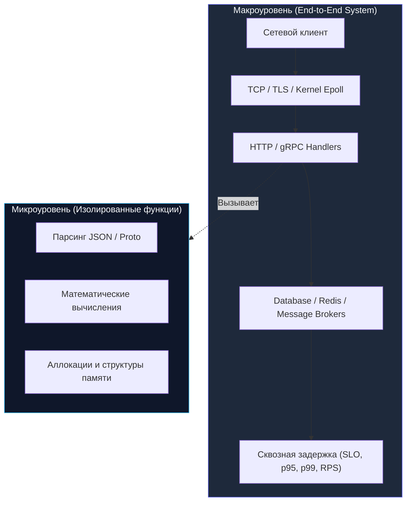
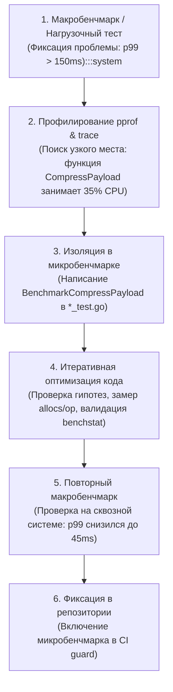

## Два уровня измерений: микро и макро

В предыдущих главах мы всесторонне освоили инструментарий бенчмаркинга: изучили базовый синтаксис ([[2. Benchmarking в Go]]), заглянули под капот рантайма `go test -bench` ([[3. go test -bench под капотом]]) и разобрали десять коварных ловушек компилятора и рантайма ([[4. Подводные камни benchmark тестов]]).

Теперь перед инженером встает фундаментальный методологический вопрос: **что именно мы измеряем и какую часть реальности отражают наши цифры?**

В инженерной практике измерений производительности существует два полярных полюса:
1. **Микробенчмарк (Microbenchmark):** измерение изолированной атомарной операции или функции в стерильных лабораторных условиях: сериализация структуры, вставка в хэш-таблицу, конкатенация строк, аллокация среза.
2. **Макробенчмарк (Macrobenchmark, End-to-End Benchmark):** сквозное измерение всей программной системы в сборе при реалистичном потоке событий: прохождение HTTP-запроса через сетевой стек ядра, TLS-терминацию, роутинг, бизнес-логику, обращение к пулу базы данных и возврат клиенту.

> [!NOTE] Метафора Кернигана: Аэродинамическая труба против гоночного трека
> Инженеры Формулы-1 тестируют аэродинамику антикрыла в изолированной аэродинамической трубе (микробенчмарк). В трубе поддерживается ламинарный, очищенный от пыли поток воздуха постоянной скорости и температуры. Это дает безупречные, воспроизводимые цифры коэффициента лобового сопротивления с точностью до четвертого знака.  
> Но гонка Formula 1 (макробенчмарк) проходит на реальной трассе. Там антикрыло попадает в «грязный», турбулентный воздух позади болида соперника, асфальт раскаляется до 50°C, резина изнашивается, а подвеска вибрирует на поребриках. Если антикрыло было оптимизировано исключительно для идеального стерильного воздуха трубы, в турбулентном следе оно внезапно потеряет прижимную силу, и машина улетит в отбойник.  
> В бэкенде микро- и макробенчмарки находятся в таком же отношении: микробенчмарк показывает идеальный аэродинамический профиль функции, а макробенчмарк проверяет, удержит ли сервис боевую трассу под дождем из запросов.

Смешение этих уровней или попытка судить о здоровье распределенной системы исключительно по микробенчмаркам — одна из самых дорогих архитектурных ошибок. Senior-инженер никогда не принимает решений вслепую: он сопоставляет наносекунды микробенчмарка с миллисекундами p99 задержки макросистемы.



---

## Характеристики микробенчмарков

### 1. Изолированность
Микробенчмарк выполняется в абсолютно контролируемом лабораторном окружении. Никаких сетевых сокетов, дисковых операций и внешних баз данных — только чистые инструкции CPU и оперативная память. Это позволяет зафиксировать входные параметры и выполнить алгоритм миллионы раз ($b.N$), добиваясь высочайшей математической воспроизводимости. Стандартный пакет `testing.B` идеально спроектирован именно для этой цели.

### 2. Быстрота обратной связи
Микробенчмарк отрабатывает за доли секунды и может безболезненно запускаться в CI/CD на каждый коммит и Pull Request, выступая неподкупным стражем против алгоритмических деградаций ([[5. Performance regression detection]]).

### 3. Прямая связь со строками кода
Микробенчмарк мгновенно локализует виновника: если время выполнения функции выросло со 120 нс до 450 нс, а аллокации подскочили с 0 до 3 allocs/op, инженер сразу видит, какая именно строчка вызвала утечку переменной в кучу (Escape to Heap).

### 4. Фундаментальные ограничения
Главный недостаток микробенчмарка — **полная слепота к системным эффектам**:
- Он не учитывает влияние конкурирующего сборщика мусора (Concurrent GC) на хвостовую задержку ([[7. Tail latency и почему она важна]]).
- Он не показывает конкуренцию за блокировки (`sync.Mutex` contention) под перекрестным огнем сотен горутин.
- Он изолирован от планировщика ядра Linux, сетевых сокетов и системных вызовов `epoll`.
- Он не замечает фрагментацию кучи при многодневной непрерывной работе сервиса.

Микробенчмарк, показавший победное ускорение функции на 30%, на продакшене может раствориться в шуме сетевых задержек или быть уничтожен аппаратным эффектом ложного разделения кэш-линий (**False Sharing**, см. [[8. False sharing]]).

### Типичный пример микробенчмарка

```go
package jsonbench_test

import (
	"encoding/json"
	"testing"
)

func BenchmarkJSONUnmarshal(b *testing.B) {
	data := []byte(`{"name":"gopher","age":5}`)
	var obj struct {
		Name string `json:"name"`
		Age  int    `json:"age"`
	}

	b.ReportAllocs()
	b.ResetTimer()
	for i := 0; i < b.N; i++ {
		_ = json.Unmarshal(data, &obj)
	}
}
```

Мы измеряем чистую скорость работы парсера `json.Unmarshal`, полностью изолировав его от сетевого роутинга HTTP, работы сокетов и диска. Этот замер дает точное представление о вычислительной стоимости парсинга, но ровным счетом ничего не сообщает о том, уложится ли весь веб-сервис в целевой показатель SLA `p99 ≤ 100 мс`.

---

## Характеристики макробенчмарков

### 1. Системная полнота
Макробенчмарк (End-to-End тест производительности) запускает целевой сервис целиком — именно так, как он будет работать на боевом сервере в датацентре:
- Открываются реальные TCP-соединения через системный сетеполлер (`epoll` в Linux).
- Выполняются реальные системные вызовы ядра.
- Сборщик мусора Go сканирует боевую многогигабайтную кучу.
- Планировщик рантайма Go распределяет тысячи горутин по ядрам через work-stealing.
- Измеряется **сквозное время ответа (Wall-Clock Latency)** — от отправки первого байта клиентом до получения последнего байта ответа.

### 2. Правдоподобность для бизнеса
Если макробенчмарк демонстрирует, что сервис уверенно держит нагрузку 10 000 RPS с задержкой p99 = 40 мс, бизнес имеет объективные основания рассчитывать на аналогичное поведение на проде. Если же микробенчмарк показал ускорение функции валидации в 3 раза, это может вообще не сдвинуть стрелку сквозного p99, если валидация занимала лишь 0.5% общего времени запроса.

### 3. Высокая стоимость и сложность организации
Подготовка макробенчмарка — сложнейшая инженерная задача:
- Требуется развернуть тестовую инфраструктуру (базы данных, Redis, Kafka) или их высокоточные эмуляторы.
- Необходимы терабайты реалистичных, репрезентативных данных.
- Требуется прогрев системных кэшей ОС, пулов соединений и пулов объектов `sync.Pool`.
- Стенд должен быть физически изолирован от соседних виртуальных машин (noisy neighbors).

Поэтому полномасштабные макробенчмарки реализуются через инструменты сквозного **нагрузочного тестирования** ([[1. Load testing]]) — `k6`, `vegeta`, `wrk`.

### 4. Интерпретация результатов и сложность локализации узких мест
Если макробенчмарк зафиксировал деградацию пропускной способности на 20%, он отвечает лишь на вопрос *«что стало хуже»*, но не отвечает на вопрос *«почему»*. Интерпретация результатов макротеста требует декомпозиции: инженеру приходится подключать весь арсенал профилировщиков Go: снимать профили CPU ([[2. CPU profiling в Go]]), памяти ([[5. pprof memory profile]]) и покадровую трассировку рантайма ([[3. execution tracer]]).

> [!tip] Собеседование: Микро- против Макробенчмарков
> **Вопрос:** В каких случаях инженер должен писать микробенчмарк, а в каких — макробенчмарк? Как они дополняют друг друга?
> 
> **Ответ кандидата уровня Senior:**  
> - **Микробенчмарк** пишется для проверки алгоритмических оптимизаций на уровне функций, жесткого контроля аллокаций памяти (`B/op`, `allocs/op`) и предотвращения регрессий в CI. Он отвечает на вопрос: *«Какой вариант функции быстрее на уровне инструкций CPU?»*  
> - **Макробенчмарк** запускается для подтверждения системной производительности, проверки выполнения SLO (p95, p99), поиска очередей и планирования емкости (Capacity Planning). Он отвечает на вопрос: *«Выдержит ли система целевой трафик в боевых условиях?»*  
> Зрелая инженерия использует их в тандеме: макробенчмарк выявляет системное узкое место, микробенчмарк помогает изолированно перебрать решения, а повторный макробенчмарк верифицирует результат.

---

## Mechanical Sympathy: почему микро и макро расходятся

Почему функция, летавшая в микробенчмарке со скоростью 50 наносекунд (`ns/op`), на проде внезапно выполняется за 500 наносекунд? На уровне процессора микробенчмарк находится в идеальных тепличных условиях, выдавая великолепные `ns/op`, которые в реальном сервисе разбиваются о законы кремниевой микроархитектуры:

### 1. Эффект вымывания кэша процессора (Cache Pollution)
В изолированном микробенчмарке `BenchmarkJSONUnmarshal` входной буфер размером 1 КБ и стек горутины непрерывно крутятся в **кэше L1D** (задержка ~1 нс). Аппаратный префетчер идеально предсказывает адреса.  
На реальном сервере между двумя вызовами анмаршалинга проходит обработка сетевых пакетов, TLS-рукопожатие, логирование и чтение из сокета. Эти операции прокачивают через кэши мегабайты посторонних данных, **полностью вымывая структуры парсера из L1/L2 кэша в оперативную память**.  
Каждый вызов на проде начинается с ледяного кэша и сотен процессорных тактов ожидания памяти (Cache Misses).

### 2. Сброс предсказателя переходов (Branch Predictor Flushing)
В микробенчмарке предсказатель переходов быстро обучается на одном и том же сценарии входных данных. В боевом трафике JSON-сообщения имеют разную структуру, поля и длины: конвейер процессора регулярно сбрасывается из-за Branch Misprediction.

### 3. Накладные расходы `sync.Pool` и синхронизации (`select`)
В синтетическом тесте `sync.Pool.Get` и `Put` вызываются в плотном цикле: горутина возвращает объект в приватный слот процессора `poolLocal.private` и тут же забирает его обратно. В продакшене между `Get` и `Put` проходят сотни микросекунд: кэш-линии остывают, поток мигрирует на другое ядро, а сборщик мусора очищает пул на фазе STW, принуждая сервис выделять новую память в куче.

Другой классический пример расхождения — операция `select` над каналами. Синтетический микробенчмарк неблокирующего `select` на двух каналах показывает задержку порядка ~10 `ns/op`. Но когда каналы становятся точками синхронизации для сотен конкурирующих горутин под нагрузкой, в дело вступает contention за локи рантайма каналов `hchan.lock`, пробуждение через планировщик и инвалидация кэш-линий между ядрами — реальная задержка `select` подскакивает на порядок.

---

## Микробенчмарк, притворяющийся макро: граница по контеншну

Промежуточный мост между микро- и макромиром — параллельные микробенчмарки с вызовом `b.RunParallel` ([[2. Benchmarking в Go]]).

Такой тест изолирован (не ходит в сеть и БД), но благодаря запуску на всех ядрах процессора (`GOMAXPROCS`) он вскрывает скрытые системные проблемы:
- Конкуренцию за мьютексы (**Lock Contention**, см. [[7. Contention и lock profiling]]).
- Аппаратное ложное разделение кэш-линий (**False Sharing**, см. [[8. False sharing]]).
- Деградацию пропускной способности при росте конкуренции по закону Амдала.

Однако даже `RunParallel` не способен эмулировать сетевой поллер `netpoll` и задержки внешних систем.

---

## Когда и как сочетать микро- и макробенчмарки

Правильный цикл инженерной оптимизации, сформулированный в [[1. Почему нельзя оптимизировать без измерений]], опирается на оба уровня:



1. **Макротест** подает сигнал тревоги: сервис деградирует под нагрузкой.
2. **Профилировщик** локализует горячую точку.
3. **Микробенчмарк** позволяет спокойно, изолированно и быстро перебрать десять альтернативных реализаций на ноутбуке инженера.
4. **Макротест** окончательно утверждает решение в контексте всей архитектуры.

---

## Антипаттерны при использовании микро- и макробенчмарков

### Антипаттерн 1: Оптимизация на основе только микробенчмарка
Разработчик обнаруживает, что сторонняя библиотека парсинга JSON на 40% быстрее стандартной в синтетическом цикле, и переписывает проект. В продакшене выясняется, что эта библиотека потребляет в 3 раза больше памяти, сборщик мусора начинает запускаться в 5 раз чаще, и суммарный p99 сервиса катастрофически ухудшается.

### Антипаттерн 2: Игнорирование микробенчмарка при расследовании макропроблем
Нагрузочный тест показал падение RPS на 15%. Команда начинает гадать на кофейной гуще: виновата сеть, база данных или новая версия Go? Написание трех точечных микробенчмарков на измененные функции за 10 минут выявляет виновника и экономит дни бесполезных дискуссий.

### Антипаттерн 3: Микробенчмарк без контроля GC и прогрева
Как показано в [[4. Подводные камни benchmark тестов]], если микробенчмарк не прогрел кэш или скрыл аллокации памяти, его оптимистичные цифры не имеют никакого отношения к физической реальности.

---

## Построение достоверных макробенчмарков в Go

Фреймворк `testing.B` можно использовать и для создания легковесных макробенчмарков внутри репозитория с помощью стандартного пакета `net/http/httptest`:

```go
package e2e_bench_test

import (
	"io"
	"net/http"
	"net/http/httptest"
	"testing"
)

// myHandler эмулирует сквозную обработку запроса
func myHandler() http.Handler {
	return http.HandlerFunc(func(w http.ResponseWriter, r *http.Request) {
		w.WriteHeader(http.StatusOK)
		_, _ = w.Write([]byte(`{"status":"success"}`))
	})
}

func BenchmarkEndToEnd(b *testing.B) {
	// Поднимаем изолированный тестовый веб-сервер на локальном сокете
	srv := httptest.NewServer(myHandler())
	defer srv.Close()

	client := srv.Client()

	b.ReportAllocs()
	b.ResetTimer()

	for i := 0; i < b.N; i++ {
		resp, err := client.Get(srv.URL)
		if err != nil {
			b.Fatalf("HTTP get failed: %v", err)
		}
		// Вычитываем тело и закрываем поток для переиспользования TCP keep-alive
		_, _ = io.Copy(io.Discard, resp.Body)
		_ = resp.Body.Close()
	}
}
```

Такой внутрипроцессный тест полезен для контроля оверхеда HTTP-роутинга и middleware. Однако для полноценного моделирования боевых условий с конкурентными соединениями, потерями пакетов и реалистичными задержками базы данных стандартом являются выделенные распределенные генераторы нагрузки — `vegeta`, `k6` и `wrk` ([[1. Load testing]]).

---

## Итог

- **Микробенчмарк (`go test -bench`)** — скальпель хирурга: измеряет атомарную функцию, дает быструю обратную связь, контролирует аллокации и ловит регрессии в CI.
- **Макробенчмарк (нагрузочное тестирование)** — краш-тест автомобиля: проверяет поведение всей распределенной системы под боевой нагрузкой, верифицирует SLO и оценивает масштабируемость.
- **Разрыв между микро и макро неизбежен:** вымывание кэшей процессора (Cache Misses), ошибки предсказателя переходов, накладные расходы рантайма и паузы GC делают реальный сервис медленнее стерильного лабораторного теста.
- **Золотой процесс оптимизации объединяет оба подхода:** макротест находит системную проблему, микробенчмарк позволяет быстро и точечно ее устранить, а финальный макротест подтверждает выигрыш для бизнеса.

В следующей лекции [[6. Стабилизация результатов]] мы разберем математические основы метрологии в программировании: как избавиться от шума операционной системы, почему закон средних величин здесь бессилен и как утилита `benchstat` превращает хаотичные замеры в строгие научные факты.