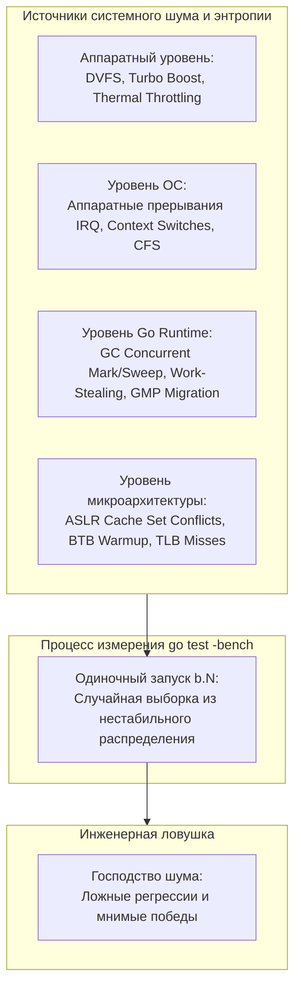
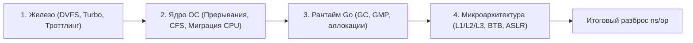
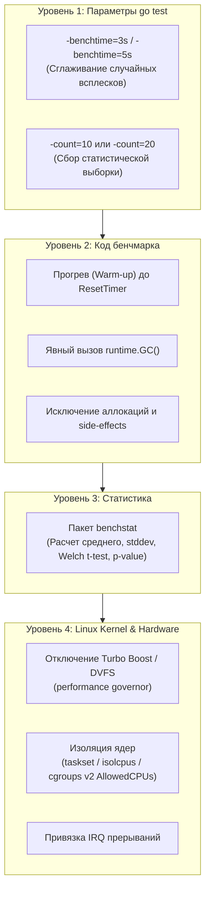

# Стабилизация результатов: метрология в программировании и борьба с шумом

> *"If you can't measure it, you can't improve it."*  
> — Лорд Кельвин  
> 
> *"A single measurement on a modern CPU is not a measurement; it is an opinion."*  
> — Инженерная мудрость

Представьте, что ювелир пытается взвесить крупицу золота на чувствительных аптекарских весах, находясь на палубе корабля во время девятибалльного шторма. Стрелка весов судорожно скачет от малейшего порыва ветра, крена судна и вибрации судового дизеля.

Запуск микробенчмарка на современном многоядерном процессоре под управлением многозадачной операционной системы поразительно похож на этот шторм. Нам кажется, что компьютер — это кристально чистый, детерминированный автомат, где каждая инструкция выполняется за строго отведенное число наносекунд. Но в реальности современный сервер — это кипящий физический котел: полупроводниковые кристаллы разогреваются и остывают, динамическое масштабирование непрерывно меняет тактовую частоту, контроллеры прерываний вытесняют код из конвейера, сборщик мусора Go просыпается для сканирования кучи, а планировщик ядра Linux ежесекундно перетасовывает потоки между ядрами.

В этой лекции мы превратим шаманство с запуском тестов наугад в строгую метрологическую дисциплину. Мы разберем анатомию процессорного и системного шума, научимся фиксировать параметры кремния и операционной системы, обуздаем математический аппарат `benchstat` и разберемся, почему отсутствие разброса в замерах на самом деле должно настораживать инженера.

---

## Почему разброс результатов — это нормально

В [[5. microbenchmarks vs macrobenchmarks]] мы разделили измерения производительности на изолированные микробенчмарки и сквозные макротесты. Но даже идеально изолированный микробенчмарк, повторенный 10 раз подряд на одной и той же машине, покажет 10 разных значений `ns/op`. Разница в 5–15% между повторными запусками — обычное дело, а в нестабильной среде (например, на виртуальных машинах публичных облаков или обычном офисном ноутбуке) разброс может достигать 50% и выше!

```
Запуск 1: BenchmarkParseJSON-8    1200 ns/op
Запуск 2: BenchmarkParseJSON-8    1380 ns/op   (+15.0% — разработчик в панике ищет регрессию)
Запуск 3: BenchmarkParseJSON-8    1110 ns/op   (-20.0% — разработчик празднует победу)
```

Причина не в поломке инструмента измерения. Причина в том, что компьютер не работает в вакууме. Время выполнения программного цикла — это не константа, а **случайная величина**, подчиняющаяся законам математической статистики. Сложив дюжину независимых стохастических процессов (термальный троттлинг, сбросы кэшей L1/L2, таймерные тики ОС, паузы GC), мы получаем непрерывное распределение вероятностей. 

Одиночный запуск `go test -bench` извлекает из этого распределения **одну случайную точку**.



Инженер, игнорирующий статистическую природу бенчмарков, обречен гоняться за призраками:
1. Принимать случайный всплеск фоновой активности ОС за деградацию собственного кода.
2. Что еще опаснее — сливать в `main` «оптимизацию», мнимый выигрыш которой на деле не превышает погрешности измерения.

> [!IMPORTANT]
> Стабилизация результатов — это не попытка полностью уничтожить шум (в физическом мире кремния это невозможно).  
> **Цель стабилизации — снизить дисперсию шума до контролируемого уровня и применить методы математической статистики, отделяющие реальный сигнал от случайных помех.**

---

## Источники нестабильности

Чтобы эффективно бороться с помехами, инженер обязан составить исчерпывающий каталог источников шума на всех уровнях вычислительного стека.



### 1. Динамическое масштабирование частоты (DVFS)

Современные процессоры уже давно не работают на фиксированной тактовой частоте. Технологии **DVFS (Dynamic Voltage and Frequency Scaling)** — Intel SpeedStep / Speed Shift и AMD Precision Boost — динамически подстраивают напряжение и частоту каждого ядра каждую миллисекунду.

Здесь инженера подстерегают два противоположных явления:
- **Intel Turbo Boost / AMD Core Performance Boost:** Когда запускается однопоточный бенчмарк, процессор видит холодный кристалл и мгновенно взвинчивает частоту активного ядра с базовых 2.8 ГГц до турбо-частоты 4.8–5.2 ГГц. Первые 2 секунды тест работает молниеносно.
- **Термальный троттлинг (Thermal Throttling):** По мере непрерывного выполнения плотного математического цикла кремний нагревается до 85–95°C. Защитная электроника процессора принудительно сбрасывает частоту до 2.4 ГГц, чтобы кристалл не расплавился.

Если первый прогон бенчмарка выполнялся на холодном процессоре на частоте 4.5 ГГц, а третий прогон попал на разогретый чип с частотой 3.0 ГГц, задержка `ns/op` изменится на 33%, хотя ни строчки исходного кода изменено не было!

### 2. Прерывания и фоновые процессы ОС

Многозадачная операционная система ни на миг не прекращает фоновую жизнь:
- Сетевые карты обрабатывают входящие кадры, дисковые контроллеры рапортуют о завершении DMA, аппаратные таймеры тикают со стандартной частотой ядра (в Linux часто `CONFIG_HZ=1000`, то есть 1000 прерываний в секунду).
- Каждый аппаратный прерывающий сигнал (**Hardware IRQ**) принудительно останавливает текущую инструкцию процессора, сохраняет регистры и передает управление в ядро ОС.
- Планировщик ОС (**CFS — Completely Fair Scheduler** в Linux) выделяет процессорные кванты фоновым демонам: `systemd`, антивирусам, агентам мониторинга, индексаторам диска.

В Linux статистику прерываний можно изучить напрямую через виртуальную файловую систему `/proc/interrupts`. Прерывания нельзя полностью отключить, но ядра процессора можно изолировать от их обработки.

### 3. Планировщик горутин и миграция между P

Даже если переменная окружения `GOMAXPROCS` зафиксирована, планировщик рантайма Go ([[1. Scheduler Go. G-M-P модель]]) распределяет горутины по логическим процессорам `P`. В процессе выполнения горутина бенчмарка может быть вытеснена планировщиком (например, при вызове системного вызова или на кооперативной точке прерывания) и затем возобновлена на другом логическом процессоре `P`, привязанном к совершенно другому физическому ядру CPU ([[4. Контекстные переключения]]).

При межъядерной миграции горутина теряет локальность:
1. Горячие кэши **L1I, L1D и L2** остаются на старом ядре.
2. Новое ядро встречает горутину абсолютно холодными кэшами: первые тысячи тактов процессор простаивает в ожидании вычитки данных из общего кэша L3 или оперативной памяти (DRAM).

### 4. Сборщик мусора

Конкурентный сборщик мусора Go непрерывно отслеживает баланс выделения памяти. Как только объем живой кучи достигает лимита триггера `GOGC`, запускается фаза concurrent mark:
- Рантайм отбирает 25% доступных процессорных ядер (`GOMAXPROCS * 25%`) на фоновое сканирование указателей.
- Если бенчмарк аллоцирует память слишком быстро, рантайн принуждает саму горутину теста переключиться в режим **Mark Assist**, заставляя ее тратить полезные такты на маркировку объектов.
- В начале и в конце цикла GC происходят короткие, но неизбежные фазы остановки мира ([[3. Stop the world]]).

Если в десяти прогонах бенчмарка GC сработал 2 раза в одном тесте и 5 раз в другом, полученные замеры `ns/op` будут сравнивать не производительность функций, а активность фоновой очистки памяти.

### 5. Кэш-промахи и буферы предсказателя

- **Холодный старт:** Первая итерация бенчмарка вынуждена поднимать машинный код и данные из медленной RAM.
- **ASLR (Address Space Layout Randomization):** При каждом новом запуске бинарного файла ядро Linux случайным образом сдвигает базовые адреса стека, кучи и сегментов кода. В современных процессорах кэши L3 и L2 организованы по принципу **set-associative hashing** (наборно-ассоциативная структура). Из-за случайного смещения виртуальных и физических адресов в одном запуске две критические структуры данных могут отобразиться в разные наборы кэша, а в другом — в один и тот же набор (**Cache Conflict Misses**), вызывая взаимное вытеснение и 20-процентное падение скорости.
- **BTB (Branch Target Buffer):** Буфер предсказателя переходов должен пройти фазу обучения. До тех пор, пока история ветвлений не заполнится, процессор страдает от частых сбросов конвейера (Branch Misprediction Penalty).

### 6. Статистическая природа самого измерения

Сам таймер `time.Now()` в Go опирается на системный вызов ядра `clock_gettime(CLOCK_MONOTONIC)` через vDSO. Хотя чтение монотонного таймера оптимизировано и не требует полноценного перехода в ring 0, оно всё же стоит от 15 до 30 процессорных тактов.  
При малом количестве итераций `b.N` дискретность таймера и накладные расходы самого замера искажают результат. Кроме того, адаптивный алгоритм подбора `b.N` калибруется динамически, что создает слабую нелинейную обратную связь между скоростью выполнения и числом итераций.

---

## Методология стабилизации

Стабилизация измерений — это строгая ступенчатая инженерная процедура. Мы движемся от самых простых и доступных настроек рантайма Go до низкоуровневой конфигурации ядра Linux и изоляции физических ядер.



### 1. Увеличение времени измерения (`-benchtime`)

Стандартное время замера в Go составляет ровно 1 секунду (`-benchtime=1s`). Если тестируемая операция длится 10 миллисекунд, за секунду успеет выполниться всего 100 итераций. Случайная пауза GC длительностью в 2 миллисекунды внесет 20% погрешность в результат!

Увеличение времени замера до 3–5 секунд (а для тяжелых операций — до 10 секунд) позволяет накопить достаточную статистическую массу, в которой единичные случайные всплески ОС растворяются без следа:

```bash
go test -bench=BenchmarkCrypto -benchtime=5s
```

Если же вам требуется гарантировать строго одинаковое, контролируемое количество выполнений цикла для устранения любых погрешностей калибровки `b.N`, используйте суффикс `x`:

```bash
# Запустить строго 1 000 000 итераций
go test -bench=BenchmarkCrypto -benchtime=1000000x
```

### 2. Многократные запуски (`-count`)

Одиночный запуск бенчмарка не имеет права называться научным экспериментом. Он не дает никакой информации о **дисперсии** (разбросе) случайной величины.

Флаг `-count=N` указывает утилите `go test` повторить весь цикл бенчмарка `N` раз полностью независимо:

```bash
go test -bench=BenchmarkFoo -count=10 -benchmem > results.txt
```

Каждый из 10 прогонов заново калибрует `b.N`, заново прогревает рантайм и выдает отдельную строчку в итоговый текстовый отчет:

```
BenchmarkFoo-8       1000000              1234 ns/op              16 B/op          1 allocs/op
BenchmarkFoo-8       1000000              1210 ns/op              16 B/op          1 allocs/op
BenchmarkFoo-8       1000000              1256 ns/op              16 B/op          1 allocs/op
...
```

Минимально допустимый `-count` для сколь-либо ответственных выводов — **10**. Для тонких оптимизаций с выигрышем в 2–5% рекомендуется запускать **от 20 до 30 прогонов**.

### 3. Статистический анализ с `benchstat`

Никогда не сравнивайте результаты бенчмарков вручную глазами! Человеческий мозг склонен искать подтверждение своим ожиданиям (confirmation bias), принимая случайные колебания за долгожданный прорыв.

Официальный инструмент Go-сообщества для математического сравнения замеров — утилита `benchstat` (входит в пакет `golang.org/x/perf/cmd/benchstat`):

```bash
# Установка утилиты
go install golang.org/x/perf/cmd/benchstat@latest
```

Инженер сохраняет 10–20 прогонов старой версии кода в файл `old.txt`, затем переключает ветку Git на оптимизированный код, сохраняет замеры в `new.txt` и натравливает на них `benchstat`:

```bash
# 1. Замер базовой версии
git checkout main
go test -bench=BenchmarkFoo -count=10 > old.txt

# 2. Замер оптимизированной версии
git checkout feature/optimized
go test -bench=BenchmarkFoo -count=10 > new.txt

# 3. Статистическое сравнение
benchstat old.txt new.txt
```

Канонический вывод `benchstat`:

```
name        old time/op    new time/op    delta
Foo-8         123µs ± 2%     110µs ± 3%  -10.57%  (p=0.000 n=10+10)
```

Разберем каждую цифру в этой строке:
- `123µs` и `110µs` — среднее значение (или медиана в зависимости от версии `benchstat`).
- `± 2%` и `± 3%` — **относительное стандартное отклонение (stddev / confidence interval)**. Если этот показатель превышает `± 5%`, среда измерения зашумлена, доверять цифрам нельзя!
- `delta (-10.57%)` — реальное математическое изменение производительности.
- `p-значение (p=0.000)` — **p-value**, вычисленное по критерию Манна-Уитни (Mann-Whitney U-test) или тесту Стьюдента (Welch's t-test). Оно показывает вероятность того, что наблюдаемая разница вызвана чистой случайностью. В науке и инженерии общепринятый порог: **`p < 0.05`** (различие статистически достоверно с вероятностью > 95%).
- `n=10+10` — размер выборки (10 успешных замеров в первой серии и 10 во второй).

Если `benchstat` выводит символ `~` вместо дельты:

```
name        old time/op    new time/op    delta
Foo-8         123µs ± 8%     121µs ± 9%     ~     (p=0.450 n=10+10)
```

Это категорический вердикт математики: **разницы между версиями нет!** Ускорение на 2 микросекунды полностью утонуло в шуме (p = 0.45, вероятность случайности 45%). Такая оптимизация отвергается.

> [!tip] Собеседование
> **Вопрос:** Какое минимальное количество запусков бенчмарка вы считаете достаточным для уверенного сравнения двух алгоритмов?
> 
> **Ответ кандидата уровня Senior:**  
> Достаточность определяется не абсолютным числом, а дисперсией в выборке. Стандартное эмпирическое правило: минимум **`-count=10`**, а при тонких оптимизациях (разница менее 5%) — **`-count=20..30`**.  
> Окончательное решение принимается исключительно через утилиту `benchstat`:
> 1. Стандартное отклонение в сериях не должно превышать `±2–3%`.
> 2. Статистическая значимость `p-value` обязана быть строго `< 0.05`.  
> Если дисперсия велика (например, `±12%`), даже 100 запусков не спасут — необходимо аппаратно стабилизировать окружение (изоляция CPU, отключение турбо-буста, фиксация governor).

---

### 4. Фиксация частоты процессора (Linux)

Если вы проводите ответственные бенчмарки на локальном Linux-сервере или рабочей станции, динамическое масштабирование частоты процессора необходимо принудительно отключить.

```bash
# 1. Отключение Turbo Boost на процессорах Intel
echo 1 | sudo tee /sys/devices/system/cpu/intel_pstate/no_turbo

# 2. Альтернативное отключение буста (универсальный интерфейс cpufreq)
echo 0 | sudo tee /sys/devices/system/cpu/cpufreq/boost

# 3. Перевод всех ядер в режим максимальной фиксированной производительности
for f in /sys/devices/system/cpu/cpu*/cpufreq/scaling_governor; do
    echo performance | sudo tee "$f"
done

# 4. Явная фиксация тактовой частоты (например, ровно на 3.0 ГГц)
sudo cpupower frequency-set -f 3.0GHz
```

На процессорах AMD управление осуществляется через драйверы `acpi-cpufreq` или современный `amd_pstate`.

> [!WARNING] Опасность перегрева на ноутбуках
> Фиксация тактовой частоты на максимальном уровне в сочетании с профилем `performance` на тонких ноутбуках без массивного охлаждения приведет к резкому росту температуры кристалла и аппаратному троттлингу со стороны BIOS. На ноутбуках безопаснее фиксировать частоту на **базовом номинале** (например, 2.4–2.8 ГГц), где кулеры справляются со стабильным теплоотводом.

---

### 5. Изоляция ядер процессора

Чтобы планировщик Linux не сбрасывал горутины теста на другие ядра и не прерывал их фоновыми процессами, одно или несколько физических ядер процессора полностью изолируют от ОС.

#### Способ 1: Параметр загрузки ядра Linux `isolcpus`
В конфигурации загрузчика GRUB (`/etc/default/grub`) добавляется директива:
```bash
GRUB_CMDLINE_LINUX_DEFAULT="... isolcpus=7"
```
После перезагрузки ядро Linux никогда не назначит ни один пользовательский поток на ядро `7`, пока процесс не попросит об этом явно.

#### Способ 2: Ограничение через cgroups v2 в рантайме
Без перезагрузки сервера можно вытеснить все пользовательские процессы на ядра 0–6 через механизм контрольных групп:
```bash
sudo systemctl set-property --runtime -- user.slice AllowedCPUs=0-6
```

#### Способ 3: Принудительная привязка процесса через `taskset`
Запуск бинарного файла тестов с жесткой маской аффинити (CPU Affinity):
```bash
taskset -c 7 go test -bench=. -count=10
```

> [!NOTE] Изоляция аппаратных прерываний (IRQ Affinity)
> По умолчанию сетевые и дисковые прерывания обрабатываются всеми ядрами. Для абсолютной чистоты эксперимента маску прерываний конфигурируют через файлы `/proc/irq/*/smp_affinity`, исключая изолированное ядро `7` из обработки входящих IRQ.

---

### 6. Контроль GC и состояния кучи

Сборщик мусора вносит случайный шум, если фазы маркировки попадают на случайные итерации цикла. Для детерминизации начального состояния кучи применяют следующие приемы:

```go
func BenchmarkProcessPayload(b *testing.B) {
    // Принудительный двухфазный запуск GC перед началом измерений:
    // Первый вызов помечает и запускает sweep, второй гарантирует завершение очистки.
    runtime.GC()
    runtime.GC()

    b.ResetTimer()
    for i := 0; i < b.N; i++ {
        ProcessPayload()
    }
}
```

Однако если сама функция `ProcessPayload()` выделяет объекты в куче на каждой итерации, никакой вызов `runtime.GC()` не спасет от деградации. Единственный путь к абсолютно стабильному бенчмарку — устранение паразитных аллокаций ([[1. Уменьшение аллокаций]], [[9. Zero allocation подход]]).

---

### 7. Прогрев (warm-up)

Перед тем как нажать секундомер `b.ResetTimer()`, целевую функцию прогоняют вхолостую несколько сотен раз:
- Машинный код функции подгружается в кэш инструкций **L1I**.
- Статические таблицы и входные структуры данных затягиваются аппаратным префетчером в кэш данных **L1D**.
- Таблица предсказателя переходов **BTB** накапливает статистику по условиям `if/else`.
- Пул `sync.Pool` наполняется переиспользуемыми объектами.
- Стек горутины при необходимости однократно расширяется рантаймом с 2 КБ до нужного рабочего размера, исключая дорогостоящую операцию `copystack` из зоны измерения.

```go
func BenchmarkWarmed(b *testing.B) {
    // 1. Фаза прогрева (Warm-up): насыщаем кэши CPU и обучаем ветвления
    for i := 0; i < 100; i++ {
        targetFunction()
    }

    // 2. Сброс счетчиков: время и аллокации прогрева не войдут в зачет
    b.ResetTimer()

    // 3. Чистый замер
    for i := 0; i < b.N; i++ {
        targetFunction()
    }
}
```

---

### 8. Фиксация GOMAXPROCS и контекста ОС

По умолчанию Go запускает тесты с количеством рабочих потоков, равным числу логических ядер (`runtime.GOMAXPROCS(0)`).
- Для **последовательных микробенчмарков** имеет смысл явно задавать `runtime.GOMAXPROCS(1)` или передавать флаг `go test -cpu=1`. Это гарантирует, что горутина не будет мигрировать между разными процессорами `P`, сохраняя абсолютную локальность кэша L1/L2.
- Для **параллельных бенчмарков** (`RunParallel`) передают фиксированную матрицу ядер через флаг `-cpu=1,2,4,8`, чтобы наблюдать динамику масштабирования независимо от конфигурации хоста.

---

### 9. Минимизация побочных эффектов в самом бенчмарке

Внутри цикла `for i := 0; i < b.N; i++` категорически запрещено:
- Вызывать форматированный вывод `fmt.Println` или системные логгеры (операции синхронного ввода-вывода занимают миллисекунды и вызывают системные вызовы ядра).
- Использовать `time.Sleep` или синхронизацию на реальном времени.
- Вызывать генератор псевдослучайных чисел `rand` без явного фиксированного сида (`math/rand.NewSource(42)`), так как глобальный генератор защищен мьютексом и создает чудовищный lock contention.
- Генерировать случайные структуры на лету: если функции нужны случайные входные данные, массив из 10 000 вариантов генерируется **до цикла**, сохраняется в слайсе в оперативной памяти и подается в функцию по модулю индекса (`inputs[i % len(inputs)]`).

---

## Практический пример: стабилизация бенчмарка с высоким разбросом

Рассмотрим поучительный пример из практики: инженер написал бенчмарк для функции парсинга, но результаты скачут от запуска к запуску с разбросом более 30%.

### Нестабильная реализация

```go
var result int64

func BenchmarkUnstable(b *testing.B) {
    for i := 0; i < b.N; i++ {
        // ОШИБКА 1: Аллокация нового буфера 1 КБ в куче на каждой итерации.
        // Это провоцирует частые запуски GC и постоянное давление на аллокатор mcache.
        s := make([]byte, 1024)
        result = int64(len(s))
    }
}
```

Запуск:
```bash
go test -bench=BenchmarkUnstable -count=10 -benchmem
```

Результат:
```
BenchmarkUnstable-8    10000000    145 ns/op    1024 B/op    1 allocs/op
BenchmarkUnstable-8    10000000    210 ns/op    1024 B/op    1 allocs/op
BenchmarkUnstable-8    10000000    120 ns/op    1024 B/op    1 allocs/op
BenchmarkUnstable-8    10000000    185 ns/op    1024 B/op    1 allocs/op
```
Разброс `ns/op` составляет от 120 до 210 нс (разница ~75%!). `benchstat` покажет разброс `± 25%`, а сравнение двух одинаковых версий выдаст ложные регрессии с `p > 0.1`.

### Стабилизированная реализация

Применяем комплекс мер:
1. Выносим буфер за пределы цикла или переиспользуем память.
2. Проводим прогрев (warm-up) и форсируем завершение GC перед стартом.
3. Фиксируем частоту CPU через `cpupower frequency-set -g performance`.
4. Запускаем с `-count=20`.

```go
func BenchmarkStable(b *testing.B) {
    // 1. Детерминированное очищение кучи
    runtime.GC()

    // 2. Фаза прогрева (warm-up)
    var s []byte
    for i := 0; i < 100; i++ {
        s = make([]byte, 1024)
    }

    // 3. Сброс счетчиков
    b.ResetTimer()

    // 4. Основной измерительный цикл
    for i := 0; i < b.N; i++ {
        s = make([]byte, 1024)
        result = int64(len(s))
    }
}
```

Запуск стабилизированного теста:
```bash
# Переводим процессор в performance-режим
sudo cpupower frequency-set -g performance

# Запускаем серию из 20 прогонов с изоляцией на ядре 3
taskset -c 3 go test -bench=BenchmarkStable -count=20 -benchmem > stable.txt
```

Результат: `ns/op` стабильно держится на уровне `120 ns/op ± 1.5%`. Теперь любое реальное изменение алгоритма даже на 3–4% будет математически доказано через `benchstat` с `p < 0.01`!

---

## Инфраструктура для стабильных бенчмарков в CI

Запуск бенчмарков в пайплайнах непрерывной интеграции (CI/CD) для автоматического обнаружения регрессий ([[5. Performance regression detection]]) — высший пилотаж инженерной культуры. Однако именно в CI бенчмарки чаще всего дискредитируют себя из-за проблемы «шумных соседей» (**Noisy Neighbors**) в виртуализированных облаках (GitHub Actions, AWS EC2, Kubernetes).

```mermaid
flowchart TD
    subgraph BadCI["Типичный (нестабильный) CI runner"]
        VM1["Shared Cloud VM (AWS t3 / GitHub Hosted)"]
        Steal["Steal Time от соседей на гипервизоре (CPU Steal > 5%)"]
        Flap["Постоянные ложные срабатывания (Flaky Benchmarks)"]
        VM1 --> Steal --> Flap
    end

    subgraph GoodCI["Инженерная инфраструктура бенчмаркинга"]
        BM["Выделенный Bare-Metal сервер (Hetzner / On-Prem)"]
        Tune["Фиксированная частота CPU + isolcpus"]
        Bench["Запуск go test -count=10"]
        Stat["Сравнение через benchstat с baseline"]
        Alert["Алерт только при delta > 5% и p < 0.01"]
        BM --> Tune --> Bench --> Stat --> Alert
    end
```



### Архитектурные правила надежного CI-бенчмаркинга:
1. **Выделенное железо (Bare Metal):** Никаких виртуальных машин с разделяемыми ядрами (vCPU). На гипервизоре метрика `CPU Steal Time` может подскочить в любой момент, когда соседняя виртуалка начнет компилировать проект. Для тестов производительности выделяется отдельный физический сервер.
2. **Контейнеризация с жесткими лимитами (cgroups):** Если бенчмарк запускается в контейнере, ему выделяются монопольные физические ядра через директиву Docker `--cpuset-cpus` (cgroups v2 `AllowedCPUs`).
3. **Последовательное выполнение:** Бенчмарки никогда не запускаются параллельно с другими задачами сборки (линтерами, компиляцией, integration tests).
4. **Статистический порог тревоги:** Никогда не блокируйте Pull Request по голой разнице средних чисел. CI должен падать только при одновременном выполнении двух условий:
   - `delta >= +5%` (или другой порог чувствительности команды).
   - `p-value < 0.01` (вероятность ошибки менее 1%).
5. **Хранение исторического тренда:** Результаты замеров сохраняются в долговременной базе данных (например, в формате `benchstat` или сервисах типа Bencher / PerfMark), позволяя отслеживать медленную деградацию («варку лягушки»), когда производительность падает на 0.5% с каждым коммитом.

---

## Mechanical Sympathy: почему шум неустраним до конца

Даже если мы возьмем изолированный сервер bare-metal, отключим Turbo Boost, установим губернатор `performance`, привяжем процесс через `taskset` к выделенному ядру и полностью запретим прерывания, мы всё равно обнаружим крошечный остаточный разброс в 0.5–1.5%.

Почему? Ответ лежит в квантовой физике полупроводников и кремниевой микроархитектуре:

```
+-------------------------------------------------------------------------+
|                  Кремниевый кристалл процессора (Die)                   |
|                                                                         |
|  [Ядро 0]      [Ядро 1]      [Ядро 2]      [Ядро 3]                     |
|     |             |             |             |                         |
|  [L1I/L1D]     [L1I/L1D]     [L1I/L1D]     [L1I/L1D]                    |
|     |             |             |             |                         |
|    [L2]          [L2]          [L2]          [L2]                       |
|     \             \             /             /                         |
|      +-------------+-----------+-------------+                          |
|                            |                                            |
|                  [Общий L3 Cache 32MB]                                  |
|            (16-way Set-Associative Hashing)                             |
|                            |                                            |
|               [Интегрированный контроллер памяти]                       |
|                            |                                            |
|                   [DRAM Канал A / Канал B]                              |
|           (Row Buffer Conflicts, Refresh Cycles tREFI)                  |
+-------------------------------------------------------------------------+
```

1. **Конфликты ассоциативности кэша из-за ASLR:** Рандомизация адресного пространства ядром ОС меняет физические страницы, выделяемые под память процесса. В 16-канальном ассоциативном кэше L3 шестнадцать случайно совпавших адресов вытесняют семнадцатый (**Cache Set Conflict**). Два идентичных бинарника, запущенных с разным seed ASLR, покажут разное число тактов ожидания памяти.
2. **Аппаратные циклы регенерации памяти (DRAM Refresh):** Микросхемы оперативной памяти DDR4/DDR5 состоят из микроскопических конденсаторов, теряющих заряд. Каждые несколько микросекунд контроллер памяти принудительно останавливает доступ к банку памяти для выполнения цикла регенерации ячеек (`tREFI`). Если чтение процессора совпадает с циклом `Refresh`, задержка доступа возрастает в два раза.
3. **Термальный менеджмент P-States на уровне кристалла:** Внутри современных чипов встроены сотни цифровых термодатчиков. Микрокод процессора непрерывно варьирует питающее напряжение (VID) с шагом в микровольты, компенсируя утечки токов при нагреве. Небольшие изменения напряжения меняют время распространения фронта сигнала по кремниевым транзисторам на доли пикосекунд.
4. **Data-dependent timing процессорных инструкций:** Время выполнения некоторых базовых инструкций ALU (например, 64-битного целочисленного деления `DIV` или плавающей точки) аппаратно зависит от конкретных значений операндов. Разные входные данные тратят разное число тактов конвейера.

Настоящий Senior-инженер обладает механическим сочувствием к машине: он не тратит недели на попытку свести дисперсию к абсолютному нулю, а проектирует процесс измерений так, чтобы **полезный сигнал оптимизации гарантированно превышал физический шум кремния**.

---

## Связь со SLO и пользовательскими метриками

Стабилизация микробенчмарков важна не сама по себе, а как фундамент для гарантии пользовательских SLO (Service Level Objectives).

В высоконагруженных бэкендах ключевые метрики пользовательского счастья измеряются не по среднему времени ответа (p50), а по хвостовым квантилям: **p95, p99 и p99.9** ([[6. Метрики. p50, p95, p99]], [[7. Tail latency и почему она важна]]). 

Если ваш локальный микробенчмарк имеет разброс в 30% из-за неконтролируемых аллокаций и внезапных пауз GC, в продакшене эта нестабильность превратится в катастрофический хвост задержек на квантиле p99. Доведя микробенчмарк до абсолютной стабильности (±1%), вы гарантируете, что оптимизированный алгоритмический узел больше никогда не станет виновником внезапных лагов под нагрузкой.

---

## Итог

1. **Разброс результатов бенчмарка — это нормальное физическое свойство компьютера.** Современный процессор и операционная система недетерминированы: время выполнения цикла является случайной величиной.
2. **Главные источники шума:** Динамическая частота CPU (DVFS, Turbo Boost, thermal throttling), прерывания ОС, миграция горутин между ядрами, сборщик мусора Go и случайные кэш-промахи из-за ASLR.
3. **Фундаментальный стек стабилизации:**
   - **В параметрах запуска:** `-benchtime=3..5s`, обязательный многократный запуск `-count=10..20`.
   - **В математическом анализе:** Использование утилиты `benchstat` для подтверждения доверительных интервалов и `p-value < 0.05`.
   - **В коде теста:** Обязательный прогрев (warm-up) перед `b.ResetTimer()`, очистка кучи через `runtime.GC()`, детерминированные входные данные без аллокаций и без ввода-вывода.
   - **В инфраструктуре Linux:** Перевод ядер в губернатор `performance`, отключение Turbo Boost, изоляция ядер через `taskset` / `cgroups v2`.
4. **CI-метрология:** Измерения проводятся только на выделенных bare-metal серверах без noisy neighbors; алерты настраиваются на комбинацию процента деградации и статистической достоверности `p-value`.

В следующей лекции [[7. Профилирование внутри benchmark]] мы научимся снимать профили CPU, памяти и блокировок прямо в процессе выполнения бенчмарка (`-cpuprofile`, `-memprofile`, `-blockprofile`), чтобы не просто фиксировать скорость работы кода, а видеть на уровне ассемблерных инструкций, куда уходит каждый процессорный такт.