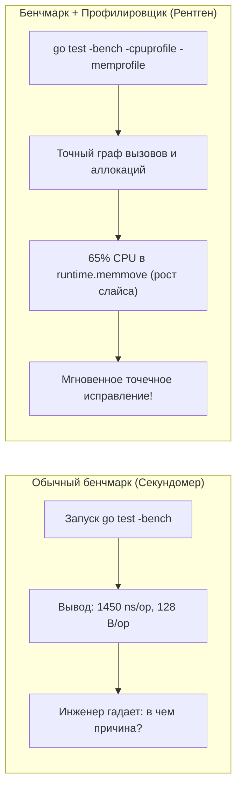
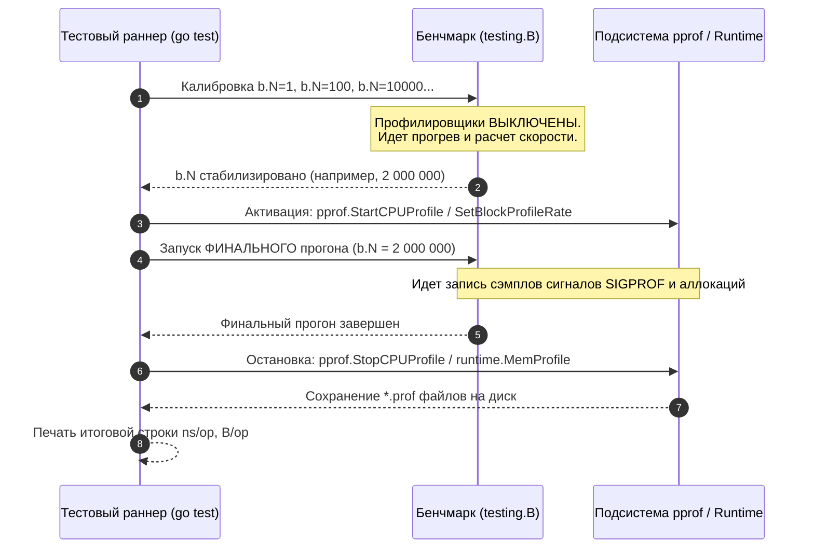
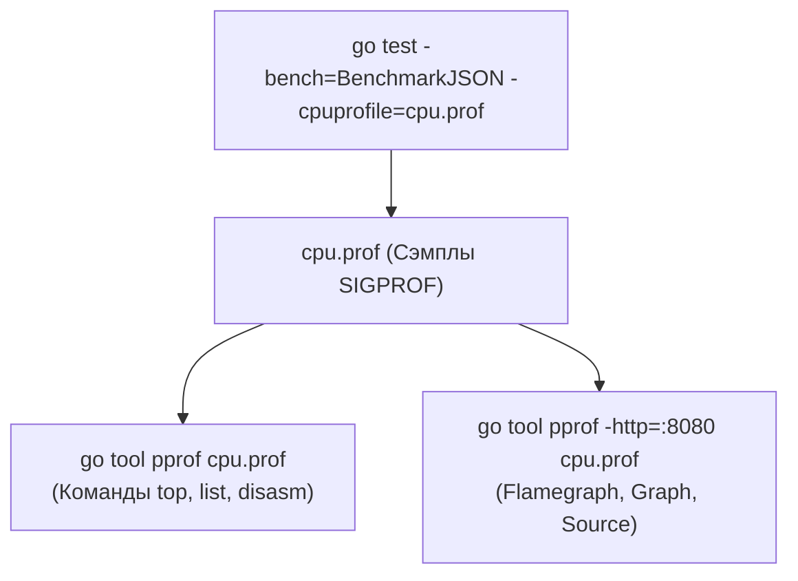
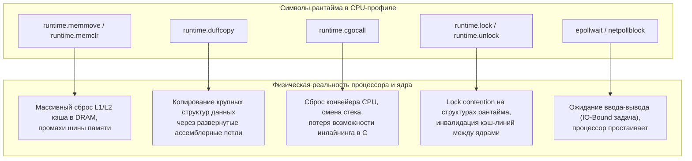
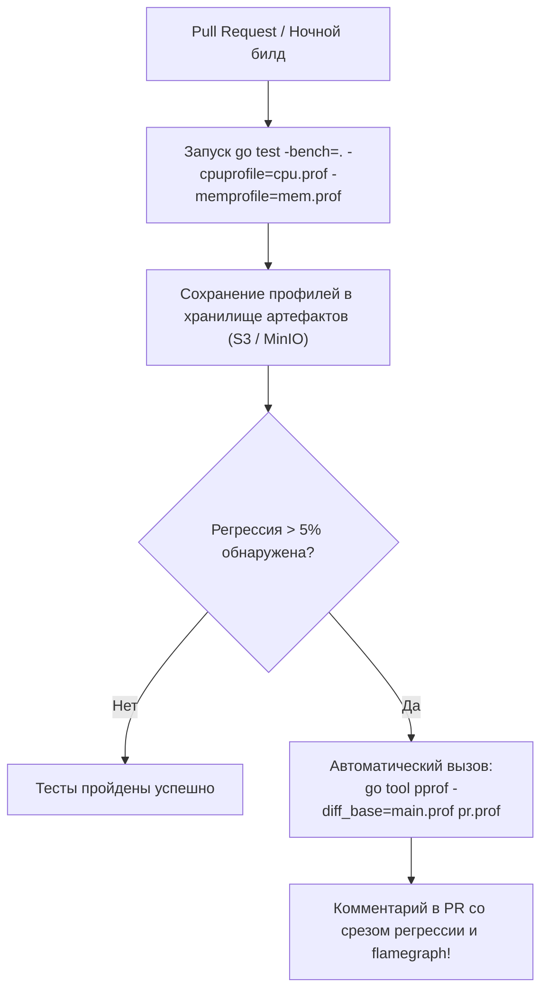

# Профилирование внутри benchmark: рентген узких мест

> *"Premature optimization is the root of all evil. But when the time comes to optimize, do not guess — use a profiler."*  
> — Перефразируя Дональда Кнута

Секундомер — полезный инструмент. Если спринтер пробежал дистанцию за 12 секунд вместо 10, секундомер честно зафиксирует отставание. Но секундомер нем как рыба: он не способен сказать, почему спортсмен замедлился — подвернул ли он лодыжку, ошибся со стартовыми колодками или у него сбилось дыхание.

Бенчмарк `go test -bench` без профилировщика — это точно такой же секундомер. Он выдает сухие числа `ns/op`, `B/op` и `allocs/op`. Вы видите, что новый алгоритм работает на 35% медленнее старого, но понятия не имеете, *где именно внутри функции* сгорают драгоценные процессорные такты. Вызвана ли задержка лишними аллокациями, скрытым копированием слайсов, ожиданием в мьютексе или промахами мимо кэша процессора?

К счастью, инженеры Go встроили в испытательный стенд полноценный диагностический рентген. Флаги `-cpuprofile`, `-memprofile`, `-blockprofile` и `-mutexprofile` позволяют снять послойный анатомический срез работы программы прямо во время исполнения бенчмарка. В этой лекции мы разберем, как активировать этот арсенал, как устроен механизм снятия профилей в рантайме Go и как превратить сухой стек вызовов в очевидный план оптимизации кода.

---

## Зачем совмещать бенчмарк и профилировщик

В предыдущих лекциях мы изучили основы бенчмаркинга ([[2. Benchmarking в Go]]), погрузились во внутреннее устройство испытательного стенда ([[3. go test -bench под капотом]]) и обуздали случайный шум измерений ([[6. Стабилизация результатов]]). 

Однако классические метрики бенчмарка отвечают только на вопрос *«насколько быстро?»*, но упорно молчат о вопросе *«почему именно так?»*:
- Почему замена `map[string]int` на срез структур ускорила обработку втрое?
- Какие конкретно строки кода триггерят сборщик мусора `runtime.mallocgc`?
- Почему при добавлении ядер процессора в `b.RunParallel` производительность не растет, а падает?



Совмещение бенчмарка и профилировщика дает инженеру идеальную тестовую лабораторию:
1. **Стерильная повторяемость:** Бенчмарк обеспечивает строго одинаковый цикл нагрузки `b.N`, изолированный от сетевых задержек и внешних баз данных.
2. **Нулевой шум лишнего кода:** В профиль попадает исключительно тестируемая функция, а не инициализация роутера HTTP или парсинг конфигов при старте сервиса.
3. **Мгновенная локализация:** Вы открываете flamegraph ([[3. Flamegraph]]) и сразу видите горячую строку кода, сжигающую 80% тактов.

---

## Как `go test -bench` запускает профилировщик

Если вы читали [[3. go test -bench под капотом]], то помните, что рантайм Go не знает заранее, сколько итераций `b.N` потребуется для заполнения интервала `-benchtime`. Он начинает с `b.N = 1`, затем пробует 100, 10 000, 1 000 000, динамически подстраиваясь под скорость машины.

Если бы профилировщик работал на всех этапах калибровки, возникли бы две фатальные проблемы:
1. Накладные расходы профилировщика исказили бы математику прогнозирования `b.N`.
2. Короткие калибровочные запуски с холодными кэшами загрязнили бы итоговый профиль мусорными данными прогрева.

Поэтому механизм профилирования активируется исключительно на **последнем, финальном прогоне**:



Управление профилированием осуществляется через стандартные флаги CLI:
- `-cpuprofile <file>` — запись профиля активности процессора (CPU samples).
- `-memprofile <file>` — запись профиля использования динамической памяти (кучи).
- `-blockprofile <file>` — профиль блокировок горутин (ожидание каналов, мьютексов, системных вызовов).
- `-mutexprofile <file>` — профиль contention (конкуренции) за критические секции мьютексов.

Все сгенерированные файлы бинарно совместимы со стандартным анализатором `go tool pprof`.

> [!info] Под капотом
> При передаче флага `-cpuprofile` тестовый фреймворк вызывает функцию `pprof.StartCPUProfile` непосредственно перед телом финального запуска и `pprof.StopCPUProfile` сразу после его завершения. Под капотом рантайм настраивает таймер ядра `setitimer(ITIMER_PROF)`, который с частотой 100 Гц отправляет процессу сигнал `SIGPROF`. Обработчик сигнала инспектирует регистры `PC` (Program Counter) и `SP` (Stack Pointer) текущего потока `M`, сохраняя цепочку вызовов в буфер.  
> Профиль памяти снимается через вызов `runtime.MemProfile` после завершения всех итераций финального цикла. Блокировочный и мьютексный профили активируются вызовами `runtime.SetBlockProfileRate` и `runtime.SetMutexProfileFraction` прямо перед финальным стартом, заставляя рантайм сохранять стеки заснувших горутин в глобальные циклические буферы.

---

## CPU-профилирование внутри бенчмарка

CPU-профиль — инструмент номер один при расследовании высоких задержек `ns/op`.

### Запуск

Снимем профиль для бенчмарка парсера JSON:

```bash
go test -bench=BenchmarkJSON -cpuprofile=cpu.prof
```

После завершения теста в текущем каталоге появится файл `cpu.prof`. Изучить его можно двумя путями:

#### 1. Интерактивный терминальный режим
```bash
go tool pprof cpu.prof
```
Внутри интерактивной консоли доступны команды:
- `top 10` — вывести 10 самых прожорливых функций по абсолютному времени (`flat`) и совокупному времени с учетом дочерних вызовов (`cum`).
- `list <FunctionName>` — построчный вывод исходного кода с указанием времени, потраченного на каждую инструкцию!
- `disasm <FunctionName>` — ассемблерный листинг функции с сопоставлением машинных инструкций и тактов.

#### 2. Веб-интерфейс с графами и Flamegraph
```bash
go tool pprof -http=:8080 cpu.prof
```
Браузер откроет интерактивный дашборд:
- **Flamegraph ([[3. Flamegraph]]):** Наглядная «огненная» визуализация, где ширина блока пропорциональна времени нахождения CPU в функции.
- **Top / Graph:** Направленный граф вызовов с толщиной стрелок, отражающей нагрузку на ветви исполнения.
- **Source:** Построчный просмотр исходного кода с цветовой подсветкой горячих строк.



### Интерпретация

Представьте, что бенчмарк `BenchmarkJSON` показал неожиданно плохой результат: 5000 `ns/op`. Вы открываете профиль и видите следующую картину:

```
(pprof) top 5
Showing nodes accounting for 4.20s, 84.00% of 5.00s total
      flat  flat%   sum%        cum   cum%
     2.10s 42.00% 42.00%      2.10s 42.00%  runtime.mallocgc
     1.20s 24.00% 66.00%      1.20s 24.00%  runtime.memmove
     0.60s 12.00% 78.00%      4.50s 90.00%  encoding/json.Unmarshal
     0.30s  6.00% 84.00%      0.30s  6.00%  runtime.scanobject
```

**Инженерный вывод:**  
Хотя бенчмарк вызывал `json.Unmarshal`, сам алгоритмический парсер JSON съел всего 12% времени! Львиная доля процессора — **66% времени** — сгорела в недрах рантайма:
- `runtime.mallocgc` (42%) — непрерывное выделение объектов в куче.
- `runtime.memmove` (24%) — копирование байт при расширении внутренних слайсов.

Проблема кроется не в математике парсера, а в **аллокациях**. Оптимизация должна идти не по пути переписывания алгоритма, а по пути переиспользования буферов через `sync.Pool` ([[2. sync Pool]]) или перехода на zero-allocation кодогенераторы (например, `easyjson` или `sonic`).

> [!tip] Собеседование
> **Вопрос:** Бенчмарк показывает, что операция занимает 10 мкс. Вы сняли CPU-профиль и обнаружили, что функция `runtime.memmove` занимает 60% всего процессорного времени. Что это означает и как это исправить?
> 
> **Ответ кандидата уровня Senior:**  
> Функция `runtime.memmove` отвечает за побайтовое копирование блоков памяти. Ее доминирование в топе CPU-профиля обычно указывает на три архитектурные проблемы:
> 1. **Динамический рост слайсов:** Вызовы `append()` к неинициализированному слайсу приводят к регулярному удвоению емкости и перекопированию старых элементов в новый массив. Решение: предвыделять емкость через `make([]T, 0, cap)`.
> 2. **Передача крупных структур по значению:** Передача `struct` размером в сотни байт через стек копирует данные на каждом вызове. Решение: передавать структуру по указателю `*MyStruct`.
> 3. **Неэффективное использование буферов:** Частое копирование байтовых массивов вместо срезов или вызовов `copy()`.  
> Следующим шагом я запущу бенчмарк с флагом `-benchmem`, чтобы подтвердить гипотезу об аллокациях, и посмотрю вывод команды `list` в `pprof`, чтобы найти точную строку, вызывающую копирование.

---

## Профилирование памяти: `-benchmem` и `-memprofile`

Флаг `-benchmem` сообщает агрегированные цифры: `B/op` (сколько байт выделено за итерацию) и `allocs/op` (сколько раз дергался аллокатор). Но он не способен показать, **какая именно строчка вашего кода породила аллокацию**.

Для точной локализации используется флаг `-memprofile`:

```bash
go test -bench=BenchmarkConcat -memprofile=mem.prof
```

При анализе файла `mem.prof` через `pprof` критически важно правильно выбрать режим отображения:

```bash
# Режим 1: Анализ суммарно выделенной памяти за время теста (РЕКОМЕНДУЕТСЯ ДЛЯ БЕНЧМАРКОВ)
go tool pprof -alloc_space mem.prof

# Режим 2: Анализ количества фактов выделения памяти
go tool pprof -alloc_objects mem.prof

# Режим 3: Анализ памяти, оставшейся в куче на момент завершения теста
go tool pprof -inuse_space mem.prof

# Режим 4: Количество живых объектов на момент завершения теста
go tool pprof -inuse_objects mem.prof
```

### Разница между `-alloc_space` и `-inuse_space`

В чем фундаментальное отличие?
- `-alloc_space` учитывает **абсолютно все байты**, когда-либо запрошенные у аллокатора за время теста, даже если через микросекунду эти объекты стали мусором и были уничтожены сборщиком мусора.
- `-inuse_space` показывает только те объекты, которые **остались живыми в памяти** в момент финализации профиля.

Для микробенчмарков первостепенное значение имеет именно `-alloc_space`! Короткоживущие временные объекты создают колоссальное давление на GC, приводя к паузам и троттлингу, но в `-inuse_space` они не попадут, так как будут собраны еще до окончания теста.

> [!warning] Ловушка / Gotcha: Пустой профиль `-inuse_space`
> Профиль памяти снимается рантаймом строго *после* завершения последней итерации финального прогона бенчмарка. Если вы тестируете функцию обработки временных буферов, все созданные объекты успеют освободиться. Открыв профиль в режиме по умолчанию (`-inuse_space`), вы увидите нулевое потребление памяти и можете ошибочно решить, что аллокаций нет!  
> **Золотое правило бенчмаркинга памяти:** всегда анализируйте профиль с флагом `-alloc_space` или `-alloc_objects`.

---

## Блокировочный профиль внутри бенчмарка

Когда вы запускаете конкурентный бенчмарк с использованием `b.RunParallel` ([[2. Benchmarking в Go]]), процессорный профиль может показать парадоксальную картину: утилизация CPU низкая, задержка `ns/op` огромная, а в топе функций нет явных лидеров.

Это классический признак **Off-CPU задержек**: горутины не сжигают такты процессора, они **спят в очереди**, ожидая доступа к ресурсу!

На помощь приходит блокировочный профиль (Block Profile):

```bash
go test -bench=BenchmarkParallel -blockprofile=block.prof
go tool pprof block.prof
```

Блокировочный профиль регистрирует совокупное время, которое горутины провели в состоянии `Waiting` (ожидание разблокировки):
- Ожидание на системном таймере или селекторе `select` на канале.
- Ожидание захвата блокировки `sync.Mutex.Lock` или `sync.RWMutex.RLock`.
- Ожидание отправки/получения в канале (`chan send/receive`), когда буфер полон или пуст.
- Блокирующие системные вызовы ядра (file I/O, network read/write).

Команда `top` в `block.prof` мгновенно покажет, на какой строчке горутины проводят 90% своей жизни:

```
(pprof) top
Showing nodes accounting for 12.50s, 95.00% of 13.15s total
      flat  flat%   sum%        cum   cum%
    10.20s 77.57% 77.57%     10.20s 77.57%  sync.(*Mutex).Lock
     2.30s 17.49% 95.06%      2.30s 17.49%  runtime.chansend
```
Здесь видно, что узким местом многопоточного кода является не процессорная логика, а жестокий **Lock Contention** на единственном мьютексе ([[7. Contention и lock profiling]]).

---

## Профиль мьютексов

В чем разница между `-blockprofile` и `-mutexprofile`?
- **Блокировочный профиль (`-blockprofile`)** фиксирует *время задержки*: сколько наносекунд горутина провела во сне от момента вызова `Lock()` до момента получения блокировки.
- **Мьютексный профиль (`-mutexprofile`)** фиксирует *факт конкуренции (contention)*: он замеряет задержки, возникающие исключительно из-за того, что мьютекс уже удерживается другой горутиной.

```bash
go test -bench=BenchmarkMutex -mutexprofile=mutex.prof
go tool pprof mutex.prof
```

В выводе `mutex.prof` отображаются конкретные экземпляры мьютексов в коде, вызывающие столкновение потоков. Если мьютекс захватывается без борьбы (свободен), профиль мьютексов не регистрирует никакого события. Но как только две горутины сталкиваются лбами за одну критическую секцию, рантайм Go записывает стек вызова.

Это главный инструмент для принятия архитектурных решений:
- Шардировать ли кэш на независимые корзины (`striped mutexes`).
- Переходить ли на lock-free структуры данных через атомики `sync/atomic`.

---

## Комбинирование профилей в одном запуске

Флаги профилирования можно передавать в команду `go test` одновременно. Это позволяет получить исчерпывающий, взаимно согласованный снимок всех подсистем рантайма:

```bash
go test -bench=. -count=5 \
    -cpuprofile=cpu.prof \
    -memprofile=mem.prof \
    -blockprofile=block.prof \
    -mutexprofile=mutex.prof
```

Все четыре профиля будут сняты с одного и того же финального прогона одного запуска. Вы можете открыть их в соседних терминалах или на разных портах веб-интерфейса:

```bash
go tool pprof -http=:8081 cpu.prof &
go tool pprof -http=:8082 mem.prof &
go tool pprof -http=:8083 block.prof &
go tool pprof -http=:8084 mutex.prof &
```

Совместный анализ позволяет сопоставить:
1. Горячие циклы CPU (`cpu.prof`).
2. Места аллокаций памяти (`mem.prof`).
3. Точки блокировок потоков (`block.prof` и `mutex.prof`).

---

## Влияние профилирования на результаты бенчмарка

Бесплатных абстракций и инструментов не существует. Любой профилировщик — это программный зонд, потребляющий аппаратные ресурсы:

| Тип профилирования | Механизм сбора | Оценочные накладные расходы (Overhead) | Влияние на замеры ns/op |
|---|---|:---:|---|
| **CPU (`-cpuprofile`)** | Сигналы `SIGPROF` ядра (100 Гц), раскрутка стека | ~1–3% | Минимальное для длительных тестов, заметное для сверхбыстрых циклов (< 10 нс) |
| **Память (`-memprofile`)** | Сэмплирование аллокаций каждые 512 КБ (`runtime.MemProfileRate`) | < 1% по времени, +память под профиль | Практически не искажает замеры времени, но может увеличивать размер кучи |
| **Блокировки (`-blockprofile`)** | Трассировка пробуждения горутин через планировщик | ~3–8% | Замедляет конкурентные бенчмарки с высокой частотой блокировок |
| **Мьютексы (`-mutexprofile`)** | Атомарный учет столкновений в семафорах мьютекса | ~2–5% | Увеличивает задержки на высоконагруженных мьютексах |

### Золотые правила работы с профилировщиком:
1. **Разделяйте измерение и диагностику:** Никогда не принимайте архитектурных решений о скорости кода на основе абсолютных цифр `ns/op`, полученных из профилированного прогона!
2. **Двухэтапный рабочий процесс:**
   - **Этап 1 (Метрология):** Запустите чистый `go test -bench -count=10` без профилей. Получите достоверные базовые значения `ns/op` и `B/op`.
   - **Этап 2 (Диагностика):** Если обнаружена регрессия или неудовлетворительное время, запустите бенчмарк с флагами профилей для поиска виновника.
3. **Регулировка частоты сэмплирования:** Если CPU-профилирование искажает поведение сверхбыстрого кода, частоту сигналов можно понизить через программный вызов `runtime.SetCPUProfileRate` (по умолчанию 100 сэмплов в секунду), хотя для большинства типовых задач стандартных 100 Гц более чем достаточно.

---

## Mechanical Sympathy: что профили говорят о «железе»

Опытный инженер читает профиль Go так же, как врач читает кардиограмму. За именами стандартных функций рантайма скрываются фундаментальные процессы взаимодействия софта и кремния:



1. **`runtime.memmove` и `runtime.memclr`:**  
   Показывают, что процессор тратит такты на заливку нулями новой памяти или перенос байт. Если они находятся на вершине профиля, шина памяти перегружена, а кэши L1/L2 непрерывно вымываются.
2. **`runtime.duffcopy`:**  
   Особая оптимизация компилятора Go («устройство Даффа»): развернутый ассемблерный блок инструкций `MOV` для сверхбыстрого копирования структур среднего размера (от 64 до 256 байт) без организации цикла. Если `duffcopy` доминирует в профиле, вы передаете структуры по значению вместо использования указателей.
3. **`runtime.cgocall`:**  
   Переход через границу Cgo в код на языке C. Требует сохранения всех регистров, переключения на стек операционной системы и блокировки потока ОС. Запрещает компилятору выполнять инлайнинг и вымывает предсказатель переходов.
4. **`runtime.lock` и `runtime.unlock`:**  
   Внутренние спинлоки рантайма Go (защищающие аллокаторы `mcentral`/`mheap` или планировщик). Их появление на вершине CPU-профиля говорит о том, что потоки ядра непрерывно инвалидируют кэш-линии друг друга (**cache line bounce**), пытаясь захватить спинлок.
5. **`epollwait` и `netpollblock`:**  
   Указывают на то, что задача является строго **IO-Bound** ([[3. CPU bound vs IO bound задачи]]), и дальнейшая алгоритмическая оптимизация вычислений бессмысленна — нужно оптимизировать сетевой стек и работу с сокетами.

---

## Практический пример: от бенчмарка к профилю и обратно

Разберем реальный практический кейс: оптимизацию функции склейки строк.

### Исходная реализация

```go
package bench_test

import (
    "strings"
    "testing"
)

var globalResult string

func BenchmarkConcatBuilder(b *testing.B) {
    parts := []string{"Hello", " ", "World", "!", " ", "Go"}
    
    b.ResetTimer()
    for i := 0; i < b.N; i++ {
        var sb strings.Builder
        for _, p := range parts {
            sb.WriteString(p)
        }
        globalResult = sb.String()
    }
}
```

Запуск бенчмарка:
```bash
go test -bench=BenchmarkConcatBuilder -benchmem
```

Результат:
```
BenchmarkConcatBuilder-8    18000000    65.4 ns/op    0 B/op    0 allocs/op
```

Метрика `0 allocs/op` радует глаз — компилятор успешно выделил внутренний буфер на стеке. Но 65 наносекунд на 6 коротких строк кажутся завышенными. Снимем CPU-профиль:

```bash
go test -bench=BenchmarkConcatBuilder -cpuprofile=cpu.prof
go tool pprof cpu.prof
```

Заглядываем в построчный листинг функции через команду `list BenchmarkConcatBuilder`:

```
(pprof) list BenchmarkConcatBuilder
Total: 1.45s
ROUTINE ======================== BenchmarkConcatBuilder
...
     .          .   152: for i := 0; i < b.N; i++ {
     .          .   153:     var sb strings.Builder
 320ms      320ms   154:     for _, p := range parts {
 850ms      850ms   155:         sb.WriteString(p) // <--- ВОТ ОНО! 850ms в runtime.memmove!
     .          .   156:     }
 280ms      280ms   157:     globalResult = sb.String()
     .          .   158: }
```

**Диагноз:**  
Внутри `sb.WriteString` при каждом добавлении строки проверяется емкость буфера. Поскольку начальная емкость равна нулю, буфер растет ступенчато: 8 байт, 16 байт, 32 байта... Каждый рост вызывает вызов `runtime.memmove` для копирования ранее накопленных символов!

### Оптимизированная реализация

Инженер применяет метод `sb.Grow`, заранее сообщая билдеру необходимый размер итоговой строки:

```go
func BenchmarkConcatBuilderOptimized(b *testing.B) {
    parts := []string{"Hello", " ", "World", "!", " ", "Go"}
    totalLen := 0
    for _, p := range parts {
        totalLen += len(p)
    }

    b.ResetTimer()
    for i := 0; i < b.N; i++ {
        var sb strings.Builder
        // Предвыделяем емкость один раз: исключаем промежуточный memmove!
        sb.Grow(totalLen)
        for _, p := range parts {
            sb.WriteString(p)
        }
        globalResult = sb.String()
    }
}
```

Повторный запуск:
```
BenchmarkConcatBuilderOptimized-8    38000000    29.2 ns/op    0 B/op    0 allocs/op
```

Время выполнения сократилось более чем в **2.2 раза** (с 65.4 нс до 29.2 нс), а в новом CPU-профиле функция `runtime.memmove` полностью исчезла из горячего цикла!

---

### Еще один показательный кейс: False Sharing в параллельном тесте

В параллельном бенчмарке инкремента глобального счетчика через атомик `atomic.AddInt64`:
- На 1 ядре (`-cpu=1`): операция занимает **8 нс**.
- На 8 ядрах (`-cpu=8`): задержка подскакивает до **140 нс**!

Снятие блокировочного профиля и профиля мьютексов указывает на аппаратный contention за кэш-линию — эффект **False Sharing** ([[8. False sharing]]). Восемь ядер непрерывно инвалидируют одну и ту же 64-байтную строку кэша L1 через протокол MESI. Добавление отступа (padding) в структуру разносит переменные по разным кэш-линиям и возвращает наносекундную скорость на всех ядрах.

---

## Интеграция в CI/CD

В зрелых инженерных командах профили, снятые во время ночных прогонов бенчмарков в CI, сохраняются в качестве артефактов сборки (Build Artifacts).



Когда система мониторинга CI фиксирует статистически достоверную деградацию производительности, разработчику не нужно вручную воспроизводить проблему на локальной машине. Он запускает команду дифференциального сравнения профилей:

```bash
# Сравнение профиля текущего PR с профилем базовой ветки main
go tool pprof -diff_base=main_cpu.prof pr_cpu.prof
```

Утилита `pprof` выведет дельту времени для каждой функции:
```
(pprof) top
Showing nodes accounting for +1.20s, 100% of +1.20s total
      flat  flat%   sum%        cum   cum%
    +0.95s 79.17% 79.17%     +0.95s 79.17%  my/package.newCryptoEncoder
    +0.25s 20.83%   100%     +0.25s 20.83%  runtime.mallocgc
```
Разработчик за 3 секунды видит, что регрессия вызвана новым криптографическим энкодером, порождающим лишние аллокации.

---

## Итог

1. **Профилировщик превращает секундомер в рентген:** Метрики `ns/op` и `B/op` констатируют факт изменения скорости, а встроенные профилировщики объясняют его глубинную анатомию.
2. **Безопасная архитектура запуска:** `go test -bench` активирует сбор профилей строго на **финальном стабильном прогоне**, не искажая адаптивную калибровку `b.N`.
3. **Специализация инструментов:**
   - `-cpuprofile` — поиск горячих функций, съедающих такты процессора.
   - `-memprofile` (с обязательным анализом через `-alloc_space`) — поиск точных строк кода, порождающих мусор в куче.
   - `-blockprofile` — поиск точек засыпания горутин на каналах и семафорах.
   - `-mutexprofile` — обнаружение contention за разделяемые мьютексы.
4. **Mechanical Sympathy:** Доминирование функций рантайма (`runtime.memmove`, `runtime.mallocgc`, `runtime.duffcopy`) указывает на аппаратные проблемы: вымывание кэшей CPU, перегрузку шины памяти или избыточное копирование структур.
5. **Разделение фаз:** Замеры скорости и сбор профилей проводятся раздельно, чтобы накладные расходы профилировщика не искажали эталонные метрологические результаты.

Теперь, когда мы научились измерять код, стабилизировать замеры и анатомировать узкие места профилировщиком, мы готовы перейти к завершающей теме блока: математически строгому сравнению двух версий кода и предотвращению регрессий. Следующая лекция: [[8. Сравнение версий кода]].