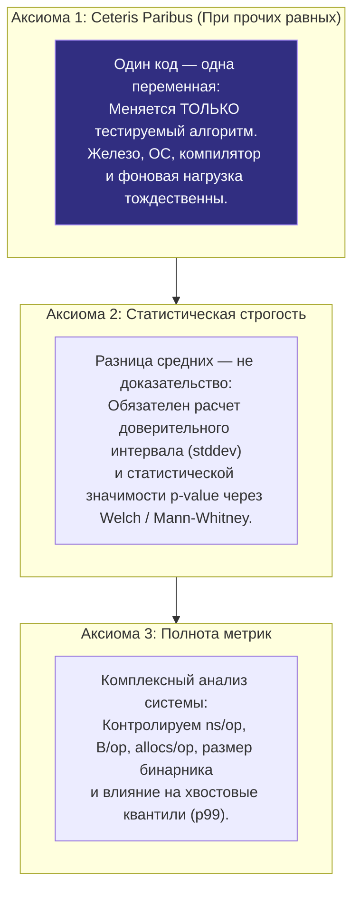
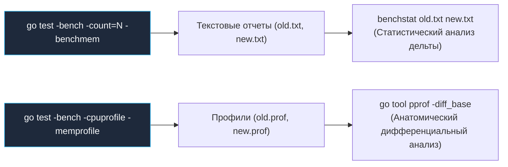
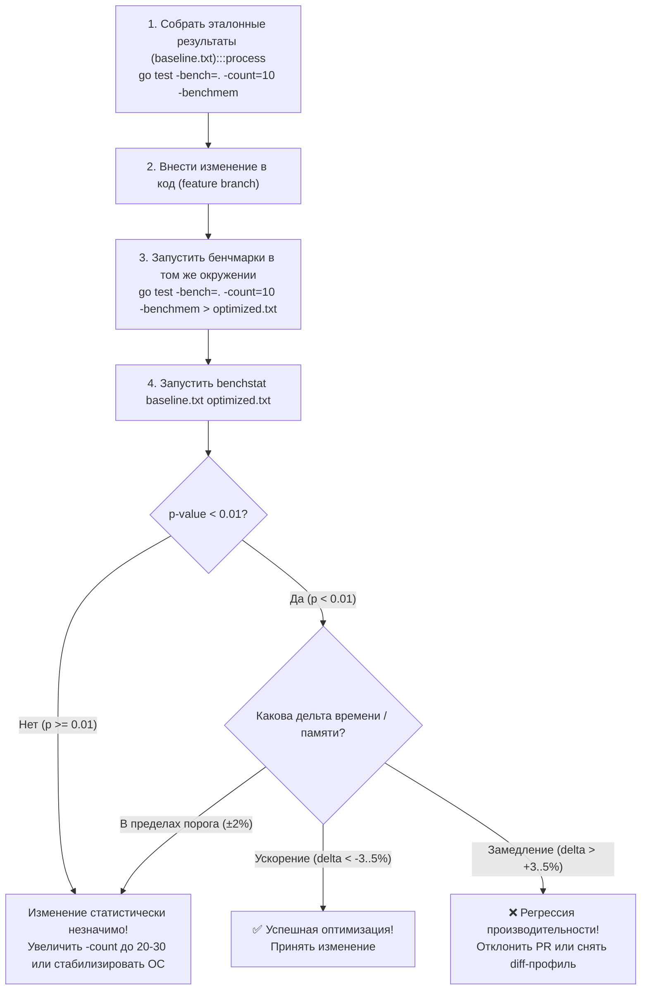
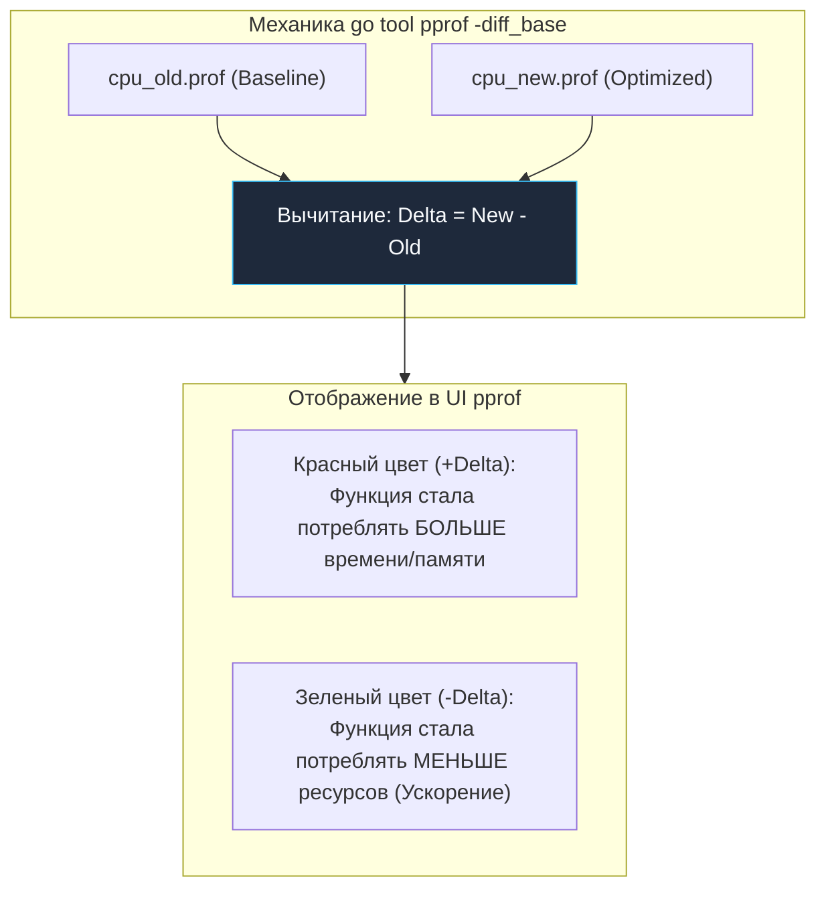
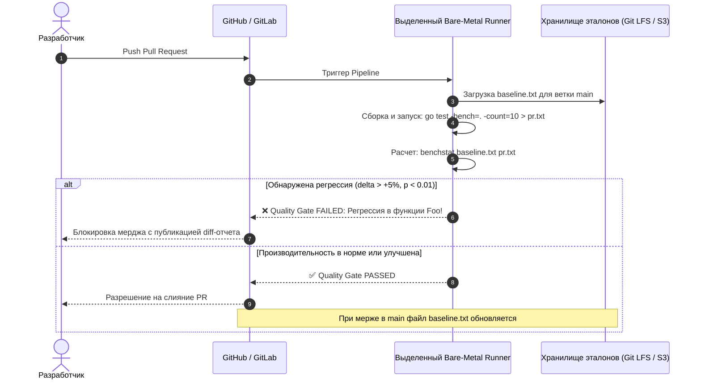

# Сравнение версий кода: доказательная оптимизация и benchstat

> *«Мы уповаем на Бога. Все остальные обязаны предоставить данные».*    
> — Уильям Эдвардс Деминг  
> 
> *«Бенчмарк одной версии программы — это просто занятный анекдот; статистически подтвержденное сравнение — это уже инженерия».*    
> — Брайан Керниган

Когда разработчик с гордостью заявляет в Pull Request: *«Я переписал этот модуль, теперь он работает на 20% быстрее!»* — опытный Senior-инженер всегда задает три неудобных вопроса:
1. *Быстрее по сравнению с чем именно?*  
2. *Каков доверительный интервал и какова вероятность того, что эти 20% — просто случайный шум разогретого процессора?*  
3. *Что произошло с аллокациями памяти и хвостовыми задержками?*

Одиночный замер производительности в отрыве от контекста не имеет никакого практического смысла. Скорость — понятие сугубо относительное. Завершающий и самый ответственный этап инженерного цикла **Measure → Profile → Optimize → Verify**, сформулированного в [[1. Обзор раздела. Как мыслить о производительности]], — это **доказательное сравнение двух состояний системы**.

Мы уже умеем писать надежные бенчмарки ([[2. Benchmarking в Go]]), обходить коварные ловушки оптимизатора SSA ([[4. Подводные камни benchmark тестов]]), стабилизировать физическое окружение Linux ([[6. Стабилизация результатов]]) и просвечивать код профилировщиком ([[7. Профилирование внутри benchmark]]). В этой завершающей лекции блока мы замкнем контур: освоим математический аппарат доказательного сравнения, научимся читать дифференциальные профили `pprof -diff_base`, внедрим автоматический контроль регрессий в CI и разберемся, почему вердикт утилиты `benchstat` должен быть законом для любого разработчика.

---

## Зачем сравнивать версии

Сравнение версий решает две фундаментальные задачи промышленной разработки:
1. **Верификация оптимизаций:** Доказать математически, что внедренное усложнение кода (например, переход на низкоуровневые указатели `unsafe` или пул `sync.Pool`) действительно приносит пользу, оправдывающую рост когнитивной сложности.
2. **Предотвращение незаметных регрессий (Performance Regression):** Защитить кодовую базу от случайной деградации, когда безобидный на первый взгляд рефакторинг в соседнем пакете роняет общую пропускную способность сервиса на 15%.

Senior-инженер никогда не говорит: *«Мне кажется, стало быстрее»*. Он формулирует строгий метрологический вердикт:  
> *«Изменение алгоритма в PR #412 дало ускорение на 17.89% ± 1.2% с доверительной вероятностью 99.9% (p = 0.000) и снизило аллокации памяти со 128 B/op до 0 B/op при n = 15+15»*.

---

## Базовые принципы сравнения

Доказательный бенчмаркинг опирается на три непреложных закона научного эксперимента:



1. **Один код — одна переменная (Ceteris Paribus).**  
   Сравниваются строго две версии бинарного файла, собранные одной и той же версией компилятора Go (`go version`), запущенные на одной и той же физической машине, с одинаковой фиксированной частотой процессора и губернатором `performance`. Если вы запустили базовый замер в пятницу на офисном сервере, а оптимизированный в понедельник на домашнем ноутбуке — ваши результаты можно сразу отправлять в мусорную корзину.
2. **Статистическая строгость (Гипотеза $H_0$).**  
   Разница средних арифметических — это иллюзия. Единственный научный критерий — проверка нулевой гипотезы $H_0$ («истинной разницы между версиями нет, а наблюдаемое отклонение вызвано случайным шумом»). Если вероятность случайности (p-value) превышает 0.05 (5%), изменение отвергается как статистически недостоверное.
3. **Сравниваем не только среднее, но и распределение.**  
   Улучшение среднего времени (p50) не гарантирует отсутствия деградации на хвостах ([[5. microbenchmarks vs macrobenchmarks]]). Если алгоритм в среднем стал быстрее, но стандартное отклонение выросло с 2% до 18% — в реальном продакшене это вызовет взрывной рост задержек на перцентилях p95 и p99 ([[6. Метрики. p50, p95, p99]], [[7. Tail latency и почему она важна]]).

---

## Инструменты сравнения

Для сравнения версий в экосистеме Go существует специализированный стек инструментов:



### 1. `benchstat` — основной инструмент

Официальный инструмент Go-сообщества для статистической оценки результатов бенчмарков — утилита `benchstat` (разрабатываемая в репозитории `golang.org/x/perf/cmd/benchstat`):

```bash
# Установка стабильной версии benchstat
go install golang.org/x/perf/cmd/benchstat@latest
```

Утилита принимает на вход два или более текстовых файла с выводом команды `go test -bench` (с обязательным флагом многократного запуска `-count`):

```bash
# 1. Снимаем выборку старой версии (baseline)
go test -bench=. -count=10 > old.txt

# 2. Вносим изменения в код...

# 3. Снимаем выборку новой версии
go test -bench=. -count=10 > new.txt

# 4. Проводим математический анализ
benchstat old.txt new.txt
```

Пример вывода `benchstat`:

```
name        old time/op    new time/op    delta
Foo-8        12.3µs ± 2%    10.1µs ± 1%  -17.89%  (p=0.000 n=10+10)
Bar-8         5.6µs ± 5%     5.8µs ± 6%   +3.57%  (p=0.234 n=10+10)
```

Разбор вердикта:
- **`Foo-8`:** Статистически безупречная победа. Среднее время упало с 12.3 мкс до 10.1 мкс (`-17.89%`). Доверительные интервалы узки (`± 2%` и `± 1%`), а `p=0.000` свидетельствует о том, что вероятность случайного совпадения практически равна нулю. Изменение безоговорочно принимается!
- **`Bar-8`:** Кажущееся замедление на 3.57% на самом деле является фикцией. `p=0.234` означает, что с вероятностью 23.4% эта дельта вызвана случайными колебаниями планировщика ОС или таймеров. Доверительный интервал включает нулевое изменение. Разницу списывают на шум, коммит не отклоняется и не принимается как замедление.

Кроме процессорного времени `benchstat` автоматически анализирует таблицы памяти: `B/op` (выделенные байты) и `allocs/op` (число обращений к аллокатору).

---

### 2. `go test -bench` с флагами профилирования

Если `benchstat` констатирует факт изменения времени, то связка профилировщиков с флагом `pprof -diff_base` ([[7. Профилирование внутри benchmark]]) вскрывает его анатомию. Вычитая базовый профиль из оптимизированного, инженер наглядно видит, в каких именно строках кода высвободились такты CPU или байты кучи.

---

### 3. Собственные скрипты и CI

В пайплайнах непрерывной интеграции ([[5. Performance regression detection]]) автоматизируют полный цикл:
1. Запуск `go test -bench` на PR.
2. Сравнение с эталонным файлом из ветки `main`.
3. Автоматический расчет метрик через `benchstat`.
4. Блокировка мерджа (Quality Gate) при превышении допустимого порога регрессии.

---

## Пошаговая методология сравнения

Сравнение версий — это стандартизированный инженерный алгоритм, исключающий субъективные трактовки:



### 1. Сбор эталона

Эталонный замер (**baseline**) снимается на чистой исходной ветке (обычно `main` или коммит до рефакторинга).

```bash
# Прячем незакоммиченные изменения или переключаемся на main
git stash

# Запускаем серию из 10-15 прогонов с контролем памяти
go test -bench=. -count=10 -benchmem > baseline.txt
```

### 2. Внесение изменения и замер

Возвращаем оптимизированный код и повторяем запуск с абсолютно теми же аргументами:

```bash
# Возвращаем изменения
git stash pop

# Запускаем в точно таких же условиях
go test -bench=. -count=10 -benchmem > optimized.txt
```

### 3. Статистическое сравнение

```bash
benchstat baseline.txt optimized.txt
```

### 4. Интерпретация результатов

При чтении отчета руководствуются строгими критериями:
1. **`p < 0.01` и дельта отрицательна (ускорение > 3–5%):**  
   Оптимизация доказана и успешна. Код принимается.
2. **`p < 0.01` и дельта положительна (замедление > 3–5%):**  
   Зафиксирована регрессия. Изменение блокируется, начинается профилирование.
3. **`p >= 0.05`:**  
   Результат статистически не отличим от нуля. Дельта утонула в шуме. Действия:
   - Либо увеличить выборку до `-count=20..30`.
   - Либо стабилизировать процессор (отключить Turbo Boost, см. [[6. Стабилизация результатов]]).
   - Либо признать, что гипотеза об оптимизации не подтвердилась.
4. **Высокая дисперсия (`stddev > ±10%`):**  
   Если в колонке разброса стоят двузначные числа, доверять результату нельзя независимо от значения `delta`. Среда измерения загрязнена сторонними процессами.

---

## Сравнение профилей CPU и памяти

Когда `benchstat` сообщает об ускорении на 30%, мы хотим убедиться, что выигрыш получен именно там, где планировалось, и не вызвал скрытых проблем в других подсистемах.

Для этого применяется **дифференциальное профилирование** (`-diff_base`):

```bash
# 1. Замер CPU-профиля на старой версии
git checkout main
go test -bench=BenchmarkTarget -cpuprofile=cpu_old.prof

# 2. Замер CPU-профиля на новой версии
git checkout feature-optimized
go test -bench=BenchmarkTarget -cpuprofile=cpu_new.prof

# 3. Визуализация разностного профиля в браузере
go tool pprof -http=:8080 -diff_base=cpu_old.prof cpu_new.prof
```



В интерактивном веб-интерфейсе `pprof` разностный граф и Flamegraph окрашиваются контрастными цветами:
- **Красные узлы (`+`):** Функции, которые стали тяжелее в новой версии (новые аллокации, дополнительные проверки).
- **Зеленые узлы (`-`):** Функции, где процессорное время или память сократились.

Это позволяет сразу увидеть, куда переместились затраты: например, если время ушло из `json.Unmarshal` в `runtime.mallocgc` (сигнализируя о лишних аллокациях), или если в оптимизированной конкатенации зеленый блок `runtime.memmove` соседствует с красным узлом `runtime.mallocgc`.

Аналогично сравниваются профили динамической памяти:

```bash
go tool pprof -http=:8081 -diff_base=mem_old.prof mem_new.prof
```
При использовании `-alloc_space` разностный профиль прямо укажет функции, сократившие давление на сборщик мусора.

> [!tip] Собеседование
> **Вопрос:** После оптимизации бенчмарк показал ускорение на 20%, но разностный профиль `pprof -diff_base` не выявил заметных сокращений времени ни в одной отдельной функции. За счет чего могло произойти ускорение?
> 
> **Ответ кандидата уровня Senior:**  
> Это классическая ситуация, когда оптимизация затронула глобальные свойства компиляции, не привязанные к конкретной строке:
> 1. **Инлайнинг (Function Inlining):** Устранение границы вызова функции позволяет оптимизатору SSA выбросить пролог/эпилог стека и провести глубокую свертку констант. Накладные расходы исчезают равномерно по всему телу вызывающей функции.
> 2. **Побег на стек (Escape Analysis):** Если объект перестал убегать в кучу и разместился на стеке, исчезают не только миллисекунды в `runtime.mallocgc`, но и снижается общая частота срабатывания фонового сборщика мусора и фаз STW.
> 3. **Локальность кэша процессора:** Уменьшение размера структуры улучшило размещение в кэш-линиях L1D, снизив число аппаратных пауз конвейера (CPU stalls).  
> Чтобы подтвердить гипотезу, я сверю отчет `-benchmem`, проверю флаги компилятора `go build -gcflags="-m"` и проанализирую аппаратные счетчики CPU через `perf stat`.

---

## Что сравнивать, кроме времени и аллокаций

Опытный бэкенд-инженер оценивает влияние изменений шире, чем банальные `ns/op` и `B/op`:

```
+-------------------------------------------------------------------------+
|                  Инженерная матрица сравнения версий                    |
+------------------------------------+------------------------------------+
| Метрика                            | Инструмент контроля                |
+------------------------------------+------------------------------------+
| Время выполнения (ns/op)           | go test -bench, benchstat          |
| Память и аллокации (B/op, allocs)  | go test -benchmem, memprofile      |
| Размер бинарного файла             | ls -l, go version -m <binary>      |
| Аппаратные инструкции (IPC)        | perf stat -e instructions:u        |
| Кэш-промахи (Cache Misses)         | perf stat -e cache-misses:u        |
| Количество горутин рантайма        | runtime.NumGoroutine(), trace      |
| Хвостовые квантили (p95, p99)      | Сквозные макротесты (k6, vegeta)   |
+------------------------------------+------------------------------------+
```

1. **Размер скомпилированного бинарника:**  
   Агрессивный инлайнинг и кодогенерация могут раздуть бинарник на десятки мегабайт, что ухудшит утилизацию кэша инструкций **L1I**. Проверяйте размер исполняемого файла через `ls -l` или метаданные через `go version -m <binary>`.
2. **Число выполненных инструкций CPU:**  
   С помощью системной утилиты Linux `perf stat -e instructions:u ./binary` можно замерить чистое количество машинных команд. Если время выполнения осталось прежним, но число инструкций сократилось на 30%, это означает, что код стал чище, но уперся в задержку памяти (Memory Bound).
3. **Промахи кэша процессора (Cache Misses):**  
   Замер через `perf stat -e cache-misses:u ./binary` позволяет оценить дружественность структуры данных к аппаратному кэшу ([[8. Cache friendliness]]).
4. **Конкурентные утечки:**  
   Контроль количества горутин через `runtime.NumGoroutine()` до и после бенчмарка страхует от утечек фоновых горутин-зомби.

---

## Автоматизация в CI/CD

Ручное сравнение бенчмарков неизбежно забывается в суете спринтов. Надежный барьер против деградации — автоматический запуск `benchstat` в конвейере CI/CD ([[5. Performance regression detection]]).



### Стандартный архитектурный регламент CI-бенчмаркинга:
1. В репозитории (в каталоге `testdata/benchmarks/baseline.txt`) или внешнем S3-хранилище сохраняется утвержденный эталон производительности ветки `main`.
2. Для каждого Pull Request изолированный раннер компилирует проект и снимает свежие результаты:  
   `go test -bench=. -count=10 > pr.txt`.
3. Запускается валидатор:  
   `benchstat testdata/benchmarks/baseline.txt pr.txt`.
4. Если `benchstat` фиксирует деградацию ключевых функций более чем на **5%** при `p-value < 0.05`, пайплайн падает с ошибкой, а в PR автоматически публикуется форматированная таблица изменений.
5. При слиянии оптимизирующего PR в ветку `main` файл `testdata/benchmarks/baseline.txt` автоматически обновляется новыми эталонными замерами.

---

## Mechanical Sympathy: почему контекст окружения важен при сравнении

Почему нельзя слепо верить числам, полученным на разных машинах?

Микроархитектура современных чипов крайне чувствительна к контексту:
- **Размер и топология кэшей:** У процессора AMD Ryzen 7950X кэш L3 составляет 64 МБ, разделенных между двумя кристаллами CCD. У Intel Core i9-14900K — монолитный кэш L3 на 36 МБ с кольцевой шиной Ring Bus. Алгоритм, летающий на одном процессоре за счет огромного кэша, на другом чипе начнет массово выпадать в память.
- **Выравнивание инструкций по границе 64 байт:** Небольшое изменение в длине одной вспомогательной функции в начале файла может сдвинуть адреса горячего цикла в машинном коде. Если цикл случайно пересечет границу 64-байтной строки кэша инструкций **L1I**, процессор будет вынужден декодировать две кэш-линии вместо одной, замедлив выполнение на 5–10% на абсолютно идентичном коде!
- **Версия рантайма Go:** С каждым новым релизом (Go 1.21, 1.22, 1.23, 1.24) команда Go оптимизирует планировщик, структуру хэш-таблиц (Swiss Tables), инлайнер и GC. Сравнение кода на разных версиях компилятора сравнивает работу компилятора, а не ваш код.

Золотое правило: **Сравнивать допустимо только относительную дельту ($\Delta$) двух версий, полученную в едином, строго стабилизированном физическом эксперименте.**

---

## Пример полного цикла сравнения

Разберем завершенный практический пример: оптимизацию функции копирования буферов.

### 1. Эталонная реализация с постоянными аллокациями

```go
package bench_test

import "testing"

var resultSlice []byte

func BenchmarkCopy(b *testing.B) {
    src := make([]byte, 4096)
    
    b.ResetTimer()
    for i := 0; i < b.N; i++ {
        // ОШИБКА: Выделение нового слайса 4 КБ в куче на каждой итерации
        dst := make([]byte, len(src))
        copy(dst, src)
        resultSlice = dst
    }
}
```

Запуск замера базовой версии:
```bash
go test -bench=BenchmarkCopy -count=15 -benchmem > old.txt
```

### 2. Оптимизированная версия с пулом буферов `sync.Pool`

Инженер устраняет аллокации, переиспользуя буферы через пул памяти:

```go
var bufferPool = sync.Pool{
    New: func() any {
        b := make([]byte, 4096)
        return &b
    },
}

func BenchmarkCopy(b *testing.B) {
    src := make([]byte, 4096)
    
    b.ResetTimer()
    for i := 0; i < b.N; i++ {
        bufPtr := bufferPool.Get().(*[]byte)
        dst := *bufPtr
        copy(dst, src)
        resultSlice = dst
        bufferPool.Put(bufPtr)
    }
}
```

Запуск замера оптимизированной версии:
```bash
go test -bench=BenchmarkCopy -count=15 -benchmem > new.txt
```

### 3. Математический арбитраж через `benchstat`

```bash
benchstat old.txt new.txt
```

Терминальный вывод утилиты:

```
name    old time/op    new time/op    delta
Copy-8    1.09µs ± 3%    0.32µs ± 4%  -70.64%  (p=0.000 n=15+15)

name    old alloc/op   new alloc/op   delta
Copy-8    4.10KB ± 0%    0.00KB       -100.00%  (p=0.000 n=15+15)

name    old allocs/op  new allocs/op  delta
Copy-8     1.00 ± 0%      0.00       -100.00%  (p=0.000 n=15+15)
```

### Математический вердикт:
1. **Время (`time/op`):** Сократилось более чем в 3.4 раза (с 1.09 мкс до 0.32 мкс, выигрыш `-70.64%`).
2. **Память (`alloc/op`):** Выделение 4.10 КБ на операцию полностью сведено к **0.00 KB** (`-100.00%`).
3. **Число аллокаций (`allocs/op`):** Упало с 1 до **0**.
4. **Статистическая надежность:** Дисперсия внутри групп минимальна (`± 3%` и `± 4%`), а `p=0.000` при выборке `n=15+15` гарантирует абсолютную математическую достоверность.

Этот Pull Request принимается в кодовую базу с наивысшим баллом инженерного качества.

---

## Итог

1. **Сравнение версий — фундамент доказательной оптимизации:** Одиночный замер — это непроверенная гипотеза; только парное сравнение с эталоном доказывает пользу инженерных изменений.
2. **`benchstat` — высший суд производительности:** Инструмент автоматически рассчитывает средние, доверительные интервалы (stddev) и статистическую достоверность (p-value). Любые изменения с `p >= 0.05` отвергаются как шум.
3. **Дифференциальное профилирование (`pprof -diff_base`):** Позволяет визуализировать точечный баланс изменений: куда сместились процессорные такты и аллокации памяти между двумя коммитами.
4. **Комплексность метрик:** Оценивайте не только наносекунды, но и аллокации (`B/op`, `allocs/op`), размер бинарного файла и поведение на хвостовых квантилях задержек (p99).
5. **Автоматический барьер в CI:** Включение тестов производительности в пайплайн CI с контролем относительно утвержденного файла эталонов навсегда закрывает дверь скрытым регрессиям.

---

### Завершение подраздела «02. Benchmarking»

Этой лекцией мы полностью закрыли фундаментальный подраздел **«Benchmarking»**. Мы прошли путь от понимания физических законов измерений до тонкостей адаптивного подбора `b.N`, борьбы со случайным системным шумом, рентгеновской диагностики профилировщиком и строгой математической статистики `benchstat`.

Теперь наш исследовательский чемодан укомплектован эталонными метрологическими инструментами. Мы переходим от вопроса *«сколько времени занимает код?»* к глубокому погружению в механизмы процессора: в следующий подраздел **«03. CPU profiling»**, где первой фундаментальной темой станет [[1. pprof. Введение]].