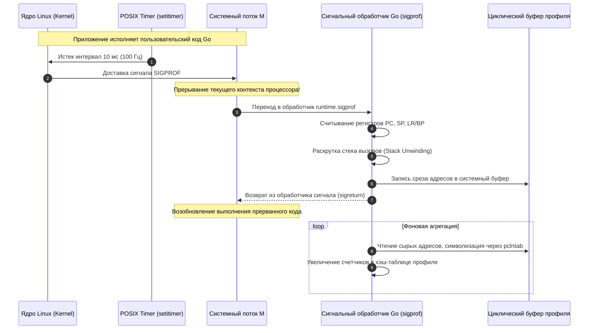
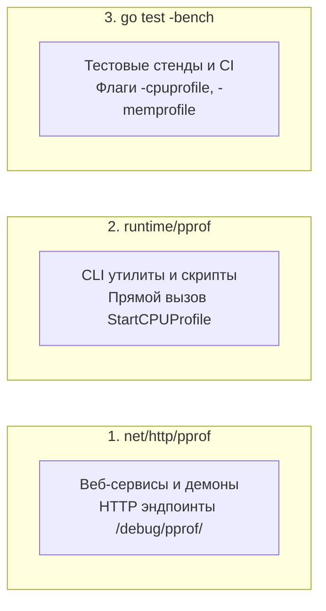
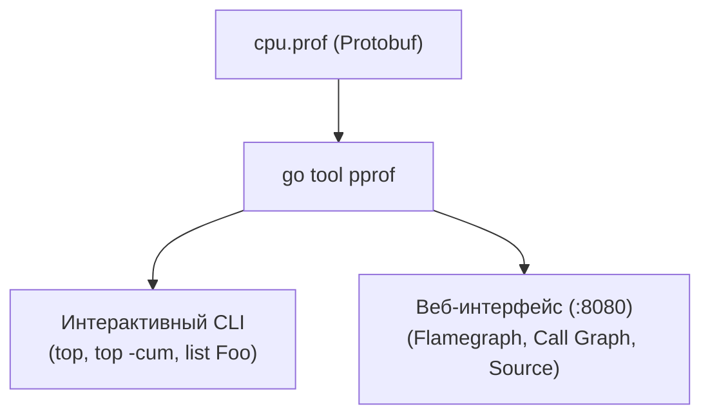

# pprof: введение в профилирование и анатомия сэмплирования

> *«Можно увидеть очень многое, если просто внимательно смотреть».*    
> — Йоги Берра  
> 
> *«Диагностика без измерений — это гадание на кофейной гуще. Измерения без профилирования — это слепота».*    
> — Инженерный афоризм Bell Labs

Представьте, что врач пытается диагностировать сложнейшее заболевание, имея на руках лишь один-единственный прибор — наручные часы. Он замеряет пульс пациента: 90 ударов в минуту. Слишком быстро? Возможно. Но что именно вызвало тахикардию — пробежка по лестнице, кофеин, волнение или порок сердца? По одним часам определить это невозможно. Требуется электрокардиограмма, рентген или магнитно-резонансный томограф (МРТ).

В разработке высоконагруженных бэкендов секундомером служат бенчмарки. В подразделе «Benchmarking» мы научились филигранно измерять время: писать надежные тесты ([[2. Benchmarking в Go]]), стабилизировать разброс показателей ([[6. Стабилизация результатов]]), снимать профили прямо во время тестов ([[7. Профилирование внутри benchmark]]) и математически сравнивать версии через `benchstat` ([[8. Сравнение версий кода]]). Но бенчмарк выдает лишь сухие числа `ns/op`. Он констатирует: «стало медленнее на 40%». Но *почему* стало медленнее? Какие строки кода жгут процессор? Где память утекает в кучу? На каких каналах или мьютексах засыпают горутины?

Главным диагностическим томографом в экосистеме Go является **pprof** — встроенный непосредственно в рантайм мощнейший фреймворк профилирования. Он позволяет заглянуть в самые сокровенные глубины исполняемого процесса без остановки сервиса и без использования тяжелых внешних отладчиков. В этой вводной лекции мы разберем архитектуру `pprof`, поймем, как операционная система Linux доставляет сигналы профилирования, какие бывают типы профилей и как правильно подготовить сервис к хирургически точной диагностике.

---

## Что такое pprof и зачем он нужен

Исторически инструмент `pprof` родился внутри Google как часть библиотеки `gperftools` (Google Performance Tools) для анализа программ на C++. При создании Go инженеры Роб Пайк и Кен Томпсон заложили профилировщик прямо в ДНК языка: подсистема сбора метрик интегрирована непосредственно в рантайм Go (`runtime/pprof`).

`pprof` отвечает на ключевые вопросы оптимизации:
- **CPU:** В каких функциях и на каких конкретно инструкциях процессор проводит львиную долю тактов?
- **Память (Heap):** Кто выделяет гигабайты объектов в куче и провоцирует панические срабатывания Garbage Collector?
- **Блокировки (Block/Mutex):** Где горутины теряют время в очередях к мьютексам и системным вызовам?
- **Горутины (Goroutines):** Сколько горутин живо прямо сейчас и почему тысячи из них зависли в состоянии вечного ожидания?

Эта лекция открывает фундаментальный подраздел **«03. CPU profiling»**. Здесь мы исследуем общую архитектуру `pprof` и механику сэмплирования, а в последующих статьях досконально изучим прикладные техники: [[2. CPU profiling в Go]], чтение огненных графиков [[3. Flamegraph]], анализ горячих точек [[4. Top functions анализ]], влияние инлайнинга [[5. Inline и влияние на performance]], предсказание переходов [[6. Branch prediction и код]], векторизацию [[7. SIMD и Go]] и дружественность к кэшу процессора [[8. Cache friendliness]].

---

## Архитектура pprof: сэмплирование и инструментирование

Фреймворк `pprof` сочетает в себе две принципиально разные парадигмы наблюдения:

```mermaid
flowchart TD
    subgraph TargetApp["Работающее Go-приложение (Runtime)"]
        RT_M["Потоки ОС (M) и горутины (G)"]
        RT_Alloc["Аллокатор памяти (mcache / mcentral)"]
        RT_Sync["Примитивы синхронизации (sync.Mutex, каналы)"]
    end

    subgraph SamplingEngine["1. Механизм сэмплирования (CPU)"]
        Timer["Ядро Linux: setitimer(ITIMER_PROF)"] -->|Сигнал SIGPROF 100 Гц| SigHandler["Обработчик sigprof в рантайме"]
        SigHandler -->|Срез регистров PC, SP, BP| StackTrace["Снятие стека без остановки мира"]
    end

    subgraph InstrumentationEngine["2. Механизм инструментирования (Event Tracing)"]
        RT_Alloc -->|Каждые 512 КБ (MemProfileRate)| HeapHook["Хук аллокатора runtime.mallocgc"]
        RT_Sync -->|Блокировки > BlockProfileRate| SyncHook["Хуки семафоров и мьютексов"]
    end

    TargetApp --> SamplingEngine
    TargetApp --> InstrumentationEngine

    StackTrace --> HashAgg["Хэш-таблица агрегации стеков вызовов"]
    HeapHook --> ProfileProto["Генератор формата profile.proto (Gzip Protobuf)"]
    SyncHook --> ProfileProto
    HashAgg --> ProfileProto

    ProfileProto --> Analyzer["go tool pprof<br>(Web UI, Flamegraph, CLI, Graphviz)"]
```

### 1. Сэмплирование (Sampling) — для CPU
Если бы рантайм перехватывал и замерял длительность абсолютно каждого вызова функции, программа замедлилась бы в 10–50 раз (так называемый трассировочный оверхед). Поэтому для CPU используется **сэмплирующий подход**:
- Рантайм не следит за каждой функцией непрерывно.
- Вместо этого через равные промежутки времени (по умолчанию **100 раз в секунду**, 100 Гц) операционная система принудительно «фотографирует» текущее состояние процессора.
- По тысячам моментальных снимков строится статистически достоверная картина: если функция находилась под прицелом в 40% снимков, значит, она потребила около 40% процессорного времени.

### 2. Инструментирование (Instrumentation) — для памяти, блокировок и горутин
Для остальных ресурсов дискретное сэмплирование неприменимо:
- **Куча (Heap):** Рантайм Go внедряет точки учета прямо в аллокатор `runtime.mallocgc`. Учет ведется по псевдослучайному экспоненциальному закону (в среднем 1 сэмпл на каждые 512 КБ выделенной памяти), что обеспечивает ничтожный оверхед (<1%).
- **Блокировки (Block / Mutex):** Точки замера встроены в вызовы `sync.Mutex.Lock`, каналы и планировщик. Рантайм фиксирует точную длительность ожидания разблокировки.
- **Горутины:** Мгновенный обход глобального списка `allgs` на момент запроса.

---

## Виды профилей в pprof

Пакет стандартной библиотеки `runtime/pprof` и его веб-обвязка `net/http/pprof` предоставляют исчерпывающий спектр профилей. Каждый из них отвечает на строго определенный вопрос:

| Профиль | Диагностический вопрос | Механизм сбора | Ключевая статья в энциклопедии |
|---|---|:---:|---|
| **CPU** | На какие инструкции и функции процессор тратит такты? | Сэмплирование (SIGPROF 100 Гц) | [[2. CPU profiling в Go]] |
| **Heap (`inuse_space`)** | Сколько оперативной памяти реально удерживается в куче прямо сейчас? | Инструментирование аллокатора | [[5. pprof memory profile]] |
| **Heap (`alloc_space`)** | Где суммарно выделялась память за все время жизни (нагрузка на GC)? | Накопительный счетчик аллокаций | [[4. Allocation profiling]] |
| **Goroutine** | Какие горутины активны, сколько их и где они заблокированы? | Снимок планировщика рантайма | [[4. goroutine dump]] |
| **Block** | Сколько времени горутины провели во сне на каналах, мьютексах и syscall? | Трассировка времени ожидания | [[5. block profile]] |
| **Mutex** | На каких именно мьютексах возникает жесткая конкуренция (contention)? | Трассировка столкновения локов | [[6. mutex profile]] |
| **Threadcreate** | В каких участках кода создаются новые системные потоки ОС (`M`)? | Инструментирование `clone`/`pthread` | Раздел «Runtime и инструменты» |

> [!IMPORTANT]
> Профили строго ортогональны!  
> Если сервис висит с 0% CPU, бессмысленно снимать профиль процессора — он будет пуст. В этом случае проблему вскроют профили **Block** или **Goroutine**. Напротив, при 100% утилизации одного ядра профиль блокировок ничего не покажет — здесь нужен **CPU-профиль**.

---

## Как работает сэмплирующий CPU-профайлер

Механика процессорного профилирования в Go — выдающийся образец системной инженерии. Она опирается на возможности ядра Linux и низкоуровневые POSIX-сигналы.



### Пошаговый алгоритм работы:

1. **Инициализация:**  
   При старте профилирования (вызовом `pprof.StartCPUProfile(w)`) рантайм настраивает системный интервальный таймер вызовом `setitimer(ITIMER_PROF)` (в современных ядрах Linux через `timer_create`). Частота по умолчанию устанавливается в **100 Гц** (`runtime.SetCPUProfileRate(100)`), то есть одно прерывание каждые 10 миллисекунд.
2. **Генерация сигнала SIGPROF:**  
   Ядро Linux ведет независимый учет процессорного времени, потраченного процессом как в пространстве пользователя (User Mode), так и в ядре от имени процесса (System Mode). Каждые 10 мс ядро отправляет процессу сигнал `SIGPROF`.
3. **Перехват и регистрация:**  
   Сигнал прерывает поток ОС (`M`). Управление передается низкоуровневому обработчику `runtime.sighandler` / `sigprof`. Обработчик извлекает значения аппаратных регистров:
   - `PC` (Program Counter) — адрес текущей выполняемой машинной инструкции.
   - `SP` (Stack Pointer) — вершина текущего стека.
   - `BP` / `LR` (Base Pointer / Link Register) — указатель кадра.
4. **Быстрая раскрутка стека (Stack Unwinding):**  
   Обработчик быстро «пробегает» по кадрам стека прерванной горутины, не выделяя памяти в куче (любая аллокация внутри обработчика сигнала привела бы к взаимной блокировке deadlock!). Цепочка адресов инструкций записывается в предварительно выделенный кольцевой буфер.
5. **Символизация и агрегация:**  
   Специальная системная горутина профилировщика читает буфер, разрешает физические адреса в имена пакетов, функций и номера строк с помощью встроенной таблицы `pclntab` (PC-Line Table) и складывает результаты в итоговую хэш-таблицу.
6. **Финализация:**  
   При вызове `pprof.StopCPUProfile()` таймер отключается, а накопленная хэш-таблица упаковывается в сжатый поток **Gzip Protobuf** и сохраняется в предоставленный `io.Writer`.

> [!info] Под капотом: Особенности доставки сигналов в Linux
> В стандарте POSIX сигнал `SIGPROF` по умолчанию доставляется процессу в целом, и ядро Linux выбирает любой произвольный поток `M`, у которого данный сигнал не заблокирован в маске сигналов (`sigprocmask`). Рантайм Go блокирует `SIGPROF` для потоков, занятых сетевым поллингом или системными вызовами ядра, гарантируя, что сэмплы снимаются преимущественно с активных потоков, исполняющих Go-код. Низкоуровневая логика сигналов реализована в исходных файлах рантайма `runtime/signal_unix.go` и `runtime/os_linux.go` (ранее `runtime/os_linux.c`).

Частота 100 Гц выбрана инженерами Bell Labs и Google как идеальный компромисс: она обеспечивает погрешность менее 1–2% при типичном времени снятия профиля в 30 секунд, создавая накладные расходы не более 1–3% CPU. При необходимости частоту можно изменить через `runtime.SetCPUProfileRate(hz)`, но значения выше 1000 Гц могут заметно замедлить программу.

---

## Погрешность сэмплирующего профайлера

Сэмплирование по определению является статистическим методом приближения. Понимание его ограничений отделяет Junior-разработчика от опытного инженера:

1. **Статистическая репрезентативность (Объем выборки):**  
   Если вы снимете CPU-профиль длительностью всего 1 секунду, профилировщик успеет собрать лишь около 100 сэмплов. В такую выборку легко может попасть случайная фаза фонового сканирования GC или вызов `runtime.memmove`, создав ложную иллюзию катастрофы.  
   *Правило:* Достоверный профиль снимается не менее **10–30 секунд** (от 1 000 до 3 000 сэмплов).
2. **Систематическая ошибка (Зоны слепоты):**  
   `SIGPROF` не фиксирует время, проведенное потоком в блокирующих системных вызовах ядра (чтение из сокета, запись на диск в `read`/`write`), если поток находится в состоянии сна. Если сервис «тормозит», ожидая ответа базы данных, CPU-профиль покажет почти 100% idle. Для анализа таких задержек предназначен Execution Tracer или блокировочный профиль.
3. **Смещение выжившего (Survivorship Bias):**  
   Сверхбыстрые функции, исполняющиеся за 2–5 наносекунд (например, простые геттеры или побитовые сдвиги), могут вообще не попасть ни в один из 100 сэмплов в секунду. Но это не ошибка — если функция работает наносекунды, она и не может быть причиной узкого места процессора!
4. **Слияние путей вызовов (Stack Merging):**  
   При глубокой рекурсии или полиморфных вызовах интерфейсов хэш-таблица агрегации может объединять разные логические ветви в один физический узел графа.

> [!tip] Собеседование
> **Вопрос:** Почему при профилировании веб-сервиса в течение 1 секунды функция `runtime.memmove` заняла 50% времени, а при повторном 30-секундном замере ее доля составила всего 3%?
> 
> **Ответ кандидата уровня Senior:**  
> Односекундный замер страдает от крайней статистической недостаточности (всего ~100 сэмплов на ядро). В этот короткий интервал случайно попало расширение крупного внутреннего слайса или фаза эвакуации бакетов при росте `map`. На короткой дистанции этот локальный всплеск занял половину всех сэмплов.  
> 30-секундный профиль собрал более 3 000 сэмплов, усреднив разовые всплески на фоне непрерывной бизнес-логики сервиса. Результат 3% на длинной дистанции является истинным показателем, а 50% на одной секунде — классический статистический артефакт малых выборок.

---

## Способы получения профиля

В Go существует три канонических способа снятия профилей:



### 1. HTTP-эндпоинт `net/http/pprof`

Стандартный, общепринятый способ для микросервисов и фоновых демонов. Достаточно импортировать анонимный пакет:

```go
package main

import (
    "log"
    "net/http"
    _ "net/http/pprof" // Регистрирует обработчики на http.DefaultServeMux
)

func main() {
    // Рекомендуется запускать pprof на отдельном внутреннем порту!
    go func() {
        log.Println(http.ListenAndServe("localhost:6060", nil))
    }()

    // Основная бизнес-логика сервиса...
    select {}
}
```

Анонимный импорт `_ "net/http/pprof"` автоматически монтирует следующие маршруты:
- `http://localhost:6060/debug/pprof/` — веб-индекс всех доступных профилей.
- `http://localhost:6060/debug/pprof/profile?seconds=30` — запуск сбора CPU-профиля на 30 секунд (дефолт 30 с).
- `http://localhost:6060/debug/pprof/heap` — моментальный снимок памяти кучи.
- `http://localhost:6060/debug/pprof/goroutine?debug=1` — текстовый дамп всех горутин со стеками.
- `http://localhost:6060/debug/pprof/block` — накопительный профиль блокировок.
- `http://localhost:6060/debug/pprof/mutex` — профиль конкуренции за мьютексы.

Скачивание профиля из терминала:
```bash
# Снять 10-секундный CPU-профиль с работающего сервиса
curl -o cpu.prof "http://localhost:6060/debug/pprof/profile?seconds=10"
```

### 2. Прямой вызов `runtime/pprof`

Идеально подходит для консольных CLI-утилит, пакетных обработчиков данных или миграторов БД, где нет HTTP-сервера:

```go
package main

import (
    "os"
    "runtime/pprof"
)

func main() {
    f, err := os.Create("cpu.prof")
    if err != nil {
        panic(err)
    }
    defer f.Close()

    // Включаем сбор сигналов SIGPROF
    if err := pprof.StartCPUProfile(f); err != nil {
        panic(err)
    }
    defer pprof.StopCPUProfile() // Гарантирует сброс буферов на диск при выходе

    // Выполняем тяжелые вычисления...
}
```

### 3. Через тестовый фреймворк `go test -bench`

Как мы подробно изучили в [[7. Профилирование внутри benchmark]], флаги `-cpuprofile`, `-memprofile`, `-blockprofile` и `-mutexprofile` позволяют снять профиль изолированной функции на финальном прогоне бенчмарка:

```bash
go test -bench=BenchmarkProcess -cpuprofile=cpu.prof
```

---

## Анализ профиля: `go tool pprof`

Снятый файл профиля (например, `cpu.prof`) представляет собой бинарный protobuf-документ. Для его исследования используется штатная утилита Go-инструментария: `go tool pprof`.

### 1. Интерактивный консольный режим (CLI)

```bash
go tool pprof cpu.prof
```

При входе открывается интерактивный шелл:
- `top`: Показывает функции с наивысшим собственным потреблением CPU (`flat`).
- `top -cum`: Сортировка по кумулятивному времени (`cum`) с учетом всех дочерних вызовов.
- `list functionName` (или `list <FunctionName>`): **Самая мощная команда CLI!** Выводит исходный код функции построчно с точным указанием времени на каждой строке.
- `web`: Генерирует SVG-диаграмму графа вызовов и открывает ее в системном браузере (требует установленного пакета Graphviz).
- `weblist functionName` (или `weblist <FunctionName>`): Открывает HTML-страницу с сопоставлением исходного кода и ассемблерных инструкций.
- `pdf`: Экспортирует граф вызовов в PDF-документ для отчетов.

### 2. Веб-интерфейс с Flamegraph

Современный стандарт анализа — запуск встроенного HTTP-сервера визуализации:

```bash
go tool pprof -http=:8080 cpu.prof
```

Утилита запустит локальный веб-сервер и откроет браузер на порту `8080`, предоставляя:
1. **Flamegraph ([[3. Flamegraph]]):** Интерактивная огненная диаграмма, где ширина прямоугольника строго пропорциональна времени выполнения функции.
2. **Graph (Граф вызовов):** Направленный граф с цветовой индикацией тяжелых путей.
3. **Top (Табличный вид):** Сортируемая таблица функций.
4. **Source:** Построчный просмотр исходников с тепловой подсветкой.



### Пример сессии

В терминальной сессии команда `top` выводит структурированную таблицу распределения времени:

```
(pprof) top
Showing nodes accounting for 1.80s, 90% of 2.00s total
Dropped 15 nodes (cum <= 0.01s)
      flat  flat%   sum%        cum   cum%
     0.50s 25.00% 25.00%      0.80s 40.00%  runtime.mallocgc
     0.30s 15.00% 40.00%      0.30s 15.00%  runtime.memmove
     0.20s 10.00% 50.00%      0.20s 10.00%  encoding/json.unmarshalString
     ...
```

- **`flat` (Собственное время):** Время, проведенное процессором непосредственно внутри машинных инструкций данной функции (за вычетом времени выполнения дочерних вызовов).
- **`cum` (Кумулятивное время):** Совокупное время, проведенное в данной функции и всех вызванных ею подфункциях вниз по дереву стека.

**Практический вывод:**  
Если у функции `flat` равен 0.05s, а `cum` равен 1.50s — сама функция является легким диспетчером, делегирующим работу потомкам.  
Если же у функции `flat` равен 1.20s и `cum` равен 1.20s — это тяжелый вычислительный узел («листовая функция»), оптимизация алгоритма которой принесет максимальный дивиденд.

---

## Mechanical Sympathy: влияние профилирования на производительность

Профилирование не дается даром. С точки зрения физики процессора и ядра ОС:
1. **Прерывание конвейера CPU:**  
   Каждый сигнал `SIGPROF` заставляет ядро сохранить контекст пользовательского потока, сбросить конвейер инструкций и выполнить переход в обработчик сигналов. Это стоит сотни процессорных тактов и локально загрязняет кэш инструкций **L1I**.
2. **Влияние на кэши данных (Cache Pollution):**  
   Запись стека в кольцевой буфер профилировщика обращается к системным структурам памяти, вытесняя пользовательские данные из кэша **L1D**.
3. **Хуки памяти и сборщик мусора:**  
   Снятие моментального снимка кучи (`heap profile`) для точного учета живых объектов инициирует немедленный принудительный вызов `runtime.GC()`. Если в production-сервисе с кучей в 30 ГБ вызвать профиль heap под пиковым трафиком, принудительный STW и concurrent sweep могут вызвать кратковременный всплеск задержек (Latency Spike) на 50–100 мс!

> [!WARNING] Ловушка безопасности (Security Gotcha) в Production
> Открытие порта pprof наружу (`http.ListenAndServe("0.0.0.0:6060", nil)`) — **критическая уязвимость безопасности**:
> 1. Злоумышленник может снять профиль `goroutine?debug=2` и получить полные дампы стеков со значениями аргументов функций (включая токены авторизации, API-ключи и персональные данные пользователей).
> 2. Скачивание `heap` профиля содержит сырые дампы памяти кучи.
> 3. Постоянные запросы тяжелых профилей создают DoS-атаку на CPU и память.  
> **Правило безопасности:** Слушайте pprof **только на `localhost` (127.0.0.1)** или внутри изолированной внутренней сети управления (Management Pod / VPN), закрытой mTLS и авторизацией.

---

## Связь профилей с разделами энциклопедии

Инструмент `pprof` связывает воедино всю архитектуру нашей базы знаний:

```mermaid
flowchart TD
    PProf["Экосистема pprof"]
    
    PProf --> CPU["CPU Profiling"]
    CPU --> L2["[[2. CPU profiling в Go]]"]
    CPU --> L3["[[3. Flamegraph]]"]
    CPU --> L4["[[4. Top functions анализ]]"]
    CPU --> L5["[[5. Inline и влияние на performance]]"]
    CPU --> L6["[[6. Branch prediction и код]]"]
    CPU --> L7["[[7. SIMD и Go]]"]
    CPU --> L8["[[8. Cache friendliness]]"]

    PProf --> Mem["Memory Profiling"]
    Mem --> M2["[[2. Heap vs stack]]"]
    Mem --> M3["[[3. Escape analysis]]"]
    Mem --> M4["[[4. Allocation profiling]]"]
    Mem --> M5["[[5. pprof memory profile]]"]
    Mem --> M6["[[6. Утечки памяти]]"]
    Mem --> M7["[[7. Fragmentation]]"]

    PProf --> Sync["Concurrency & Lock Profiling"]
    Sync --> S5["[[5. block profile]]"]
    Sync --> S6["[[6. mutex profile]]"]
    Sync --> S7["[[7. Contention и lock profiling]]"]
    Sync --> S8["[[8. False sharing]]"]
```



---

## Итог

1. **`pprof` — встроенный в рантайм Go томограф:** Он переводит инженерию производительности из плоскости слепых догадок в доказательную медицину.
2. **Гибридная архитектура:** Сэмплирование CPU по сигналам `SIGPROF` с частотой 100 Гц дает минимальный оверхед (1–3%), а точечное инструментирование памяти и блокировок фиксирует точные события распределения ресурсов.
3. **Ортогональность профилей:** CPU — для горячих вычислений, Heap — для давления на GC, Block и Mutex — для Off-CPU задержек и очередей синхронизации.
4. **Статистическая надежность:** Снимайте профили не менее 10–30 секунд, чтобы исключить искажения от малых выборок.
5. **Безопасность прежде всего:** Никогда не выставляйте эндпоинты `net/http/pprof` на публичный интерфейс `0.0.0.0`.

В следующей лекции [[2. CPU profiling в Go]] мы перейдем от теории к детальной практике: пошагово разберем снятие процессорных профилей, научимся фильтровать шум стандартной библиотеки и находить скрытые бутылочные горлышки в алгоритмах.