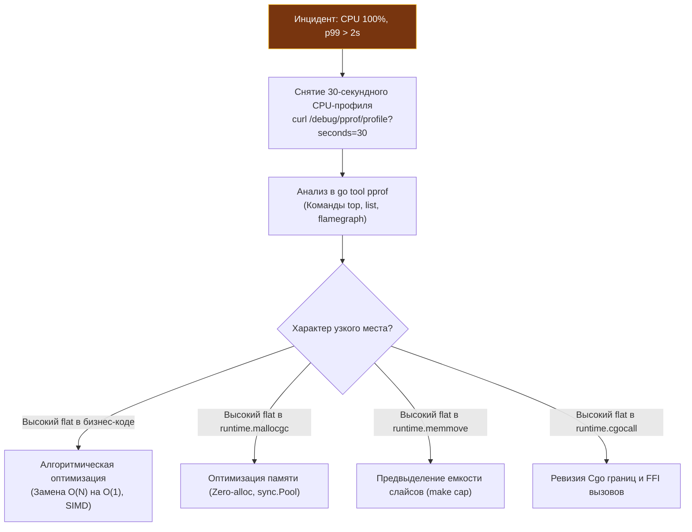
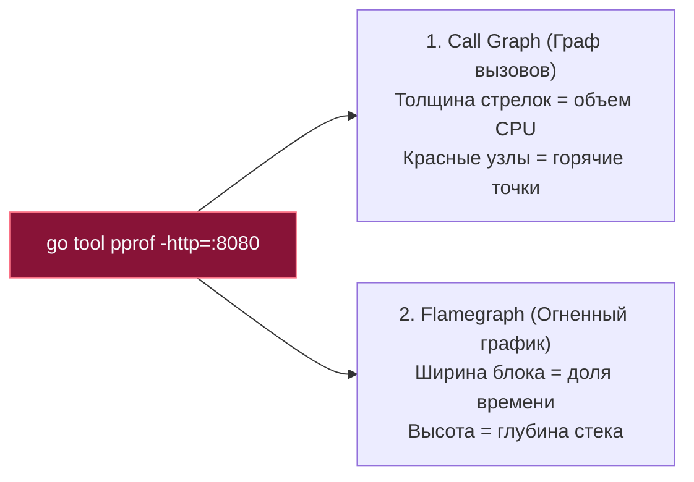
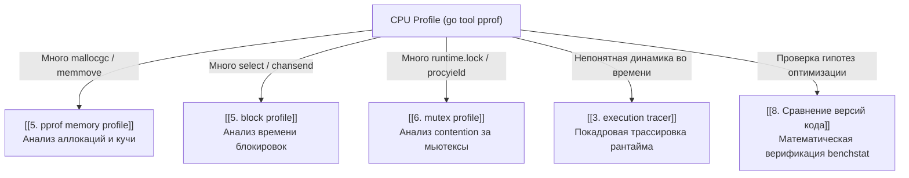

# CPU profiling в Go: анатомия горячих точек и анализ тактов

> *«Каждый знает, что отладка программы вдвое сложнее ее написания. Поэтому, если при написании кода вы выложились на пределе своего ума, как же вы собираетесь его отлаживать?».*    
> — Брайан Керниган  
> 
> *«Стопроцентная загрузка процессора — еще не достижение; это либо гениальная математика, либо постыдный спинлок».*    
> — Инженерный фольклор

Представьте приборную панель автомобиля: стрелка тахометра уперлась в красную зону на 7000 оборотах в минуту, рев мотора оглушает, бензин улетает ведрами, но машина еле ползет со скоростью 20 км/ч. Что происходит? Двигатель работает на пределе возможностей, но сцепление пробуксовывает: энергия сгорания топлива не доходит до колес, рассеиваясь в бесполезное трение и дым.

В серверном бэкенде 100% утилизация CPU выглядит точно так же. Все ядра процессора раскалены до предела, кулеры серверной стойки воют на максимальных оборотах, а метрики задержки p99 улетают в космос. Загрузить процессор на 100% — дело нехитрое; задача Senior-инженера — понять, **на что именно расходуются эти миллиарды тактов в секунду**. Сжигаются ли они на реальную полезную бизнес-логику, либо тонут в бесконечных аллокациях памяти, вымывании кэшей L1/L2, пробуксовке атомарных спинлоков или слепом перекопировании слайсов?

В [[1. pprof. Введение]] мы познакомились с фреймворком `pprof` и фундаментальной механикой сэмплирования по сигналам `SIGPROF`. В этой лекции мы с головой погружаемся в прикладной **CPU profiling**: научимся виртуозно владеть консольным анализатором `top` и построчным декомпилятором `list`, разберем фундаментальную разницу между собственным (`flat`) и кумулятивным (`cum`) временем, каталогизируем типичные процессорные ловушки Go-рантайма и научимся связывать стек вызовов с кремниевой микроархитектурой машины.

---

## Введение: от «медленно» к конкретной функции

В отличие от бенчмарков ([[2. Benchmarking в Go]], [[7. Профилирование внутри benchmark]]), которые замеряют абсолютное время выполнения изолированного цикла в наносекундах, CPU-профиль — это **карта плотности процессорного времени**. Он отображает относительное статистическое распределение тактов по иерархии вызовов программы.

CPU-профиль — инструмент первой линии при диагностике строго **CPU-bound задач** ([[3. CPU bound vs IO bound задачи]]):
- Тяжелые криптографические вычисления и хэширование.
- Парсинг, валидация и сериализация протоколов (JSON, Protobuf, XML).
- Сжатие данных (Gzip, ZSTD, Snappy).
- Алгоритмы фильтрации, сортировки и поиска в оперативной памяти.



---

## Получение CPU-профиля

В зависимости от среды исполнения Go предоставляет три надежных способа снятия процессорного профиля:

### 1. Через HTTP-эндпоинт `net/http/pprof`

Канонический подход для микросервисов, gRPC-бэкендов и долгоживущих демонов в Kubernetes. Достаточно подключить анонимный импорт и поднять диагностический слушатель:

```go
package main

import (
    "log"
    "net/http"
    _ "net/http/pprof" // Регистрирует /debug/pprof/ на DefaultServeMux
)

func main() {
    // ВНИМАНИЕ: Запускаем pprof на внутреннем loopback интерфейсе!
    go func() {
        log.Println(http.ListenAndServe("localhost:6060", nil))
    }()

    // Запуск боевого сервера...
}
```

Снятие 30-секундного снимка боевой нагрузки из консоли администратора:

```bash
curl -o cpu.prof "http://localhost:6060/debug/pprof/profile?seconds=30"
```

HTTP-сервер Go приостановит ответ на 30 секунд, в течение которых фоновый таймер ядра будет с частотой 100 Гц фиксировать стеки исполняемых горутин, после чего отдаст бинарный поток protobuf.  
*Критическое требование:* Во время сбора профиля сервис обязан находиться под реальной боевой или синтетической нагрузкой. Снятие профиля с простаивающего сервера покажет только ожидание сетевого поллера.

### 2. Прямой вызов `runtime/pprof`

Оптимально для пакетных скриптов, консольных CLI-утилит или юнит-тестов:

```go
package main

import (
    "os"
    "runtime/pprof"
)

func main() {
    f, err := os.Create("cpu.prof")
    if err != nil {
        panic(err)
    }
    defer f.Close()

    // Активируем интервальный таймер POSIX
    if err := pprof.StartCPUProfile(f); err != nil {
        panic(err)
    }
    defer pprof.StopCPUProfile() // Сбрасывает хэш-таблицы на диск

    // Выполнение тяжелой вычислительной работы
    expensiveComputation()
}
```

### 3. Через тестовый раннер `go test`

Для изолированных функций в рамках бенчмаркинга ([[3. go test -bench под капотом]], [[7. Профилирование внутри benchmark]]):

```bash
go test -bench=BenchmarkFoo -cpuprofile=cpu.prof
```
Фреймворк `testing` автоматически активирует сбор профиля строго на финальном стабильном прогоне `b.N`.

---

## Настройка частоты сэмплирования

По умолчанию процессорный профилировщик Go прерывает выполнение потоков с частотой **100 Гц** (100 сэмплов в секунду на каждое активное ядро, интервал 10 мс).

Частоту сэмплирования можно программно изменить через `runtime.SetCPUProfileRate(hz)` до первого вызова профилировщика:

```go
import "runtime"

func init() {
    // Изменение частоты до 500 Гц (500 сэмплов в секунду)
    runtime.SetCPUProfileRate(500)
}
```

```
+-------------------------------------------------------------------------+
|                  Спектр частоты сэмплирования pprof                     |
|                                                                         |
|  [< 50 Гц]              [100 Гц - Стандарт]             [> 1000 Гц]     |
|   Слишком грубо:         Золотая середина:               Опасно:        |
|   пропуск функций        погрешность < 2%,               overhead > 10% |
|   короче 20 мс           накладные расходы ~1%           искажение кэша |
+-------------------------------------------------------------------------+
```

Инженерные рекомендации по выбору частоты:
- **Production (100 Гц):** Стандартное значение. Обеспечивает ничтожный оверхед (0.5–1.5% CPU), абсолютно безопасно для непрерывного профилирования боевых кластеров.
- **Локальная отладка (500–1000 Гц):** Применяется при поиске микроскопических задержек в быстрых функциях.
- **Предостережение (> 1000 Гц):** Прерывания чаще 1 раза в миллисекунду создают ощутимый оверхед на сброс конвейера CPU, а сам код обработчика `sigprof` начинает вытеснять данные из кэшей L1D/L1I, искажая результаты замера.

> [!info] Под капотом: Почему CPU-профиль не содержит времени ожидания?
> Системный сигнал `SIGPROF` генерируется ядром Linux на основе интервального таймера `setitimer(ITIMER_PROF)`. В отличие от таймера реального времени `ITIMER_REAL`, таймер `ITIMER_PROF` декрементируется **только тогда, когда процесс реально исполняет инструкции на ядре CPU** (в User space или в System call).  
> Если горутина заблокирована в системном вызове ожидания сети (`epoll_wait`) или спит на примитиве синхронизации ядра (`futex`), процессор не выделяет ей кванты времени. Таймер `ITIMER_PROF` замирает, сигнал не посылается, и сэмпл не берется. Поэтому CPU-профиль Go кристально чист: в нем отсутствует шум от простаивающих потоков.

---

## Интерпретация отчёта: flat, cum, top

Запускаем интерактивный анализ полученного профиля:

```bash
go tool pprof cpu.prof
```

Команда `top` — главная отправная точка расследования:

```
(pprof) top 10
Showing nodes accounting for 4.50s, 90.00% of 5.00s total
Dropped 45 nodes (cum <= 0.02s)
      flat  flat%   sum%        cum   cum%
     1.20s 24.00% 24.00%      1.20s 24.00%  runtime.mallocgc
     0.90s 18.00% 42.00%      0.90s 18.00%  encoding/json.Unmarshal
     0.50s 10.00% 52.00%      1.70s 34.00%  mypkg.ProcessRecord
     0.40s  8.00% 60.00%      0.40s  8.00%  runtime.memmove
     ...
```

Разберем каждую колонку:
- **`flat` (Собственное время):** Время, проведенное процессором непосредственно в теле данной функции (за вычетом времени вызова любых дочерних функций).
- **`flat%`:** Доля собственного времени функции относительно общей длительности профиля.
- **`sum%`:** Накопительная сумма процентов `flat%` от первой строки до текущей.
- **`cum` (Кумулятивное время):** Совокупное время, проведенное в данной функции со всеми ее потомками вниз по дереву стека вызовов.
- **`cum%`:** Доля кумулятивного времени от общего времени профиля.

### Анатомическая модель: Генерал и Солдат

Чтобы мгновенно считывать отчет `top`, используйте простую физическую аналогию:

```
+-------------------------------------------------------------------------+
|                  Модель вызовов: Диспетчер vs Исполнитель               |
|                                                                         |
|  [Генерал: ProcessRecord]        flat = 0.05s (низкий)                  |
|          |                       cum  = 4.50s (высокий: 90% трафика)    |
|          +---> Координирует армию, сам в окопе не копает                |
|          |                                                              |
|  [Солдат: runtime.memmove]       flat = 3.80s (высокий: 76% тактов)     |
|                                  cum  = 3.80s (равен flat)              |
|                                  Листовая функция: копает траншею       |
+-------------------------------------------------------------------------+
```

1. **Высокий `cum`, низкий `flat` (Диспетчер):**  
   Функция координирует бизнес-логику (`mypkg.ProcessRecord`). Сама по себе она почти не делает вычислений, но запускает тяжелые подсистемы. Оптимизировать нужно не ее тело, а дерево ее потомков.
2. **Высокий `flat`, `cum` равен `flat` (Листовой исполнитель):**  
   Функция-терминатор (`runtime.mallocgc`, `runtime.memmove`, алгоритм хэширования). В ней сгорают реальные такты ALU. Оптимизировать нужно непосредственно ее алгоритм или устранять причины ее вызова сверху.

---

### Построчная хирургия с помощью команды `list`

Обнаружив подозрительную функцию в отчете `top`, вызовите команду `list FuncName` (например, `list ProcessRecord`):

```
(pprof) list ProcessRecord
ROUTINE ======================== mypkg.ProcessRecord in /app/record.go
     0.50s      1.70s (flat, cum) 34.00% of Total
         .          .    100:func ProcessRecord(r *Record) error {
         .      0.10s    101:    data, err := json.Marshal(r)
         .      0.80s    102:    if err != nil {
         .          .    103:        return err
         .          .    104:    }
     0.50s      0.50s    105:    return store.Save(data)
         .          .    106:}
```

Утилита `pprof` извлекает исходный код файла и сопоставляет каждую строку со счетчиками сэмплов `SIGPROF`!  
В приведенном листинге Senior-инженер сразу видит:
- Строка 101 (`json.Marshal`) потребовала 0.10s.
- Строка 102 проверки ошибок неожиданно потребовала 0.80s кумулятивного времени (скорее всего, внутри происходит дорогое форматирование трейса через `fmt.Errorf`).
- Строка 105 (`store.Save`) съела 0.50s процессора.

> [!tip] Собеседование
> **Вопрос:** Что означает, если у функции показатель `flat` практически равен показателю `cum`, и оба они составляют 35% от всего профиля CPU?
> 
> **Ответ кандидата уровня Senior:**  
> Это однозначный признак **«листовой» (leaf) функции**, выполняющей тяжелую низкоуровневую работу собственными машинными инструкциями, без делегирования в дочерние методы.  
> Типичные примеры в Go: алгоритмы сжатия, криптографические раунды AES, поиск по срезу байт или функции рантайма (`runtime.memmove`, `runtime.memclr`, `runtime.aeshashbody`). Оптимизировать такую точку нужно алгоритмически: сокращать число итераций, использовать векторизацию SIMD, либо избегать ее вызова на более высоких уровнях архитектуры.

---

## Визуализация: flamegraph и граф вызовов

Консольный отчет `top` плоский — он скрывает глубину и ветвление дерева стеков. Чтобы увидеть систему целиком, запускают веб-интерфейс:

```bash
go tool pprof -http=:8080 cpu.prof
```

В меню `View` доступны два главных режима визуализации:



1. **Call Graph (Граф вызовов):** Показывает топологию зависимостей. Узлы окрашиваются цветами от серого (холодный) к ярко-красному (критически горячий).
2. **Flamegraph ([[3. Flamegraph]]):** Самый удобный инструмент современной инженерии:
   - Ось X — 100% времени профиля.
   - Ось Y — глубина стека вызовов (снизу вверх: от функции `main` к глубоким вспомогательным методам).
   - Широкие «плато» на вершине огненных башен — это ваши главные враги: листовые функции, сжигающие CPU.

---

## Практические примеры диагностики

### Пример 1: JSON-сериализация съедает 60% CPU

Симптомы: бэкенд захлебывается при 5 000 RPS.

Отчет `top`:
```
flat  flat%   cum%        cum   cum%
0.80s 16.00% 16.00%      1.60s 32.00%  encoding/json.Marshal
0.30s  6.00% 22.00%      0.90s 18.00%  runtime.mallocgc
0.20s  4.00% 26.00%      0.20s  4.00%  runtime.memmove
```

**Инженерный диагноз:**  
Стандартный пакет `encoding/json` интенсивно использует рефлексию `reflect`, боксинг интерфейсов и непрерывно выделяет промежуточные буферы в куче (`runtime.mallocgc`) с последующим перекопированием байт (`runtime.memmove`). Проблема не в скорости CPU, а в неэффективном управлении памятью.

**Рецепт лечения:**
- Переход на кодогенерацию без рефлексии: `easyjson` или современные сверхбыстрые парсеры с поддержкой SIMD (например, `sonic` от ByteDance).
- Переиспользование структур и буферов через `sync.Pool` ([[2. sync Pool]]).

---

### Пример 2: «Пустой» цикл линейного поиска

В отчете `top` функция `mypkg.contains` держит 30% всего CPU сервера:

```
flat  flat%   cum%
1.50s 30.00% 1.50s 30.00%  mypkg.contains
```

Листинг `list contains`:
```go
func contains(items []string, target string) bool {
    for _, item := range items {
        if item == target {
            return true
        }
    }
    return false
}
```

**Инженерный диагноз:**  
Линейный поиск со сложностью $O(N)$ по срезу из 10 000 элементов в горячем цикле обработки запроса. На каждой итерации процессор производит посимвольное сравнение строк.

**Рецепт лечения:**
1. Если коллекция статична — предварительно индексировать срез в хэш-таблицу `map[string]struct{}` для получения поиска за $O(1)$.
2. Если коллекция упорядочена — применить бинарный поиск `sort.SearchStrings` за $O(\log N)$.
3. *Mechanical sympathy:* Помните, что для сверхмалых срезов ($N \le 8$) линейный скан по срезу в памяти часто работает быстрее `map` за счет локальности кэша процессора L1D ([[8. Cache friendliness]]).

---

### Пример 3: Высокое время в `runtime.cgocall`

В отчете `top` доминируют функции рантайма `runtime.cgocall` и `runtime.asmcgocall`:

```
flat  flat%   cum%
1.10s 22.00% 1.10s 22.00%  runtime.cgocall
0.45s  9.00% 0.45s  9.00%  runtime.asmcgocall
```

**Инженерный диагноз:**  
Приложение слишком часто пересекает границу Cgo (FFI вызовы к C-библиотеке, драйверу СУБД или криптографии).  
Каждый вызов Cgo стоит от 40 до 100 наносекунд: он требует вызова `runtime.entersyscall`, смены стека Go на стек операционной системы `pthread`, сохранения регистров и блокировки потока `M` ([[1. Системные вызовы и их стоимость]]).

**Рецепт лечения:**
- Батчинг: передавать в C массив из 10 000 элементов за один FFI-вызов вместо 10 000 отдельных вызовов по одному элементу.
- Переписывание критической логики на чистый Go с ассемблерными вставками.

---

## Типичные CPU-bound паттерны в Go

Каталог типичных узких мест, с которыми сталкивается бэкенд-разработчик:

```
+-------------------------------------------------------------------------+
|                    Каталог CPU-паттернов в Go                           |
+------------------------------------+------------------------------------+
| Симптом в профиле                  | Первопричина и решение             |
+------------------------------------+------------------------------------+
| runtime.mallocgc > 20%             | Скрытые аллокации (интерфейсы,     |
|                                    | замыкания). Нужен Escape Analysis. |
|                                    |                                    |
| runtime.memmove / growslice        | Непредвыделенные слайсы.           |
|                                    | Использовать make([]T, 0, cap).    |
|                                    |                                    |
| regexp.(*Regexp).doExecute         | Регулярки в цикле. Заменить на     |
|                                    | strings.Index / strings.Contains.  |
|                                    |                                    |
| runtime.mapaccess / mapassign      | Избыточные операции с map.         |
|                                    | Предвыделять размер make(map, N).  |
|                                    |                                    |
| runtime.procyield / osyield        | Busy-wait спинлоки, lock contention|
|                                    | Разрежать локи, шардировать кэш.   |
|                                    |                                    |
| strings.Builder / конкатенация     | Склейка через '+'.                 |
|                                    | Использовать strings.Builder.Grow. |
+------------------------------------+------------------------------------+
```

1. **Сериализация / десериализация:**  
   `json.Marshal/Unmarshal`, `xml.Decode`, `protobuf.Marshal`. Помимо времени парсинга, они нагружают память, что диагностируется по соседству с `runtime.mallocgc`.
2. **Регулярные выражения:**  
   Вызовы `regexp.MustCompile` внутри функций или частые `FindAll`. Движок регулярных выражений Go реализует недетерминированный конечный автомат (NFA) без обратного отката, что гарантирует защиту от ReDoS, но требует огромного числа процессорных инструкций. Для простых паттернов всегда предпочитайте функции пакета `strings` или `bytes`.
3. **Строковые операции в циклах:**  
   Конкатенация строк оператором `+` в цикле порождает квадратичное копирование памяти. В топе мгновенно возникают `runtime.memmove` и `runtime.growslice`. Решение — предвыделенный `strings.Builder` с вызовом `sb.Grow(size)`.
4. **Хеш-таблицы с плохой хеш-функцией:**  
   Доминирование `runtime.mapaccess` и `runtime.mapassign` часто указывает на постоянные коллизии бакетов либо ступенчатый рост мапы с эвакуацией элементов. Предвыделяйте размер мапы: `make(map[K]V, size)`.
5. **Синхронизация через Busy-Wait (Спинлоки):**  
   Попытки реализовать спинлок через атомарный `atomic.CompareAndSwap` (CAS) в плотном цикле `for !cas(...) {}`. Процессор сжигает 100% мощности активного ядра. В профиле это проявляется функциями `runtime.procyield` (инструкция `PAUSE` на x86) или `runtime.osyield`.
6. **Частые системные вызовы:**  
   Хотя само время ядра не входит в профиль, накладные расходы на переход `user -> kernel -> user` проявляются через `runtime.syscall` или сопутствующие вспомогательные функции рантайма. При подозрениях на ввод-вывод исследуйте блокировочный профиль ([[5. block profile]]).

---

## Mechanical Sympathy: CPU-профиль и микроархитектура

CPU-профиль отображает верхушку айсберга. Настоящее понимание происходящего требует механического сочувствия к кремнию:

1. **Кэш-промахи и задержки шины памяти:**  
   Если функция тратит массу времени на тривиальное сложение элементов в цикле, либо в топе висят `runtime.memmove` и `runtime.duffcopy` при пересылке структур — процессор находится в состоянии **CPU Stall**. Он простаивает сотни тактов в ожидании доставки кэш-линии из DRAM. Оптимизируйте раскладку памяти: переходите от структур указателей к плоским массивам (Cache-friendly структуры, [[6. Cache friendly структуры]]).
2. **Ошибки предсказателя ветвлений (Branch Mispredictions):**  
   Если код насыщен сложными каскадами `if/else`, конвейер процессора регулярно сбрасывается из-за неверного спекулятивного исполнения ([[6. Branch prediction и код]]). Косвенно такие проблемы диагностируются через утилиту Linux `perf stat -e branch-misses ./binary`.
3. **Накладные расходы вызовов и инлайнинг:**  
   Если мелкая функция вызывается миллиард раз, накладные расходы на пролог и эпилог стека могут превышать время полезной работы. Изучите отчет компилятора `go build -gcflags="-m"` и убедитесь, что компилятор выполнил инлайнинг ([[5. Inline и влияние на performance]]).

Инструментарий профилирования не всегда детализирует такие низкоуровневые эффекты, но опытный инженер, зная механику рантайма и процессора, строит гипотезы и проверяет их через ассемблерные листинги и утилиты (`perf`, `objdump`).

---

## Ошибки и ловушки при работе с CPU-профилем

> [!warning] Ловушка / Gotcha: Слепота к Off-CPU задержкам
> **Главная ментальная ловушка инженера:** Сервис отвечает с задержкой 5 секунд, разработчик снимает CPU-профиль и обнаруживает, что суммарное время всех функций за 30 секунд составило... всего 0.4 секунды!  
> Начинается паника: «Профайлер сломался! Он ничего не показывает!».  
> **Объяснение:** Сервис не загружает CPU — он **спит**! Горутины заблокированы в ожидании ответа базы данных, захвата мьютекса или чтения из сетевого сокета. Сэмплирующий CPU-профиль фиксирует только активные такты процессора. При задержках на спящих горутинах немедленно снимайте **Block Profile** или используйте **Execution Tracer**!

Другие частые ошибки:
- **Слишком короткий замер:** Профиль длительностью 3–5 секунд искажен случайными микрособытиями рантайма. Минимальный порог — **30 секунд**.
- **Профилирование без рабочей нагрузки:** Снятие профиля на тестовом стенде без входящих запросов покажет только фоновые функции рантайма: `runtime.gopark`, `netpoll`, `findrunnable`.
- **Игнорирование иерархии `flat` vs `cum`:** Попытка оптимизировать диспетчера с большим `cum`, не заглядывая в его листовые зависимости.

---

## Связь с остальными инструментами

CPU-профиль — отправная точка комплексной диагностики:



---

## Итог

1. **CPU-профиль — карта плотности процессорного времени:** Он показывает относительное распределение тактов процессора по функциям и строкам кода.
2. **Аналитический дуэт `flat` и `cum`:**
   - `flat` — собственное время функции (листовой исполнитель).
   - `cum` — кумулятивное время с потомками (архитектурный диспетчер).
3. **Хирургическая точность `list`:** Позволяет сопоставить строки исходного кода с процентом сгоревших процессорных тактов.
4. **Типовые виновники:** Сериализация без кодогенерации, непредвыделенные слайсы и мапы, Cgo переходы и псевдослучайные линейные сканы.
5. **Помните об ограничениях:** CPU-профиль слеп к задержкам ожидания ввода-вывода (Off-CPU) — при низком потреблении процессора исследуйте блокировки через `block profile` и `trace`.

В следующей лекции [[3. Flamegraph]] мы разберем главный визуальный инструмент высоконагруженной инженерии — пламенные графики Брендана Грегга, научимся одним взглядом находить узкие места в глубине 50-уровневых стеков вызовов и мгновенно локализовать архитектурные аномалии.