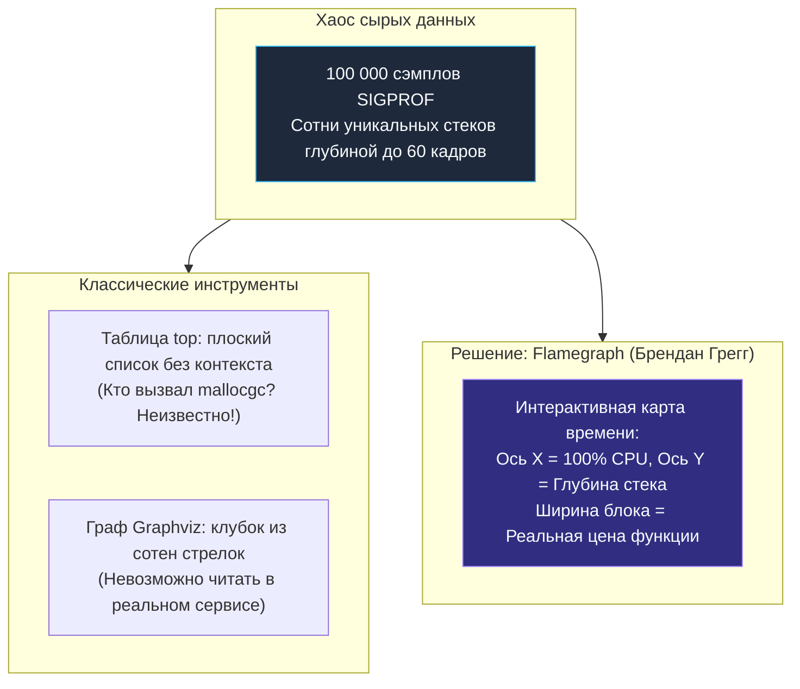
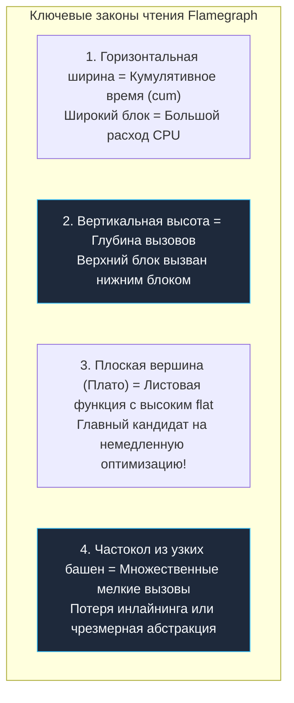
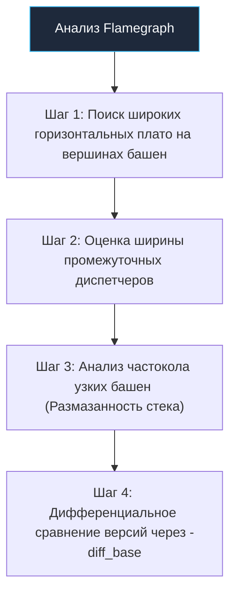
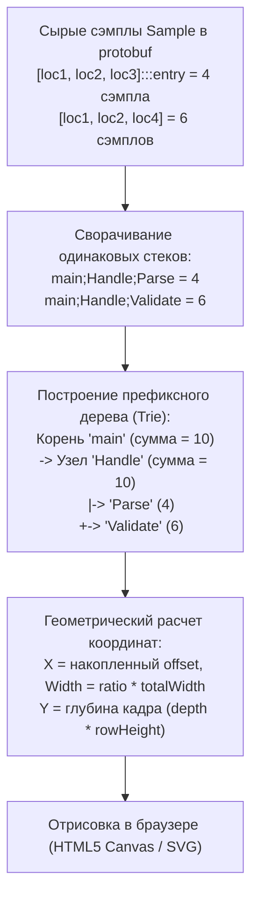
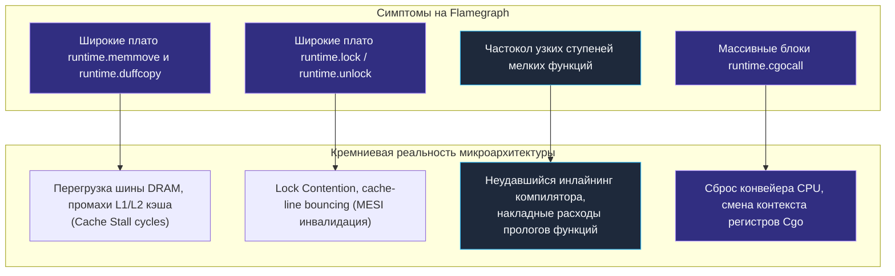
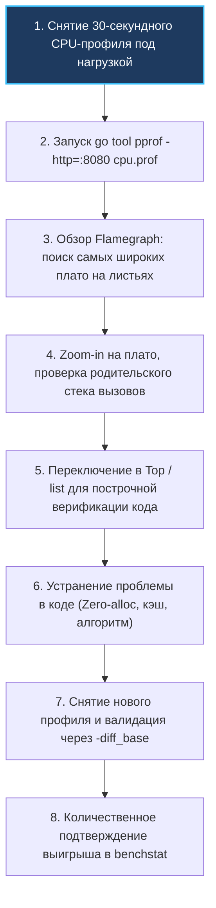

# Flamegraph: визуализация процессорного времени и чтение пламени

> *«Картина стоит тысячи слов. Флеймграф стоит тысячи стектрейсов».*    
> — Брендан Грегг  
> 
> *«Искусство профилирования заключается не в накоплении чисел, а в наглядной визуализации течения времени».*    
> — Брайан Керниган

Представьте, что вам принесли распечатку телефонной книги объемом в пятьсот страниц, где каждая строчка — это стек вызовов: функции, пакеты, шестнадцатеричные адреса и счетчики тактов. Вам нужно за пять минут найти, почему процессор тратит 40% энергии впустую. Читать такую распечатку вручную — пытка. Даже консольная таблица `top` ([[2. CPU profiling в Go]]) дает лишь плоский срез: она сообщает, что функция `runtime.mallocgc` заняла 30% времени, но наглухо скрывает, *кто именно* из сотен ваших обработчиков запросов спровоцировал этот лавинообразный шторм аллокаций.

В 2011 году выдающийся системный инженер Брендан Грегг (Brendan Gregg), расследуя загадочное падение производительности базы данных в ядре Solaris, нарисовал первый в истории **Flamegraph** (пламенный график). Это изобретение навсегда перевернуло индустрию профилирования. Вместо блуждания по бесконечным текстовым простыням стеков инженер получил интуитивную цветовую карту процессорного времени.

В Go технология Flamegraph интегрирована непосредственно в стандартный бинарник `go tool pprof`. В этой лекции мы разберем анатомию пламенных графиков, поймем, как рантайн сворачивает тысячи сэмплов в компактное дерево вызовов, научимся мгновенно вычислять виновников деградации по форме «башен» и «плато» и освоим искусство дифференциального визуального сравнения двух версий сервиса.

---

## Почему пламя — лучший друг инженера

В [[2. CPU profiling в Go]] мы освоили консольный анализ через команды `top` и `list`. Они идеальны для точечной микрохирургии, когда имя больной функции уже известно. Но табличный вывод абсолютно бессилен перед вопросами системной топологии:
- *Через какую именно цепочку промежуточных мидлварей и хендлеров вызывается эта тяжелая сериализация?*
- *Какую долю времени съедает роутер по сравнению с бизнес-логикой и обращением к БД?*
- *Почему простая валидация входных данных раздулась в бесконечный стек вспомогательных абстракций?*



Flamegraph превращает абстрактные миллисекунды в геометрические пропорции. Одного взгляда на экран достаточно, чтобы локализовать узкое место: если вершина одной из башен срезана широким горизонтальным плато — перед вами главный виновник инцидента.

Эта статья служит визуальным мостом между сухими цифрами профилировщика и низкоуровневыми оптимизациями компилятора: механикой инлайнинга ([[5. Inline и влияние на performance]]), предсказанием переходов процессора ([[6. Branch prediction и код]]) и локальностью данных в кэше L1/L2/L3 ([[8. Cache friendliness]]).

---

## Как устроен flamegraph

Flamegraph — это интерактивная двумерная диаграмма иерархии стеков вызовов:

```
+-------------------------------------------------------------------------+
|                       Анатомия Flamegraph                               |
|                                                                         |
|  Листовой уровень:      [ runtime.mallocgc (25%) ]  [ regexp.Find (15%) ]|
|                                     |                         |         |
|  Промежуточный:         [  json.Unmarshal (35%)  ]  [ Validate (20%) ]  |
|                                     \                         /         |
|  Диспетчер:             [          ProcessRequest (70%)              ]  |
|                                               |                         |
|  Корень (Root):         [                 main (100%)                ]  |
|                         +-----------------------------------------------+
|                         | <--------------- Ось X: Время ---------------> |
+-------------------------------------------------------------------------+
```

### Главные координаты и правила чтения:
1. **Ось Y (Глубина стека):**  
   Отображает иерархию вызовов снизу вверх. В самом низу располагается корень исполнения (`main` или точка входа горутины `runtime.goexit.mcall`). Каждый следующий этаж — это дочерняя функция, вызванная функцией с нижнего этажа. Чем выше башня, тем глубже стек вызовов.
2. **Ось X (Время / Доля CPU):**  
   Ось X **НЕ является временной шкалой слева направо!** Время выполнения функций отсортировано не в хронологическом порядке, а **алфавитно** для объединения одинаковых путей.  
   **Ширина каждого прямоугольника строго пропорциональна кумулятивному времени (`cum`)**, проведенному в данной функции и всех ее потомках.  
   Если функция `main` занимает 100% ширины основания, а функция `ProcessRequest` — 70%, значит, 70% всех процессорных тактов ушли в эту ветку.
3. **Цветовая палитра:**  
   По умолчанию в `pprof` цвета выбираются из теплой гаммы (желтый, оранжевый, красный) с псевдослучайным хэшированием по имени пакета. Это сделано намеренно, чтобы соседние блоки визуально контрастировали между собой. В некоторых темах холодные цвета (зеленый/синий) резервируются для системных пакетов рантайма Go.



---

## Создание flamegraph в Go

### Способ 1: Штатный веб-интерфейс `go tool pprof` (Рекомендуемый)

Начиная с Go 1.11+, визуализатор Flamegraph встроен непосредственно в инструментарий Go и не требует установки Perl, Node.js или Graphviz:

```bash
# Запуск локального веб-сервера визуализации
go tool pprof -http=:8080 cpu.prof
```

Браузер автоматически откроет дашборд. В верхнем навигационном меню выберите пункт:  
`View` → **`Flame Graph`**.

**Возможности интерактивного UI:**
- **Zoom-in (Приближение):** Кликните левой кнопкой мыши по любому прямоугольнику — график мгновенно перестроится, сделав выбранную функцию новым 100% основанием. Это позволяет исследовать даже крошечные ветки с долей 0.5%.
- **Сброс масштаба:** Кликните по корневой строке `Reset Zoom` в самом верху графа.
- **Поиск (Search / Regex):** Нажмите комбинацию `Ctrl+F` (или кликните по иконке поиска в углу) и введите регулярное выражение (например, `json|sql`). Все совпавшие прямоугольники подсветятся контрастным фиолетовым цветом, а в углу отобразится суммарная доля найденных функций во всем профиле.

### Способ 2: Генерация автономного SVG через скрипты Брендана Грегга

Если вам требуется сформировать легковесный векторный SVG-файл для вставки в технический отчет или документацию в Git, используется связка оригинальных утилит:

```bash
# 1. Сброс сырых данных профиля через флаг -raw
go tool pprof -raw cpu.prof | stackcollapse-go.pl | flamegraph.pl > flame.svg
```
Полученный `flame.svg` открывается в любом браузере, сохраняя интерактивность (всплывающие подсказки и зум через встроенный JavaScript).

### Способ 3: Экспорт данных Flamegraph в файл и команда `web` (Go 1.17+)

Непосредственно в консоли `pprof` вызов команды `web` открывает традиционный граф вызовов Graphviz. А для экспорта данных Flamegraph в файл для передачи внешним сервисам мониторинга используется:
```bash
go tool pprof -flamegraph flame.out cpu.prof
```
Файл `flame.out` содержит сериализованное дерево, готовое для рендеринга.

---

## Чтение flamegraph: от цвета к проблеме

Умение читать Flamegraph — это навык визуального распознавания патологий в коде:



### Шаг 1: Найти широкую полосу в верхней части (Плато)
Если на самом верхнем уровне башни (над блоком нет дочерних прямоугольников) лежит широкий плоский прямоугольник — это функция с **колоссальным значением `flat`**. Она лично выполняет вычисления, сжигая кванты времени.
- Если это ваш код (например, `ComputeHash` или `FilterData`) — узкое место найдено, требуется алгоритмическая оптимизация.
- Если это системная функция `runtime.mallocgc` — процессор задыхается в аллокациях памяти. Проследите по стеку **вниз от плато**, чтобы найти, какой метод вашего сервиса инициирует выделение объектов (например, `json.Unmarshal` или `strings.Builder`).

### Шаг 2: Оценить «стоимость» диспетчеров
Часто функция `ProcessOrder` сама по себе занимает лишь 2% времени, но под ней висит огромный блок шириной 60%. Внимательно изучите распределение дочерних блоков:
- Если 40% ширины уходит в `json.Unmarshal`, а 20% — в `db.Query`, оптимизировать внутренности `ProcessOrder` бессмысленно: нужно менять JSON-сериализатор или кэшировать запросы к БД.

### Шаг 3: Анализировать «размазанность» стека
Если вместо выраженных башен вы видите «зубчатую стену» из сотен тонких иголочек одинаковой высоты — это признак **чрезмерного распыления ресурсов**:
- Бесконечные цепочки мидлварей, декораторов, валидаторов и интерцепторов, каждый из которых съедает по 0.5% CPU.
- Массовые интерфейсные вызовы, препятствующие инлайнингу компилятора.

### Шаг 4: Сравнить два профиля (Differential Flamegraph)
С помощью утилиты `pprof -diff_base` ([[8. Сравнение версий кода]]) можно вычесть эталонный базовый профиль из оптимизированного:

```bash
go tool pprof -http=:8080 -diff_base=cpu_base.prof cpu_optimized.prof
```

Flamegraph окрасится в контрастные цвета:
- 🔴 **Красные полосы:** Функции, где время выполнения **выросло** (регрессия).
- 🟢 **Зеленые полосы:** Функции, где процессорные такты удалось **сэкономить** (успешная оптимизация).

---

## Под капотом: как pprof строит flamegraph

В основе бинарного формата `cpu.prof` лежит строгая схема Google Protocol Buffers (`profile.proto`):

```protobuf
message Profile {
  repeated Sample sample = 1;
  repeated Location location = 2;
  repeated Function function = 3;
  repeated string string_table = 4;
  ...
}

message Sample {
  repeated uint64 location_id = 1; // Стек вызовов от листа к корню
  repeated int64 value = 2;        // Количество сэмплов / наносекунды
}
```

### Алгоритм трансформации protobuf в пламя:



1. **Сворачивание стеков (Stack Collapse):**  
   Инструмент перебирает тысячи записей `Sample`, разрешает идентификаторы `location_id` в человекочитаемые имена через таблицу строк и группирует одинаковые цепочки вызовов, суммируя счетчики сэмплов.
2. **Построение дерева префиксов (Trie):**  
   Из свернутых строк формируется ориентированное дерево от общего корня `main` к листьям.
3. **Расчет геометрии:**  
   Ширина корневого узла приравнивается к 100% ширины экрана. Ширина каждого дочернего прямоугольника вычисляется как отношение суммы сэмплов данного поддерева к сумме сэмплов корня.

> [!info] Под капотом: Почему Flamegraph по умолчанию кумулятивен?
> В `pprof` предусмотрена возможность фильтрации и переключения представлений. Однако классический Flamegraph всегда отображает **кумулятивное время (`cum`)**. Если бы блоки рисовались только по значению собственного времени (`flat`), сумма ширин дочерних функций не сходилась бы с шириной родительского блока, и вертикальная визуальная согласованность дерева стеков была бы разрушена.

---

## Ловушки и типичные ошибки при чтении flamegraph

> [!warning] Ловушка / Gotcha: Ширина — это время, а не число вызовов!
> Самая частая ошибка начинающих: путать **продолжительность** с **частотой вызовов**.  
> Функция `fastMath()`, вызванная **1 000 000 раз**, но исполняющаяся за 2 наносекунды, на Flamegraph будет выглядеть незаметной волосяной полоской шириной в 0.1%.  
> Напротив, функция `slowEncryption()`, вызванная **всего 1 раз**, но выполнявшаяся 5 секунд, предстанет гигантским плато на 50% ширины экрана.  
> **Ширина блока отражает совокупное процессорное время, а не счетчик вызовов.**

Другие опасные заблуждения:
- **Ошибочная погоня за высотой башен:** Высокая узкая башня означает лишь глубокую иерархию вызовов (например, чистый луковичный слой Clean Architecture или gRPC pipeline). Если ее ширина всего 2% — оптимизировать ее бессмысленно. Ищите **широкие**, а не высокие блоки!
- **Эффект «раздутого» GC:** Обнаружив широкие полосы `runtime.gcBgMarkWorker` (фоновый сборщик мусора) или `runtime.mallocgc`, неопытный разработчик пытается тюнить параметры рантайма `GOGC` или `GOMEMLIMIT`. Но GC не возникает из ниоткуда: опуститесь взглядом ниже по стеку и найдите код приложения, непрерывно выделяющий временные объекты.
- **Игнорирование мелких осколков:** Сотни узких полосок одной и той же функции (например, разбросанные по разным хендлерам вызовы `regexp.Match`), взятые по отдельности, кажутся незначительными (по 1–2%). Используйте regex-поиск `Ctrl+F` — подсветка покажет, что суммарно они сжигают 25% CPU всего сервиса!

---

## Mechanical Sympathy: что flamegraph рассказывает о «железе»

Хотя Flamegraph оперирует программными именами функций, опытный инженер видит за ними аппаратные процессы:



1. **`runtime.memmove` и `runtime.duffcopy` на вершине:**  
   Сигнализируют о том, что процессор задыхается в промахах кэша (Cache Misses) при пересылке мегабайтов памяти. Данные вытесняются из L1/L2 кэша в медленную оперативную память ([[8. Cache friendliness]]).
2. **`runtime.lock` / `sync.Mutex.Lock`:**  
   Указывают на разрушительный **Lock Contention** ([[6. mutex profile]]). Несколько ядер процессора непрерывно инвалидируют общую кэш-линию через протокол когерентности MESI ([[8. False sharing]]).
3. **Частокол неинлайненных функций:**  
   Если в цепочке видна масса крошечных геттеров/сеттеров, компилятор Go не смог применить инлайнинг ([[5. Inline и влияние на performance]]), и процессор непрерывно тратит такты на сохранение регистров и инструкции `CALL`/`RET`.
4. **`runtime.cgocall`:**  
   Свидетельствует о регулярных переходах через границу C-runtime, вызывающих сброс аппаратного конвейера и переключение стеков ОС.

Таким образом, flamegraph используется как надежная навигационная карта для дальнейшего расследования с помощью системных счетчиков `perf stat` и других утилит из раздела [[16. Профилирование, отладка и производительность]].

---

## Интеграция с рабочим процессом

Канонический регламент Senior-инженера при оптимизации сервиса:



1. **Макро-взгляд (Flamegraph):** Открываем профиль в браузере, охватываем взглядом архитектурные пропорции, находим 1–2 самых широких плато.
2. **Фокусировка (Zoom-in):** Кликаем на подозрительный блок, изолируя его от остального шума.
3. **Микро-хирургия (`top` и `list`):** Переключаемся на вкладку `Top` и `Source` для построчного анализа затрат конкретных строк кода (как мы изучили в [[2. CPU profiling в Go]]).
4. **Устранение причины:** Переписываем алгоритм, выносим регулярные выражения в `init()`, предвыделяем срезы.
5. **Дифференциальная верификация:** Снимаем повторный профиль и открываем через `-diff_base`, чтобы убедиться, что проблемный узел позеленел и сжался, не вызвав побочных красных всплесков.
6. **Математический арбитраж:** Подтверждаем итоговое ускорение бенчмарком через `benchstat` ([[8. Сравнение версий кода]]).

---

## Итог

1. **Flamegraph — высшая форма визуализации времени:** Превращает хаос из десятков тысяч разрозненных сэмплов в интуитивную цветовую карту процессорных затрат.
2. **Встроен в Go из коробки:** Не требует сторонних зависимостей — запускается одной командой `go tool pprof -http=:8080 cpu.prof`.
3. **Фундаментальные правила геометрии:**  
   - Ширина прямоугольника = кумулятивное процессорное время (`cum`).  
   - Высота = глубина стека вызовов.  
   - Плоские широкие вершины («плато») = листовые узкие места с огромным собственным временем (`flat`).
4. **Быстрое нахождение виновников:** Позволяет моментально проследить путь от низкоуровневых операций рантайма (`mallocgc`, `memmove`, `lock`) вниз по стеку к конкретной строке вашего бизнес-кода.
5. **Дифференциальный режим (`-diff_base`):** Зеленые и красные полосы наглядно доказывают успех оптимизации в Pull Request.

Освоив визуальное чтение пламенных графов, мы готовы перейти к систематическому разбору числовых показателей: в следующей лекции [[4. Top functions анализ]] мы изучим методологию ранжирования функций в отчете `top` и освоим алгоритмы последовательного исключения ложных горячих точек.