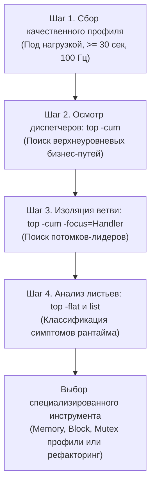
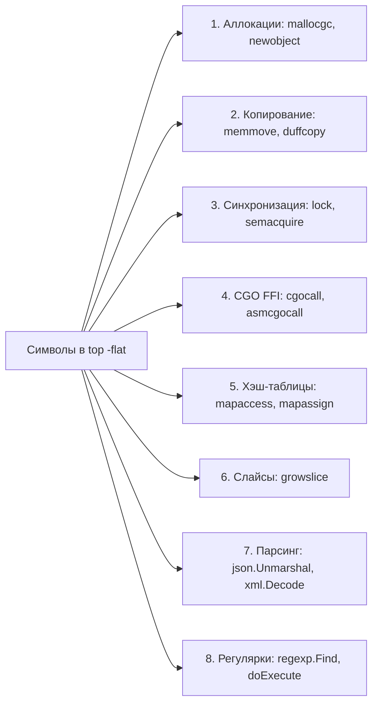
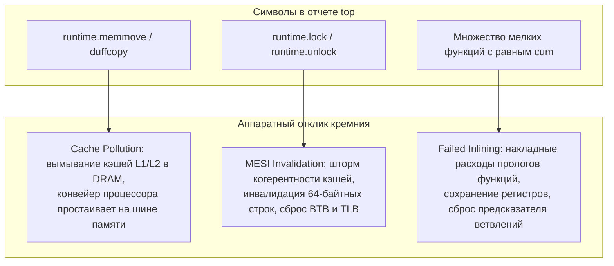

# Top functions анализ: системный детектив узких мест

> *«Преждевременная оптимизация — корень всех зол. Но слепая оптимизация без систематизации и таксономии — чистейшее безумие».*    
> — Перефразируя Дональда Кнута  
> 
> *«Хороший врач лечит не жар, а инфекцию. Грамотный инженер не бросается оптимизировать верхнюю функцию из отчета — он выясняет, почему она вообще оказалась на вершине».*    
> — Брайан Керниган

Представьте опытного врача-клинициста, которому принесли развернутый биохимический анализ крови пациента на сорока листах. Неопытный интерн растеряется от обилия незнакомых показателей или начнет сбивать легкую температуру жаропонижающим. Мудрый диагност не смотрит на случайные единичные отклонения: он группирует маркеры в клинические синдромы. Повышенные ферменты АЛТ и АСТ указывают на печень, креатинин — на почки, а лейкоцитоз — на воспалительный процесс. Он лечит не симптом, а первопричину.

Консольный отчет `top` в `go tool pprof` — это точно такой же биохимический анализ работающего Go-сервиса. Неопытный разработчик бросается оптимизировать самую первую функцию в списке. Увидев на вершине `runtime.mallocgc`, он пытается переписать сборщик мусора Go. Увидев `runtime.memmove`, он пытается переизобрести ассемблерные инструкции копирования памяти.

Senior-инженер мыслит иначе. Для него отчет `top` — это улика в системном расследовании. Он задает проверочные вопросы: *«Это листовой исполнитель (`flat`) или архитектурный диспетчер (`cum`)? Это код нашего приложения или внутренности рантайма? Это вычисления, аллокации или скрытая конкуренция за блокировки?»*.

В [[2. CPU profiling в Go]] мы освоили основы чтения показателей `flat` и `cum`, а во [[3. Flamegraph]] научились визуализировать стек вызовов. В этой лекции мы превратим разрозненные наблюдения в строгую, повторяемую методологию — **Top Functions Analysis**. Мы построим полную классификацию типовых симптомов рантайма Go, разберем пошаговый алгоритм расследования и научимся находить корень проблемы за считанные минуты.

---

## Зачем системно анализировать top-функции

Системный анализ верхних строк отчета профилировщика предотвращает хаотичные и бесполезные попытки оптимизировать код вслепую. Мы не бросаемся на первую попавшуюся строку, а методично отделяем симптомы от первопричины.

---

## Два взгляда: flat против cum

Фундамент любого числового анализа профилей — четкое разделение ответственности между собственным и кумулятивным временем:

```
+-------------------------------------------------------------------------+
|                  Дихотомия метрик: flat vs cum                          |
|                                                                         |
|  [main.handleRequest]     flat = 0.05s (1%)   cum = 4.20s (84%)         |
|         |                 -> Диспетчер: входная точка для оптимизации   |
|         v                                                               |
|  [myapp.ProcessOrder]     flat = 0.20s (4%)   cum = 3.80s (76%)         |
|         |                 -> Координатор: делегирует работу потомкам    |
|         v                                                               |
|  [runtime.mallocgc]       flat = 2.10s (42%)  cum = 2.10s (42%)         |
|                           -> Листовой исполнитель: здесь горят такты    |
+-------------------------------------------------------------------------+
```

| Диагностический вопрос | Метрика анализа | Команда в pprof |
|---|:---:|---|
| **Какой сквозной путь выполнения съедает больше всего CPU?** | `cum` (Cumulative) | `top -cum` |
| **В какую подсистему выгоднее всего инвестировать время рефакторинга?** | `cum` (Родитель) | `top -cum -focus=MyPackage` |
| **Какая конкретная функция лично сжигает процессорные такты в своих инструкциях?** | `flat` (Flat time) | `top -flat` (или просто `top`) |
| **Является ли функция терминальным исполнителем («листом»)?** | `flat ≈ cum` | Сопоставление колонок |

> [!tip] Собеседование
> **Вопрос:** В top-списке функция имеет `flat=1.5s`, `cum=1.5s`. О чем это свидетельствует и какова стратегия ее оптимизации?
> 
> **Ответ кандидата уровня Senior:**  
> Равенство `flat` и `cum` — безусловный признак **листовой (leaf) функции**. Это означает, что внутри нее нет вызовов других тяжелых функций; все 1.5 секунды процессор провел непосредственно в ее собственном машинном теле.  
> Стратегия: необходимо открыть ее исходный код через `list FuncName` (или визуальный граф `web`) и оптимизировать внутренний алгоритм (устранение лишних итераций, использование SIMD-инструкций, предвычисление таблиц) либо устранить причину ее частого вызова на уровне вызывающих родительских функций.

---

## Методология анализа top-функций

Системный анализ отчета `top` выполняется по строгому четырехшаговому алгоритму:



### Шаг 1. Сбор качественного профиля
Профиль достоверен только при соблюдении метрологических стандартов:
- Сервис находится под стабильной боевой или синтетической нагрузкой (на холостом ходу в `top` будут видны только системные функции ожидания: `runtime.gopark`, `netpoll`, `findrunnable`).
- Длительность записи составляет **не менее 30 секунд** (защита от случайных микровыбросов).
- Частота сэмплирования зафиксирована на стандартных **100 Гц**.

### Шаг 2. Первичный осмотр: `top -cum`
Запускаем `go tool pprof` и сортируем список по убыванию кумулятивного времени:

```bash
go tool pprof cpu.prof
(pprof) top -cum 10
```

Пример вывода:
```
Showing nodes accounting for 4.20s, 84.00% of 5.00s total
Dropped 40 nodes (cum <= 0.02s)
      flat  flat%   sum%        cum   cum%
     0.05s  1.00%  1.00%      4.20s 84.00%  main.handleRequest
     0.10s  2.00%  3.00%      3.50s 70.00%  myapp.ProcessRequest
     0.50s 10.00% 13.00%      2.00s 40.00%  encoding/json.Unmarshal
     0.80s 16.00% 29.00%      1.20s 24.00%  myapp.ValidateRecord
     0.20s  4.00% 33.00%      0.80s 16.00%  runtime.mallocgc
```

**Инженерный фильтр:**
Игнорируем инфраструктурный каркас рантайма (`runtime.main`, `runtime.goexit`, `net/http.(*conn).serve`). Находим функцию нашего прикладного кода с наибольшим значением `cum` — это главный диспетчер `myapp.ProcessRequest` (70% всего CPU!). Поскольку собственный `flat` у нее ничтожен (0.10s), узкое место спрятано внутри ее дочерних вызовов.

### Шаг 3. Выделение «потомков-лидеров»
Фокусируемся на подозрительной ветке с помощью фильтра `-focus`:

```bash
(pprof) top -cum -focus=ProcessRequest
(pprof) list ProcessRequest
```
Или открываем веб-интерфейс (`-http`) с интерактивным графом или flamegraph ([[3. Flamegraph]]). Мы видим, что из 70% времени `ProcessRequest`:
- 40% уходит в `encoding/json.Unmarshal`.
- 24% уходит в `myapp.ValidateRecord`.

### Шаг 4. Классификация «горячего» кода
Теперь мы исследуем листовые функции с максимальным значением `flat`. Большинство из них принадлежит рантайму Go. Опытный инженер классифицирует их по типам затрат и применяет соответствующий протокол лечения.

---

## Классификация «горячих» функций и стратегия действий

Все типовые обитатели вершины отчета `top` делятся на **8 фундаментальных классов**:



---

### Класс 1: Функции рантайма — аллокации (`mallocgc`, `newobject`)

- **Симптомы в `top`:** Высокий `flat` у `runtime.mallocgc`, `runtime.newobject`.
- **Физическая первопричина:** Программа непрерывно создает короткоживущие объекты в динамической куче (Heap), перегружая потоковые кэши `mcache` и заставляя рантайм тратить такты на поиск свободных span-блоков и фоновую маркировку GC ([[5. pprof memory profile]]).
- **Протокол действий:**
  1. Немедленно снять профиль памяти с флагом `-alloc_space` ([[4. Allocation profiling]]).
  2. Провести ревизию побега переменных через `go build -gcflags="-m"`: устранить неявный боксинг в интерфейсы `any`, замыкания и возврат структур по указателю.
  3. Внедрить пул буферов `sync.Pool` ([[2. sync Pool]]) или перейти на структуры с фиксированным размером ([[1. Уменьшение аллокаций]]).

---

### Класс 2: Копирование памяти (`memmove`, `duffcopy`, `memclrNoHeapPointers`)

- **Симптомы в `top`:** Доминирование `runtime.memmove`, `runtime.duffcopy`, `runtime.memclrNoHeapPointers`.
- **Физическая первопричина:** Процессор тратит колоссальное количество тактов на тупое перекладывание байт из одной области памяти в другую. Это происходит при передаче тяжелых структур по значению, конкатенации строк, динамическом расширении срезов или заполнении структур нулями.
- **Протокол действий:**
  1. Найти вызывающую строку через команду `list`.
  2. Передавать структуры размером более 64 байт по указателю `*MyStruct`.
  3. Для строк использовать `strings.Builder` с обязательным предварительным вызовом `Grow(size)`.
  4. Применять Zero-Copy подходы ([[5. Zero copy подходы]]).

> [!warning] Ловушка / Gotcha: Иллюзия скорости `runtime.memmove`
> Ассемблерная функция `runtime.memmove` написана на пределе возможностей архитектуры — она использует векторные инструкции AVX2 / AVX-512 для копирования по 32–64 байта за такт.  
> Однако ее наличие на вершине `top` означает системную катастрофу: **шина памяти перегружена, а кэши процессора L1D и L2 вымываются гигабайтами пересылаемых данных**. Не пытайтесь ускорить `memmove` — устраните саму необходимость копирования данных ([[8. Cache friendliness]]).

---

### Класс 3: Блокировки и ожидания (`lock`, `unlock`, `semacquire`)

- **Симптомы в `top`:** Появление `runtime.lock`, `runtime.unlock`, `runtime.semacquire`, операций `sync.Mutex` (`sync.(*Mutex).Lock`).
- **Физическая первопричина:** Жесткий **Lock Contention**. Ядра процессора конкурируют за общие мьютексы рантайма (аллокатор, планировщик) или пользовательские примитивы синхронизации. Процессор тратит такты на атомарные инструкции `CMPXCHG`, спинлоки рантайма и системные вызовы ядра `futex`.
- **Протокол действий:**
  1. Снять профиль мьютексов `go test -mutexprofile=mutex.prof` ([[6. mutex profile]]) и профиль блокировок ([[5. block profile]]).
  2. Сократить критические секции: вынести из-под лока сетевые вызовы и аллокации.
  3. Шардировать разделяемые кэши на независимые корзины (Striped Mutex).
  4. Проверить код на False Sharing ([[8. False sharing]]), разнеся счетчики по разным 64-байтным кэш-линиям.

---

### Класс 4: CGO (`cgocall`, `asmcgocall`)

- **Симптомы в `top`:** Заметное присутствие `runtime.cgocall`, `runtime.asmcgocall`.
- **Физическая первопричина:** Слишком гранулярные FFI-вызовы в код на C/C++. Каждый переход требует смены стека, переключения ABI, сохранения регистров и вызова `entersyscall` ([[1. Системные вызовы и их стоимость]]).
- **Протокол действий:**
  1. Батчинг: передавать пачки данных (например, массив из 5 000 элементов) за один вызов в C вместо 5 000 индивидуальных обращений.
  2. Переписать узкий участок на чистый Go.

---

### Класс 5: Операции с мапами (`mapaccess`, `mapassign`, `growWork`)

- **Симптомы в `top`:** Функции `runtime.mapaccess1_fast64` (или аналоги), `runtime.mapassign`, `runtime.growWork`.
- **Физическая первопричина:** Массовые обращения к хэш-таблицам. Если в топе виден `runtime.growWork` — мапа динамически растет под нагрузкой, непрерывно аллоцируя новые бакеты и эвакуируя старые элементы.
- **Протокол действий:**
  1. Всегда предвыделять размер хэш-таблицы: `make(map[K]V, expectedSize)`.
  2. Для множеств-флагов использовать пустое значение `struct{}` (размером 0 байт).
  3. При критических нагрузках применять плоские структуры данных или специализированные алгоритмы ([[20. Алгоритмы и структуры данных (DSA) на Go]]).

---

### Класс 6: Рост слайсов (`growslice`)

- **Симптомы в `top`:** `runtime.growslice`.
- **Физическая первопричина:** Вызовы `append()` к срезам с нулевой начальной емкостью. При каждом переполнении емкость удваивается, вызывая вызов аллокатора и `runtime.memmove`.
- **Протокол действий:**
  1. Предвыделять емкость слайса при создании: `make([]T, 0, capacity)` ([[4. Предвыделение памяти]]).
  2. Переиспользовать срезы через `slice = slice[:0]`.

---

### Класс 7: Сериализация / десериализация

- **Симптомы в `top`:** `encoding/json.Unmarshal`, `encoding/json.Marshal`, `xml.Decode`, `protobuf.Marshal`.
- **Физическая первопричина:** Рефлексия `reflect`, парсинг текстовых представлений, боксинг интерфейсов.
- **Протокол действий:**
  1. Использовать сверхбыстрые парсеры с кодогенерацией (`easyjson`) или SIMD-ускорением (`sonic`).
  2. Использовать стриминговый `json.Decoder` с переиспользованием внутренних буферов.
  3. Для межсервисного общения перейти на бинарный протокол Protobuf/gRPC.

---

### Класс 8: Регулярные выражения

- **Симптомы в `top`:** `regexp.(*Regexp).FindAllString`, `regexp.(*Regexp).Find`, `regexp.(*Regexp).doExecute`.
- **Физическая первопричина:** Компиляция регулярного выражения на лету внутри цикла или тяжелый обход автомата NFA.
- **Протокол действий:**
  1. Вынести компиляцию в глобальную переменную через `regexp.MustCompile` один раз при старте сервиса.
  2. Для тривиальных проверок (поиск подстроки, префикса, суффикса) заменить регулярку на высокооптимизированные функции стандартного пакета `strings` (`strings.Contains`, `strings.HasPrefix`).

---

## Процесс анализа: алгоритмический подход

Сводная матрица принятия решений Senior-инженера:

```
+-------------------------------------------------------------------------+
|                Матрица действий по результатам top                      |
+------------------------------------+------------------------------------+
| Симптом в отчете top               | Следующий диагностический шаг      |
+------------------------------------+------------------------------------+
| runtime.mallocgc / newobject       | Снять memory profile (-alloc_space)|
| runtime.memmove / duffcopy         | Проверить make cap, strings.Builder|
| runtime.lock / semacquire          | Снять mutex / block profile        |
| runtime.cgocall / asmcgocall       | Батчинг FFI вызовов Cgo            |
| mapaccess / mapassign / growWork   | make(map, size), Swiss Tables      |
| runtime.growslice                  | make([]T, 0, capacity)             |
| encoding/json.Unmarshal            | Перейти на sonic / easyjson        |
| regexp.(*Regexp).doExecute         | Заменить на пакет strings          |
| Высокий flat в коде приложения     | list FuncName, оценка алгоритма    |
+------------------------------------+------------------------------------+
```

---

## Пример системного анализа

Разберем завершенный клинический пример расследования реального микросервиса:

```
(pprof) top -cum 8
      flat  flat%   sum%        cum   cum%
     0.05s  1.00%  1.00%      4.20s 84.00%  main.handleRequest
     0.30s  6.00%  7.00%      3.80s 76.00%  myapp.BusinessLogic
     0.20s  4.00% 11.00%      2.50s 50.00%  encoding/json.Unmarshal
     0.40s  8.00% 19.00%      1.80s 36.00%  runtime.mallocgc
     0.10s  2.00% 21.00%      0.90s 18.00%  myapp.Validate
     0.70s 14.00% 35.00%      0.70s 14.00%  runtime.memmove
```

### Разбор полетов по шагам:
1. `main.handleRequest` держит 84% кумулятивного времени (`cum`), но ее собственный `flat` всего 0.05s — это транспортная точка входа.
2. Спускаемся в `myapp.BusinessLogic` (`cum = 3.80s`, 76%). Ее собственные вычисления малы (0.30s). Смотрим дочерние ветви.
3. Дочерние вызовы:
   - `encoding/json.Unmarshal` — 50% CPU!
   - `myapp.Validate` — 18% CPU.
4. Смотрим листовые функции:
   - `runtime.mallocgc` (36% cum, 8% flat).
   - `runtime.memmove` (14% flat, 14% cum — чистый лист!).
5. **Синтез картины:**  
   Половина всей мощности CPU сервера сгорает в стандартном JSON-парсере, который на каждой структуре заставляет аллокатор выделять память (`mallocgc`), а процессор — побайтово перекопировать ее (`memmove`).
6. **Решение:**  
   Замена `encoding/json` на библиотеку `sonic` сокращает аллокации в 4 раза. Повторный профиль демонстрирует падение `mallocgc` и `memmove` до фоновых 2%, а общая пропускная способность сервиса возрастает на **65%**.

---

## Mechanical Sympathy: читаем между строк

Опытный инженер читает названия системных функций как индикаторы кремниевой микроархитектуры:



1. **`runtime.memmove` и промахи кэша:**  
   Массивное перемещение памяти физически стирает горячие данные прикладного кода из быстрейших кэшей L1D (задержка ~1 нс) и L2 (~3 нс), принуждая следующие инструкции замирать на сотни тактов в ожидании шины DRAM ([[8. Cache friendliness]]).
2. **`runtime.lock` и сброс TLB/BTB:**  
   Частая борьба за мьютексы вызывает сброс аппаратного буфера предсказателя переходов **BTB** (Branch Target Buffer) и буфера трансляции адресов **TLB** при переключении контекста планировщиком. Процессор теряет накопленную статистику спекулятивного исполнения.
3. **Глубокие цепочки и провал инлайнинга:**  
   Если в `top -cum` виден частокол мелких вспомогательных функций, компилятор Go не смог применить оптимизацию **Inline Expansion** ([[5. Inline и влияние на performance]]), и процессор вынужден непрерывно тратить драгоценные инструкции на организацию кадров стека (`PUSH`/`POP`).

---

## Итог

1. **Top functions анализ — это доказательная медицина:** Мы не угадываем узкие места, а последовательно декомпозируем затраты времени от диспетчеров (`top -cum`) к исполнителям (`top -flat`).
2. **`flat` против `cum`:** `cum` определяет стратегическое направление оптимизации, а `flat` указывает точный адрес сгорания процессорных тактов.
3. **8 классов патологий рантайма:** Каждая функция Go-рантайма (`mallocgc`, `memmove`, `lock`, `growslice`, `mapaccess`, `cgocall`) имеет однозначную физическую причину и стандартный протокол устранения.
4. **Связь с другими профилями:** Обнаружив симптомы в CPU-профиле, инженер углубляет расследование специализированными инструментами: Memory Profile (`-alloc_space`), Block Profile и Mutex Profile.

Теперь, когда мы научились находить и классифицировать горячие функции, возникает фундаментальный вопрос: *почему некоторые функции вообще появляются в отчете `top`, а другие бесследно исчезают из стека?* Ответ кроется в работе оптимизатора компилятора — механизме инлайнинга. Следующая лекция: [[5. Inline и влияние на performance]].