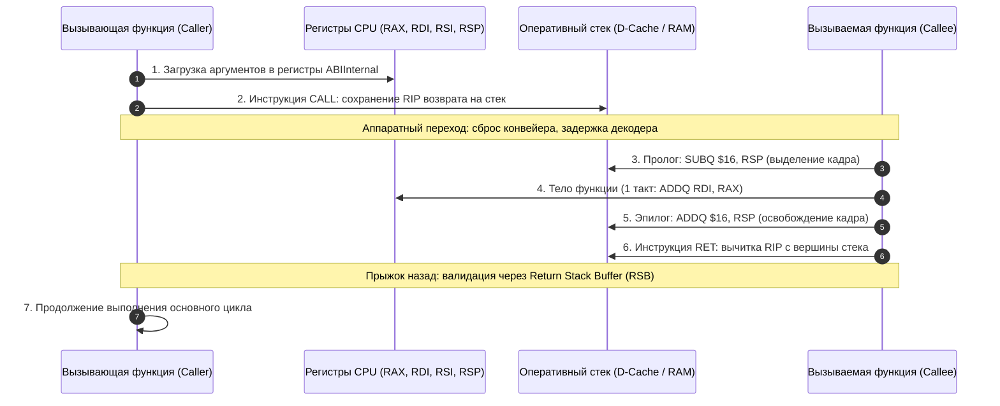
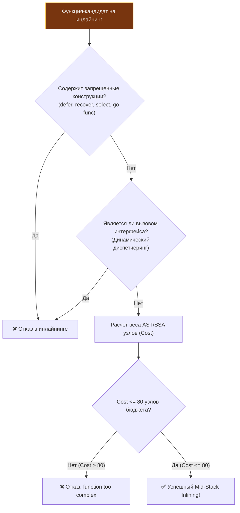
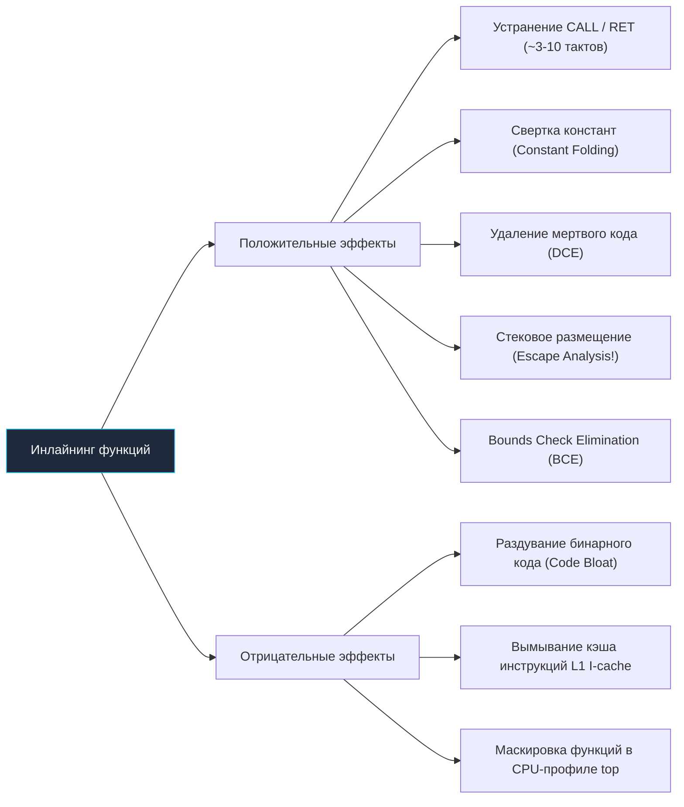

# Inline и влияние на performance: цена вызова и анатомия оптимизаций

> *«Вызов функции может быть бесплатным в мыслях архитектора, но он никогда не бывает бесплатным в кремнии».*    
> — Инженерный закон системного программирования  
> 
> *«Простота не предшествует сложности, а следует за ней. Инлайнинг — это способ компилятора превратить наши изящные абстракции обратно в прямолинейный и суровый машинный код».*    
> — Брайан Керниган

В учебниках по программированию нас справедливо учат декомпозиции: разбивайте большие функции на маленькие, создавайте выразительные геттеры, изолируйте валидацию в лаконичные вспомогательные методы. Это делает архитектуру человечной, понятной и надежной.

Но кремниевый кристалл процессора ничего не знает о чистоте архитектуры. Для конвейера CPU каждый вызов функции — это дорогостоящая церемония. Нужно подготовить аргументы в регистрах, выполнить инструкцию `CALL`, протолкнуть адрес возврата в аппаратный стек, выделить стековый кадр, выполнить две строчки сложения, восстановить регистры и выполнить инструкцию `RET`. Если полезная работа функции занимает ровно 1 такт процессора, а церемония ее вызова — 12 тактов, программа тратит более 90% энергии впустую!

Чтобы разрешить этот вечный конфликт между чистотой архитектуры и безжалостной физикой процессора, компиляторы используют **инлайнинг** (inlining, или подстановку тела функции непосредственно в место вызова). Но влияние инлайнинга простирается неизмеримо дальше устранения накладных расходов `CALL`/`RET`: он кардинально меняет правила побега памяти в кучу (Escape Analysis), удаляет мертвые ветви кода и полностью перекраивает картину в CPU-профилях и Flamegraph.

В этой лекции мы разберем, как инлайнинг работает на уровне машинного кода, как компилятор Go рассчитывает бюджет сложности функций, почему инлайнинг спасает от сборщика мусора и где проходит граница, за которой подстановка кода начинает разрушать кэш процессора.

---

## Почему инлайнинг — это не просто «встроить функцию»

В [[4. Top functions анализ]] мы научились классифицировать горячие функции и заметили, что множество мелких вспомогательных вызовов создают ощутимую паразитную нагрузку. В [[2. CPU profiling в Go]] мы видели в `top` длинные цепочки вызовов, где каждый шаг отнимает такты.

Инлайнинг — главный катализатор оптимизирующего компилятора Go:
1. Он физически вырезает границу вызова функции.
2. Он объединяет изолированные пространства переменных вызывающей и вызываемой функций в единый контекст.
3. Он запускает цепную реакцию последующих оптимизаций в промежуточном представлении **SSA (Static Single Assignment)**: свертку констант, удаление мертвого кода и размещение объектов на стеке вместо кучи.

Senior-инженер обязан не просто знать слово «инлайнинг», а понимать, почему в одной функции компилятор выполнил встраивание, а в соседней отказался, и как структурировать критический код, чтобы компилятор выжал из кремния максимум.

---

## Что такое инлайнинг с точки зрения процессора

Чтобы оценить колоссальную ценность инлайнинга, проследим полную аппаратную церемонию обычного вызова функции на архитектуре x86-64 / ARM64:



### Накладные расходы каждого шага:
1. **Инструкция `CALL` и `RET`:** Запись и чтение адреса возврата на вершине стека (`RSP`). Хотя современный блок предсказания возвратов **RSB (Return Stack Buffer)** работает великолепно, инструкция `CALL` все равно тратит от 2 до 6 процессорных тактов.
2. **Пролог и эпилог кадра:** Манипуляции со стековым указателем `RSP` для резервирования места под локальные переменные.
3. **Разрыв конвейера инструкций:** Переход по удаленному адресу в памяти может вызвать промах мимо кэша инструкций **L1I** и потребовать ожидания декодера инструкций.
4. **Вытеснение данных:** Создание нового стекового кадра раздувает рабочий набор кэша данных **L1D**, повышая вероятность вытеснения полезных структур.

```
+-------------------------------------------------------------------------+
|                    До и после инлайнинга в ассемблере                   |
|                                                                         |
|  [Обычный вызов функции add(a, b)]       [Заинлайненный код]            |
|    MOVQ   $10, AX                          ADDQ   $20, AX               |
|    MOVQ   $20, BX                          (1 инструкция!               |
|    CALL   main.add                          0 тактов на вызов,          |
|    ...                                      чистая арифметика)          |
|  main.add:                                                              |
|    ADDQ   BX, AX                                                        |
|    RET                                                                  |
+-------------------------------------------------------------------------+
```

Инлайнинг физически устраняет этот ритуал. Компилятор подставляет машинные инструкции тела функции прямо в вызывающий код. Нет `CALL`, нет пролога, нет `RET`, аргументы вообще не покидают регистры ALU. Для простых операций (сложение, чтение поля структуры, проверка граничных условий) это дает **ускорение в 3–5 раз**!

---

## Как Go решает, что инлайнить

Решение о возможности встраивания принимается компилятором Go на этапе прохода `inline` и построения промежуточного графа **SSA (Static Single Assignment)**.

Эвристики компилятора непрерывно развивались:
- **Go до 1.12:** Инлайнились только так называемые «листовые» функции (leaf functions) — функции, которые сами не вызывали никаких других функций, не содержали циклов и имели «стоимость» менее ~40 абстрактных операций.
- **Go 1.12+ (Mid-Stack Inlining):** Фундаментальный прорыв! Компилятор научился инлайнить функции, находящиеся в середине стека вызовов (то есть вызывающие другие подфункции), если их совокупная сложность не превышает бюджет.
- **Go 1.22+ / 1.24+:** Стандартный **бюджет сложности функции составляет 80 узлов SSA** (Nodes Budget). Каждая операция (сложение, чтение переменной, ветвление) имеет свою фиксированную «стоимость». Если сумма весов превышает 80, компилятор отказывает в инлайнинге.



### Конструкции, блокирующие инлайнинг:
1. **`defer` и `recover`:** Долгое время блокировали инлайнинг полностью. В современных версиях Go (1.22+) тривиальные `open-coded defers` могут инлайниться, но любая сложная логика отложенных вызовов гарантированно закрывает возможность подстановки.
2. **`select` и конкурентные примитивы:** Любой канал в блоке `select` требует тяжелой координации рантайма и исключает инлайнинг.
3. **Запуск горутин `go func()`:** Создание отдельной горутины требует упаковки аргументов и вызова планировщика.
4. **Сложные циклы `for` с неконстантными границами:** Простые циклы с константным числом итераций иногда могут разворачиваться (Loop Unrolling), но динамические циклы резко завышают бюджет сложности функции.
5. **Вызовы методов через интерфейсы:** Если метод вызывается через интерфейс `MyInterface.Execute()`, компилятор не знает конкретного типа во время компиляции (динамический полиморфизм через `itable`). Инлайнинг невозможен, кроме редких случаев PGO или девиртуализации.

> [!info] Под капотом: Настройка бюджета линковщика
> Бюджет инлайнинга компилятора можно форсировать через передачу скрытого флага компилятора `-gcflags="-l=4"` (уровни агрессивности инлайнинга от 1 до 4). Однако в промышленной разработке трогать этот флаг категорически не рекомендуется: агрессивный инлайнинг приводит к гигантскому раздуванию размера бинарника (Code Bloat) и деградации L1I-кэша.

---

## Как узнать, что функция заинлайнена

Никогда не гадайте — спросите компилятор напрямую.

### 1. Флаг оптимизатора `-gcflags="-m"`
Передайте компилятору флаг `-m` для включения диагностических логов оптимизаций:

```bash
go build -gcflags="-m" 2>&1 | grep inline
```

Вывод компилятора предельно информативен:
```
./main.go:15:6: can inline add
./main.go:24:6: cannot inline heavyFunc: function too complex: cost 128 exceeds budget 80
./main.go:42:13: inlining call to add
```
- `can inline add` — функция признана достаточно простой для встраивания.
- `cannot inline heavyFunc: function too complex: cost 128 exceeds budget 80` — функция превысила лимит сложности на 48 единиц.
- `inlining call to add` — конкретное место вызова, куда было подставлено тело функции.

### 2. Анализ ассемблерного листинга
Чтобы лично убедиться в отсутствии инструкции `CALL`, дизассемблируйте код утилитой `go tool compile`:

```bash
go tool compile -S main.go | grep -A10 'add'
```
Если по месту вызова вместо инструкции `CALL` сгенерирована прямая инструкция `ADDQ` или `MOVQ` — функция полностью заинлайнена.

### 3. Тест с отключением инлайнинга
В бенчмарках можно временно принудительно отключить инлайнинг флагом `-gcflags="-l"` (строчная буква L от слова «disable inlining»):

```bash
# Замер с инлайнингом
go test -bench=BenchmarkMath

# Замер с ПОЛНОСТЬЮ отключенным инлайнингом
go test -gcflags="-l" -bench=BenchmarkMath
```
Сравнение покажет чистую стоимость накладных расходов на вызовы в вашем алгоритме.

---

## Влияние на производительность: двойственная природа

Инлайнинг — обоюдоострый меч. Как и любая глубокая системная оптимизация, он несет как колоссальные выгоды, так и скрытые угрозы.



### Положительные эффекты:

1. **Экономия процессорных тактов:** Устранение прологов, эпилогов и команд перехода.
2. **Локальность потока инструкций:** Процессор выполняет непрерывный линейный блок инструкций без прыжков по памяти.
3. **Раскрытие каскадных оптимизаций компилятора:**
   - **Constant folding / propagation:** Если аргументом инлайн-функции является константа, компилятор производит все вычисления на этапе компиляции, подставляя готовое число.
   - **Dead code elimination (DCE):** Ветки `if`, зависящие от аргументов-констант, полностью вырезаются из машинного кода.
   - **Bounds check elimination (BCE):** Компилятор доказывает безопасность доступа к элементам слайса и выбрасывает скрытые проверки индексов `runtime.panicIndex`.
   - **Победа над кучей (Escape analysis):** Главнейший эффект! Компилятор видит жизненный цикл переменной внутри вызывающей функции и оставляет ее на стеке.

---

### Отрицательные эффекты:

1. **Раздувание машинного кода (Code Bloat):**  
   Если функция объемом в 50 байт вызывается в 1000 разных мест проекта, компилятор продублирует ее тело 1000 раз, добавив 50 КБ чистого машинного кода.
2. **Катастрофа кэша инструкций (L1 I-cache Thrashing):**  
   Объем кэша инструкций **L1I** в современных процессорах составляет всего **32 КБ** на ядро! Если раздутый горячий цикл перестает помещаться в 32 КБ, процессор начинает испытывать непрерывные промахи кэша инструкций (I-cache misses), и производительность программы резко падает.
3. **Искажение и маскировка в профилях:**  
   Заинлайненная функция физически перестает существовать в таблице символов как отдельный стек. В отчете `top` вы ее не увидите — ее время полностью растворится в вызывающей функции.

---

## Инлайнинг в профилях: как увидеть эффект

Рассмотрим показательный код:

```go
package main

func add(a, b int) int {
    return a + b
}

func sumSlice(s []int) int {
    sum := 0
    for _, v := range s {
        sum = add(sum, v) // Идеальный кандидат на инлайнинг
    }
    return sum
}
```

### Профиль без инлайнинга (`go test -gcflags="-l"`):
```
(pprof) top
Showing nodes accounting for 1.00s, 100% of 1.00s total
      flat  flat%   sum%        cum   cum%
     0.70s 70.00% 70.00%      0.70s 70.00%  main.add
     0.30s 30.00% 100.0%      1.00s 100.0%  main.sumSlice
```
70% времени программа потратила на вызовы функции `main.add`!

### Профиль с включенным инлайнингом (по умолчанию):
```
(pprof) top
Showing nodes accounting for 0.25s, 100% of 0.25s total
      flat  flat%   sum%        cum   cum%
     0.25s 100.0% 100.0%      0.25s 100.0%  main.sumSlice
```

**Результат:**
1. Функция `main.add` полностью **исчезла из отчета `top`**!
2. Общее время выполнения сократилось **с 1.00s до 0.25s (ускорение ровно в 4 раза!)**.
3. В Flamegraph ([[3. Flamegraph]]) пропали лишние этажи, стек стал плоским и монолитным.

> [!warning] Ловушка / Gotcha: Ложная оптимизация невидимки
> Если в отчете `top` функция `sumSlice` занимает 100% CPU, неопытный разработчик бросится переписывать цикл. Однако в реальном сервисе внутри `sumSlice` могли быть заинлайнены десятки мелких методов. Если один из них был неоптимален, в профиле он невидим!  
> **Правило:** При исследовании раздутых функций всегда сверяйтесь с логом `go build -gcflags="-m"` и дизассемблером `go tool compile -S`, чтобы точно знать, какие методы растворились в теле функции.

---

## Инлайнинг и escape analysis: тандем, который спасает от GC

Самый драматический эффект инлайнинга в Go — это не экономия наносекунд на инструкции `CALL`, а **предотвращение аллокаций в куче**!

Разберем классический пример:

```go
type Buffer struct {
    data [64]byte
}

// Конструктор, возвращающий указатель
func newBuffer() *Buffer {
    return &Buffer{}
}

func process() {
    b := newBuffer()
    // Интенсивная работа с b...
    _ = b
}
```


Без инлайнинга функция `newBuffer` компилируется как независимый блок. Компилятор видит, что локальная переменная возвращается по указателю наружу, и обязан отправить ее в кучу ([[3. Escape analysis]]). Каждое создание буфера вызывает аллокатор `runtime.newobject` и нагружает GC.

При инлайнинге граница функции стирается. Компилятор видит, что буфер создается и уничтожается строго внутри `process()`. Переменная **остается на стеке**.  
Количество аллокаций падает со 100 000 до **0**!

---

## Практические рецепты и антипаттерны

Senior-инженер пишет код так, чтобы компилятор охотно применял инлайнинг в критических путях:

### 1. Паттерн «Быстрый путь / Медленный путь» (Fast Path / Slow Path)
Если функция в 99% случаев тривиальна, но содержит редкую сложную обработку ошибок, разделите ее на две:

```go
// ПЛОХО: Функция перегружена обработкой ошибок и не может быть заинлайнена (cost > 80)
func (c *Cache) Get(key string) ([]byte, error) {
    c.mu.RLock()
    val, ok := c.items[key]
    c.mu.RUnlock()
    if !ok {
        // Тяжелое форматирование ошибки раздувает бюджет SSA
        return nil, fmt.Errorf("item with key %s not found in cache", key)
    }
    return val, nil
}

// ОТЛИЧНО: Fast Path инлайнится, Slow Path вынесен в отдельную функцию!
func (c *Cache) Get(key string) ([]byte, error) {
    c.mu.RLock()
    val, ok := c.items[key]
    c.mu.RUnlock()
    if !ok {
        return c.slowNotFound(key) // Вызов редкой тяжелой функции
    }
    return val, nil // Быстрый путь встраивается в место вызова!
}

//go:noinline
func (c *Cache) slowNotFound(key string) ([]byte, error) {
    return nil, fmt.Errorf("item with key %s not found in cache", key)
}
```

### 2. Избегайте `defer` в маленьких горячих функциях
Инструкция `defer` в критическом цикле может легко лишить функцию права на инлайнинг. В высоконагруженных участках отдавайте предпочтение явному освобождению ресурсов.

### 3. Не используйте `go:noinline` без веской причины
Аннотация `//go:noinline` принудительно запрещает оптимизатору встраивать функцию. Ее используют в бенчмарках для предотвращения удаления мертвого кода компилятором (DCE) или в тестах трассировки стека. Забытая директива `//go:noinline` в продакшене способна обрушить производительность сервиса в разы.

### 4. Внимательно проверяйте интерфейсные вызовы
Вызов метода через интерфейс никогда не инлайнится компилятором. Если это горячий путь, подумайте о замене интерфейса на конкретный тип или generic (с Go 1.18+ generics инлайнятся на уровне конкретного типа при мономорфизации). Но generics не панацея: инстанциация создает свой код, подчиняющийся обычным правилам бюджета.

### 5. Не гонитесь за инлайнингом в ущерб ясности
Микрооптимизации ради инлайнинга стоит применять только в доказанно горячих точках. Читаемость и надежность кода всегда первичны. Компилятор с каждым релизом совершенствуется, и то, что не инлайнилось вчера, может автоматически заинлайниться завтра.

---

## Mechanical Sympathy: как инлайнинг взаимодействует с процессором

Инлайнинг перестраивает физическое взаимодействие кода с кремнием:

1. **L1I Instruction Cache:**  
   Компактный инлайнинг удерживает горячий цикл в пределах 32 КБ кэша инструкций L1I. Однако чрезмерное раздувание кода приводит к эффекту **I-cache Misses**, когда процессор вынужден простаивать, подтягивая машинный код из L2/L3 кэшей.
2. **Линеаризация конвейера (Pipelining):**  
   Процессорный конвейер суперскалярного ядра любит прямые, непрерывные участки инструкций. Отсутствие переходов позволяет механизму Out-of-Order Execution (OoOE) и аппаратному префетчеру инструкций загружать конвейер на десятки тактов вперед без пауз.
3. **Снижение нагрузки на Return Stack Buffer (RSB):**  
   Аппаратный стек адресов возврата процессора имеет ограниченную глубину (обычно 16–32 записи). Инлайнинг устраняет вложенные вызовы, предотвращая переполнение RSB и устраняя штрафы за неверно предсказанные возвраты из функций.

---

## Инлайнинг и бенчмарки

При анализе бенчмарков ([[8. Сравнение версий кода]]) всегда проверяйте лог оптимизаций.

Классическая драма: разработчик добавил в быструю функцию всего одну строчку логирования `log.Printf(...)` или проверку условия `if`. Скорость бенчмарка внезапно рухнула: показатель `ns/op` подскочил на 300%!  
Разработчик в панике ищет ошибку в логировании, а реальная причина проста: эта строчка увеличила стоимость функции с 75 до 85 узлов, и **компилятор молча отключил инлайнинг**.

Всегда сопоставляйте вывод `go build -gcflags="-m"` между двумя версиями кода, чтобы мгновенно обнаруживать потерю инлайнинга в критических функциях.

---

## Итог

1. **Инлайнинг — корона оптимизирующего компилятора:** Он не просто экономит наносекунды на командах `CALL`/`RET`, а запускает каскад глубоких оптимизаций SSA (BCE, DCE, Constant Folding).
2. **Бюджет сложности в Go (80 узлов):** Компилятор Go консервативен: сложные функции с циклами, `defer` и тяжелыми ветвлениями не встраиваются.
3. **Тандем с Escape Analysis:** Инлайнинг позволяет компилятору удерживать создаваемые структуры на быстром стеке, предотвращая дорогостоящие аллокации в куче и разгружая Garbage Collector.
4. **Невидимость в профилях:** Заинлайненная функция растворяется в теле вызывающего родителя. Для ее обнаружения требуется дизассемблирование `go tool compile -S` и анализ логов `-gcflags="-m"`.
5. **Опасность раздувания (Code Bloat):** Чрезмерный инлайнинг вымывает кэш инструкций L1I (32 КБ). Баланс компилятора — надежная защита от переоптимизации.

Теперь, когда мы понимаем, как компилятор выпрямляет код в единый поток инструкций, мы готовы заглянуть в то, как процессор справляется с развилками внутри этого кода: следующая лекция посвящена кремниевому предсказателю переходов — [[6. Branch prediction и код]].