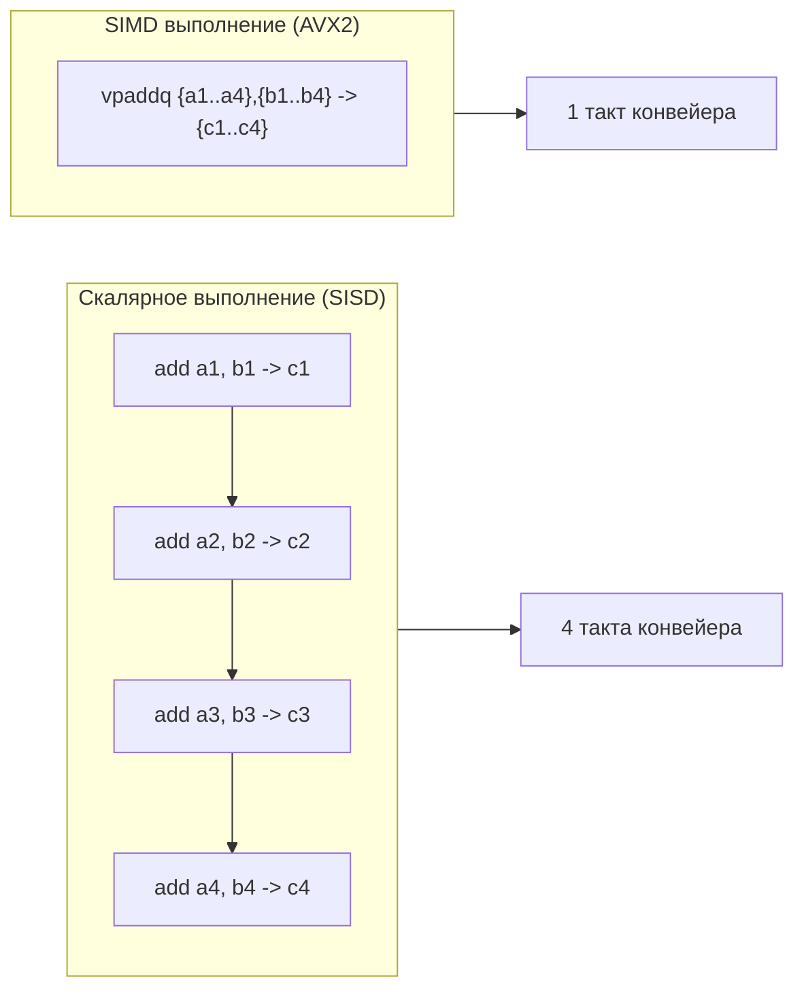

# SIMD и Go

> *«В традиционном программировании мы привыкли думать скалярно: взять одно число, сложить со вторым, получить результат. Но представьте фабричный конвейер: вместо того чтобы красить каждую деталь отдельным движением кисти, рабочий нажимает рычаг — и пульверизатор одновременно покрывает краской восемь деталей за один взмах. Это и есть SIMD: параллелизм на уровне кремниевых регистров».*  
> — Брайан Керниган

---

## Что такое SIMD и почему оно важно для Go-разработчика

**SIMD** (Single Instruction, Multiple Data) — основополагающий архитектурный принцип современных микропроцессоров, при котором одна машинная инструкция выполняет одну и ту же операцию (сложение, умножение, побитовое сравнение, сдвиг) одновременно над несколькими независимыми элементами данных.

В классической классификации Флинна подавляющая часть нашего прикладного кода относится к категории **SISD** (Single Instruction, Single Data):
```
add rax, rbx  ; Складываем ровно одно 64-битное число с другим
```
Векторная инструкция SIMD оперирует широкими регистрами, упаковывая в них целый массив значений:
```
vpaddq ymm0, ymm1, ymm2  ; Складываем четыре пары 64-битных чисел за ОДИН машинный такт
```

SIMD — это ключевой кремниевый двигатель для задач с высокой плотностью однородных вычислений:
- криптографическое хэширование и симметричное шифрование (TLS, AES, SHA-256);
- кодирование и декодирование форматов (JSON, Protobuf, Base64, Parquet);
- потоковое сжатие данных (Snappy, Zstandard, Gzip);
- обработка мультимедиа и изображений;
- линейная алгебра и векторный поиск эмбеддингов в базах данных (AI/ML).

Для Go-разработчика SIMD долгое время казался экзотикой из мира C, C++ и Rust. Компилятор Go (`gc`) исторически **не выполняет автоматической векторизации циклов** (auto-vectorization). Это приводило к стойкому заблуждению, будто Go принципиально не способен использовать мощь современных векторных инструкций.

Однако реальность гораздо интереснее: хотя компилятор и не векторизует ваш цикл `for i := range arr`, **сама стандартная библиотека и рантайм Go насыщены рукотворным SIMD-ассемблером**. Когда вы вызываете `copy()`, хэшируете пароль через `crypto/sha256` или ищете подстроку в `strings`, процессор работает на полных векторных оборотах.

Эта статья систематизирует знания о векторных возможностях процессора перед переходом к кэш-эффективности ([[8. Cache friendliness]]). Мы уже изучили анализ топ-функций ([[4. Top functions анализ]]), инлайнинг ([[5. Inline и влияние на performance]]) и предсказание ветвлений ([[6. Branch prediction и код]]). Теперь добавим завершающий штрих к портрету CPU-оптимизации: параллелизм данных.

---

## Аппаратная основа: регистры и наборы инструкций

Чтобы эффективно мыслить категориями SIMD, необходимо представлять, как физически расширялись регистровые файлы процессоров за последние 25 лет.

### Эволюция регистров x86-64:
- **Базовые GPR (General Purpose Registers):** `RAX`, `RBX`, `RCX`... — 64 бита (1 элемент `int64` или `float64`).
- **SSE (Streaming SIMD Extensions):** Регистры `XMM0`–`XMM15` шириной **128 бит**. Вмещают:
  - 2 × `int64` / `uint64` или `float64`;
  - 4 × `int32` / `uint32` или `float32`;
  - 8 × `int16`;
  - 16 × `int8` / `byte`.
- **AVX / AVX2 (Advanced Vector Extensions):** Регистры `YMM0`–`YMM15` расширены до **256 бит** (младшие 128 бит соответствуют регистрам `XMM`). Пропускная способность удваивается: 4 × `int64` или 8 × `int32`.
- **AVX-512:** Серверные процессоры Intel Xeon, AMD EPYC (Zen 4+) и некоторые десктопные CPU получили регистры `ZMM0`–`ZMM31` шириной **512 бит**. Один регистр обрабатывает 8 × `int64` или 16 × `float32` одновременно!

### Эволюция на архитектуре ARM:
Архитектура ARM (процессоры Apple M, серверные чипы AWS Graviton, Ampere Altra) оснащена векторным расширением **NEON** со 128-битными регистрами `V0`–`V31`. В новейших спецификациях ARMv8.4-A+ и ARMv9 внедрены масштабируемые векторные расширения **SVE** и **SVE2** с переменной длиной вектора от 128 до 2048 бит.

```
Сравнение ширины регистров:
[ RAX (64-bit) ] -> Скаляр: 1 x int64
[ XMM (128-bit) ] -> SSE / NEON: 2 x int64 / 4 x int32 / 16 x byte
[ YMM (256-bit) ] -> AVX2: 4 x int64 / 8 x int32 / 32 x byte
[ ZMM (512-bit) ] -> AVX-512: 8 x int64 / 16 x int32 / 64 x byte
```

### Сравнение скалярного и векторного исполнения:

Векторная инструкция `VPADDQ` (AVX2 Packed Add Quadwords) выполняет сложение четырех пар `uint64` за один машинный такт:



Теоретический выигрыш составляет 4x (для AVX2) или 8x (для AVX-512). На практике из-за задержек загрузки данных из памяти (`VMOVDQU`) и выравнивания ускорение составляет от 2.5x до 6x, что колоссально для вычислительных сервисов.

---

## Компилятор Go и автовекторизация

Среди разработчиков часто звучит вопрос: *«Почему компилятор Go сам не превратит мой цикл `for` в инструкции AVX2?»*

Действительно, компиляторы GCC, Clang или Rust LLVM тратят значительное время на анализ графа зависимостей цикла (Loop Vectorization), разворачивая итерации в векторные операции. Компилятор Go (`gc`) этого **не делает**. Причины такого архитектурного выбора глубоко осознанны:

1. **Скорость сборки — высший приоритет:** Создатели Go Роб Пайк и Кен Томпсон проектировали язык так, чтобы проект из миллионов строк собирался за считанные секунды. Глубокий анализ векторизации и генерация масок с предикатами замедлили бы компиляцию в 5–10 раз.
2. **Архитектура промежуточного представления (SSA):** Внутренний оптимизатор SSA в компиляторе Go оперирует скалярными типами базового языка (`int`, `float`, `pointer`). В нем отсутствуют первоклассные векторные типы.
3. **Простота и надежность отладки:** Автовекторизация порождает сложнейший пролог и эпилог для обработки «хвостов» некратных массивов, что усложняет генерацию отладочной информации DWARF и профилирование.

Однако это не означает, что программы на Go лишены SIMD. Напротив: архитекторы Go перенесли тяжесть векторизации на **рукописный ассемблер ключевых системных функций**.

> [!info] Под капотом
> Функции рантайма и стандартной библиотеки, такие как `runtime.memmove`, `runtime.memclr`, `crypto/sha256`, `hash/crc32`, `math/big`, содержат узкоспециализированные ассемблерные файлы под каждую архитектуру (`memmove_amd64.s`, `sha256_arm64.s`). Компилятор выбирает нужную реализацию во время линковки, а при старте приложения рантайм определяет доступные расширения процессора. Именно поэтому функции `copy` между слайсами, инициализация структур или расчет контрольных сумм в Go работают с предельной скоростью кремния.

---

## Где SIMD уже работает в Go

Даже если вы не написали ни одной строчки на ассемблере, ваш код ежедневно утилизирует векторные регистры. Рассмотрим ключевые точки:

### 1. Копирование и обнуление памяти

Когда вы пишете:
```go
copy(dst, src)
```
или копируете элементы среза:
```go
for i := range s { dst[i] = src[i] }
```
компилятор распознает идиому и компилирует ее в вызов внутренней ассемблерной функции `runtime.memmove`. 

Для блоков размером от нескольких десятков байт `memmove` задействует широкие регистры `XMM` или `YMM`, перемещая память блоками по 32 или 64 байта за такт.

Аналогично, создание и очистка слайсов (`make([]byte, 1024)`) транслируется в вызов `runtime.memclr`, обнуляющей память через векторные инструкции (`VPXOR` + `VMOVDQU`).

В CPU-профилях вы можете встретить вызовы `runtime.memmove` или `runtime.duffcopy` (развернутый цикл копирования). Как мы обсуждали в [[4. Top functions анализ]], большой показатель `flat` у этих функций свидетельствует о массивном перемещении данных, однако само по себе копирование выполняется предельно быстро благодаря аппаратному SIMD.

### 2. Криптография

Пакеты `crypto/aes`, `crypto/sha256`, `crypto/sha512`, `hash/crc32` содержат высокооптимизированный машинный код:
- Аппаратные инструкции **AES-NI** (`AESENC`, `AESENCLAST`) выполняют раунд шифрования AES за один такт.
- Функция `sha256.Sum256` на архитектуре x86-64 вызывает ассемблерную реализацию `SHA256` с инструкциями Intel SHA Extensions или AVX2, вычисляя до 16 блоков хэша параллельно.
- Пакет `hash/crc32` использует специальную процессорную инструкцию `CRC32`.

Для высоконагруженного API-шлюза, обслуживающего десятки тысяч TLS-соединений в секунду, это экономит десятки процессорных ядер.

### 3. Обработка изображений

Стандартные пакеты `image`, `image/jpeg` и `image/png` используют ассемблерные подпрограммы для преобразования цветовых пространств (RGBA в YCbCr) и квантования. Пиксели естественным образом ложатся в векторные регистры (каждый пиксель — 4 байта `RGBA`, 8 пикселей идеально умещаются в один 256-битный регистр `YMM`).

### 4. Математика больших чисел

Пакет `math/big` реализует арифметику произвольной точности. При операциях с числами в тысячи бит (что является базой для RSA и криптографии на эллиптических кривых) умножение и деление выполняются через оптимизированный ассемблер (например, метод Карацубы с векторными регистрами).

### 5. Внешние библиотеки

Go-сообщество разработало высокопроизводительные библиотеки, выводящие работу с SIMD на промышленный уровень:
- **`github.com/klauspost/cpuid/v2`** — стандарт де-факто для динамического интроспективного анализа возможностей CPU. Позволяет коду прямо во время выполнения проверить наличие инструкций (`cpuid.CPU.AVX2()`, `cpuid.CPU.ARM_NEON()`) и выбрать соответствующую ветку алгоритма.
- **`github.com/klauspost/compress/snappy`** — реализация сжатия Snappy, работающая в разы быстрее стандартной за счет AVX2/AVX-512 ассемблера.
- **`github.com/minio/sha256-simd`** — альтернативная реализация SHA-256 от команды MinIO с поддержкой одновременного хэширования нескольких потоков через AVX-512 и ARM NEON.
- **`gonum`** — фундаментальная научная библиотека линейной алгебры, использующая SIMD через ассемблер или CGO (BLAS / LAPACK).

Типичный паттерн проектирования таких библиотек — фабричный выбор реализации на этапе инициализации:

```go
package fastmath

import "github.com/klauspost/cpuid/v2"

var vectorSumFunc func([]int64) int64

func init() {
    if cpuid.CPU.AVX2() {
        vectorSumFunc = sumAVX2
    } else {
        vectorSumFunc = sumScalar
    }
}

func Sum(data []int64) int64 {
    return vectorSumFunc(data)
}
```

Такой подход позволяет распространять единый бинарный файл, который автоматически раскрывает максимальную производительность на современном сервере и безопасно работает на старом оборудовании.

---

## Ручное использование SIMD в Go

Если профилирование доказало, что скалярный код в критическом цикле стал бутылочным горлышком, у инженера есть три пути:

### Ассемблер Plan9
Go использует собственный исторический синтаксис ассемблера, унаследованный от операционной системы Plan 9. Вы можете создать файл с расширением `.s` (например, `sum_amd64.s`), объявить прототип функции в `.go` файле без тела:
```go
//go:noescape
func sumAVX2(data []int64) int64
```
и реализовать её на ассемблере с использованием векторных инструкций `VMOVDQU`, `VPADDQ`.

> [!TIP] Инженерный инструмент: avo
> Писать ассемблер Plan 9 вручную — процесс трудоемкий и чреватый ошибками распределения регистров. Компания Segment разработала утилиту **`avo`** (`github.com/mmcloughlin/avo`). Она позволяет писать генератор ассемблера на чистом Go: вы оперируете виртуальными регистрами и высокоуровневыми циклами, а `avo` сама распределяет физические регистры CPU, выравнивает стек и генерирует валидный `.s` файл для компилятора Go!

### cgo
Вызов C-функций, использующих интринсики компилятора GCC/Clang (`<immintrin.h>`).
Однако вызов `cgo` сопряжен с накладными расходами переключения стека горутины на стек ОС (~50-100 нс на вызов). `cgo` оправдан только для массивных вычислительных задач (обработка сотен килобайт данных за один вызов), иначе накладные расходы съедят весь выигрыш от SIMD.

### Чистый Go и надежда на компилятор
В чистом коде используйте примитивы пакета `math/bits`. Компилятор подменяет их на скалярные аппаратные инструкции (`POPCNT`, `BSF`, `BSR`). Кроме того, структурируйте циклы без условных переходов, чтобы будущие версии компилятора Go могли легче внедрять векторные оптимизации.

---

## Профилирование и SIMD

Инструмент `go tool pprof` собирает стек-трейсы по таймеру и не имеет прямого индикатора «использован ли SIMD». Однако косвенно в pprof векторный код проявляется как **крайне высокая плотность полезной работы**: функция обрабатывает огромные массивы данных, имея минимальный `cum` относительно скалярных аналогов.

Для прямого измерения выполнения векторных инструкций необходимо использовать аппаратные счетчики ядра Linux через утилиту `perf`:

```bash
# Измерение вышедших на пенсию (retired) 128-битных и 256-битных векторных инструкций
perf stat -e fp_arith_inst_retired.128b_packed_single,\
fp_arith_inst_retired.256b_packed_single go test -bench=.
```

Если бенчмарк демонстрирует кратный отрыв по времени, а счетчики `256b_packed` показывают миллионы событий — ваш код эффективно утилизирует AVX2.

> [!tip] Собеседование: Go vs C в криптографии
> **Вопрос:** Почему реализация `crypto/sha256` в стандартной библиотеке Go по скорости практически не уступает C/Rust-реализациям и в десятки раз быстрее реализации на Python, но может незначительно отставать от специализированных C-библиотек с AVX-512?  
> **Ответ:** Стандартная библиотека Go реализует критические криптографические примитивы на чистом ассемблере с использованием инструкций SHA Extensions и AVX2. В отличие от интерпретируемого Python, здесь нет накладных расходов виртуальной машины, а вычисления идут на уровне регистров. Некоторое отставание от топовых C-решений может возникать из-за того, что в C задействуются 512-битные инструкции AVX-512 с 32 регистрами ZMM, в то время как ассемблер Go ориентирован на более стабильные и универсальные 256-битные AVX2, не вызывающие троттлинга частоты ядра.

---

## Механическая эмпатия: выравнивание и кэш

Чтобы векторный блок работал с максимальной отдачей, данные в оперативной памяти должны быть согласованы с архитектурой:

1. **Выравнивание данных (Memory Alignment):**  
   Инструкции загрузки в векторные регистры делятся на выровненные (`VMOVAPS`, `VMOVDQA`) и невыровненные (`VMOVUPS`, `VMOVDQU`). Исторически невыровненный доступ приводил к аппаратным исключениям или колоссальным штрафам. На современных CPU задержка невыровненной загрузки минимальна, **если только адрес не пересекает границу 64-байтной кэш-линии (Cache Line Split)**. Пересечение границы кэш-линии требует от контроллера памяти двух раздельных чтений из кэша L1, блокируя конвейер загрузки. В Go прямой контроль над адресом отсутствует, но для ручного SIMD-кода нередко выделяют буфер чуть большего размера и выравнивают указатель через каст к `uintptr` с битовой маской (см. [[9. Cache line и выравнивание]]).
2. **Локальность данных:**  
   SIMD перемалывает данные с огромной скоростью (десятки гигабайт в секунду). Если данные разбросаны в куче по указателям, векторные регистры будут непрерывно простаивать в ожидании выборки из RAM. SIMD требует плотных, последовательных слайсов примитивных типов (`[]float32`, `[]byte`, `[]int64`).

---

## Ловушки и ограничения

- **Ошибка SIGILL (Illegal Instruction):**  
  Если скомпилировать код с инструкциями AVX2 или AVX-512 и запустить его на старом процессоре или в виртуальной машине без проброса расширений, операционная система немедленно аварийно завершит процесс сигналом `SIGILL`. Всегда защищайте векторный код динамической проверкой через `cpuid`.
- **Раздувание размера бинарника:**  
  Включение нескольких ассемблерных вариантов одной функции (скалярная, SSE4, AVX2, ARM NEON) увеличивает размер бинарного файла и нагрузку на кэш инструкций (I-cache).
- **Снижение читаемости и сопровождаемости:**  
  Ассемблерный код не инлайнится компилятором Go и требует ручной поддержки при изменениях интерфейсов. Прибегайте к нему только тогда, когда исчерпаны все алгоритмические оптимизации.
- **Феномен «Dark Silicon» и частотный троттлинг:**  
  Широкие 512-битные блоки AVX-512 на некоторых поколениях процессоров Intel (Skylake-X, Cascade Lake) потребляют колоссальную мощность. Чтобы не расплавить кристалл (проблема Dark Silicon), процессор при выполнении AVX-512 инструкций автоматически понижает тактовую частоту всего ядра на 10–20%. В смешанных нагрузках это может парадоксально **замедлить** соседний скалярный код программы! Поэтому в Go-инфраструктуре золотым стандартом остаются умеренные 256-битные инструкции AVX2.

---

## Когда думать о SIMD в Go-проекте

Зрелый Senior-инженер придерживается строгой иерархии действий:

1. **Измерить через профиль:** Убедиться с помощью CPU-профилирования ([[2. CPU profiling в Go]]), что конкретная функция является CPU-bound и потребляет ощутимую долю ресурсов.
2. **Исчерпать штатные средства Go:**  
   - Устранить лишние аллокации в куче ([[1. Уменьшение аллокаций]]);
   - Обеспечить последовательную укладку структур в памяти ([[8. Cache friendliness]]);
   - Помочь инлайнингу ([[5. Inline и влияние на performance]]);
   - Устранить случайные ветвления ([[6. Branch prediction и код]]).
3. **Использовать проверенные SIMD-библиотеки:**  
   Прежде чем писать низкоуровневый код, проверьте проверенные пакеты с открытым исходным кодом: `klauspost/compress`, `minio/sha256-simd`, `klauspost/cpuid/v2`.
4. **Написание собственного векторного ядра:**  
   Только если готовых решений нет, а задача сугубо математическая (обработка тензоров, сигналов, специфических кодеков), генерируйте Plan9 ассемблер с помощью инструмента `avo`, покрывая код кросс-платформенными тестами и бенчмарками.

---

## Итог

- **SIMD** — фундаментальная технология параллелизма на уровне данных («одна инструкция — множество операндов»), способная дать ускорение в 2–8 раз на вычислительно-плотных задачах.
- Компилятор Go (`gc`) сознательно не выполняет автоматическую векторизацию циклов ради миллисекундной скорости компиляции и простоты SSA.
- Рантайм и стандартная библиотека Go поставляются с ручным SIMD-ассемблером: копирование памяти (`runtime.memmove`), обнуление (`runtime.memclr`), криптография (`crypto/sha256`, `crypto/aes`) и математика работают с предельной аппаратной отдачей.
- Для прикладного кода лучшая стратегия — применение зрелых библиотек экосистемы с динамическим определением возможностей чипа через `cpuid`.
- Ручное внедрение SIMD через генераторы ассемблера (`avo`) или cgo требует глубокого понимания выравнивания памяти, кэш-линий и температурных лимитов процессора.

В следующей, завершающей лекции модуля мы подведем все аппаратные механизмы к общему знаменателю: как организация структур данных в оперативной памяти определяет попадание в процессорные кэши — [[8. Cache friendliness]].