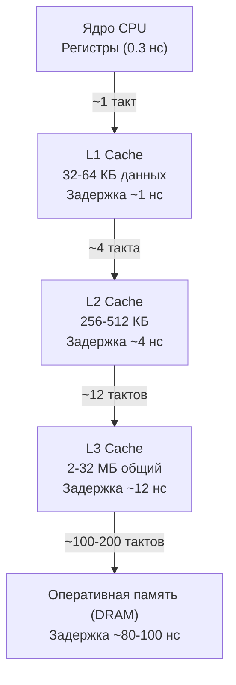

# Cache friendliness

> *«В идеальном мире программиста память — это бесконечная, однородная и бесплатная лента ячеек. В физическом мире кремния и меди память — это сложная пирамида, где каждый шаг вглубь замедляет вычисления на порядки. Процессор способен молотить миллиарды инструкций в секунду, но если он голодает, ожидая байты из далекой оперативной памяти, его ядро просто спит. Скорость программы определяется не тем, как быстро считает ALU, а тем, насколько бережно вы укладываете данные в кэш».*  
> — Брайан Керниган

---

## Почему кэш-память — главный судья производительности

В предыдущих главах нашего погружения в CPU-профилирование мы изучили инструментарий обнаружения горячих точек программы ([[4. Top functions анализ]]), научились сокращать накладные расходы вызовов функций с помощью инлайнинга ([[5. Inline и влияние на performance]]), оптимизировали ветвления под аппаратный предсказатель конвейера ([[6. Branch prediction и код]]) и даже заглянули в кремниевую параллельность регистров SIMD ([[7. SIMD и Go]]).

Однако все эти изысканные техники блекнут перед одним непреложным физическим фактом микроархитектуры: **главный ограничитель скорости современных вычислительных систем — не тактовая частота чипа, а задержка доступа к данным (Memory Wall)**. 

Современный процессор x86-64 или ARM исполняет инструкцию за доли наносекунды. Но поход за случайным байтом в оперативную память (DRAM) занимает от 60 до 100 наносекунд — за это время ядро могло бы выполнить 200–400 полезных операций! Если алгоритм страдает промахами мимо кэша, процессор простаивает 90–95% времени.

**Cache friendliness** (кэш-дружественность) — это искусство проектирования структур данных и алгоритмов так, чтобы подавляющее большинство обращений к памяти удовлетворялось из сверхбыстрых кэшей процессора. Для Go-разработчика, непрерывно оперирующего слайсами, структурами, интерфейсами и указателями в куче, понимание кэш-памяти — это прямой путь к снижению p99-латентности и росту пропускной способности (throughput) без изменения асимптотической сложности $O(N)$.

Эта статья завершает подраздел CPU-профилирования, соединяя все микроархитектурные нити в цельную картину и открывая мост к профилированию памяти ([[1. Memory model Go]]).

---

## Иерархия памяти: почему «ближе» — значит «быстрее»

Чтобы физически прочувствовать иерархию памяти, воспользуемся классической аналогией масштабирования времени. Если приравнять **1 такт современного процессора (0.3 наносекунды) к 1 секунде** человеческого восприятия:
- Регистры ядра CPU (1 такт) — **1 секунда** (мысль в вашей голове);
- L1-кэш данных (4–5 тактов, ~1 нс) — **4–5 секунд** (блокнот на вашем рабочем столе);
- L2-кэш (12–14 тактов, ~4 нс) — **12 секунд** (книжная полка на расстоянии вытянутой руки);
- L3-кэш (40–50 тактов, ~12 нс) — **45 секунд** (шкаф с документами в том же кабинете);
- Оперативная память DRAM (250–300 тактов, ~80–100 нс) — **5 минут** (поход за кофе на соседнюю улицу);
- Чтение с быстрого NVMe SSD — **несколько дней** (командировка в другой город);
- Сетевой пакет между дата-центрами — **несколько лет** человеческой жизни!



Объем L1-кэша невелик: обычно 32–64 КБ данных на ядро (L1d) и столько же для инструкций (L1i). L2-кэш персонален для каждого ядра (256–512 КБ или до 1 МБ в современных чипах). L3-кэш (Last Level Cache, LLC) является общим для всех ядер процессора и составляет от 2–32 МБ в обычных чипах до сотен мегабайт в серверных монстрах.

Когда процессор запрашивает адрес:
1. Попадание в L1 (**Cache Hit**) — данные готовы через 4 такта, конвейер не останавливается.
2. Промах (**Cache Miss**) — ядро ищет данные в L2, затем в L3, и наконец отправляет запрос контроллеру памяти DRAM.
3. Пропускная способность шины: L1 способен отдавать ядру до 64 байт за каждый такт, тогда как оперативная память DRAM ограничена полосой ~40–80 ГБ/с на канал памяти, заставляя ядра ждать своей очереди.

В Go-программе количество cache misses определяет, будет ли обычный цикл `for` выполняться за наносекунды или растянется на миллисекунды.

---

## Кэш-линия: атомарная единица данных

Фундаментальный секрет кэш-памяти: **процессор физически не умеет загружать из RAM один байт, 32-битное число или 64-битный указатель**. 

Вся подсистема памяти оперирует неделимыми блоками фиксированного размера — **кэш-линиями (cache line)**. В абсолютном большинстве современных микроархитектур x86-64 и ARMv8/ARMv9 размер кэш-линии равен строго **64 байта**.

Если вы читаете даже крошечное 4-байтовое поле `uint32` в структуре по адресу `0x1000`, процессор загружает в L1-кэш все 64 байта, окружающие это поле (диапазон от `0x1000` до `0x103F`).

Из этого физического свойства вытекают два критически важных инженерных следствия:

```
+---------------------------------------------------------------+
|                      Cache Line (64 байта)                    |
+-------------------+-------------------+-----------------------+
|  Элемент 0 (8B)   |  Элемент 1 (8B)   |  ...  | Элемент 7 (8B)|
+-------------------+-------------------+-----------------------+
 ^-- Первый запрос   ^-- Следующие 7 обращений берутся из L1 БЕСПЛАТНО!
```

1. **Пространственная локальность (Spatial Locality):** Если вы прочитали элемент массива, следующие 7 элементов `int64` (по 8 байт каждый) уже бесплатно лежат в той же кэш-линии L1! Последовательный обход непрерывного слайса обеспечивает 87.5% бесплатных попаданий даже без аппаратного упреждения. Более того, кремниевый блок упреждающей выборки (**Hardware Prefetcher**) процессора моментально распознает линейный шаг и заранее подгружает следующие кэш-линии из DRAM в фоновом режиме.
2. **Ложное разделение (False Sharing):** Если две разные горутины, исполняемые на разных ядрах CPU, модифицируют совершенно независимые переменные, но эти переменные случайно оказались упакованы компилятором в одну и ту же 64-байтную кэш-линию, протокол когерентности кэшей (MESI/MOESI) будет непрерывно инвалидировать эту строку между ядрами. В результате скорость падает в десятки раз (подробнее в [[8. False sharing]], [[9. Cache line и выравнивание]]).

---

## Как паттерны доступа к данным влияют на производительность в Go

Рассмотрим, как архитектура структур данных и код на Go взаимодействуют с 64-байтными линиями кэша.

### Слайс против связного списка

Классический вопрос алгоритмических собеседований: вставка в середину связного списка `container/list` требует $O(1)$ операций (если указатель на узел уже известен), тогда как вставка в слайс `[]T` требует сдвига элементов за $O(n)$. Однако в реальных задачах обхода и фильтрации данных непрерывный слайс разносит связный список в пух и прах:

```go
// Слайс — последовательная память в едином блоке
sum := 0
for _, v := range bigSlice {
    sum += v
}

// Связный список — каждый элемент в отдельной аллокации кучи
for e := list.Front(); e != nil; e = e.Next() {
    sum += e.Value.(int)
}
```

Почему слайс побеждает:
- **Обход слайса:** Первый элемент вызывает промах (загрузка 64 байт, вмещающих сразу 8 чисел `int64`). Следующие 7 итераций происходят с задержкой 1 нс (L1-кэш). Аппаратный Prefetcher мгновенно видит линейный шаг и доставляет следующую строку еще до того, как цикл до нее дойдет. Процессор работает с максимальным темпом (IPC).
- **Обход связного списка:** Каждый узел `Element` выделен в куче через `new()` в разное время. Узлы разбросаны по виртуальному адресному пространству случайным образом (pointer chasing). Процессор не может предсказать адрес следующего узла `e.Next()`, пока не разыменует текущий. Каждый шаг цикла — это болезненный промах мимо L1, L2 и L3 прямо в DRAM. Чип тратит 200 тактов на каждый узел, простаивая в ожидании памяти.

Даже если алгоритмически связный список кажется более гибким, на реальном кремнии для коллекций из сотен и тысяч элементов слайс `[]T` выигрывает на порядок. Это чистое проявление механического сочувствия к машине ([[5. Mechanical sympathy в backend разработке]]).

### Обход двумерного массива: строки против столбцов

В Go двумерные матрицы представляют либо как слайс слайсов (`[][]int`), либо как одномерный плоский слайс с математической адресацией `data[row*cols + col]`. В обоих случаях решающее значение имеет порядок вложенности циклов:

```go
// Плохой обход: по столбцам (Column-Major traversal)
for col := 0; col < cols; col++ {
    for row := 0; row < rows; row++ {
        matrix[row][col] = compute(row, col)
    }
}

// Хороший обход: по строкам (Row-Major traversal)
for row := 0; row < rows; row++ {
    for col := 0; col < cols; col++ {
        matrix[row][col] = compute(row, col)
    }
}
```

При обходе по строкам внутренний цикл обращается к соседним адресам памяти (`col`, `col+1`). Мы полностью выбираем все элементы текущей 64-байтной кэш-линии, после чего переходим к соседней.

При обходе по столбцам на каждом шаге внутреннего цикла адрес подскакивает на `rows * sizeof(element)` байт (тысячи байт вперед). Каждое чтение попадает в совершенно новую кэш-линию. Если число строк достаточно велико, к моменту начала следующего столбца ранее загруженные кэш-линии уже вытеснены из L1/L2. Замедление оказывается многократным:

```text
BenchmarkRowMajor-8    500000      2500 ns/op
BenchmarkColMajor-8    100000     15000 ns/op
```
Разница в **6 раз** на абсолютно одинаковом объеме математических вычислений!

### Упаковка структур

Выравнивание полей в структуре Go определяет ее физический размер и то, сколько кэш-линий потребуется для ее хранения. По спецификации Go поля выравниваются по границе собственного размера: `uint64` (8 байт) выравнивается по адресу, кратному 8, `int32` — кратному 4, `bool` — по 1 байту:

```go
// Неудачная упаковка: 24 байта на структуру из-за внутреннего паддинга
type Bad struct {
    a bool   // 1 байт + 7 байт паддинга
    b uint64 // 8 байт, начало с адреса кратного 8
    c bool   // 1 байт + 7 байт паддинга
}

// Удачная упаковка: 16 байт
type Good struct {
    b uint64 // 8 байт (сначала крупное)
    a bool   // 1 байт
    c bool   // 1 байт (два bool упакованы подряд)
    // 6 байт паддинга до выравнивания всей структуры по 8 байт
}
```

Экономия составляет **8 байт на каждую структуру** (16 байт вместо 24). Если в памяти хранится срез из 1 миллиона таких записей:
- Слайс `[]Bad` занимает 24 МБ памяти (вытесняет весь L3-кэш большинства CPU);
- Слайс `[]Good` занимает всего 16 МБ памяти и целиком умещается в L3!

В одну 64-байтную кэш-линию помещается ровно 4 структуры `Good` против всего 2.6 структур `Bad` (при этом каждая третья структура `Bad` пересекает границу кэш-линии, требуя двойного чтения).

Для автоматического обнаружения неоптимального расположения полей используйте линтер:
`golang.org/x/tools/go/analysis/passes/fieldalignment`. Подробнее мы разберем это в [[6. Cache friendly структуры]].

### Влияние указателей

Указатели — злейшие враги кэш-локальности. Когда структура агрегирует поля по указателю (`*SomeStruct`), данные физически размещаются в разрозненных блоках кучи. Процессор вынужден делать двойную работу: сначала прочитать указатель, затем запросить адрес из кучи (Pointer Chasing).

Более того, сборщик мусора Go вынужден регистрировать каждый указатель и сканировать его на этапе маркировки, активируя барьеры записи (write barriers, [[5. Write barriers]]), вымывающие кэш.

Встраивание по значению (Value Embedding) гарантирует, что вложенные данные лежат непосредственно внутри родительского блока памяти:

```go
// Cache-friendly: плоский буфер по значению (flat buffer)
type Buffer struct {
    data [256]byte
}

// Cache-unfriendly: указатель на отдельный слайс или массив в куче
type BufferPtr struct {
    data *[256]byte
}
```

Благодаря анализу побега компилятора ([[3. Escape analysis]]), структура `Buffer` имеет максимальные шансы остаться на стеке горутины, где доступ к ней будет практически мгновенным.

---

## Сборщик мусора и вымывание кэша

Конкурентный трехцветный сборщик мусора Go ([[1. GC в Go. Обзор]], [[2. Tri color marking]]) выполняет маркировку живых объектов параллельно с работой горутин приложения. 

В процессе сканирования кучи GC обходит миллионы указателей, считывая их метаданные в память. Это приводит к массивному вытеснению полезных данных программы из кэшей L1, L2 и L3 (Cache Eviction / Cache Pollution). После прохождения фазы GC горячий рабочий набор приложения оказывается «холодным» и вынужден заново подгружаться из оперативной памяти DRAM.

Именно поэтому методы минимизации аллокаций ([[1. Уменьшение аллокаций]]) и переиспользования буферов через `sync.Pool` ([[2. sync Pool]]) дают двойной эффект: они не только снижают CPU-нагрузку на фазу Stop-The-World, но и оберегают процессорные кэши от принудительного вымывания.

---

## Инструменты измерения cache misses в Go

Встроенный профилировщик `pprof` не собирает аппаратные события ядра и не покажет вам процент промахов кэша. Он лишь отразит задержку в виде высокого значения `flat` времени на строках, где процессор ожидает память.

Для объективного измерения промахов кэша на Linux используется системная утилита ядра **perf**:

```bash
# Подсчет ссылок на кэш и промахов последнего уровня LLC
perf stat -e cache-references,cache-misses,LLC-load-misses go test -bench=.
```

Пример диагностического отчета `perf stat`:
```text
       142,501,120      cache-references                                            
         4,112,045      cache-misses              #    2.88% of all L1D cache hits  
           215,900      LLC-load-misses           #    5.25% of all LL-cache hits   
```

Отношение `cache-misses/cache-references` показывает общую долю промахов.
- Если показатель `cache-misses/cache-references` превышает **10%**, алгоритм неэффективно использует пространственную локальность.
- Если счетчик `LLC-load-misses` высок, программа непрерывно выбивается в медленную оперативную память DRAM.

Для поиска конкретных инструкций кода, на которых ядро блокируется в ожидании памяти:
```bash
# Запись событий промахов кэша
perf record -e cache-misses ./my_go_binary

# Интерактивный анализ ассемблера с указанием горячих строк
perf annotate
```
Инструмент `perf annotate` выделит красным цветом инструкции `MOV`, на которых процессор дольше всего простаивал в ожидании ответа контроллера памяти.

Косвенно исследовать поведение кэша в Go можно с помощью серии бенчмарков, варьируя размер входного слайса от 1 КБ до 64 МБ. Построив график зависимости наносекунд на операцию от объема данных, вы отчетливо увидите характерную «лестницу» ступенчатого замедления в точках преодоления границ L1 (32–64 КБ), L2 (512 КБ) и L3 (16–32 МБ).

---

## Алгоритм достижения cache friendliness

При оптимизации горячих путей Go-сервисов следуйте системному протоколу:

1. **Профилировать CPU:** Обнаружить горячую функцию с аномально высоким `flat` или `cum` временем с помощью `pprof` ([[2. CPU profiling в Go]], [[4. Top functions анализ]]).
2. **Изучить паттерн доступа к данным:** Проанализировать код: происходит ли обход последовательно по памяти или через цепочки указателей, есть ли случайные скачки по индексам.
3. **Оценить рабочий набор (Working Set):** Если размер обрабатываемого среза превышает объем L2/L3-кэша, применить технику тайлинга (**tiling**) или блочной обработки — разбивать данные на фрагменты, гарантированно помещающиеся в кэш процессора.
4. **Реорганизовать структуры данных:**
   - Заменить списки `container/list` на плоские слайсы `[]T`;
   - Использовать структуры массивов (Data-Oriented Design) вместо массивов указателей на структуры;
   - Применять встраивание по значению (Value Embedding) вместо указателей `*Struct`;
   - Оптимизировать порядок полей в структурах с помощью линтера `fieldalignment`.
5. **Упорядочить циклы:** Обходить многомерные матрицы строго по строкам (Row-Major); предварительно сортировать данные для предсказателя ветвлений ([[6. Branch prediction и код]]).
6. **Провести замеры через `perf stat`:** Убедиться, что отношение `cache-misses` упало, а показатель IPC (instructions per cycle) вырос.
7. **Зафиксировать результат:** Проверить отсутствие регрессий через бенчмарки `benchstat`.

---

## Ловушки и неверные интуиции

> [!warning] Ловушка: «O(1) всегда быстрее O(n)»
> Связный список `container/list` обеспечивает алгоритмическую вставку в середину за $O(1)$, но при последовательном поиске или обходе проигрывает непрерывному слайсу `[]T` со сдвигом элементов в 5–10 раз! Причина кроется в константе: стоимость промаха кэша (до 100 нс) на каждом элементе связного списка многократно перевешивает быстрое копирование непрерывного диапазона байт через SIMD `runtime.memmove` в слайсе. Всегда учитывайте константный вес кэш-линии.

> [!warning] Ловушка: Указатели ради мнимой «эффективности»
> Разработчики, пришедшие из Java или Python, часто передают структуры через указатели `*MyStruct` «на всякий случай, чтобы не копировать память». В Go передача компактной структуры (до 64 байт) по значению почти всегда быстрее, чем по указателю! Копирование 64 байт — это пересылка ровно одной кэш-линии, которая уже лежит в регистрах или L1. Передача же по указателю часто заставляет компилятор отправить структуру в кучу (Heap Escape), порождая промахи кэша и нагружая сборщик мусора.

> [!warning] Ловушка: Избыточная оптимизация упаковки
> Хотя правильный порядок полей в структуре экономит байты, не стоит фанатично упаковывать каждую второстепенную DTO-структуру или конфигурационный объект в ущерб читаемости бизнес-кода. Оптимизация выравнивания имеет критическое значение только для сущностей, которые аллоцируются миллионами экземпляров в горячих циклах.

---

## Связь с другими разделами

Концепция cache friendliness — это смысловой фундамент, объединяющий все разделы инженерии производительности Go:
- **Уменьшение аллокаций** ([[1. Уменьшение аллокаций]]): Объекты, выделенные на стеке, прогреты в L1-кэше и не требуют походов в кучу.
- **Оптимизация структур** ([[6. Cache friendly структуры]]): Детальное руководство по упаковке полей и устранению внутреннего паддинга.
- **Ложное разделение** ([[8. False sharing]]): Борьба за изоляцию кэш-линий между ядрами в высококонкурентных многопоточных алгоритмах.
- **Пул объектов** ([[2. sync Pool]]): Повторное использование одних и тех же буферов памяти удерживает их в прогретом состоянии внутри процессорного кэша.
- **Анализ побега** ([[3. Escape analysis]]): Механизм компилятора, определяющий, останутся ли данные в быстром локальном кэше стека или утекут в холодную память кучи.

---

## Итог

- **Cache friendliness** — способность структур данных и алгоритмов максимально использовать преимущества кэш-памяти L1, L2 и L3. В эпоху «стены памяти» это фундаментальный фактор быстродействия backend-систем.
- **Кэш-линия (64 байта)** — неделимый квант обмена данными. Пространственная локальность при линейном обходе срезов утилизирует ее на 100%, в то время как хаотические переходы по указателям превращают работу процессора в череду длительных простоев.
- **Слайсы против списков:** В Go непрерывный срез `[]T` практически всегда превосходит связанные списки благодаря векторному копированию и аппаратному префетчеру (Hardware Prefetcher).
- **Многомерные матрицы:** Всегда обходите многомерные массивы по строкам (Row-Major), двигаясь по возрастающим физическим адресам памяти.
- **Упаковка полей:** Размещайте поля структур от больших к меньшим (8-байтовые `int64`, затем 4-байтовые `int32`, затем флаги), снижая размер структур и предотвращая расщепление кэш-линий.
- **Инструменты контроля:** `pprof` показывает симптомы промахов кэша через время выполнения функций; утилита Linux `perf stat` дает объективный подсчет `cache-misses` на уровне кремния.

На этой фундаментальной ноте мы полностью завершаем подраздел «CPU profiling». Мы прошли путь от снятия первого профиля через flamegraph к тонкостям инлайнинга, предсказания ветвлений, SIMD-векторизации и механической гармонии с кэш-памятью процессора.

Впереди нас ждет следующий глубокий уровень инженерного мастерства — подраздел «Memory profiling», где мы исследуем модель памяти Go, жизненный цикл объектов в куче и тонкие механизмы профилирования аллокаций: [[1. Memory model Go]].