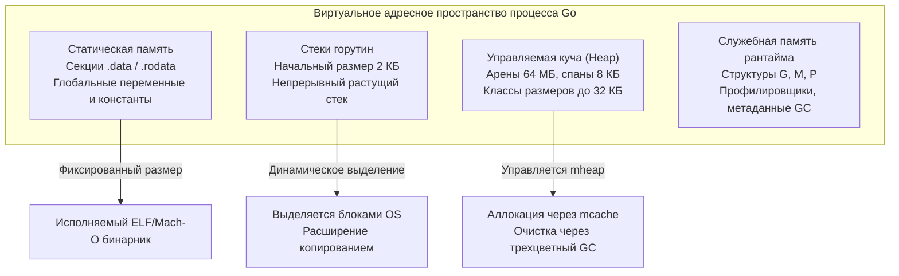
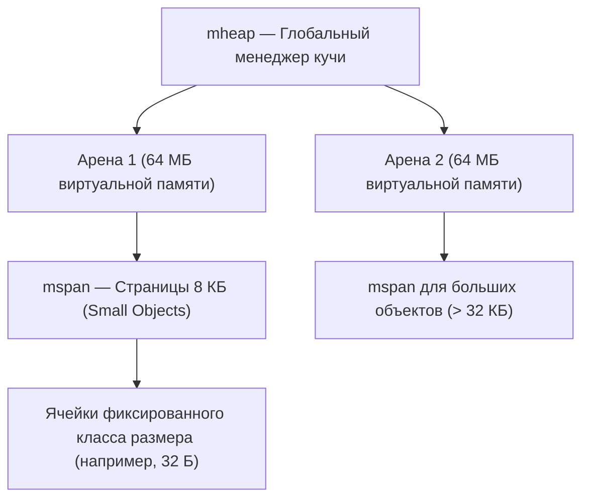

# Модель памяти Go

> *«Программист, не знающий устройства памяти своей среды исполнения, подобен строителю, который считает землю под фундаментом абсолютно твердой и однородной. На самом деле под нами — тектонические плиты виртуальной памяти ОС, зыбучие пески аллокаций в куче и стремительные горные ручьи стековых фреймов. Модель памяти — это свод физических законов, определяющий, устоит ли здание под нагрузкой».*  
> — Брайан Керниган

---

## Что такое «модель памяти» в контексте Go

Завершив детальный разбор процессорных оптимизаций и кэш-дружественности ([[8. Cache friendliness]]), мы спускаемся на следующий фундаментальный уровень инженерного мастерства — подсистему оперативной памяти. В высоконагруженных системах производительность программы диктуется не столько количеством тактов на арифметику, сколько тем, **откуда извлекаются байты** — из молниеносных стековых фреймов в L1-кэше, из централизованных арен сборщика мусора или из далекой оперативной памяти DRAM.

В профессиональном сообществе Go термин «модель памяти» несет в себе **два взаимодополняющих значения**, и каждый Senior-инженер обязан безупречно владеть обоими:

1. **Спецификация модели памяти (Go Memory Model):**  
   Формальный математический контракт между языком, компилятором и микроархитектурой процессора (официально зафиксированный в [go.dev/ref/mem](https://go.dev/ref/mem)). Этот контракт определяет отношения **happens-before**: при каких условиях запись переменной в одной горутине гарантированно станет видимой для чтения в другой горутине. Без строгого понимания этого контракта невозможно написать ни один корректный конкурентный алгоритм (подробнее в разделе [[06. Конкурентность]]).

2. **Архитектурная модель организации памяти (Runtime Memory Layout):**  
   Инженерное устройство виртуального адресного пространства процесса, поддерживаемое рантаймом Go: структура непрерывного стека горутин, секции статических данных исполняемого файла, трехуровневый аллокатор кучи (на базе идей TCMalloc: `mcache`, `mcentral`, `mheap`), разбиение на арены и спаны, а также взаимодействие с аппаратным буфером трансляции адресов MMU (TLB). Именно эта архитектура является фундаментом для понимания стека и кучи ([[2. Heap vs stack]]), анализа побега переменных ([[3. Escape analysis]]), профилирования аллокаций ([[4. Allocation profiling]]) и оптимизации сборщика мусора ([[05. Garbage Collector]]).

В этой лекции мы детально разберем обе грани модели памяти, соединим их с концепцией механического сочувствия к машине ([[5. Mechanical sympathy в backend разработке]]) и покажем, как физическая укладка структур данных определяет, будет ли программа работать на предельной скорости кремния.

---

## Модель памяти с точки зрения конкурентности

Формальная спецификация [go.dev/ref/mem](https://go.dev/ref/mem) определяет порядок наблюдаемости мутаций в памяти через отношение частичного порядка **happens-before** («произошло-до»).

Современные процессоры (x86 с буферами Store Buffer, ARM с моделью слабой памяти Weak Memory Ordering) и оптимизирующие компиляторы агрессивно переупорядочивают инструкции чтения и записи, если эти инструкции не зависят друг от друга внутри одного потока. Более того, ядра CPU держат данные в локальных Store Buffers и L1-кэшах. Без специальных аппаратных барьеров памяти (memory barriers) запись в память на Ядре 0 может часами оставаться «невидимой» для Ядра 1!

### Базовые гарантии happens-before:
Если горутина $A$ выполняет запись в переменную, а горутина $B$ читает эту же переменную, то горутина $B$ увидит результат записи горутины $A$ **только и исключительно в том случае**, если между операциями существует цепочка синхронизации happens-before.

Связь happens-before создается следующими примитивами рантайма:
- **Инициализация пакета:** Инициализация всех переменных пакета и выполнение функций `init()` происходит строго *до* запуска функции `main()`.
- **Создание горутины (`go func()`):** Инструкция `go` запускает новую горутину строго *после* всех событий, предшествовавших оператору `go`.
- **Завершение горутины:** Завершение горутины не гарантирует happens-before само по себе; упорядочивание достигается через `sync.WaitGroup` (`wg.Done()` -> `wg.Wait()`) или закрытие канала (`channel close`).
- **Синхронизация через каналы (`chan`):** 
  - Отправка в канал происходит *до* завершения соответствующего чтения из этого канала;
  - Закрытие канала (`close(ch)`) происходит *до* получения нулевого значения получателем;
  - Прием из небуферизованного канала происходит *до* завершения отправки в этот канал (rendezvous-синхронизация).
- **Мьютексы (`sync.Mutex`, `sync.RWMutex`):** Для любого `sync.Mutex` вызов `Unlock()` происходит *до* того, как завершится любой последующий вызов `Lock()`.
- **Однократная инициализация (`sync.Once`):** Выполнение блока кода внутри `sync.Once.Do(f)` происходит *до* возврата из любого параллельного вызова `Do(f)`.
- **Условные переменные (`sync.Cond`):** Вызов `Signal()` или `Broadcast()` упорядочивает пробуждение горутин, заблокированных на `Wait()`.
- **Атомарные операции (`sync/atomic`):** Начиная с Go 1.19 в язык внедрены типизированные атомики (`atomic.Int64`, `atomic.Pointer[T]`), которые предоставляют последовательно согласованную модель (Sequential Consistency) для атомарных операций чтения, записи и CAS (`CompareAndSwap`). Однако базовая семантика без барьеров использует relaxed ordering, что требует дисциплины.

### Классический пример гонки данных (Data Race):

```go
var a, b int

func f1() { a = 1; b = 2 }
func f2() { print(b); print(a) }
```

Если горутины `go f1()` и `go f2()` выполняются параллельно без примитивов синхронизации, программа содержит состояние гонки (data race). Результатом вывода может стать не только очевидные `00`, `21`, но и парадоксальное **`02`** — потому что запись `a=1` еще не видна в кэше второго ядра, а `b` уже прочитано! Компилятор имеет полное право поменять местами инструкции `b = 2` и `a = 1` внутри `f1`, а процессор — сбросить кэш-линию переменной `b` раньше, чем переменную `a`.

Подробнее стоимость различных примитивов синхронизации рассмотрена в [[5. Sync primitives и их стоимость]] и [[6. Mutex vs channel]].

> [!tip] Собеседование: Примитивы happens-before
> **Вопрос:** Какие операции в языке Go гарантируют отношение happens-before между параллельными горутинами?  
> **Ответ:** Запуск горутины (`go func()`), завершение горутины через координацию с `sync.WaitGroup` или закрытие канала, операции блокировки `sync.Mutex` (вызов `Unlock()` гарантированно предшествует последующему возврату из `Lock()`), гарантия завершения функции внутри `sync.Once.Do`, координация `sync.Cond` (`Signal`/`Broadcast` до пробуждения из `Wait`), отправка и получение данных из канала (`chan`), а также операции пакета `sync/atomic` с последовательным порядком исполнения.

---

## Архитектурная модель памяти: как Go раскладывает данные

Рантайм Go структурирует виртуальное адресное пространство процесса на четыре четко разграниченные функциональные зоны:



### Статическая память
Глобальные переменные, строковые литералы, таблицы интерфейсов (`itab`) и константы размещаются в неизменяемой секции `.rodata` и инициализированной секции `.data` исполняемого файла. Эта память мапится ядром ОС при старте процесса. 
- Она абсолютно «бесплатна» для сборщика мусора: GC никогда не сканирует её на предмет освобождения;
- Она обладает максимальной стабильностью в буфере TLB;
- Важно помнить: если глобальная переменная указывает на срез (`var data = make([]int, 1000)`), заголовок среза лежит в статической памяти, но сам массив элементов аллоцируется в динамической куче!

### Стек горутины
Каждая горутина в Go рождается с миниатюрным стеком размером всего **2 КБ**. Для сравнения: стандартный системный поток ОС (pthread в Linux) резервирует под свой стек от 2 до 8 МБ виртуальной памяти. Именно микроскопический стек позволяет Go запускать сотни тысяч горутин на скромном сервере, расходуя всего 200–300 МБ оперативной памяти.

#### Эволюция стека: от сегментов к непрерывным блокам
- **До Go 1.3: Сегментированный стек (Segmented Stack).**  
  Стек представлял собой связный список блоков памяти. Когда стек исчерпывался, рантайм аллоцировал новый сегмент и связывал их указателями. Это приводило к катастрофической проблеме «горячего расщепления» (hot split): если функция в цикле постоянно вызывала переполнение границы сегмента, рантайм на каждой итерации бесконечно выделял и освобождал сегмент памяти, обрушивая производительность в сотни раз.
- **Начиная с Go 1.4+: Непрерывный стек (Contiguous Stack).**  
  Рантайм отказался от сегментов. Если стековый фрейм не помещается в текущий размер (проверка вставляется компилятором в пролог каждой функции — инструкция `morestack`), рантайм выделяет новый непрерывный блок памяти **вдвое большего размера** (4 КБ, 8 КБ, 16 КБ ... до лимита 1 ГБ), копирует туда все фреймы старого стека, пересчитывает все указатели на стековые переменные и освобождает старый стек.

```
Сжатие и рост непрерывного стека:
[ 2 КБ ] --(переполнение)--> [ Выделение 4 КБ ] -> [ Копирование и фиксация указателей ] -> [ Освобождение 2 КБ ]
```

Инструменты инспекции стека:
- `runtime.Stack(buf, true)` — программное извлечение трассировки стеков всех горутин в байтовый буфер;
- Анализ дампов горутин pprof ([[4. goroutine dump]]);
- Переменная окружения `GODEBUG=stacktrace=1` для расширенной отладки при возникновении паники.

Преимущества стековой памяти:
1. **Предельная скорость:** Аллокация на стеке сводится к вычитанию значения из регистра указателя стека `RSP` — ровно **один такт CPU**!
2. **Нулевая нагрузка на GC:** Стековая память освобождается мгновенно при возврате из функции (`ADDQ $size, RSP`). Анализ побега компилятора ([[3. Escape analysis]]) борется за то, чтобы удержать переменные на стеке.
3. **Идеальное попадание в кэш:** Верхушка стека непрерывно прогрета в L1d-кэше процессора.

### Куча
Все объекты, чей жизненный цикл выходит за пределы стекового фрейма функции, вытесняются в динамическую кучу (Heap).

Куча в Go спроектирована на основе архитектуры аллокатора **TCMalloc** (Thread-Caching Malloc) и оптимизирована под минимальную межпоточную конкуренцию:
1. **Арены (`arena`):** Глобальная память кучи резервируется у операционной системы непрерывными блоками по **64 МБ** (на 64-битных ОС).
2. **Спаны (`mspan`):** Внутри арен память делится на спаны — непрерывные цепочки страниц виртуальной памяти (базовый размер страницы рантайма Go — **8 КБ**).
3. **Классы размеров (Size Classes):** Спаны нарезаются на ячейки строго фиксированного размера для объектов от 8 байт до **32 КБ** (32768 байт). Объекты крупнее 32 КБ выделяются напрямую из глобальной кучи выделенными спанами.



Многоуровневая структура распределения:
- **`mcache` (локальный кэш логического процессора P):** Каждый планировщик $P$ владеет персональным кэшем спанов. Выделение мелких объектов происходит **вообще без блокировок мьютексов**!
- **`mcentral` (центральный пул спанов):** Если в локальном `mcache` закончились свободные ячейки требуемого класса размера, $P$ запрашивает новый спан из центрального пула `mcentral`, защищенного спинлоком.
- **`mheap` (глобальная куча):** Управляет всеми аренами виртуальной памяти и крупными объектами.

> [!info] Под капотом: Таблица классов размеров
> Рантайм Go определяет 67 фиксированных классов размеров для мелких объектов: 8, 16, 24, 32, 48, 64, 80, 96, 112, 128 ... вплоть до 32768 байт. Если вы аллоцируете структуру размером 33 байта, рантайм выделит под нее слот ближайшего большего класса — 48 байт. 15 байт составят неизбежную **внутреннюю фрагментацию**, за счет которой достигается фантастическая скорость аллокации за $O(1)$ без поиска подходящих блоков в куче.

### Память для рантайма
Служебные структуры планировщика (`g`, `m`, `p`), очереди ожидания сетевого поллера netpoller, буферы трассировщика execution tracer и самого профилировщика `pprof` выделяются специальным внутренним системным аллокатором (`fixalloc` и системный `sysAlloc`). Этот аллокатор спроектирован так, чтобы быть устойчивым к рекурсии: код профилировщика памяти ни в коем случае не должен профилировать сам себя или триггерить сборку мусора!

---

## Virtual Memory и TLB: ещё один уровень

Когда программа обращается к адресу в памяти, этот адрес является **виртуальным**. Аппаратный блок процессора **MMU (Memory Management Unit)** обязан транслировать виртуальный адрес в физический адрес на шине DRAM через 4-уровневую таблицу страниц (Page Tables: CR3 -> PML4 -> PDPT -> PD -> PT).

Каждый такой обход таблиц страниц (Page Walk) при промахе требует 4 последовательных чтения из оперативной памяти, добавляя колоссальные **40–80 наносекунд** задержки к каждому обращению!

Чтобы избежать этой катастрофы, внутри процессора размещен **TLB (Translation Lookaside Buffer)** — специализированный ассоциативный кэш трансляций страниц:

```
Виртуальный адрес -> [ Проверка в TLB ] --(Попадание: 0.5 нс)--> Физический адрес в RAM
                             |
                      (Промах TLB Miss)
                             v
              [ 4-уровневый Page Walk: 40-80 нс ]
```

- **Стек исключительно дружественен TLB:** Стек горутины занимает 2–8 КБ (1–2 страницы памяти по 4 КБ). Запись о странице стека постоянно удерживается в TLB ядра.
- **Фрагментированная куча разрушает TLB:** Если миллионы мелких объектов разбросаны по разным адресам виртуальной памяти (Pointer Chasing), процессор на каждом шаге получает не только Cache Miss, но и дорогостоящий **TLB Miss**.
- **Прозрачные большие страницы (Transparent Huge Pages, THP):** Использование страниц размером 2 МБ или 1 ГБ вместо стандартных 4 КБ кардинально расширяет емкость покрытия TLB. Go не управляет THP напрямую, однако ядро Linux способно автоматически объединять смежные спаны кучи в Huge Pages.

Применение непрерывных срезов (`[]T`) и предварительное выделение памяти ([[4. Предвыделение памяти]]) сохраняет пространственную локальность адресов, оберегая как кэши L1/L2, так и буфер TLB.

---

## Аппаратное выравнивание и атомарность

Модель памяти Go неразрывно связана с требованиями кремниевых архитектур к выравниванию:
1. **Паддинг и границы слов:** Компилятор выравнивает поля структур по границе их естественного размера. Поле `uint64` обязано начинаться с адреса, кратного 8 байтам. Нарушение выравнивания на старых архитектурах приводило к аппаратному прерыванию (Bus Error), а на современных x86/ARM ведет к расщеплению доступа на две кэш-линии (Cache Line Split).
2. **Атомарные гарантии `sync/atomic`:** Аппаратные атомарные инструкции (такие как `LOCK CMPXCHG` на x86 или `LDREX/STREX` на ARM) требуют строгого естественного выравнивания операнда. Если попытаться вызвать `atomic.AddInt64` по невыровненному адресу, 32-битные архитектуры мгновенно завершат процесс аварийной паникой. При использовании низкоуровневых манипуляций с `unsafe.Pointer` инженер обязан вручную гарантировать корректный паддинг (см. [[9. Cache line и выравнивание]]).

---

## Инструменты исследования памяти

Для системного анализа подсистемы памяти в распоряжении Go-инженера имеется полный арсенал инструментов:

- **Контроль размера стека:**  
  Функция `runtime/debug.SetMaxStack` позволяет ограничить предельный размер стека одной горутины (по умолчанию равен 1 ГБ на 64-битных системах), предотвращая исчерпание памяти при неконтролируемой рекурсии. `runtime/debug.PrintStack()` выводит мгновенный снимок стека текущей горутины.
- **Метрики аллокатора кучи:**  
  Вызов `runtime.ReadMemStats(&m)` заполняет детальную структуру `runtime.MemStats` (общий объем аллоцированной памяти `HeapAlloc`, количество активных объектов `HeapObjects`, объем спанов `HeapInuse`, статистика пауз GC).
- **Частота сэмплирования профилировщика:**  
  Переменная `GODEBUG=memprofilerate=1` заставляет рантайм сэмплировать абсолютно каждую аллокацию (в продакшене по умолчанию 1 сэмпл на каждые 512 КБ), что бесценно для точного локального тестирования бенчмарков.
- **pprof Memory Profile:**  
  Профилирование пространства памяти ([[5. pprof memory profile]]) в четырех проекциях: `inuse_space`, `inuse_objects`, `alloc_space`, `alloc_objects`.
- **Инспекция уровня операционной системы:**  
  Анализ карты распределения виртуальных регионов через `/proc/<pid>/maps`, а также утилиты `pmap -x <pid>` и `smem` позволяют точно отделить стек и приватные страницы кучи от разделяемой памяти и кодовых секций.

---

## Связь с производительностью: резюме

Ключевые инженерные выводы, определяющие мышление Senior Go-разработчика:
- **Стек — территория абсолютной скорости:** Переменные, оставшиеся на стеке, выделяются за один машинный такт, очищаются мгновенно без участия GC и гарантируют попадание в L1-кэш и TLB.
- **Куча — неизбежная, но контролируемая плата:** Выделение в куче влечет за собой работу аллокатора `mcache`, периодическое сканирование трехцветным GC, риск фрагментации и промахи TLB.
- **Учитывайте классы размеров:** Понимание дискретной сетки размеров спанов рантайма (до 32 КБ) помогает избегать потерь на внутренней фрагментации памяти.
- **Конкурентность требует явных контрактов:** Без примитивов happens-before любые надежды на то, что «горутины увидят изменения переменных вовремя», иллюзорны из-за аппаратных Store Buffers и кэшей ядер.
- **Измеряйте объективно:** Используйте `runtime.ReadMemStats`, `pprof` и флаги `GODEBUG`, чтобы опираться на строгие факты профиля.

---

## Итог

- Модель памяти Go — это синтез математической спецификации взаимодействия горутин (**happens-before**) и физической архитектуры размещения данных в виртуальной памяти процесса (**стек, арены кучи, спаны `mspan`**).
- Конкурентная безопасность опирается на формальные барьеры синхронизации: запуск горутины, каналы, мьютексы, атомики и `sync.Once`.
- Непрерывный стек горутины (Contiguous Stack) стартует с 2 КБ и динамически удваивается по мере необходимости, решая историческую проблему «hot split» и гарантируя максимальную локальность.
- Аллокатор кучи на базе TCMalloc минимизирует блокировки благодаря локальным кэшам `mcache` на каждый логический процессор $P$ и спанам с фиксированными классами размеров.
- Механическое сочувствие связывает виртуальную память, TLB и кэш-линии: последовательные структуры данных защищают программу от дорогостоящих аппаратных промахов трансляции адресов.

В следующей лекции мы разберем главный водораздел распределения памяти в Go: противостояние стека и кучи — [[2. Heap vs stack]], и выясним, какую цену процессор платит за каждый байт, покинувший пределы локального стека.