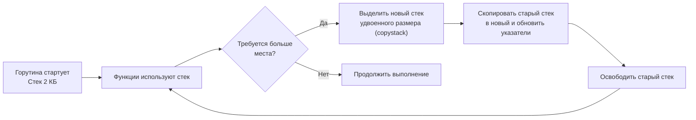

# Heap vs stack

> *«Стек — это блокнот на вашем рабочем столе: вы мгновенно делаете заметку карандашом, а закончив мысль, просто переворачиваете страницу. Затраты равны нулю. Куча — это склад долгосрочного хранения: вам нужно заполнить накладную, получить складскую ячейку, регулярно платить за инвентаризацию и уборку мусора. Разумный инженер держит на столе всё, что нужно прямо сейчас, и обращается к складу только тогда, когда вещь должна пережить рабочий день».*  
> — Брайан Керниган

---

## Почему «стек или куча» — первый вопрос о производительности

В предыдущей главе ([[1. Memory model Go]]) мы познакомились с общей архитектурой памяти процесса в Go: от статических секций до динамических спанов и формальных отношений happens-before. Теперь мы подошли к самому фундаментальному водоразделу, определяющему производительность любого backend-сервиса: **стек против кучи**.

В языках низкого уровня (C, C++) разработчик управляет памятью вручную: системные вызовы `malloc`/`free` требуют предельной дисциплины и чреваты фатальными ошибками (use-after-free, double free, утечки памяти). Язык Go избавляет нас от ручного ада: здесь нет `free`, а решение о том, где физически родится переменная, принимает оптимизатор компилятора с помощью алгоритма **анализа побега (escape analysis)** ([[3. Escape analysis]]).

Однако автоматизация не отменяет законов физики. Размещение объекта на стеке занимает доли наносекунды и не оставляет после себя ни следа. Попадание же объекта в кучу немедленно запускает тяжелый каскад накладных расходов: поиск свободного слота в аллокаторе, нагрузку на буфер TLB, постоянную слежку со стороны трехцветного сборщика мусора и промахи кэша.

Senior-инженер не просто пишет код, надеясь на компилятор, — он ясно видит, какие синтаксические конструкции удерживают данные на быстром стеке, а какие насильно выталкивают их в кучу, и умеет диагностировать это через профилирование ([[4. Allocation profiling]], [[5. pprof memory profile]]).

---

## Стек горутины: сверхбыстрая временная память

Каждая горутина в Go рождается на свет с компактным собственным стеком размером всего **2 КБ**. По сравнению со стеками потоков операционной системы (1–8 МБ) стек горутины почти невесом, что позволяет микросервису легко держать миллионы конкурентных задач в памяти.

Стек предназначен для данных с детерминированным, строгим временем жизни:
- аргументы вызываемых функций и возвращаемые значения;
- локальные переменные, чей жизненный цикл не выходит за рамки завершения текущей функции;
- адреса возврата инструкций и регистровые фреймы вызовов.

### Архитектура Contiguous Stack
Стек горутины непрерывен в виртуальной памяти. Если в процессе работы глубина вызовов или локальные буферы превышают 2 КБ, рантайм Go не паникует. В пролог каждой функции компилятор вставляет проверку указателя стека (`runtime.morestack`).

Если места недостаточно, рантайм вызывает процедуру `runtime.copystack`:
1. Выделяется новый непрерывный блок памяти ровно **вдвое большего размера** (4 КБ, 8 КБ, 16 КБ ... вплоть до лимита 1 ГБ);
2. Старый стек полностью копируется в новый фрейм за фреймом;
3. Рантайм аккуратно обходит все указатели, смотрящие внутрь перемещенного стека, и сдвигает их на дельту смещения;
4. Старый стек освобождается.



Хотя расширение стека через `runtime.copystack` требует десятков микросекунд, оно происходит считанные разы за время жизни горутины, после чего амортизированная стоимость стековых операций стремится к нулю.

### Характеристики стека с точки зрения «железа»

- **Экстремально быстрый доступ.** Вершина стека почти всегда прогрета в кэше данных L1d. Процессор непрерывно оперирует регистром указателя стека `RSP` (или `SP`/`FP` во фреймах Go), поэтому чтение и запись локальных переменных происходят за 1–2 такта без ожидания оперативной памяти.
- **Мгновенная очистка.** «Освобождение» памяти при возврате из функции сводится к одной инструкции добавления константы к регистру указателя стека (`ADDQ $size, RSP`). Никаких системных вызовов, никакого GC, никакого обхода графов. Память мгновенно готова для использования следующим вызовом.
- **Идеальная пространственная локальность.** Данные стека упакованы последовательно и плотно, великолепно укладываясь в 64-байтные кэш-линии CPU.
- **Абсолютная изоляция (Zero Contention).** У каждой горутины собственный стек — здесь физически не может возникнуть конкуренции ядер за память аллокатора.

Единственное фундаментальное ограничение стека: данные не могут пережить завершение функции, в которой они родились.

---

## Куча: динамическая память с полным сервисом

Куча (Heap) — это общее адресное пространство процесса, предназначенное для объектов с непредсказуемым временем жизни:
- данные, на которые возвращаются указатели наружу из функции;
- структуры, сохраняемые в глобальные переменные или поля долгоживущих объектов;
- переменные, захваченные фоновыми замыканиями;
- сообщения, отправленные в каналы (`chan`).

Куча управляется автоматическим сборщиком мусора ([[1. GC в Go. Обзор]]). Любая аллокация в куче проходит через трехуровневую иерархию рантайма Go (как мы изучили в [[1. Memory model Go]]):
```
Локальный кэш процессора P (mcache) -> Центральный пул спанов (mcentral) -> Глобальная куча (mheap)
```
Мелкие объекты размером до **32 КБ** выделяются из локального `mcache` без глобальных блокировок. Но даже этот «быстрый путь» требует десятков инструкций и 10–50 наносекунд, в то время как аллокация на стеке занимает ровно **один такт** (0.2 нс)!

### Цена кучи

Каждый байт, оказавшийся в куче, обходится процессу дорого:
1. **Накладные расходы аллокации:** Поиск слота в спане, возможное обращение к `mcentral` со спинлоком, обязательное обнуление памяти (zeroing).
2. **Нагрузка на Garbage Collector (GC Overhead):** Каждый кучевой объект регистрируется в рантайме. Трехцветный сборщик мусора обязан отслеживать его в фазах разметки ([[2. Tri color marking]], [[4. Concurrent GC]]), создавая микропаузы ([[6. GC pause и latency]]). При любой перезаписи указателя в куче процессор обязан выполнить барьер записи (**write barrier**, [[5. Write barriers]]), добавляющий накладные расходы к простым операциям присваивания.
3. **Кэш-промахи (Cache Misses):** Объекты в куче выделяются в разное время и разбросаны по виртуальному адресному пространству (Pointer Chasing). Обход структур в куче приводит к непрерывным промахам кэша L1/L2/L3.
4. **Промахи трансляции адресов (TLB Misses):** Разрозненные кучевые объекты заставляют блок MMU постоянно промахиваться мимо TLB, требуя медленного 4-уровневого Page Walk в DRAM (см. [[1. Memory model Go]]).
5. **Фрагментация памяти:** Несмотря на фиксированную сетку классов размеров, куча страдает от внутренней и внешней фрагментации ([[7. Fragmentation]]), увеличивая RSS-память процесса.

---

## Escape Analysis: кто решает судьбу переменной

В компиляторе Go (`cmd/compile`) этап SSA-оптимизации включает в себя строгий алгоритм **анализа побега (escape analysis)** (подробно разобранный в [[3. Escape analysis]]).

Компилятор строит направленный граф потока данных и проверяет: может ли ссылка на переменную выйти за пределы стекового фрейма вызывающей функции?

```go
func createOnHeap() *int {
    x := 42
    return &x // &x убегает в вызывающий код -> компилятор выделяет x в куче
}

func keepOnStack() int {
    x := 42
    return x // значение копируется через регистр/стек, переменная x остается на стеке
}
```

В языке C функция вроде `createOnHeap()` привела бы к катастрофе (Dangling Pointer на уничтоженный стековый фрейм). В Go возвращать указатель на локальную переменную абсолютно безопасно: компилятор видит побег указателя и автоматически переносит переменную `x` в кучу.

Однако анализ побега консервативен. Компилятор не может знать контекст времени выполнения, поэтому при малейшем подозрении на небезопасность он перестраховывается и отправляет переменную в кучу (например, при передаче в `fmt.Println` или интерфейс).

---

## Сравнение на примере: стек vs куча в цифрах

Сопоставим аппаратные характеристики доступа к стеку и куче на современном x86-64 процессоре:

| Критерий | Стек (Stack) | Куча (Heap) | Разница |
|---|:---:|:---:|:---:|
| **Выделение памяти** | **0.1–0.2 нс** (вычитание SP) | **10–50 нс** (быстрый путь mcache) | **Стек быстрее в 100+ раз** |
| **Доступ к данным** | **1–2 такта** (L1 hit) | **4–12 нс** (L2/L3 hit) или **80 нс** (RAM) | **Стек быстрее в 10–50 раз** |
| **Освобождение памяти** | **0 нс** (сдвиг SP при возврате) | **0 нс** в момент вызова, но тяжелая работа GC в фоне | **Стек не создает отложенных долгов** |
| **Влияние на сборщик мусора** | **Нулевое** (GC игнорирует стек) | Добавляет объект в граф, активирует write barrier | **Стек спасает от GC-пауз** |
| **Конкуренция потоков** | **Отсутствует** (персонально для $G$) | Возможен contention при исчерпании `mcache` | **Стек изолирован** |

---

## Как писать код, дружественный стеку

Каждый опытный инженер стремится структурировать горячие пути программы так, чтобы переменные удерживались на стеке. Вот шесть ключевых правил:

### 1. Избегайте ненужных указателей
Передача компактных структур по значению приводит к быстрому регистровому копированию и гарантирует размещение на стеке:

```go
// Плохо: передача по указателю часто заставляет компилятор отправить буфер в кучу
func process(b *Buffer) { ... }

// Хорошо: передача по значению (для структур до 64–128 байт)
func process(b Buffer) { ... }
```
Структуры размером в одну-две кэш-линии (**64–128 байт**) копируются за несколько тактов через регистры процессора. Использование указателя для таких малых объектов почти всегда контрпродуктивно.

### 2. Не возвращайте указатели на локальные переменные без нужды
Если фабричная функция конструирует небольшую структуру, возвращайте ее **по значению**. Компилятор Go положит ее напрямую в стековый фрейм вызывающей функции без захода в кучу.

### 3. Используйте make с предвыделением в горячих циклах
Когда вы вызываете `make([]int, 0, 100)`, заголовок слайса (24 байта: `ptr`, `len`, `cap`) размещается на стеке, но его базовый массив (backing array) выделяется в куче. Чтобы снизить частоту аллокаций, всегда предвыделяйте емкость (`cap`), предотвращая каскадные реалокации ([[4. Предвыделение памяти]]).

### 4. Осторожно с интерфейсами
Передача конкретной структуры в аргумент типа `interface{}` (или `any`) приводит к **боксингу (boxing)**: рантайм упаковывает значение в пару указателей (`itab`, `data`), что практически всегда уводит структуру в кучу! В критических путях заменяйте интерфейсы на дженерики (Go 1.18+), которые мономорфизируются при компиляции без аллокаций.

### 5. Избегайте замыканий, захватывающих переменные
Если анонимная функция запускается в горутине и захватывает внешнюю переменную по ссылке, эта переменная обречена на побег в кучу:

```go
// Плохо: x уйдёт в кучу, т.к. замыкание может пережить породившую функцию
x := 42
go func() { fmt.Println(x) }()

// Лучше: передать значение копией через явный аргумент горутины
go func(val int) { fmt.Println(val) }(x)
```

### 6. Держите объекты в стеке с помощью sync.Pool? Нет, наоборот
Среди начинающих разработчиков бытует заблуждение, будто `sync.Pool` сохраняет объекты на стеке. Это не так: `sync.Pool` ([[2. sync Pool]]) оперирует объектами исключительно в куче. Его задача — не перенос на стек, а **переиспользование уже выделенных кучевых объектов**, чтобы не нагружать аллокатор новыми запросами.

---

## Инструменты: как узнать, где живёт переменная

Чтобы проверить, куда компилятор отправил вашу переменную, не нужно строить догадок:

### 1. Отчет компилятора по Escape Analysis
Запустите сборку пакета со специальными флагами компилятора:

```bash
go build -gcflags="-m" ./...
```

Типичный вывод компилятора:
```text
./main.go:42:2: moved to heap: x
./main.go:15:3: foo does not escape
```
Для получения исчерпывающего графа зависимостей побега увеличьте уровень детализации:
```bash
go build -gcflags="-m -m" ./...
```

### 2. Профилирование аллокаций в pprof
Команда профилирования памяти ([[5. pprof memory profile]]) с флагом `-alloc_space` покажет общий объем байт, аллоцированных в куче каждой строчкой кода:
```bash
go tool pprof -alloc_space mem.pprof
```

### 3. Бенчмарки памяти
Ключ `-benchmem` при запуске тестов наглядно демонстрирует метрики `allocs/op` (число кучевых аллокаций на операцию) и `B/op` (число выделенных байт):
```bash
go test -bench=. -benchmem
```
Если ваш бенчмарк показывает `0 allocs/op` — вы добились идеального размещения на стеке!

### 4. Индикаторы CPU-профиля
В CPU-профиле ([[2. CPU profiling в Go]]) время, занятое служебными функциями `runtime.mallocgc` (выделение в куче) и `runtime.gcBgMarkWorker` (фоновая разметка GC), прямо указывает на чрезмерное бегство объектов в кучу.

---

## Ловушки и мифы

> [!warning] Ловушка: Переменные внутри функции всегда живут на стеке
> Это самое распространенное заблуждение новичков. Тот факт, что переменная объявлена через `:=` внутри функции, ничего не гарантирует. Возврат ссылки `&v`, сохранение в поле внешней структуры, вызов интерфейсного метода, передача в `fmt.Println`, запуск в горутине, передача в `defer` с замыканием — любая из этих операций мгновенно заставляет компилятор выселить переменную в кучу.

> [!warning] Ловушка: Стек быстрее абсолютно всегда
> Стек действительно бесплатен при обычном использовании, но он динамически расширяется. Если вы объявите на стеке локальный массив огромного размера (например, `var buf [10 * 1024 * 1024]byte`), это спровоцирует аварийный каскад вызовов `runtime.copystack` с копированием мегабайт памяти. Массивные буферы должны осознанно жить в куче или пуле `sync.Pool`.

> [!warning] Ловушка: Слайс целиком лежит на стеке
> Слайс — это заголовок размером 24 байта: ptr, len, cap. Сам заголовок (структура `reflect.SliceHeader`) может оставаться на стеке, но его базовый массив (Backing Array) почти всегда аллоцируется в куче, если только он не срезан с локального стекового массива фиксированного размера.

---

## Mechanical Sympathy: стек в кэше, куча в RAM

С точки зрения кремния стек и куча — антагонисты:
- **Стек — союзник конвейера:** Его линейная структура и детерминированный рост идеально сочетаются с логикой аппаратного префетчера (Hardware Prefetcher). Верхушка стека всегда висит в L1-кэше, а страница стека никогда не вымывается из TLB.
- **Куча — источник энтропии:** Объекты создаются фрагментарно. Доступ по указателям сбивает предсказатель адресов, перегружает шину памяти случайными обращениями к DRAM и загрязняет кэши процессора при проходах сборщика мусора.

Минимизация бегства объектов в кучу — это не микрооптимизация, а фундаментальная забота об аппаратном благополучии вашего процессора.

---

## Итог

- **Стек** — сверхбыстрая память с автоматической очисткой, идеальная для локальных данных. Аллокация занимает доли наносекунды (сдвиг `RSP`), не требует участия GC и гарантирует попадание в L1-кэш.
- **Куча** — универсальное, но ресурсоемкое хранилище объектов с неопределенным жизненным циклом. Сопряжена с работой аллокатора, барьерами записи `write barrier`, фрагментацией и паузами сборщика мусора.
- **Escape Analysis** — арбитр компилятора, определяющий размещение данных.
- **Практика инженера:** Передавайте небольшие структуры по значению, используйте дженерики вместо `interface{}`, избегайте захвата переменных в замыканиях и предвыделяйте емкость слайсов.
- **Контроль:** Регулярно запускайте сборку с `-gcflags="-m"` и бенчмарки с `-benchmem`, контролируя показатель `0 B/op`.

В следующей лекции мы детально разберем скрытые механизмы самого арбитра: [[3. Escape analysis]] — узнаем, по каким правилам компилятор Go принимает решения о побеге, где он перестраховывается и как помочь ему удержать данные на стеке.