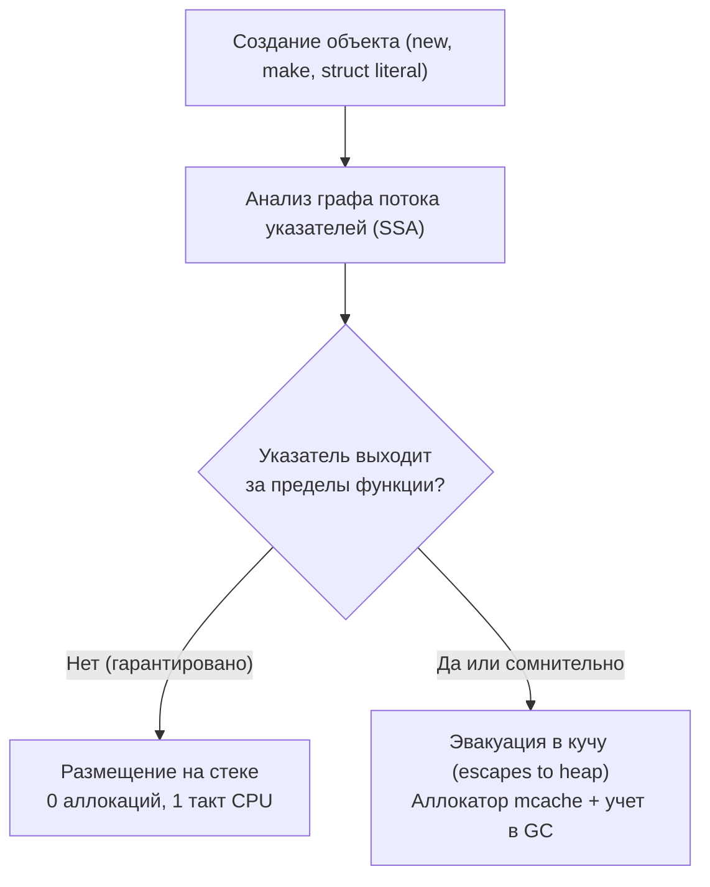

# Escape analysis

> *«Компилятор Go при анализе побега переменных напоминает предельно бдительного пограничника: он обязан гарантировать, что ни один указатель не пересечет границу стекового фрейма функции нелегально. Если есть хоть малейшее сомнение, что объект переживет вызов или будет кем-то разделен, выносится вердикт: эвакуация в кучу. Наша задача как инженеров — не спорить с пограничником, а предъявлять код с безупречным алиби для стека».*  
> — Брайан Керниган

---

## Почему компилятор решает, где жить переменной

В предыдущей статье ([[2. Heap vs stack]]) мы выяснили фундаментальную истину микроархитектуры: стековая память — это экстремальная скорость (1 такт CPU) и нулевая нагрузка на сборщик мусора, а куча — это комплексная плата за гибкость с накладными расходами аллокатора, барьеров записи и промахов кэша.

Но в Go у разработчика нет ключевых слов `stack` или `heap`, как нет и явного вызова освобождения памяти. Решение о том, где физически материализуется каждый байт вашей структуры, принимает **анализ побега (Escape Analysis)** — специализированная фаза оптимизации компилятора (`cmd/compile`), анализирующая граф потока указателей на этапе статической сборки.

Понимание механизмов escape analysis — один из самых мощных рычагов в руках Senior Go-разработчика. Оно объясняет, почему визуально безобидный лог в цикле может порождать гигабайты мусора в секунду, и позволяет целенаправленно оптимизировать горячие пути сервисов, не жертвуя идиоматичностью и выразительностью языка Go. 

В этой главе мы заглянем под капот алгоритма анализа, научимся расшифровывать отчеты компилятора, разберем главные триггеры побега и проверим их влияние инструментами профилирования ([[5. pprof memory profile]], [[4. Allocation profiling]]).

---

## Что такое Escape Analysis

**Escape Analysis** — это алгоритм статического анализа потока данных (Data-Flow Analysis), выполняемый компилятором Go над промежуточным SSA-представлением программы.

Его фундаментальная цель: для каждого выражения создания объекта (литералы структур, вызовы `new()`, `make()`, создание замыканий) строго доказать, что **время жизни этого объекта ограничено временем жизни текущего стекового фрейма**.
- Если доказательство получено: объект аллоцируется на стеке функции;
- Если компилятор видит, что ссылка на объект может пережить фрейм, либо не может это опровергнуть: объект эвакуируется в кучу (**escapes to heap**).

### Принцип архитектурного консерватизма
Главное правило escape analysis: **компилятор предельно консервативен**.  
Если из-за динамического полиморфизма интерфейсов, сложного ветвления или межпакетных вызовов компилятор не имеет 100% математического доказательства безопасности стека, он **всегда выбирает кучу**. Безопасность памяти (Memory Safety — отсутствие Dangling Pointers) для создателей Go безусловно важнее наносекунд производительности.



---

## Как компилятор решает: основные критерии убегания

Рассмотрим канонические ситуации, при которых переменная неизбежно покидает безопасный стек и отправляется в кучу.

### 1. Возврат указателя из функции
Классический паттерн фабричных методов:

```go
func newInt() *int {
    x := 42
    return &x // &x уходит за пределы фрейма → x в куче
}
```
В языках C/C++ возвращение указателя на локальную переменную привело бы к UB и разрушению стека. В Go компилятор анализирует сигнатуру: адрес `&x` покидает стек вызываемой функции и будет доступен вызывающему коду. Переменная `x` принудительно эвакуируется в кучу.

### 2. Отправка в канал
Значение, отправленное в канал, предназначено для другой, конкурентной горутины, чье время жизни абсолютно независимо от текущего фрейма:

```go
ch := make(chan *int)
x := 42
ch <- &x // x убегает в кучу
```
Даже если канал небуферизированный и чтение произойдет мгновенно, компилятор оперирует статическим анализом потока данных, в котором отправка в канал является безусловной точкой побега.

### 3. Сохранение в глобальную переменную или поле структуры, которая переживёт функцию
Если указатель на локальную переменную записывается в глобальное состояние или поле структуры, живущей дольше текущего вызова, компилятор немедленно перемещает ее в кучу:

```go
var global *int

func f() {
    x := 1
    global = &x // убегает, т.к. global переживёт f
}
```
Аналогичное правило действует для сохранения указателей в глобальные слайсы или мапы.

### 4. Вызов методов через интерфейс
Приведение конкретного типа данных к интерфейсному типу `interface{}` (или `any`) влечет за собой процедуру **боксинга (boxing)**:

```go
func print(v interface{}) { fmt.Println(v) }

x := 42
print(x) // x уходит в кучу? зависит от escape-анализа fmt.Println
```
Рантайму Go для представления интерфейса необходима пара указателей: таблица методов `itab` и указатель на сами данные. Если вызываемая функция не заинлайнена, компилятор не может гарантировать, что метод интерфейса не сохранит ссылку у себя. Кроме того, стандартная функция `fmt.Println(v ...interface{})` принимает срез пустых интерфейсов, что практически гарантированно вызывает побег переданных аргументов в кучу.

### 5. Захват переменной замыканием
Если анонимная функция (замыкание) захватывает локальную переменную по ссылке и сохраняется, передается наружу или запускается в отдельной горутине:

```go
func start() {
    x := 0
    go func() { fmt.Println(x) }() // x убегает
}
```
Поскольку новая горутина выполняется асинхронно и гарантированно переживет фрейм функции `start`, переменная `x` разделяется между горутинами и обязана жить в куче.

### 6. Хранение в слайсе или мапе, которые могут пережить фрейм
Если вы создаете локальный слайс или ассоциативный массив и возвращаете его из функции, все элементы, на которые ссылается структура, эвакуируются в кучу: базовый массив (Backing Array) слайса аллоцируется через `runtime.makeslice` в куче.

### 7. Переменные в циклах, на которые берутся указатели
Если внутри цикла создается переменная и ее адрес сохраняется в накопительную коллекцию:

```go
var ptrs []*int
for i := 0; i < 10; i++ {
    x := i
    ptrs = append(ptrs, &x) // x убегает, т.к. слайс ptrs переживёт цикл
}
```
Поскольку срез `ptrs` переживает тело цикла, каждый экземпляр `x` эвакуируется в кучу, создавая 10 раздельных аллокаций.  
*(Начиная с Go 1.22 итерационная переменная `for range` имеет область видимости per-iteration, что защищает от логических ошибок замыканий, но взятие указателя и сохранение в слайс по-прежнему эвакуирует объект в кучу).*

---

## Как увидеть решения escape analysis

Компилятор Go открыт к диалогу: разработчик может в любой момент увидеть подробнейший протокол решений анализа побега с помощью флага компилятора `-gcflags="-m"`:

```bash
go build -gcflags="-m" .
```

Пример вывода:
```text
./main.go:7:6: can inline newInt
./main.go:8:9: &x escapes to heap
./main.go:7:13: moved to heap: x
```

Разбор строк протокола:
- `can inline newInt` — компилятор отмечает, что функция может быть заинлайнена (инлайнинг может кардинально изменить картину побега, позволив переменной остаться на стеке вызывающего фрейма!);
- `&x escapes to heap` — указатель на переменную покидает локальную область видимости;
- `moved to heap: x` — окончательный вердикт: переменная `x` аллоцируется в куче.

Если же переменная успешно удержана на стеке:
```text
./main.go:15:3: x does not escape
```

Для глубокого расследования сложных связей побега используйте флаг двойного уровня детализации:
```bash
go build -gcflags="-m -m" .
```
Он выведет цепочки зависимостей потока данных (flow graph), объясняющие, какое именно выражение заставило компилятор эвакуировать переменную.

---

## Escape analysis под капотом

> [!info] Под капотом: Пакет cmd/compile/internal/escape
> Реализация анализа побега сосредоточена в пакете `cmd/compile/internal/escape`. Анализ выполняется над промежуточным SSA-представлением кода (Static Single Assignment) и строит ориентированный граф потока данных (Directed Data Flow Graph). 
> 
> Каждому узлу графа (переменная, выражение, аргумент) присваивается уровень расположения (`location`): стек или куча. Анализ запускает процесс абстрактной интерпретации (Abstract Interpretation), проходя по узлам от так называемых **escape points** (точек побега):
> - операторы возврата `return`;
> - присваивание в глобальные переменные;
> - передача аргументов в сторонние невстроенные функции без директивы `//go:noescape`;
> - операции с каналами.
> 
> Если от точки побега существует путь к переменной, она помечается как `EscHeap`. Важно: с каждой версией Go компилятор становится умнее. Начиная с Go 1.22 переменные цикла `for range` создаются заново на каждой итерации, а механизм devirtualization в связке с PGO позволяет компилятору раскрывать типы за интерфейсами и устранять побег на стеке.

---

## Практические приёмы управления escape analysis

Понимая правила игры, инженер может проектировать код так, чтобы критические переменные оставались на стеке:

### 1. Избегайте возврата указателей на локальные переменные, если это не необходимо
Если создаваемая структура компактна (до одной-двух кэш-линий), возвращайте ее **по значению**:

```go
// Убегает в кучу: аллокатор mcache + GC
func makeConfig() *Config { return &Config{Timeout: 10} }

// Не убегает: создается на стеке вызывающего кода (если Config <= 64-128 байт)
func makeConfig() Config { return Config{Timeout: 10} }
```

### 2. Передавайте по значению, а не по указателю, когда это уместно
Если вызываемая функция лишь читает поля компактной структуры, передача по значению избавляет от создания указателя и гарантирует нулевой побег:

```go
func process(cfg Config) { ... }
```

### 3. Избегайте интерфейсов в горячих вызовах
Интерфейсы прячут конкретный тип за таблицей `itab`. В горячих циклах используйте дженерики (Generics, Go 1.18+): компилятор мономорфизирует параметризованный код под конкретный тип, устраняя боксинг и сохраняя переменные на стеке.

### 4. Не захватывайте переменные горутинами без необходимости
Передавайте аргументы в горутину явно через параметры функции:

```go
x := 42
go func(v int) { fmt.Println(v) }(x) // x передается по значению, избегая общего побега
```

### 5. Используйте //go:noinline только для отладки
Иногда инженеры отключают инлайнинг директивой `//go:noinline`, чтобы изолировать стек функции. В боевом коде этого делать нельзя: инлайнинг — главный союзник escape analysis, так как он стирает границы между функциями и позволяет переменным остаться на стеке родителя!

### 6. Следите за размером структур
Компилятор Go имеет внутренний лимит размера локальных переменных на стеке (эвристика порядка десятков килобайт). Если объявить структуру размером 10 МБ, компилятор принудительно отправит ее в кучу, чтобы не вызвать панического переполнения стека горутины.

---

## Проверка результата: профили памяти и бенчмарки

После изменения кода обязательно проверьте фактические аллокации через memory profile ([[5. pprof memory profile]]) или команду `go test -benchmem`.

Напишите микробенчмарк для горячей функции:

```go
func BenchmarkProcess(b *testing.B) {
    for i := 0; i < b.N; i++ {
        _ = process()
    }
}
```

Запуск:

```bash
go test -bench=. -benchmem
```

Следите за показателями:
- **`allocs/op`** — количество аллокаций в куче на одну операцию;
- **`B/op`** — количество выделенных байт кучи на операцию.

Если вам удалось свести метрику к **`0 B/op` и `0 allocs/op`**, вы добились идеального размещения на стеке, и сборщик мусора больше никогда не побеспокоит этот цикл.

---

## Типичные ловушки и неочевидные случаи

> [!warning] Ловушка: Сборка слайса с возвратом
> Если функция создает срез через `make([]T, 0, n)` и возвращает его вызывающему коду, заголовок среза передается по значению, но его базовый массив (Backing Array) неизбежно эвакуируется в кучу. Это штатное поведение. Однако добавление элементов в срез через `append` без предвыделения емкости породит многократные промежуточные аллокации в куче. Обязательно используйте предвыделение емкости ([[4. Предвыделение памяти]]).

> [!warning] Ловушка: Передача ...interface{} в логировании и форматировании
> Функции стандартной библиотеки `fmt.Printf`, `fmt.Sprintf` и устаревшие логгеры принимают аргументы `...interface{}`. Каждый переданный примитив (даже `int` или `bool`) боксится в интерфейс и убегает в кучу. В высокочастотных контурах используйте современный структурированный логгер `slog` с типизированными методами (`slog.Int`, `slog.String`), которые спроектированы под Zero-Allocation.

> [!warning] Ловушка: Скрытые указатели в строках и слайсах
> Тип `string` в Go под капотом содержит указатель на неизменяемый байтовый массив (`StringHeader`). Если функция конструирует строку из локального байтового среза через `string(bytes)` и возвращает ее, массив символов гарантированно копируется в кучу.

> [!warning] Ловушка: Межпакетный Escape Analysis
> Анализ побега работает в рамках компилируемого пакета (Package-level scope). Если функция пакета $A$ возвращает указатель наружу, компилятор не может знать, как этот указатель будет использоваться в импортирующем пакете $B$, и безоговорочно выталкивает данные в кучу. Проектируйте публичные API библиотек с возвратом структур по значению.

---

## Mechanical Sympathy: почему убегание вредит

Каждая переменная, выдавленная анализом побега в кучу, запускает цепную реакцию микроархитектурных потерь:
1. **Затраты CPU на маркировку:** Сборщик мусора обязан обойти каждый кучевой объект в фазе Mark ([[2. Tri color marking]]), расходуя вычислительные циклы ядер.
2. **Активация барьеров записи:** Мутация кучевых указателей сопровождается выполнением системных инструкций write barrier ([[5. Write barriers]]).
3. **Разрушение кэша и TLB:** Кучевые объекты фрагментируют память, вызывая шквал промахов кэш-линий и записей в TLB ([[1. Memory model Go]], [[8. Cache friendliness]]).

Стековые переменные живут компактно, линейно и умирают мгновенно. Побег в кучу — это всегда микроархитектурный долг.

---

## Итог

- **Escape Analysis** — невидимый арбитр компилятора Go, решающий судьбу каждого байта вашей программы.
- Главные триггеры побега: возврат указателя из функции, отправка в каналы, сохранение в глобальные структуры, замыкания горутин и боксинг в интерфейсы `interface{}`.
- Инспекция: используйте флаг `go build -gcflags="-m"` для изучения вердиктов компилятора.
- Инженерная тактика: отдавайте предпочтение передаче структур по значению, используйте дженерики вместо пустых интерфейсов, предвыделяйте срезы и применяйте `slog`.
- Валидация: контролируйте показатели `0 allocs/op` в бенчмарках с ключом `-benchmem`.

В следующей лекции мы перейдем от статического анализа к динамической практике: [[4. Allocation profiling]] — научимся снимать профили аллокаций, анализировать частоту выделения памяти и находить прожорливые участки под реальной нагрузкой.