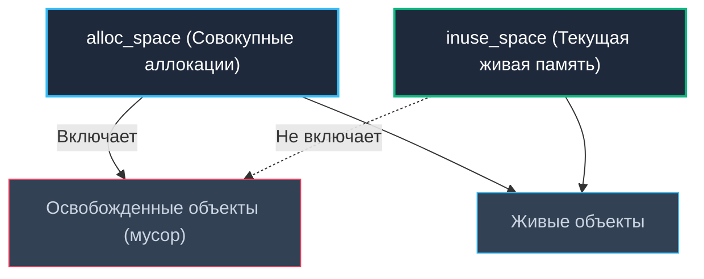

# pprof memory profile

> *«Демографическая перепись населения (inuse_space) учитывает только тех, кто жив на момент опроса. Но если родильное отделение и похоронная служба работают день и ночь, оформляя миллионы свидетельств (alloc_space), городская казна разорится на ритуальных расходах, даже если население не прибавило ни одного жителя. Профилировщик памяти pprof — это одновременно и перепись живых структур, и полный реестр всех родившихся и умерших объектов».*  
> — Брайан Керниган

---

## Профиль памяти как карта распределения объектов

В предыдущей лекции ([[4. Allocation profiling]]) мы освоили концептуальные основы профилирования аллокаций. Однако утилита `pprof` для работы с памятью — это не просто счетчик мегабайт, а сложнейший прецизионный микроскоп, тесно интегрированный в ядро рантайма Go.

Профиль памяти Go принципиально отличается от традиционных снимков кучи (Heap Dumps) в Java или Python. Вместо того чтобы замораживать весь процесс на минуты и записывать многогигабайтный слепок каждого объекта со всеми связями, рантайм Go ведет **непрерывное статистическое наблюдение за потоком аллокаций**. Это позволяет профилировать высоконагруженные production-сервисы под полной боевой нагрузкой с накладными расходами менее 1–2% CPU!

В этой главе мы разберем внутреннее устройство memory profile, систематизируем режимы отображения, научимся проводить дифференциальный сравнительный анализ (`-diff_base`), связывать метрики с анализом побега ([[3. Escape analysis]]) и поведением сборщика мусора ([[7. GOGC и tuning]]), заложив надежный фундамент для поиска утечек ([[6. Утечки памяти]]) и борьбы с фрагментацией ([[7. Fragmentation]]).

---

## Два взгляда на память: alloc_space и inuse_space

Профиль памяти в Go хранит два независимых пространственных среза данных, между которыми можно переключаться флагами командной строки или вкладками в веб-интерфейсе:



1. **`alloc_space` (и `alloc_objects`):**  
   Суммарный объем байт (и количество объектов), выделенных в куче за время наблюдения. Этот срез включает в себя как живые объекты, так и те, что уже давно были уничтожены и переработаны сборщиком мусора. Это метрика **кумулятивной нагрузки на подсистему памяти**.
2. **`inuse_space` (и `inuse_objects`):**  
   Объем байт (и количество объектов), удерживаемых активными указателями непосредственно в момент фиксации профиля. Это срез **фактического потребления оперативной памяти**.

> [!IMPORTANT]
> Обратите внимание на поведение `go tool pprof` по умолчанию: если вы открываете файл профиля без явных флагов, инструмент отобразит **`inuse_space`** (текущие живые объекты). Чтобы исследовать поток аллокаций, нагружающий процессор и GC, **всегда явно передавайте флаг `-alloc_space`**!

> [!tip] Собеседование: Высокий alloc_space при стабильном inuse_space
> **Вопрос:** При мониторинге сервиса в Grafana объем используемой памяти стабилен (inuse_space в норме), но профиль alloc_space демонстрирует гигабайты выделений в секунду. Является ли это проблемой и почему?  
> **Ответ:** Да, это серьезная проблема производительности. Высокий `alloc_space` при стабильном `inuse_space` свидетельствует о том, что сервис непрерывно порождает огромный поток короткоживущего мусора. Хотя утечки памяти нет, трехцветный сборщик мусора вынужден непрерывно запускать циклы маркировки (`gcBgMarkWorker`), сжигая до 25% ресурсов CPU, загрязняя кэши L1/L2/L3 и раздувая хвостовые задержки (p99 latency) сервиса.

---

## Внутреннее устройство профиля памяти

> [!info] Под капотом: Сэмплирование аллокаций в рантайме
> Профилировщик памяти в Go работает на основе вероятностного сэмплирования. При каждой аллокации в куче внутренняя функция `runtime.mallocgc` прибавляет размер выделяемого объекта к накопительному счетчику текущей горутины. 
> 
> Если разница между текущим счетчиком и последним записанным сэмплом превышает порог `MemProfileRate` (по умолчанию **512 КБ**), планировщик инициирует фиксацию сэмпла:
> 1. Снимается текущий стек вызовов горутины (Call Stack);
> 2. Стек и объем выделенных байт заносятся в хэш-таблицу профилировщика;
> 3. Рантайм вычисляет псевдослучайный интервал до следующего сэмплирования на основе экспоненциального распределения Пуассона.
> 
> При снятии профиля через HTTP с параметром `?seconds=N` рантайм:
> - Предварительно вызывает `runtime.GC()` (чтобы очистить накопленный мусор);
> - Фиксирует стартовые значения счетчиков;
> - Ждет $N$ секунд под нагрузкой;
> - Снова вызывает `runtime.GC()` и вычисляет чистую дельту аллокаций за интервал;
> - Сериализует полученные сэмплы в бинарный формат Google Protocol Buffers (`profile.proto`) и отправляет клиенту.

Ключевые свойства архитектуры профилировщика:
- **Статистическая репрезентативность:** Профиль идеально отображает функции, суммарно аллоцирующие мегабайты памяти, но может пропустить редкие точечные аллокации размером меньше 512 КБ.
- **Влияние GC:** Принудительный запуск `runtime.GC()` при сборе профиля с параметром `seconds` временно замораживает мир (STW) на доли миллисекунды, что допустимо для профилирования, но должно учитываться при анализе таймингов.
- **Полная трассировка стека:** Каждый сэмпл содержит глубокий стек вызовов, что позволяет строить интерактивные флеймграфы памяти ([[3. Flamegraph]]).

---

## Способы получения профиля памяти

### 1. HTTP-эндпоинт net/http/pprof

Стандартный и наиболее удобный способ для долгоживущих микросервисов. Эндпоинт `/debug/pprof/heap` поддерживает следующие параметры:

- `?seconds=30` — сбор дельты аллокаций за 30 секунд под нагрузкой (`alloc_space`). Без этого параметра возвращается мгновенный моментальный снимок живой памяти.
- `?debug=1` — текстовый дамп спанов кучи и статистики рантайма в человекочитаемом виде.
- `?gc=1` — принудительный запуск сборщика мусора перед снятием профиля (автоматически включен при передаче `seconds`).
- `?h=1` — вывод краткой справки по доступным заголовкам.

Практические команды для терминала:

```bash
# Мгновенный inuse-профиль в protobuf для pprof
curl -o mem.prof "http://localhost:6060/debug/pprof/heap"

# Сбор в течение 30 секунд под нагрузкой (alloc_space)
curl -o alloc.prof "http://localhost:6060/debug/pprof/heap?seconds=30"

# Текстовый дамп для быстрого просмотра в консоли
curl "http://localhost:6060/debug/pprof/heap?debug=1"
```

### 2. Прямой вызов runtime/pprof (для скриптов и CLI)

В утилитах командной строки, пакетных обработчиках данных и микротестах профилирование активируется через системные флаги:

```go
var cpuprofile = flag.String("cpuprofile", "", "write cpu profile to file")
var memprofile = flag.String("memprofile", "", "write memory profile to file")

func main() {
    flag.Parse()
    // ... основная логика программы ...
    if *memprofile != "" {
        f, err := os.Create(*memprofile)
        if err != nil {
            log.Fatal(err)
        }
        defer f.Close()
        runtime.GC() // принудительно очищаем мусор, чтобы зафиксировать живые объекты
        if err := pprof.Lookup("heap").WriteTo(f, 0); err != nil {
            log.Fatal(err)
        }
    }
}
```

Такой подход формирует мгновенный снимок `inuse_space`. Чтобы симулировать `seconds`, нужно вручную запустить таймер и использовать `runtime.ReadMemStats` до и после замера, вычисляя разницу счетчиков вручную, что сложнее. Проще и надежнее использовать HTTP-эндпоинт с параметром `seconds`.

### 3. Через go test -bench

При запуске микробенчмарков памяти используйте связку флагов `-benchmem` и `-memprofile`:

```bash
go test -bench=. -benchmem -memprofile=mem.prof
```

Сформированный файл `mem.prof` содержит полноценный профиль, объединяющий оба среза (`alloc_space` и `inuse_space`) для самого стабильного прогона бенчмарка.

---

## Анализ профиля в go tool pprof

### Основные команды

Запустите консольный интерфейс `pprof`, явно указав требуемый аналитический срез:

```bash
# Анализ совокупных аллокаций (поиск источников мусора для GC)
go tool pprof -alloc_space alloc.prof

# Анализ живой памяти (поиск утечек и тяжелых структур)
go tool pprof -inuse_space mem.prof
```

Внутри интерактивной консоли доступны ключевые команды:
- **`top`** — таблица функций с наибольшим собственным объемом памяти (`flat`).
- **`top -cum`** — таблица функций по кумулятивному объему памяти (с учетом потомков).
- **`list FuncName`** — построчный аннотированный листинг исходного кода целевой функции с объемами аллокаций на каждой строке.
- **`weblist FuncName`** — генерация интерактивного HTML-листинга исходного кода в окне браузера.
- **`tree`** — иерархическое дерево графа вызовов с процентным распределением памяти.
- **`web`** — генерация векторного SVG-графа вызовов.
- **`disasm FuncName`** — ассемблерный листинг с пометками машинных инструкций аллокатора.

### Веб-интерфейс

Наиболее наглядный способ исследования памяти — запуск встроенного веб-сервера `pprof`:

```bash
go tool pprof -http=:8080 -alloc_space alloc.prof
```

Вкладки веб-интерфейса:
- **Top:** Сортируемая таблица функций;
- **Graph:** Граф потока данных, где толщина стрелок пропорциональна объему аллокаций;
- **Flamegraph:** Интерактивное пламя вызовов, где ширина каждого плато прямо пропорциональна объему памяти;
- **Source:** Построчный просмотр исходного кода с подсветкой горячих строк;
- **VIEW -> Sample type:** Мгновенный переключатель между проекциями: `alloc_space`, `alloc_objects`, `inuse_space`, `inuse_objects`.

### Интерпретация чисел

- **flat:** Объем памяти, аллоцированный непосредственно инструкциями внутри тела текущей функции.
- **cum (cumulative):** Суммарный объем памяти, выделенный самой функцией и всеми дочерними подпрограммами, вызванными из неё.
- Проценты (`flat%`, `cum%`) рассчитываются от общего объема памяти в анализируемом профиле.

Методология расследования совпадает с алгоритмом из [[4. Top functions анализ]]: сначала изучаем `top -cum` для локализации высокоуровневого диспетчера, затем спускаемся к конкретным листовым вызовам с максимальным `flat`.

---

## Сравнение профилей памяти между версиями

Один из самых мощных аналитических приемов `pprof` — дифференциальный анализ двух снимков памяти с помощью ключа `-diff_base`:

```bash
go tool pprof -http=:8080 -diff_base=old_mem.prof new_mem.prof
```

В веб-интерфейсе и на флеймграфе отобразится цветовая дельта:
- **Красные плато:** Рост аллокаций (потенциальная регрессия или новая утечка);
- **Зеленые плато:** Снижение аллокаций (успешная оптимизация).

Этот инструмент незаменим в CI/CD пайплайнах для предотвращения регрессий производительности перед релизом.

---

## Настройка точности: MemProfileRate

Частота статистического сэмплирования регулируется переменной окружения `GODEBUG=memprofilerate=N` или программной модификацией глобальной переменной рантайма:

```go
runtime.MemProfileRate = N
```

По умолчанию шаг составляет **512 КБ**.  
- Установка `GODEBUG=memprofilerate=1` переводит профилировщик в режим перехвата каждого байта, гарантируя 100% точность для бенчмарков, но создавая огромные накладные расходы на CPU.
- В боевом окружении менять `MemProfileRate` без острой необходимости категорически не рекомендуется.

> [!warning] Ловушка: Ложная уверенность в отсутствии аллокаций
> При работе со стандартным `MemProfileRate=512KB` функция, которая редко аллоцирует мелкие объекты размером 32 байта, может ни разу не пересечь порог сэмплирования. Инженер смотрит в профиль, видит ноль и делает ошибочный вывод, что «функция не аллоцирует в куче». Всегда перепроверяйте гипотезы через микробенчмарки с ключом `-benchmem`!

---

## Связь с другими профилями и метриками памяти

Профиль памяти работает в синергии с другими инструментами экосистемы Go:
- **CPU-профиль ([[2. CPU profiling в Go]]):** Если в отчете CPU доминируют функции рантайма `runtime.mallocgc` и фоновые потоки `runtime.gcBgMarkWorker`, значит, процессор перегружен чисткой мусора. Профиль памяти с флагом `-alloc_space` покажет, кто именно генерирует эту нагрузку.
- **Блокировочный профиль ([[5. block profile]]):** Позволяет выявить задержки горутин на системных блокировках аллокатора при экстремальной конкуренции.
- **Диагностика GC (`GODEBUG=gctrace=1` и эндпоинт `/debug/pprof/gc`):** Позволяет сопоставить пиковые выбросы аллокаций с длительностью фаз разметки сборщика мусора.
- **Диагностика утечек памяти ([[6. Утечки памяти]]):** Базируется на сравнении нескольких снимков `inuse_space`, сделанных с интервалом в несколько часов.

---

## Mechanical Sympathy: что профиль памяти говорит о «железе»

Хотя `pprof` оперирует абстрактными байтами и структурами Go, опытный Senior видит за ними физические события кремния:
1. **Шквал мелких объектов (высокий alloc_objects):** Порождает катастрофическую фрагментацию спанов, заставляя контроллер памяти обращаться к тысячам разрозненных страниц и вызывая постоянные промахи TLB ([[1. Memory model Go]]).
2. **Гигантские аллокации (десятки мегабайт):** Не умещаются в кэш процессора L3, вызывая прямые обращения к шине DRAM и провоцируя всплески функции копирования `runtime.memmove` в CPU-профиле.
3. **Оптимизация локальности:** Предварительное выделение емкости (`make` с `cap`) и повторное использование буферов через `sync.Pool` ([[2. sync Pool]]) удерживают активные данные в горячем кэше L1/L2, защищая ядра от простоев.

---

## Типичный workflow при проблемах с памятью

При расследовании проблем с памятью следуйте системному регламенту:

1. **Зафиксировать симптом:** Обнаружить монотонный рост RSS процесса или аномальные всплески задержек GC в метриках Prometheus ([[6. GC pause и latency]]).
2. **Снять снимок живой памяти:** Зафиксировать `inuse_space` для оценки текущей занятости кучи.
3. **Снять дельту аллокаций:** Зафиксировать `alloc_space` за 30 секунд под нагрузкой через HTTP (`/debug/pprof/heap?seconds=30`).
4. **Локализовать виновника:** Открыть профиль в браузере (`-http=:8080`), изучить плато флеймграфа, команды `top` и `list`.
5. **Проверить причину побега:** Запустить `go build -gcflags="-m"` для целевой функции ([[3. Escape analysis]]).
6. **Оптимизировать код:** Применить предвыделение, пул объектов `sync.Pool` или заменить тяжелую библиотеку.
7. **Верифицировать дельту:** Сравнить снимки до и после оптимизации с помощью ключа `-diff_base`.
8. **Зафиксировать успех:** Убедиться в снижении `B/op` в бенчмарках с ключом `-benchmem`.

---

## Итог

- **pprof memory profile** — высокоточный инструмент инспекции кучи, оперирующий двумя взаимодополняющими проекциями: `inuse_space` (текущая живая память) и `alloc_space` (накопленный поток аллокаций).
- Сбор данных выполняется через эндпоинт `/debug/pprof/heap`, флаг `-memprofile` бенчмарков или прямой программный вызов `pprof.Lookup("heap").WriteTo`.
- Режим `?seconds=30` позволяет получить изолированную дельту аллокаций, исключая фоновый шум старых объектов.
- Аналитические команды `top`, `list`, `tree` и веб-флеймграф позволяют пройти путь от миллионных аллокаций к конкретной строке кода.
- Дифференциальный анализ через флаг `-diff_base` наглядно подсвечивает успехи и регрессии оптимизации памяти.
- Понимание метрик профилировщика памяти связывает код программы с паузами сборщика мусора и аппаратным благополучием кремниевых кэшей.

Освоив полный инструментарий снятия профилей, мы переходим к расследованию одной из самых коварных болезней production-систем: [[6. Утечки памяти]] — разберем классификацию утечек в Go, способы их локализации и методы предотвращения.