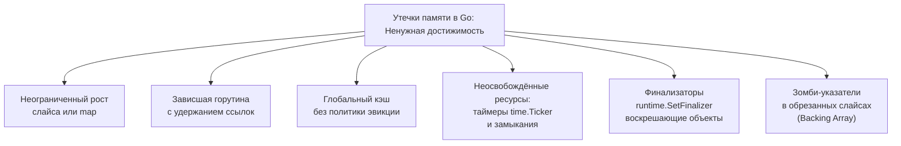

# Утечки памяти

> *«В языках без сборщика мусора утечка памяти напоминает дырявое ведро: вода выливается на пол, и вы теряете указатель. В Go ведро герметично, но программа превращается в барахольщика, который с маниакальным упорством складирует старые вещи, привязывая к каждой веревочку. Сборщик мусора предельно вежлив: пока к объекту привязана хоть одна веревочка, ведущая к корням программы, он никогда не осмелится выбросить его на свалку. Так память медленно, но неумолимо заполняется хламом, пока не придет безжалостный Linux OOM Killer».*  
> — Брайан Керниган

---

## Что такое утечка памяти в мире со сборщиком мусора

В предыдущей главе ([[5. pprof memory profile]]) мы досконально изучили аналитические проекции памяти — `inuse_space` и `alloc_space`. Теперь мы применим этот арсенал к самому коварному недугу серверных приложений: **утечкам памяти (Memory Leaks)**.

В классических языках с ручным управлением памятью (C, C++) утечка возникает тогда, когда программист вызвал `malloc`, потерял указатель на выделенный блок и забыл вызвать `free`. В Go благодаря автоматическому сборщику мусора классическая утечка «потерянного адреса» невозможна в принципе: как только объект теряет связи с корнями графа, GC гарантированно утилизирует его память.

Однако сборщик мусора не обладает телепатией: он не знает бизнес-логики вашего сервиса.  
**Утечка памяти в Go — это непреднамеренное удержание ссылок на объекты, которые логически больше никогда не понадобятся программе**.

Поскольку живая ссылка существует, сборщик мусора считает объект важным и сохраняет его. В результате куча неуклонно разрастается, время mark-фаз GC стремительно увеличивается ([[6. GC pause и latency]]), пропускная способность падает, и в один прекрасный день ядро операционной системы принудительно убивает процесс по **OOM** (Out of Memory, сигнал `SIGKILL`).

Senior-инженер обязан уметь выявлять такие утечки на ранних стадиях, не доводя инфраструктуру до аварийных перезапусков.

---

## Типы утечек памяти в Go

Всякая утечка памяти в Go сводится к фундаментальному принципу: **ненужная достижимость из корней GC (GC Roots)**. Корнями являются глобальные переменные, стековые фреймы активных горутин и регистры CPU. Классифицируем основные сценарии утечек:



### 1. Неограниченный рост слайса или map
Самый распространенный источник утечек в долгоживущих веб-сервисах: данные непрерывно добавляются в глобальную или долгоживущую структуру и никогда не удаляются:

```go
var cache = make(map[string][]byte)

func handler(w http.ResponseWriter, r *http.Request) {
    key := r.URL.Query().Get("key")
    data := fetchData(key)
    cache[key] = data // утечка: никогда не чистится
}
```

Память растет строго линейно с числом уникальных ключей. Сборщик мусора бессилен, так как `data` безупречно достижима через глобальную мапу `cache`.

**Диагностика:** Срез `inuse_space` покажет гигантский объем памяти в `cache` или служебной функции хэш-таблицы `runtime.mapassign`. Дифференциальный анализ двух профилей во времени наглядно подсветит монотонный рост.

### 2. Горутина, заблокированная с удержанием ссылок
Если горутина навечно блокируется на пустом канале, неразрешимом мьютексе или зависшем сетевом сокете, её собственный стек, локальные переменные и все захваченные замыканием структуры навсегда приковываются к корням GC:

```go
func startWorker() {
    ch := make(chan *LargeStruct)
    go func() {
        data := &LargeStruct{/* мегабайты данных */}
        ch <- data // никто не читает из ch — горутина навсегда зависла
    }()
}
```

Сама горутина (структура `g` и стек размером от 2 КБ до мегабайта) остается в глобальном реестре рантайма, а структура `LargeStruct` удерживается живой.

**Диагностика:** Анализ дампа горутин через `/debug/pprof/goroutine?debug=2` моментально выявит скопление тысяч заблокированных горутин в одном и том же стек-трейсе.

### 3. Глобальный кэш без эвикции
Любая самодельная реализация кэша на базе обычной `map` или `sync.Map` без алгоритмов вытеснения (LRU, LFU, TTL) обречена на переполнение памяти. В отличие от `sync.Pool` ([[2. sync Pool]]), который рантайм автоматически очищает при сборке мусора, структуры из прикладного кэша удерживаются постоянно.

### 4. Неосвобождённые ресурсы: таймеры, замыкания
Периодические тикеры стандартной библиотеки `time.Ticker` и таймеры `time.Timer` регистрируются во внутреннем планировщике таймеров рантайма:

```go
func periodic() {
    ticker := time.NewTicker(time.Second)
    // забыли ticker.Stop() — горутина тикера и связанные объекты живут вечно
}
```
Если забыть вызвать `ticker.Stop()`, системная горутина таймера будет удерживать ссылку на тикер и канал `ticker.C` бесконечно долго, порождая скрытую утечку.

### 5. Finalizer, блокирующий сборку
Использование финализаторов (`runtime.SetFinalizer`) ломает стандартный жизненный цикл объектов. Когда объект становится недостижимым, сборщик мусора не может освободить его сразу: он обязан переместить его в специальную очередь финализации. Если процедура финализатора случайно сохранит ссылку на объект в глобальную переменную («воскрешение объекта»), память утечет гарантированно.

### 6. Удержание указателей в «мёртвых» элементах слайса
Классическая ловушка сборщика мусора при работе со срезами указателей:

```go
buf := make([]*LargeStruct, 0, 1024)
for i := 0; i < 1024; i++ {
    buf = append(buf, &LargeStruct{})
}

// "удаляем" первые 1000 элементов логической обрезкой
buf = buf[1000:] // underlying array ещё держит указатели на первые 1000
```

Срез `buf` теперь логически содержит всего 24 элемента. Однако его базовый массив (`backing array`) по-прежнему физически хранит указатели на все 1000 ранее созданных структур `LargeStruct`! Сборщик мусора видит живой массив и не может освободить ни один из объектов.

**Лекарство:** Явное зануление ссылок перед сдвигом окна:
```go
for i := 0; i < 1000; i++ { buf[i] = nil }
```
либо явное копирование хвоста в свежий срез меньшей емкости.

---

## Инструменты для поиска утечек

### pprof heap профиль с inuse_space

Основное оружие инженера: сбор двух мгновенных снимков живой памяти с интервалом в 10–30 минут под стабильной нагрузкой:

```bash
# Фиксация первого снимка живой памяти
curl -o heap1.prof "http://localhost:6060/debug/pprof/heap"

# Ждем 10-30 минут под рабочей нагрузкой
# ...
curl -o heap2.prof "http://localhost:6060/debug/pprof/heap"

# Дифференциальный анализ в браузере
go tool pprof -http=:8080 -diff_base=heap1.prof heap2.prof
```

На дифференциальном флеймграфе красным цветом подсветятся функции, чей `inuse_space` монотонно вырос. Команда `list FuncName` укажет точную строку инициализации утекающих структур.

> [!warning] Ловушка: Медленные и флуктуирующие утечки
> Профиль `inuse_space` фиксирует мгновенное состояние. Если утечка происходит медленно (например, 100 КБ в час), единичный замер покажет фоновый шум. Для надежного подтверждения снимайте серию из 3–5 профилей на протяжении нескольких часов и анализируйте устойчивый восходящий тренд.

### GODEBUG=gctrace=1

Включение трассировки сборщика мусора выводит в поток `stderr` телеметрию каждого цикла:

```text
gc 123 @45.123s 1%: 0.50+0.20+0.10 ms clock, ... -> 120->80->40 MB, 100 MB goal
```

Интерпретация: тройка чисел `120->80->40 MB` показывает размер кучи до GC, размер кучи сразу после GC и целевой размер кучи.  
Растущий показатель `-> ... MB` после каждого цикла GC при стабильной нагрузке (например, последовательность `40 MB -> 85 MB -> 140 MB -> 210 MB`) безошибочно сигнализирует об утечке: куча не возвращается к исходному размеру!

### Профиль горутин

Утечки памяти, вызванные зависшими горутинами, диагностируются через HTTP-эндпоинт `/debug/pprof/goroutine?debug=2`. Если число активных горутин в Prometheus непрерывно ползет вверх, а дамп показывает тысячи горутин, заблокированных на `chan send` или `select`, вы нашли корень проблемы.

### runtime.ReadMemStats

В коде фоновых воркеров полезно периодически опрашивать системную структуру памяти через вызов `runtime.ReadMemStats(&m)`. Ключевые маркеры утечки:
- `HeapInuse` — непрерывный рост активных спанов кучи;
- `HeapIdle` — объем освобожденных страниц;
- `NumGC` — общее количество завершенных циклов сборки мусора.

---

## Методика расследования утечки

Профессиональный регламент ликвидации утечек памяти:

1. **Подтвердить факт утечки:** Проверить метрики контейнера (cgroups `memory.current`). Если график RSS монотонно идет вверх без выхода на плато, а `GODEBUG=gctrace=1` подтверждает рост кучи после каждого GC — диагноз поставлен.
2. **Снять серию inuse-профилей:** Получить два снимка с интервалом, достаточным для накопления дельты (от 5 до 30 минут).
3. **Локализовать виновника в pprof:** Запустить `go tool pprof -diff_base` и найти функции с максимальным положительным приростом байт.
4. **Провести аудит кода:** Проверить удержание ссылок в глобальных коллекциях, слайсах и фоновых замыканиях.
5. **Проверить дамп горутин:** Исключить зависание горутин-зомби.
6. **Воспроизвести локально:** Написать изолированный тест нагрузки с ключами `go test -memprofile` и `-benchmem`.
7. **Устранить причину и верифицировать:** Занулить мертвые указатели, внедрить TTL/LRU, остановить тикеры (`Stop()`) и убедиться, что повторный дифференциальный профиль показывает чистый ноль.

---

## Пример расследования

**Симптом:** Продакшен-микросервис обработки событий падает по OOM каждые два часа.

1. Логи `GODEBUG=gctrace=1` показывают, что после очистки размер кучи монотонно возрастает на 50 МБ каждые пять минут.
2. Снимаем профили с интервалом:
   ```bash
   curl "http://localhost:6060/debug/pprof/heap?seconds=60" > heap1.prof
   sleep 300
   curl "http://localhost:6060/debug/pprof/heap?seconds=60" > heap2.prof
   ```
3. Открываем `go tool pprof -http=:8080 -diff_base=heap1.prof heap2.prof`.  
   Флеймграф наглядно подсвечивает ярко-красный блок: функция `handler` увеличила потребление на 200 МБ, при этом львиная доля аллокаций приходится на вызов `runtime.mapassign` внутри структуры `cache`.
4. Команда `list handler` указывает на строку: `cache[key] = data`. Хэш-таблица использовалась для ускорения запросов, но не имела механизма очистки устаревших ключей!
5. Заменяем самодельную мапу на LRU-кэш с жестким лимитом записей.
6. Разворачиваем патч: график потребления памяти стабилизируется на отметке 120 МБ, утечка полностью ликвидирована.

---

## Ловушки и неочевидные случаи

> [!warning] Ловушка: sync.Map не является самоочищающимся кэшем
> Пакет `sync.Map` оптимизирован под сценарии частого чтения и редкой записи. Удаление ключа через `Delete()` не освобождает внутренние узлы хэш-таблицы мгновенно: они помечаются как `expunged` и вычищаются лишь при следующем перестроении карты. Если в `sync.Map` непрерывно писать одноразовые ключи, она раздует память и вызовет деградацию производительности.

> [!warning] Ловушка: Профиль показывает жертву, а не виновника
> Если в отчете `inuse_space` доминируют низкоуровневые функции `runtime.makeslice` или `runtime.growslice`, это не значит, что ошибка в рантайме. Это означает, что некая бизнес-структура создает слайсы и удерживает их в живых корнях. Ищите родительскую функцию по дереву `top -cum`.

> [!warning] Ловушка: Временные утечки через замыкания и time.AfterFunc
> Вызов `time.AfterFunc(10 * time.Minute, fn)` сохраняет замыкание `fn` в очереди таймеров на 10 минут. Если замыкание захватывает контекст запроса (`http.Request`) или крупный буфер, эти данные будут удерживаться в памяти все 10 минут, даже если клиент отключился через секунду! Всегда очищайте таймеры, используйте `defer` для вызова `Stop()` и сохраняйте возвращенный таймер при отмене контекста.

> [!warning] Ловушка: Сборка мусора не мгновенна
> После того как вы обнулили ссылку на объект, он не исчезает из памяти немедленно. Память освободится только тогда, когда сборщик мусора завершит следующий цикл разметки и очистки. Кратковременные всплески памяти под нагрузкой — это нормальное явление, а не утечка.

---

## Mechanical Sympathy: как утечка убивает производительность

Утечка памяти опасна не только фатальным падением по OOM. Она разрушает производительность процессора задолго до краха сервиса:
1. **Деградация фазы разметки (Mark Phase):**  
   Трехцветный сборщик мусора вынужден обходить граф всех достижимых объектов ([[2. Tri color marking]]). Если куча раздута миллионами мертвых, но формально достижимых структур, фаза разметки съедает колоссальное количество процессорных тактов, крадя ядра у рабочих горутин.
2. **Учащение циклов GC:**  
   Поскольку после каждой сборки свободная память кучи стремительно сокращается, сборщик мусора триггерится все чаще и чаще, создавая микропаузы ([[6. GC pause и latency]]).
3. **Разрушение кэш-линий и TLB:**  
   Огромная куча размазывается по тысячам страниц оперативной памяти, гарантируя 100% промахи L3-кэша и буфера TLB ([[1. Memory model Go]]).
4. **Свопинг (Swap Thrashing):**  
   Когда память процесса выходит за физические лимиты RAM, операционная система начинает сбрасывать страницы на диск. Сервис мгновенно впадает в коматозное состояние, увеличивая время ответа с миллисекунд до десятков секунд.

---

## Итог

- **Утечка памяти в Go** — это не потерянные указатели, а непреднамеренное удержание ссылок на логически мертвые объекты из корней GC.
- Главные виновники: бесконтрольно растущие слайсы и `map`, забытые блокировки горутин, кэши без эвикции, неостановленные таймеры и зомби-указатели в срезанных буферах.
- Основной инструмент локализации — дифференциальный анализ снимков живой памяти: `go tool pprof -diff_base=heap1.prof heap2.prof`.
- Системные индикаторы: постоянный рост размера кучи после очистки в `GODEBUG=gctrace=1` и рост счетчика горутин в pprof.
- Механическое сочувствие: утечка памяти — это скрытый убийца CPU, вызывающий деградацию кэшей процессора и лавинообразный рост нагрузки на сборщик мусора.

Научившись находить и ликвидировать утечки, мы переходим к исследованию того, как память может неэффективно расходоваться даже тогда, когда все объекты освобождены вовремя: [[7. Fragmentation]] — внутренняя и внешняя фрагментация кучи Go.