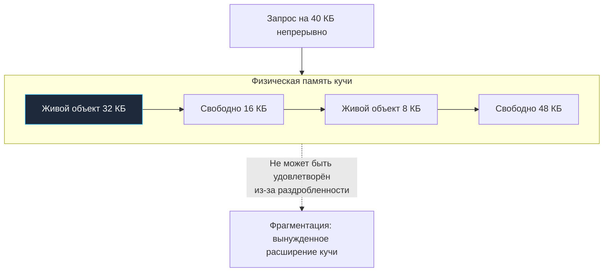

# Fragmentation

> *«Представьте себе городскую улицу, где паркуются автомобили произвольной длины: мотоциклы, пятиметровые седаны и длинномерные грузовики. Машины хаотично приезжают и уезжают. Вскоре суммарная длина свободных промежутков между машинами составит сотню метров, но приехавший грузовик не сможет припарковаться: ни один отдельный просвет не превышает трех метров. Это и есть внешняя фрагментация памяти — когда свободных байт много, но ни один непрерывный кусок не способен удовлетворить запрос».*  
> — Брайан Керниган

---

## Фрагментация: скрытая цена неограниченной свободы

В предыдущей лекции ([[6. Утечки памяти]]) мы разобрались с анатомией утечек памяти, когда неиспользуемые объекты продолжают удерживаться в живых корнях графа. Но в практике backend-разработки часто возникает куда более тонкая проблема: в коде нет ни единой утечки, сборщик мусора работает безупречно, однако потребление памяти процессом (RSS) раздувается до гигабайт, а сервер неожиданно начинает испытывать дефицит памяти.

Причина этого явления — **фрагментация памяти (Memory Fragmentation)**: неэффективное, раздробленное распределение живых и свободных областей в куче рантайма.

Фрагментация редко приводит к мгновенному падению по OOM, но она действует как коварный хронический недуг:
- Раздувает Resident Set Size (RSS) процесса, провоцируя OOM-киллеры контейнеров Kubernetes;
- Заставляет аллокатор запрашивать у ядра ОС новые арены виртуальной памяти;
- Увеличивает нагрузку на буфер TLB процессора и разрушает пространственную локальность кэш-линий;
- Замедляет выделение памяти и увеличивает время пауз сборщика мусора.

В этой главе мы классифицируем виды фрагментации в Go, научимся измерять скрытые потери памяти, сопоставим поведение аллокатора с концепцией механического сочувствия ([[5. Mechanical sympathy в backend разработке]]) и освоим приемы архитектурной защиты: от `sync.Pool` ([[2. sync Pool]]) и предвыделения ([[4. Предвыделение памяти]]) до тонкого тюнинга `GOGC` и `GOMEMLIMIT` ([[7. GOGC и tuning]], [[8. GOMEMLIMIT]]).

---

## Два лица фрагментации: внутренняя и внешняя

В современных системах с управляемой памятью фрагментация проявляется на двух принципиально разных уровнях:

```mermaid
flowchart TD
    classDef process  fill:#1e293b,stroke:#38bdf8,stroke-width:1px,color:#f8fafc
    classDef success  fill:#064e3b,stroke:#34d399,stroke-width:1px,color:#f8fafc
    classDef error    fill:#7f1d1d,stroke:#f87171,stroke-width:1px,color:#f8fafc
    classDef warning  fill:#78350f,stroke:#fbbf24,stroke-width:1px,color:#f8fafc
    classDef entry    fill:#1e3a5f,stroke:#38bdf8,stroke-width:2px,color:#f8fafc
    classDef aux      fill:#334155,stroke:#64748b,stroke-width:1px,color:#f8fafc
    classDef system   fill:#312e81,stroke:#a78bfa,stroke-width:1px,color:#f8fafc
    classDef data     fill:#132d29,stroke:#2dd4bf,stroke-width:1px,color:#f8fafc
    classDef network  fill:#881337,stroke:#fb7185,stroke-width:1px,color:#f8fafc
    classDef accent   fill:#1e1b4b,stroke:#818cf8,stroke-width:1px,color:#f8fafc
    subgraph "Внутренняя фрагментация (Internal)"
        Slot["Слот класса размера: 48 байт"]:::process
        Obj["Объект: 33 байта"]:::process
        Lost["Потеряно: 15 байт паддинга"]:::process
        Slot --> Obj
        Slot --> Lost
    end
    subgraph "Внешняя фрагментация (External)"
        Page1["Занято 32 КБ"]:::process --> Free1["Свободно 16 КБ"]
        Free1 --> Page2["Занято 8 КБ"]
        Page2 --> Free2["Свободно 48 КБ"]
        Req["Запрос на 40 КБ непрерывно"] -.->|"Отказ: нет цельного блока"| Free1
    end
```



### Внутренняя фрагментация (internal fragmentation)

Внутренняя фрагментация возникает внутри самих выделенных ячеек памяти из-за того, что аллокатор кучи оперирует дискретными **классами размеров (size classes)** (унаследованными от архитектуры TCMalloc).

Если вашей структуре требуется ровно **33 байта**, аллокатор Go не станет нарезать память с точностью до байта. Он выделит ячейку ближайшего фиксированного класса — **48 байт**. Разница в **15 байт** внутри этого слота остается неиспользуемой и навсегда потеряна для других объектов:

$$15 \text{ байт} / 48 \text{ байт} \approx 31.25\% \text{ накладных расходов}$$

Сетка классов размеров в Go (актуально для Go 1.21+):
- $8, 16, 24, 32, 48, 64, 80, 96, 112, 128, 144, 160, 176, 192, 208, 224, 240, 256 \dots$ байт;
- Верхняя граница классов мелких объектов — **32768 байт (32 КБ)**;
- Объекты крупнее 32 КБ (**large objects**) выделяются напрямую из глобальной кучи страницами по **8 КБ**, где правит уже внешняя фрагментация.

Внутренняя фрагментация — это сознательный архитектурный компромисс. Без классов размеров аллокатору пришлось бы выполнять поиск свободного блока алгоритмами Best-Fit или Buddy Allocation с захватом тяжелых глобальных мьютексов. Сетка классов дает молниеносную O(1) аллокацию из локального кэша `mcache` ценой небольшой потери памяти.

> [!info] Под капотом: Оценка внутренней фрагментации
> Масштаб потерь от внутренней фрагментации зависит от распределения размеров объектов. Если бизнес-логика оперирует структурами по 40 байт, рантайм округляет каждую до 48 байт (20% овеSetting). Если же объекты имеют размер ровно 32 или 64 байта, потери равны строго 0%. В `go tool pprof` внутреннюю фрагментацию можно косвенно оценить, сопоставляя метрики `inuse_bytes` и число живых объектов через `-sample_index=inuse_objects`.

### Внешняя фрагментация (external fragmentation)

Внешняя фрагментация возникает тогда, когда между активными страницами памяти образуются разрозненные островки свободного пространства, каждый из которых слишком мал для удовлетворения нового крупного запроса. В сумме свободной памяти в куче может быть 100 МБ, но запросить непрерывный блок в 10 МБ невозможно!

В рантайме Go для мелких объектов (до 32 КБ) внешняя фрагментация практически сведена к нулю благодаря **спанам (`mspan`)**:
- Каждый спан содержит ячейки **строго одного класса размера**;
- Свободные ячейки внутри спана однородны и мгновенно переиспользуются новыми объектами того же класса;
- Когда все объекты в спане освобождаются, весь 8-килобайтный спан возвращается в центральный пул `mcentral`.

Однако для **крупных объектов (large objects > 32 КБ)** и непрерывных арен виртуальной памяти внешняя фрагментация представляет реальную угрозу. Большие срезы аллоцируются цельными страницами (по 8 КБ). Если программа чередует создание и освобождение буферов разного размера, непрерывные участки виртуальной памяти разбиваются на изолированные фрагменты:



---

## Причины фрагментации в Go

### 1. Смешанное время жизни объектов
Худший сценарий для любого аллокатора — перемешивание короткоживущих и долгоживущих структур. Когда миллионы временных объектов умирают, они оставляют после себя пустоты, окруженные редкими долгоживущими объектами (например, элементами глобального кэша). Спан не может быть освобожден целиком, пока в нем жив хотя бы один объект!

### 2. Неравномерное давление аллокаций
При пиковых нагрузках куча стремительно разрастается, захватывая у ядра ОС новые арены виртуальной памяти. Когда пик спадает и объекты уничтожаются, освобожденная память остается в состоянии `HeapIdle` (свободная память, удерживаемая рантаймом). Рантайм не возвращает ее операционной системе мгновенно, чтобы не тратить ресурсы на повторные системные вызовы при следующем всплеске.

### 3. Возврат памяти ОС и MADV_FREE
Начиная с Go 1.16 на Linux рантайм использует системный вызов `madvise` с флагом `MADV_FREE` вместо `MADV_DONTNEED` для возврата неиспользуемых страниц:
- При `MADV_FREE` ядро Linux помечает страницы как освобожденные, но **не вычитает их из RSS процесса**, пока операционная система не испытает физический дефицит памяти;
- В графиках мониторинга сервис выглядит раздутым, хотя реальной проблемы нет;
- Если мониторинг Kubernetes алертит по RSS, возврат к немедленному освобождению активируется переменной окружения `GODEBUG=madvdontneed=1`.

> [!warning] Ловушка: Раздутый RSS из-за MADV_FREE
> После внедрения Go 1.16 многие инженеры запаниковали, наблюдая высокий RSS даже в состоянии полного простоя сервиса. Это штатная работа `MADV_FREE`. Если вам требуется жесткий возврат памяти в ОС ради соблюдения лимитов контейнера, используйте `GODEBUG=madvdontneed=1`.

---

## Как измерять фрагментацию в Go

Прямой скалярной метрики «Fragmentation Ratio» в Go не существует, однако Senior-инженер легко определяет ее по косвенным маркерам:

### 1. GODEBUG=gctrace=1
В логах сборщика мусора анализируются переходы размеров кучи:

```text
gc 1 @0.001s 0%: 0.015+0.13+0.007 ms clock, ... -> 1.1->1.1->1.0 MB, 4 MB goal, ...
gc 2 @0.002s 0%: ... -> 1.0->1.5->1.5 MB, 2 MB goal, ...
```

Параметр `-> ... MB` (третье число в цепочке) отражает `HeapInuse` сразу после завершения GC. Если показатель `HeapInuse` стабильно растет при постоянной рабочей нагрузке — в программе присутствует либо утечка, либо накопление долгоживущих объектов, либо тяжелая фрагментация, мешающая вернуть память операционной системе.

### 2. runtime.ReadMemStats
Структура `runtime.MemStats` предоставляет фундаментальные метрики распределения памяти:
- `HeapAlloc` — суммарный объем байт, занятых непосредственно живыми объектами;
- `HeapInuse` — суммарный объем всех активных спанов кучи (включая неиспользуемые слоты и внутреннюю фрагментацию);
- `HeapIdle` — объем памяти в свободных спанах, удерживаемых рантаймом;
- `HeapReleased` — объем свободной памяти, возвращенной ядру ОС;
- `StackInuse` — память, отведенная под стеки горутин;
- `TotalAlloc` — кумулятивный счетчик аллокаций.

**Формула фрагментации:**
Если показатель `HeapInuse` в 1.5–2 раза превышает `HeapAlloc`, куча страдает от внутренней фрагментации. Если `HeapIdle` велик, а `HeapReleased` близок к нулю — куча страдает от внешней фрагментации, удерживая невозвращенные арены.

### 3. pprof heap профиль
Анализ профиля `inuse_space` в связке с `inuse_objects` позволяет выявить скопление мелких объектов невыгодного размера, провоцирующих внутренний паддинг.

### 4. Linux /proc/<pid>/maps и perf
Инспекция системных карт памяти через `cat /proc/<pid>/maps` или `pmap -x <pid>` показывает реальное количество и размер анонимных маппингов кучи. С помощью утилиты `perf trace -e 'syscalls:sys_enter_madvise*'` можно отслеживать реальную частоту возврата страниц операционной системе.

---

## Стратегии минимизации фрагментации

### 1. Использовать sync.Pool для горячих временных объектов
Пул `sync.Pool` ([[2. sync Pool]]) переиспользует уже выделенные ячейки памяти, удерживая спаны в стабильно заполненном состоянии и предотвращая хаотическое возникновение пустот.

### 2. Предвыделять слайсы и мапы
Вызов `make([]T, 0, cap)` и `make(map[K]V, cap)` с известной емкостью исключает промежуточные аллокации при росте (`runtime.growslice`), оставляющие после себя массу временного мусора разного размера ([[4. Предвыделение памяти]]).

### 3. Агрегировать аллокации в батчи
Вместо выделения тысяч крошечных объектов по отдельности аллоцируйте один непрерывный слайс и нарезайте его на элементы (Arena Allocation). Это не только сводит внешнюю фрагментацию к нулю, но и кардинально улучшает кэш-локальность ([[8. Cache friendliness]]).

### 4. Избегать перемежающихся выделений больших и малых объектов
Крупные буферы (> 32 КБ) изолируйте в специализированные пулы, предотвращая расщепление непрерывных страниц кучи.

### 5. Ограничивать пиковые аллокации через rate limiting
Сглаживание пиков входящих запросов семафорами предотвращает взрывной захват новых арен виртуальной памяти.

### 6. Тюнинг GOGC и GOMEMLIMIT
- `GOGC` ([[7. GOGC и tuning]]): Понижение целевого процента (например, `GOGC=50`) заставляет GC запускаться чаще, удерживая размер кучи компактным ценой небольшого расхода CPU.
- `GOMEMLIMIT` ([[8. GOMEMLIMIT]]): Мягкий лимит памяти (Go 1.19+), защищающий процесс от OOM и принуждающий рантайм более агрессивно утилизировать свободные спаны.

### 7. Для критических участков — предварительно выделять и никогда не освобождать
В latency-critical контурах выделяйте кольцевые буферы (Ring Buffers) фиксированного объема на старте приложения, полностью исключая походы в динамический аллокатор.

---

## Компактизация: почему её нет в Go

В виртуальных машинах Java (JVM с алгоритмами G1, Shenandoah, ZGC) и .NET сборщик мусора периодически выполняет **компактизацию (Compaction)**: физически перемещает живые объекты в памяти вплотную друг к другу, собирая все пустоты в единый гигантский непрерывный блок.

**В Go сборщик мусора принципиально некомпактизирующий (Non-compacting Mark-Sweep).**

Почему архитекторы Go отказались от компактизации:
1. **Низкая задержка (Low Latency):** Перемещение объектов в памяти требует либо глобальной остановки всех горутин (Stop-The-World), либо сложнейших барьеров чтения (Read Barriers), замедляющих каждое разыменование указателя в прикладном коде.
2. **Прямое взаимодействие с C (CGO) и системные вызовы:** Go передает указатели в системные вызовы ОС и код на C. Если бы сборщик мусора мог произвольно сдвигать адреса объектов, указатели превратились бы в мусор.

Отсутствие компактизации означает, что борьба с фрагментацией ложится на плечи архитектора программы через пулинг, правильное выравнивание и управление жизненным циклом структур.

> [!tip] Собеседование: Компактизация в Go
> **Вопрос:** Выполняет ли сборщик мусора Go компактизацию памяти для устранения фрагментации?  
> **Ответ:** Нет, сборщик мусора Go является некомпактизирующим трехцветным алгоритмом (Non-compacting Mark-Sweep). Объекты никогда не перемещаются в куче после аллокации ради сохранения субмиллисекундных пауз STW и совместимости с системными вызовами. Борьба с фрагментацией возлагается на архитектуру спанов `mspan`, переиспользование объектов через `sync.Pool`, предвыделение коллекций и мягкий лимит `GOMEMLIMIT`.

---

## Mechanical Sympathy: фрагментация и процессор

С точки зрения кремниевой физики фрагментированная куча — главный враг производительности:
- **Шквал промахов TLB (Translation Lookaside Buffer):** Когда живые данные раскиданы по сотням разрозненных страниц памяти, буфер трансляции MMU непрерывно очищается. Каждый TLB Miss заставляет ядро выполнять 4-уровневый Page Walk в DRAM, добавляя 10–20 наносекунд к каждому чтению ([[1. Memory model Go]]).
- **Разрушение префетчера:** Аппаратный блок упреждающей выборки CPU (Hardware Prefetcher) бессилен перед хаотично разбросанными ячейками кучи ([[8. Cache friendliness]]).
- **Увеличение времени пауз GC:** Сборщик мусора тратит больше времени на сканирование раздутых метаданных спанов и арен.

---

## Итог

- **Фрагментация памяти** — неэффективное распределение свободных областей в куче, раздувающее RSS процесса при отсутствии явных утечек.
- **Внутренняя фрагментация** — неизбежный паддинг внутри ячеек классов размеров (до 32 КБ) ради скорости аллокации за $O(1)$.
- **Внешняя фрагментация** — раздробленность свободных страниц, опасная для крупных объектов (> 32 КБ).
- В Go отсутствует компактизация ради обеспечения минимальных пауз STW.
- Инструменты контроля: соотношение `HeapInuse` и `HeapAlloc` в `runtime.ReadMemStats`, логи `GODEBUG=gctrace=1` и инспекция карт `/proc/<pid>/maps`.
- Арсенал инженера: `sync.Pool`, предвыделение `cap`, пакетирование данных в арены, тюнинг `GOGC` и `GOMEMLIMIT`.

В следующей, завершающей лекции подраздела мы исследуем время жизни объектов: [[8. Object lifetime]] — разберем генерационные паттерны, поколения объектов и то, как время жизни определяет судьбу памяти в высоконагруженных системах.