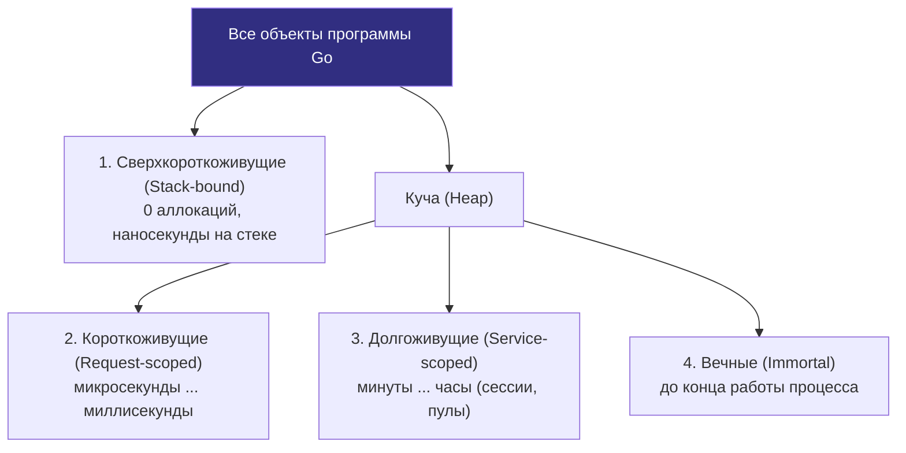

# Object lifetime

> *«В теории сборки мусора существует знаменитая генерационная гипотеза: большинство объектов умирают молодыми. Но в Go все объекты в куче формально равны перед законом — от микросекундного буфера до глобальной таблицы маршрутизации. Время жизни объекта (object lifetime) — это стрела времени вашей программы: короткий полет оставляет легкий след, а затянувшаяся жизнь вынуждает сборщик мусора проверять объект снова и снова на каждом цикле бытия».*  
> — Брайан Керниган

---

## Почему время жизни объекта — это не только про GC

В предыдущих главах нашего исследования мы выяснили, где физически рождаются данные ([[2. Heap vs stack]]), как компилятор принимает решение об эвакуации ([[3. Escape analysis]]), научились собирать профили выделений ([[4. Allocation profiling]], [[5. pprof memory profile]]) и бороться с патологиями памяти — утечками ([[6. Утечки памяти]]) и фрагментацией спанов ([[7. Fragmentation]]).

Все эти темы замыкаются на одну фундаментальную координату: **время жизни объекта (object lifetime)**. 

Сколько процессорных тактов пройдет от момента, когда аллокатор выделил ячейку памяти, до того мгновения, когда последняя ссылка на нее исчезнет из корней программы?
- Если наносекунды — объект растворится на стеке без следа;
- Если миллисекунды — он станет временным мусором в куче, ускоряя запуск следующего цикла GC;
- Если часы или дни — он превратится в постоянный балласт фазы разметки (Mark Phase), который сборщик мусора обязан добросовестно сканировать миллионы раз.

В средах исполнения с поколениями объектов (Generational GC в Java HotSpot или .NET CLR) сборщик делит память на молодое (Eden/Survivor) и старое (Tenured) поколения, собирая «молодежь» дешевыми быстрыми паузами. **В языке Go сборщик мусора принципиально одноуровневый и не имеет поколений (Non-generational Mark-Sweep)**. Все кучевые объекты равноправны.

Поэтому понимание профиля выживаемости объектов — это прямой ключ к управлению сборщиком мусора ([[7. GOGC и tuning]]), подавлению хвостовых задержек (tail latency) и удержанию рабочего набора сервиса в процессорном кэше L3.

---

## Классификация объектов по времени жизни

В любом Go-микросервисе все существующие структуры данных можно разделить на четыре четкие категории:

1. **Сверхкороткоживущие (Stack-bound):**  
   Переменные, чей жизненный цикл строго ограничен временем выполнения текущего стекового фрейма. Время жизни — от долей наносекунды до единиц микросекунд. Они живут исключительно на стеке и сборщик мусора их просто «не видит». Пример: локальные счетчики, параметры функций, временные структуры.
2. **Короткоживущие (Request-scoped):**  
   Объекты, рождающиеся в процессе обработки конкретного входящего события (HTTP-запроса, gRPC-вызова, сообщения из Kafka). Они убегают в кучу, используются долями секунды и становятся мусором до или во время ближайшего цикла GC. Пример: парсинг JSON-документа, временные буферы `strings.Builder`, структуры DTO.
3. **Долгоживущие (Session/Connection/Service-scoped):**  
   Объекты, переживающие десятки и сотни циклов сборки мусора. Они живут минуты, часы или дни. Пример: клиентские сессии, кэши в оперативной памяти, пулы соединений с БД, служебные дескрипторы.
4. **Вечные (Immortal):**  
   Глобальные синглтоны, конфигурации микросервиса, таблицы роутинга и неизменяемые справочники, инициализированные при старте в функциях `init()` или `main()` и живущие до завершения процесса ОС.

---

## Как время жизни влияет на сборщик мусора

Поскольку в Go нет поколенческого сборщика мусора (Generational GC), короткоживущие и долгоживущие объекты нагружают рантайм на совершенно разных фазах:

### Короткоживущие объекты
- **Фаза разметки (Mark Phase):** Если короткоживущий объект успевает стать недостижимым *до* начала очередной фазы разметки, сборщик мусора его вообще не сканирует. Но если объект застает фазу Mark живым, GC добросовестно обходит его указатели ([[2. Tri color marking]]).
- **Фаза очистки (Sweep Phase):** Здесь короткоживущие объекты чрезвычайно выгодны: когда спан (`mspan`) целиком состоит из мертвых объектов одного запроса, он освобождается мгновенно за $O(1)$ без поклеточного обхода.
- **Главный вред:** Короткоживущие аллокации — главный двигатель **частоты запусков GC**. Чем быстрее наполняется память кучи до целевого порога `GOGC`, тем чаще запускается трехцветный сборщик мусора, отбирая до 25% CPU у рабочих горутин. Снижая количество короткоживущих аллокаций, мы напрямую снижаем частоту циклов GC ([[1. Уменьшение аллокаций]]).

### Долгоживущие объекты
- **Постоянный налог на Mark-фазу:** Долгоживущие объекты никогда не умирают, а значит, сборщик мусора обязан сканировать все их указатели **на каждом цикле GC без исключения**! Если в памяти висит кэш на 5 миллионов объектов, каждый цикл сборки будет тратить десятки миллисекунд только на их обход.
- **Барьеры записи (Write Barriers):** Любая модификация указателя внутри долгоживущего объекта активирует аппаратный барьер записи ([[5. Write barriers]]), добавляя накладные расходы к операциям мутации.
- **Инфляция кучи:** Удержание долгоживущих объектов раздувает базу живой памяти (`HeapInuse`). Поскольку цель следующего запуска рассчитывается как `Target = HeapInuse * (1 + GOGC/100)`, куча физически растет, рискуя выйти за границы RAM.

> [!info] Под капотом: Квази-генерационный эффект спанов в Go
> Почему в Go нет поколений? Создатели рантайма сознательно отказались от generational GC, чтобы избежать накладных расходов на межпоколенческие барьеры записи (Card Tables), которые в Java замедляют каждую запись указателя. 
> 
> Вместо этого Go эксплуатирует архитектуру аллокатора спанов: короткоживущие объекты, выделенные в один временной промежуток (например, в рамках одного HTTP-запроса), с высокой вероятностью попадают в один и тот же спан `mspan`. Когда запрос завершается, все эти объекты умирают одновременно, и весь спан целиком освобождается за один такт! Это дает многие преимущества поколенческого GC без его архитектурной сложности.

---

## Время жизни и кэш-память процессора

С точки зрения кремниевой физики и механического сочувствия ([[5. Mechanical sympathy в backend разработке]]) время жизни напрямую определяет судьбу данных в иерархии кэшей:

- **Стек (Stack-bound):** Непрерывно прогрет в L1d-кэше (1–2 такта CPU) — абсолютный оптимум.
- **Короткоживущий мусор кучи:** Порождает эффект **загрязнения кэша (Cache Pollution)**. При создании объекта рантайм обязан занулить память (`memclr`), вытесняя из L1/L2 кэш-линий полезные рабочие структуры. Когда через миллисекунду объект выбрасывается, его следы вымывают ценные данные, заставляя процессор простаивать в ожидании выборки из RAM.
- **Долгоживущие структуры:** Если активный рабочий набор долгоживущих структур укладывается в объем L3-кэша (2–32 МБ), программа демонстрирует предельную скорость. Если же долгоживущие кэши фрагментированы и разбросаны по памяти, доступ к ним превращается в непрерывный ад задержек DRAM (80–100 нс).
- **Вечные структуры:** Идеально прогреты в кэшах, поэтому конфигурации и справочники выгодно упаковывать в компактные кэш-дружественные структуры ([[6. Cache friendly структуры]]).

---

## Инструменты для оценки времени жизни объектов

В стандартном `pprof` нет отдельного счетчика «возраст объекта в секундах». Однако Senior-инженер умеет определять кривую времени жизни по косвенным маркерам:

1. **`GODEBUG=gctrace=1`:**  
   Показывает динамику кучи до и после каждого GC. Если после сборки размер кучи неизменно возвращается к стабильной базовой линии — доминируют короткоживущие объекты. Если базовая линия неуклонно ползет вверх — накапливаются долгоживущие структуры.
2. **Execution Tracer (`go tool trace`, [[3. execution tracer]]):**  
   Интерактивная визуализация системных событий рантайма: `runtime/alloc`, фаз `gcStart` и `gcFinish`. На временной шкале отчетливо видно, создаются ли объекты пачками под каждый входящий запрос или размазаны во времени.
3. **Метрика `TotalAlloc` в `runtime.ReadMemStats`:**  
   Если счетчик кумулятивных выделений `TotalAlloc` стремительно растет со скоростью гигабайт в секунду при скромном и плоском графике `HeapInuse` — ваша система перемалывает колоссальный поток ультракороткоживущего мусора.
4. **Дифференциальный pprof (`inuse_space`):**  
   Сравнение двух снимков живой памяти до и после принудительной сборки мусора выявляет объекты, способные пережить цикл GC.
5. **Бенчмарки с `-benchmem`:**  
   Показывают метрику `allocs/op`, характеризующую объем короткоживущих аллокаций на единицу полезной бизнес-логики.

> [!tip] Собеседование: Как выявить долгоживущие объекты
> **Вопрос:** Каким способом можно экспериментально отделить долгоживущие объекты кучи от короткоживущего временного мусора?  
> **Ответ:** Необходимо вызвать принудительный запуск сборщика мусора через `runtime.GC()` и сразу снять моментальный снимок памяти `inuse_space`. Все короткоживущие неиспользуемые объекты будут собраны, а в профиле останутся исключительно долгоживущие и вечные структуры, удерживаемые активными корнями программы. Анализ тренда метрики `HeapInuse` после GC в логах `GODEBUG=gctrace=1` также наглядно иллюстрирует динамику долгоживущих данных.

---

## Как управлять временем жизни для производительности

### 1. Укорачивать жизнь ненужных объектов
- Не удерживайте ссылки на структуры в долгоживущих контекстах без надобности.
- В кольцевых буферах зануляйте указатели на обработанные элементы (`buf[i] = nil`).
- Своевременно вызывайте методы финализации ресурсов: `Close()` для сетевых сокетов и файлов, `Stop()` для тикеров `time.Ticker` и таймеров.

### 2. Переиспользовать объекты через sync.Pool
Для высокочастотных короткоживущих структур идеален `sync.Pool` ([[2. sync Pool]]). Он превращает короткоживущие объекты в многократно переиспользуемые, полностью устраняя накладные расходы аллокатора и защищая кэш от вымывания.

### 3. Превращать короткоживущие в долгоживущие осознанно
Если инициализация структуры требует тяжелых вычислений (компиляция регулярного выражения, парсинг конфигурационного YAML, построение схемы валидации), выполните ее ровно один раз при старте, сделав объект вечным синглтоном.

### 4. Размещать на стеке всё, что можно
Используйте анализ побега ([[3. Escape analysis]]): передавайте небольшие структуры по значению, избегайте боксинга в интерфейсы и не захватывайте переменные внешними замыканиями. Сверхкороткоживущий объект на стеке — самый эффективный объект во вселенной Go.

### 5. Предвыделение и агрегация
Вместо сотен тысяч мелких структур аллоцируйте один монолитный срез или арену фиксированного размера ([[4. Предвыделение памяти]]). Время жизни всех элементов синхронизируется со временем жизни общего буфера, исключая фрагментацию кучи.

### 6. Тюнинг GOGC и GOMEMLIMIT
- Если доминируют короткоживущие объекты и сервер имеет запас по памяти, увеличьте `GOGC` (например, `GOGC=200`), чтобы сборщик мусора запускался реже, давая временным объектам спокойно умереть до начала фазы Mark.
- Параметр `GOMEMLIMIT` ([[8. GOMEMLIMIT]]) установит жесткую границу, защищая инфраструктуру от взрывного роста при скачках нагрузки.

---

## Ловушки и антипаттерны

> [!warning] Ловушка: «Чем короче время жизни объекта, тем лучше»
> Это опасное заблуждение. Если объект рождается и умирает миллионы раз в секунду в плотном цикле, постоянное перевыделение памяти перегрузит аллокатор и вызовет бесконечный троттлинг GC. Перевод таких объектов в пул `sync.Pool` или в долгоживущий предвыделенный буфер принесет колоссальный выигрыш в задержках и потреблении CPU.

> [!warning] Ловушка: Неявное продление жизни через замыкания
> Фоновая горутина с вызовом `time.AfterFunc` или отложенный вызов `defer` с замыканием захватывает внешние переменные по ссылке. В результате контекст запроса или многомегабайтный буфер, который должен был прожить 5 миллисекунд, застревает в куче на десятки минут!

> [!warning] Ловушка: Кэширование без TTL и политик эвикции
> Попытка ускорить программу переводом короткоживущих результатов вычислений в глобальную мапу без жесткой политики инвалидации (TTL, LRU) мгновенно превращает временные данные в бессмертные, гарантируя OOM.

---

## Mechanical Sympathy: идеальный профиль времени жизни

С точки зрения кремниевой архитектуры процессора идеальное серверное приложение на Go сбалансировано по трем осям:
1. **95% временных данных живут на стеке:** Локальные переменные мгновенно исчезают в регистрах и кэше L1/L2 без следа в куче.
2. **Компактное ядро долгоживущих структур:** Сервисные структуры, пулы и кэши плотно упакованы по строкам, выровнены по 64-байтным кэш-линиям и свободно умещаются в L3-кэш процессора.
3. **Минимальный объем короткоживущего мусора в куче:** Потоки аллокаций сглажены пулами `sync.Pool` и предвыделением срезов, защищая кэши процессора от вымывания, а сборщик мусора — от непрерывных остановок.

---

## Итог

- **Время жизни объекта** — фундаментальный фактор производительности, определяющий точку приложения усилий: короткоживущие объекты создают нагрузку на аллокатор и частоту GC, долгоживущие — на фазу разметки Mark и барьеры записи `write barrier`.
- В Go отсутствует разделение кучи на поколения (Non-generational GC), однако связка спанов `mspan` и классов размеров обеспечивает квази-поколенческий эффект пакетного освобождения страниц.
- Инструменты наблюдения: телеметрия `GODEBUG=gctrace=1`, системный трассировщик `go tool trace`, метрики `TotalAlloc` и бенчмарки с `-benchmem`.
- Инженерная тактика: удерживайте переменные на стеке, переиспользуйте горячие буферы через `sync.Pool`, агрегируйте структуры в монолитные срезы и балансируйте кучу параметрами `GOGC` и `GOMEMLIMIT`.

На этой концептуальной вершине мы полностью завершаем подраздел «Memory profiling». Мы прошли путь от модели памяти и механики стека к анализу побега, снятию профилей `alloc_space`, расследованию утечек, борьбе с фрагментацией и управлению временем жизни объектов.

В следующем подразделе мы погрузимся в самое сердце рантайма — работу трехцветного сборщика мусора Go: [[1. GC в Go. Обзор]].