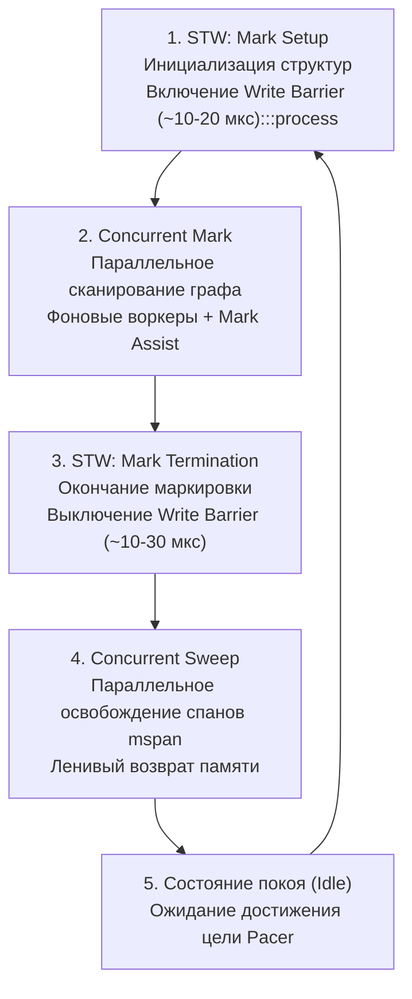

# GC в Go. Обзор

> *«В классических системах со сборщиком мусора уборка напоминала комендантский час: полиция перекрывала все улицы города, жизнь полностью замирала, пока армия дворников мела мостовые. Создатели Go выбрали иной путь: мусоровозы едут прямо в общем потоке машин, не перекрывая движение. Город не стоит в пробках, но водители должны делить полосу с грузовиками, а если кто-то выбрасывает слишком много мусора, его принудительно заставляют взять в руки лопату».*  
> — Брайан Керниган

---

## Почему сборщик мусора — центральный элемент рантайма

В предыдущем подразделе мы детально исследовали управление памятью в Go: где физически рождаются данные ([[2. Heap vs stack]]), как компилятор выносит вердикт об их эвакуации ([[3. Escape analysis]]) и как находить расточительные участки с помощью аллокационного профилирования ([[4. Allocation profiling]], [[5. pprof memory profile]]).

Все эти темы неизбежно сходятся в одной ключевой точке архитектуры: **сборщике мусора (Garbage Collector, GC)**.

Именно сборщик мусора берет на себя рутинный и опасный труд автоматического освобождения кучевой памяти, навсегда избавляя программиста от необходимости вызывать системную функцию `free()`. Однако за этот комфорт и гарантию безопасности памяти (Memory Safety) закон сохранения заставляет платить: процессорными тактами, микроскопическими паузами, накладными расходами на барьеры записи и загрязнением кэшей процессора.

Сборщик мусора Go — это не архаичный Stop-The-World монолит. Начиная с революционного релиза Go 1.5, рантайм использует **высококонкурентный трехцветный алгоритм Mark-Sweep**, спроектированный с одной фанатичной целью: **минимизация задержки (Ultra-Low Latency)** даже под экстремальной нагрузкой.

Понимание внутреннего устройства GC — обязательный признак Senior-инженера, позволяющий осознанно настраивать параметры памяти ([[7. GOGC и tuning]], [[8. GOMEMLIMIT]]), защищать SLA сервиса от деградации хвостовых задержек ([[7. Tail latency и почему она важна]]) и проектировать эффективные алгоритмы с нулевыми аллокациями ([[1. Уменьшение аллокаций]], [[9. Zero allocation подход]]).

Эта статья открывает подраздел «Garbage Collector» фундаментальным обзором: мы разберем философию сборщика, его базовые фазы, ключевых действующих лиц и системные метрики, подготовив почву для глубокого погружения в триколорный маркинг ([[2. Tri color marking]]), паузы мира ([[3. Stop the world]]), конкурентные воркеры ([[4. Concurrent GC]]) и барьеры записи ([[5. Write barriers]]).

---

## Философия GC в Go: низкая latency как приоритет

При проектировании сборщика мусора для Go Роб Пайк и команда рантайма встали перед классическим трилеммой компромиссов: **Throughput** (пиковая пропускная способность вычислений), **Latency** (минимальное время отклика на запрос) и **Footprint** (объем потребляемой оперативной памяти).

В то время как разработчики виртуальных машин Java (JVM HotSpot) исторически отдавали предпочтение максимальному Throughput (соглашаясь на периодические стоп-паузы в сотни миллисекунд), создатели Go сделали бескомпромиссную ставку на **Latency**:

> *«В распределенных микросервисах задержка на одном узле каскадно разрушает p99 latency всей системы. Мы предпочтем потратить чуть больше CPU в фоне, но никогда не позволим приложению замереть на миллисекунды».*

### Ключевые архитектурные принципы Go GC:
1. **Конкурентность исполнения (Concurrent Mark):**  
   Фаза разметки графа живых объектов выполняется параллельно на отдельных ядрах CPU, пока рабочие горутины приложения (Mutator) продолжают беспрепятственно отвечать на сетевые запросы.
2. **Микроскопические паузы STW (Stop-The-World):**  
   Глобальная остановка мира требуется только на доли мгновения для инициализации структур и завершения цикла (обычно менее **10–50 микросекунд**; подробнее в [[3. Stop the world]]).
3. **Отказ от поколений (Non-Generational):**  
   В отличие от JVM или V8, в Go нет разделения объектов на «молодые» (Young Gen) и «старые» (Old Gen). Все объекты кучи равноправны и сканируются единым конвейером. Это исключило необходимость сложных межпоколенческих барьеров чтения/записи (Card Tables) и тяжелых операций перемещения (эвакуации) памяти.
4. **Автоматический пропорциональный пейсер (GC Pacer):**  
   Внутренний регулятор ритма рантайма динамически оценивает темп выделения памяти и заранее стартует фоновую сборку так, чтобы размер кучи достиг целевой отметки `GOGC` (по умолчанию 100%) ровно к моменту окончания маркировки.
5. **Помощь мутатора (Mark Assist):**  
   Если безумная горутина аллоцирует память быстрее, чем фоновый сборщик успевает ее маркировать, рантайм принудительно заставляет эту горутину помогать сборщику, замедляя аллокатора и предотвращая взрывной рост памяти.

---

## Основные фазы GC: Mark и Sweep

Жизненный цикл сборщика мусора Go представляет собой замкнутый четырехтактный цикл:



### 1. Mark (маркировка)
Цель фазы — обойти весь граф достижимых структур данных, начиная от корней (GC Roots: глобальные переменные, активные стеки всех горутин, регистры CPU), и пометить живые объекты.

Go использует алгоритм **триколорного маркинга (Tri-color Marking)** ([[2. Tri color marking]]):
- **Белые объекты:** Кандидаты на уничтожение (еще не посещенные);
- **Серые объекты:** Обнаруженные живые объекты, чьи дочерние поля еще не исследованы;
- **Черные объекты:** Гарантированно живые объекты, все ссылки из которых полностью просканированы.

Поскольку маркировка идет конкурентно, пока приложение работает, горутины могут переписывать указатели прямо под ногами сборщика. Чтобы не допустить ошибочного удаления живых данных, рантайм активирует **барьер записи (Write Barrier)** ([[5. Write barriers]]), перехватывающий любые мутации указателей.

### 2. Sweep (очистка)
Когда маркировка завершена, все оставшиеся белыми ячейки памяти признаются мусором.

Фаза Sweep выполняется полностью конкурентно и **лениво (Lazy Sweeping)**: рантайм не обходит всю память немедленно. Вместо этого спаны `mspan` очищаются по мере необходимости — ровно тогда, когда логический процессор $P$ запрашивает новый спан для аллокации. Если спан целиком состоит из мертвых объектов, он возвращается в глобальный пул за один машинный такт.

### 3. Stop-The-World паузы
Несмотря на предельную конкурентность, два момента требуют кратковременной синхронизации всех ядер:
- **Mark Setup:** Остановка мира для включения барьера записи и фиксации начального состояния корней;
- **Mark Termination:** Остановка мира для проверки завершения очередей и отключения барьера записи.

В современной версии Go обе паузы укладываются в диапазон **от 5 до 50 микросекунд**, что делает их практически незаметными для большинства сетевых SLA ([[6. GC pause и latency]]).

---

## Эволюция GC в Go: от STW к конкурентному

Чтобы осознать совершенство современного рантайма, стоит взглянуть на исторический путь эволюции:

- **Go 1.0 – 1.4: Эпоха примитивного STW.**  
  Классический однопоточный mark-sweep. При каждой сборке мир намертво замирал. На кучах в несколько гигабайт паузы достигали **сотен миллисекунд и даже секунд**, что делало Go непригодным для высоконагруженного финтеха и телекома.
- **Go 1.5: Революция низкой задержки.**  
  Полный пересмотр архитектуры: переход на конкурентный триколорный алгоритм с барьерами записи Dijkstra. Паузы упали до 10–40 миллисекунд.
- **Go 1.6 – 1.8: Оттачивание конвейера.**  
  Внедрен гибридный барьер записи (**Dijkstra + Yuasa**), устранивший необходимость повторного STW-сканирования стеков горутин. Паузы сократились до субмиллисекундного уровня (менее 1 мс).
- **Go 1.12: Улучшение пейсера.**  
  Оптимизирован возврат свободной памяти ОС через системный вызов `MADV_FREE`.
- **Go 1.19 – 1.24+: Эпоха GOMEMLIMIT.**  
  Внедрен и стабилизирован механизм мягкого лимита памяти `GOMEMLIMIT`, окончательно решивший проблему OOM-падений в контейнерах Docker/Kubernetes.

Сегодня сборщик мусора Go способен комфортно управлять кучами размером в десятки и сотни гигабайт, удерживая STW-паузы в пределах микросекунд!

---

## Ключевые термины и действующие лица

В документации и исходниках рантайма Go принята классическая терминология теории компиляторов:

- **Mutator (мутатор):** Прикладной код вашей программы. Любая работающая горутина является мутатором: она беспрерывно выделяет память и «мутирует» граф указателей.
- **Collector (сборщик):** Служебные горутины рантайма (`gcBgMarkWorker`), выполняющие сканирование памяти и маркировку.
- **Write Barrier (барьер записи):** Специальный пролог, компилируемый перед каждой инструкцией записи указателя в кучу. Предотвращает разрыв связей живых объектов во время конкурентной маркировки.
- **Mark Assist (помощь мутатора):** Механизм принудительного привлечения горутины-мутатора к работе сборщика, если темп ее аллокаций превышает пропускную способность фоновых воркеров.
- **STW (Stop-The-World):** Кратковременная глобальная пауза всех логических процессоров $P$, необходимая для атомарного переключения фаз рантайма.

---

## Как GC влияет на производительность приложения

Сборщик мусора обеспечивает безопасность памяти, но оказывает комплексное микроархитектурное давление на систему:

1. **Конкуренция за процессорные ядра (CPU Overhead):**  
   По умолчанию рантайм резервирует под фоновые воркеры сборщика ровно **25% вычислительной мощности CPU** ($GOMAXPROCS / 4$). Если на 4-ядерном сервере запускается GC, одно ядро целиком переключается на маркировку, снижая пиковый throughput сервиса.
2. **Хвостовые задержки (Tail Latency):**  
   Даже микросекундные паузы STW и кратковременное торможение мутаторов в Mark Assist растягивают распределение задержек p99 и p99.9.
3. **Накладные расходы Write Barrier:**  
   Пока активна фаза маркировки, каждое присваивание указателя `ptr.field = val` превращается в выполнение дополнительного кода барьера, увеличивая чистое процессорное время операций и показатель `ns/op` в бенчмарках для мутатора.
4. **Вымывание кэша данных (Cache Pollution):**  
   В фазе Mark фоновые воркеры обходят миллионы объектов в куче. Этот шквал обращений к памяти безжалостно вытесняет из кэшей L1d, L2 и L3 рабочие данные мутатора. В результате сразу после окончания GC прикладной код временно проседает по скорости, страдая от промахов кэша ([[5. Mechanical sympathy в backend разработке]]).

---

## Метрики GC: как заглянуть внутрь

Для объективного контроля за сборщиком мусора в Go предусмотрен развитый арсенал телеметрии:

### 1. GODEBUG=gctrace=1
Запуск сервиса с переменной окружения `GODEBUG=gctrace=1` заставляет рантайм выводить в поток `stderr` подробную сводку по каждому завершенному циклу:

```text
gc 1 @0.001s 0%: 0.015+0.13+0.007 ms clock, 0.12+0.10/0.13/0.05+0.05 ms cpu, 1->1->1 MB, 4 MB goal, 8 P
```

Расшифровка лога:
- `gc 1` — порядковый номер цикла сборки;
- `@0.001s` — время от старта процесса;
- `0%` — процент процессорного времени, потраченный на GC с момента старта;
- `0.015+0.13+0.007 ms clock` — реальное астрономическое время фаз: STW Mark Setup (0.015 мс) + Concurrent Mark (0.13 мс) + STW Mark Termination (0.007 мс);
- `0.12+0.10/0.13/0.05+0.05 ms cpu` — совокупное процессорное время ядер на различных стадиях (включая Mark Assist);
- `1->1->1 MB` — размер кучи до старта GC, размер кучи после очистки и объем реально живых структур;
- `4 MB goal` — целевой размер кучи, при котором Pacer запустит следующий цикл;
- `8 P` — число активных логических процессоров `GOMAXPROCS`.

Если целевой объем `goal` монотонно растет при неизменной входящей нагрузке — в программе присутствует утечка памяти ([[6. Утечки памяти]]) либо накапливается долгоживущий кэш.

### 2. /debug/pprof/
Эндпоинт `/debug/pprof/gc` (или `http://localhost:6060/debug/pprof/gc`) предоставляет исторический дамп длительности и частоты циклов, позволяя сопоставить всплески задержек с фазами GC.

### 3. runtime.ReadMemStats()
Вызов `runtime.ReadMemStats(&m)` заполняет структуру `MemStats`, предоставляя программный доступ к метрикам:
- `m.NumGC` — общий счетчик завершенных циклов сборки;
- `m.PauseTotalNs` — суммарное время всех пауз STW в наносекундах;
- `m.PauseNs` — кольцевой буфер последних 256 значений задержек STW;
- `m.GCCPUFraction` — накопительная доля ресурсов процессора, потраченная на работу GC.

### 4. Prometheus + client_golang
В боевом продакшене телеметрия экспортируется в Prometheus с помощью пакета `promhttp`:
- `go_gc_duration_seconds` — гистограмма распределения длительности пауз сборщика;
- `go_memstats_heap_alloc_bytes` — объем памяти живых объектов кучи;
- `go_memstats_gc_cpu_fraction` — мгновенная доля CPU, потребляемая сборщиком;
- `go_memstats_heap_objects` — количество активных объектов в куче.

Эти метрики являются основой для построения дашбордов и алертинга в Grafana ([[8. Observability и performance]]).

---

## Тюнинг GC: основные рычаги

Рантайм Go сознательно минималистичен: в нем нет сотен запутанных флагов, как в JVM. Инженеру доступны два фундаментальных рычага:

1. **GOGC (по умолчанию 100):**  
   Определяет процентный прирост кучи до старта следующего цикла:
   $$\text{Target} = \text{LiveBytes} \times \left(1 + \frac{\text{GOGC}}{100}\right)$$
   - При `GOGC=100` следующий сборщик запустится, когда размер новых аллокаций сравняется с объемом живых данных (куча вырастет вдвое);
   - Увеличение (например, `GOGC=200`): GC запускается вдвое реже, процессор разгружается, но куча занимает больше RAM;
   - Уменьшение (например, `GOGC=50`): куча держится компактно, но сборщик запускается вдвое чаще, отбирая ресурсы CPU (подробнее в [[7. GOGC и tuning]]).
2. **GOMEMLIMIT (Go 1.19+, стабилен в 1.21+):**  
   Задает мягкий предел суммарного потребления памяти процессом в байтах (например, `GOMEMLIMIT=3GiB`). При приближении кучи к лимиту пейсер GC автоматически увеличивает интенсивность сборок, предотвращая падение по OOM в контейнерах с жесткими лимитами памяти ([[8. GOMEMLIMIT]]).

Третий и самый эффективный рычаг — **уменьшение аллокаций в коде**: каждый байт, оставшийся на стеке или переиспользованный в пуле, снижает нагрузку на сборщик мусора абсолютно бесплатно ([[1. Уменьшение аллокаций]], [[9. Zero allocation подход]]).

---

## Mechanical Sympathy: GC и иерархия памяти

Взаимодействие сборщика мусора с кремниевой архитектурой — яркий пример того, почему Senior обязан обладать механическим сочувствием к процессору:

- **Вытеснение кэш-линий:** Фаза Mark заставляет процессор считывать терабайты указателей со скоростью шины памяти. Полезный рабочий набор горутин немедленно вымывается из кэшей L1d/L2, заставляя последующие сетевые запросы буксовать на холодных кэшах.
- **Накладные расходы Write Barrier:** Барьер записи выполняет логику проверки серого цвета при каждой мутации указателя. Эти инструкции конкурируют за слоты конвейера CPU и буфер переупорядочивания ROB.
- **Промахи буфера TLB:** Если куча разрослась до десятков гигабайт, обход разрозненных спанов вызывает лавину промахов TLB, требуя медленного обхода 4-уровневых таблиц страниц операционной системы.

> [!tip] Собеседование: Деградация p99 при микроскопических STW
> **Вопрос:** Почему конкурентный сборщик мусора Go способен вызывать заметный рост задержек p99 и p99.9 в высоконагруженном API, несмотря на то, что паузы STW длятся всего десятки микросекунд?  
> **Ответ:** Деградация хвостовой задержки p99 вызвана четырьмя факторами:  
> 1. **Отбор процессорных ядер:** Фоновые воркеры GC резервируют 25% CPU, отбирая такты у горутин, обрабатывающих запросы;  
> 2. **Троттлинг Mark Assist:** Горутины, создающие высокий поток аллокаций, принудительно переключаются рантаймом на маркировку памяти, замедляя ответ клиенту;  
> 3. **Накладные расходы Write Barrier:** Каждая мутация указателя в куче выполняет дополнительные инструкции барьера;  
> 4. **Вымывание кэша процессора:** Сканирование кучи вытесняет рабочие данные из кэшей L1/L2/L3, заставляя ядро ждать выборки из медленной оперативной памяти DRAM.

---

## Итог

- **Go GC** — низколатентный конкурентный сборщик мусора Mark-Sweep, оптимизированный под предсказуемое время отклика (Ultra-Low Latency).
- Основные фазы: кратковременный **STW Mark Setup** -> параллельный **Concurrent Mark** -> кратковременный **STW Mark Termination** -> ленивый **Concurrent Sweep**.
- Архитектурные столпы: триколорная раскраска графа, барьеры записи `write barrier`, алгоритм помощи мутатора `mark assist` и пейсер кучи.
- Сборщик мусора потребляет до 25% вычислительной мощности CPU, создает микропаузы STW и вымывает данные из кэш-линий процессора.
- Основные инструменты контроля: телеметрия `GODEBUG=gctrace=1`, HTTP-эндпоинты pprof и метрики Prometheus `promhttp`.
- Главные рычаги тюнинга: процентный порог `GOGC`, лимит памяти `GOMEMLIMIT` и оптимизация аллокаций в коде.

Разобравшись с общей картиной сборщика, мы переходим к изучению фундаментального алгоритма, лежащего в сердце фазы Mark: [[2. Tri color marking]] — трехцветная разметка графа памяти.