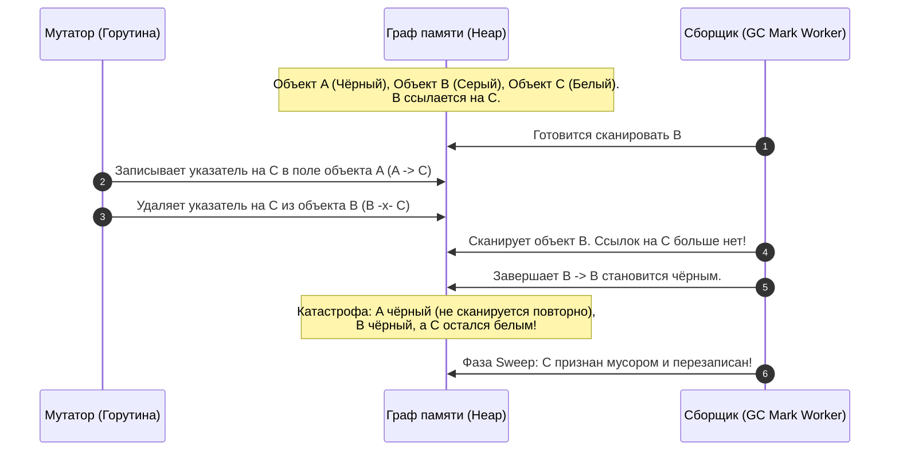

## Почему триколорный маркинг — сердце Go GC

В программировании самые фундаментальные и элегантные алгоритмические концепции нередко формулируются в виде простых метафор, которые можно набросать карандашом на салфетке в кафе. В 1978 году Эдсгер Дейкстра, Лесли Лэмпорт и их соавторы опубликовали ставшую классической статью *"On-the-Fly Garbage Collection: An Exercise in Cooperation"*, где впервые предложили абстракцию трёх цветов.

В предыдущей статье [[1. GC в Go. Обзор]] мы очертили общую архитектуру рантайма: конкурентный mark-sweep сборщик мусора с ультракороткими паузами, нацеленный на миллисекундную и микросекундную предсказуемость latency. Теперь мы спускаемся на уровень ключевого алгоритмического ядра, делающего возможной эффективную маркировку живых структур данных без полной заморозки мутатора (работающего пользовательского приложения). Это ядро — **триколорный маркинг** (tri-color marking).

Триколорный маркинг — это математическая абстракция для отслеживания состояний объектов в куче во время mark-фазы. Он лежит в основе любого высокопроизводительного конкурентного сборщика мусора, включая Go. Глубокое понимание триколорного алгоритма необходимо Senior-инженеру, чтобы предметно разбираться в причинах возникновения и флуктуаций GC-пауз ([[3. Stop the world]]), накладных расходах от барьеров записи ([[5. Write barriers]]), вымывании процессорного кэша и корректности работы распределённых систем под непрерывной конкурентной сборкой.

В этой статье мы подробно разберём, как алгоритм классифицирует и раскрашивает граф объектов, почему конкурентная модификация указателей неизбежно порождает коварные гонки и требует барьеров записи, а также заглянем в исходный код рантайма Go, чтобы понять, как цвета выражаются в битовых масках кремниевой памяти.

---

## Основные понятия: три цвета

Алгоритм оперирует абстрактными цветами, присваиваемыми каждому объекту, размещённому в динамической памяти (heap):

- **Белый (White)** — объект ещё не посещён сборщиком мусора. По завершении маркировки все объекты, оставшиеся в белом множестве, признаются недостижимым мусором и подлежат утилизации на этапе sweep. Это исходный цвет абсолютно всех объектов в начале цикла GC.
- **Серый (Grey)** — объект уже посещён и признан живым, но его потомки (дочерние объекты, на которые указывают его поля) ещё не просканированы. Серые объекты образуют динамический «фронт волны» (wavefront) обхода графа.
- **Чёрный (Black)** — объект гарантированно жив, и все его исходящие указатели полностью исследованы сборщиком. Чёрные объекты никогда больше не сканируются повторно в рамках текущего цикла; они останутся жить в куче после завершения фазы sweep.

Процесс маркировки непрерывно перемещает объекты из белого множества в серое, а затем в чёрное по мере продвижения фронта сканирования. Когда серое множество окончательно опустеет, маркировка считается завершённой: куча строго разделена на живые чёрные узлы и недостижимый белый мусор.


> [!info] Под капотом
> В реальной реализации Go цвета не привязаны физически к телу объекта и не расходуют память в заголовках пользовательских структур данных. Они кодируются отдельными битами в служебных структурах `mspan`, управляющих страницами кучи.
> 
> В файле `runtime/mbitmap.go` для каждого квантованного слота в спане выделяется битовая маска: `gcBits` представляет собой компактный битовый массив, где для маркировки используется статус посещения. Логически объекты классифицируются двухбитовыми состояниями: `00` — белый, `01` — серый (объект находится в рабочей очереди mark-воркера `workbuf`), `10` — чёрный (бит в `gcBits` выставлен, и объект извлечён из рабочей очереди). Непосредственная логика сканирования и продвижения волны реализована в `runtime/mgcmark.go`.

---

## Пошаговый алгоритм триколорной маркировки

В статическом мире (где программа остановлена) триколорный алгоритм абсолютно прямолинеен:

1. **Инициализация:** Все объекты кучи логически помечаются белыми (сбрасываются маски `gcBits`). Корневые указатели (roots) — регистры процессора, стеки всех активных горутин и глобальные статические переменные — сканируются сборщиком. Все объекты, на которые они ссылаются напрямую, окрашиваются в серый цвет и помещаются в очередь обработки (серое множество).
2. **Цикл маркировки:** Пока серое множество не пусто, фоновые воркеры выполняют следующий цикл:
   - Извлекают серый объект из очереди.
   - Сканируют его память: для каждого найденного указателя, ведущего на другой объект в куче, проверяют цвет целевого объекта.
   - Если целевой узел белый, он немедленно красится в серый и добавляется в серое множество (фронт волны расширяется).
   - Как только все указатели текущего объекта проверены, сам объект окрашивается в чёрный цвет и исключается из серого множества.
3. **Завершение:** Когда в сером множестве не остаётся ни одного объекта, волна сканирования достигла тупиков во всех ветвях графа. Все достижимые объекты стали чёрными. Любой объект, оставшийся белым, физически недостижим ни из одного корня — это мусор, который подлежит освобождению.

Этот классический алгоритм безупречно и математически доказанно работает в однопоточном мире с полной остановкой программы (STW). Однако главная гордость Go — это конкурентная сборка: мутатор (код горутин приложения) продолжает выполняться **параллельно** с mark-воркерами сборщика, на лету переставляя указатели в памяти. И именно здесь возникает фундаментальная угроза целостности памяти — проблема «пропавшего объекта».

---

## Проблема пропавшего объекта и необходимость барьера

Представьте, что сборщик мусора медленно и вдумчиво обходит огромный граф, а горутины мутатора на соседних ядрах CPU ежесекундно переписывают миллионы полей структур. Возникает классическая гонка: мутатор может буквально «спрятать» живой белый объект за спиной сборщика.

Рассмотрим хрестоматийный сценарий нарушения триколорного инварианта:



Разберём этот сценарий шаг за шагом:
1. Чёрный объект `A` уже обработан сборщиком. Сборщик гарантирует: к объекту `A` он в этом цикле больше не вернётся.
2. Серый объект `B` находится в очереди на обход и пока содержит единственную ссылку на белый объект `C`.
3. Мутатор копирует ссылку на `C` в чёрный объект `A` (`A.ptr = C`), а затем немедленно удаляет исходную ссылку из `B` (`B.ptr = nil`).
4. Когда воркер сборщика наконец доходит до сканирования `B`, он не обнаруживает ссылки на `C`. Объект `B` чернеет.
5. Итог трагичен: объект `C` абсолютно жив и нужен приложению (на него ссылается живой чёрный узел `A`), но сборщик видит `C` белым, так как чёрные узлы повторно не инспектируются. При наступлении фазы очистки (sweep) память объекта `C` будет возвращена в аллокатор и затерта другими данными — происходит повреждение памяти (Use-After-Free).

Чтобы конкурентный сборщик никогда не совершил подобной ошибки, он обязан строго блюсти одно из двух математических условий:
- **Сильный триколорный инвариант (Strong Tri-color Invariant):** чёрный объект ни при каких обстоятельствах не может содержать прямой ссылки на белый объект.
- **Слабый триколорный инвариант (Weak Tri-color Invariant):** чёрный объект может указывать на белый, но только при условии, что этот белый объект защищён: существует альтернативный путь к нему от какого-либо серого объекта через цепочку белых ссылок.

Для принудительного соблюдения этих инвариантов на лету в рантайм внедряется специальный перехватчик — **write barrier** (барьер записи).

---

## Write barrier в Go: стиль Dijkstra и Yuasa

Барьер записи — это крошечный фрагмент ассемблерного кода, автоматически вставляемый компилятором перед каждой инструкцией записи указателя в память. Исторически сложились две классические школы построения барьеров:

- **Барьер Дейкстры (Dijkstra write barrier — insertion barrier):**  
  Оберегает сильный инвариант. При попытке записать указатель на белый объект `C` в любой другой объект, барьер перехватывает операцию и немедленно перекрашивает `C` в серый цвет (`shade(C)`), помещая его в рабочую очередь. Чёрный объект никогда не станет указывать на белый — белый объект мгновенно сереет.
- **Барьер Юасы (Yuasa write barrier — deletion barrier):**  
  Оберегает слабый инвариант на основе концепции «моментального снимка при начале» (Snapshot-at-the-beginning). При попытке затереть или удалить ссылку на белый объект `C` (`*slot = nil`), барьер перехватывает старое значение слота и перекрашивает удаляемый белый объект `C` в серый. Если объект был достижим в момент старта GC, он гарантированно доживёт до конца цикла.

### Гибридный барьер записи Go (Hybrid Write Barrier)

Начиная с Go 1.8, в рантайме реализован элегантный **гибридный барьер записи**, объединяющий преимущества подходов Дейкстры и Юасы.

До Go 1.8 барьер записи Дейкстры работал только для кучи, но не для стеков горутин (иначе вызов барьера на каждую манипуляцию локальной переменной на стеке убил бы производительность вызовов функций). В результате стеки оставались «серыми», и в конце фазы маркировки рантайму приходилось объявлять длительную STW-паузу (Mark Termination), чтобы заново заморозить мир и повторно пересканировать стеки всех горутин приложения.

Гибридный барьер Go полностью решил эту проблему:
1. В момент активации фазы маркировки стеки горутин сканируются и их корни окрашиваются в чёрный цвет раз и навсегда.
2. Все новые объекты, аллоцируемые горутиной во время mark-фазы, сразу маркируются как **чёрные**.
3. При любой перезаписи указателя в куче выполняется составная логика:
   - Старый указатель, находившийся в слоте, красится в серый (стиль Yuasa).
   - Новый указатель, записываемый в слот, также красится в серый (стиль Dijkstra).

Благодаря этому инвариант не нарушается ни на стеке, ни в куче. В фазе Mark Termination больше нет необходимости повторно пересканировать стеки (stack re-scanning), за счёт чего STW-паузы в Go упали с десятков миллисекунд до десятков микросекунд!

В исходном коде рантайма (`runtime/mwbbuf.go`) для максимальной производительности реализован буферизованный барьер записи: компилятор подставляет быструю ассемблерную проверку и вызов `gcWriteBarrier`. Вместо мгновенной блокировки мьютексов мутатор просто сбрасывает адрес указателя в локальный кольцевой буфер процессора (`p.wbBuf`), который пачками сбрасывается в глобальные списки `workbuf` сборщика.

> [!tip] Собеседование
> **Вопрос:** Почему классический триколорный алгоритм маркировки неработоспособен при конкурентной работе мутатора без механизма Write Barrier?
> **Ответ:** Потому что во время конкурентного выполнения мутатор может переписать указатели так, что ссылка на белый объект будет перемещена в уже проверенный чёрный объект, а исходная ссылка из серого объекта будет удалена. Поскольку чёрные объекты повторно сборщиком не сканируются, белый живой объект окажется незамеченным сборщиком и будет ошибочно уничтожен на фазе sweep (нарушение триколорного инварианта). Write barrier перехватывает запись или удаление ссылок и немедленно подкрашивает целевой белый объект в серый цвет, гарантируя сохранение живых данных.

---

## Практический пример триколорного обхода на Go

Чтобы наглядно увидеть механику движения фронта раскраски, обратимся к фрагменту кода, создающему древовидную структуру в куче:

```go
package main

import "runtime"

type Node struct {
    Value int
    Left  *Node
    Right *Node
}

func main() {
    // Выделяем объекты в динамической памяти
    root := &Node{Value: 1}
    root.Left = &Node{Value: 2}
    root.Right = &Node{Value: 3}

    // Принудительно инициируем цикл сборки мусора
    runtime.GC()
}
```

В момент старта фазы маркировки:
1. **Roots:** Стек функции `main` содержит локальный указатель `root`. Сборщик сканирует стек, находит указатель на вершину дерева и помечает узел `Node{Value: 1}` как **серый**, помещая его адрес в очередь маркировки `workbuf`.
2. **Сканирование узла:** Воркер сборщика извлекает `root` из серого буфера. Он исследует метаданные типа и поля структуры. Обнаружив указатели `Left` и `Right`, сборщик обращается к их `mspan` в куче:
   - Узлы `Node{Value: 2}` и `Node{Value: 3}` пока белые. Сборщик выставляет соответствующие биты в их `gcBits`, перекрашивая их в **серый**, и добавляет в очередь воркера.
   - Узел `root` полностью исследовал свои исходящие связи. Он красится в **чёрный** цвет.
3. **Продвижение фронта:** Воркер последовательно извлекает `Left` и `Right`. У них поля `Left` и `Right` равны `nil`. Никаких новых белых объектов не обнаружено. Оба узла чернеют.
4. **Финал:** Серая очередь опустела. Все три узла дерева стали чёрными. Маркировка успешно завершена.

Если бы в процессе выполнения шага 2 другая горутина исполнила `root.Left = &Node{Value: 4}`, включился бы гибридный write barrier: старый узел `2` и новый узел `4` были бы принудительно окрашены в серый цвет, гарантируя, что ни один узел дерева не выпадет из поля зрения сборщика.

---

## Влияние на производительность и паузы

Хотя триколорная маркировка и выполняется в основном конкурентно, она не свободна от накладных расходов. Архитектура Go платит за ультранизкие паузы двумя видами ресурсов:

1. **Короткие фазы Stop-The-World ([[3. Stop the world]]):**
   - **Mark Setup (STW 1):** Остановка всех горутин на десятки микросекунд для переключения глобального состояния рантайма, очистки локальных кэшей процессоров `P`, включения write barrier и подготовки битовых карт `gcBits`.
   - **Mark Termination (STW 2):** Вторая микропауза для выключения барьера записи, финализации буферов `wbBuf` и завершения mark-фазы.
2. **Штраф барьера записи (Write Barrier Overhead):**
   Каждая операция присваивания указателя в куче `*ptr = val` превращается компилятором в условный переход и обращение к буферу. В обычном бизнес-коде этот оверхед составляет доли процента. Однако в высоконагруженных lock-free структурах, очередях сообщений или при частой мутации больших деревьев (например, интенсивная модификация `sync.Map` или графов связей) миллионы вызовов `gcWriteBarrier` создают заметное пенальти по пропускной способности CPU.

---

## Mechanical Sympathy: триколор и кэш

С точки зрения кремния и архитектуры фон Неймана, триколорный обход графа — это классический сценарий **Pointer Chasing** (погоня за указателями). 

```
[L1 Data Cache: 32-48 KB] <--> [L2 Cache: 512KB-1MB] <--> [L3 Shared Cache: 16-64MB] <--> [DRAM / RAM]
         ^                                                                                     ^
         |                                                                                     |
    Hit: ~1-4 такта                                                                      Miss: ~150-250 тактов
```

Когда воркер сборщика мусора разыменовывает указатели произвольных структур в куче, он прыгает по адресам памяти, фрагментированным по разным спанам и страницам. Каждый такой прыжок с высокой вероятностью приводит к:
- **L1/L2/L3 Cache Miss:** Процессорное ядро простаивает 150–250 тактов в ожидании доставки кэш-линии из физической оперативной памяти.
- **TLB Miss:** Необходимость трансляции виртуального адреса в физический требует обхода таблиц страниц операционной системы (Page Table Walk).
- **Cache Eviction (Вымывание кэша):** Сборщик мусора, обходя миллионы живых объектов, принудительно вытесняет из кэша L1/L2 горячие рабочие структуры вашего приложения. После завершения GC сервис может испытывать кратковременную деградацию latency просто потому, что приложению приходится заново прогревать кэш процессора.

Именно поэтому современное понимание Mechanical Sympathy диктует сокращение связности данных: плоские монолитные слайсы значений `[]T` обходятся рантаймом без единого обращения к указателям (сборщик мусора сразу видит, что тип `T` не содержит полей-указателей, и мгновенно чернит всю область памяти без сканирования), в то время как связанные списки или деревья из мелких структур вызывают максимальную нагрузку на подсистему памяти ([[8. Cache friendliness]]).

Кроме того, буферы барьера записи `wbBuf` размещены в памяти, и при интенсивной записи мутатором они могут конкурировать за шину памяти и линии кэша L3, увеличивая False Sharing и накладные расходы консистентности.

---

## Итог

- **Триколорный маркинг** — фундаментальный алгоритм mark-фазы Go GC: объекты последовательно мигрируют из белого множества (непосещённые) через серое (фронт волны) в чёрное (живые и обработанные), что обеспечивает возможность конкурентного обхода графа.
- Без барьера записи конкурентная маркировка невозможна: мутатор способен спрятать белый объект за спиной чёрного, вызвав потерю живых данных.
- Go применяет **гибридный барьер записи** (Dijkstra + Yuasa), сохраняющий сильный и слабый инварианты, что устранило необходимость повторного сканирования стеков горутин и сократило STW-паузы до долей миллисекунды.
- Маркировка не изменяет память самих объектов: состояния отслеживаются через компактные битовые маски `gcBits` в служебных структурах `mspan`.
- С точки зрения оборудования, обход указателей сборщиком — это тяжелейшая нагрузка на шину памяти и кэш CPU. Оптимизация структур данных за счёт устранения лишних указателей ускоряет как саму сборку мусора, так и рабочие циклы приложения.

В следующей статье мы детально исследуем моменты, когда мир всё же обязан остановиться: [[3. Stop the world]] — какие скрытые процессы происходят в рантайме во время STW-пауз и почему современные процессоры научились делать их практически незаметными.