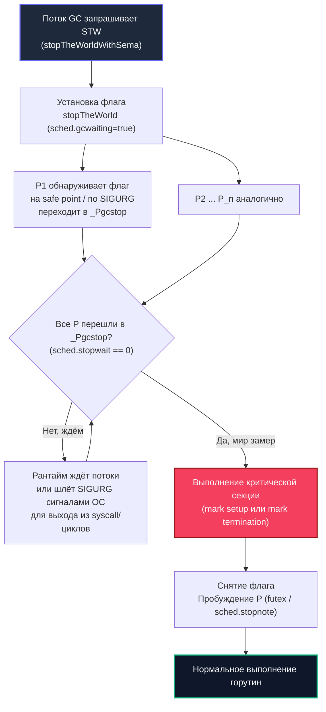

## Почему мир всё ещё останавливается

В симфоническом оркестре перед кульминационным вступлением солиста дирижёр на долю секунды замирает с поднятой палочкой. На мгновение воцаряется абсолютная тишина: музыканты не извлекают звуков, сверяют темп и переворачивают страницу партитуры. Это не срыв концерта, а строгая синхронизация, без которой полифоническое многоголосие превратилось бы в какофонию.

В [[1. GC в Go. Обзор]] мы определили сборщик мусора Go как высококонкурентную систему с минимальными задержками, а в [[2. Tri color marking]] детально разобрали триколорный алгоритм, позволяющий инспектировать память параллельно с исполнением прикладных горутин. Однако полностью исключить глобальные остановки инженерам рантайма не удалось (да и теоретически невозможно без катастрофической деградации пропускной способности) — **Stop The World (STW)** остаётся фундаментальной фазой жизненного цикла Go.

STW в Go — это не архитектурный дефект и не рудимент ранних версий языка, а осознанный инженерный компромисс. Без кратких миллисекундных и микросекундных точек строгой глобальной согласованности невозможно корректно инициализировать структуры данных сборщика, переключить фазы гибридного барьера записи и зафиксировать финальное состояние графа памяти. Профессиональная задача Senior-инженера — глубоко понимать анатомию этих пауз, знать, какие процессы происходят на кремниевых ядрах при заморозке горутин, уметь инструментально измерять задержки и устранять аномалии, бьющие по p99 latency ([[7. Tail latency и почему она важна]]).

В этой статье мы подробно вскроем внутреннюю механику STW: как рантайм и планировщик взаимодействуют с операционной системой для остановки потоков, почему длительность пауз может неожиданно возрастать при неграмотной архитектуре структур данных, как читать метрики (`GODEBUG=gctrace=1`, execution tracer, `runtime.ReadMemStats`) и как подготовить фундамент для тонкого тюнинга в [[7. GOGC и tuning]] и [[8. GOMEMLIMIT]].

---

## Что такое Stop The World в Go

**Stop The World** — это состояние рантайма, при котором исполнение **абсолютно всех пользовательских горутин** временно замораживается, позволяя системному потоку сборщика мусора выполнить критическую секцию в условиях абсолютной неизменяемости памяти. В период STW:

- Ни одна горутина не исполняет инструкции пользовательского кода.
- Все логические процессоры `P` (в количестве `GOMAXPROCS`) переводятся в служебное состояние ожидания, новые горутины не планируются на исполнение.
- Системные вызовы ядра ОС, которые выполнялись потоками `M` в момент инициации STW, изолируются: при выходе из syscall поток не возвращается к исполнению Go-кода, а блокируется до отмены глобальной паузы.

STW кардинально отличается от локальной блокировки горутины на мьютексе `sync.Mutex` или чтении из пустого канала: это глобальное скоординированное событие уровня всего рантайма, затрагивающее каждую строчку кода процесса.

В современном Go (начиная с революционного релиза Go 1.5 и последующих улучшений Go 1.8–1.24) STW используется точечно, а не растягивается на весь период сканирования памяти. В полном цикле сборки существуют ровно две точки глобальной остановки:

1. **Mark setup** — подготовка структур данных к конкурентной mark-фазе и активация барьера записи.
2. **Mark termination** — финализация маркировки, обработка остаточных очередей write barrier и отключение барьеров.

Исторически в Go существовала третья пауза — **sweep termination**, во время которой блокировался весь мир для подготовки очистки спанов. В современном рантайме sweep стал полностью конкурентным и ленивым: он выполняется фоновой горутиной `bgsweep` и самими аллоцирующими горутинами по требованию (on-demand allocation assist), не требуя STW.

В подавляющем большинстве штатно работающих Go-сервисов суммарная длительность обеих пауз укладывается в диапазон от 10 до 100 микросекунд. Однако при неблагоприятных факторах (сотни миллионов указателей, невытесняемые циклы, нехватка системных ресурсов) микросекунды могут превращаться в десятки миллисекунд.

---

## Как рантайм останавливает мир

Остановка десятков тысяч легковесных горутин, распределённых по десяткам потоков ОС `M` и логических процессоров `P`, представляет собой сложнейшую задачу координации. Этот механизм реализован в файле `runtime/proc.go` низкоуровневой функцией `stopTheWorldWithSema`.

Последовательность действий рантайма при инициации STW:

1. Горутина-координатор GC захватывает глобальный мьютекс планировщика и выставляет флаг запроса остановки: `sched.gcwaiting.Store(true)` (логически `stopTheWorld`).
2. Для каждого логического процессора `P` выставляется статус ожидания остановки. Координатор проверяет каждый `P`:
   - Если `P` выполняет горутину, ей необходимо дойти до ближайшей безопасной точки — **safe point**.
   - Если `P` находится в состоянии ожидания (`_Pidle`), рантайм немедленно переводит его в состояние `_Pgcstop`.
   - Если поток выполняет системный вызов (`_Psyscall`), процессор отбирается у потока и также переводится в `_Pgcstop`.
3. **Механизм Safe Points и Preemption:**  
   Рантайм не может грубо оборвать поток посреди ассемблерной инструкции записи указателя — это приведёт к разрушению структур данных. Остановка возможна только в строго определённых safe points. Исторически (до Go 1.14) safe points размещались компилятором исключительно в прологах функций (проверка переполнения стека `morestack`). Если горутина застревала в плотном цикле численных расчётов без вызовов функций (`for i := 0; i < 1e9; i++ {}`), мир не мог остановиться секундами! Начиная с Go 1.14, рантайм использует **асинхронную сигнальную преемпцию**: фоновый системный монитор (`sysmon`) отправляет зависшему потоку сигнал ОС `SIGURG` (в Linux/macOS), обработчик которого безопасно сохраняет регистры горутины и передаёт управление планировщику.
4. Когда последний `P` переходит в состояние `_Pgcstop`, мир официально считается остановленным. Координатор сборщика выполняет критическую секцию.
5. После завершения критических работ флаг `gcwaiting` сбрасывается, планировщик пробуждает все `P` через семафор `sched.stopnote` (системный вызов futex в Linux), и горутины возвращаются к работе.



> [!info] Под капотом
> Ключевые структуры синхронизации STW сосредоточены в глобальной структуре `sched` (`runtime/runtime2.go`):
> - `sched.stopwait` — атомарный счётчик процессоров `P`, которые ещё не достигли safe point и продолжают крутиться на ядрах CPU.
> - `sched.stopnote` — легковесная нотификационная структура на базе системного примитива futex (в Linux). Поток-инициатор засыпает на `notesleep(&sched.stopnote)`, пока последний процессор, декрементируя `stopwait` до нуля, не вызовет `notewakeup`.
> Безопасные точки (safe points) расставляются компилятором не случайно: они гарантируют, что состояние локальных переменных на стеке строго зафиксировано в картах указателей (stack maps), и сборщик может безошибочно отличить указатель на кучу от обычного 64-битного числа `int64`.

---

## Mark setup STW: подготовка маркировки

Первая пауза цикла GC наступает, когда объем выделенной памяти пересекает триггерный порог, рассчитанный алгоритмом GC Pacer. Её задача — подготовить глобальное окружение к конкурентному сканированию:

- **Сброс битовых карт:** Инициализация и обнуление рабочих битовых карт `gcBits` для всех спанов в аренах кучи.
- **Активация Write Barrier:** Рантайм переводит глобальную переменную `runtime.writeBarrier.enabled` в состояние `true`. С этого микросекундного момента любая операция модификации указателя в пользовательском коде начинает регистрироваться барьером записи ([[5. Write barriers]]).
- **Фиксация корней:** Устанавливается состояние сборщика, подготавливаются дескрипторы корневых указателей (глобальные переменные BSS/Data и стеки горутин).
- Устанавливается флаг `worldStopped` и переключается фаза рантайма в `_GCmark`.

Длительность фазы Mark setup зависит от:
- Объёма виртуальной памяти кучи и количества спанов (необходимость сброса структур).
- Общего количества активных горутин в системе (подготовка метаданных стеков).
- Количества логических процессоров `P` (`GOMAXPROCS`): чем больше ядер, тем больше времени требуется на взаимную синхронизацию остановки и сброс локальных кэшей аллокатора `mcache`.

В хорошо настроенном сервисе время Mark setup составляет от **5 до 30 микросекунд**.

---

## Mark termination STW: финализация маркировки

Вторая фаза глобальной остановки наступает тогда, когда конкурентные воркеры рантайма докладывают, что серое множество пусто: видимые корни и связанные объекты просканированы. Однако из-за того, что мутатор работал параллельно, в системе остаются «хвосты». 

Критические задачи Mark termination:
- **Drain work queues:** Окончательное вычерпывание и обработка локальных очередей маркеров всех процессоров `P`.
- **Flush write barrier buffers:** Опорожнение буферов барьера записи (`wbBuf`) каждого процессора. Если горутина в последнюю наносекунду перед остановкой переставила указатель, этот указатель лежит в буфере ядра — сборщик извлекает его и докрашивает оставшиеся белые объекты ([[5. Write barriers]]).
- **Деактивация Write Barrier:** Перевод флага барьера записи обратно в `false`. С этого момента мутатор больше не платит штраф накладных расходов за запись указателей.
- **Расчёт метрик и следующего триггера:** Анализ фактического объёма живой памяти (survived heap), обновление коэффициента pacing и вычисление следующего порога срабатывания GC (с учётом `GOGC` и `GOMEMLIMIT`).
- Перевод фазы рантайма в `_GCmarktermination`, а затем в `_GCoff`. Подготовка арены к ленивой фазе sweep.

Mark termination почти всегда длится чуть дольше Mark setup, поскольку требует синхронного опорожнения всех буферов барьеров. Типичная продолжительность: от **15 до 80 микросекунд**.

---

## Факторы, влияющие на продолжительность STW

Если архитектура приложения спроектирована без учёта Mechanical Sympathy, длительность пауз может деградировать на порядки. Главные факторы риска:

1. **Размер кучи и количество спанов:** Чем больше гигабайт занимает куча, тем больше служебных структур метаданных приходится обнулять и синхронизировать.
2. **Количество горутин:** Каждая созданная горутина обладает собственным стеком, который в момент остановки должен быть зарегистрирован рантаймом. Миллион спящих горутин в микросервисе — прямой путь к STW-паузам в десятки миллисекунд.
3. **Количество указателей в структурах данных:** Чем плотнее граф ссылок, тем больше работы приходится выполнять write barrier и тем больше накопленных указателей приходится сбрасывать в Mark termination.
4. **Конфигурация `GOMAXPROCS`:** На многоядерных машинах (128–256 vCPU) время достижения фазы `_Pgcstop` растёт: рантайму требуется скоординировать остановку 256 аппаратных потоков, что увеличивает время ожидания (Stop-The-World Latency = время остановки последнего `P` + полезная работа).
5. **Системные вызовы ядра ОС:** Потоки, заблокированные в операциях дискового I/O или сетевых вызовах ядра, отключаются от своих `P`. Если поток вовремя не отдал процессор, сборщик тратит драгоценное время на ожидание и перехват контекста.
6. **Особенности ОС и виртуализации:** Троттлинг процессорного времени со стороны Linux cgroups (CPU Quota), кража процессорных тактов гипервизором (Steal Time в облаках AWS/GCP) и планировщик ОС могут искусственно затягивать пробуждение потоков после STW.

---

## Измерение STW: метрики и инструменты

Профессиональный инженер никогда не гадает о длительности пауз — он оперирует инструментальными данными с точностью до наносекунды.

### GODEBUG=gctrace=1

Самый доступный и легковесный способ увидеть пульс сборщика мусора в реальном времени — запуск приложения с переменной окружения `GODEBUG=gctrace=1`:

```bash
GODEBUG=gctrace=1 ./my-service
```

Каждый цикл GC выводит в `stderr` компактную строку телеметрии:

```text
gc 1 @0.001s 0%: 0.015+0.13+0.007 ms clock, 0.12+0.10/0.13/0.05+0.05 ms cpu, 4->4->2 MB, 5 MB goal, 0 MB stacks, 0 MB globals, 16 P
```

Расшифровка временных интервалов первой группы (`clock` — астрономическое время по настенным часам):
- `0.015` (или 0.015 ms) — **STW Mark setup** (15 микросекунд полной остановки мира).
- `0.13` (или 0.13 ms) — **Конкурентная фаза маркировки** (время, пока шёл mark параллельно с работой приложения).
- `0.007` (или 0.007 ms) — **STW Mark termination** (7 микросекунд финальной остановки мира).

Реальные паузы Stop The World для приложения — это сумма первого и третьего чисел: `0.015 + 0.007 = 0.022 ms` (22 микросекунды). Вторая группа (`cpu`: `0.12+0.10/0.13/0.05+0.05 ms cpu`) отражает процессорное время, суммированное по всем ядрам (включая выделенные воркеры, assist и idle-потоки).

### execution tracer

Утилита `go tool trace` ([[3. execution tracer]]) — абсолютный золотой стандарт для микрохирургического анализа пауз. Запустив трассировку выполнения, вы увидите полную временную шкалу каждого процессорного ядра:

```bash
go test -trace=trace.out
go tool trace trace.out
```

В интерактивном веб-интерфейсе фазы STW наглядно визуализируются как монолитные вертикальные столбцы, в которых приостанавливаются все дорожки пользовательских горутин, а системные полосы рантайма переходят в режим `GC Mark Termination` или `GC Mark Setup`. Трейсер позволяет моментально определить, какой именно `P` дольше всех задерживал наступление STW и почему.

### runtime.ReadMemStats

Для мониторинга здоровья приложения в production без накладных расходов трассировки используется структура `runtime.MemStats`:

```go
package main

import (
    "fmt"
    "runtime"
    "time"
)

func main() {
    var m runtime.MemStats
    runtime.ReadMemStats(&m)

    // PauseNs — циклический буфер на 256 элементов (в наносекундах)
    // PauseEnd — временные метки Unix epoch (в наносекундах)
    if m.NumGC > 0 {
        lastPauseIdx := (m.NumGC - 1) % 256
        lastPauseNs := m.PauseNs[lastPauseIdx]
        lastPauseEnd := time.Unix(0, int64(m.PauseEnd[lastPauseIdx]))

        fmt.Printf("Количество сборок: %d\n", m.NumGC)
        fmt.Printf("Последняя пауза STW: %v (%s)\n", 
            time.Duration(lastPauseNs), lastPauseEnd.Format(time.RFC3339Nano))
    }
}
```

Поля `MemStats.PauseNs` и `PauseEnd` экспортируются через Prometheus/OpenTelemetry для построения графиков и дашбордов Grafana ([[8. Observability и performance]]).

### pprof

Эндпоинт `/debug/pprof/trace?seconds=5` пакета `net/http/pprof` даёт возможность снять живую трассу задержек прямо с боевого продакшн-сервера без перезапуска процесса.

> [!tip] Собеседование
> **Вопрос:** Как программно в работающем Go-сервисе узнать точную длительность последней STW-паузы без остановки процесса и без использования pprof-файлов?
> **Ответ:** Вызвать функцию `runtime.ReadMemStats(&m)` и извлечь значение из циклического буфера задержек: `m.PauseNs[(m.NumGC-1)%256]`. Значение возвращается в наносекундах (`time.Duration(lastPauseNs)`).

---

## Влияние STW на производительность

Хотя 50 микросекунд кажутся незаметным мгновением на фоне сетевого round-trip time, их кумулятивный эффект на высоконагруженные системы носит взрывной характер:

- **Деградация хвостовых квантилей (Tail Latency):** Запрос, попавший в момент наступления STW, принудительно задерживается на время паузы. Если сборщик мусора запускается 100 раз в секунду, десятки тысяч сетевых пакетов неизбежно ловят эту задержку, взвинчивая метрики p99 и p99.9 ([[7. Tail latency и почему она важна]]).
- **Каскадные задержки в распределённых микросервисах:** В цепочке вызовов $A \to B \to C \to D$ кратковременная пауза сервиса $B$ приводит к переполнению очередей сокетов в сервисе $A$, росту длины очереди задач и каскадному росту латентности всей платформы.
- **Ложные срабатывания таймаутов (Heartbeat Drops):** В кластерных распределённых системах (Raft, etcd, Consul, Apache Kafka) узлы обмениваются периодическими ping/heartbeat сообщениями. Аномально затянувшаяся STW-пауза (например, на 500 мс из-за сканирования огромной 100 ГБ кучи) может привести к тому, что лидер кластера будет признан упавшим, спровоцировав пагубный процесс перевыборов лидера (Split-Brain / Leader Re-election).
- **Потеря пропускной способности (Throughput Penalty):** На время STW полезная работа приложения полностью замирает. В сервисах с агрессивным созданием мусора рантайм может тратить до 5–10% всего астрономического времени на синхронизацию пауз.

---

## Как уменьшить STW-паузы

Инженерная борьба со сверхнормативными STW-паузами всегда строится на снижении объёма метаданных, сканируемых рантаймом:

1. **Снижение числа аллокаций и живых объектов:** Чем меньше блоков памяти выделено в куче, тем быстрее рантайм сбрасывает битовые карты в Mark setup и тем меньше объектов чернеет в Mark termination. Применяйте пулы объектов [[2. sync Pool]], предвыделение капасити [[4. Предвыделение памяти]] и техники ухода от кучи [[1. Уменьшение аллокаций]].
2. **Контроль пула горутин:** Избегайте бесконтрольного порождения миллионов горутин по принципу «одна горутина на каждое мелкое событие». Используйте пулы фиксированного размера (Worker Pools). Меньше стеков — быстрее фаза синхронизации safe points.
3. **Устранение глубоких стеков и гигантских фреймов:** Рекурсивные алгоритмы раздувают стеки горутин до мегабайтных размеров. Заменяйте рекурсию на итеративные циклы с плоскими буферами.
4. **Грамотная калибровка `GOGC` и `GOMEMLIMIT`:** Увеличение коэффициента `GOGC` позволяет GC срабатывать реже, снижая суммарную частоту STW-событий. А установка порога `GOMEMLIMIT` предотвращает разрастание кучи вблизи лимитов контейнера Linux ([[7. GOGC и tuning]], [[8. GOMEMLIMIT]]).
5. **Устранение лишних указателей (Pointer-free Structs):** Чем меньше указателей содержат структуры данных, тем меньше работы для `gcWriteBarrier` и тем быстрее завершается опорожнение очередей в Mark termination. Применяйте встраивание по значению (value-embedding) и компактные бинарные форматы ([[6. Cache friendly структуры]]).

> [!warning] Ловушка / Gotcha
> **Миф: «Конкурентный GC в Go полностью лишён пауз Stop-the-World».**  
> Это распространённое заблуждение маркетологов и начинающих разработчиков. Go GC является конкурентным исключительно на фазах сканирования графа и очистки (Mark и Sweep). Точки входа и выхода (Mark setup и Mark termination) являются абсолютно строгими STW-паузами. Игнорирование их существования приводит к катастрофическим архитектурным ошибкам в latency-critical системах.

> [!warning] Ловушка / Gotcha
> **Зависание в Unsafe-коде, CGO или плотных циклах ядра.**  
> Если горутина вызывает длительную блокирующую функцию на языке Си через cgo или выполняет низкоуровневый платформенный ассемблерный код, рантайм не может безопасно внедрить туда safe point. Сборщик мусора отправляет сигналы прерывания, но если код не возвращает управление в рантайм Go, фаза STW будет висеть, блокируя все остальные потоки сервиса!

---

## Mechanical Sympathy: остановка и процессор

С точки зрения кремниевой архитектуры CPU, фаза Stop The World наносит тяжелейший удар по микроархитектурному конвейеру процессора:

```
[Инструкции горутины] --> [STW Signal / Safe Point] --> [Сброс конвейера (Pipeline Flush)]
                                                                  |
[Вымывание L1i / L1d] <-- [Инструкции сборщика GC] <--------------+
         |
[Возобновление горутины] --> [Cold Cache Misses (~200 тактов)] --> [Прогрев кэша и BTB]
```

Когда процессорные ядра принудительно останавливают потоки мутатора:
- **Сброс конвейера инструкций и BTB:** Аппаратный предсказатель ветвлений (Branch Target Buffer) и конвейер исполнения инструкций сбрасываются.
- **Опустошение L1-кэша инструкций (L1i):** Ядра переключаются на исполнение служебного кода рантайма (`stopTheWorldWithSema`, `futex`), полностью вытесняя из L1i кэша циклы вашего бизнес-кода.
- **Инвалидация линий кэша данных (L1d / L2):** Сборщик мусора производит запись в системные битовые карты и служебные массивы спанов. Межъядерный протокол когерентности кэшей (MESI) вынужден инвалидировать сотни кэш-линий на всех ядрах.
- **Миграция потоков ОС:** После пробуждения планировщик операционной системы Linux может переместить поток `M` на совершенно другое физическое ядро (или другой сокет NUMA), где его локальный кэш полностью пуст.

В результате сервис после завершения 50-микросекундной паузы STW может ещё 1–2 миллисекунды испытывать «просадку» производительности: процессору приходится заново прогревать кэши и восстанавливать аппаратную предвыборку данных (Hardware Prefetching).

---

## Итог

- **STW (Stop The World)** — обязательные точки глобальной синхронизации в Go GC (фазы Mark setup и Mark termination), гарантирующие целостность структур сборщика и корректное переключение write barrier.
- Остановка потоков осуществляется координацией планировщика через safe points и асинхронные сигналы прерывания `SIGURG`.
- Длительность STW напрямую зависит от размера кучи, общего числа горутин, глубины их стеков и насыщенности структур указателями.
- Реальные задержки легко контролируются через `GODEBUG=gctrace=1`, микросекундную телеметрию `go tool trace` и метрики `runtime.MemStats.PauseNs`.
- Ключ к подавлению STW-пауз — Mechanical Sympathy: плоские бездатчиковые структуры памяти, минимизация аллокаций, использование пулов объектов и точная настройка параметров `GOGC` и `GOMEMLIMIT`.

Теперь, разобравшись с моментами глобальной паузы, мы переходим к исследованию того, как рантайм умудряется выполнять основную массу работы параллельно с вашей программой: [[4. Concurrent GC]].