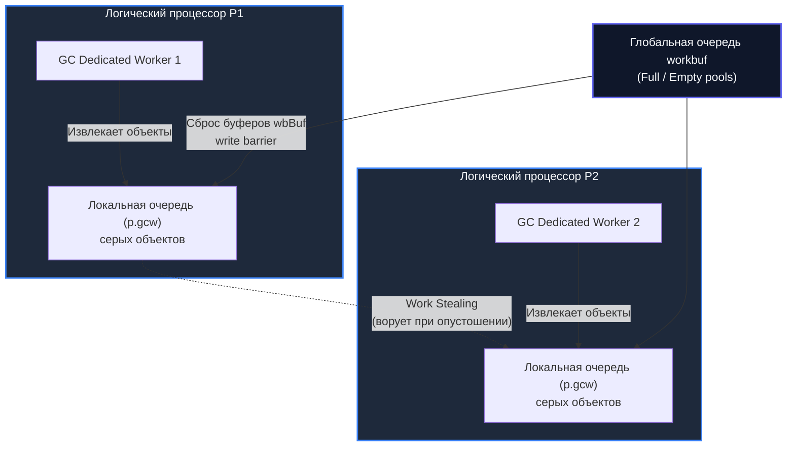

## Конкурентный GC: как Go совмещает сборку мусора и полезную работу

Представьте себе оживлённое многополосное шоссе в утренний час пик. В старых системах (stop-the-world сборщиках) дорожная служба раз в несколько минут выставляла шлагбаумы на всех полосах сразу: движение замирало, моторы глушились, а бригада рабочих неторопливо убирала мусор с асфальта. В современном Go инженеры реализовали гораздо более тонкий инженерный компромисс: на восьмиполосной трассе ровно две полосы (25% пропускной способности) отдаются оранжевым фургонам дорожной службы. Автомобили продолжают мчаться по соседним рядам параллельно с уборкой.

В [[1. GC в Go. Обзор]] мы обозначили, что сборщик мусора Go нацелен на ультранизкие задержки, в [[2. Tri color marking]] разобрали триколорный алгоритм, а в [[3. Stop the world]] — неизбежные микросекундные точки глобальной синхронизации. Однако главная архитектурная гордость рантайма Go заключена в слове **конкурентный** (concurrent). Способность выполнять тяжелейшую вычислительную работу — маркировку и очистку — одновременно с исполнением бизнес-логики горутин позволяет удерживать STW-паузы в рамках десятков микросекунд даже на огромных серверах.

**Конкурентный GC** означает, что фазы mark и sweep физически перекрываются во времени с исполнением пользовательского кода. Это не просто параллельные потоки — это синхронизированное сосуществование двух миров: мутатора (горутин приложения), постоянно изменяющего граф объектов, и сборщика мусора, инспектирующего этот граф на лету. В природе не бывает бесплатных вычислительных ресурсов: цена этой конкурентности — накладные расходы гибридного барьера записи ([[5. Write barriers]]), штрафной механизм принудительной помощи (mark assist), конкуренция за шину памяти и вымывание процессорного кэша.

В этой статье мы досконально разберём, как рантайм Go распределяет вычислительную мощность CPU между мутатором и сборщиком, кто такие GC worker'ы, как работает механизм принудительного торможения аллокаций mark assist и почему конкурентность не означает отсутствие задержек. Понимание этих механизмов необходимо Senior-инженеру для глубокой интерпретации метрик задержек ([[6. GC pause и latency]]), осознанного тюнинга параметров [[7. GOGC и tuning]] и локализации причин деградации хвостовых квантилей ([[7. Tail latency и почему она важна]]).

---

## Архитектура конкурентного цикла

Полный цикл сборки мусора в Go состоит из четырёх последовательных фаз, из которых две — микросекундные глобальные остановки мира, а две — масштабные конкурентные операции.

```mermaid
gantt
    title "Цикл GC: чередование STW и конкурентных фаз"
    dateFormat  X
    axisFormat  %s
    
    section Мутатор
    Работает               :active, mut1, 0, 3
    Остановлен             :crit, stw1, 3, 5
    Работает конкурентно   :active, mut2, 5, 12
    Остановлен             :crit, stw2, 12, 14
    Работает конкурентно   :active, mut3, 14, 20

    section GC Mark
    Ждёт                   :done, gcw1, 0, 3
    STW: Setup             :crit, setup, 3, 5
    Конкурентная маркировка :active, concMark, 5, 12
    STW: Termination       :crit, term, 12, 14

    section GC Sweep
    Ждёт                   :done, gcs1, 0, 14
    Конкурентная очистка    :active, concSweep, 14, 20
```

Жизненный цикл сборки мусора раскладывается по фазам следующим образом:

1. **Mark setup (STW):** Подготовительная микропауза (обычно < 30 мкс). Рантайм останавливает горутины, сбрасывает mark-биты спанов, включает барьер записи и фиксирует корневые указатели.
2. **Concurrent mark:** Основная вычислительная фаза. Специальные горутины сборщика (GC worker'ы) параллельно с горутинами мутатора обходят граф памяти, перекрашивая серые объекты в чёрные. Мутатор на соседних ядрах CPU продолжает обрабатывать запросы, выделять память и модифицировать указатели.
3. **Mark termination (STW):** Финальная микропауза (< 50 мкс). Мир снова замирает для опорожнения очередей, обработки последних буферов барьера записи и отключения `runtime.writeBarrier`.
4. **Concurrent sweep:** Освобождение памяти, занятой белыми (мёртвыми) объектами. Sweep полностью конкурентен, размазан по времени и не требует остановки мира: спаны очищаются лениво по мере запросов на аллокацию или фоновым чистильщиком.

Таким образом, мутатор полностью замирает только на две сверхкороткие точки setup и termination ([[3. Stop the world]]). Всё остальное время полезная работа сервиса и фоновая уборка памяти протекают параллельно.

---

## Конкурентная маркировка: кто и как маркирует

Как только завершается фаза Mark setup, планировщик Go переходит в режим конкурентного сканирования. На сцену выходит пул специализированных системных горутин — **GC worker'ов**. Их единственная задача — непрерывно извлекать адреса объектов из очередей серого множества, разыменовывать указатели и перекрашивать граф из белого в чёрный ([[2. Tri color marking]]).

Главный закон рантайма Go — **бюджет в 25% CPU**.  
По умолчанию сборщик мусора стремится занять ровно $1/4$ доступных аппаратных ресурсов машины:
$$\text{GC CPU Fraction} = 25\% \times \text{GOMAXPROCS}$$

Если сервис запущен на сервере с `GOMAXPROCS = 8`, планировщик выделит ровно 2 логических процессора `P` под постоянную работу сборщика, а оставшиеся 6 `P` отдаст на растерзание прикладным горутинам. Если `GOMAXPROCS` не делится на 4 нацело (например, 3 или 5), рантайм использует сложную модель комбинированных воркеров:
- **Dedicated Workers:** Воркеры, полностью монополизирующие процессор `P` на всё время mark-фазы.
- **Fractional Workers:** Воркеры, запускаемые на долю времени для точного соблюдения общего лимита в 25%.
- **Idle Workers:** Если в системе есть простаивающие процессоры `P` (у мутатора нет готовых к запуску горутин), сборщик задействует их для фоновой маркировки, ускоряя завершение цикла без ущерба для приложения.

Для распределения работы между параллельными воркерами рантайм использует механизм **Work Stealing** ([[3. Work stealing]]), аналогичный планировщику горутин ([[1. Scheduler Go. G-M-P модель]]). У каждого процессора `P` имеется локальный буфер серых объектов (`p.gcw`). Если локальный буфер опустошается, воркер обращается к глобальной очереди или «ворует» половину буфера у соседнего `P`.



> [!info] Под капотом
> В исходном коде `runtime/mgc.go` фоновые воркеры инициируются системной функцией `runtime.gcBgMarkWorker`. Каждый worker привязывается к процессору `P` и переходит в цикл `gcDrain`, сканирующий слоты памяти без вытеснения (preemption), пока в рабочей очереди есть задачи. Адреса объектов, окрашиваемых барьером записи во время работы мутатора, аккумулируются в кольцевых буферах `p.wbBuf` и периодически сбрасываются в глобальные списки `workbuf`.

---

### Mark assist: когда мутатор должен помогать

Конкурентная схема великолепно работает в стабильном потоке, но что произойдёт, если приложение начинает создавать объекты с чудовищной скоростью? Если мутатор аллоцирует память быстрее, чем выделенные 25% ядер успевают её маркировать, куча начнёт экспоненциально раздуваться, угрожая падением по OOM (Out Of Memory).

Для предотвращения катастрофы инженеры Go внедрили элегантный механизм обратного давления (backpressure) — **Mark Assist**.

Каждая горутина, запрашивающая новую аллокацию памяти в куче, проверяет свой «баланс долга» (allocation debt). Если темп аллокаций опережает расчётную траекторию сборщика (GC Pacer), горутина принудительно привлекается к исправительным работам:
1. Рантайм временно приостанавливает исполнение пользовательской функции горутины.
2. Горутина переключается на выполнение системного сканирования: она забирает порцию серых объектов из очереди и маркирует память (`runtime.gcAssistAlloc` или `runtime.gcDrain`).
3. Объём отработанной маркировки строго пропорционален размеру запрашиваемой памяти: чем больше мегабайт вы хотите аллоцировать, тем больший долг по маркировке обязаны погасить перед аллокатором.
4. Погасив долг, горутина получает память и возвращается к пользовательскому коду.

```
[Пользовательская горутина] 
          |
          v
  make([]byte, 10MB) 
          |
          +---> GC отстаёт от графика? 
                  |-- ДА --> [Вход в runtime.gcAssistAlloc]
                  |                 |
                  |          Сканирует 10MB серых объектов в куче!
                  |                 |
                  |          [Долг погашен] ---> Память выделена
                  |
                  +-- НЕТ -> Память выделена моментально
```

> [!warning] Ловушка / Gotcha
> **Mark Assist — скрытый убийца Tail Latency!**  
> Самое опасное заблуждение инженера — считать, что задержки GC исчерпываются микросекундами STW-пауз. Если ваш сервис под пиковой нагрузкой начинает аллоцировать слишком много временных объектов, рантайм принудительно бросает рабочие горутины на помощь сборщику (`runtime.gcAssistAlloc`). В результате обработчик HTTP-запроса, который обычно выполняется за 2 миллисекунды, внезапно застревает в mark assist на 80 миллисекунд! Формально мир не останавливался (STW составил всего 40 мкс), но для клиента запрос превратился в мучительный таймаут ([[7. Tail latency и почему она важна]]).

---

## Конкурентный sweep: ленивая и фоновая очистка

После завершения Mark termination абсолютно все живые объекты кучи помечены как чёрные, а весь мусор остался белым. Однако физически эта память ещё не освобождена и не возвращена в пулы свободных блоков `mcentral`. Эту задачу выполняет фаза **Sweep**.

В Go фаза sweep полностью конкурентна, растянута во времени и **вообще не требует STW**:
- **Lazy Sweep (Очистка по требованию):** Когда мутатор пытается выделить память для нового объекта, локальный аллокатор процессора (`mcache`) проверяет, есть ли свободные спаны нужного класса размера. Если спанов нет, горутина перед походом в центральный аллокатор обязана самостоятельно очистить («подмести») один или несколько грязных спанов. Затраты на очистку размазываются тонким слоем по последующим аллокациям.
- **Фоновый чистильщик (`runtime.bgScavenge` и `runtime.sweepone`):** Специальная системная фоновая горутина с минимальным приоритетом неторопливо обходит спаны в моменты простоя процессора, освобождая невостребованную память и возвращая её страницам операционной системы.

Благодаря ленивой очистке рантайм полностью исключает массивные всплески задержек на деаллокацию: вместо многомиллисекундного зачищения всей оперативной памяти мы получаем микроскопические амортизированные наносекундные операции.

---

## Роль P и потоков ОС в конкурентном GC

GC worker'ы — это не сторонние демоны операционной системы, а обычные сущности Go runtime (`g`), исполняемые на тех же системных потоках `M` и логических процессорах `P`. Планировщик не выделяет для сборщика изолированных ядер: он динамически распределяет процессорное время между полезным бизнес-кодом и служебными горутинами.

Балансировка ресурсов подчиняется строгим правилам:
- В активной mark-фазе до 25% процессоров `P` принудительно переключаются на `gcBgMarkWorker`.
- Если поток бизнес-задач спадает, освободившиеся idle-процессоры привлекаются к сканированию без ущерба для приложения.
- Если же бизнес-нагрузка возрастает и темп аллокаций опережает GC, подключается `mark assist`, отнимающий дополнительные процессорные такты у мутатора.

Механическое сочувствие к машине ([[5. Mechanical sympathy в backend разработке]]) раскрывает скрытый физический конфликт: сборщик мусора и прикладной код делят не только ядра, но и **кэш процессора, шину памяти и контроллер DRAM**. Когда воркер сборщика с бешеной скоростью разыменовывает адреса в куче, он безжалостно вытесняет структуры вашего приложения из кэша L1/L2/L3. В моменты интенсивной маркировки пропускная способность прикладного кода падает даже на тех ядрах, которые формально не заняты сборщиком.

---

## Взаимодействие с write barrier

Конкурентный обход динамического графа памяти был бы невозможен без непрерывного контроля за мутатором. Механизм барьера записи (детально разбираемый в [[5. Write barriers]]) выступает арбитром между работающим кодом и сборщиком.

Всякий раз, когда прикладной код выполняет запись указателя в поле структуры кучи:
- Компилятор подставляет проверку флага `writeBarrier.enabled`.
- Если маркировка активна, адрес старого и нового объектов помещается в локальный буфер процессора `wbBuf`.
- При переполнении буфера он сбрасывается в глобальные списки серых объектов `workbuf`, откуда их подхватывают воркеры `runtime.gcDrain`.

Хотя буферизация минимизирует блокировки, интенсивная модификация указателей мутатором генерирует плотный межъядерный трафик инвалидации кэш-линий (MESI/MOESI), нагружая шину оперативной памяти.

---

## Измерение конкурентной маркировки

Инженерная диагностика конкурентной сборки строится на трёх основных инструментах:

### GODEBUG=gctrace=1

В логах сборщика мусора конкурентная фаза занимает центральное место:

```text
gc 1 @0.001s 0%: 0.015+0.13+0.007 ms clock, 0.12+0.10/0.13/0.05+0.05 ms cpu, 4->4->2 MB, 5 MB goal, 0 MB stacks, 0 MB globals, 16 P
```

- Второе число в секции `clock` (`0.13 ms`) — это астрономическое wall-clock время, в течение которого фаза маркировки выполнялась конкурентно с мутатором.
- В секции `cpu` значение `0.10/0.13/0.05` раскрывает распределение процессорного времени воркеров:
  - `0.10 ms` — процессорное время, потраченное выделенными воркерами (Dedicated Workers).
  - `0.13 ms` — процессорное время, потраченное пользовательскими горутинами в режиме принудительной помощи (Mark Assist).
  - `0.05 ms` — процессорное время, потраченное простаивающими ядрами (Idle Workers).

Если среднее число в этой тройке растёт — ваш сервис страдает от mark assist, и его latency находится под угрозой!

### execution tracer

Утилита `go tool trace` ([[3. execution tracer]]) наглядно демонстрирует конкурентную маркировку на временной диаграмме:
- Дорожки процессоров отображают горутины с префиксом `GC (Dedicated)` и `GC (Fractional)`.
- Если на дорожке пользовательской горутины появляется блок `MARK ASSIST`, вы видите точный момент, когда бизнес-логика была заморожена ради помощи сборщику.

Доля CPU, потраченная на GC (включая конкурентный mark, mark assist и sweep), отображается в метрике `go_gc_cpu_fraction` и может быть получена из `runtime.ReadMemStats()` (через структуру `runtime.ReadMemStats(&m)`):
- `m.GCCPUFraction` — число с плавающей точкой от 0.0 до 1.0, показывающее долю ресурсов CPU, отданных сборщику. В штатном режиме она не должна превышать целевые 0.25 (25%).

---

## Как уменьшить влияние конкурентного GC на производительность

1. **Радикальное снижение темпа аллокаций:**  
   Меньше аллокаций — реже запускается GC, а главное — полностью устраняется просадка по `mark assist`. Применяйте пулы объектов [[2. sync Pool]] для тяжелых буферов и оптимизируйте горячие пути [[1. Уменьшение аллокаций]].
2. **Предвыделение слайсов и мап:**  
   Предвыделение капасити (`make([]T, 0, cap)`) предотвращает ступенчатое перевыделение и копирование буферов, каждое из которых наказывается сборщиком в режиме assist ([[4. Предвыделение памяти]]).
3. **Устранение указателей в структурах данных:**  
   Замена указателей на плоские значения (value-embedding) и компактные индексы сокращает количество узлов графа. Меньше указателей — воркеры мгновенно завершают маркировку, а барьер записи не расходует такты CPU ([[6. Cache friendly структуры]]).
4. **Осознанный тюнинг `GOGC`:**  
   Увеличение порога `GOGC` (например, со 100 до 200 или 300) расширяет целевой размер кучи, заставляя сборщик срабатывать в разы реже. Это даёт мутатору больше непрерывного процессорного времени ([[7. GOGC и tuning]]).
5. **Фиксация мягкого лимита памяти через `GOMEMLIMIT`:**  
   В облачных контейнерах использование `GOMEMLIMIT` защищает сервис от падений по OOM и предотвращает «GC thrashing» (когда сборщик непрерывно крутится на 100% CPU при приближении к границе памяти) ([[8. GOMEMLIMIT]]).

---

## Итог

- **Конкурентный GC** — фундаментальное преимущество Go, позволяющее обходить граф объектов и очищать память параллельно с выполнением горутин, сводя STW к микросекундным всплескам.
- Сканирование кучи выполняется пулом специализированных воркеров (`gcBgMarkWorker`), расходующих по умолчанию целевую квоту в **25% CPU**.
- **Mark assist** — механизм обратного давления: если горутина аллоцирует память быстрее, чем сборщик успевает её сканировать, рантайм принудительно заставляет её погасить «долг маркировки», что может многократно увеличить задержку запроса.
- Фаза **Sweep** полностью конкурентна и амортизирована: освобождение страниц происходит лениво при новых аллокациях (`lazy sweep`) или фоновым демоном `bgScavenge`.
- Конкурентная сборка конкурирует с прикладным кодом за кэш CPU и пропускную способность шины памяти.
- Инструментальный контроль осуществляется через `GODEBUG=gctrace=1`, метрику `go_gc_cpu_fraction` и трассировку `go tool trace`.

Теперь, когда мы изучили механику конкурентного взаимодействия сборщика и мутатора, пришло время досконально исследовать скрытый страж целостности памяти — [[5. Write barriers]].