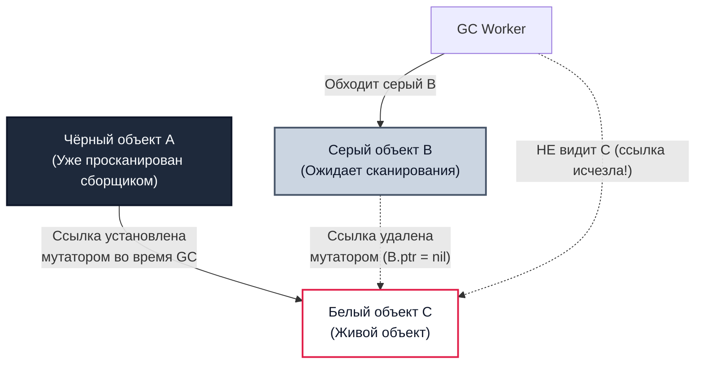
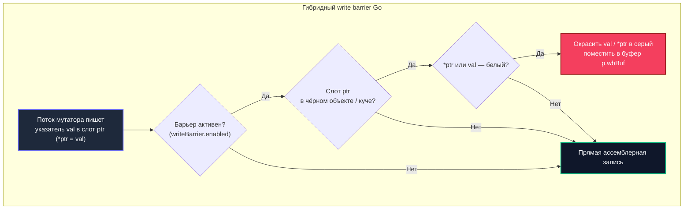

## Write barrier: невидимый страж конкурентного GC

В инженерном деле самые надёжные защитные механизмы — те, работу которых мы обычно не замечаем, пока они безупречно предотвращают катастрофу. В современных небоскрёбах демпферы гасят колебания при землетрясениях; в операционных системах аппаратные блоки защиты памяти (MMU) пресекают несанкционированный доступ к чужим адресам. В рантайме Go роль такого неусыпного часового выполняет **write barrier** (барьер записи).

В [[4. Concurrent GC]] мы детально исследовали архитектуру конкурентной сборки: сборщик мусора сканирует память параллельно с выполнением бизнес-логики приложения. Однако эта параллельность таит в себе смертельную угрозу: мутатор непрерывно переставляет указатели в памяти прямо под ногами у сборщика. Без механизма мгновенного перехвата таких манипуляций конкурентный триколорный маркинг ([[2. Tri color marking]]) неизбежно потерял бы живые объекты, а рантайм Go был бы вынужден останавливать весь мир на сотни миллисекунд.

Write barrier — это небольшой, но постоянный «налог на добавленную стоимость» для каждой операции записи указателя в кучу. Он добавляет машинные инструкции, конкурирует за кэш процессора и влияет на производительность даже тогда, когда активная фаза маркировки завершена. Понимание анатомии барьера записи — визитная карточка Senior Go-инженера, позволяющая объяснить, почему код с большим числом указателей неожиданно деградирует по latency и как архитектура структур данных определяет нагрузку на кремний ([[5. Mechanical sympathy в backend разработке]]).

В этой статье мы подробно вскроем реализацию write barrier в компиляторе и рантайме Go, проследим эволюцию от академических барьеров Дейкстры и Юасы к гибридному барьеру Go, оценим стоимость микроархитектурных накладных расходов и подготовим инструментальную базу для анализа пауз ([[6. GC pause и latency]]) и тонкого тюнинга кучи ([[7. GOGC и tuning]], [[8. GOMEMLIMIT]]).

---

## Зачем нужен write barrier: проблема «пропавшего объекта»

При конкурентной маркировке приложение (мутатор) и сборщик (GC worker'ы) работают на соседних ядрах CPU одновременно. Сборщик последовательно обходит граф объектов, переводя их из белого множества в серое и затем в чёрное. Но мутатор в это же самое время **мутирует ссылки**.

Если оставить мутатор без надзора, возникает классическая коллизия «потерянного объекта» (lost object problem):



Хронология катастрофы:
1. Чёрный объект `A` уже полностью обработан сборщиком. Сборщик гарантирует: к полям объекта `A` он в текущем цикле больше не прикоснётся.
2. Серый объект `B` находится в очереди на обход и содержит исходную ссылку на белый объект `C`.
3. Мутатор копирует указатель на `C` в поле чёрного объекта `A` (`A.ptr = C`), а затем немедленно затирает ссылку в `B` (`B.ptr = nil`).
4. Когда сборщик доходит до сканирования `B`, ссылка на `C` отсутствует. Объект `B` чернеет.
5. Итог: живой объект `C` нужен приложению (на него ссылается живой чёрный узел `A`), но сборщик видит `C` белым и уничтожает его на фазе sweep. Приложение падает с повреждением памяти или Use-After-Free.

Чтобы предотвратить потерю, приложение обязано уведомлять рантайм о любых манипуляциях с указателями. Эту функцию перехватчика и выполняет write barrier.

---

## Типы write barrier: Dijkstra, Yuasa и гибрид

В классической теории сборки мусора сложились две фундаментальные школы барьеров:

### Барьер Дейкстры (Dijkstra write barrier)

Принцип Дейкстры защищает **сильный триколорный инвариант** (чёрный узел никогда не указывает напрямую на белый):
- **Логика:** При записи указателя `val` в слот `ptr` чёрного объекта, если записываемый указатель `val` ведёт на белый объект, этот объект немедленно окрашивается в серый цвет (`shade(val)`) и отправляется в рабочую очередь.
- **Недостаток:** Барьер Дейкстры не перехватывает удаления ссылок. Кроме того, чтобы не ставить барьеры на каждую локальную переменную стека, стеки горутин оставались серыми. В результате рантайму требовалась долгая фаза STW в конце сборки для повторного пересканирования всех стеков (stack re-scanning). Барьер также допускает «плавающий мусор» (floating garbage — объекты, ставшие мусором во время mark, освобождаются только в следующем цикле).

### Барьер Юасы (Yuasa write barrier)

Принцип Юасы защищает **слабый триколорный инвариант** на основе «моментального снимка при начале» (Snapshot-at-the-beginning):
- **Логика:** При перезаписи слота (`*ptr = val`), если удаляемый из слота старый указатель `old` указывал на белый объект, этот объект `old` немедленно окрашивается в серый цвет (`shade(old)`).
- **Смысл:** Если объект был достижим в момент старта GC, сборщик не позволит ему исчезнуть, даже если мутатор разорвёт все ведущие к нему связи.

### Гибридный барьер Go

Начиная с Go 1.8, рантайм использует инновационный **гибридный write barrier**, объединяющий преимущества подходов Дейкстры и Юасы. В исходных текстах (`runtime/mwbbuf.go`) он описывается как сочетание барьера в стиле Дейкстры с подстраховкой в стиле Юасы:

$$\text{shade}(*slot) \quad \text{и} \quad \text{shade}(val)$$

Конкретно:
- При записи указателя вызывается `gcWriteBarrier(ptr, val)`.
- Если целевой слот (`ptr`) находится в куче, рантайм гарантирует:
  1. Старое значение слота (`*ptr`), если оно указывает на белый объект кучи, окрашивается в серый цвет (наследие барьера Юасы).
  2. Новое записываемое значение (`val`), если оно белое, также окрашивается в серый цвет (наследие барьера Дейкстры).
  3. Все новые объекты, аллоцируемые горутиной во время mark-фазы, сразу маркируются как чёрные.

Благодаря этому стеки горутин чернеют при первом же сканировании на старте GC и больше никогда не требуют повторного пересканирования при остановленном мире (zero stack re-scanning). Именно гибридный барьер позволил Go сжать паузы STW с десятков миллисекунд до десятков микросекунд ([[3. Stop the world]]).



---

## Реализация в рантайме Go

Write barrier в Go — это слаженная связка оптимизирующего компилятора и низкоуровневых ассемблерных процедур рантайма.

### Вставка барьера компилятором

На этапе генерации промежуточного представления (SSA backend) компилятор Go инспектирует каждую инструкцию записи значения по адресу (`Store`). Если записываемое значение является указателем (или содержит указатели: интерфейс, срез `slice`, строка `string`), компилятор заменяет простую инструкцию `MOV` на защищённую ветку:

```assembly
// Псевдоассемблер компилятора Go:
CMPB runtime.writeBarrier(SB), $0    // Проверка глобального флага
JEQ  no_barrier                      // Если GC спит — прыгаем на прямую запись
CALL runtime.gcWriteBarrier(SB)      // Иначе — переход в барьер
JMP  done
no_barrier:
MOVQ AX, (BX)                        // Прямая запись указателя в слот
done:
```

Внутри `runtime.gcWriteBarrier`:
1. Проверяется, находится ли слот (адрес, куда пишем) в куче (а не на стеке). Если на стеке — барьер не нужен.
2. Проверяются биты цвета объекта, содержащего слот (через `heapBitsForAddr`).
3. Если объект чёрный, а значение белое, вызывается `gcMarkSpanForBarrier` и указатель помещается в буфер.

Буфер write barrier — это специализированная структура `p.wbBuf`, выделенная для каждого логического процессора `P`. Это локальная для `P` циклическая очередь емкостью 512 записей. Когда буфер заполняется, вызывается системная процедура `runtime.wbBufFlush`, которая пачкой сбрасывает накопленные указатели в глобальные пулы `workbuf` для обработки GC worker'ами.

> [!info] Под капотом
> В исходном коде `runtime/mbitmap.go` битовая карта цвета объектов хранится в метаданных спана: `mspan.gcmarkBits`. Барьер обращается к этим битам через служебную абстракцию `heapBits`. Для достижения предельной скорости критический путь барьера написан вручную на чистом ассемблере: файл `runtime/asm_amd64.s` содержит ультраоптимизированную процедуру `gcWriteBarrier`, бережно сохраняющую регистры процессора.

### Write barrier и стек

Стековые переменные **не имеют барьеров**. Если операция записи происходит в объект, расположенный на стеке горутины (локальная переменная, указатель внутри стекового фрейма), компилятор генерирует обычную инструкцию `MOVQ` без каких-либо проверок.

Это фундаментальная причина, почему размещение переменных на стеке с помощью анализа побега ([[3. Escape analysis]]) даёт колоссальный прирост производительности: стек не просто избавляет от аллокаций в куче, он полностью снимает процессорный налог write barrier!

---

## Стоимость write barrier

Барьер записи работает постоянно в том смысле, что ассемблерная проверка флага `runtime.writeBarrier.enabled` исполняется при каждой записи указателя в память, даже когда сборщик не выполняет mark-фазу. Хотя проверка занимает всего пару инструкций (`CMPB` + `JEQ`), она имеет измеримый эффект:

- **Прямые такты процессора:** Проверка цвета слота — чтение памяти (вероятно, cache miss). При частой записи указателей (например, копирование слайса указателей) накладные расходы барьера могут стать существенными.
- **Загрязнение кэша (Cache Pollution):** Буфер барьера пишется локально, но при сбросе вовлекает глобальные структуры, вытесняя полезные строки из кэша процессора.
- **Межъядерная конкуренция (Contention):** При сбросе буфера `wbBuf` в глобальную очередь требуется атомарная операция захвата пула, что может порождать False Sharing ([[8. False sharing]]), если несколько `P` одновременно сбрасывают буферы.
- **Влияние на инлайнинг (Inlining):** Исторически функции, содержащие write barrier, получали штрафные баллы в эвристиках инлайнинга. Современный компилятор Go умеет инлайнить их при определённых условиях ([[5. Inline и влияние на performance]]), однако усложнение графа потока управления всё ещё может ограничивать оптимизации.

**Практический вывод:** Программный код, интенсивно модифицирующий структуры из указателей в куче (например, `sync.Map` с указателями, связные списки, деревья, графы), платит максимальную цену за работу барьера.

---

## Измерение влияния write barrier

В стандартном профилировщике `pprof` нет отдельной метрики с названием «Write Barrier Overhead». Однако опытный инженер легко выявляет его косвенное присутствие:

- **CPU-профиль ([[2. CPU profiling в Go]]):** Если приложение тратит ощутимый процент времени в функциях `runtime.gcWriteBarrier` или `runtime.wbBufFlush`, это свидетельствует о чрезмерной плотности мутации указателей в куче.
- **Execution tracer ([[3. execution tracer]]):** Наглядно фиксирует системные всплески активности процессоров в моменты выполнения `wbBufFlush`.
- **Микробенчмарки с ключом `-benchmem`:** Сравнение двух реализаций одного алгоритма (например, структура с обычным `int` против структуры с указателем `*int`, или слайс структур `[]Node` против слайса указателей `[]*Node` в горячем цикле) наглядно демонстрирует колоссальный разрыв в производительности, львиная доля которого обусловлена барьером записи.
- **Сравнение с отключённым GC:** Хотя полностью отключить барьер в продакшене невозможно, запуск с `GODEBUG=gctrace=1` позволяет увидеть частоту сборок и сопоставить её со всплесками активности барьера.

> [!tip] Собеседование
> **Вопрос:** Почему запись поля структуры через указатель в куче работает медленнее, чем запись в аналогичное поле плоской структуры, даже в моменты, когда сборщик мусора не выполняет маркировку?
> **Ответ:** Потому что компилятор Go генерирует перед каждой записью указателя в кучу проверку барьера записи (`CMPB runtime.writeBarrier`). Хотя в покое барьер отключён, проверка добавляет инструкции ветвления в конвейер CPU. А во время активности mark-фазы вызывается `runtime.gcWriteBarrier`, который обращается к битам цвета в `mspan`, сохраняет указатели в буфер `p.wbBuf` и может провоцировать дорогие промахи в кэш (L1/L2 Cache Miss).

---

## Write barrier и Mechanical Sympathy

С точки зрения кремния и микроархитектуры современных процессоров (x86-64, ARM64), работа барьера записи сопряжена со специфическими аппаратными феноменами:

- **Чтение битов цвета (`mspan.gcmarkBits`):** Метаданные спана физически отделены от пользовательских данных структуры в памяти. Разыменование `heapBits` для проверки статуса объекта почти гарантированно влечёт за собой дополнительный Cache Miss, если данный спан давно не подвергался обработке.
- **Локальный буфер процессора (`p.wbBuf`):** Буфер размером в несколько килобайт отлично удерживается в горячем кэше данных ядра (L1d). Однако в момент вызова `runtime.wbBufFlush` данные принудительно переносятся в разделяемый кэш L3 или DRAM, инициируя инвалидацию строк по протоколу MESI/MOESI на соседних ядрах.
- **Спекулятивное исполнение и Branch Predictor:** Аппаратный предсказатель ветвлений процессора почти всегда угадывает ветку `writeBarrier.enabled == false`. Однако в момент включения сборщика мусора происходит череда сбоев предсказания (Branch Misprediction Penalty ~15–20 тактов), пока BTB ядра не адаптируется к новому режиму.

Именно поэтому проектирование структур данных с минимальной ссылочностью ([[6. Cache friendly структуры]]) — это главный рецепт снижения налога write barrier.

---

## Ловушки и ограничения

> [!warning] Ловушка / Gotcha
> **Барьер действует только для кучи!**  
> Записи в память стека никогда не проходят через барьер. Если ваш горячий алгоритм оперирует срезом указателей, критически важно убедиться через анализ побега (`-gcflags="-m"`), что срез остаётся на стеке ([[3. Escape analysis]]). Как только он утекает в кучу, каждая операция `slice[i] = ptr` превращается в вызов барьера записи.

> [!warning] Ловушка / Gotcha
> **Атомарные записи и барьер записи.**  
> Низкоуровневые атомарные операции с указателями (`atomic.StorePointer`, `atomic.SwapPointer`) исторически требуют особого внимания. В современном Go компилятор подставляет барьер записи и для атомарных манипуляций с указателями в куче, однако использование `unsafe.Pointer` в обход системы типов может ослепить компилятор и привести к разрушению триколорного инварианта.

> [!warning] Ловушка / Gotcha
> **Барьеры записи и CGO.**  
> Внешний код на языке Си, вызываемый через cgo, не имеет представления о сборщике мусора Go и не содержит вызовов `gcWriteBarrier`. Запись Go-указателя в память Си-структуры без ведома рантайма строжайше запрещена правилами передачи указателей cgo и немедленно приведёт к аварийному завершению программы.

---

## Итог

- **Write barrier** — специализированный механизм перехвата записи указателей в кучу, гарантирующий соблюдение триколорного инварианта при конкурентной маркировке.
- Рантайм Go применяет **гибридный барьер записи** (Dijkstra + Yuasa), сохраняющий старый и новый указатели в локальном буфере `p.wbBuf`.
- Гибридный барьер устранил необходимость повторного сканирования стеков горутин в фазе STW, сократив паузы до долей миллисекунды.
- Барьер генерирует постоянные микроархитектурные накладные расходы (такты проверок, промахи в кэш, сброс буферов `wbBufFlush`).
- Диагностика осуществляется через CPU-профилирование (`gcWriteBarrier`), execution tracer и сравнительные микробенчмарки.
- Единственный способ полностью избавиться от налога барьера записи — проектировать бездатчиковые структуры в памяти и удерживать переменные на стеке.

В следующей статье мы исследуем комплексное влияние пауз и барьеров на ключевую метрику надежности любого бэкенда: [[6. GC pause и latency]].