## Почему GC-паузы определяют судьбу p99

В инженерном анализе высоконагруженных бэкендов существует обманчивая иллюзия благополучия, которую часто называют «тиранией средних чисел». Когда менеджер или неопытный разработчик смотрит на метрику медианной задержки (p50 = 2 мс), ему кажется, что система работает безупречно. Но в распределённых системах с тысячами одновременных пользователей реальную судьбу бизнеса определяет не средний пользователь, а «хвост» распределения — квантили p99, p99.9 и p99.99 ([[7. Tail latency и почему она важна]]).

В предыдущих статьях мы подробно разобрали архитектуру конкурентного сборщика ([[4. Concurrent GC]]), триколорный алгоритм раскраски объектов ([[2. Tri color marking]]) и работу барьеров записи ([[5. Write barriers]]). Мы знаем, что сборщик мусора Go спроектирован так, чтобы проводить львиную долю времени конкурентно, прерывая работу горутин лишь на краткие паузы Stop The World ([[3. Stop the world]]). Казалось бы, если STW измеряется десятками микросекунд, о каких проблемах с latency может идти речь?

Реальность гораздо сложнее и интереснее. Микросекундные паузы STW — это лишь вершина айсберга. Настоящие задержки, разрушающие Service Level Objectives (SLO), формируются целым комплексом скрытых факторов: принудительным торможением аллокаций через **mark assist**, конкуренцией за такты CPU и шину памяти, а также эффектом вымывания кэша процессора. Senior Go-инженер обязан глубоко понимать анатомию потерь времени, порождаемых сборщиком мусора, уметь изолировать их инструментально и системно удерживать задержки в рамках строгих гарантий.

В этой статье мы установим прямую связь между внутренними метриками рантайма и показателями сетевой задержки, разберём механику скрытого «воровства» микросекунд механизмом mark assist и разработаем практические стратегии стабилизации p99 latency.

---

## Что считать GC-паузой: явное и неявное

В классической литературе по языкам с управляемой памятью под термином **GC pause** исторически понимают исключительно время Stop The World (STW), когда все потоки мутатора принудительно заморожены. Однако для пользователя, отправившего HTTP-запрос или RPC-вызов, не имеет значения, был ли заморожен весь мир или только его горутина. Любое замедление обработки запроса, обусловленное сборщиком мусора, является частью реальной GC-задержки.

В современном Go влияние сборщика на latency складывается из четырёх составляющих:

1. **Глобальные STW-паузы (Mark setup и Mark termination):** Полная остановка всех процессоров `P` и горутин на время от 10 до 100 микросекунд. Любой запрос, находившийся на исполнении, принудительно замораживается на этот интервал.
2. **Штрафные работы Mark Assist:** Не глобальная, но локальная катастрофа для конкретной горутины. Если горутина запрашивает память в куче быстрее, чем воркеры успевают её сканировать, рантайм принудительно привлекает её к исправительным работам по маркировке. Время выполнения запроса возрастает на миллисекунды.
3. **Конкурентная фоновая нагрузка (Concurrent Mark):** Выделение 25% ресурсов `GOMAXPROCS` под воркеры сборщика уменьшает доступную вычислительную мощность CPU для полезной работы приложения.
4. **Ленивая очистка (Lazy Sweep):** Микрозадержки при аллокациях, когда горутина вынуждена предварительно освободить грязный спан памяти перед получением нового блока.

```mermaid
gantt
    title "Обработка запроса и активность GC"
    dateFormat  X
    axisFormat  %s
    
    section Запрос 1
    Обработка            :active, req1, 0, 3
    Ожидание STW         :crit, stw1, 3, 4
    Продолжение          :active, req1b, 4, 6

    section Запрос 2
    Обработка            :active, req2, 0, 2
    Mark Assist           :crit, assist, 2, 4
    Завершение           :active, req2b, 4, 5

    section GC
    STW Setup            :crit, setup, 3, 4
    Конкурентный Mark    :done, mark, 4, 6
```



Следовательно, инженерное понятие «влияние GC на latency» гораздо шире формального времени STW. Оно охватывает любые задержки, возникающие вследствие активности подсистемы управления памятью.

---

## Измерение GC-пауз и их влияния на latency

Чтобы управлять задержками, их необходимо измерять с инструментальной точностью. В арсенале инженера Go есть пять ключевых уровней наблюдения:

### 1. GODEBUG=gctrace=1

Самый легковесный способ непрерывного аудита сборщика:

```text
gc 1 @0.001s 0%: 0.015+0.13+0.007 ms clock, 0.12+0.10/0.13/0.05+0.05 ms cpu, 1->1->1 MB, 4 MB goal, 8 P
```

- `0.015 ms` — фаза STW setup (15 мкс полной остановки).
- `0.007 ms` — фаза STW termination (7 мкс финальной остановки).
- `0.13 ms` — wall-clock время конкурентной маркировки.
- В секции `cpu` значение `0.10/0.13/0.05` показывает процессорное время воркеров: если среднее значение (`0.13 ms` mark assist) начинает расти, приложение страдает от принудительного торможения горутин.

Сумма пауз STW в этом примере составляет всего $0.015 + 0.007 = 0.022\text{ мс}$ (22 микросекунды). Это превосходный показатель, но при высокой частоте сборок даже он может давать мультипликативный эффект в распределённых цепочках.

### 2. Prometheus метрики

Пакет `client_golang` и системная подсистема `runtime/metrics` экспортируют в системы мониторинга ключевые ряды данных:
- `go_gc_duration_seconds` — гистограмма длительности циклов сборки мусора (с метками `quantile` для точного анализа пауз STW на уровне p99 и p99.9).
- `go_memstats_gc_cpu_fraction` — доля процессорного времени, отданная сборщику мусора (превышение целевых 0.25 свидетельствует о тяжелейшем перегрузе памяти).

Настройка алертов в Prometheus на превышение порогов `go_gc_duration_seconds{quantile="0.99"}` позволяет перехватывать деградацию SLO задолго до жалоб пользователей.

### 3. Execution tracer

Утилита `go tool trace` ([[3. execution tracer]]) — непревзойдённый микроскоп для расследования аномалий задержек. В веб-интерфейсе трейсера:
- Участки STW выделяются сплошными красными полосами через все ядра.
- Промежутки, когда горутина блокируется сборщиком, наглядно помечаются статусом `MARK ASSIST`. Это позволяет точно установить, какая именно строка бизнес-кода спровоцировала задержку из-за нехватки кредита на аллокацию.

### 4. runtime.ReadMemStats

Структура `runtime.MemStats` позволяет программно собирать метрики прямо в коде сервиса:
- `m.PauseNs` — кольцевой буфер длительностей последних 256 STW-пауз в наносекундах.
- `m.NumGC` — кумулятивный счётчик завершённых циклов GC.

### 5. Бенчмарки с -benchmem и GODEBUG

Для локализации чувствительности горячего кода к сборщику мусора проводятся сравнительные бенчмарки:

```bash
go test -bench=. -benchmem
```

Анализ метрик `ns/op` и `allocs/op` при искусственном изменении коэффициента `GOGC` (например, `GOGC=1` для провокации частых сборок против `GOGC=off`) позволяет математически изолировать чистый налог сборщика мусора на исполнение алгоритма.

---

## Факторы, влияющие на длительность GC-пауз

Длительность пауз и задержек не является фиксированной константой — она определяется архитектурой структур данных приложения:

### 1. Размер кучи и количество живых объектов
Чем больше активных объектов удерживается в памяти, тем больше времени требуется на финализацию маркировки в Mark termination: рантайму необходимо обработать буферы барьера записи и удостовериться в отсутствии серых объектов. В огромных кучах на 100+ ГБ с сотнями миллионов мелких объектов даже микросекундный алгоритм может испытывать паузы в десятки миллисекунд.

### 2. Количество горутин
Каждая горутина обладает собственным стеком (минимум 2 КБ), выступающим в роли корня (root) для триколорного обхода. Если микросервис удерживает миллион полуспящих горутин, рантайм тратит колоссальное время на регистрацию и сканирование их стеков в фазе остановки мира.

### 3. Сложность графа объектов (количество указателей)
Обилие полей-указателей в структурах данных заставляет сборщик расходовать машинные такты на разыменование адресов, многократно увеличивая объём буферов барьера записи, подлежащих опорожнению в Mark termination.

### 4. Частота GC
При высоком темпе аллокаций порог кучи преодолевается за доли секунды. Хотя каждая отдельная пауза может быть ультракороткой, их высокая частота (десятки раз в секунду) резко увеличивает статистическую вероятность попадания любого входящего запроса под паузу или mark assist.

### 5. GOMAXPROCS и планировщик
Если число логических процессоров `GOMAXPROCS` меньше физических ядер или если процессор искусственно ограничен квотами контейнера Linux (cgroups CPU Quota), воркеры сборщика вступают в жестокую конкуренцию с горячими горутинами за кванты времени, провоцируя лавинообразный рост латентности.

---

## Mark assist: скрытый убийца latency

Механизм **Mark Assist** — главный виновник внезапных и необъяснимых выбросов p99 latency в высоконагруженных Go-сервисах.

Когда приложение выделяет память быстрее, чем фоновые воркеры сборщика успевают её сканировать, алгоритм GC Pacer для спасения процесса от исчерпания памяти принудительно превращает аллоцирующую горутину во временного рабочего сборщика.

В профилях CPU (`pprof`) присутствие mark assist проявляется как доминирование системных функций:
- `runtime.gcAssistAlloc`
- `runtime.gcDrain`

Если эти функции появляются в верхних строках профиля вашего бизнес-сервиса — система находится в состоянии скрытого удушья. Обработчик сетевого запроса, который должен был вернуть JSON-ответ за 3 миллисекунды, может провести 70 миллисекунд в недрах `runtime.gcAssistAlloc`, отрабатывая штраф за выделение временных структур!

```
[Входящий RPC Запрос] ---> [Парсинг JSON/Protobuf] ---> make([]byte, 2MB)
                                                               |
    +----------------------------------------------------------+
    |
    v
[Превышение лимита аллокаций] ---> Вход в runtime.gcAssistAlloc
                                           |
                                   [70 мс сканирования кучи!]
                                           |
[Выход из assist] <------------------------+
    |
    v
[Отправка ответа через 73 мс вместо 3 мс!] ===> Деградация p99 / Таймаут клиента
```

> [!warning] Ловушка / Gotcha
> **Иллюзия отсутствия пауз по метрикам STW.**  
> Разработчик смотрит в дашборд и радуется: паузы `go_gc_duration_seconds` не превышают 50 микросекунд. Однако клиенты фиксируют регулярные таймауты на 100+ мс! Ошибка заключается в игнорировании `runtime.gcAssistAlloc`. Время mark assist **не входит** в метрики STW, но напрямую прибавляется к времени выполнения конкретного запроса. Истинная картина вскрывается только через `execution tracer` и CPU-профилирование.

---

## Как GC-паузы влияют на распределение задержек

Рассмотрим типовой микросервис:
- Нагрузка: 20 000 RPS.
- Базовая медианная задержка: p50 = 3 мс.
- Длительность STW: 40 микросекунд.
- Частота сборок: 2 сборки в секунду.

Казалось бы, пауза в 40 мкс ничтожна на фоне 3 мс. Однако:
1. За 1 секунду сервис обрабатывает 20 000 запросов. В моменты наступления двух STW-пауз сотни запросов физически замирают на ядрах CPU.
2. Если в этот же момент сервис испытывает всплеск аллокаций, десятки запросов попадают под жернова `mark assist`, получая индивидуальную задержку в 20–50 мс. Именно эти пострадавшие запросы целиком формируют правый «хвост» гистограммы — перцентили p99 и p99.9.
3. **Закон каскадного умножения задержек в микросервисах:**  
   В современной архитектуре пользовательский клик порождает граф из $N$ параллельных и последовательных RPC-запросов. Если вероятность задержки отдельного запроса из-за GC составляет $P = 1\%$, то вероятность того, что итоговый запрос пользователя пострадает от задержки хотя бы в одном из 20 микросервисов, составляет:
   $$P_{\text{total}} = 1 - (1 - P)^N = 1 - (0.99)^{20} \approx 18.2\%$$
   В результате почти каждый пятый пользователь сталкивается с видимым торможением интерфейса ([[7. Tail latency и почему она важна]])!

---

## Mechanical Sympathy: что происходит с процессором после паузы

С точки зрения кремниевой архитектуры современных CPU, пауза сборщика мусора не заканчивается в момент возврата управления мутатору. Она оставляет за собой «микроархитектурный шлейф» деградации:

```
[STW Остановка] ---> [Сброс битов и сканирование памяти сборщиком]
                              |
     +------------------------+
     v
[L1/L2 Кэши вымыты] + [TLB таблицы сброшены] + [Предсказатель ветвлений пуст]
     |
     v
[Возобновление горутины] ---> Череда L3/RAM Cache Misses (~200 тактов задержки)
                              Микросекундная просадка пропускной способности ядра!
```

- **Вымывание линий кэша данных (Cache Eviction):** Сканируя спаны и битовые карты, сборщик принудительно вытесняет горячие структуры приложения из L1d и L2 кэшей в оперативную память. После снятия паузы первые тысячи инструкций бизнес-кода неизбежно терпят штрафы холодных промахов в память (150–250 тактов CPU на каждое чтение).
- **TLB-промахи (Translation Lookaside Buffer):** Интенсивный обход страниц кучи вытесняет трансляции виртуальных адресов, заставляя MMU процессора выполнять дорогостоящий обход таблиц страниц (Page Table Walk).
- **Сброс контекста предсказателя ветвлений (Branch Target Buffer):** Переключение контекста планировщика разрушает историю ветвлений, вызывая всплеск Branch Mispredictions на возобновлённых горутинах.

Этот микроархитектурный след означает, что даже 20-микросекундная пауза STW порождает за собой хвост в сотни микросекунд неоптимального исполнения кода.

---

## Стратегии минимизации влияния GC на latency

Инженерное подавление задержек строится на системном снижении давления на аллокатор:

1. **Радикальное сокращение аллокаций в куче:**  
   Главный рычаг оптимизации. Применение пулов буферов [[2. sync Pool]], оптимизация структур для побега на стек [[1. Уменьшение аллокаций]] и техники [[9. Zero allocation подход]]. Меньше мусора — реже срабатывает GC, меньше STW и нулевой mark assist.
2. **Предвыделение памяти:**  
   Явное указание начальной емкости слайсов и хэш-таблиц (`make([]T, 0, cap)`) исключает каскадные перевыделения буферов ([[4. Предвыделение памяти]]).
3. **Устранение указателей (Pointer-free Structs):**  
   Замена указателей на плоские значения (value-embedding) и компактные бинарные смещения ([[6. Cache friendly структуры]]). Это минимизирует глубину графа и сокращает длительность Mark termination.
4. **Ограничение пула горутин:**  
   Переход от антипаттерна «горутина на каждое микродействие» к пулам фиксированного размера (Worker Pools). Меньше стеков — быстрее фаза синхронизации safe points.
5. **Тюнинг коэффициента `GOGC`:**  
   Увеличение `GOGC` (например, со 100 до 200) позволяет куче расти свободнее, пропорционально снижая частоту запусков сборщика и убирая всплески mark assist ценой выделения дополнительной RAM ([[7. GOGC и tuning]]).
6. **Установка мягкого лимита памяти через `GOMEMLIMIT`:**  
   Фиксация целевого потолка памяти защищает процесс от падений по OOM в контейнерах Kubernetes и предотвращает катастрофический GC thrashing ([[8. GOMEMLIMIT]]).
7. **Контролируемый вызов `runtime.GC()`:**  
   В специализированных batch-системах или геймдеве ручной вызов `runtime.GC()` в периоды технологического простоя позволяет «подчистить» кучу перед приходом боевого трафика, гарантируя отсутствие сборок в критические интервалы времени.

---

## Практический пример: анализ влияния GC на p99

Рассмотрим реальный производственный кейс: высоконагруженный микросервис профилей пользователей обрабатывает 10 000 RPS. По мониторингу:
- Медиана p50 = 4 мс.
- Перцентиль p99 подскакивает до неприемлемых 85 мс (при SLO < 50 мс).

### Шаг 1: Диагностика
Снимаем трассировку `go tool trace` под боевой нагрузкой. Трейсер показывает:
- Паузы STW составляют скромные 25 мкс раз в 1.5 секунды. Сами по себе они не могут создать задержку в 85 мс.
- Однако на дорожках горутин, обрабатывающих «тяжёлые» запросы, видна сплошная полоса `MARK ASSIST` длительностью до 65 мс!
- В CPU-профиле функция `runtime.gcAssistAlloc` пожирает 28% процессорного времени.

### Шаг 2: Анализ аллокаций
Профилирование памяти ([[4. Allocation profiling]]) выявляет виновника: сериализатор JSON на каждый запрос создавал множество временных мап и промежуточных строковых буферов.

### Шаг 3: Оптимизация
1. Внедряем `sync.Pool` для байтовых буферов кодогенерации JSON. Количество аллокаций на запрос падает на 65%.
2. В конфигурации контейнера поднимаем `GOGC=200`, благо запас свободной оперативной памяти на сервере позволяет расширить кучу.

### Шаг 4: Результат
- `runtime.gcAssistAlloc` полностью исчезает из топа CPU-профиля.
- Частота циклов GC снижается в 3.5 раза.
- Перцентиль p99 падает с 85 мс до стабильных 14 мс, а неприятный микроархитектурный шлейф после сборок полностью растворяется.

---

## Итог

- Реальная GC-пауза в Go — это совокупность глобальных микропауз STW, скрытого торможения прикладных горутин в режиме **Mark Assist** и конкуренции за кэш процессора.
- Микросекундные паузы STW могут казаться незаметными для медианы p50, но вызывают разрушительный кумулятивный эффект в квантилях p99 и p99.9, особенно в цепочках распределённых микросервисов.
- Инструментальный стек расследования задержек включает `GODEBUG=gctrace=1`, Prometheus метрику `go_gc_duration_seconds`, метрики `runtime.MemStats` и микрохирургическую визуализацию в `go tool trace`.
- Главный скрытый убийца latency — механизм Mark Assist: при агрессивных аллокациях рантайм принудительно заставляет горутину сканировать память, превращая миллисекундный запрос в долгий таймаут.
- Физический шлейф паузы обусловлен вымыванием L1/L2 кэша и промахами TLB.
- Победа над GC-задержками достигается сокращением аллокаций в куче, устранением указателей и тонкой калибровкой параметров памяти.

Теперь, понимая механику формирования задержек, мы переходим к практическому руководству по управлению поведением сборщика: [[7. GOGC и tuning]].