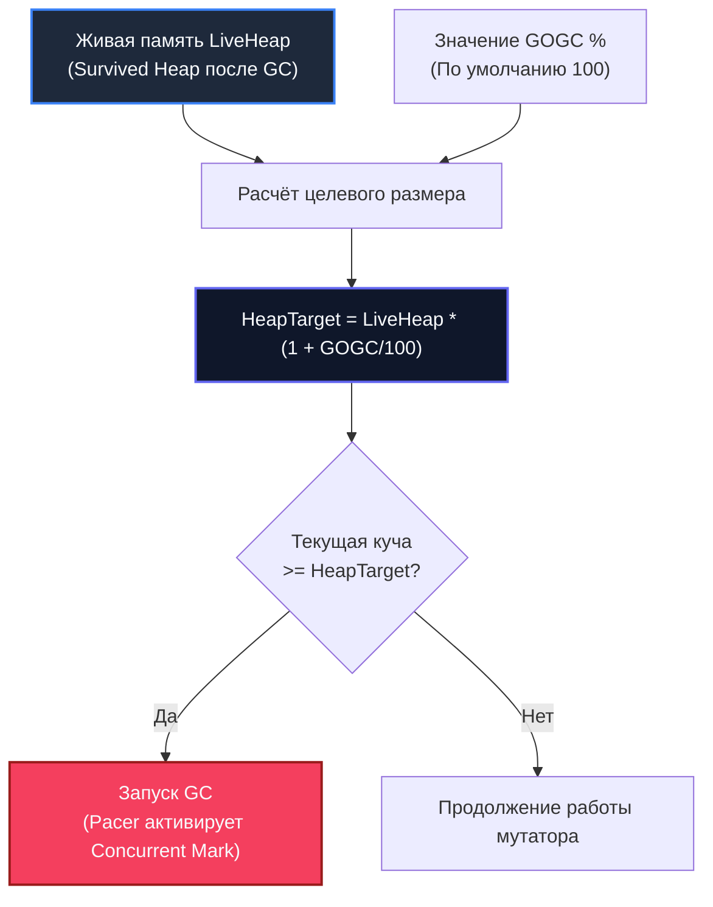

## GOGC: главный рычаг управления сборщиком мусора

В теории управления сложными динамическими системами лучший интерфейс — это не приборная панель с сотней тумблеров, а один надёжный штурвал, поведение которого предсказуемо и математически выверено. Создатели Go сознательно отказались от чудовищного зоопарка параметров JVM (где десятки несовместимых флагов `-XX:+Use...` могут свести с ума даже опытного администратора) и предложили миру предельно ясную концепцию. Исторически единственным фундаментальным регулятором рантайма являлся флаг **GOGC**.

В [[1. GC в Go. Обзор]] мы установили, что сборщик мусора Go активируется автоматически при накоплении определённого объёма кучи, а в [[6. GC pause и latency]] выяснили, как частота сборок и штрафные работы mark assist определяют хвостовые задержки p99. Теперь мы берём в руки практический инструмент управления этим балансом — параметр `GOGC`.

GOGC (Garbage Collection Goal Percentage) — это переменная окружения и динамический параметр рантайма, определяющий **целевой размер кучи** (target heap size) относительно объёма реально живых данных. Это главный компромисс между потреблением оперативной памяти (RAM) и процессорными тактами (CPU). В компьютерных науках не существует бесплатного обеда: мы либо платим памятью за экономию тактов процессора, либо платим тактами за компактность в RAM. Осознанный выбор на этой шкале — один из главных навыков Senior бэкенд-инженера.

В этой статье мы математически разберём формулу целевого размера кучи, проанализируем поведение системы при экстремальных значениях GOGC, рассмотрим типовые сценарии тюнинга для облачной инфраструктуры и подготовим фундамент для совместной работы с абсолютным лимитом памяти [[8. GOMEMLIMIT]].

---

## Как работает GOGC: формула целевого размера кучи

Принцип работы алгоритма триггера GC элегантен и прямолинеен. Параметр `GOGC` задаёт процент роста кучи от объёма данных, переживших предыдущий цикл сборки.

Математическая модель целевого размера кучи:

```text
HeapTarget = LiveHeap * (1 + GOGC/100)
```

Где:
- `LiveHeap` — объём памяти, занятой реально достижимыми живыми объектами (размер выжившей кучи, зафиксированный сборщиком мусора в фазе Mark termination предыдущего цикла).
- `GOGC` — целое число, выражающее процент допустимого прироста. Значение по умолчанию в Go: `GOGC=100`.
- `HeapTarget` — расчётный порог размера кучи, при достижении которого рантайм обязан инициировать новый цикл сборки.

Разберём эту пропорцию на наглядных числах:
- При `GOGC=100` куче разрешается вырасти ровно на 100% (то есть удвоиться) относительно живой памяти. Если после очистки в живых осталось 100 МБ объектов, следующий цикл сборки мусора нацелен на запуск и завершение к моменту, когда общий размер выделенной памяти достигнет $100 \times (1 + 100/100) = 200\text{ МБ}$.
- При `GOGC=200` допустимый прирост составляет 200%: цель сдвигается до $100 \times (1 + 200/100) = 300\text{ МБ}$.
- При `GOGC=50` куча удерживается в строгой компактности: сборка нацелится на $100 \times (1 + 50/100) = 150\text{ МБ}$.



На практике регулятор темпа (GC Pacer) запускает фазу конкурентной маркировки с упреждением — чуть раньше достижения `HeapTarget`, чтобы к моменту, когда мутатор доберётся до целевого потолка, маркировка была уже завершена. Если же мутатор аллоцирует слишком бурно, включается механизм mark assist, удерживающий аллокации в границах расчётной траектории.

---

## Влияние GOGC на частоту GC, CPU и память

Физическая аналогия: представьте вывоз мусора в жилом квартале. Если вызывать мусоровоз каждый раз, когда ведро наполнилось наполовину, спецтехника будет непрерывно блокировать проезд на улицах, сжигая тонны бензина (нагрузка на CPU и скачки latency). Если же вывозить мусор раз в месяц, спецмашины будут ездить редко, но дворы придётся заставить огромными мусорными контейнерами (расход RAM).

### Низкий GOGC (например, 25–50)

- **Память:** Куча удерживается максимально поджарой, близко к объёму `LiveHeap`. Идеально для компактных контейнеров с жёсткими аппаратными рамками.
- **Частота GC:** Экстремально высокая. Сборщик мусора запускается при малейшем накоплении временных объектов.
- **Нагрузка на CPU:** Значительная доля процессорного бюджета уходит на фоновые воркеры и гибридный барьер записи.
- **Latency:** Хотя длительность одной микропаузы STW минимальна, высокая частота циклов резко взвинчивает вероятность попадания запросов под `mark assist`, что может существенно разрушить хвост p99.

### Высокий GOGC (например, 200–400)

- **Память:** Куча разрастается до 3–5-кратного размера живых объектов. Потребление резидентной памяти (RSS) возрастает пропорционально.
- **Частота GC:** Резко снижается. Сборщик мусора срабатывает в разы реже.
- **Нагрузка на CPU:** Суммарные затраты процессора на обслуживание сборки мусора падают до минимума, освобождая такты ядра для полезной бизнес-логики.
- **Latency:** Запросы практически не сталкиваются с `mark assist`, сетевые очереди сокетов не простаивают, а квантили p95 и p99 демонстрируют впечатляющую стабильность (при условии, что сервер располагает достаточным запасом физической памяти).

### Отключение GC (GOGC=off)

Установка переменной среды `GOGC=off` или программное значение `GOGC=-1` полностью отключает автоматический запуск сборщика мусора (начиная с Go 1.16).

В этом режиме память выделяется беспрепятственно до физического исчерпания оперативной памяти машины. Ручной вызов `runtime.GC()` при этом сохраняет полную работоспособность. Это экстремальный инструмент, применяемый в узкоспециализированных CLI-утилитах (которые отрабатывают за пару секунд и отдают память ОС целиком при завершении процесса) либо в высокочастотных торговых движках (HFT), где сборка мусора принудительно инициируется только в технологические окна биржевого клиринга.

> [!warning] Ловушка / Gotcha
> **Катастрофа отключения сборщика мусора в бэкенд-сервисе.**  
> Установка `GOGC=off` в постоянном сетевом микросервисе без регулярного ручного вызова `runtime.GC()` неминуемо приведёт к неограниченному раздуванию адресного пространства процесса и фатальному уничтожению операционной системой через OOM Killer. Использовать `GOGC=off` в проде можно только при наличии строжайшего контроля жизненного цикла аллокаций.

---

## Как выбрать значение GOGC: компромисс память vs CPU

Универсального «золотого» числа GOGC не существует. Грамотный выбор диктуется профилем нагрузки сервиса и доступными ресурсами ноды:

### Стратегия 1: Низкий GOGC для жёстких лимитов памяти

В облачной среде Kubernetes поды часто упакованы с предельно строгими лимитами памяти (`resources.limits.memory: 512Mi`). Если сервис держит 150 МБ живых структур, стандартный `GOGC=100` попытается вырастить кучу до 300 МБ. Добавьте к этому память стеков горутин, буферы рантайма, метаданные и фрагментацию — и контейнер мгновенно будет убит по сигналу OOMKill.

В таких условиях инженеры снижают `GOGC` до 25–50, заставляя сборщик работать агрессивно и удерживать кучу в коридоре 180–225 МБ. При этом обязательно настраивается `GOMEMLIMIT` ([[8. GOMEMLIMIT]]), обеспечивающий аппаратную защиту от пересечения границы контейнера.

### Стратегия 2: Высокий GOGC для CPU-интенсивных сервисов

Если микросервис развёрнут на мощных выделенных серверах (Bare-metal) или в контейнерах с запасом RAM в 16–64 ГБ, а узким местом является пропускная способность CPU (Throughput), удерживать `GOGC=100` — непозволительное расточительство процессорных тактов.

Повышение `GOGC` до 200, 300 или 400 позволяет сократить количество циклов сборки в 3–5 раз! Процессорные ядра перестают тратить такты на сканирование графов объектов, уходит штраф `mark assist`, а метрики latency сжимаются до рекордных значений.

### Стратегия 3: Динамический тюнинг

Пакет `runtime/debug` предоставляет функцию `debug.SetGCPercent(target)`, позволяющую менять значение GOGC на лету прямо в процессе выполнения программы:

```go
package main

import (
    "runtime/debug"
)

func setAggressiveGC() {
    // В условиях дефицита памяти поджимаем кучу
    debug.SetGCPercent(50)
}

func setPerformanceGC() {
    // В моменты пикового наплыва трафика экономим CPU
    debug.SetGCPercent(200)
}
```

Некоторые высоконагруженные платформы используют адаптивные контроллеры: в периоды ночного простоя устанавливается низкий GOGC для возврата страниц памяти операционной системе, а при утреннем пике трафика GOGC динамически поднимается для максимизации throughput.

### Оценка текущей эффективности

Перед тем как изменять GOGC в production, снимите контрольные метрики:
- Запустите приложение с `GODEBUG=gctrace=1` и оцените частоту сборок мусора и размер `LiveHeap`.
- Проанализируйте метрики Prometheus: `go_memstats_heap_alloc_bytes`, `go_gc_duration_seconds`, `go_memstats_gc_cpu_fraction`.
- Снимите CPU-профиль: какова суммарная доля `runtime.gcAssistAlloc` и `runtime.gcBgMarkWorker`?
- Если сборщик отнимает более 8–10% от общего фонда процессорного времени, а на хосте есть неиспользуемая оперативная память — `GOGC` однозначно стоит повысить!

---

## Практические примеры настройки GOGC

### Пример 1: REST API с интенсивными JSON-аллокациями

**Дано:** Шлюз API обрабатывает 5 000 RPS. На каждый входящий запрос парсится массивный JSON-документ, порождая миллионы короткоживущих объектов.  
**Симптомы:** При стандартном `GOGC=100` сборщик запускается каждые 1.5–2 секунды. На горячих горутинах `mark assist` отъедает до 15% процессорного времени, из-за чего квантиль p99 скачет от 25 до 90 мс. При этом нода занята по памяти всего на 30%.  
**Решение:** Устанавливаем `GOGC=200`.  
**Результат:** Размер кучи вырастает с 400 МБ до 700 МБ, однако интервал между сборками увеличивается до 5 секунд. Доля CPU на сборку мусора падает до 4%, `runtime.gcAssistAlloc` практически исчезает, а задержка p99 стабилизируется на уровне 18 мс.

### Пример 2: Микросервис в контейнере с лимитом 256 МБ

**Дано:** Сервис запущен в Kubernetes с лимитом памяти `256Mi`.  
**Симптомы:** Живой рабочий набор приложения составляет `LiveHeap = 150 МБ`. При `GOGC=100` целевой размер кучи составляет $150 \times 2 = 300\text{ МБ}$, что немедленно приводит к срабатыванию OOM Killer при малейшем всплеске трафика.  
**Решение:**  
1. Устанавливаем `GOGC=50` (цель $150 \times 1.5 = 225\text{ МБ}$).  
2. Задаём жёсткий предохранитель `GOMEMLIMIT=230MiB`.  
**Результат:** Куча удерживается в строгих рамках до 225 МБ. Сборки мусора происходят чаще, но сервис стабильно держит нагрузку без аварийных падений по OOMKill. Для компенсации возросшей нагрузки на CPU оптимизируем аллокации через [[1. Уменьшение аллокаций]] и пулы буферов [[2. sync Pool]].

---

## Инструменты для проверки эффекта от изменения GOGC

- **GODEBUG=gctrace=1:** Строка телеметрии вида `... -> ... -> ... MB, ... MB goal` (например, `4->4->2 MB, 5 MB goal`) в реальном времени показывает расчетную цель `HeapTarget` (`goal`). Если эта цель вплотную приближается к границам памяти контейнера, `GOGC` необходимо срочно снижать.
- **pprof memory profile ([[5. pprof memory profile]]) и аллокационный профиль ([[4. Allocation profiling]]):** Позволяют точно отделить объём постоянных живых структур (`LiveHeap`) от кратковременных аллокаций.
- **Нагрузочные тесты с метриками Prometheus:** Непрерывный мониторинг `go_gc_duration_seconds` до и после изменения флага позволяет экспериментально найти оптимум на кривой Trade-off.
- **Использование `debug.SetGCPercent()`:** Функция `debug.SetGCPercent` в runtime позволяет экспериментировать без перезапуска.

---

## Mechanical Sympathy: GOGC и процессор

Параметр GOGC оказывает прямое влияние на микроархитектурную эффективность кремниевых ядер:

- **При низком GOGC:** Частые циклы сборки непрерывно сбрасывают битовые карты и инспектируют спаны, вытесняя рабочий набор бизнес-данных из кэшей L1d, L2 и L3 ([[8. Cache friendliness]]). Каждая сборка заставляет процессор заново разогревать кэш, увеличивая долю Cache Misses и снижая мгновенную производительность конвейера инструкций.
- **При высоком GOGC:** Куча занимает больший объём физической памяти, что повышает разброс виртуальных адресов и может незначительно увеличить нагрузку на TLB (Translation Lookaside Buffer). Однако отсутствие частых прерываний и минимальное время в `mark assist` с лихвой окупают эту разницу за счёт превосходной локальности данных в горячих циклах.

Выбор GOGC — это выбор между непрерывными мелкими микроархитектурными сбоями конвейера и редкими, но прогнозируемыми фоновыми операциями.

---

## Ловушки и неочевидные моменты

> [!warning] Ловушка / Gotcha
> **GOGC управляет только автоматическими триггерами!**  
> Ручной вызов `runtime.GC()` полностью игнорирует значение `GOGC` и всегда выполняет полный цикл сборки мусора. Если разработчик расставил вызовы `runtime.GC()` в коде, никакой тюнинг переменных среды не спасёт систему от деградации.

> [!warning] Ловушка / Gotcha
> **GOGC не лечит утечки памяти!**  
> Если в приложении допущена утечка памяти ([[6. Утечки памяти]]), объём живой кучи `LiveHeap` монотонно возрастает с каждым циклом. Увеличение `GOGC` в этом случае лишь кратковременно отсрочит неизбежный крах по OOMKill, но не решит проблему. Тюнинг флагов имеет смысл только в здоровом приложении с плато потребления памяти.

> [!warning] Ловушка / Gotcha
> **Коварство GOGC=0.**  
> В ранних версиях рантайма Go (до Go 1.18) значение `GOGC=0` не отключало сборщик, а заставляло его перезапускаться буквально на каждое выделение памяти, превращая сервис в парализованную систему. Начиная с Go 1.18, `GOGC=0` считается устаревшим флагом, а для полного отключения рантайма стандартизировано строковое значение `GOGC=off`.

---

## Связь с GOMEMLIMIT

До появления Go 1.19 параметр `GOGC` страдал одним фундаментальным архитектурным недостатком: он оперирует **относительными процентами**, а не абсолютными байтами.

Если `LiveHeap` сервиса неожиданно удваивался под нагрузкой со 100 МБ до 200 МБ, целевой размер кучи при `GOGC=100` мгновенно подскакивал с 200 МБ до 400 МБ. В облачном контейнере с лимитом 350 МБ это означало мгновенную смерть от Linux OOM Killer. Исторически разработчикам приходилось прибегать к диким трюкам вроде балластных аллокаций (Memory Ballast).

Начиная с Go 1.19, в язык был внедрён второй фундаментальный регулятор — **GOMEMLIMIT**:
- `GOGC` задаёт стандартный, комфортный для CPU ритм сборок в штатных условиях.
- `GOMEMLIMIT` выступает абсолютным кремниевым щитом: если куча приближается к аппаратному потолку памяти контейнера, сборщик мусора временно игнорирует процент GOGC и форсированно включает сборку раньше времени, предотвращая падение сервиса.

В следующей статье мы подробно изучим эту революционную связку: [[8. GOMEMLIMIT]].

---

## Итог

- **GOGC** — фундаментальный регулятор рантайма Go, определяющий целевой размер кучи по формуле `HeapTarget = LiveHeap * (1 + GOGC/100)`. Значение по умолчанию — 100.
- Низкий GOGC (25–50) минимизирует footprint памяти, но резко увеличивает накладные расходы процессора и может ухудшить задержки p99 из-за частого срабатывания `mark assist`.
- Высокий GOGC (200–400) разгружает процессор, ликвидирует `mark assist` и стабилизирует latency ценой выделения дополнительной оперативной памяти.
- В микросервисах Kubernetes `GOGC` обязательно калибруется в тандеме с аппаратными лимитами `resources.limits.memory` и переменной `GOMEMLIMIT`.
- Контроль осуществляется через `GODEBUG=gctrace=1`, метрики Prometheus и аллокационное профилирование.
- `GOGC=off` отключает автоматический сборщик мусора, но допустим исключительно в кратковременных утилитах или специализированных high-frequency системах.

Теперь, когда мы освоили относительное масштабирование кучи через GOGC, перейдём к исследованию абсолютного лимита памяти, навсегда решившего проблему OOM в облачных контейнерах: [[8. GOMEMLIMIT]].