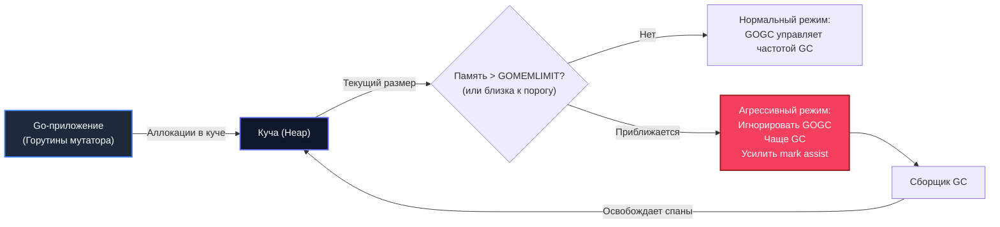

## GOMEMLIMIT: мягкий лимит для жёстких ограничений

В эпоху физических серверов (Bare-metal) программисты привыкли считать оперативную память бескрайней равниной: если серверу установлено 128 ГБ RAM, кратковременный всплеск аллокаций до 30 ГБ никого не пугал. Но облачная революция и контейнеризация загнали бэкенд в тесные железобетонные боксы Kubernetes и cgroups. В контейнере с лимитом `512Mi` лишний выделенный мегабайт карается безжалостным расстрелом: ядро Linux посылает сигнал `SIGKILL` через механизм OOM Killer (Out Of Memory), оставляя в логах лишь сухую запись `OOMKilled exit code 137`.

В [[7. GOGC и tuning]] мы освоили управление ритмом сборщика через относительный коэффициент `GOGC`. Однако в контейнерах одного `GOGC` трагически недостаточно. Поскольку `GOGC` оперирует исключительно процентами от размера выжившей кучи, внезапное удвоение живых данных приводит к пропорциональному взлёту целевого потолка, пробивающему лимиты контейнера. Исторически разработчикам приходилось прибегать к отчаянным костылям — так называемому паттерну «балластной памяти» (Memory Ballast).

Всё изменилось с выходом Go 1.19 (и окончательной стабилизацией в Go 1.21), когда Майкл Нисвандер (Michael Knyszek) из команды Go реализовал фундаментальный механизм — **GOMEMLIMIT**. Это мягкий лимит памяти, который заставляет рантайм динамически форсировать сборку мусора при приближении к аппаратному потолку контейнера.

GOMEMLIMIT не заменяет GOGC, а образует с ним идеальный гармоничный тандем. Вместе они формируют комплексную двухконтурную систему управления динамической памятью: `GOGC` задаёт комфортный ритм в штатных условиях, а `GOMEMLIMIT` выступает надёжным кремниевым демпфером, защищающим процесс от аварийной гибели.

---

## Что такое GOMEMLIMIT

**GOMEMLIMIT** — это системный параметр рантайма Go, задающий целевой абсолютный порог совокупного потребления памяти процессом. Он конфигурируется через переменную окружения `GOMEMLIMIT=<bytes>` или программно в коде через вызов функции `debug.SetMemoryLimit(limit int64)`. Значение задаётся в байтах либо с использованием канонических суффиксов `KiB`, `MiB`, `GiB` (например, `GOMEMLIMIT=200MiB` или `GOMEMLIMIT=400MiB`).

Принципиальное отличие от лимита ядра Linux cgroups:
- Лимит cgroups — **жёсткий (Hard Limit)**: при его превышении ядро ОС немедленно уничтожает процесс без права на перехват сигнала.
- GOMEMLIMIT — **мягкий целевой ориентир (Soft Limit)** для встроенного планировщика памяти рантайма.

При приближении совокупного объёма памяти к порогу GOMEMLIMIT сборщик мусора плавно меняет своё поведение:
1. **Игнорирование GOGC:** Рантайм перестаёт пассивно дожидаться планового удвоения кучи и форсированно запускает конкурентную маркировку раньше времени.
2. **Усиление Mark Assist:** Горутинам мутатора, активно создающим объекты, начисляется повышенный штраф, замедляющий генерацию мусора и помогающий сборщику.
3. **Защита от зацикливания (Backpressure & Throttle):** Вспомогательные алгоритмы сдерживают аллокатор, плавно притормаживая рост кучи.



---

## Почему одного GOGC недостаточно в контейнерах

Чтобы оценить гениальность GOMEMLIMIT, полезно вспомнить, почему страдали контейнеризированные сервисы под управлением одного лишь `GOGC`:

1. **Непредсказуемость всплесков нагрузки:** Если базовый живой объём `LiveHeap` составляет 100 МБ, при `GOGC=100` цель равна 200 МБ. Но если сервис получил пиковый запрос и поднял в память массивный кэш до 250 МБ, сборщик нацелится на 500 МБ. Если лимит контейнера равен 400 МБ — процесс погибнет от OOMKill задолго до запуска следующего планового GC.
2. **Ленивый возврат страниц в ОС (`MADV_FREE` vs `MADV_DONTNEED`):** Рантайм Go не отдаёт освобождённую память ядру ОС каждую секунду ([[7. Fragmentation]]). Память может быть помечена как неиспользуемая в рантайме, но резидентный размер процесса (RSS) в метриках Linux cgroups остаётся высоким.
3. **Память вне кучи (Non-heap Memory):** `GOGC` следит исключительно за кучей Go. Он не учитывает память стеков горутин, структуры рантайма, сегменты кода бинарника и аллокации через cgo или системный вызов `mmap`.

GOMEMLIMIT устраняет эту слепую зону: он вводит единый абсолютный потолок, гарантируя, что рантайм бросит все силы на сборку мусора до того, как контейнер пересечёт опасную черту.

---

## Как GOMEMLIMIT взаимодействует с GOGC

В недрах рантайма за расчёт траектории сборки отвечает регулятор темпа — **GC Pacer** (`runtime/mgcpacer.go`).

При наличии обоих параметров рантайм на каждом шаге выполняет двухконтурный расчёт:

1. Непрерывно отслеживается `heap_marked` (объём живых данных, переживших последний GC) и текущий размер занятой памяти `heap_inuse`.
2. Вычисляется цель по относительному проценту (`goal_gc = heap_marked * (1 + GOGC/100)`):  
   $$\text{goal\_gc} = \text{heap\_marked} \times \left(1 + \frac{\text{GOGC}}{100}\right)$$
3. Вычисляется цель по абсолютному лимиту: рантайм оценивает накладные расходы структур вне кучи (`non_heap_memory`: стеки, спаны, арены, кэши) и определяет доступный коридор кучи (`goal_mem = GOMEMLIMIT - non_heap_memory`):  
   $$\text{goal\_mem} = \text{GOMEMLIMIT} - \text{non\_heap\_memory}$$
4. **Принцип минимальной цели:** Рантайм выбирает меньшее из двух значений:  
   $$\text{Target} = \min(\text{goal\_gc}, \text{goal\_mem})$$
   Если `goal_mem` меньше `goal_gc`, рантайм принудительно стартует сборку раньше расписания GOGC.
5. **Аппаратный ограничитель CPU (The 50% CPU Limiter):**  
   Что произойдёт, если приложение аллоцирует память быстрее, чем физически способно освободить, или если `LiveHeap` превысил `GOMEMLIMIT`? В наивных сборщиках это вызвало бы бесконечный штопор (GC Thrashing) — процесс тратил бы 100% CPU на непрерывную сборку мусора, полностью парализуя сервис. В Go встроен предохранитель `gcCPULimiter`: сборщику мусора законодательно запрещено потреблять более **50% суммарной мощности CPU** в скользящем окне времени. Если памяти не хватает даже при 50% CPU — рантайм позволяет куче превысить GOMEMLIMIT и встретить честный OOM, сохраняя отзывчивость оставшихся ядер.

> [!info] Под капотом
> В исходном коде `runtime/mgcpacer.go` процедура `gcController.revise` пересчитывает цели планировщика на основе параметров `gcPercent` (GOGC) и `memoryLimit`.
> Функция вычисляет служебную величину `heapGoalFromMemoryLimit`. Если она оказывается строже стандартного `heapGoal`, именно она замещает расчётную цель в структурах рантайма. Параллельно механизм `gcCPULimiter` контролирует баланс процессорных тактов, предохраняя систему от паралича при дефиците памяти.

---

## Как выбрать значение GOMEMLIMIT

Золотое правило настройки GOMEMLIMIT для контейнеров Docker и Kubernetes:

```text
GOMEMLIMIT = ContainerLimit - 10–20%
```

Почему резерв в 10–20% жизненно необходим?  
Потому что `GOMEMLIMIT` держит на контроле только структуры рантайма Go. За пределами его досягаемости находятся:
- **Динамический рост стеков горутин:** 10 000 глубоких стеков могут занять 50–100 МБ памяти.
- **Образы бинарников и разделяемые библиотеки:** Сегменты `.text` и `.data`, подгружаемые ядром ОС.
- **Внешние аллокации через CGO и mmap:** Любые буферы Си-библиотек или отображения файлов в память (RocksDB, libvips, compression libraries).
- **Фрагментация страниц в аллокаторе tcmalloc/mcache** и метаданные рантайма (дескрипторы горутин `G`, потоков `M`, процессоров `P`, спанов `mspan` и битовых карт `gcBits`).
- **Служебный оверхед Linux ядра:** Буферы сетевых сокетов TCP (sk_buff) и дескрипторы открытых файлов.

Если назначить `GOMEMLIMIT` впритирку к лимиту контейнера (например, `GOMEMLIMIT=512MiB` при лимите `512Mi`), то при заполнении кучи до 510 МБ малейший сетевой пакет ядра вызовет неизбежный OOMKill!

Для контейнера с лимитом `512Mi` идеальной отправной точкой является `GOMEMLIMIT=400MiB` (запас около 20%). Для крупного контейнера на `4Gi` достаточно оставить 10–15% запаса (`GOMEMLIMIT=3500MiB`).

---

## Метрики и мониторинг GOMEMLIMIT

Пакет `runtime/metrics` и стандартный экспортер Prometheus `client_golang` предоставляют полную прозрачность работы лимита:

- `/gc/memory/limit:bytes` — текущее значение GOMEMLIMIT, зарегистрированное рантаймом.
- `/gc/memory/bytes:total-hwm` (High Water Mark) — исторический пиковый максимум использования памяти с момента запуска приложения.
- `/memory/classes/heap/unused:bytes` — свободная, но удерживаемая рантаймом память в выделенных спанах.
- `/memory/classes/heap/released:bytes` — физическая память, возвращённая ядру операционной системы.

В коде приложения базовую оценку состояния можно получить через `runtime.ReadMemStats`:

```go
package main

import (
    "fmt"
    "runtime"
)

func printHeapStatus() {
    var m runtime.MemStats
    runtime.ReadMemStats(&m)

    // HeapInuse — память в активных спанах
    // HeapSys — виртуальная память, запрошенная рантаймом у ОС под кучу
    fmt.Printf("HeapInuse: %d MB, HeapSys: %d MB\n", m.HeapInuse>>20, m.HeapSys>>20)
}
```

Разница `HeapSys - HeapInuse` демонстрирует объём зарезервированной, но пока не используемой памяти.

---

## Пример: настройка GOMEMLIMIT для контейнера с 256 МБ

**Дано:** Микросервис работает в Kubernetes Pod с лимитом `resources.limits.memory: 256Mi`. Стабильный объём живых структур приложения составляет `LiveHeap = 80 МБ`.  
**Проблема:** При стандартном `GOGC=100` куча пытается вырасти до $80 \times 2 = 160\text{ МБ}$. Во время пиковых всплесков аллокаций потребление стеков и накладных расходов выталкивает совокупный RSS за границу 256 МБ, порождая случайные падения по OOMKill.  
**Решение:**  
Выставляем конфигурацию в манифесте Deployment:

```text
GOMEMLIMIT=210MiB
GOGC=100
```

**Результат:**  
Резерв в 46 МБ гарантированно покрывает стеки и метаданные. Рантайм зорко следит за границей в 210 МБ. При всплеске аллокаций сборщик плавно учащает циклы, удерживая High Water Mark на уровне около 200 МБ. Падения по OOMKill полностью прекращаются.

---

## Пример: высокий GOGC с GOMEMLIMIT для экономии CPU

**Дано:** Сервис развёрнут на выделенной ноде с 16 ГБ RAM.  
**Задача:** Минимизировать накладные расходы CPU на сборку мусора, убрав частые паузы и всплески `mark assist`.  
**Решение:**  
Устанавливаем агрессивно высокий процент `GOGC=400` в паре с защитным потолком:

```text
GOGC=400
GOMEMLIMIT=12GiB
```

**Результат:**  
В штатном режиме при стабильном `LiveHeap = 1.5 ГБ` сборщик мусора запускается предельно редко (куча свободно дышит до $1.5 \times 5 = 7.5\text{ ГБ}$), экономя колоссальное количество процессорных тактов. Если же в системе произойдёт аномальный всплеск данных, `GOMEMLIMIT=12GiB` перехватит инициативу и не позволит куче захватить всю память сервера, сохранив стабильность соседних сервисов. Это идеальный симбиоз производительности и отказоустойчивости.

---

## Потенциальные проблемы и ловушки

> [!warning] Ловушка / Gotcha
> **GOMEMLIMIT — это не замена оптимизации аллокаций!**  
> Если бизнес-код генерирует терабайты бесполезного мусора в секунду, установка строгого GOMEMLIMIT не решит архитектурных проблем. Рантайм начнёт непрерывно запускать сборку мусора, `mark assist` заблокирует горутины мутатора, а сервис деградирует по пропускной способности. Главным средством масштабирования остаётся снижение аллокаций ([[1. Уменьшение аллокаций]], [[2. sync Pool]]).

> [!warning] Ловушка / Gotcha
> **Опасность заниженного лимита (GC-шторм).**  
> Если установить GOMEMLIMIT слишком близко к объёму живых данных `LiveHeap` (например, лимит 110 МБ при живых 100 МБ), сборщик мусора будет крутиться непрерывно, отнимая предельные 50% CPU. Всегда оставляйте рабочее пространство: лимит должен составлять минимум $1.3 - 1.5 \times \text{LiveHeap}$.

> [!warning] Ловушка / Gotcha
> **Слепота к памяти вне кучи (Non-heap Memory).**  
> GOMEMLIMIT не контролирует стековую память (`StackInuse`), нативный код cgo и отображения `mmap`. Если приложение породит 500 000 горутин, только их стеки займут более 1 ГБ оперативной памяти, что приведёт к OOMKill в обход сборщика мусора. Всегда мониторьте общее RSS процесса!

> [!warning] Ловушка / Gotcha
> **Совместимость версий языка.**  
> Механизм GOMEMLIMIT и системная функция `debug.SetMemoryLimit` появились в Go 1.19 и получили промышленную стабилизацию в Go 1.21. На устаревших версиях рантайма (Go 1.18 и старше) эта переменная окружения просто игнорируется.

---

## Mechanical Sympathy: как GOMEMLIMIT влияет на процессор

С точки зрения кремниевой архитектуры процессора, срабатывание GOMEMLIMIT означает переход системы в режим повышенного давления:

- **Учащение фаз маркировки:** Сборщик чаще сбрасывает конвейеры и чаще прогоняет данные через кэш-линии L1/L2/L3, снижая локальность данных приложения ([[8. Cache friendliness]]).
- **Всплески Mark Assist:** Рабочие горутины чаще отрываются от исполнения бизнес-инструкций, генерируя кратковременные всплески задержек.
- **Burst-эффект:** Когда нагрузка подскакивает, процессор тратит до 50% мощности на стабилизацию памяти, после чего плавно возвращается в крейсерский режим.

С точки зрения Mechanical Sympathy, GOMEMLIMIT должен быть **страховочным тросом, а не постоянной рабочей точкой опоры**. В идеальной архитектуре ритм задаётся коэффициентом GOGC, а GOMEMLIMIT активируется лишь в моменты редких форс-мажорных аномалий.

---

## Интеграция с оркестраторами и Infrastructure as Code

В Kubernetes лимит памяти подаётся в манифест контейнера, однако стандартный Downward API передаёт значение лимита без автоматического пересчёта в 80–85%:

```yaml
# Пример в манифесте Kubernetes:
env:
- name: GOMEMLIMIT
  value: "400MiB"
```

Для автоматического вычисления порога в современных микросервисах часто внедряют автоопределение лимитов прямо в функцию инициализации `init()` через чтение параметров ядра Linux cgroups (файлы `/sys/fs/cgroup/memory/memory.limit_in_bytes` в cgroups v1 или `/sys/fs/cgroup/memory.max` в cgroups v2):

```go
package main

import (
    "os"
    "runtime/debug"
    "strconv"
    "strings"
)

func init() {
    // Автоматическая калибровка GOMEMLIMIT под cgroups v2
    if data, err := os.ReadFile("/sys/fs/cgroup/memory.max"); err == nil {
        limitStr := strings.TrimSpace(string(data))
        if limitStr != "max" {
            if bytes, err := strconv.ParseInt(limitStr, 10, 64); err == nil {
                // Выделяем 80% от лимита контейнера под рантайм Go
                target := int64(float64(bytes) * 0.8)
                debug.SetMemoryLimit(target)
            }
        }
    }
}
```

Такой паттерн полностью исключает человеческий фактор при изменении ресурсных лимитов подов в Helm-чартах.

---

## Динамическое изменение GOMEMLIMIT
 
Функция `debug.SetMemoryLimit` (из стандартного пакета `runtime/debug.SetMemoryLimit`) даёт возможность программно изменять порог памяти во время выполнения:
- Адаптация к вертикальному автомасштабированию контейнеров (VPA) без перезапуска пода.
- Временное расширение лимита при выполнении плановых тяжёлых пакетных вычислений.
- Плавная деэскалация перед освобождением ресурсов.

---

## Итог

- **GOMEMLIMIT** — мягкий абсолютный лимит потребления памяти рантаймом Go, заставляющий сборщик мусора форсированно активизироваться при приближении к критической отметке.
- Устанавливается через переменную среды `GOMEMLIMIT` или функцию `debug.SetMemoryLimit`; стандартная рекомендация для облачной среды — **80–85% от лимита контейнера**.
- Образует гармоничную пару с GOGC: `GOGC` задаёт рабочий темп сборок, а `GOMEMLIMIT` защищает от фатального OOMKill при аномальных всплесках живой памяти.
- Необходим запас в 15–20%, поскольку лимит не распространяется на динамические стеки горутин, CGO, бинарный код и структуры ядра операционной системы.
- В рантайм встроен защитный механизм `gcCPULimiter`, гарантирующий, что GC не захватит более 50% CPU даже при катастрофическом дефиците памяти.
- Мониторинг обеспечивается метриками `/gc/memory/limit:bytes`, `total-hwm` и `HeapInuse`.

Освоив полный инструментарий управления памятью, мы переходим к финальному и наиболее драматичному вопросу: что делать, когда сборщик мусора становится главным бутылочным горлышком системы — [[9. Когда GC становится bottleneck]].