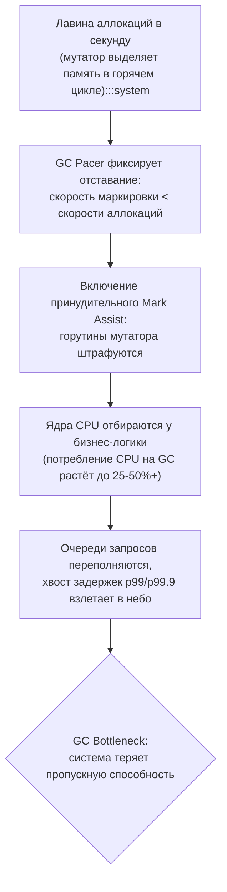
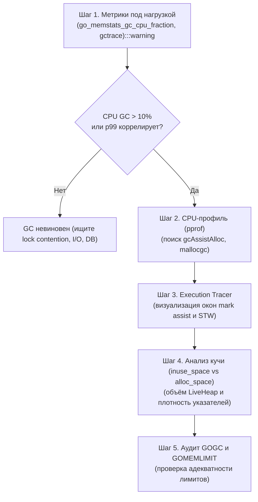
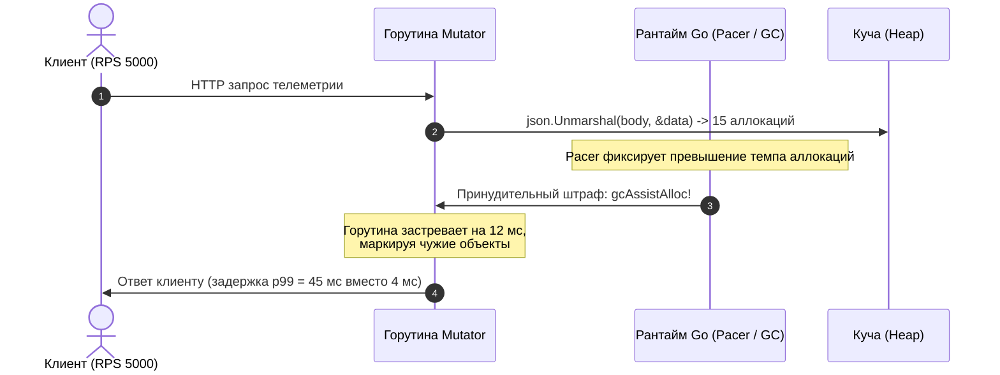

## Когда сборщик мусора становится узким местом

Любой автоматический сборщик мусора напоминает муниципальную службу очистки мегаполиса: пока мусоровозы бесшумно вывозят баки ночью по расписанию, горожане даже не задумываются об их существовании. Но представьте, что жители домов начали выбрасывать строительный мусор в промышленных масштабах прямо посреди оживленного перекрёстка в час пик. Городская логистика мгновенно парализуется: тяжелая спецтехника перекрывает полосы движения, полиция останавливает легковые автомобили, чтобы пропустить коммунальные грузовики, а водители стоят в бесконечной дорожной пробке.

В высоконагруженных сервисах на Go эта катастрофическая ситуация называется **GC Bottleneck** (или деградация вплоть до **GC Thrashing**). В предыдущих главах мы детально разобрали устройство сборщика мусора Go:
- алгоритм трехцветной маркировки ([[2. Tri color marking]]);
- фазы кратковременной остановки мира ([[3. Stop the world]]);
- принципы параллельной конкурентной сборки ([[4. Concurrent GC]]);
- барьеры записи Dijkstra и Yuasa ([[5. Write barriers]]);
- физику пауз и задержек ([[6. GC pause и latency]]);
- динамический тюнинг через GOGC ([[7. GOGC и tuning]]) и защитный потолок GOMEMLIMIT ([[8. GOMEMLIMIT]]).

Мы знаем, что рантайм Go спроектирован с упором на субмиллисекундные паузы STW и максимальную конкурентность. Но сборщик мусора не обладает даром созидания — он подчиняется законам сохранения энергии и тактов CPU. Когда приложение порождает мусор быстрее, чем аппаратура способна его промаркировать и утилизировать, рантайм вынужден вводить драконовские штрафные санкции: принудительно переключать горутины бизнес-логики в режим отработки «долга» — `runtime.gcAssistAlloc`.



GC становится узким местом не тогда, когда он просто выполняет свою работу, а когда:
1. Его суммарная доля процессорного времени начинает вытеснять полезные вычисления.
2. Механизм **mark assist** отбирает ядра у горутин, обслуживающих клиентов.
3. Микропаузы и задержки аллокаций пробивают бюджеты SLO и взвинчивают хвостовую латентность (p99/p99.9).

Это не ошибка разработчиков языка — это фундаментальный симптом архитектурного дисбаланса: либо сервис небрежно обращается с динамической памятью кучи, либо рантайм некорректно сконфигурирован под выделенные аппаратные квоты. Задача senior-инженера — не угадывать настройки наугад, а методично диагностировать симптомы, выявлять корневую причину и восстанавливать системное равновесие.

---

## Симптомы: как понять, что GC стал проблемой

В реальных распределённых системах сборщик мусора редко заявляет о себе фатальным падением с понятным стектрейсом. Проблема накапливается исподволь, проявляясь в виде набора специфических сигналов на панелях мониторинга и в профилях производительности.

### 1. Высокая доля CPU, потребляемого GC

Главный барометр здоровья сборщика — относительная доля вычислительной мощности, уходящая на служебные нужды рантайма. Метрика `go_memstats_gc_cpu_fraction` (в стандартных дашбордах Prometheus часто именуемая `go_gc_cpu_fraction`, доступная через Prometheus или `runtime.ReadMemStats`) вычисляет интегральное отношение процессорного времени, потраченного всеми потоками GC, к общему доступному времени процессоров приложения ($GOMAXPROCS \times \text{uptime}$).

```text
Здоровый сервис:          0.01 – 0.05  (1% – 5% CPU на GC)
Тревожная зона:           0.08 – 0.12  (8% – 12% CPU на GC — повод для профилирования)
Критический Bottleneck:   > 0.15       (15% – 25%+ CPU — GC активно душит бизнес-логику)
```

Если метрика стабильно превышает 15–20%, треть или даже половина ядер вашего сервера занимается исключительно перекладыванием указателей в куче и очисткой мусора.

### 2. Mark assist в топе CPU-профиля

Если вы сняли профиль CPU под рабочей нагрузкой ([[2. CPU profiling в Go]]) и обнаружили на вершине графа вызовов (flamegraph) следующие символы:
- `runtime.gcAssistAlloc` (или коротко `gcAssistAlloc`)
- `runtime.gcDrain` (или коротко `gcDrain`)
- `runtime.gcBgMarkWorker` (или коротко `gcBgMarkWorker`)

значит, мутатор находится в состоянии непрерывной долговой кабалы. 

Напомним механику: рантайм Go выделяет на фоновую маркировку ровно 25% мощности CPU (фоновые воркеры `gcBgMarkWorker`). Если этого оказывается недостаточно, регулятор темпа (GC Pacer) при каждой попытке горутины вызвать `runtime.mallocgc` принудительно заставляет её отработать долг по маркировке живых объектов через `runtime.gcAssistAlloc`. Когда `gcAssistAlloc` выходит в топ CPU-профиля, это неопровержимое свидетельство: темп аллокаций приложения катастрофически опережает физические возможности фоновых сборщиков.

### 3. Частые и длинные GC-циклы в gctrace

Флаг окружения `GODEBUG=gctrace=1` (или просто `gctrace`) заставляет рантайм выводить в `stderr` подробный отчет по каждому завершенному циклу сборки:

```text
gc 123 @45.123s 12%: 0.015+2.3+0.025 ms clock, 0.12+1.8/2.1/0.8+0.2 ms cpu, 500->510->300 MB, 600 MB goal, 8 P
```

Разберём маркеры беды в этой строке:
- **Интегральный процент CPU после символа `@` (`12%`):** Начиная со старта процесса, 12% всех тактов ушли в GC. Значения выше 10–15% сигнализируют о перегрузке.
- **Длительность фаз (wall-clock и cpu):** Второе число (`2.3 ms clock` и `1.8/2.1/0.8 ms cpu`) отражает конкурентную маркировку. Если это время растёт при относительно небольшой куче — в куче слишком много указателей.
- **Динамика кучи и цель:** Схема `500->510->300 MB, 600 MB goal` показывает объём до GC, объём на момент окончания маркировки, объём живых данных и целевой потолок следующего цикла (`... MB goal`). Если куча непрерывно балансирует вблизи цели, а циклы следуют один за другим каждые 100–200 мс — система близка к срыву.

> [!warning] Опасность: gctrace в продакшене
> Включение `GODEBUG=gctrace=1` на высоконагруженном инстансе порождает сотни строк логов в секунду, создавая ощутимый I/O-оверхед в `stderr`. Используйте этот инструмент на канареечных подах или в тестовых контурах бенчмаркинга.

### 4. Рост хвостовых задержек, коррелирующий с GC

В лекции [[6. GC pause и latency]] мы выяснили: паузы STW в современном Go редко превышают 0.5 мс. Откуда же берутся всплески задержек p99 и p99.9 до 50–100 мс?

Ответ кроется в совместном действии двух факторов:
1. **Зависание горутин в Mark Assist:** Клиентский HTTP/gRPC-запрос обрабатывается горутиной, которая в процессе формирует большой JSON или буфер. Рантайм внезапно тормозит её на 15 миллисекунд в недрах `runtime.gcAssistAlloc`. Клиент видит необъяснимый всплеск latency.
2. **Задержка входа в STW (STW Phase 1):** Если хотя бы один системный поток `M` застрял в длинном плотном Си-вызове через CGO, фаза остановки мира не может завершиться, пока все процессоры `P` не достигнут точки безопасности (safepoint).

Если график p99 в Grafana демонстрирует регулярную гребенку, пики которой строго совпадают с отметками `go_gc_duration_seconds`, сборщик мусора разрушает ваш SLA.

### 5. Падение пропускной способности при росте нагрузки

При идеальной масштабируемости удвоение количества ядер или входящего трафика должно давать пропорциональный рост throughput (RPS). Но при наличии GC-bottleneck возникает эффект насыщения (закон Амдала):
- Входящий RPS растёт на 30%.
- Объём аллокаций растёт на 30%.
- GC запускается чаще, вовлекая всё больше ядер в фоновую сборку и mark assist.
- Бизнес-логика получает меньше квантов времени, очереди обработки начинают копиться.
- Добавление дополнительных CPU-ядер лишь усугубляет ситуацию: растёт конкуренция за шину памяти и очереди планировщика рантайма.

---

## Диагностика: инструменты и методология

Перед внесением любых правок в код или конфигурационные манифесты Kubernetes необходимо строго локализовать корень зла. Инженерный протокол диагностики состоит из пяти последовательных шагов.



### Шаг 1. Собрать метрики GC под нагрузкой

Соберите ключевые временные ряды из Prometheus:
- `go_memstats_gc_cpu_fraction` — доля процессора, отданная сборщику мусора.
- `go_gc_duration_seconds` (гистограмма квантилей пауз).
- `go_memstats_heap_alloc_bytes` — динамика выделенной памяти кучи.
- `go_memstats_heap_objects` — суммарное число живых объектов в куче.

Запустите сервис с `GODEBUG=gctrace=1` в изолированном бенчмарк-окружении, запишите лог и проанализируйте интервалы между сборками. Если сборки происходят чаще, чем 1–2 раза в секунду при скромном объёме полезной работы — налицо нездоровый темп аллокаций.

Параллельно снимите профили памяти кучи:
- Аллокационный профиль (`alloc_space`) для понимания того, какие функции производят мусор с максимальной скоростью ([[4. Allocation profiling]]).
- Профиль текущей занятости (`-inuse_space`) для оценки постоянного балласта памяти ([[5. pprof memory profile]]).

### Шаг 2. Снять CPU-профиль в момент высокой нагрузки

Подключитесь к работающему экземпляру через эндпоинт `net/http/pprof` и запишите 30-секундный срез выполнения:

```bash
curl -o cpu.prof "http://localhost:6060/debug/pprof/profile?seconds=30"
go tool pprof -http=:8080 cpu.prof
```

В веб-интерфейсе pprof переключитесь на вкладку **Flame Graph** или **Top**:
- Ищите служебные функции рантайма: `runtime.gcAssistAlloc`, `runtime.gcDrain`, `runtime.gcBgMarkWorker`.
- Обратите внимание на функции аллокатора: `runtime.mallocgc` (выделение блоков в куче) и `runtime.growslice` (динамический рост слайсов при `append`).
- Если суммарно `mallocgc` + `gcAssistAlloc` + `gcBgMarkWorker` превышают 20–30% площади пламени — процессор занят обслуживанием аллокатора, а не бизнес-логики.

### Шаг 3. Использовать execution tracer

Execution Tracer ([[3. execution tracer]]) — самый мощный инструмент для расследования аномалий времени отклика. Снимите трассировку событий рантайма:

```bash
curl -o trace.out "http://localhost:6060/debug/pprof/trace?seconds=5"
go tool trace trace.out
```

В браузере откроется детальная временная шкала с точностью до наносекунд:
- Дорожки **Proc** наглядно покажут, в какие моменты ядра переключаются на воркеры `GC (dedicated)` и `GC (fractional)`.
- Дорожки горутин подсветят красным цветом отрезки, где прикладная горутина блокируется в `MARK ASSIST`. Если такие отрезки длятся миллисекунды — вы нашли причину деградации p99.
- Всплывающие подсказки на паузах STW покажут длительность `Sweep Termination` и `Mark Termination`.

### Шаг 4. Оценить объём живых объектов и их природу

Используйте флаг `-inuse_space` в memory-профайлере:

```bash
go tool pprof -inuse_space http://localhost:6060/debug/pprof/heap
```

Оцените величину `LiveHeap`. Если после отработки сборщика в памяти остаётся несколько гигабайт живых данных, представленных миллионами мелких структур (узлы графов, элементы списков, кэш-записи), сборщик будет неизбежно тратить огромное время на их обход, независимо от частоты запусков.

### Шаг 5. Проверить настройки GOGC и GOMEMLIMIT

Проверьте текущую конфигурацию среды окружения:
- Не установлен ли `GOGC` в искусственно заниженное значение (например, `GOGC=20`), вынуждающее рантайм перезапускать цикл при каждом чихе?
- Установлен ли `GOMEMLIMIT`? Если `GOMEMLIMIT` выставлен слишком близко к минимальному размеру живой кучи, рантайм входит в панический режим постоянной уборки, пытаясь предотвратить OOM.

---

## Корневые причины и стратегии устранения

Практика показывает, что проблемы с GC делятся на шесть фундаментальных инженерных паттернов.

### 1. Слишком высокий темп аллокаций (много мусора)

Самая распространенная причина: сервис функционирует как «мусоросжигательный завод», создавая миллионы кратковременных объектов в секунду на каждый поступивший сетевой запрос.

```text
Типичные источники мусора:
• Необдуманный парсинг JSON/XML через reflection и unmarshal в пустые интерфейсы.
• Конкатенация строк через оператор + в горячих циклах вместо strings.Builder.
• Постоянное создание буферов []byte для чтения из сетевых сокетов.
• Боксинг примитивных типов при передаче аргументов в interface{} (any).
• Непрерывные вызовы append() на слайсах без предварительного резервирования cap.
```

**Инженерные контрмеры:**
- Применяйте методики снижения аллокаций ([[1. Уменьшение аллокаций]]): минимизируйте использование `make` и `append` без капасити, избегайте скрытого боксинга в `any`.
- Внедряйте `sync.Pool` ([[2. sync.Pool]]) для повторного использования крупных буферов, структур кодировщиков и временных слайсов.
- Заменяйте стандартный рефлексивный пакет `encoding/json` на высокоскоростные библиотеки кодогенерации или SIMD-парсинга (`sonic`, `easyjson`).
- Используйте предвыделение памяти ([[4. Предвыделение памяти]]): `make([]T, 0, expectedCapacity)` исключает каскадные аллокации через `runtime.growslice`.

### 2. Большой объём живых объектов (большой LiveHeap)

Если приложение удерживает в памяти гигабайты долгоживущих данных (in-memory кэши, таблицы сессий, полнотекстовые индексы), сборщик обязан инспектировать каждый такой объект в каждой фазе маркировки. Чем больше `LiveHeap`, тем дольше длится фаза Mark, и тем выше фоновая нагрузка на ядра.

**Инженерные контрмеры:**
- Установите жесткие лимиты на размер in-memory структур: внедрите политики вытеснения LRU/LFU и обязательный TTL.
- Вынесите многогигабайтные кэши во внешние специализированные хранилища (Redis, Memcached, Aerospike), если задержки сети укладываются в SLA.
- Перейдите на плоские компактные структуры ([[6. Cache friendly структуры]]) и блочные буферы без указателей (off-heap решения вроде `bigcache`, хранящие данные в гигантском байтовом слайсе `[]byte`, который GC сканирует как единый неделимый блок за константное время).

### 3. Много указателей в живых объектах

Каждый указатель в куче — это ребро в графе поиска, которое GC обязан разыменовать, проверить на границы арены и промаркировать в битмапе. Миллион объектов, содержащих по пять указателей каждый, создают колоссальную работу для `runtime.gcDrain` и генерируют непрерывные срабатывания write barrier ([[5. Write barriers]]).

```go
// Плохо: тысячи мелких указателей, тяжелейший граф для обхода GC
type BadNode struct {
    ID    *int
    Name  *string
    Left  *BadNode
    Right *BadNode
}

// Отлично: плоская структура, встроенные значения, адресация по индексам
type GoodNode struct {
    ID         int
    LeftChild  int32 // Индекс в слайсе Arena вместо указателя
    RightChild int32
    NameHash   uint64
}
```

**Инженерные контрмеры:**
- Заменяйте указатели на значения (value-embedding): храните структуры по значению `[]User`, а не срезы указателей `[]*User`.
- Для деревьев и графов используйте плоские массивы с целочисленной адресацией узлов (Array-backed trees) вместо связок через указатели.
- Помните золотое правило рантайма Go: **слайсы примитивных типов (`[]byte`, `[]int`, `[]float64`) не содержат указателей и полностью пропускаются фазой маркировки GC!**

### 4. Слишком много горутин

Каждая горутина обладает собственным стеком (начальный размер 2 КБ). В фазах STW (Sweep Termination и Mark Termination) рантайм обязан обойти корневые множества всех активных горутин. Если в системе одновременно запущено 300 000 «спящих» горутин, ожидающих таймеров или сообщений из каналов, суммарный стек займет свыше 600 МБ, а их сканирование многократно увеличит длительность STW-пауз ([[3. Stop the world]]).

**Инженерные контрмеры:**
- Откажитесь от антипаттерна «горутина на каждую мелкую операцию» в пользу пулов воркеров с фиксированной емкостью.
- Контролируйте утечки горутин: незакрытые каналы и контексты без таймаутов, удерживающие горутины в вечном ожидании.

### 5. Неправильный тюнинг GOGC / GOMEMLIMIT

Парадоксально, но часто узкое место создают сами инженеры попытками «оптимизировать» память:
- Установка `GOGC=10` или `GOGC=20` в надежде сэкономить RAM в контейнере. В результате GC стартует каждые 50 мс, вызывая непрерывный mark assist и съедая до 40% CPU.
- Установка `GOMEMLIMIT` впритык к объёму `LiveHeap`. Если живые данные занимают 400 МБ, а `GOMEMLIMIT` выставлен в 450 МБ, сборщик попадает в режим постоянной тревоги, бросая 50% процессорных ядер на тщетные попытки освободить несжимаемую память.

**Инженерные контрмеры:**
- Держите `GOGC` на базовом уровне 100, либо поднимайте до 150–200, если профиль памяти стабилен ([[7. GOGC и tuning]]).
- Рассчитывайте `GOMEMLIMIT` с обязательным 15–20% запасом от физического лимита контейнера cgroup, как подробно описано в [[8. GOMEMLIMIT]].

### 6. Утечки памяти

Классическая скрытая утечка памяти ([[6. Утечки памяти]]): глобальные кэши без очистки, забытые подписчики в шинах событий, срезы от гигантских массивов, удерживающие исходный буфер в куче. Со временем `LiveHeap` неуклонно ползёт вверх. Чем больше становится `LiveHeap`, тем меньше остаётся свободного пространства кучи до порога `HeapTarget`, и тем чаще рантайм вынужден запускать сборку. В конечном итоге сервис переходит в режим перманентного GC Thrashing.

---

## Практический пример: от диагностики к решению

Рассмотрим реальный производственный сценарий, с которым сталкиваются бэкенд-команды при масштабировании.

**Контекст:**  
Микросервис на Go обрабатывает поток телеметрии с интенсивностью 5000 RPS. После 10 минут стабильной работы под пиковой нагрузкой хвостовая задержка p99 подскакивает с 4 мс до 45 мс, а пропускная способность деградирует до 3800 RPS. Сервис развернут в Kubernetes с лимитом 4 CPU и 1 ГБ RAM.



**Шаг 1. Сбор метрик и профилирование:**
1. `GODEBUG=gctrace=1` показывает регулярные сборки каждые 400 мс:  
   `gc 45 @240.1s 18%: 0.02+3.1+0.03 ms clock ... 180->190->150 MB, 200 MB goal`.  
   Индикатор `18%` подтверждает: почти пятая часть процессора тратится на сборку мусора!
2. В Prometheus метрика `go_memstats_gc_cpu_fraction` держится на уровне 0.18–0.22.
3. Профиль CPU (`curl .../debug/pprof/profile`):
   - `runtime.gcAssistAlloc` потребляет 12% общего времени процессора.
   - `runtime.mallocgc` занимает 14%.
   - В вершине стеков аллокаций находится стандартный парсер `encoding/json` (`json.Unmarshal`).
4. Профиль памяти (`alloc_space`): 65% всего создаваемого мусора генерируется при распаковке JSON-документов и конкатенации строк.

**Шаг 2. Разработка и внедрение плана оптимизации:**
1. **Замена парсера JSON:** Заменяем стандартную рефлексивную библиотеку `encoding/json` на кодогенерируемый или SIMD-оптимизированный парсер `sonic`. Это мгновенно сокращает аллокации на распаковке на 40%.
2. **Пул буферов:** Внедряем `sync.Pool` для декодеров и буферов валидации. Мусор от временных буферов сокращается ещё на 25%.
3. **Калибровка рантайма:** Поскольку сервис потребляет лишь 350 МБ из 1 ГБ выделенной памяти пода, поднимаем `GOGC` со 100 до 200 (`export GOGC=200`). Это раздвигает границы запусков сборщика вдвое без риска OOM.

**Шаг 3. Контрольный замер после релиза:**
- `go_memstats_gc_cpu_fraction` падает с 18% до скромных 3.5%.
- Функция `runtime.gcAssistAlloc` полностью исчезает из топ-20 CPU-профиля.
- Задержка p99 стабилизируется на уровне 3.2 мс при нагрузке 6500 RPS (на 30% выше изначальной границы).

---

## Mechanical Sympathy: почему GC-нагрузка разрушает производительность

Когда сборщик мусора перегружен, снижение производительности сервиса не исчерпывается банальной потерей 15–20% процессорных тактов. С точки зрения физической микроархитектуры кремниевого кристалла последствия носят разрушительный системный характер.

```mermaid
flowchart LR
    classDef process  fill:#1e293b,stroke:#38bdf8,stroke-width:1px,color:#f8fafc
    classDef success  fill:#064e3b,stroke:#34d399,stroke-width:1px,color:#f8fafc
    classDef error    fill:#7f1d1d,stroke:#f87171,stroke-width:1px,color:#f8fafc
    classDef warning  fill:#78350f,stroke:#fbbf24,stroke-width:1px,color:#f8fafc
    classDef entry    fill:#1e3a5f,stroke:#38bdf8,stroke-width:2px,color:#f8fafc
    classDef aux      fill:#334155,stroke:#64748b,stroke-width:1px,color:#f8fafc
    classDef system   fill:#312e81,stroke:#a78bfa,stroke-width:1px,color:#f8fafc
    classDef data     fill:#132d29,stroke:#2dd4bf,stroke-width:1px,color:#f8fafc
    classDef network  fill:#881337,stroke:#fb7185,stroke-width:1px,color:#f8fafc
    classDef accent   fill:#1e1b4b,stroke:#818cf8,stroke-width:1px,color:#f8fafc
    subgraph Hardware ["Аппаратный уровень CPU и памяти"]
        L1["Вымывание кэшей L1d/L2/L3<br/>(Cache Pollution)"]
        MESI["Шторм шины когерентности<br/>(MESI Invalidation Traffic)"]
        TLB["Промахи таблицы страниц<br/>(TLB Thrashing)"]
        BW["Насыщение шины DRAM<br/>(Memory Bandwidth Exhaustion)"]
    end
    GC["Перегруженный Garbage Collector<br/>(непрерывное сканирование гигабайтов кучи)"] --> Hardware
    Hardware --> APP["Мутатор приложения:<br/>дикая задержка доступа к памяти (200-300 тактов)"]
```



### 1. Вымывание процессорных кэшей (Cache Pollution)

Конкурентная маркировка ([[4. Concurrent GC]]) сканирует гигантские массивы указателей в оперативной памяти. Когда рабочий поток GC обходит узлы структур, он принудительно прокачивает эти адреса через кэш-линии L1d, L2 и разделяемый L3-кэш процессора.

В результате «горячие» рабочие структуры бизнес-логики (дескрипторы соединений, текущие сессии клиентов, таблицы роутинга), которые находились в быстрых кэшах L1/L2 (доступ за 1–4 такта), безжалостно вытесняются в оперативную память. Когда горутина мутатора возвращается к выполнению полезного кода, процессор ловит волну аппаратных промахов (**Cache Misses**). Каждое чтение переменной теперь требует ожидания честного похода в DRAM длительностью 150–250 процессорных тактов.

### 2. Трафик когерентности кэша (MESI Cache Invalidation Storm)

Во время конкурентной сборки барьеры записи ([[5. Write barriers]]) и потоки `gcBgMarkWorker` непрерывно модифицируют служебные битмапы маркировки и буферы очередей рабочих потоков. 

В современных многоядерных процессорах линии кэша, разделяемые несколькими ядрами, синхронизируются по протоколам когерентности (MESI / MOESI). Любая запись в общую структуру инвалидирует соответствующую кэш-линию на всех остальных физических ядрах кристалла. Межъядерная шина (Interconnect / Infinity Fabric) забивается служебными сообщениями инвалидации, порождая аппаратные задержки при любых операциях записи даже в несвязанных участках кода.

### 3. TLB-промахи и давление на MMU (TLB Thrashing)

Если куча фрагментирована и раскидана по тысячам виртуальных страниц памяти, сборщик мусора при поиске живых объектов хаотично прыгает по адресам адресного пространства. Буфер ассоциативной трансляции процессора (**Translation Lookaside Buffer, TLB**), хранящий кэш преобразования виртуальных адресов в физические, мгновенно переполняется. Каждый промах TLB заставляет аппаратный блок MMU (Memory Management Unit) выполнять долгую 4-уровневую прогулку по таблицам страниц (Page Table Walk), задерживая конвейер инструкций процессора.

### 4. Конкуренция за пропускную способность памяти (DRAM Bandwidth)

Контроллер оперативной памяти DDR4/DDR5 имеет строгий физический предел пропускной способности (например, 50–80 ГБ/с на канал). Когда 4 или 8 потоков GC непрерывно считывают память для маркировки, они утилизируют значительную часть пропускной способности шины данных. Даже простые вычислительные циклы вашего приложения, которые обычно выполняются мгновенно, начинают тормозить, упираясь в ожидание данных от контроллера памяти (Memory Bandwidth Saturation).

Именно поэтому борьба с аллокациями и оптимизация работы со сборщиком мусора — это не просто «экономия мегабайт». Это сохранение **локальности данных** и забота о том, чтобы процессорные ядра занимались исполнением инструкций вашего сервиса на полной скорости кэш-памяти L1, а не томились в ожидании ответа медленной оперативной памяти.

---

## Вопросы с собеседований и частые ловушки

> [!interview] Вопрос с собеседования: Расследование GC Bottleneck
> **Вопрос:** «Нагрузочное тестирование показало, что при росте нагрузки на 8-ядерном сервере утилизация CPU подскакивает до 85%, но RPS застревает на плато, а p99 вырастает в 10 раз. Как вы докажете или опровергнете гипотезу о том, что виновником является Garbage Collector, и какие шаги предпримете?»  
> **Эталонный ответ:**  
> 1. *Сбор базовых метрик:* Проверяем `go_memstats_gc_cpu_fraction` в Prometheus. Если значение > 15–20% — гипотеза о GC подтверждается. Параллельно смотрим на квантили `go_gc_duration_seconds` и частоту сборок.  
> 2. *Профилирование CPU:* Снимаем 30-секундный профиль через `pprof`. Ищем долю времени в `runtime.gcAssistAlloc`, `runtime.gcDrain` и `runtime.mallocgc`. Доминирование `gcAssistAlloc` доказывает, что горутины бизнес-логики простаивают, отрабатывая долг по маркировке.  
> 3. *Execution Tracer:* Снимаем `trace.out` и визуализируем фазы Assist и STW, подтверждая влияние на хвост задержек.  
> 4. *Устранение:* Снимаем профиль аллокаций (`pprof -alloc_space`), выявляем горячие точки выделения памяти. Оптимизируем код: устраняем лишние аллокации (предвыделение слайсов, `sync.Pool`, замена неэффективных сериализаторов). Если запас по RAM велик, калибруем `GOGC` (поднимаем со 100 до 150–200) и фиксируем безопасный `GOMEMLIMIT`.

> [!info] Под капотом: Защитный механизм gcCPULimiter
> Почему сервис в Go при катастрофическом темпе аллокаций не зависает навсегда в 100% GC-паузе?  
> В рантайм Go (файл `runtime/mgcpacer.go`) встроен строгий аппаратный предохранитель `gcCPULimiter`. Сборщику мусора законодательно запрещено потреблять более **50% суммарного процессорного бюджета** приложения на скользящем окне времени (учитывая фоновые воркеры, assist и sweep). Если приложение аллоцирует настолько агрессивно, что 50% CPU недостаточно для сдерживания кучи, рантайм сознательно ослабляет хватку mark assist, позволяя куче временно превысить лимит и встретить честный `OOMKilled` от операционной системы, но не допустить полного зависания оставшихся ядер.

> [!warning] Опасность: Преждевременный уход в CGO и ручное управление памятью
> Столкнувшись с высокими накладными расходами GC, некоторые разработчики пытаются обойти рантайм Go: выделять память вручную через CGO (`malloc`/`free`) или системный вызов `mmap` (Off-heap allocation).  
> Это путь, сопряженный с колоссальными рисками:
> 1. CGO добавляет фиксированный оверхед ~50–100 нс на каждый вызов функции при переключении стека горутины на системный стек потока.
> 2. Ручное управление мгновенно возвращает в код уязвимости Use-After-Free, Double Free и фатальные утечки памяти, которые невозможно отловить стандартными профилировщиками Go.
> 3. В 98% случаев достаточно использовать `sync.Pool`, плоские структуры данных и правильный тюнинг `GOMEMLIMIT` / `GOGC`, чтобы полностью ликвидировать GC Bottleneck средствами чистого Go.

---

## Итог

Подведём финальные итоги и сформулируем чеклист инженера по выявлению и нейтрализации GC Bottleneck:

- **GC становится узким местом**, когда доля процессорных ресурсов на сборку мусора (`go_memstats_gc_cpu_fraction`) стабильно превышает 10–15%, горутины массово тормозятся в `runtime.gcAssistAlloc`, а хвостовая задержка (p99) коррелирует с запусками циклов сборщика.
- **Диагностический арсенал:**
  1. `GODEBUG=gctrace=1` — мгновенная оценка частоты сборок, объёма живой памяти и доли CPU.
  2. `pprof CPU` — детектирование `gcAssistAlloc`, `gcDrain`, `gcBgMarkWorker`, `runtime.mallocgc` и `runtime.growslice`.
  3. `pprof Heap` (`alloc_space` и `-inuse_space`) — локализация функций, производящих мусор, и выявление балласта `LiveHeap`.
  4. `go tool trace` — визуализация микрозадержек и фаз Mark Assist во времени.
- **Главные рычаги устранения Bottleneck'а:**
  1. **Уменьшение аллокаций:** Замена reflection-библиотек (на `sonic`), пулирование буферов через `sync.Pool`, предвыделение капасити слайсов и мап через `make` и устранение ненужных `append`.
  2. **Очистка от указателей:** Преобразование срезов указателей `[]*T` в срезы значений `[]T`, применение плоских массивов вместо узловых графов, широкое использование байтовых буферов (`[]byte`), пропускаемых сборщиком.
  3. **Контроль горутин:** Ограничение конкурентности через пулы воркеров вместо порождения сотен тысяч неуправляемых стеков.
  4. **Грамотная калибровка:** Установка `GOGC` (100–200) и настройка безопасного потолка `GOMEMLIMIT` с резервом 15–20% от лимита контейнера.
- **Mechanical Sympathy:** Помните, что сборка мусора разрушает локальность данных в L1/L2/L3 кэшах процессора, забивает шину межъядерной когерентности MESI и истощает пропускную способность памяти. Оптимизация работы с памятью дает мультипликативный эффект для производительности всей системы.

---

Завершив фундаментальный разбор сборщика мусора Go, мы изучили все механизмы управления памятью — от аллокатора до детекции узких мест. Теперь мы готовы перейти к следующему краеугольному камню производительности высоконагруженных Go-систем — модели конкурентности. В следующем подразделе мы разберем планировщик Go, архитектуру G-M-P, алгоритмы work stealing и принципы координации параллельных потоков управления: [[1. Scheduler Go. G-M-P модель]].