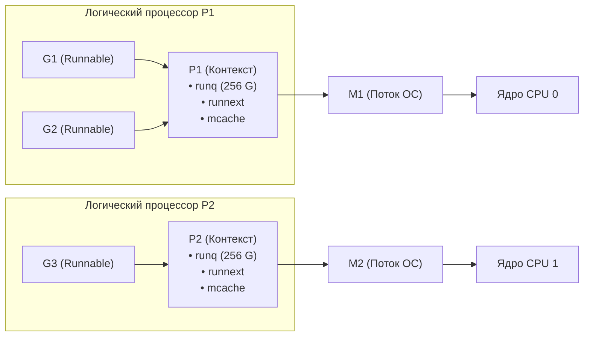
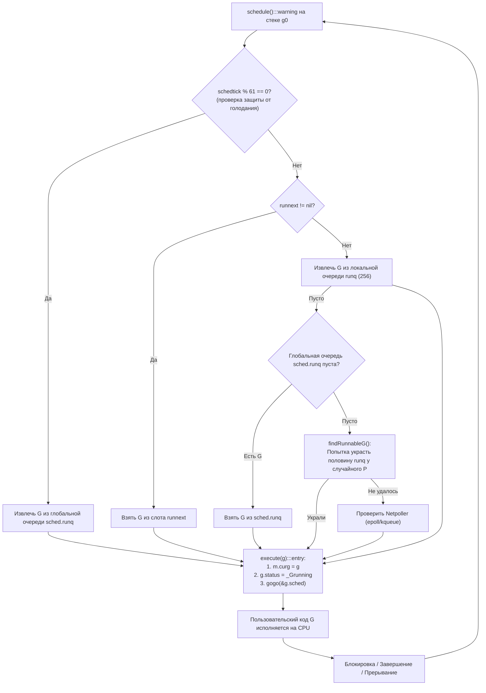
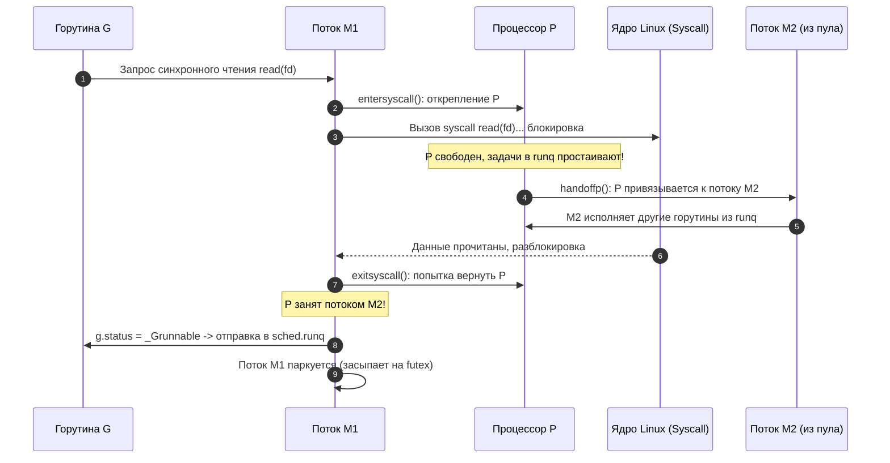

## Scheduler Go: модель G-M-P — фундамент конкурентности

В предыдущих разделах мы подробно исследовали физику памяти ([[1. Memory model Go]], [[2. Heap vs stack]], [[3. Escape analysis]]) и анатомию сборщика мусора ([[1. GC в Go. Обзор]]). Мы видели, как рантайм распоряжается кучей, стеками и временем жизни объектов. Теперь мы подходим к третьему, ключевому столпу производительности Go — **планировщику горутин** (Go Scheduler). Именно он решает, какой участок кода, на каком ядре процессора и в какую наносекунду получит доступ к кремнию, превращая сотни тысяч независимых функций в стройную, высокопроизводительную конкурентную систему.

Представьте себе классическую фабрику: если на каждого рабочего, пришедшего на смену, администрация станет заводить отдельный цех и нанимать личного бригадира, предприятие мгновенно обанкротится под грузом административных расходов. В традиционных языках программирования потоки приложения долгое время отображались один к одному на потоки операционной системы (1:1 Kernel Threads). Но системный поток ОС — это тяжеловесный объект: структура `task_struct` в ядре Linux, фиксированный стек размером от 2 до 8 МБ, дорогостоящие переключения контекста через прерывания ядра (Ring 0 / Ring 3) и неизбежный сброс конвейера инструкций процессора. Попытка поднять 100 000 таких потоков на обычном сервере приведет к немедленному коллапсу планировщика операционной системы (CFS/EEVDF).

Go пошел по принципиально иному пути, реализовав планировщик пользовательского пространства (M:N Userspace Scheduler) на базе элегантной модели **G-M-P**. Она разделяет вычислительные задачи, системные потоки и логические процессоры, позволяя рантайму автономно балансировать нагрузку с субмикросекундными накладными расходами. Понимание этой модели — фундаментальный навык senior-инженера, необходимый для расшифровки поведения систем под предельными нагрузками, диагностики конкуренции за ядра и устранения скрытых задержек планирования ([[4. Контекстные переключения]], [[7. Contention и lock profiling]]).

Эта лекция открывает подраздел «Конкурентность» глубоким разбором внутренней механики планировщика Go. Мы изучим все три управляющие сущности, их жизненный цикл, организацию локальных и глобальных очередей, а также ключевые ассемблерные процедуры рантайма. В последующих главах мы детально погрузимся в устройство самих сопрограмм ([[2. Goroutines под капотом]]), алгоритмы распределения работы ([[3. Work stealing]]) и синхронизацию ([[5. Sync primitives и их стоимость]]).

---

## Три буквы, управляющие конкурентностью

В основе планировщика Go лежит триединство абстракций, обозначаемых латинскими буквами G, M и P:

- **G (goroutine)** — сама горутина. Это легковесная сопрограмма, содержащая собственный расширяемый стек (начальным размером 2 КБ), программный счетчик (Program Counter, PC), указатель стека (Stack Pointer, SP), текущее состояние (`_Grunnable`, `_Grunning`, `_Gwaiting` и др.) и метаинформацию для сборщика мусора и профилировщика.
- **M (machine)** — машинный поток операционной системы (OS Thread). Это реальный поток уровня ядра Linux/Windows/macOS, порожденный системным вызовом `clone(2)` или `pthread_create`. Именно M исполняет машинные инструкции горутины, выполняет системные вызовы и взаимодействует с физическими ядрами CPU.
- **P (processor)** — логический процессор, или контекст выполнения. P не является физическим кремниевым ядром CPU. Это структура данных рантайма, представляющая собой право на исполнение кода Go. P владеет локальной очередью горутин, локальным кэшем аллокатора памяти (`mcache`) и пулом свободных структур. Количество сущностей P строго равно значению `GOMAXPROCS` (по умолчанию числу доступных физических или виртуальных ядер процессора) и определяет максимальную степень истинного параллелизма приложения.

Фундаментальный закон архитектуры Go гласит: **поток M обязан захватить логический процессор P, чтобы исполнять пользовательский код горутины G**. Если у потока M нет связанного с ним P, он не может исполнять код Go и переводится рантаймом в состояние парковки (спящий режим ожидания) либо занят блокирующим системным вызовом ОС.



Упрощённый жизненный цикл выполнения задачи выглядит следующим образом:

1. Горутина `G` создается в коде выражением `go func()`. Планировщик помещает её в локальную очередь выполнения связанного процессора `P` (или в приоритетный слот `runnext`, либо в глобальную очередь, если локальная переполнена).
2. Свободный процессор `P` ищет готовую к исполнению `G`: сначала проверяется приоритетный слот `runnext`, затем собственная локальная очередь `runq`, затем глобальная очередь, а при их опустошении запускается механизм балансировки — воровство задач у соседних процессоров ([[3. Work stealing]]).
3. Поток `M`, удерживающий данный `P`, извлекает `G` и начинает непрерывно исполнять ее машинный код.
4. Если исполняемая `G` блокируется (сетевой I/O, чтение канала, ожидание мьютекса или системный вызов `read`), поток `M` либо временно открепляется от `P`, освобождая процессор для других горутин, либо уходит в сон вместе с горутиной до наступления события разблокировки.

---

## Зачем нужна такая модель

Чтобы оценить изящество модели G-M-P, полезно вспомнить историю ранних версий Go (до релиза 1.1).

В ранних прототипах планировщик состоял всего из двух сущностей: **G** и **M**. Существовала одна глобальная очередь готовых горутин, защищенная единым глобальным мьютексом (`sched.lock`). Каждый раз, когда любой системный поток M хотел взять новую задачу, завершить текущую или создать новую через `go func()`, он был обязан захватить этот единственный замок. При запуске программы на сервере с 16–32 ядрами наступал катастрофический Lock Contention: ядра тратили до 70% своего времени не на выполнение кода, а на ожидание очереди к мьютексу планировщика.

В 2012 году Дмитрий Вьюков разработал масштабируемый дизайн планировщика, добавив промежуточный элемент — **P (Processor)**. Модель G-M-P решила сразу комплекс фундаментальных проблем:

- **Ликвидация глобальных блокировок:** У каждого `P` появилась собственная локальная очередь задач, доступ к которой на чтение и запись потоком-владельцем выполняется атомарно, без тяжелых мьютексов ядра.
- **Мультиплексирование M:N:** Десятки тысяч легковесных горутин `G` мультиплексируются на строго ограниченное число потоков ОС `M` (обычно соответствующее числу реальных ядер через `GOMAXPROCS`).
- **Изоляция и независимость от ядра ОС:** Планировщик Go сам принимает решения о контекстных переключениях в пространстве пользователя (Userspace Context Switch), не совершая дорогих переходов в Ring 0.
- **Колоссальная масштабируемость:** Память под стек горутины выделяется динамически от 2 КБ, что позволяет комфортно держать в памяти сотни тысяч горутин на скромных серверах, тогда как 100 000 системных потоков ОС потребовали бы минимум 200–800 ГБ физической оперативной памяти только под сегменты стека.

---

## Структуры данных: что внутри G, M, P

> [!info] Под капотом: Внутренние структуры runtime2.go
> Все ключевые абстракции планировщика физически описаны на языке Go в файле `runtime/runtime2.go`. Хотя прикладной разработчик не взаимодействует с ними напрямую, понимание их внутреннего строения развеивает ореол «магии» вокруг конкурентности.

### G (горутина)

Структура `g` инкапсулирует полное состояние логического потока выполнения:

```go
type g struct {
    stack       stack          // Границы стека: [stack.lo, stack.hi]
    stackguard0 uintptr        // Маркер границы стека для детекции переполнения
    sched       gobuf          // Сохраненный контекст регистров CPU при переключении
    atomicstatus atomic.Uint32 // Атомарный статус: _Gidle, _Grunnable, _Grunning, _Gwaiting, _Gdead
    goid        int64          // Уникальный монотонно растущий числовой ID горутины
    m           *m             // Указатель на текущий поток M, на котором выполняется G
    lockedm     *m             // Жесткая привязка к потоку при вызове runtime.LockOSThread()
    waiting     *sudog         // Очередь ожидания при блокировке на каналах или мьютексах
    ...
}
```

Контекст регистров процессора сохраняется в компактной структуре `gobuf`:

```go
type gobuf struct {
    sp   uintptr // Указатель вершины стека (Stack Pointer, RSP)
    pc   uintptr // Счетчик команд (Program Counter, RIP)
    g    guintptr // Указатель на саму горутину g
    ret  uintptr // Регистр возврата значения
    lr   uintptr // Link Register (на архитектурах ARM64)
    bp   uintptr // Базовый указатель фрейма (Frame Pointer, RBP)
}
```

Жизненный цикл горутины описывается конечным автоматом атомарных состояний:
- `_Gidle` — структура только что выделена из пула памяти `gFree` и еще не инициализирована.
- `_Grunnable` — горутина находится в очереди выполнения (`runq` или глобальной) и ждет освобождения процессора.
- `_Grunning` — горутина активно исполняет инструкции на процессоре через связанный поток M.
- `_Gwaiting` — горутина остановлена и заблокирована рантаймом (ожидает таймер, канал, мьютекс, netpoller или сборщик мусора). Ее стек заморожен.
- `_Gdead` — горутина завершила выполнение функции, ее стек и метаданные отправлены на утилизацию или в пул `gFree` для повторного использования.

### M (машинный поток)

Структура `m` представляет системный поток ядра операционной системы:

```go
type m struct {
    g0           *g       // Специальная системная горутина с фиксированным системным стеком
    curg         *g       // Текущая пользовательская горутина, выполняемая потоком
    p            *p       // Связанный логический процессор P (nil, если поток заблокирован)
    nextp        *p       // Процессор P, зарезервированный для захвата при пробуждении
    spinning     bool     // Флаг активного спин-ожидания: поток крутится в поисках работы
    locks        int32    // Счётчик критических блокировок (если > 0, прерывание запрещено)
    park         note     // Механизм низкоуровневой парковки потока ОС на futex
    id           int64    // Внутренний ID системного потока
    ...
}
```

> [!NOTE] Особая роль g0
> Обратите внимание на поле `g0`: каждый поток `M` при создании получает специальную горутину `g0`. В отличие от пользовательских горутин с динамическим стеком от 2 КБ, стек `g0` выделяется напрямую операционной системой (обычно 64 КБ – 8 МБ). Именно на стеке `g0` выполняются все внутренние задачи рантайма: вызовы планировщика `schedule()`, расширение стеков, запуск сборщика мусора и переключение контекстов. Пользовательский код никогда не исполняется на `g0`.

### P (логический процессор)

Структура `p` представляет контекст выполнения и хранилище локальных ресурсов:

```go
type p struct {
    id          int32
    status      uint32        // Состояние P: _Pidle, _Prunning, _Psyscall, _Pgcstop, _Pdead
    m           *m            // Связанный системный поток M (nil, если P простаивает)
    mcache      *mcache       // Локальный кэш аллокатора памяти (Thread-local allocator)
    runqhead    uint32        // Индекс головы локальной очереди
    runqtail    uint32        // Индекс хвоста локальной очереди
    runq        [256]guintptr // Локальная очередь горутин: кольцевой безблокировочный буфер
    runnext     guintptr      // Высокоприоритетный слот для следующей горутины
    gFree       struct { ...} // Пул завершившихся структур G для исключения аллокаций
    schedtick   uint32        // Счётчик тиков планировщика
    ...
}
```

Локальная очередь `runq` — это шедевр низкоуровневой инженерии: кольцевой буфер фиксированной емкости на 256 указателей. Извлечение элементов из головы (`runqhead`) и добавление в хвост (`runqtail`) выполняются потоком-владельцем через атомарные инструкции без захвата мьютексов. Если при создании новой `G` локальный буфер переполняется (все 256 слотов заняты), рантайм атомарно выгружает ровно половину очереди (128 горутин) вместе с новой `G` в глобальную разделяемую очередь `sched.runq`.

---

## Поток управления: от `schedule` до переключения

Главный диспетчерский цикл рантайма Go сосредоточен в функции `schedule()` в файле `runtime/proc.go`. Каждый раз, когда горутина уступает процессор, поток M возвращается на системный стек `g0` и вызывает `schedule()`.

Упрощённый алгоритм поиска следующей задачи:



Разберём критические нюансы этого цикла:

1. **Защита от голодания глобальной очереди (Starvation Prevention):**  
   Каждый процессор `P` ведет счетчик тиков `schedtick`. Ровно один раз на каждые 61 вызов планировщика (`schedtick % 61 == 0`) рантайм принудительно проверяет глобальную очередь задач `sched.runq` в обход локальной очереди. Если бы этого правила не существовало, две горутины, непрерывно передающие управление друг другу в локальной очереди, могли бы намертво заморозить задачи в глобальной очереди.
2. **Приоритетный слот `runnext`:**  
   Когда горутина $G_1$ разблокирует $G_2$ (например, отправляя сообщение в канал), рантайм помещает $G_2$ не в хвост очереди, а в привилегированный слот `runnext`. На следующем шаге $G_2$ запустится мгновенно, сохранив свои данные в горячем кэше L1/L2 того же процессорного ядра!
3. **Поиск работы через `findRunnableG`:**  
   Если локальная и глобальная очереди пусты, поток переходит в режим воровства (`spinning = true`), выбирает псевдослучайный чужой процессор `P` и крадет ровно половину его локальной очереди ([[3. Work stealing]]). Если все процессоры пусты, поток опрашивает сетевой поллер ([[4. epoll, kqueue и netpoller]]).
4. **Ассемблерный прыжок `execute(g)` и `gogo`:**  
   Найдя готовую задачу, рантайм связывает `m.curg = g`, переводит ее в состояние `_Grunning` и вызывает ассемблерную процедуру `gogo(&g.sched)`. Процедура восстанавливает регистры `RSP`, `RIP` и `RBP` из структуры `gobuf`, переключая стек с системного `g0` на пользовательский стек горутины, и выполняет процессорную инструкцию перехода `JMP` к адресу выполняемой функции. Когда горутина завершается или блокируется, она возвращается в планировщик через вызовы `goexit` (при завершении функции) или `gopark` (при ожидании событий), и цикл диспетчеризации повторяется.

---

## Когда и почему горутина переключается

В отличие от вытесняющего планировщика ядра ОС (который может насильно остановить выполнение потока по таймеру APIC в любой произвольной инструкции), планировщик Go долгое время оставался **строго кооперативным**. Переключение контекста происходило только в строго определенных точках синхронизации — **Safe Points**:

1. **Пролог вызова функции (`morestack`):**  
   Исторически в начало каждой функции компилятор Go вставляет крошечную инструкцию проверки: достаточно ли места в текущем стеке горутины? Если места мало, вызывается процедура `runtime.morestack`, которая заодно проверяет флаг прерывания горутины планировщиком (`stackguard0`).
2. **Операции с памятью через `mallocgc`:**  
   При выделении памяти в куче аллокатор проверяет статус сборщика мусора и готовность передать квант времени.
3. **Операции синхронизации и I/O:**  
   Чтение/запись в каналы, захват `sync.Mutex`, вызов `time.Sleep`, вызовы `runtime.Gosched()` переводят горутину в режим ожидания через вызов `gopark()`.
4. **Блокирующие системные вызовы:**  
   Перед уходом в ядро через `read` или `write` рантайм вызывает процедуру перехвата.

### Прорыв Go 1.14: невытесняющая асинхронная преемпция (Async Preemption)

До версии Go 1.14 существовала печально известная проблема: если горутина попадала в плотный математический цикл без единого вызова функций:

```go
for {
    // Нет вызовов функций, нет аллокаций!
    // В Go 1.13 эта горутина намертво монополизировала ядро P,
    // блокируя сборщик мусора и другие горутины навсегда!
}
```

Начиная с Go 1.14, рантайм получил полноценную **асинхронную преемпцию на основе сигналов ядра ОС**:
- Фоновый мониторинговый поток рантайма `sysmon` периодически проверяет, как долго горутина непрерывно удерживает процессор `P`.
- Если выполнение длится дольше 10 миллисекунд, `sysmon` отправляет системному потоку `M` POSIX-сигнал `SIGURG`.
- Обработчик сигнала на потоке `M` перехватывает выполнение, сохраняет регистры горутины в `gobuf`, помечает горутину как `_Grunnable`, возвращает её в очередь и вызывает `schedule()`.

> [!NOTE] Почему именно сигнал SIGURG?
> Разработчики Go выбрали `SIGURG` (Out-of-band data on socket), потому что этот сигнал традиционно не используется стандартными библиотеками C/POSIX, не генерируется ядром при сбоях аппаратуры (в отличие от `SIGSEGV` или `SIGBUS`) и игнорируется системными отладчиками (gdb/lldb) по умолчанию.

---

## Связь с системными вызовами и парковка M

Когда приложению требуется выполнить тяжелый блокирующий системный вызов операционной системы (например, синхронный файловый I/O через `read`, вызовы CGO или блокировки ядра), рантайм изолирует исполнение, предотвращая блокировку логического процессора:

1. **Фаза входа (`entersyscallblock` / `entersyscall`):**  
   Перед выполнением системной инструкции `SYSCALL` горутина вызывает `entersyscallblock`. Рантайм немедленно открепляет логический процессор `P` от текущего потока `M` (`p.m = nil`, `m.p = nil`), переводя `P` в состояние `_Psyscall`.
2. **Передача процессора (Handoff P):**  
   Фоновый поток `sysmon` или сам планировщик видят, что процессор `P` простаивает с блокированным потоком, забирают его (`handoffp`) и передают другому свободному потоку `M` из пула (или создают новый поток ОС). Этот новый `M` продолжает разгребать очередь оставшихся горутин.
3. **Фаза выхода (`exitsyscall`):**  
   Когда системный вызов `read` завершается, поток `M` возвращается из ядра. Он обязан выполнить обратную процедуру: попытаться повторно захватить свой прежний `P`. Если `P` уже занят, `M` пробует захватить любой свободный `P` из глобального пула `idleprocs`. Если свободных процессоров нет, горутина переводится в статус `_Grunnable` и отправляется в глобальную очередь `sched.runq`, а сам поток `M` паркуется и засыпает на системном вызове futex.



Для асинхронного сетевого ввода-вывода Go использует принципиально иной, сверхэффективный механизм — сетевой поллер (`netpoller`), интегрированный с системными селекторами ядра (`epoll`, `kqueue`, `IOCP`). Вместо блокировки потока `M` горутина переводится в спящий режим `_Gwaiting`, а её дескриптор регистрируется в очереди netpoller. Поток `M` мгновенно берет следующую задачу из очереди, сохраняя 100% утилизацию ядер.

> [!warning] Ловушка / Gotcha: Взрывное размножение системных потоков (Thread Explosion)
> Если ваш сервис интенсивно обращается к блокирующим ресурсам (например, синхронное обращение к диску через медленную NFS, тяжелые вызовы Си-библиотек через CGO или системные блокировки), рантайм будет создавать новые потоки `M` на каждый заблокированный вызов.  
> Хотя лимит `GOMAXPROCS` сдерживает число одновременно активных процессоров `P`, общее число потоков `M` в рантайме ограничено жестким потолком в **10 000 потоков** (`sched.maxmcount`). При неконтролируемом росте блокировок процесс исчерпает лимит потоков ОС или память ядра, завершившись аварийным падением:  
> `fatal error: runtime: program exceeds 10000-thread limit`.  
> Обязательно экспортируйте и контролируйте системную метрику `runtime.NumThread()` в Prometheus!

---

## Инструменты наблюдения за планировщиком

Эффективная оптимизация невозможна без глубокой телеметрии. Для наблюдения за поведением планировщика рантайм Go предоставляет три мощных инструмента.

### Execution tracer

Утилита `go tool trace` ([[3. execution tracer]]) — абсолютный золотой стандарт профилирования распределения задач во времени. Чтобы зафиксировать трассировку, запишите срез событий:

```bash
curl -o trace.out "http://localhost:6060/debug/pprof/trace?seconds=5"
go tool trace trace.out
```

Веб-интерфейс визуализирует точную хронологию событий с детализацией до микросекунд:
- Дорожка каждого физического процессора `Proc 0`, `Proc 1`... наглядно демонстрирует, какие именно горутины выполнялись, когда происходили переключения контекста и когда ядра простаивали.
- Подсвечиваются фазы `Syscall Execution`, воровство задач `Steal` и всплески латентности очередей (`Scheduler Latency`).

### GODEBUG=schedtrace

Переменная среды `GODEBUG=schedtrace=X` инструктирует планировщик выводить интегральную сводку о своем состоянии в `stderr` каждые `X` миллисекунд:

```bash
GODEBUG=schedtrace=1000 ./my_service
```

Пример вывода в консоль:

```text
SCHED 1000ms: gomaxprocs=8 idleprocs=4 threads=12 spinningthreads=1 idlethreads=5 runqueue=128 [0 0 0 0 0 0 0 0]
```

Разбор параметров строки состояния:
- `gomaxprocs=8` — текущее сконфигурированное количество логических процессоров `P`.
- `idleprocs=4` — 4 процессора `P` не имеют работы и простаивают.
- `threads=12` — общее число системных потоков ОС `M`, созданных рантаймом.
- `spinningthreads=1` — ровно один поток `M` находится в состоянии спиннинга (активного циклического поиска задач для предотвращения засыпания).
- `idlethreads=5` — 5 потоков ОС припаркованы на системном futex и спят.
- `runqueue=128` — суммарное количество готовых горутин, ожидающих в **глобальной очереди** `sched.runq`.
- `[0 0 0 0 0 0 0 0]` — текущая глубина **локальных очередей** `runq` для каждого из 8 процессоров `P`.

> [!TIP] Диагностика дисбаланса по schedtrace
> Если параметр `runqueue` измеряется сотнями или тысячами, а локальные очереди `[...]` пусты или содержат нули — это верный признак того, что горутины массово блокируются на системных вызовах или мьютексах, сбрасываются в глобальную очередь, а механизмы воровства задач не справляются с их диспетчеризацией.

### pprof горутин

Эндпоинт `/debug/pprof/goroutine?debug=2` возвращает текстовый дамп абсолютно всех горутин в системе с их полными стектрейсами и текущими состояниями:

```bash
curl "http://localhost:6060/debug/pprof/goroutine?debug=2" > goroutines.txt
```

В коде приложения аналогичный снимок можно получить программно (через вызов `pprof.Lookup("goroutine").WriteTo(...)`):

```go
import "runtime/pprof"

// Запись дампа горутин в файл или буфер
pprof.Lookup("goroutine").WriteTo(os.Stdout, 2)
```

Если число горутин аномально растет, группировка стектрейсов по строкам ожидания (`chan receive`, `semacquire`, `select`) позволяет мгновенно локализовать место утечки.

---

## Mechanical Sympathy: планировщик и «железо»

Проектируя планировщик Go, его авторы руководствовались глубоким пониманием физики современных многоядерных кристаллов (Mechanical Sympathy):

- **Кэш-локальность первого уровня (L1/L2 Affinity):**  
  Когда горутина порождает другую через `go func()`, новая задача помещается в локальную очередь того же самого `P`. Поскольку данный `P` выполняется на потоке `M`, привязанном к определенному ядру CPU, вновь созданная горутина с высокой вероятностью обратится к структурам данных, которые всё ещё находятся в сверхбыстром кэше L1/L2 этого процессорного ядра.
- **Аппаратная цена Work Stealing:**  
  Когда один процессор `P2` крадет половину задач у `P1`, горутины физически мигрируют на другое ядро процессора. Их стеки и структуры данных вымываются из локального кэша L1 первого ядра; второе ядро вынуждено запрашивать данные через разделяемый кэш третьего уровня L3 или межпроцессорную шину UPI/Infinity Fabric. Это неизбежно порождает аппаратные задержки доступа к памяти (Cache Misses).
- **Сравнение стоимости переключения контекста:**  
  Переключение контекста пользовательской горутины (`gogo`) требует сохранения и восстановления всего **14 регистров общего назначения** в пространстве пользователя. Это занимает **10–15 наносекунд** (несколько десятков тактов CPU).  
  Для сравнения: переключение системного потока ОС в ядре Linux требует сохранения сотен байт контекста (включая регистры FPU/AVX), смены таблиц виртуальной памяти CR3, сброса конвейера и инвалидации записей TLB, что обходится в **1 000 – 2 500 наносекунд** (тысячи тактов CPU).
- **Цена преемпции через `SIGURG`:**  
  Хотя асинхронное вытеснение предотвращает зависание циклов, доставка POSIX-сигнала ядром требует прерывания текущего конвейера инструкций процессора, перехода в обработчик сигналов ядра и возврата в пространство пользователя. Это добавляет ощутимый оверхед, поэтому архитектурно всегда предпочтительнее проектировать код с естественными точками кооперативного переключения.

---

## Связь с производительностью приложения

Поведение планировщика напрямую определяет пропускную способность (Throughput) и хвостовую задержку (Latency tail) веб-сервисов:

1. **Голодание в очереди (Queueing Delay):**  
   Если все доступные процессоры `P` плотно загружены долгими вычислениями (CPU-bound задачи: хэширование, сериализация, сжатие данных), новая критичная горутина сетевого запроса может провести десятки миллисекунд в очереди `runq`, ожидая своего кванта времени. Это приводит к раздуванию задержек p99/p99.9.
2. **Накладные расходы на частые парковки:**  
   Если в архитектуре сервиса данные непрерывно пересылаются через небуферизованные каналы между тысячами горутин, ядра тратят огромное количество тактов на бесконечные вызовы `gopark` / `goready`, сбивая аппаратный предсказатель ветвлений (Branch Predictor) и прогрев кэш-линий.
3. **Иллюзия выгоды от завышенного GOMAXPROCS:**  
   Попытка вручную выставить `GOMAXPROCS=128` на сервере с 8 физическими ядрами приводит к катастрофе: планировщик Go порождает десятки активных потоков `M`, которые вступают в яростную конкуренцию за реальные физические ядра в планировщике ядра Linux. Частота принудительных переключений контекста ОС подскакивает в сотни раз, а общая производительность системы стремительно деградирует.

> [!tip] Вопрос с собеседования: Конфигурация GOMAXPROCS в контейнерах
> **Вопрос:** «Что произойдет с производительностью Go-приложения, развернутого в Kubernetes с квотой `resources.limits.cpu = 2`, если физическая нода имеет 64 ядра CPU, а переменная `GOMAXPROCS` не была явно задана?»  
> **Ожидаемый ответ:**  
> По умолчанию рантайм Go определяет количество доступных процессоров через системный вызов `sched_getaffinity` или чтение `/sys/devices/system/cpu`, которые возвращают физическое число ядер хоста (**64**), полностью игнорируя лимиты CFS Bandwidth Control контейнера cgroup (`cpu.cfs_quota_us`).  
> В результате рантайм Go инициализирует `GOMAXPROCS=64` и создаст десятки потоков M. Ядро Linux, выделив подам квоту всего в 200 мс процессорного времени на 100 мс период (2 ядра), мгновенно зафиксирует превышение лимита при попытке 64 потоков работать одновременно. Контейнер подвергнется жестокому троттлингу (**CPU Throttling**): ядро заморозит выполнение процесса на остаток периода. Задержки запросов подскочат с миллисекунд до секунд!  
> **Решение:** Явно задавать `GOMAXPROCS` равным квоте контейнера (округляя до целого вниз, например, 2), либо использовать автоматические библиотеки инициализации, такие как `go.uber.org/automaxprocs`, считывающие реальные квоты из cgroup.

---

## Итог

Планировщик Go — это триумф системной архитектуры, устранивший разрыв между легковесностью сопрограмм и мощью многоядерных процессоров:

- Архитектура базируется на фундаментальной триаде **G-M-P**:
  - **G** — легковесная горутина со стеком от 2 КБ;
  - **M** — реальный поток операционной системы;
  - **P** — логический контекст исполнения, определяющий степень параллелизма (`GOMAXPROCS`).
- **Главный инвариант:** поток `M` обязан владеть процессором `P` для выполнения пользовательского кода Go.
- Двухуровневая система очередей: безблокировочный локальный кольцевой буфер `runq` (на 256 элементов) с приоритетным слотом `runnext` и разделяемая глобальная очередь `sched.runq`.
- Защита от голодания: рантайм гарантированно проверяет глобальную очередь каждый 61-й тик планировщика.
- Планирование сочетает кооперативные Safe Points (прологи вызовов, аллокации `mallocgc`, блокировки каналов) и невытесняющую преемпцию на базе сигналов `SIGURG` (начиная с Go 1.14).
- Блокирующие системные вызовы изолируются процедурой `entersyscallblock`: процессор `P` открепляется и передается другому потоку `M`, предотвращая простой остальных задач.
- Диагностический инструментарий senior-инженера включает `go tool trace`, трассировку `GODEBUG=schedtrace=1000` и дампы `/debug/pprof/goroutine?debug=2`.

В следующей лекции мы заглянем еще глубже под капот рантайма и детально разберем внутреннюю анатомию и динамику роста стека самой горутины: [[2. Goroutines под капотом]].