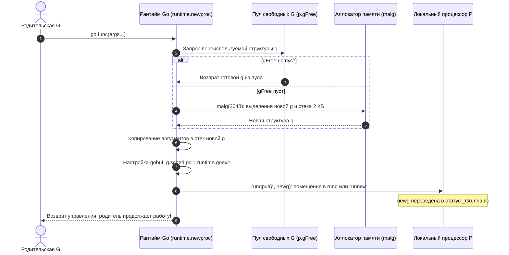
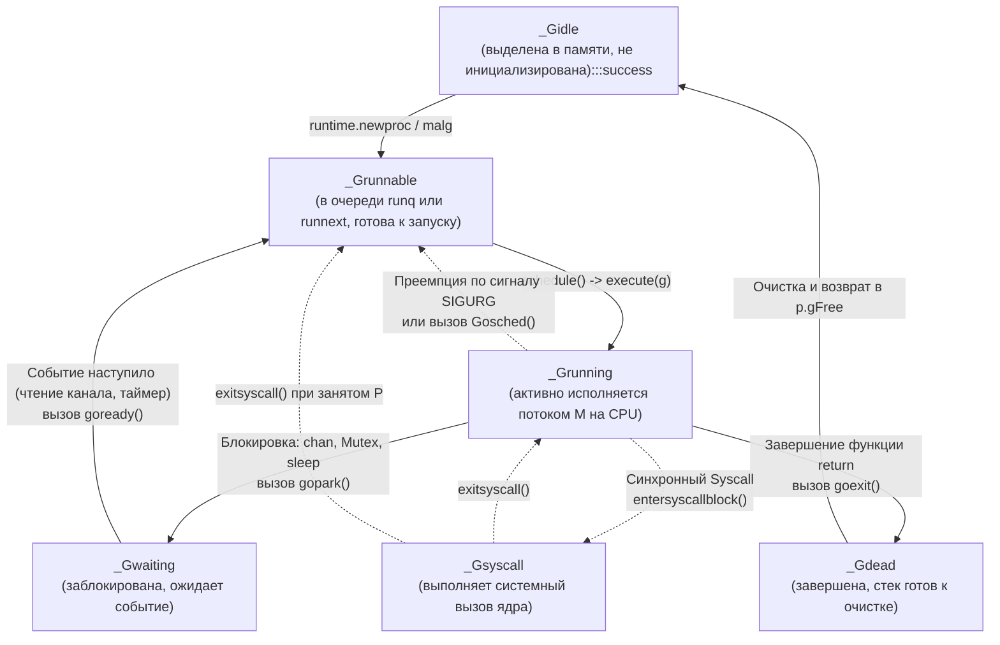
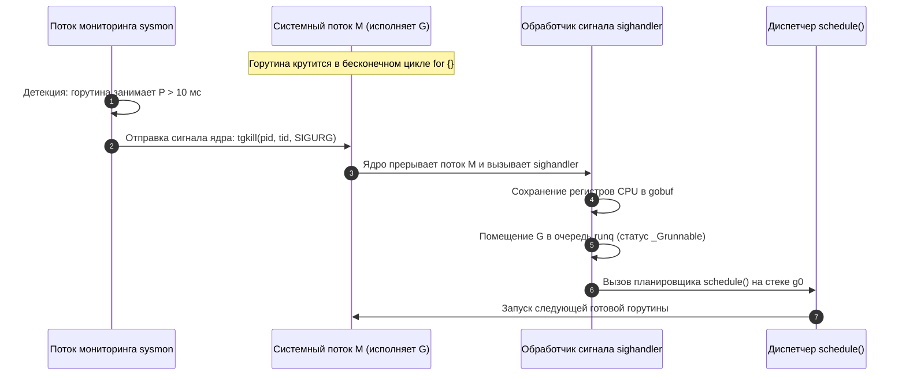

## Как устроена горутина: от старта до завершения

В лекции [[1. Scheduler Go. G-M-P модель]] (или [[1. Scheduler Go. G M P модель]]) мы детально исследовали фундаментальную архитектуру планировщика Go и познакомились с его главной триадой: логическим процессором P, потоком операционной системы M и горутиной G. Мы узнали, что процессор P задает аппаратный лимит параллелизма, а системный поток M выполняет роль неутомимого исполнителя инструкций. Но что представляет собой сама **горутина (G)** на физическом уровне? Как она зарождается из простого синтаксического выражения `go func()`, каким образом устроен и расширяется ее стек, почему переключение между горутинами обходится процессору в считаные наносекунды и почему миллион горутин в памяти Go-сервиса — это обычный рабочий вторник, в то время как миллион потоков ядра Linux немедленно отправил бы операционную систему в нокаут?

Программисты часто называют горутины «легковесными зелеными потоками», но эта аналогия скрывает фундаментальную микроархитектурную суть: горутина — это вообще не поток в понимании операционной системы. У неё нет собственного дескриптора `task_struct` в адресном пространстве ядра, нет выделенной страницы в таблицах MMU, нет прямого прерывания по таймеру APIC. С точки зрения машины горутина — это компактная структура данных в памяти пользовательского пространства, непрерывный фрагмент виртуальной памяти размером всего от 2 КБ под динамический стек и скромный набор сохраненных регистров центрального процессора.

Понимание внутреннего устройства сопрограммы раскрывает истинную механическую симпатию к рантайму: зная точную цену создания `go func()`, физику копирования растущего стека и алгоритмы принудительного вытеснения, senior-инженер проектирует надежные конкурентные архитектуры, исключая скрытые задержки и коварные утечки памяти. В этой лекции мы заглянем в недра горутины: от исходного кода структуры `g` в файле `runtime/runtime2.go` до фаз ее жизненного цикла и микроархитектурного влияния на кэши процессора.

---

## Структура `g`: что внутри горутины

В исходном коде рантайма Go горутина представлена структурой `g`, объявленной в файле `runtime/runtime2.go`. Это один из самых объемных типов данных в рантайме, содержащий более сотни полей. Однако концептуально ее можно разделить на пять логических блоков:

```go
type g struct {
    // 1. Границы динамического стека
    stack       stack   // Структура stack: lo (нижняя граница), hi (верхняя граница)
    stackguard0 uintptr // Маркер границы стека для проверки переполнения и прерываний
    stackguard1 uintptr // Маркер для системного стека g0 при вызовах CGO

    // 2. Сохраненный контекст процессора при переключении
    sched       gobuf   // Регистры CPU: SP, PC, BP, ret, lr, g

    // 3. Управление жизненным циклом и планированием
    atomicstatus atomic.Uint32 // Атомарное состояние: _Gidle, _Grunnable, _Grunning, _Gwaiting, _Gdead
    goid        int64          // Уникальный 64-битный числовой идентификатор горутины
    gopc        uintptr        // Адрес инструкции go, породившей эту горутину (Program Counter)
    startpc     uintptr        // Адрес первой исполняемой инструкции целевой функции
    parent      *g             // Указатель на родительскую горутину (для профилирования и трассировки)

    // 4. Связь с потоками и процессорами
    m           *m             // Системный поток M, исполняющий горутину в данный момент (если _Grunning)
    lockedm     *m             // Привязка к конкретному потоку M при вызове runtime.LockOSThread()
    
    // 5. Очереди ожидания и синхронизация
    waiting     *sudog         // Дескриптор ожидания при блокировке на каналах или мьютексах
    ...
}
```

Разберём ключевые поля этой структуры:
- **`stack`** — описывает непрерывный диапазон адресов виртуальной памяти `[lo, hi]`. Начальный размер стека новой горутины составляет ровно **2 КБ** (константа `_StackMin`).
- **`sched`** — экземпляр структуры `gobuf`, хранящий состояние регистров центрального процессора в момент, когда горутина уступает управление. Именно `g.sched` позволяет планировщику мгновенно замораживать и возобновлять выполнение с точностью до ассемблерной инструкции:
  - `sp` — Stack Pointer (указатель вершины стека, регистр `RSP`);
  - `pc` — Program Counter (`PC`, счетчик команд, регистр `RIP`);
  - `bp` — Base Pointer (базовый указатель текущего стекового фрейма, регистр `RBP` на x86-64);
  - `lr` — Link Register (регистр адреса возврата на архитектурах ARM64);
  - `g` — указатель на саму структуру `g`.
- **`atomicstatus`** — атомарный флаг состояния горутины, с помощью которого планировщик координирует переходы между очередями без дорогих системных блокировок.

> [!info] Под капотом: Ассемблерная магия переключения через gobuf
> `gobuf` — это минималистичный слепок регистров, сохраняемый в поле `g.sched`. Когда планировщик решает запустить задачу, он выполняет вызов ассемблерной процедуры `gogo(g)` (или `gogo`).  
> Процедура `gogo` берет значения из `g.sched` и за десяток инструкций процессора загружает их в физические регистры CPU: восстанавливает указатель стека в регистр `SP`, базовый указатель в `BP`, связывает текущую горутину и выполняет инструкцию косвенного перехода `JMP` по адресу регистра `PC`. Выполнение возобновляется ровно в той точке, где горутина отдала управление. Это чистый Userspace Context Switch: никаких обращений к ядру ОС, никаких таблиц прерываний, никаких сбросов очередей ядра!

---

## Создание горутины: что происходит при `go func()`

Каждый раз, когда в Go-коде встречается ключевое слово `go`:

```go
go processOrder(orderID)
```

компилятор преобразует эту конструкцию в вызов служебной функции рантайма `runtime.newproc` (находится в `runtime/proc.go`).



Пошаговый конвейер инициализации:

1. **Получение структуры `g`:**  
   Рантайм стремится свести аллокации к нулю. Сначала он проверяет локальный список свободных структур текущего логического процессора `p.gFree`. Если в пуле есть свободные объекты `g` (оставшиеся от завершившихся ранее горутин), рантайм мгновенно берет одну из них. Если локальный пул пуст, проверяется глобальный пул `sched.gFree`. И только если свободных структур нет нигде, вызывается внутренняя функция `malg`, которая выделяет память в куче под дескриптор `g` и инициализирует непрерывный стек начальным объемом 2 КБ.
2. **Копирование аргументов и инициализация контекста:**  
   Параметры вызываемой функции копируются напрямую в новый стек горутины.  
   В структуре `gobuf` настраивается точка входа:
   - В поле `g.sched.pc` прописывается адрес функции-обёртки `runtime.goexit` (а точнее, адрес возврата, смещенный относительно точки старта функции). Это гарантирует, что как только пользовательская функция выполнит последний `return`, управление автоматически передастся в `runtime.goexit`, которая корректно демонтирует стек, очистит ресурсы и переведет горутину в статус `_Gdead`.
   - В поле `g.sched.sp` заносится выровненный адрес вершины нового стека.
3. **Регистрация в планировщике:**  
   Статус новой горутины атомарно выставляется в `_Grunnable`. Она помещается либо в высокоприоритетный слот `runnext` текущего процессора `P`, либо в хвост локального кольцевого буфера `runq`. Если локальная очередь переполнена (достигнут лимит в 256 элементов), рантайм выгружает половину очереди в глобальный пул `sched.runq`.
4. **Мгновенный возврат:**  
   Родительская горутина не ждет старта дочерней: вызов `runtime.newproc` завершается за **20–40 наносекунд**, и родительский поток исполнения продолжает свою работу.

> [!tip] Вопрос с собеседования: Стоимость создания горутины
> **Вопрос:** «Сколько времени занимает запуск новой горутины в Go и из каких компонентов складывается эта стоимость?»  
> **Ответ:**  
> Запуск горутины занимает **порядка 20–50 наносекунд** (в сотни раз быстрее создания потока ОС, требующего от 5 до 30 микросекунд).  
> Затраты складываются из:
> 1. Извлечения структуры `g` из пула `p.gFree` (в 95% случаев обходится без аллокации в куче благодаря переиспользованию);
> 2. Копирования аргументов вызова на стек;
> 3. Настройки структуры `gobuf` (запись указателей `SP`, `PC`);
> 4. Атомарного добавления указателя в кольцевой буфер `runq` процессора `P`.  
> Никаких обращений к ядру ОС, создания системных дескрипторов или вызовов `clone(2)` не происходит.

---

## Жизненный цикл: конечный автомат G

Состояние каждой горутины жестко детерминировано и отслеживается планировщиком с помощью атомарного поля `atomicstatus`. Переходы между состояниями образуют строгий конечный автомат:



Разберём ключевые переходы:

- **`_Gidle` $\to$ `_Grunnable`:** Структура `g` инициализирована функцией `newproc`, стек настроен, задача поставлена в очередь `runq` процессора `P`.
- **`_Grunnable` $\to$ `_Grunning`:** Диспетчер `schedule` выбрал задачу, процедура `execute(g)` назначила `m.curg = g` и выполнила ассемблерный прыжок `gogo`, запустив код горутины на процессоре.
- **`_Grunning` $\to$ `_Gwaiting`:** Горутина обратилась к ресурсу, который сейчас недоступен (попытка чтения из пустого канала, ожидание заблокированного `sync.Mutex`, системный таймер `time.Sleep`, ожидание сетевого сокета в netpoller). Рантайм вызывает процедуру `gopark`. Контекст регистров замораживается в `g.sched`, поток `M` освобождается и возвращается в цикл `schedule` для поиска других задач.
- **`_Gwaiting` $\to$ `_Grunnable`:** Ожидаемое событие произошло (другая горутина отправила сообщение в канал, мьютекс освободился, сработал сетевой `epoll`). Сторонняя горутина или netpoller вызывает процедуру `goready`, которая атомарно переводит спящую горутину в состояние `_Grunnable` и возвращает ее в очередь выполнения `runq`.
- **`_Grunning` $\to$ `_Gdead`:** Функция завершила выполнение, достигнув финального `return`. Управление переходит в `runtime.goexit`, которая вызывает деструкторы, открепляет горутину, освобождает избыточную память стека и помещает структуру `g` в пул переиспользования `p.gFree`.

> [!TIP] Диагностика зависших состояний
> Инструмент `/debug/pprof/goroutine?debug=2` позволяет увидеть снимок всех горутин сервиса с их актуальными состояниями.  
> Если в отчете обнаружены тысячи горутин в статусе `_Gwaiting` на операциях с каналами (`chan receive`) — это верный признак утечки горутин (Goroutine Leak). Если же тысячи горутин зависли в статусе `_Grunnable`, но утилизация CPU низкая — это указывает на жесткий Lock Contention или блокировку процессоров системными вызовами.

---

## Стек горутины: непрерывный, растущий, копируемый

Одним из величайших инженерных достижений рантайма Go является архитектура **динамического непрерывного стека (Contiguous Stacks)**.

В большинстве традиционных языков программирования (C, C++, Java) каждому потоку выделяется фиксированный стек огромного размера (от 1 до 8 МБ). Это вынужденная мера: если стек переполнится, произойдет фатальная аппаратная ошибка Stack Overflow (`SIGSEGV`). Но выделение 8 МБ под каждую задачу делает невозможным запуск сотен тысяч потоков: 100 000 потоков по 8 МБ потребовали бы почти терабайт физической памяти!

### Эволюция: от Segmented Stacks к Contiguous Stacks

В версиях Go 1.0–1.2 использовалась модель **сегментированных стеков (Segmented Stacks)**: стек начинался с малого размера (4 КБ), а при исчерпании рантайм выделял отдельный несвязанный фрагмент памяти в куче и соединял их двусвязным списком через указатели.  
У этой схемы обнаружился фатальный архитектурный недостаток — **Hot Split Problem**:
Если вызов функции происходил ровно на границе заполнения стека внутри горячего цикла:

```go
for i := 0; i < 1_000_000; i++ {
    step() // Стек переполняется -> аллокация сегмента в куче!
           // Функция возвращается -> сегмент освобождается!
}
```

на каждой итерации происходила дорогостоящая аллокация и освобождение сегмента памяти в куче, обрушивая производительность в сотни раз.

### Современный подход: непрерывный стек с копированием

Начиная с Go 1.3, рантайм перешел на непрерывные стеки (**Contiguous Stacks**).  
Начальный размер стека горутины составляет всего **2 КБ** (2048 байт). В прологе каждой функции компилятор размещает проверку регистра `stackguard0`. Если текущий фрейм не помещается в оставшееся пространство:

```mermaid
flowchart LR
    classDef process  fill:#1e293b,stroke:#38bdf8,stroke-width:1px,color:#f8fafc
    classDef success  fill:#064e3b,stroke:#34d399,stroke-width:1px,color:#f8fafc
    classDef error    fill:#7f1d1d,stroke:#f87171,stroke-width:1px,color:#f8fafc
    classDef warning  fill:#78350f,stroke:#fbbf24,stroke-width:1px,color:#f8fafc
    classDef entry    fill:#1e3a5f,stroke:#38bdf8,stroke-width:2px,color:#f8fafc
    classDef aux      fill:#334155,stroke:#64748b,stroke-width:1px,color:#f8fafc
    classDef system   fill:#312e81,stroke:#a78bfa,stroke-width:1px,color:#f8fafc
    classDef data     fill:#132d29,stroke:#2dd4bf,stroke-width:1px,color:#f8fafc
    classDef network  fill:#881337,stroke:#fb7185,stroke-width:1px,color:#f8fafc
    classDef accent   fill:#1e1b4b,stroke:#818cf8,stroke-width:1px,color:#f8fafc
    subgraph OldStack ["Старый стек (2 КБ)"]
        F1["Фрейм main()"]
        F2["Фрейм worker()"]
        F3["Фрейм compute() -> ПЕРЕПОЛНЕНИЕ!"]
    end

    subgraph NewStack ["Новый непрерывный стек (4 КБ)"]
        NF1["Фрейм main() (адреса пересчитаны)"]
        NF2["Фрейм worker() (адреса пересчитаны)"]
        NF3["Фрейм compute() (адреса пересчитаны)"]
        Free["Свободное пространство (2 КБ)"]
    end

    OldStack -->|"copystack(): аллокация x2, побайтовое копирование, пересчет указателей через Stack Maps"| NewStack
```



Алгоритм расширения стека (`runtime.copystack`):

1. **Аллокация:** Рантайм выделяет в пуле стеков новый непрерывный блок памяти ровно в **два раза большего размера** ($2 \to 4 \to 8 \to 16 \to \dots$ КБ).
2. **Копирование:** Все данные текущего стека (локальные переменные, стековые фреймы, сохраненные адреса возврата) побайтово копируются в новый блок.
3. **Пересчет указателей (Pointer Adjustment):** Это самая сложная фаза. Если переменная в стеке указывала на другую переменную в том же самом стеке, ее абсолютный виртуальный адрес изменился! Компилятор Go генерирует специальные битовые карты (**Stack Maps**), описывающие, какие ячейки стека содержат указатели. Рантайм обходит стек по этим картам и корректирует все внутренние указатели, прибавляя дельту смещения адресов.
4. **Утилизация:** Старый блок памяти освобождается и возвращается в пул аллокатора.

> [!IMPORTANT] Ограничение максимального размера стека
> Стек горутины не может расти бесконечно. По умолчанию максимальный размер стека на 64-битных системах ограничен **1 ГБ**, а на 32-битных — **250 МБ**.  
> Потолок задается функцией `runtime/debug.SetMaxStack`. Достижение этого предела вызывает фатальную панику `panic`, и рантайм немедленно аварийно завершает программу с сообщением:  
> `fatal error: runtime: goroutine stack exceeds 1000000000-byte limit`.

> [!warning] Ловушка / Gotcha: Рекурсивные вызовы и скрытое копирование стека
> Хотя расширение стека происходит относительно быстро (сотни наносекунд), при частом вызове глубокой рекурсии непрерывное копирование стека ($2 \to 4 \to 8 \to 16$ МБ) создаёт колоссальное давление на шину памяти и сборщик мусора. Кроме того, во время сборки мусора рантайм выполняет обратную операцию — **Stack Shrinking** (сжатие стека вдвое, если используется менее 25% его емкости). Если горутина в цикле то раздувает стек, то сжимает его, вы получите новую вариацию Hot Split Problem. Проектируйте глубокие алгоритмы итеративно или переносите крупные буферы в кучу!

---

## Переключение контекста: что сохраняется и восстанавливается

Переключение контекста между горутинами, выполняющимися на одном логическом процессоре `P` (и одном машинном потоке `M`), осуществляется исключительно силами рантайма через функции `gogo` и `gopark`.

Сравним архитектуру переключения горутин и потоков операционной системы:

| Характеристика | Поток ОС (Linux Kernel Thread) | Горутина Go (Goroutine) |
|---|---|---|
| **Пространство выполнения** | Переход между User Space и Kernel Space (Ring 3 $\leftrightarrow$ Ring 0) | Исключительно User Space (без вызова системных прерываний) |
| **Сохраняемый контекст** | Сотни байт: все регистры общего назначения, флаги CPU, FPU, векторные регистры SSE/AVX | Минимальный набор: **14 регистров общего назначения** в структуре `gobuf` (SP, PC, BP и др.) |
| **Таблицы памяти MMU** | Смена каталога страниц CR3, частичная или полная инвалидация TLB | Адресное пространство общее, регистр CR3 не меняется, TLB сохраняется |
| **Длительность переключения** | **1 000 – 2 500 наносекунд** (тысячи тактов CPU) | **10 – 15 наносекунд** (несколько десятков тактов CPU) |

Благодаря тому, что горутины делят общее виртуальное адресное пространство процесса, аппаратный блок управления памятью (MMU) не замечает переключения: кэш трансляции страниц TLB остается горячим, а конвейер процессора продолжает исполнять код без глубоких сбросов.

---

## Преемпция: как рантайм отбирает управление

Исторически планировщик Go опирался на **кооперативную многозадачность**: горутина добровольно уступала процессор в точках синхронизации (Safe Points):
- вызовы функций (проверка границы стека `morestack`);
- выделение динамической памяти в куче (`mallocgc`);
- системные вызовы ввода-вывода;
- операции синхронизации с каналами и мьютексами (`gopark`).

Однако этот подход порождал критическую проблему: если в коде запускалась горутина с жестким математическим циклом без вызовов функций (например, криптографический расчет или обработка пикселей):

```go
func tightLoop() {
    for {
        // Нет вызовов функций, нет работы с памятью!
    }
}
```

такая задача намертво монополизировала физическое ядро. Логический процессор `P` оказывался заблокирован навсегда: планировщик не мог переключить задачу, а сборщик мусора не мог войти в фазу остановки мира (STW), парализуя весь сервис.

### Сигнальная невытесняющая преемпция (Go 1.14+)

В Go 1.14 инженеры реализовали революционный механизм **асинхронной преемпции на базе системных сигналов**:



- Фоновый служебный поток рантайма `sysmon` (который работает без привязки к `P`) каждые несколько миллисекунд инспектирует состояние всех процессоров.
- Если обнаруживается, что горутина непрерывно выполняется дольше **10 миллисекунд**, `sysmon` отправляет операционной системе команду послать системному потоку `M` сигнал `SIGURG`.
- Ядро Linux прерывает выполнение инструкций потока `M` и вызывает обработчик сигналов Go-рантайма (`runtime.sighandler`).
- Обработчик корректирует адрес возврата так, чтобы горутина принудительно вызвала процедуру `runtime.asyncPreempt`, которая замораживает регистры, возвращает задачу в очередь `runq` и вызывает диспетчер `schedule()`.

> [!tip] Вопрос с собеседования: Бесконечный цикл без вызовов функций
> **Вопрос:** «Что произойдет в современном Go, если запустить горутину с тесным бесконечным циклом `for {}` без аллокаций и вызовов функций?»  
> **Ответ:**  
> До версии Go 1.14 такая горутина намертво захватывала поток M и процессор P, вызывая starvation остальных горутин и зависание сборщика мусора.  
> Начиная с Go 1.14, фоновый поток мониторинга `sysmon`, зафиксировав выполнение дольше 10 мс, пошлет потоку POSIX-сигнал `SIGURG`. Рантайм асинхронно вытеснит горутину, вернет ее в очередь `_Grunnable` и передаст процессор другим задачам. Однако следует помнить, что обработка сигналов ОС создает дополнительную нагрузку на ядро, поэтому намеренно полагаться на асинхронную преемпцию в бизнес-логике не рекомендуется.

---

## Привязка к потоку ОС: LockOSThread

В стандартном режиме работы планировщик Go вправе в любой момент переместить горутину с одного системного потока `M` на другой. Однако в некоторых сценариях требуется строгая гарантия того, что горутина будет всегда выполняться на одном и том же физическом потоке ОС:

1. **Работа с графическими библиотеками:** Интерфейсные фреймворки (OpenGL, macOS Cocoa/Metal) жестко требуют, чтобы любые операции рендеринга выполнялись строго из главного потока процесса (Thread 0).
2. **Интеграция с кодом на C/C++ через CGO:** Си-библиотеки часто хранят состояние в локальной памяти потока (Thread-Local Storage, переменные `__thread` или вызовы `pthread_setspecific`). Если горутина мигрирует на другой поток, она потеряет доступ к своему контексту.
3. **Системные вызовы привязки ядра Linux:** Модификация системных пространств имен через вызов `setns(2)` (например, при конфигурировании сетевых неймспейсов контейнеров в Docker/Kubernetes) применяется исключительно к текущему потоку ядра.

Для решения этих задач стандартный пакет `runtime` предоставляет вызов `runtime.LockOSThread()`:

```go
package main

import (
    "runtime"
)

func init() {
    // Гарантируем, что главная горутина привязана к главному потоку ОС
    runtime.LockOSThread()
}
```

Когда горутина вызывает `runtime.LockOSThread()`:
- Текущий поток `M` жестко привязывается к данной горутине (`m.lockedg = g`, `g.lockedm = m`).
- Никакая другая горутина не сможет запуститься на этом потоке `M`.
- Если привязанная горутина блокируется, поток `M` засыпает вместе с ней и не передается планировщику.
- Освобождение потока выполняется парным вызовом `runtime.UnlockOSThread()`. Если горутина завершится без снятия блокировки, рантайм навсегда уничтожит этот поток `M`, породив взамен новый.

> [!warning] Ловушка / Gotcha: Злоупотребление LockOSThread
> Вызов `LockOSThread` выводит системный поток из пула эффективного мультиплексирования. Если вы вызовете `LockOSThread` внутри тысячи одновременно работающих горутин, рантайм будет вынужден создать тысячу реальных потоков ОС, что мгновенно приведет к исчерпанию лимитов ядра, деградации производительности и перерасходу сотен мегабайт памяти.

---

## Практические выводы и ловушки

> [!warning] Ловушка / Gotcha: Не путайте горутины с потоками
> Миллион горутин — это нормальный, штатный сценарий для Go (суммарный стек в покое займет около 2 ГБ оперативной памяти). Однако миллион системных потоков ОС немедленно уничтожит сервер из-за исчерпания памяти таблиц ядра `task_struct` и перегрузки планировщика ОС.  
> Тем не менее помните: миллион заблокированных горутин, забытых на незакрытых каналах (Goroutine Leak), удерживают в куче свои стеки и все связанные объекты, постепенно приближая катастрофу OOMKilled. Всегда мониторьте объем горутин через эндпоинты `/debug/pprof/goroutine` и `/debug/pprof/goroutine?debug=2`.

> [!warning] Ловушка / Gotcha: Горутины бесплатны, но не совсем
> Хотя создание сопрограммы стоит ничтожные наносекунды, ее активная работа требует аппаратных ресурсов. Каждая активная горутина:
> - конкурирует за кэш-линии процессора L1/L2;
> - расширяет свой стек, вызывая редкие, но ощутимые фазы копирования памяти `copystack`;
> - создает накладные расходы на балансировку планировщика.  
> Если сервис создает 100 000 горутин, непрерывно выполняющих тяжелые вычисления, система потеряет производительность в очередях планировщика.

---

## Mechanical Sympathy: горутины и процессор

С точки зрения кремниевого кристалла процессора горутина — это непрерывный поток инструкций, загружаемый в вычислительный конвейер. Частые переключения между неродственными горутинами на одном ядре вызывают специфические аппаратные эффекты:

1. **Вымывание кэшей L1d и L2 (Cache Eviction):**  
   Стек и локальные структуры одной горутины загружаются в кэш данных L1d (32–48 КБ). Когда планировщик переключает задачу на другую горутину, ее стек вытесняет предыдущие данные. При возврате к первой горутине ядро процессора фиксирует волну промахов кэша (Cache Misses), теряя сотни тактов на подкачку данных из L3 и оперативной памяти.
2. **Сброс истории предсказателя ветвлений (Branch Target Buffer):**  
   Каждая функция имеет собственный уникальный паттерн переходов `if/else`. При частой ротации горутин аппаратный блок предсказания ветвлений процессора (Branch Predictor) не успевает накапливать статистику, что приводит к частым сбросам конвейера (Pipeline Flushes).
3. **Разделение задач по профилю нагрузки:**  
   Для вычислительных (CPU-bound) задач количество одновременно активных горутин не должно существенно превышать аппаратное значение `GOMAXPROCS` (подробнее в лекции [[3. CPU bound vs IO bound задачи]]). Для сетевых же задач (I/O-bound), где горутины большую часть времени спят в очередях netpoller, количество параллельных задач может исчисляться сотнями тысяч без ущерба для кэша процессора.

---

## Итог

Подведём итоги анатомии горутины:

- **Горутина** — это не поток ОС, а легковесная структура `g` в пространстве пользователя, содержащая динамический стек (от 2 КБ), указатели контекста `gobuf` и атомарный статус.
- **Жизненный цикл** управляется конечным автоматом состояний: `_Gidle` $\to$ `_Grunnable` $\to$ `_Grunning` $\to$ `_Gwaiting` $\to$ `_Gdead`.
- Создание горутины через `go func()` занимает **20–50 наносекунд** благодаря пулу переиспользования `p.gFree`.
- Стек горутины является **непрерывным (Contiguous Stack)**: он динамически растет путем удвоения и копирования (`copystack`) с коррекцией указателей по битовым картам компилятора (Stack Maps). Максимальный размер ограничен 1 ГБ (`runtime/debug.SetMaxStack`).
- Переключение контекста в userspace (`gogo`/`gopark`) обходится всего в **10–15 наносекунд**, сохраняя только 14 ключевых регистров CPU без смены таблиц виртуальной памяти.
- Рантайм Go сочетает кооперативные точки переключения (Safe Points) и **асинхронную преемпцию** по сигналу `SIGURG` (начиная с Go 1.14), предотвращающую монополизацию ядер бесконечными циклами.
- Функция `runtime.LockOSThread()` жестко закрепляет горутину за системным потоком ОС для специфических задач (OpenGL, CGO, namespaces).

Разобравшись в том, как горутины рождаются, растут и переключаются, мы готовы перейти к механизму, благодаря которому логические процессоры P идеально распределяют миллионы задач между ядрами — к алгоритму воровства работы. Следующая статья: [[3. Work stealing]].