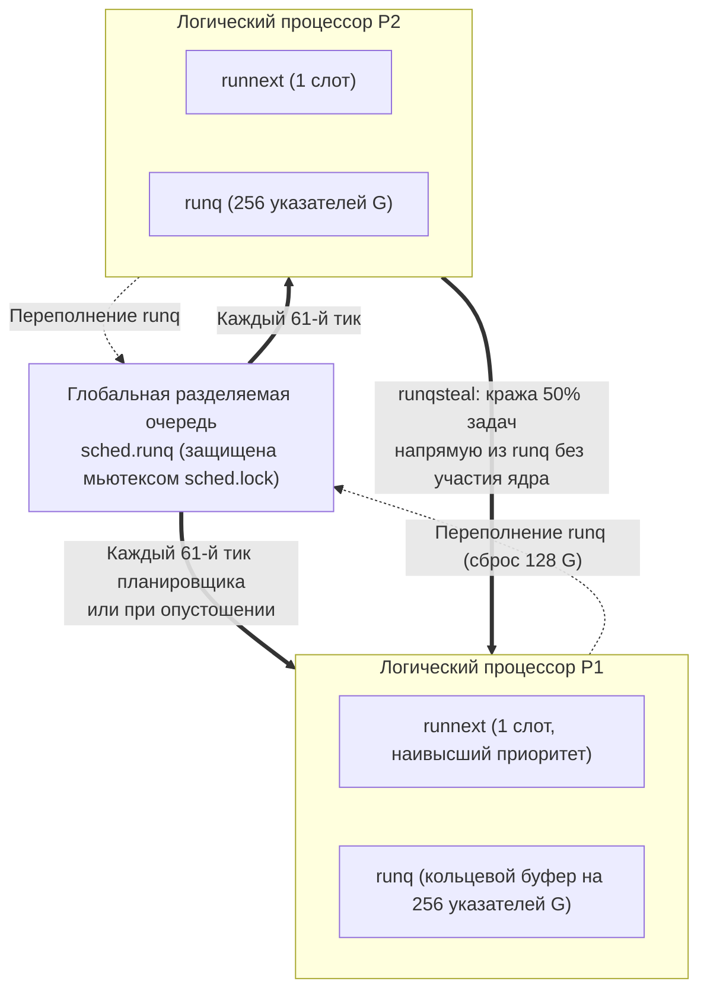
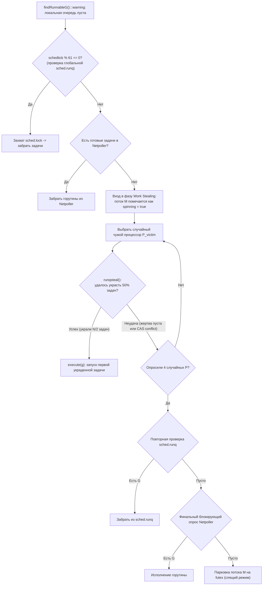
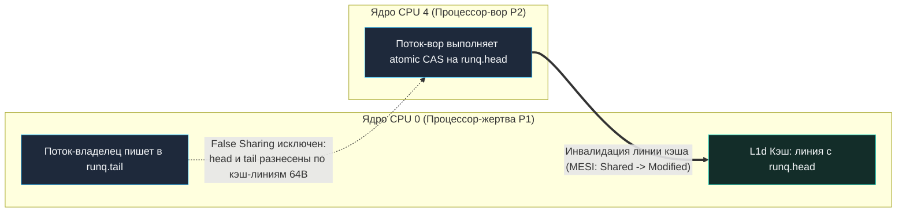

## Work stealing: балансировка нагрузки в планировщике Go

В лекции [[1. Scheduler Go. G-M-P модель]] (или [[1. Scheduler Go. G M P модель]]) мы подробно разобрали фундаментальную триаду рантайма — G, M и P — и выяснили, что каждый логический процессор P управляет собственной локальной очередью готовых задач (`runq`). В лекции [[2. Goroutines под капотом]] мы проследили путь горутины от вызова `go func()` до ее размещения в этой очереди. Но здесь возникает естественный инженерный вопрос: что происходит, когда у одного процессора P локальная очередь ломится от сотен накопившихся задач, в то время как другие процессоры давно выполнили свою работу и вхолостую сжигают такты или уходят в спячку? Как рантайм гарантирует, что все доступные аппаратные ядра сервера равномерно загружены полезной работой?

Ответом на этот вызов служит **Work Stealing** (алгоритм воровства работы). Это децентрализованный, безблокировочный (lock-free) механизм динамической балансировки нагрузки, с помощью которого освободившиеся логические процессоры P на законных основаниях «крадут» готовые к исполнению задачи у своих перегруженных соседей без обращения к единому центральному диспетчеру.

Концепция Work Stealing не уникальна для Go: она лежит в основе таких признанных академических и индустриальных фреймворков, как Cilk (Роберт Блюмоф и Чарльз Лейзерсон), Java ForkJoinPool (Дуг Ли) и Intel Threading Building Blocks (TBB). Однако в рантайме Go этот алгоритм реализован с потрясающим изяществом: он тесно переплетен с асинхронным сетевым поллером (Netpoller), обработкой блокирующих системных вызовов ОС и сигнальной преемпцией.

Понимание физики Work Stealing абсолютно необходимо senior-инженеру: оно позволяет выявлять причины неравномерной утилизации ядер CPU, диагностировать скрытые просадки пропускной способности из-за вымывания процессорных кэшей и оптимизировать топологию конкурентных пайплайнов ([[4. Контекстные переключения]]).

---

## Почему work stealing неизбежен

В идеализированной теоретической модели каждая задача создается на том процессоре, где она будет выполнена, а длительность вычислений абсолютно предсказуема. В суровой реальности высоконагруженных бэкенд-систем царит полная асимметрия:

1. **Неравномерный темп генерации:** Один входящий сетевой запрос (например, массовый импорт или распределенный сбор данных) может на одном конкретном ядре породить сотни дочерних горутин, мгновенно заполнив локальную очередь текущего процессора `P`. В это же время соседние ядра завершили обработку коротких HTTP-запросов и остались без единой задачи.
2. **Асинхронные блокировки:** Горутины постоянно засыпают в ожидании каналов, мьютексов или таймеров, внезапно опустошая очереди своих процессоров.
3. **Изоляция системных вызовов:** Тяжелые файловые операции открепляют системный поток `M` от процессора `P` через механизм `handoffp`. Освободившийся процессор `P` обязан немедленно найти новую работу, чтобы аппаратное ядро не простаивало.

Если бы рантайм Go не имел механизма воровства задач, многоядерный сервер представлял бы собой печальное зрелище: одно процессорное ядро задыхалось бы от перегрузки, порождая дикие задержки p99, в то время как остальные 15 или 31 ядро безмятежно спали в режиме энергосбережения.

---

## Три уровня очередей: где живут горутины

Чтобы досконально понять механику кражи, необходимо ясно представлять трехуровневую иерархию размещения готовых горутин в рантайме Go:



1. **Приоритетный слот `runnext` (емкость: 1 горутина):**  
   Это привилегированная ячейка в структуре `p`. Когда горутина создает новую задачу через `go func()` или разблокирует соседнюю через канал, рантайм помещает ее именно в `runnext`. На следующем шаге диспетчеризации процессор запустит эту горутину вне очереди. Это формирует своеобразный LIFO-паттерн, сохраняя данные задачи в горячем L1/L2 кэше текущего ядра CPU.
2. **Локальная очередь `runq` (емкость: 256 горутин):**  
   Безблокировочный (lock-free) кольцевой буфер фиксированного размера, принадлежащий конкретному процессору `P`. Поскольку 99% операций добавления и извлечения выполняет только локальный поток-владелец `M`, доступ к буферу осуществляется со скоростью обычных обращений к памяти, без тяжелых мьютексов и системных прерываний.
3. **Глобальная очередь `sched.runq`:**  
   Единый связный список задач на весь процесс Go. Она используется как аварийный шлюз: сюда выгружаются излишки при переполнении локальных очередей, а также задачи, пробужденные из сетевого поллера или системных вызовов. Любая операция с глобальной очередью требует захвата тяжелого мьютекса рантайма `sched.lock`.

Компромисс очевиден: если бы все горутины помещались в единую глобальную очередь, возник бы сокрушительный Lock Contention за `sched.lock`. Если бы очереди были строго изолированными, ядра страдали бы от дисбаланса. Work Stealing устраняет оба недостатка.

---

## Алгоритм воровства: кто, когда и как крадёт

Когда логический процессор `P` исчерпывает собственные задачи (и слот `runnext`, и буфер `runq` пусты), связанный с ним поток `M` переключается на системный стек `g0` и входит в процедуру поиска работы — `findRunnableG` (в файле `runtime/proc.go`).



Пошаговая логика поиска задачи:
1. **Проверка слота `runnext` и локального буфера `runq`:** Если есть хоть одна задача — она немедленно исполняется.
2. **Проверка глобальной очереди `sched.runq`:** Периодически (каждый 61-й тик диспетчера `schedule`) рантайм принудительно заглядывает в глобальную очередь, предотвращая застревание задач.
3. **Неблокирующий опрос Netpoller:** Проверяется, не завершились ли сетевые события сокетов (`epoll_wait` с нулевым таймаутом).
4. **Запуск Work Stealing:** Поток `M` переводится в режим спиннинга (`spinning = true`), патрулируя систему. Планировщик генерирует псевдослучайный порядок обхода всех доступных процессоров `P` и пытается совершить кражу.

> [!info] Под капотом: Атомарная механика runqsteal
> Функция воровства `runqsteal` (в файле `runtime/proc.go`) вызывает процедуру `runqgrab`.  
> Локальный кольцевой буфер `runq` имеет указатели `head` (голова, откуда читают задачи) и `tail` (хвост, куда владелец добавляет новые задачи).  
> - Поток-вор считывает текущие значения `head` и `tail` процессора-жертвы.  
> - Вычисляет объем доступных задач: $n = \text{tail} - \text{head}$.  
> - Рассчитывает объем добычи: ровно половина — $k = n - n/2$.  
> - Вор пытается атомарно сдвинуть указатель `head` жертвы на $k$ элементов вперед с помощью процессорной инструкции **CAS (Compare-And-Swap)**.  
> Если инструкция CAS завершилась успешно, вор гарантированно забирает массив указателей на горутины в свой локальный буфер. Владелец процессора-жертвы в это время продолжает беспрепятственно писать новые задачи в `tail`, не испытывая никаких блокировок. Это классический lock-free алгоритм на базе кольцевого буфера.

---

## Почему воруется половина, а не один элемент

Почему рантайм Go крадет ровно **50% очереди**, а не одну горутину и не всю очередь целиком?

За этим решением стоит строгая математическая теория параллельных вычислений (теорема Блюмофа и Лейзерсона):

1. **Если бы вор крал ровно 1 горутину:**  
   Короткоживущая горутина выполнилась бы за несколько микросекунд. Процессор снова оказался бы пустым и был бы вынужден немедленно идти на новый круг воровства. Это вызвало бы непрерывный шторм инструкций CAS, создавая колоссальную нагрузку на шину памяти и контроллер когерентности кэшей.
2. **Если бы вор забирал 100% очереди:**  
   Процессор-жертва, завершив текущую задачу, мгновенно сам оказался бы с пустой очередью и был бы вынужден бежать воровать задачи обратно. Процессоры начали бы «перебрасывать» всю пачку задач туда-сюда, как горячую картошку.
3. **Кража половины ($N/2$):**  
   Это золотое сечение балансировки. За одну-единственную успешную операцию CAS нагрузка между двумя процессорами выравнивается идеально. Математически доказано, что стратегия кражи половины очереди обеспечивает экспоненциальную сходимость баланса очередей при минимально возможном числе межъядерных синхронизаций.

---

## Влияние на локальность кэша: цена миграции

Хотя Work Stealing безупречно решает проблему утилизации процессорных ядер, он порождает неизбежный физический побочный эффект — **миграцию горутин между ядрами CPU (Core Migration)**.

Когда процессор $P_2$ крадет горутину у $P_1$, происходит следующее:
- Горутина создавалась и, возможно, частично исполнялась на ядре CPU 0 (где работал $P_1$). Ее стековый фрейм и оперативные данные находились в локальных кэшах первого уровня L1d (доступ за 1 нс) и L2 ядра CPU 0.
- Вор $P_2$ физически исполняется системным потоком на ядре CPU 4.
- Первое же обращение к полям украденной горутины на ядре CPU 4 порождает волну аппаратных промахов кэша (**L1/L2 Cache Misses**). Ядро вынуждено запрашивать данные через разделяемый кэш третьего уровня L3 (задержка 15–25 нс) или через межъядерную шину interconnect/DRAM (задержка 60–100 нс).

Если горутина является сверхкороткой (например, тривиальная функция на 50 наносекунд), накладные расходы на аппаратную миграцию данных между кэшами ядер могут многократно превысить длительность полезных вычислений!

Как авторы рантайма Go минимизируют эту аппаратную цену?
- **Слот `runnext` неприкосновенен:** Стандартный цикл `runqsteal` крадет задачи из кольцевого буфера `runq`, оставляя приоритетный слот `runnext` жертве. Самая свежая и «горячая» задача гарантированно остается на исходном ядре.
- **Вор крадет задачи из хвоста:** Вор забирает горутины, которые дольше всего пролежали в очереди. Их данные уже остыли в кэше L1 жертвы, поэтому их перенос на другое ядро наносит минимальный микроархитектурный ущерб.

---

## Взаимодействие с другими частями рантайма

Work Stealing не изолирован — он синхронизирует свою работу с другими ключевыми подсистемами Go:

### Netpoller

Горутины, заблокированные в ожидании сетевого ввода-вывода (чтение из сокетов HTTP, gRPC, баз данных), не тратят слоты в очередях `runq`. Они зарегистрированы в дескрипторах ядра ОС через механизмы `epoll`/`kqueue` ([[4. epoll, kqueue и netpoller]]).

Когда сетевой сокет готов к чтению, Netpoller пробуждает горутину. Если локальный процессор занят, она помещается в глобальную очередь `sched.runq`, откуда любой голодающий процессор `P` немедленно забирает ее в ходе алгоритма `findRunnableG`.

### Системные вызовы

Когда горутина входит в блокирующий системный вызов ядра ОС (например, чтение дискового файла через `read`), рантайм открепляет процессор `P` от потока `M` (процедура `entersyscallblock`).  
Процессор `P` подхватывается другим потоком из пула. Если у него остались локальные задачи, он исполняет их. Но если его локальная очередь пуста, он немедленно активирует процедуру `runqsteal` и крадет задачи у соседних процессоров.

### Создание новой горутины

При порождении новой задачи `go func()`:
1. Задача пробует занять привилегированный слот `runnext`.
2. Если `runnext` был занят, старый обитатель слота вытесняется в локальный кольцевой буфер `runq`.
3. Если буфер `runq` полон (все 256 ячеек заняты), рантайм выгружает **ровно половину очереди (128 горутин)** в разделяемую глобальную очередь `sched.runq`. Тем самым перегруженный процессор автоматически делится работой со всеми ядрами системы.

---

## Инструменты для наблюдения за work stealing

### GODEBUG=schedtrace=1000

Запуск сервиса с директивой трассировки планировщика:

```bash
GODEBUG=schedtrace=1000 ./my_backend
```

генерирует ежесекундные снимки баланса очередей в `stderr`:

```text
SCHED 1000ms: gomaxprocs=8 idleprocs=2 threads=15 spinningthreads=1 idlethreads=6 runqueue=32 [15 0 23 8 0 14 0 5]
```

Инженерная расшифровка метрик дисбаланса:
- `idleprocs=2` — два процессора `P` простаивают без задач. Если этот параметр стабильно отличен от нуля при наличии задач в глобальной очереди (`runqueue=32`), в системе возникли трудности с диспетчеризацией или воровством.
- `runqueue=32` — глубина глобальной очереди `sched.runq`. Если это число непрерывно растет, а локальные очереди полупусты, горутины испытывают дефицит свободных потоков `M`.
- `[...]` (в выводе `[15 0 23 8 0 14 0 5]`) — снимок глубин локальных очередей `runq` для каждого из 8 процессоров `P`. Сильный разброс значений свидетельствует о неравномерной нагрузке: у процессоров P1, P4 и P6 очереди опустели (`0`), и именно они в следующую микросекунду активируют воровство задач у перегруженных процессоров P0 (`15`) и P2 (`23`).

### Execution tracer

Утилита `go tool trace` ([[3. execution tracer]]) визуализирует переходы задач между ядрами на наглядном временном графике:

```bash
curl -o trace.out "http://localhost:6060/debug/pprof/trace?seconds=5"
go tool trace trace.out
```

В интерфейсе трассировщика вы увидите горизонтальные дорожки для каждого логического процессора (`Proc 0`, `Proc 1`...). Моменты, когда горутина была создана на `Proc 0`, а затем ее блок выполнения появился на `Proc 3`, маркируются как межъядерная миграция вследствие Work Stealing.

### Профиль горутин

Если приложение демонстрирует аномальное скопление задач в состоянии `_Grunnable` (проверяется через эндпоинт `/debug/pprof/goroutine?debug=2`), это сигнализирует о том, что процессоры заблокированы системными вызовами, а механизм воровства не может распределить задачи из-за исчерпания свободных потоков `M`.

---

## Ловушки и лучшие практики

> [!warning] Ловушка / Gotcha: Чрезмерное использование runtime.LockOSThread
> Вызов `runtime.LockOSThread` жестко цементирует текущую горутину за конкретным системным потоком `M` и его процессором `p`. Если такая горутина засыпает на тяжелом вводе-выводе, процессор оказывается заблокирован. Механизм Work Stealing не может переместить привязанную горутину на другое свободное ядро, что приводит к деградации производительности.

> [!warning] Ловушка / Gotcha: Генерация лавины горутин в одном цикле
> Порождение сотен тысяч короткоживущих горутин в одном тесном цикле `for` на одном ядре:
> ```go
> for _, item := range items { // items = 500_000
>     go handle(item)
> }
> ```
> мгновенно переполняет локальную очередь (256 элементов), вызывая лавинный сброс пачек по 128 задач в глобальную очередь `sched.runq`. Это приводит к жесточайшему Lock Contention за мьютекс `sched.lock`: все остальные процессоры P выстраиваются в очередь к замку, пытаясь достать задачи, вместо полезной работы.  
> **Решение:** Используйте ограниченные пулы воркеров (Worker Pools) или пакетные итераторы.

> [!warning] Ловушка / Gotcha: Иллюзия идеального мгновенного баланса
> Work Stealing — это статистический алгоритм с амортизированной гарантией. В моменты резких спайков входящего трафика (Microbursts) между процессорами неизбежно возникают кратковременные перекосы очередей длительностью в сотни микросекунд. Не проектируйте системы в расчете на мгновенную реакцию: держите запас по процессорным квантам.

---

## Mechanical Sympathy: как воровство взаимодействует с кэшем и шиной

Если взглянуть на алгоритм воровства с точки зрения полупроводникового кристалла процессора, мы увидим непрерывную борьбу за пропускную способность кэш-памяти и системных шин:



1. **Борьба за линию кэша по протоколу MESI:**  
   Когда поток-вор на ядре CPU 4 выполняет инструкцию `LOCK CMPXCHG` (атомарный CAS) над полем `runq.head` процессора-жертвы, аппаратная шина когерентности переводит эту 64-байтовую строку кэша на ядре CPU 4 в состояние `Modified`. На ядре CPU 0 (жертве) эта строка мгновенно помечается как `Invalid`.  
   Если бы инженеры Go расположили `runq.head` и `runq.tail` в одной строке кэша, владелец и вор непрерывно выбивали бы друг у друга кэш-линию (**False Sharing** на уровне самого рантайма!). Чтобы исключить эту катастрофу, структура `p` спроектирована так, чтобы поля чтения и записи были разнесены по разным строкам кэша.
2. **Цена переноса стека (DRAM Latency):**  
   После успешной кражи ядро вора обязано прочитать вершину стека горутины. Если ядро вора находится на другом процессорном сокете (NUMA-узел), данные передаются через межсокетную шину (Intel UPI / AMD Infinity Fabric), отнимая до **100–150 процессорных тактов**.
3. **Инженерный оптимум:**  
   Лучший конкурентный код на Go спроектирован так, чтобы горутины выполняли достаточно плотный объем работы на своем родном ядре, сводя частоту срабатывания `runqsteal` к разумному минимуму.

---

## Итог

- **Work Stealing** — децентрализованный алгоритм динамической балансировки, позволяющий простаивающим процессорам P красть готовые задачи у загруженных соседей без центрального замка.
- Задачи живут в трехуровневой иерархии: приоритетный слот `runnext` (LIFO), локальный кольцевой буфер `runq` (256 элементов, FIFO/LIFO) и глобальная очередь `sched.runq`.
- При опустошении очередей процедура `runqsteal` в файле `runtime/proc.go` атомарно забирает **ровно 50% задач** из очереди случайного процессора-жертвы с помощью lock-free инструкции CAS на `runq.head`.
- Кража половины очереди обеспечивает математически доказанную быструю сходимость балансировки при минимальном числе синхронизаций.
- Аппаратная цена воровства — потеря локальности кэшей L1/L2 и задержка миграции стека между ядрами процессора.
- Для глубокой телеметрии балансировки используются `GODEBUG=schedtrace=1000`, утилита `go tool trace` и срезы `/debug/pprof/goroutine?debug=2`.

Разобравшись с тем, как планировщик перемещает горутины между процессорами, мы подошли к вопросу цены их смены на одном ядре: сколько процессорных тактов стоит переключение контекста и как минимизировать этот оверхед — [[4. Контекстные переключения]].