## Контекстные переключения: цена многозадачности

В предыдущих главах мы заложили прочный теоретический фундамент конкурентности в Go:
- изучили фундаментальную модель G-M-P ([[1. Scheduler Go. G-M-P модель]], [[1. Scheduler Go. G M P модель]]);
- заглянули под капот структуры `g` и динамического стека горутины ([[2. Goroutines под капотом]]);
- разобрали математику децентрализованной балансировки — Work Stealing ([[3. Work stealing]]).

Мы увидели, с какой феноменальной скоростью рантайм Go способен порождать десятки тысяч сопрограмм и раскидывать их по логическим процессорам P. Однако в физическом мире ничто не дается даром. Любая многозадачность несет в себе скрытый налог — **контекстное переключение (Context Switch)**. Каждый раз, когда процессорное ядро отрывается от выполнения текущей функции, чтобы запустить другую, система платит налог: процессорными тактами, вымыванием кэшей и временным простоем конвейера инструкций.

В Go контекстные переключения происходят на **двух принципиально разных уровнях реальности**:
1. **Пользовательский уровень (Userspace Context Switch):** Рантайм Go самостоятельно меняет горутину G на том же самом потоке M, не выходя из пространства пользователя.
2. **Уровень ядра операционной системы (Kernel Context Switch):** Планировщик ядра ОС (например, CFS/EEVDF в Linux) насильно переключает системный поток M на физическом ядре CPU.

Senior-инженер обязан досконально понимать различия между этими уровнями, знать их точную аппаратную стоимость и уметь вовремя диагностировать ситуации, когда система начинает тратить больше энергии на переключение задач, чем на сами вычисления. В этой лекции мы препарируем контекстные переключения на атомарном уровне, научимся измерять их с помощью `pidstat/vmstat`, pprof и execution tracer, а также подготовимся к анализу примитивов синхронизации ([[5. Sync primitives и их стоимость]]).

---

## Два вида контекстных переключений в Go

```mermaid
flowchart TD
    subgraph UserspaceLevel ["1. Userspace переключение горутин (Go Runtime)"]
        G1["Горутина G1 (running)"] -->|"gopark() / yield / SIGURG"| SaveG1["Сохранение 14 регистров в g.sched"]
        SaveG1 --> SchedFind["schedule() -> findRunnableG()"]
        SchedFind --> LoadG2["gogo(g2): загрузка регистров из g.sched"]
        LoadG2 --> G2["Горутина G2 (running)"]
        CostUser["Цена: ~20-100 нс | Без syscall | Без смены CR3/TLB"]
    end

    subgraph KernelLevel ["2. Kernel-level переключение потоков (Linux Kernel)"]
        M1["Поток ОС M1 (Ring 3)"] -->|"Syscall / Interrupt / Timer"| Trap["Переход в Ring 0 (Ядро Linux)"]
        Trap --> SaveM1["Сохранение всех регистров (CPU, FPU, AVX)"]
        SaveM1 --> KernelSched["Планировщик Linux CFS/EEVDF"]
        KernelSched --> MMUSwitch["Смена таблиц памяти CR3 (TLB Flush)"]
        MMUSwitch --> LoadM2["Восстановление контекста потока M2"]
        LoadM2 --> TrapRet["Возврат в Ring 3"]
        CostKernel["Цена: ~1000-5000 нс | Дорогой переход Ring 0/3 | Сброс TLB"]
    end
```



### 1. Переключение между горутинами (userspace context switch)

Это сверхлегковесное переключение, которое планировщик Go выполняет собственными силами внутри пространства пользователя, не беспокоя ядро операционной системы.

Оно происходит в следующих штатных точках:
- **Добровольная уступка процессора:** горутина вызывает `runtime.Gosched()`.
- **Блокировка на ресурсе:** горутина ожидает сообщение из канала, захватывает занятый `sync.Mutex`, засыпает в `time.Sleep` или ждет готовности сокета в сетевом поллере.
- **Завершение работы:** горутина достигает выхода из функции, вызывая процедуру `goexit`.
- **Асинхронная преемпция:** фоновый монитор `sysmon` фиксирует, что горутина выполняется дольше 10 мс, и отправляет сигнал `SIGURG` (Go 1.14+).

Пошаговая механика переключения:
1. Текущая горутина $G_1$ сохраняет свой контекст (минимальный набор регистров: `SP`, `PC`, `BP` и др.) в структуру `g.sched` (дескриптор `gobuf`) — процедура `gopark` или ассемблерный пролог.
2. Поток переключается на системный стек `g0` и вызывает планировщик: `schedule()` $\to$ `findRunnableG()`.
3. Контекст выбранной горутины $G_2$ считывается из ее дескриптора `g.sched` и загружается в физические регистры процессора — ассемблерный вызов `gogo(g2)`.
4. Исполнение продолжается на том же самом потоке `M`, но с другим стеком и новым программным счетчиком.

Это **чистая операция в пространстве пользователя (Userspace)**: нет перехода из Ring 3 в Ring 0, нет дорогостоящих системных вызовов, нет смены адресного пространства MMU и нет аппаратного сброса TLB.

### 2. Переключение потоков ОС (kernel-level context switch)

Это тяжеловесное переключение, выполняемое планировщиком операционной системы. В Go-сервисах оно происходит, когда:
- Поток `M` выполняет блокирующий системный вызов (например, синхронное дисковое чтение файла), застревая в ядре.
- Количество активных потоков `M` превысило число физических ядер CPU, и ядро Linux вынуждено квантовать их время.
- Поток `M` засыпает на системном примитиве futex при ожидании освобождения процессора `P`.
- Срабатывает аппаратный таймер прерывания APIC, и планировщик ядра Linux вытесняет поток по истечении кванта времени.

Переключение системного потока включает:
- Сохранение сотен байт контекста процессора: регистров общего назначения, флагов, служебных регистров, регистров математического сопроцессора (FPU) и широких векторных регистров AVX/AVX-512.
- Переход уровня привилегий процессора из Ring 3 в Ring 0 и обратно.
- Если происходит переключение на поток другого процесса — перезапись регистра управления виртуальной памятью `CR3` (на x86) или `TTBR` (на ARM), что влечет за собой полный или частичный сброс буфера ассоциативной трансляции страниц (**TLB Flush**).
- Работу планировщика ядра Linux ($O(\log N)$ операций по красно-черному дереву потоков).

Сравнение масштаба затрат: **десятки наносекунд** для горутин против **единиц микросекунд** для потоков ядра (разница в 50–100 раз!).

---

## Структура затрат: такты и кэш

Чтобы почувствовать физику процесса, декомпозируем стоимость переключения по процессорным тактам (CPU Cycles) на современном процессоре с частотой 3.0 ГГц (1 такт $\approx$ 0.33 нс):

### Userspace-переключение горутины

- **Сохранение и восстановление регистров `gobuf`:** Всего 10–14 регистров общего назначения. Выполняется ассемблерной процедурой `gogo` за 15–25 тактов CPU (~5–8 нс).
- **Логика диспетчеризации `schedule()`:** Если локальная очередь `runq` не пуста, выбор следующей задачи занимает 30–50 тактов (~10–15 нс).
- **Аппаратный промах кэша данных (Cache Miss):** Стек новой горутины может быть «холодным», особенно если произошел Work Stealing. Первое чтение локальных переменных вызывает промах кэша L1d и L2, требуя подкачки из L3 или оперативной памяти (50–200 тактов, ~15–60 нс).
- **Итого:** в штатных условиях переключение горутины укладывается в **50–200 наносекунд**.

### Kernel-переключение потока

- **Переход Ring 3 $\leftrightarrow$ Ring 0:** Аппаратные инструкции `SYSCALL`/`SYSRET` — около 100–150 тактов (~30–50 нс).
- **Сохранение расширенного контекста:** Дамп сотен байт (включая AVX/SSE) — 150–300 тактов (~50–100 нс).
- **Планировщик ядра ОС (CFS/EEVDF):** Балансировка очередей ядра, расчет виртуального времени выполнения — 500–1500 тактов (~150–500 нс).
- **Сброс TLB и промахи кэша памяти:** Потеря прогретого контекста страниц виртуальной памяти заставляет аппаратный блок MMU выполнять долгие прогулки по таблицам страниц (Page Table Walk). Промахи кэша L1/L2 инструкций и данных добавляют сотни наносекунд.
- **Итого:** переключение потока ОС обходится в **1 000 – 5 000 наносекунд (1–5 мкс)**, а при сильной деградации и конкуренции за кэш — до 10 микросекунд!

---

## Когда переключений становится слишком много

Контекстное переключение — это спасательный круг многозадачности. Но когда частота переключений переходит критическую черту, система сваливается в режим взаимного торможения (**Context Switch Thrashing**):

1. **Прямой налог на CPU (Scheduler Overhead):**  
   Если среднее время полезной работы горутины между блокировками составляет 1 микросекунду, а на переключение уходит 100 наносекунд, ровно 10% всей вычислительной мощности процессора тратится впустую — на служебные процедуры планировщика.
2. **Вымывание процессорных кэшей (Cache Pollution):**  
   Каждая новая горутина приносит свой собственный рабочий набор данных и стековых фреймов. При слишком частой смене задач кэш-память первого уровня L1d (32–48 КБ) превращается в «проходной двор»: полезные данные вытесняются быстрее, чем горутина успевает их прочитать. В результате показатель **IPC (Instructions Per Cycle)** падает с 2.5–3.0 до жалких 0.5–0.8.
3. **Раздувание очередей и хвостовой латентности:**  
   Когда горутин становится на порядки больше, чем доступных процессоров P, они выстраиваются в многотысячные очереди `runq`. Время ожидания в статусе `_Grunnable` (Runnable latency) начинает расти экспоненциально, взвинчивая задержки p99 и p99.9 ([[3. CPU bound vs IO bound задачи]]).
4. **Взрывной рост потоков ядра Linux:**  
   Если горутины массово уходят в блокирующие системные вызовы, рантайм Go, пытаясь спасти пропускную способность, порождает новые потоки `M`. Когда число активных потоков превышает число ядер сервера, в дело вступает планировщик ядра Linux, накрывая сервис лавиной тяжелых kernel-level переключений.

> [!warning] Ловушка / Gotcha: Неограниченный spawn горутин for { go handle() }
> Самая распространенная ошибка начинающих разработчиков — вера в абсолютную «бесплатность» горутин:
> ```go
> for {
>     conn, _ := listener.Accept()
>     go handle(conn) // Неограниченный spawn!
> }
> ```
> При резком спайке трафика (например, 100 000 одновременных соединений) планировщик Go тратит гигантские ресурсы на диспетчеризацию очередей `runq`, а стеки горутин вымывают кэш процессора. Вместо роста пропускной способности сервис встает в ступор: задержки подскакивают с миллисекунд до десятков секунд.  
> **Золотое правило:** Всегда ограничивайте конкурентность с помощью семафоров (`semaphore`) или фиксированных пулов воркеров (Worker Pools).

---

## Измерение контекстных переключений

Инженерный протокол локализации аномалий переключения включает как внутренние инструменты Go, так и системную телеметрию Linux:

### 1. GODEBUG=schedtrace

Запуск процесса с трассировкой планировщика:

```bash
GODEBUG=schedtrace=1000 ./my_service
```

Если метрика `idleprocs` стабильно равна нулю (`idleprocs=0`), а глубина глобальной очереди `runqueue` непрерывно растет, горутины проводят слишком много времени в очередях в ожидании переключения: ядер CPU критически не хватает.

### 2. /debug/pprof/goroutine

Эндпоинт `/debug/pprof/goroutine?debug=2` выдает моментальный срез всех сопрограмм. Если десятки тысяч горутин находятся в статусе `_Grunnable` при 100% загрузке процессора — вы имеете дело с избытком контекстных переключений и дефицитом квантов времени.

### 3. Профилировщик блокировок и мьютексов

Инструменты [[5. block profile]] (`/debug/pprof/block`) и [[6. mutex profile]] (`/debug/pprof/mutex`) показывают, где именно горутины блокируются, отдавая управление через `gopark`. Ликвидация contention на мьютексах автоматически снижает частоту переключений.

### 4. Execution tracer

Утилита `go tool trace` ([[3. execution tracer]]) визуализирует переключения с ювелирной точностью:
- полоса **Goroutines** наглядно показывает, сколько времени задачи проводят в статусе `Runnable` перед стартом;
- подсвечиваются отрезки принудительного вытеснения по преемпции;
- отображаются миграции горутин между процессорами `Proc`, вызванные Work Stealing.

### 5. Системные метрики ОС (Linux)

Для анализа переключений на уровне ядра используются стандартные утилиты Linux:

1. **`vmstat 1` или `sar -w 1`:**  
   Колонка `cs` (Context Switches per second) отражает суммарное число переключений системных потоков ядра в секунду. Если при нагрузке на Go-приложение значение `cs` подскакивает до 100 000 – 300 000 переключений/сек — в сервисе раздулось количество потоков `M`.
2. **`pidstat -w -p <pid> 1`:**  
   Показывает переключения потоков конкретного процесса:
   - `cswch/s` (voluntary context switches) — добровольные переключения, когда поток уступил ядро сам (уснул на futex, ушел в дисковый I/O);
   - `nvcswch/s` (non-voluntary context switches) — принудительные переключения, когда планировщик ядра вытеснил поток по таймеру.

Если при `GOMAXPROCS`, равном числу ядер, утилита `pidstat/vmstat` фиксирует аномально высокое число недобровольных переключений `nvcswch/s`, это признак того, что процесс конкурирует за ядра с другими процессами на сервере или страдает от раздутого пула системных потоков `M`.

---

## Mechanical Sympathy: кэш и TLB при переключениях

С точки зрения кремниевой микроархитектуры центрального процессора контекстное переключение — это тяжелый шок для вычислительного конвейера:


1. **Опустошение L1d и L1i кэшей:**  
   Кэш данных L1d хранит стек предыдущей задачи. Новая горутина начинает работу с «холодного листа»: каждое обращение к локальным переменным требует подкачки строк из L2 или L3. Если же новая горутина исполняет совершенно другой участок бинарного кода, опустошается и кэш инструкций L1i.
2. **Промахи предсказателя переходов (Branch Target Buffer, BTB):**  
   Аппаратный предсказатель ветвлений накапливает статистику переходов `if/else` и таблиц виртуальных вызовов. При резкой смене исполняемой функции предсказатель ошибается (Branch Misprediction), вызывая принудительный сброс конвейера (Pipeline Flush) ценой в 15–20 тактов на каждый промах.
3. **Статус TLB (Translation Lookaside Buffer):**  
   При Userspace-переключении горутин регистр каталога страниц `CR3` не перезаписывается, поэтому буфер трансляции виртуальных адресов TLB сохраняет свою актуальность. Однако при тяжелом Kernel-переключении потоков разных процессов сброс TLB заставляет процессор тратить сотни тактов на повторную трансляцию адресов памяти.

Именно поэтому частые переключения контекста превращают вычислительный (CPU-bound) алгоритм в алгоритм, ограниченный задержками оперативной памяти (Memory-bound).

---

## Стратегии минимизации накладных расходов на переключения

1. **Ограничение параллелизма (Bounded Concurrency):**  
   Откажитесь от неконтролируемого создания сопрограмм `go handle()`. Используйте пулы воркеров или паттерн «семафор» через буферизованный канал:
   ```go
   var sem = make(chan struct{}, maxWorkers) // Ограничитель concurrency
   ```
2. **Балансировка профиля нагрузки (CPU vs I/O):**  
   Для вычислительных задач (CPU-bound) количество параллельно активных горутин должно строго равняться `GOMAXPROCS` ([[3. CPU bound vs IO bound задачи]]). Для сетевого ввода-вывода (I/O-bound) их число может быть значительно выше, поскольку горутины спят в Netpoller, не потребляя процессорных квантов.
3. **Осторожность с `runtime.Gosched()`:**  
   Вызов `runtime.Gosched()` принудительно возвращает горутину в хвост локальной очереди, сбрасывая кэш-линии. Применяйте его только там, где действительно требуется кооперативная уступка процессора.
4. **Минимизация времени удержания `sync.Mutex`:**  
   Чем короче критическая секция под защитой `sync.Mutex`, тем ниже вероятность того, что конкурирующая горутина заблокируется и вызовет `gopark` ([[5. Sync primitives и их стоимость]]).
5. **Отказ от блокирующих системных вызовов в пользу асинхронного I/O:**  
   Используйте сетевой стек Go (на базе Netpoller: `epoll`/`kqueue`). Для дискового I/O в высоконагруженных системах перспективным решением становится архитектура `io_uring`, исключающая блокировку системных потоков ядра.
6. **Адекватная настройка GOMAXPROCS:**  
   Никогда не завышайте `GOMAXPROCS` сверх числа доступных физических ядер хоста: это спровоцирует войну потоков в ядре ОС и лавинообразный рост недобровольных переключений `nvcswch/s`.

---

## Пример: влияние неограниченного spawn'а на переключения

Сравним два подхода к реализации сетевого обработчика при нагрузке 50 000 RPS:

### Без пула (Антипаттерн: Unbounded Spawn)

```go
func handler(w http.ResponseWriter, r *http.Request) {
    go process(r) // Каждый запрос порождает новую горутину!
}
```

- При 50k RPS создается 50 000 горутин в секунду.
- Локальные очереди `runq` мгновенно переполняются, задачи сбрасываются в глобальную очередь `sched.runq`.
- Планировщик тратит колоссальное время на диспетчеризацию, утилита `schedtrace` рапортует о гигантском значении `runqueue`, а кэш процессора вымывается. Задержка p99 взлетает в стратосферу.

### С пулом (Паттерн: Bounded Concurrency Semaphore)

```go
// Семафор на 1000 одновременных задач
var pool = make(chan struct{}, 1000)

func handler(w http.ResponseWriter, r *http.Request) {
    pool <- struct{}{} // Захват слота в семафоре
    go func() {
        defer func() { <-pool }() // Освобождение слота
        process(r)
    }()
}
```

- Количество одновременно существующих задач жестко контролируется.
- Планировщик держит очереди компактными, горутины исполняются на прогретых кэшах, а контекстные переключения предсказуемы и минимальны.

---

## Итог

- В Go существуют два уровня контекстных переключений:
  1. **Userspace** (горутины, смена через `gopark`/`gogo`, стоимость **~50–200 нс**, без системных вызовов ядра);
  2. **Kernel** (системные потоки ядра, смена через планировщик ОС, стоимость **~1–5 мкс**, со сбросом TLB и переходом Ring 0/3).
- Переключение горутины обходится на два порядка дешевле переключения потока ОС, что позволяет Go эффективно масштабироваться на сотни тысяч задач.
- Однако даже userspace-переключения не бесплатны: они вымывают данные из кэшей L1d/L2 и сбрасывают предсказатель ветвлений BTB.
- Избыток переключений диагностируется через `GODEBUG=schedtrace`, утилиту `go tool trace`, дампы `/debug/pprof/goroutine` и системные метрики Linux (`vmstat 1`, `pidstat -w -p <pid> 1`).
- Главные инструменты сдерживания накладных расходов: пулы воркеров, ограничение параллелизма семафорами, минимизация времени удержания `sync.Mutex` и корректная калибровка `GOMAXPROCS`.

Разобравшись в истинной физической цене переключений, мы переходим к анализу первопричины большинства из них — примитивам синхронизации рантайма: [[5. Sync primitives и их стоимость]].