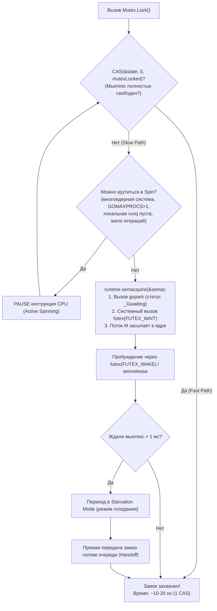
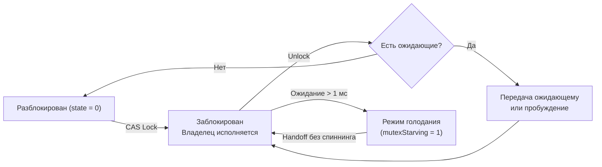
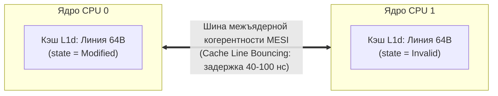

## Сравнительная стоимость примитивов синхронизации в Go

В лекции [[4. Контекстные переключения]] мы детально исследовали физику смены задач и выяснили, что каждое переключение горутины или потока ОС обходится машине в измеримую цену — от десятков наносекунд в пространстве пользователя до единиц и десятков микросекунд при погружении в ядро. Теперь мы переходим к исследованию первопричины большинства контекстных переключений в высоконагруженных системах — к **примитивам синхронизации**. Именно они заставляют горутины притормаживать, уступать процессор, парковаться в системных очередях и бороться за доступ к разделяемым ресурсам.

В распоряжении разработчика на Go находится богатый и выразительный арсенал средств координации: классический взаимный замок `sync.Mutex`, многопоточный `sync.RWMutex`, аппаратные инструкции `sync/atomic`, идиоматичные каналы (`chan`), барьеры ожидания `sync.WaitGroup`, однократная инициализация `sync.Once` и условные переменные `sync.Cond`. В повседневной разработке выбор между ними часто диктуется поверхностной интуицией: «каналы идиоматичнее мьютексов», «RWMutex всегда быстрее обычного Mutex», «atomic вообще бесплатен». 

Однако в реальных распределенных сервисах под предельными нагрузками эти стереотипы разбиваются о суровую физику кремния. Неверно выбранный примитив синхронизации может обернуться скрытым падением пропускной способности на 30–50% и неконтролируемым раздуванием хвостовой задержки p99. Senior-инженер обязан оперировать точными количественными характеристиками каждого инструмента: знать его стоимость на быстром и медленном путях, понимать внутреннее устройство в рантайме Go и ясно представлять, что происходит на уровне кэш-линий процессора и шины межъядерной когерентности MESI ([[5. Mechanical sympathy в backend разработке]]).

Эта лекция дает всесторонний сравнительный анализ всех ключевых примитивов синхронизации, связывая их с моделью планировщика G-M-P ([[1. Scheduler Go. G-M-P модель]], [[1. Scheduler Go. G M P модель]]) и системными вызовами ядра Linux ([[1. Системные вызовы и их стоимость]]). Материал послужит фундаментом для батла «мьютексы против каналов» ([[6. Mutex vs channel]]) и методологии поиска блокировок ([[7. Contention и lock profiling]]).

---

## Mutex: быстрый путь, медленный путь и голодание

Мьютекс `sync.Mutex` — самый распространенный и фундаментальный примитив синхронизации в Go. Его исходное определение в файле `src/sync/mutex.go` выглядит обманчиво минималистичным:

```go
type Mutex struct {
    state int32  // Битовая маска состояния: заблокирован, голодание, число ожидающих
    sema  uint32 // Семафор рантайма для сна и пробуждения горутин через futex
}
```

Несмотря на размер всего в 8 байт, алгоритм работы `sync.Mutex` представляет собой сложнейший адаптивный механизм, разделенный на **быстрый путь (Fast Path)** и **медленный путь (Slow Path)**.



### 1. Быстрый путь (Fast Path)

Если мьютекс свободен и за него нет конкуренции, вызов `sync.Mutex.Lock()` сводится к единственной атомарной инструкции процессора: **Compare-And-Swap (CAS)**. Она атомарно проверяет, равен ли `state` нулю, и выставляет бит `mutexLocked`:

```go
// Внутренняя реализация Fast Path
if atomic.CompareAndSwapInt32(&m.state, 0, mutexLocked) {
    return
}
```

На быстром пути нет ни обращений к планировщику, ни системных вызовов ядра. При отсутствии contention (например, когда `GOMAXPROCS=1` или при низкой конкурентности) мьютекс практически всегда идет по быстрому пути, и стоимость операции составляет всего **10–20 наносекунд** (время выполнения инструкции `LOCK CMPXCHG` на x86).

### 2. Медленный путь (Slow Path)

Если мьютекс уже удерживается другой горутиной, выполнение немедленно переходит в функцию `lockSlow`. Здесь рантайм Go применяет двухфазную стратегию:

1. **Фаза активного спин-ожидания (Active Spinning):**  
   Засыпание горутины в ядре ОС стоит дорого (~1–5 мкс). Поэтому, если блокировка была кратковременной, выгоднее несколько тактов «покрутиться» на процессоре, непрерывно опрашивая статус мьютекса в надежде на скорое освобождение.  
   Однако Go разрешает спиннинг только при строгом соблюдении условий:
   - В системе доступно более одного процессора (`GOMAXPROCS > 1`);
   - Поток `M` удерживает процессор `P`, и его локальная очередь `runq` пуста;
   - Число итераций спиннинга жестко ограничено (не более 4 итераций с процессорной инструкцией `PAUSE` на x86).  
   Если мьютекс освобождается во время спиннинга, горутина мгновенно захватывает его, сэкономив тысячи тактов на переключении контекста.
2. **Фаза пассивного ожидания (Futex Sleep):**  
   Если спиннинг не принес результата, горутина инкрементирует счетчик ожидающих в поле `state` и вызывает процедуру рантайма `runtime.semacquire`. Рантайм переводит горутину в статус `_Gwaiting` через `gopark`, а системный поток ядра `M` уходит в глубокий сон через системный вызов `futex(FUTEX_WAIT)` в Linux.
3. **Фаза освобождения (`Unlock`):**  
   При вызове `Mutex.Unlock` владелец сбрасывает бит `mutexLocked`. Если счетчик ожидающих не равен нулю, вызывается процедура `runtime.semrelease`, которая с помощью системного вызова `futex(FUTEX_WAKE)` пробуждает спящую горутину.

### Режим голодания (starvation mode)

В стандартном («нормальном») режиме освобожденный мьютекс не передается напрямую спящей горутине: проснувшаяся горутина вступает в честную конкуренцию с новыми горутинами, которые только что подошли к `Lock()` на быстром пути. Поскольку новые горутины уже выполняются на ядрах CPU и их данные прогреты в кэше, они почти всегда выигрывают гонку у только что проснувшейся горутины.

Чтобы предотвратить бесконечное откладывание спящих задач, начиная с Go 1.9 был внедрен **режим голодания (starvation mode)**:
- Если проснувшаяся горутина обнаруживает, что она провела в очереди ожидания **дольше 1 миллисекунды**, она принудительно переводит мьютекс в режим голодания (выставляется бит `mutexStarving`).
- В режиме голодания входящие новые горутины лишаются права захватывать мьютекс на быстром пути и крутиться в спиннинге: они принудительно отправляются в хвост очереди ожидания.
- При вызове `Unlock` владелец замка выполняет прямую эстафетную передачу владения (**Handoff**) первой горутине в очереди семафора.
- Мьютекс возвращается в нормальный режим, когда очередь опустеет или время ожидания последней горутины окажется менее 1 мс.

### Состояния Mutex



> [!info] Под капотом: Внутренний runtime.mutex vs sync.Mutex
> Внимательный исследователь исходников Go заметит, что в рантайме существуют два разных типа мьютексов:  
> 1. `sync.Mutex` — публичный тип для прикладного кода с защитой от голодания и поддержкой спиннинга.  
> 2. `runtime.mutex` — низкоуровневый внутренний мьютекс ядра Go, используемый планировщиком (например, `sched.lock`) и сетевым поллером. Метод `runtime.mutex.Lock()` устроен гораздо строже: он не содержит логики честности и режима голодания, минимизируя накладные расходы критических путей рантайма.

---

## RWMutex: читатели и писатели

Тип `sync.RWMutex` реализует классический паттерн Single-Writer / Multiple-Readers. Он позволяет неограниченному количеству читателей одновременно удерживать блокировку на чтение, предоставляя писателю право эксклюзивного доступа.

Внутренняя анатомия `sync.RWMutex` в `src/sync/rwmutex.go`:

```go
type RWMutex struct {
    w           Mutex  // Внутренний Mutex для сериализации писателей
    writerSem   uint32 // Семафор ожидания писателя (ждет завершения читателей)
    readerSem   uint32 // Семафор ожидания читателей (ждут освобождения писателем)
    readerCount atomic.Int32 // Счетчик активных читателей (+ маркер ожидания писателя)
    readerWait  atomic.Int32 // Количество читателей, которые должны выйти перед писателем
}
```

### Механика работы

1. **Захват читателем (`RLock` / `RUnlock`):**  
   Быстрый путь `RLock` тривиален: атомарный инкремент счетчика `readerCount`.  
   Если счетчик положителен (нет активных и ожидающих писателей), читатель мгновенно входит в критическую секцию. Стоимость составляет всего **10–20 наносекунд**.  
   При выходе `RUnlock` атомарно декрементирует `readerCount`.
2. **Захват писателем (`Lock` / `Unlock`):**  
   Писатель сначала захватывает внутренний мьютекс `w`, блокируя конкурирующих писателей.  
   Затем писатель атомарно вычитает из `readerCount` гигантскую константу `rwmutexMaxReaders` ($1 \ll 30 = 1\,073\,741\,824$). С этого момента счетчик становится глубоко отрицательным. Новые читатели, видя отрицательный `readerCount`, немедленно блокируются на семафоре `readerSem`.  
   Если в момент прихода писателя уже были активные читатели (`readerCount > 0`), их количество копируется в `readerWait`, а писатель засыпает на семафоре `writerSem`. Последний выходящий читатель в `RUnlock` обнуляет `readerWait` и пробуждает писателя.

> [!warning] Ловушка / Gotcha: RWMutex не всегда быстрее Mutex
> Распространенное заблуждение: «Если у меня есть чтения, надо ставить RWMutex».  
> В реальности `RWMutex` оправдан **только тогда, когда чтений на порядки больше, чем записей (95%+ чтений), а критические секции относительно длинные (сотни наносекунд или микросекунды)**.  
> Если записи происходят часто или секция тривиальна (например, чтение одного поля за 5 нс), накладные расходы на координацию читателей и писателей делают `RWMutex` в 2–3 раза медленнее обычного `sync.Mutex`!

---

## Atomic: самый дешёвый примитив

Пакет `sync/atomic` предоставляет прямой доступ к аппаратным атомарным инструкциям кремниевого процессора:
- x86-64: инструкции с префиксом шинной блокировки `LOCK ADD`, `LOCK CMPXCHG`, `XCHG`;
- ARM64: эксклюзивные пары инструкций `LDXR`/`STXR` или атомарные расширения Large System Extensions (LSE: `LDADD`, `SWP`, `CAS`).

Операции `sync/atomic` выполняются целиком на уровне контроллера кэш-памяти процессора (Cache Coherence Engine) без захвата программных мьютексов, без обращения к планировщику Go и без парковки горутин:

- **`atomic.Load` (чтение, например `LoadInt64`):** на современных процессорах x86 выровненное 64-битное чтение аппаратно атомарно по умолчанию, стоимость составляет **1–2 наносекунды**.
- **`atomic.Store` (запись, например `StoreInt64`):** атомарная запись со сбросом store-буфера, стоимость **2–5 наносекунд**.
- **`atomic.Add` (инкремент, например `AddInt64`):** операция Read-Modify-Write с аппаратной блокировкой линии кэша, стоимость **5–15 наносекунд**.
- **`CAS` (Compare-And-Swap, например `CompareAndSwapInt64`):** атомарная проверка и замена, стоимость **5–15 наносекунд**.

Начиная с Go 1.19, стандартная библиотека предоставила типобезопасные обёртки: `atomic.Int64`, `atomic.Pointer` и низкоуровневую поддержку моделей упорядочения памяти:
- `memory.OrderRelaxed` — атомарность без гарантий синхронизации других переменных;
- `memory.OrderAcqRel` — семантика Acquire-Release для барьеров публикации;
- `memory.OrderSequentiallyConsistent` — самая строгая последовательная согласованность (используется в Go по умолчанию).

> [!tip] Вопрос с собеседования: Замена Mutex на Atomic
> **Вопрос:** «Можно ли всегда заменять Mutex на atomic при защите числовых счетчиков и балансов?»  
> **Ответ:**  
> Для простых изолированных операций инкремента или декремента (`atomic.AddInt64`) замена не просто допустима, а настоятельно рекомендуется: atomic работает в 2–4 раза быстрее `sync.Mutex` (5–10 нс против 20 нс) и полностью исключает риск парковки горутины в ядре.  
> Однако, если операция является составной (например: «проверить, что баланс > 0, и списать сумму»), атомарного сложения недостаточно: потребуется либо цикл оптимистичной блокировки вокруг `CompareAndSwapInt64`, либо классический `sync.Mutex`, защищающий инвариант критической секции.

---

## Каналы: дороже, чем кажется

Каналы (`chan`) — визитная карточка языка Go, воплощающая философию Тони Хоара: *«Не общайтесь через разделяемую память, разделяйте память через общение»*. Однако с микроархитектурной точки зрения канал — это самый сложный и дорогостоящий примитив синхронизации в языке.

Внутренняя структура канала `hchan` (объявленная в `runtime/chan.go`) включает:

```go
type hchan struct {
    qcount   uint           // Количество элементов в буфере в данный момент
    dataqsiz uint           // Емкость кольцевого буфера
    buf      unsafe.Pointer // Указатель на непрерывный кольцевой буфер в куче
    elemsize uint16         // Размер одного элемента в байтах
    closed   uint32         // Флаг закрытия канала
    sendx    uint           // Индекс кольцевого буфера для записи
    recvx    uint           // Индекс кольцевого буфера для чтения
    recvq    waitq          // Очередь заблокированных горутин-читателей (список sudog)
    sendq    waitq          // Очередь заблокированных горутин-писателей (список sudog)
    lock     mutex          // Внутренний мьютекс, защищающий структуру hchan!
}
```

Каждая отправка (`ch <- x`) или прием (`<-ch`) данных через канал обязана:
1. Захватить внутренний замок `hchan.lock` (низкоуровневый `runtime.mutex`).
2. Проверить состояние очередей `sendq` и `recvq`.
3. При наличии прямого рандеву (небуферизованный канал со спящим партнером) — выполнить прямое копирование памяти из стека отправителя в стек получателя (**Zero-buffer memory copy**) и пробудить партнера через `goready`.
4. При наличии свободного места в буфере — скопировать данные в кольцевой буфер `buf`.
5. При невозможности операции — аллоцировать или извлечь дескриптор ожидания `sudog`, привязать текущую горутину к очереди `sendq`/`recvq`, отпустить замок `hchan.lock` и уснуть в `gopark`.

### Аппаратная стоимость каналов

- **Небуферизованный канал (Rendezvous):** успешная передача требует захвата блокировки, координации двух горутин и вызова планировщика. Стоимость: **100–300 наносекунд**.
- **Буферизованный канал (Buffered, без блокировки):** доступ к кольцевому буферу под защитой `hchan.lock`. Стоимость: **50–150 наносекунд**.
- **Блокирующий канал (Wait/Sleep):** парковка горутины, переключение контекста и последующее пробуждение. Стоимость: **от 1 до 100+ микросекунд**.

Вывод: канал в 3–10 раз дороже обычного `sync.Mutex` даже на быстром пути! Никогда не используйте каналы для тривиальной защиты внутренних полей структур от гонок данных. Каналы созданы для передачи владения данными и оркестрации потоков управления, а не для синхронизации доступа к разделяемым переменным.

---

## WaitGroup, Once, Cond: специализированные примитивы

### sync.WaitGroup

`sync.WaitGroup` координирует завершение группы параллельных горутин. Под капотом она содержит атомарный 64-битный счетчик (объединяющий число ожидаемых задач и число спящих горутин) и семафор:
- Методы `Add` и `Done`: быстрый атомарный инкремент/декремент счетчика (стоимость `WaitGroup.Done` — **~10 наносекунд**).
- Метод `Wait`: если счетчик равен нулю, возврат мгновенен; если счетчик положителен — вызов `WaitGroup.Wait` паркует горутину на внутреннем семафоре рантайма.

### sync.Once

`sync.Once` гарантирует, что инициализирующая функция выполнится строго один раз за все время жизни процесса:
- Внутри содержит флаг `atomic.Uint32` и `sync.Mutex`.
- Быстрый путь вызова `Once.Do`: после того как инициализация завершена, последующие миллионы вызовов выполняют лишь одно атомарное чтение флага с семантикой Acquire, что обходится всего в **~2 наносекунды**!

### sync.Cond

`sync.Cond` реализует условную переменную (Condition Variable), позволяя горутинам ждать наступления сложного составного события:
- Работает исключительно в связке с переданным `sync.Locker` (обычно `sync.Mutex`).
- Метод `Wait` атомарно отпускает мьютекс и усыпляет горутину в очереди ожидания `sync.Cond`.
- Методы `Signal` (пробуждение одной горутины) и `Broadcast` (широковещательное пробуждение всех горутин) выводят ожидающие задачи из спячки.

---

## Сравнительная таблица стоимости

Сводные результаты измерений аппаратной стоимости примитивов на процессоре x86-64 с частотой 3.0 ГГц при отсутствии конкуренции (Uncontended Fast Path) и в условиях конфликта (Contention Slow Path):

| Операция синхронизации | Стоимость (Fast Path) | Поведение и цена при Contention (Slow Path) |
|---|:---:|---|
| `atomic.Load` (чтение) | **1–2 нс** | Аппаратная когерентность: ~5–10 нс (без блокировок) |
| `atomic.Store` (запись) | **2–5 нс** | Инвалидация кэш-линий MESI: ~10–20 нс |
| `atomic.Add` / `CAS` | **5–15 нс** | Spin-цикл CAS: ~15–50 нс |
| `Mutex.Lock` (uncontended) | **10–20 нс** | Спиннинг $\to$ `futex(FUTEX_WAIT)` $\to$ парковка: **1–10+ мкс** |
| `Mutex.Unlock` | **5–10 нс** | Пробуждение через `futex(FUTEX_WAKE)`: **1–5 мкс** |
| `RWMutex.RLock` (uncontended) | **10–20 нс** | При наличии ожидающего писателя: парковка **1–10 мкс** |
| `RWMutex.RUnlock` | **5–10 нс** | Пробуждение писателя на семафоре `writerSem` |
| `Channel (buffered, no wait)` | **50–150 нс** | Ожидание замка `hchan.lock`, блокировка буфера: **1–100 мкс** |
| `Channel (unbuffered rendezvous)`| **100–300 нс** | Прямое рандеву, координация двух горутин |
| `WaitGroup.Done` | **~10 нс** | Атомарный декремент, пробуждение `Wait` |
| `WaitGroup.Wait` (waits) | мгновенно (если 0) | Парковка горутины на семафоре: **1–10 мкс** |
| `Once.Do` (cached) | **~2 нс** | Первый вызов: захват `sync.Mutex` + исполнение функции |

> [!info] Под капотом: Факторы реальной производительности
> Приведенные наносекунды отражают порядок величин. В реальной производственной среде итоговая стоимость определяется не количеством инструкций в ассемблерном листинге, а тремя внешними физическими факторами:  
> 1. Уровнем конкуренции ядер за общую кэш-линию (**Cache line bouncing**);  
> 2. Частотой сброса очередей планировщика Go;  
> 3. Количеством системных вызовов к ядру Linux.

---

## Инструменты измерения стоимости синхронизации

Senior-инженер никогда не полагается на догадки — он измеряет задержки примитивов объективными инструментами профилирования:

### Mutex profile

Профилировщик мьютексов измеряет время, которое горутины проводят в ожидании освобождения замков `sync.Mutex` и `sync.RWMutex`:
- Запуск тестов: `go test -mutexprofile=mutex.out`
- В боевом приложении: подключение эндпоинта `/debug/pprof/mutex` после активации сбора сэмплирования через `runtime.SetMutexProfileFraction(1)`. Детальный разбор представлен в лекции [[6. mutex profile]].

### Block profile

Профилировщик блокировок отслеживает задержки, возникающие при ожидании каналов, мьютексов, таймеров и системных вызовов:
- Запуск тестов: `go test -blockprofile=block.out`
- В боевом коде: эндпоинт `/debug/pprof/block` с включением сбора через `runtime.SetBlockProfileRate(1)`. Детальный разбор в лекции [[5. block profile]].

### Execution tracer

Утилита `go tool trace` визуализирует блокировки на временной шкале: вы можете увидеть, какие именно горутины выстроились в очередь к замку и как долго поток простаивал в ожидании пробуждения.

### Бенчмарки

Написание точных микробенчмарков пакета `testing` с флагами детального замера памяти и многократных прогонов:

```bash
go test -bench=. -benchmem -count=10
```

позволяет с абсолютной достоверностью сравнить производительность `sync.Mutex` против `sync/atomic` в вашем конкретном сценарии.

---

## Mechanical Sympathy: как синхронизация влияет на процессор и кэш

Чтобы по-настоящему понять, почему конкурирующий код начинает тормозить, нужно спуститься на уровень кремния:



1. **Биение кэш-линий (Cache Line Bouncing):**  
   Поле `state` мьютекса или переменная `atomic.Int64` физически занимают несколько байт внутри 64-байтовой строки кэша (Cache Line). По протоколу когерентности MESI ядро CPU обязано получить эксклюзивный статус `Modified`, чтобы выполнить операцию `LOCK CMPXCHG`. При высокой конкуренции 16 или 32 ядра процессора начинают непрерывно отбирать эту строку кэша друг у друга. Строка мечется между кэшами L1d разных ядер через межъядерный интерконнект, увеличивая время доступа к памяти с 1 нс до 60–100 нс на каждую операцию! Если рядом с мьютексом лежат полезные данные структуры, возникает катастрофическое явление **False Sharing** ([[8. False sharing]]).
2. **Аппаратные барьеры памяти (Memory Barriers):**  
   Атомарные инструкции и захват мьютексов вызывают остановку спекулятивного исполнения команд на конвейере CPU и принудительно сбрасывают буфер отложенной записи (Store Buffer) в L1-кэш, чтобы гарантировать упорядоченность доступа к памяти. Это замораживает конвейер инструкций процессора на десятки тактов.
3. **Нагрузка на планировщик ядра Linux:**  
   Массовые блокировки приводят к шторму системных вызовов `futex(FUTEX_WAIT)` и `futex(FUTEX_WAKE)`, вынуждая ядро Linux тратить ресурсы на переключение контекста системных потоков.

---

## Когда какой примитив выбирать

Сформулируем золотые правила архитектурного выбора инструментов синхронизации:

- **Используйте `sync/atomic`:** для изолированных числовых счетчиков, флагов состояния, указателей конфигурации (`atomic.Pointer`) и оптимистичных lock-free циклов. Это самый быстрый примитив, не нагружающий планировщик.
- **Используйте `sync.Mutex`:** для защиты критических секций, состоящих из нескольких полей, обновления коллекций (мапы, слайсы), а также при времени удержания замка более 20–50 наносекунд. Мьютекс прост, безопасен и высокоэффективен.
- **Используйте `sync.RWMutex`:** исключительно в структурах с редкими записями (< 5%) и преобладающим чтением (> 95%), при условии, что операции чтения длятся сотни наносекунд.
- **Используйте каналы (`chan`):** для передачи владения данными между горутинами, реализации конвейеров (Pipelines), диспетчеризации событий и ограничения параллелизма (семафоры). Не используйте каналы взамен обычного `sync.Mutex`.
- **Используйте `sync.WaitGroup`:** для ожидания завершения параллельных батчей горутин.
- **Используйте `sync.Once`:** для ленивой потокобезопасной инициализации глобальных ресурсов (клиенты БД, синглтоны).

---

## Итог

- Стоимость примитивов синхронизации в Go варьируется от **1 наносекунды** (атомарное чтение) до **десятков микросекунд** при глубоком конфликте за ресурсы (Contention).
- `sync.Mutex` идеален для общего применения: на быстром пути он стоит **10–20 нс** (1 атомарный CAS), на медленном — задействует активный спиннинг и засыпает на `futex(FUTEX_WAIT)`. Режим голодания защищает долго ожидающие горутины от starvation.
- `sync.RWMutex` обеспечивает параллельное чтение, но на частых записях уступает обычному мьютексу из-за накладных расходов на координацию читателей.
- `sync/atomic` оперирует на уровне инструкций кремниевого процессора, являясь самым дешевым инструментом синхронизации простых типов.
- Каналы (`chan`) — высокоуровневый архитектурный примитив оркестрации. Из-за внутреннего замка `hchan.lock` и копирования буферов они значительно дороже мьютексов.
- На аппаратном уровне конкуренция за синхронизацию проявляется в виде биения кэш-линий (Cache Line Bouncing), вымывания store-буферов и системных вызовов futex.
- Для выявления узких мест синхронизации применяются `mutex profile`, `block profile`, трассировка `go tool trace` и бенчмарки с ключом `-benchmem -count=10`.

Теперь, овладев точными метриками стоимости примитивов, мы готовы разрешить главный философский и практический спор сообщества Go — лоб в лоб столкнуть мьютексы и каналы в лекции [[6. Mutex vs channel]].