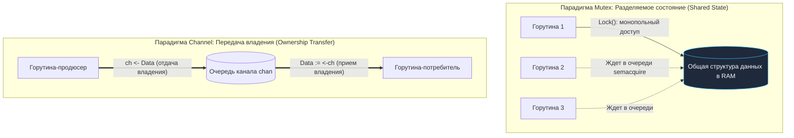
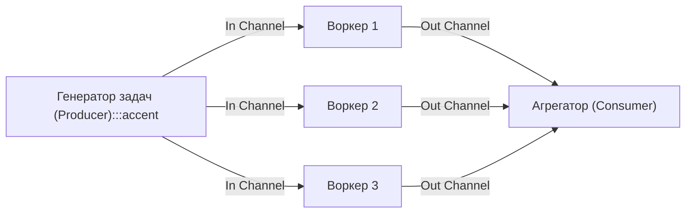

## Mutex vs Channel: выбор, определяющий архитектуру

В лекции [[5. Sync primitives и их стоимость]] мы провели строгий количественный замер стоимости примитивов синхронизации: от субнаносекундных атомарных операций до относительно тяжелых очередей каналов. Однако чистая производительность — лишь одна сторона медали. **Mutex** и **Channel** представляют собой две принципиально разные инженерные философии конкурентного взаимодействия в языке Go.

Широко известная максима создателей языка, сформулированная Робом Пайком, гласит:

> _Do not communicate by sharing memory; instead, share memory by communicating._  
> («Не общайтесь через разделяемую память; вместо этого разделяйте память через общение».)

На заре освоения языка начинающие разработчики часто возводят этот лозунг в статус непререкаемой догмы: пытаются заменить абсолютно все мьютексы каналами, строят громоздкие акторные горутины вокруг тривиальных счетчиков и получают падение пропускной способности в 5–10 раз вместе со скрытыми утечками горутин.

Опытный senior-инженер понимает: эта цитата — архитектурный ориентир для проектирования потоков данных, а не запрет на использование классической синхронизации. Мьютексы зачастую обеспечивают на порядок более высокую скорость работы, в то время как каналы привносят в код стройность, устраняют гонки за владение объектами и элегантно оркеструют асинхронные события. Выбор между ними — это фундаментальный компромисс между семантикой владения, вычислительной сложностью и микроархитектурными накладными расходами процессора ([[5. Mechanical sympathy в backend разработке]]).

Цель этой лекции — дать строгие математические и практические критерии выбора, разобрать внутреннюю механику работы обоих инструментов, рассмотреть типичные производственные паттерны и антипаттерны, а также научиться диагностировать неверные решения с помощью планировщика ([[1. Scheduler Go. G-M-P модель]], [[1. Scheduler Go. G M P модель]]), анализа переключений контекста ([[4. Контекстные переключения]]) и профилирования блокировок ([[7. Contention и lock profiling]]).

---

## Два мира: общее состояние против передачи владения



### Mutex: разделяемая память с эксклюзивным доступом

Мьютекс (`sync.Mutex`) защищает **критическую секцию** — замкнутый фрагмент исполняемого кода, в котором горутина временно получает монопольное право читать и модифицировать разделяемые переменные. Все параллельные горутины обращаются к _одним и тем же ячейкам памяти_, но строго по очереди.

Ментальная модель мьютекса: «Мы все живем в одной квартире с общей кухней, на двери которой висит замок. Пока я готовлю у плиты, никто другой не может войти; закончив, я открываю замок и отдаю ключ следующему».

```go
var (
    cache = make(map[string]string)
    mu    sync.Mutex
)

func Put(k, v string) {
    mu.Lock()
    cache[k] = v // Эксклюзивное владение общей памятью
    mu.Unlock()
}
```

Ключевой нюанс: **мьютекс не защищает сами данные — он защищает лишь критическую секцию кода**. Компилятор Go не бьет разработчика по рукам, если другая горутина обратится к переменной `cache` напрямую, минуя `mu.Lock()`. Корректность разделяемой памяти целиком и полностью держится на строгой дисциплине инженера.

### Channel: передача данных с передачей владения

Канал (`chan`) передает **значения** от одной горутины к другой по модели очередей сообщений (Message Passing). Здесь реализуется парадигма CSP (Communicating Sequential Processes) Тони Хоара: отправитель формирует данные, помещает их в канал и в этот самый момент **теряет право на их изменение**. Получатель извлекает данные из канала и становится их единственным законным владельцем.

Ментальная модель канала: «Я упаковал посылку, запечатал коробку и опустил ее в почтовый ящик. Теперь посылка мне не принадлежит — ею будет распоряжаться адресат, который достанет ее из ящика».

```go
func producer(ch chan<- string) {
    data := "payload"
    ch <- data // Владение передано!
    // Продюсер больше не трогает переменную data
}

func consumer(ch <-chan string) {
    data := <-ch // Получено полное эксклюзивное владение
    fmt.Println(data)
}
```

Канал в явном виде устраняет необходимость в ручной синхронизации, поскольку в любой момент времени с данными работает строго одна горутина. Однако, если по каналу пересылается указатель (например, `*SomeStruct`) или слайс, и отправитель продолжает модифицировать объект после отправки, возникает неявная и крайне опасная гонка данных (Data Race).

---

## Внутреннее устройство Mutex и Channel: цена быстрого пути и блокировки

В лекции [[5. Sync primitives и их стоимость]] мы исследовали их устройство под микроскопом. Сопоставим их ключевые механизмы:

### Mutex (`sync.Mutex`):
- **Быстрый путь (Fast Path):** Единственная инструкция процессора `LOCK CMPXCHG` (атомарный CAS над 32-битным полем `state`). При отсутствии конкуренции операция завершается за **10–20 наносекунд** без обращения к планировщику рантайма.
- **Медленный путь (Slow Path):** Кратковременный активный спиннинг (Active Spinning) на процессоре с инструкцией `PAUSE`. Если замок не освободился — уход в глубокий сон через процедуру `runtime.semacquire` $\to$ системный вызов ядра `futex(FUTEX_WAIT)` (в Linux).
- **Пробуждение:** При вызове метода `Unlock()` владелец сбрасывает флаг блокировки и вызывает процедуру `runtime.semrelease` $\to$ `futex(FUTEX_WAKE)`, возвращая спящую горутину в очередь планировщика `_Grunnable`.

### Channel (`hchan` из `runtime/chan.go`):
- **Внутренний замок:** Структура `hchan` сама по себе защищена внутренним низкоуровневым мьютексом `lock` (`runtime.mutex`).
- **Сложная логика буфера:** Канал управляет кольцевым массивом в куче (`buf`), индексами чтения и записи (`sendx`, `recvx`), а также двусвязными списками заблокированных горутин (`sendq` и `recvq`).
- **Прямое копирование стека:** При небуферизованном рандеву рантайм Go выполняет прямое копирование байт из стека отправителя в стек получателя в обход буфера кучи.
- **Блокировка:** Если буфер полон или пуст, горутина формирует дескриптор ожидания `sudog`, ставит себя в очередь `sendq`/`recvq`, отпускает внутренний замок `hchan.lock` и засыпает в `gopark`.

> [!IMPORTANT] Фундаментальный факт производительности
> **Канал на быстром пути всегда существенно дороже обычного Mutex**. Внутри каждого канала уже встроен собственный мьютекс, к стоимости которого добавляются проверки переполнения буфера, манипуляции с указателями и копирование памяти.

---

## Сравнение стоимости: когда цена имеет значение

| Сценарий использования | sync.Mutex | Буферизованный канал (Buffered) | Небуферизованный канал (Unbuffered) |
|---|:---:|:---:|:---:|
| **Операция без ожидания (Fast Path)** | **10–20 нс** | **50–150 нс** | **100–300 нс** |
| **Операция с блокировкой (Slow Path)** | **1–10 мкс** (futex + gopark) | **1–100 мкс** | **1–100 мкс** |
| **Накладные расходы памяти** | **8 байт** (встраивается в struct) | **~96 байт + размер буфера в куче** | **~96 байт** в куче |

Если критическая операция выполняется за считаные наносекунды (например, обновление счетчика или получение элемента из мапы), `sync.Mutex` опережает каналы на порядок величины.

Однако при длительном ожидании (сотни микросекунд или миллисекунды) накладные расходы самого примитива нивелируются длительностью ожидания. В этом случае каналы раскрывают свою истинную мощь: они предоставляют выразительный декларативный синтаксис оркестрации и органично интегрируются с мультиплексором `select`.

> [!tip] Вопрос с собеседования: Канал для защиты счетчика
> **Вопрос:** «Почему реализация потокобезопасного счетчика через канал (например, передача `int` по кругу) работает в разы медленнее, чем через `sync.Mutex` или `sync/atomic`?»  
> **Ответ:**  
> Каждая отправка и прием из канала требует захвата внутреннего замка `hchan.lock`, проверки состояния очередей `sendq`/`recvq`, перемещения данных и вызова процедур рантайма `runtime.chansend`/`runtime.chanrecv`. Для тривиального инкремента 64-битного числа это чудовищный оверхед. `sync/atomic` выполняет операцию за 5–10 нс на уровне регистров CPU, а `sync.Mutex` — за 10–20 нс через 1 CAS, в то время как канал тратит от 150 до 300 нс на каждую операцию.

---

## Когда выбирать Mutex

Применяйте `sync.Mutex` (или `sync.RWMutex`), когда ваша архитектурная задача относится к следующим категориям:

### 1. Защита разделяемого состояния (кэш, конфигурация, счётчики)
Любые внутренние in-memory структуры данных, к которым требуется высокоскоростной параллельный доступ: хэш-таблицы (`map`), срезы, деревья, LRU-кэши, локальные метрики. Здесь данные не путешествуют между горутинами — они статично лежат в памяти, а горутины приходят к ним для быстрого чтения или обновления.

### 2. Критические секции, длящиеся наносекунды
Если логика внутри замка укладывается в несколько ассемблерных инструкций (присваивание поля, чтение указателя, инкремент), мьютекс обеспечит максимальный throughput системы, не создавая мусора в куче и лишних накладных расходов.

### 3. Сложные инварианты, требующие атомарности нескольких операций
Мьютекс незаменим при реализации паттерна **Check-Then-Act**:
```go
mu.Lock()
if user.Balance >= amount {
    user.Balance -= amount
    user.OrdersCount++
}
mu.Unlock()
```
Мьютекс железно гарантирует, что между проверкой условия и списанием баланса ни одна сторонняя горутина не сможет вклиниться и нарушить бизнес-инвариант. Попытка реализовать аналогичную логику через каналы потребует громоздких схем с пересылкой структур состояния туда и обратно.

### 4. Высококонкурентное чтение с редкой записью (RWMutex)
Когда тысячи горутин непрерывно читают разделяемые данные (например, глобальную конфигурацию микросервиса), а обновления происходят раз в несколько минут, `sync.RWMutex` позволяет читателям исполняться абсолютно параллельно на всех ядрах без взаимных блокировок. Каналы не поддерживают паттерн параллельного чтения одних и тех же данных несколькими подписчиками без дублирования сообщений.

---

## Когда выбирать Channel

Применяйте каналы (`chan`), когда решаются задачи координации, диспетчеризации и передачи ответственности:

### 1. Передача данных между горутинами с передачей владения
Классические конвейеры обработки данных (Data Pipelines), где каждый этап выполняется отдельным пулом воркеров. Продюсер парсит сетевой поток, отправляет чанк в канал; воркер забирает его, валидирует и отправляет дальше. Канал выступает одновременно транспортной магистралью и буфером сглаживания нагрузки (Backpressure).

### 2. Координация и сигнализация (done, cancel)
Широковещательное оповещение о завершении работы. Закрытие канала `close(ch)` — это уникальная операция рантайма Go: все горутины, заблокированные на чтении `<-ch`, мгновенно разблокируются и получают нулевое значение типа (`zero value`). Сэмулировать такой мгновенный широковещательный сигнал через один мьютекс невозможно.

### 3. Ограничение параллелизма (семафор)
Буферизованный канал емкостью $N$ представляет собой каноническую реализацию семафора Дейкстры в одну строчку кода:

```go
// Семафор на 100 одновременных горутин
sem := make(chan struct{}, 100)

for req := range requests {
    sem <- struct{}{} // Захват слота (send блокируется, если в буфере уже 100 элементов)
    go func(r Request) {
        defer func() { <-sem }() // Освобождение слота
        handle(r)
    }(req)
}
```

### 4. Тайм-ауты и неблокирующие операции
Конструкция `select` с ветками `case ch <- val:` и `case <-time.After(t):` даёт феноменальную гибкость, недостижимую для традиционных мьютексов:

```go
select {
case ch <- val:
    // Успешно отправлено без блокировки
case <-time.After(t):
    // Превышен таймаут ожидания операции
default:
    // Неблокирующий опрос: выполняется, если канал не готов немедленно
}
```

### 5. Построение сложных конечных автоматов и оркестровок
Каналы с оператором `select` позволяют строить надежные машины состояний, арбитраж независимых источников данных и корректное завершение сервисов (Graceful Shutdown).

---

## Паттерны использования каналов

### Fan-out / Fan-in

- **Fan-out:** Одна горутина-генератор читает сырые задачи и распределяет их по общему входному каналу между несколькими горутинами-воркерами, параллелизуя вычисления на всех доступных ядрах CPU.
- **Fan-in:** Результаты работы всех воркеров сливаются в единый результирующий канал для финальной агрегации или сохранения в базу данных.



### Pipeline

Потоковая обработка данных, разделенная на строго изолированные фазы:
`Чтение из сокета` $\to$ `Расшифровка TLS` $\to$ `Бизнес-валидация` $\to$ `Сохранение в БД`.  
Каждая фаза связана со следующей через буферизованный канал, что позволяет выдерживать пиковые всплески трафика без падения сервиса.

### Семафор с каналом

Управление пулом соединений или ограничение одновременных тяжелых вызовов внешних API без раздувания пула горутин.

### Контекст с `select`

Стандарт де-факто для отмены операций при межсервисном взаимодействии:

```go
select {
case <-ctx.Done():
    return ctx.Err() // Отмена по таймауту родительского контекста
case data := <-ch:
    return process(data)
}
```
Интеграция с пакетом `context.Context` гарантирует, что ни одна горутина не останется висеть в памяти при досрочном обрыве клиентского HTTP-соединения.

---

## Ловушки и антипаттерны

> [!warning] Ловушка / Gotcha: Передача указателей через канал
> Если горутина отправляет в канал указатель `*SomeStruct`, а затем продолжает читать или модифицировать поля этой же структуры:
> ```go
> msg := &SomeStruct{ID: 42}
> ch <- msg
> msg.ID = 43 // КАТАСТРОФА: Data Race!
> ```
> вы создаете коварнейшую гонку данных, которую крайне сложно отловить без детектора гонок (`-race`). Передача указателя через канал должна сопровождаться **полным отказом отправителя от работы с этим объектом** (за исключением сценариев иммутабельных структур, открытых только на чтение).

> [!warning] Ловушка / Gotcha: Использование канала для защиты общего кэша
> Попытка построить конкурентный in-memory кэш вокруг единственной горутины-актора:
> ```go
> // Антипаттерн: единая горутина слушает канал запросов к map
> func cacheActor(requests <-chan Request) {
>     m := make(map[string]string)
>     for req := range requests { ... }
> }
> ```
> превращает горутину-актора в непреодолимое узкое место системы. Все ядра процессора встают в очередь к каналу `requests`, а общая пропускная способность ограничивается скоростью работы одного ядра. Замена этого антипаттерна на обычный `sync.RWMutex` увеличивает throughput в десятки раз.

> [!warning] Ловушка / Gotcha: Небуферизированный канал для thread-safe стека
> Попытка реализовать многопоточный стек или очередь задач через небуферизованный канал приводит к тому, что каждый push и pop требует одновременного рандеву двух горутин. Если продюсер готов записать, а консьюмер еще занят, продюсер блокируется и уходит в `gopark`. Используйте нормальные структуры данных с `sync.Mutex`!

> [!warning] Ловушка / Gotcha: Дедлоки и паники из-за каналов
> 1. Отправка данных в закрытый канал (`ch <- x`) немедленно вызывает неустранимую панику: `panic: send on closed channel`.
> 2. Повторное закрытие канала (`close(ch)`) также вызывает панику: `panic: close of closed channel`.
> 3. Чтение из незакрытого пустого канала навсегда блокирует горутину, порождая утечку памяти (Goroutine Leak).  
> **Каноническое правило Go:** Закрывать канал имеет право **только отправитель (продюсер)**, и только тот, кто является единственным писателем в этот канал.

---

## Профилирование: как увидеть, что выбор неверен

Если архитектурный выбор сделан с ошибкой, профилировщики Go мгновенно подсвечивают проблему:

- **Выбран Mutex, но система тормозит:**  
  Снимите профиль мьютексов ([[6. mutex profile]]):
  ```bash
  go test -mutexprofile=mutex.out
  ```
  Если граф вызовов показывает, что горутины проводят в ожидании замка секунды суммарного времени — критическая секция перегружена. Решения: сократить время под замком, перейти на шардирование мап (Sharded Map) или применить `sync.RWMutex`.
- **Выбран Channel, но throughput деградирует:**  
  Снимите профиль блокировок (`block profile`, [[5. block profile]]):
  ```bash
  go test -blockprofile=block.out
  ```
  Если в топе находятся функции `runtime.chansend` и `runtime.chanrecv`, горутины массово простаивают в ожидании партнеров.
- **Трассировка планировщика:**  
  Команда `GODEBUG=schedtrace=1000` покажет скопление тысяч горутин в статусе `_Gwaiting`. Запустите `go tool trace` ([[3. execution tracer]]), чтобы визуализировать цепочки зависимостей между каналами.

---

## Mechanical Sympathy: Mutex, Channel и «железо»

С точки зрения кремниевой архитектуры процессора разница между этими двумя инструментами фундаментальна:

1. **Физика Mutex:**  
   Поле `state` занимает всего 4 байта памяти. Конкуренция за мьютекс вызывает перемещение 64-байтовой строки кэша между ядрами (**Cache Line Bouncing**). Линия переходит в статус `Modified` по протоколу MESI на одном ядре, инвалидируя кэш на всех остальных ядрах. Если критическая секция коротка, данные остаются в кэше L1d, обеспечивая колоссальную скорость вычислений. Однако, если рядом с `sync.Mutex` в той же строке кэша лежат часто изменяемые поля структуры, возникает деструктивный эффект **False Sharing** ([[8. False sharing]]).
2. **Физика Channel:**  
   Канал `hchan` занимает около 96 байт в куче (плюс буфер). Это сразу несколько кэш-линий. При отправке данных ядро процессора неизбежно выполняет копирование памяти: сначала в кольцевой буфер канала, затем из буфера в стек получателя. Это создает дополнительный трафик на шине памяти, но имеет скрытое достоинство: данные принудительно доставляются в локальный стек получателя, прогревая его кэш перед стартом обработки.

---

## Итог: практическое руководство

Сведем архитектурные принципы выбора к четким инженерным правилам:

```text
┌─────────────────────────────────────────────────────────────────────────────┐
│                            ЧЕКЛИСТ ВЫБОРА ИНЖЕНЕРА                          │
├─────────────────────────────────────────────────────────────────────────────┤
│ 1. Нужно просто изменить число/счетчик?       ──> sync/atomic               │
│ 2. Общее мутабельное состояние (кэш, map)?   ──> sync.Mutex                │
│ 3. Преобладает чтение (>95%), записей мало?   ──> sync.RWMutex              │
│ 4. Передаете данные от продюсера к воркеру?   ──> Channel (Pipeline/Queue)  │
│ 5. Нужна отмена, таймаут, семафор, select?    ──> Channel                   │
│ 6. Ожидание группы параллельных задач?        ──> sync.WaitGroup            │
│ 7. Однократная ленивая инициализация?         ──> sync.Once                 │
└─────────────────────────────────────────────────────────────────────────────┘
```

- **Внутри компонента (локальное состояние структуры):** практически всегда предпочтителен `sync.Mutex` или `sync/atomic`. Он проще, быстрее и не раздувает стек вызовов.
- **Между компонентами (взаимодействие подсистем, воркеры):** предпочтительны каналы `chan`. Они задают прозрачные границы ответственности, исключают скрытые гонки за память и легко масштабируются.

Освоив правила выбора между мьютексами и каналами, мы переходим к самому драматичному вопросу конкурентности — борьбе за замки и методологии расследования Lock Contention: [[7. Contention и lock profiling]].