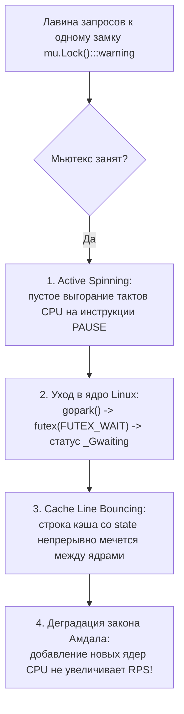
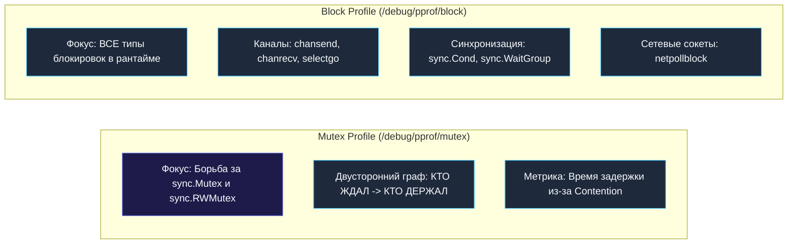

## Contention и lock profiling: как найти и устранить конкуренцию за блокировки

В предыдущих главах мы всесторонне исследовали стоимость примитивов синхронизации ([[5. Sync primitives и их стоимость]]) и сформулировали фундаментальные критерии выбора между разделяемой памятью и каналами ([[6. Mutex vs channel]]). Однако даже самый безупречный архитектурный выбор превращается в фикцию, когда сотни горутин одновременно выстраиваются в очередь к одному и тому же замку. Это разрушительное явление называется **Lock Contention** (конфликт за блокировку).

В инженерной механике существует золотое правило: *«Хотите узнать, где сломается конструкция при пиковой нагрузке — ищите точку максимального механического напряжения»*. В многопоточных бэкенд-системах на Go такой точкой напряжения неизбежно становится разделяемый мьютекс или канал. Вы можете написать идеально оптимизированный алгоритм, свести к нулю аллокации памяти и выровнять байты структур под кэш-линии, но если 64 ядра вашего сервера вынуждены по очереди пролезать через игольное ушко одного `sync.Mutex`, производительность системы неизбежно рухнет в пропасть.

Согласно закону Амдала ([[4. Amdahl law и масштабирование]]), если всего 5% времени выполнения программы приходится на монопольную критическую секцию под замком, то даже при наличии 1 000 физических ядер процессора теоретический предел ускорения сервиса составит **не более 20 раз**! Оставшиеся 980 ядер будут простаивать, сжигая электроэнергию в бесполезных ожиданиях.

Senior-инженер обязан не просто знать об опасности Lock Contention, а виртуозно владеть инструментами его детекции, количественного измерения и архитектурной ликвидации. В этой лекции мы детально разберем два штатных профилировщика Go — **mutex profile** и **block profile**, погрузимся в их внутреннее устройство, научимся интерпретировать двусторонние графы блокировок и устранять аппаратное биение кэш-линий на шине памяти ([[5. Mechanical sympathy в backend разработке]]), подготовив почву для разбора феномена False Sharing ([[8. False sharing]]).

---

## Что такое contention и почему он разрушает производительность

**Contention (конкуренция / конфликт)** — это состояние многозадачной системы, при котором несколько независимых горутин одновременно требуют эксклюзивного доступа к разделяемому ресурсу (мьютексу, буферу канала, атомарной переменной), и как минимум одна из них вынуждена приостановить свое выполнение и ожидать освобождения ресурса.

В отличие от штатного последовательного кода, при возникновении высокой конкуренции включается каскад скрытых накладных расходов:



1. **Ожидание в очереди и переключения контекста:**  
   Горутина переходит в статус `_Gwaiting`, уступает поток `M` и засыпает на системном вызове `futex` ([[2. Goroutines под капотом]]). При освобождении замка она пробуждается, встает в очередь `_Grunnable` и ожидает кванта времени. Это порождает накладные расходы контекстных переключений в тысячи наносекунд ([[4. Контекстные переключения]]).
2. **Паразитное выгорание процессорных тактов (Spinning):**  
   На коротких критических секциях горутины крутятся в spin-циклах, пытаясь перехватить замок на быстром пути. При 30–50 конкурирующих горутинах ядра процессора нагреваются до 100%, но полезный индекс инструкций за такт (IPC) падает практически до нуля.
3. **Биение кэш-линий (Cache Line Bouncing):**  
   Атомарные инструкции `LOCK CMPXCHG` над полем `state` мьютекса принудительно переводят строку кэша в статус `Modified` на одном ядре, инвалидируя ее во всех остальных кэшах L1d. Межъядерная шина процессора захлебывается трафиком когерентности MESI.
4. **Коллапс масштабируемости:**  
   Классический симптом: вы удваиваете количество ядер пода в Kubernetes (например, с 8 до 16 CPU), но пропускная способность сервиса (RPS) не растет ни на йоту, а хвостовые задержки p99 и p99.9 взлетают в разы. При этом стандартный CPU-профиль ([[2. CPU profiling в Go]]) выглядит абсолютно чистым — ведь время сна горутин в ожидании мьютекса не тарифицируется как процессорное время!

---

## Два профиля для диагностики: mutex и block

Для исчерпывающей диагностики ожиданий рантайм Go предоставляет два специализированных и взаимодополняющих инструмента:



### Mutex profile
Специализированный профилировщик, регистрирующий события **непосредственной борьбы за мьютексы**: когда горутина вызывает `Lock()`, но замок уже удерживается кем-то другим. Главная суперсила Mutex-профиля — двусторонняя фиксация стеков вызовов: он показывает не только функцию, которая страдала в ожидании, но и функцию, которая удерживала замок в этот момент!

### Block profile
Универсальный профилировщик, фиксирующий **любые события засыпания горутин** в рантайме Go:
- ожидание отправки или чтения из каналов (`chansend`, `chanrecv`);
- блокировки в конструкции `select`;
- ожидание освобождения мьютексов (измеряет чистое время блокировки);
- ожидание сигналов условных переменных `sync.Cond` и барьеров `sync.WaitGroup`;
- блокировки на системных вызовах и сетевом вводе-выводе (`netpollblock`).

> [!tip] Вопрос с собеседования: Mutex Profile против Block Profile
> **Вопрос:** «В чем принципиальная разница между mutex profile и block profile в Go и какой инструмент вы выберете первым при деградации p99?»  
> **Ответ:**  
> Mutex profile сфокусирован исключительно на конкуренции за замки `sync.Mutex` и `sync.RWMutex`: он фиксирует факт конфликта (кто держал и кто ждал) и измеряет дельту времени от начала попытки захвата до получения замка.  
> Block profile охватывает все возможные блокировки горутин в рантайме, включая каналы, таймеры и сетевой поллер.  
> **Стратегия расследования:** Если задержка растет при нормальной утилизации CPU, первым снимают `mutex profile` для выявления горячих замков; если мьютексы чисты — снимают `block profile`, чтобы обнаружить заторы в каналах и сокетах.

---

## Как работает профилирование contention изнутри

> [!info] Под капотом: Механизм сэмплирования
> Непрерывная трассировка каждой блокировки в продакшене породила бы неприемлемые накладные расходы. Поэтому оба профилировщика базируются на статистическом сэмплировании.

### Mutex profile

Интенсивность сбора управляется внутренней переменной рантайма `runtime.mutexProfileFraction`, которая настраивается функцией `runtime.SetMutexProfileFraction(rate)`.
- По умолчанию `rate=0` — профилирование полностью отключено, оверхед равен строго нулю.
- Если установлен `rate > 0`, рантайм использует генератор псевдослучайных чисел: в среднем событие конфликта записывается в профиль с вероятностью $1/\text{rate}$. При значении `rate = 1` записывается **каждый факт конкуренции**.

Когда горутина вызывает `Mutex.Lock()` и обнаруживает, что мьютекс занят (переход в `lockSlow`), рантайм:
1. Фиксирует текущую метку времени начала ожидания.
2. После того как замок успешно захвачен, вычисляет дельту времени задержки.
3. Сохраняет в кольцевой буфер профилировщика:
   - стек вызовов текущей горутины (кто ждал);
   - стек вызовов горутины, удерживавшей мьютекс (кто держал);
   - время ожидания и количество циклов конфликта.

### Block profile

Управляется вызовом `runtime.SetBlockProfileRate(rate)`.
- По умолчанию `rate=0` (отключено).
- Параметр `rate` в block profile трактуется иначе: он задает **порог длительности в наносекундах**. Рантайм гарантированно сэмплирует одну блокировку на каждые `rate` наносекунд ожидания. Значение `rate = 1` заставляет записывать абсолютно каждую блокировку с наносекундной точностью.

Оба профиля отдаются стандартным HTTP-сервером `net/http/pprof` по эндпоинтам:
- `/debug/pprof/mutex`
- `/debug/pprof/block`

Либо программно извлекаются через `runtime/pprof.Lookup("mutex").WriteTo(w, 0)`.

---

## Как включить и собрать профиль

### Для production-сервиса (HTTP)

Для безопасного профилирования боевого микросервиса включите сэмплирование в точке инициализации приложения с разумным коэффициентом прореживания:

```go
package main

import (
    "net/http"
    _ "net/http/pprof"
    "runtime"
)

func main() {
    // Включаем сэмплирование: 1 из 100 событий contention мьютексов
    runtime.SetMutexProfileFraction(100)
    
    // Включаем сэмплирование блокировок длительностью от 10 микросекунд (10_000 нс)
    runtime.SetBlockProfileRate(10_000)

    go func() {
        // Служебный порт мониторинга (закрытый от внешнего мира)
        http.ListenAndServe("localhost:6060", nil)
    }()

    // Основная бизнес-логика...
}
```

Снятие диагностических срезов под реальной нагрузкой:

```bash
# Сбор профиля конкуренции мьютексов за 30 секунд
curl -o mutex.prof "http://localhost:6060/debug/pprof/mutex?seconds=30"

# Сбор профиля блокировок за 30 секунд
curl -o block.prof "http://localhost:6060/debug/pprof/block?seconds=30"
```

### Для тестов и бенчмарков

При проведении нагрузочных тестов и микробенчмарков профили можно сгенерировать автоматически с максимальной детализацией (`rate = 1`):

```bash
go test -bench=. -benchmem -mutexprofile=mutex.out -blockprofile=block.out
```

---

## Анализ mutex profile

Для исследования профиля запустите стандартный инструмент визуализации:

```bash
go tool pprof mutex.prof
```

Команда `top` выводит список функций, создавших максимальную суммарную задержку в системе:

```text
(pprof) top
Showing nodes accounting for 4.50s, 90.00% of 5.00s total
      flat  flat%   sum%        cum   cum%
     2.00s 40.00% 40.00%      2.00s 40.00%  sync.(*Mutex).Lock
     1.50s 30.00% 70.00%      1.50s 30.00%  mypkg.updateCache
     0.50s 10.00% 80.00%      0.50s 10.00%  mypkg.incrementCounter
```

Разбор колонок:
- `sync.(*Mutex).Lock` — служебная точка, в которой горутины засыпали в ожидании.
- `mypkg.updateCache` — прикладная функция вашего кода, вызов `Lock` в которой суммарно украл 1.5 секунды времени.

Детализация по строкам исходного кода выполняется командой `list updateCache`:

```text
(pprof) list updateCache
ROUTINE ======================== mypkg.updateCache
     1.50s      1.50s (flat, cum) 30.00% of Total
         .          .     42: func updateCache(key, val string) {
     1.50s      1.50s     43:     mu.Lock() // Горячая точка! Здесь горутины ждали 1.5 секунды
         .          .     44:     cache[key] = val
         .          .     45:     mu.Unlock()
         .          .     46: }
```

### Двусторонний граф: «Кто ждал $\to$ Кто держал»

Самая мощная возможность Mutex-профилировщика — веб-интерфейс, запускаемый флагом `-http`:

```bash
go tool pprof -http=:8080 mutex.prof
```

В интерактивном графе отображаются два взаимосвязанных потока вызовов:
1. Входящие ребра показывают цепочки вызовов горутин, которые ожидали освобождения замка.
2. Специальная опция `-show_from` или переключение на режим Holder Stack подсвечивает цепочки вызовов тех горутин, которые в этот момент удерживали мьютекс. Это моментально разоблачает скрытого виновника: вы можете увидеть, что горутины блокировались в `updateCache`, но мьютекс удерживался совершенно другой фоновой горутиной, сбрасывающей метрики на диск!

---

## Анализ block profile

Запустите анализ профиля блокировок:

```bash
go tool pprof block.prof
```

Команда `top` выявит системные функции рантайма, на которых горутины провели максимальное суммарное время в заблокированном состоянии:

```text
(pprof) top
Showing nodes accounting for 4.50s, 90.00% of 5.00s total
      flat  flat%   sum%        cum   cum%
     3.00s 60.00% 60.00%      3.00s 60.00%  runtime.chanrecv1
     1.00s 20.00% 80.00%      1.00s 20.00%  runtime.selectgo
     0.50s 10.00% 90.00%      0.50s 10.00%  runtime.netpollblock
```

Инженерная расшифровка точек ожидания:
- `runtime.chanrecv1` (или просто `chanrecv`): горутины спят на пустом канале. Возможные причины: продюсер не справляется с нагрузкой, или воркеров слишком много.
- `runtime.selectgo`: горутины заблокированы в мультиплексоре `select` в ожидании хотя бы одного готового канала.
- `runtime.netpollblock`: нормальное состояние ожидания сетевого ввода-вывода (горутины спят в сокетах HTTP/gRPC).

> [!warning] Ловушка / Gotcha: Block profile без фильтрации
> В веб-сервисах львиная доля времени горутин уходит на ожидание данных из сетевых сокетов клиентских соединений (`netpollblock`). Это абсолютно штатный режим ожидания, который замусоривает отчет и скрывает реальные проблемы синхронизации.  
> **Решение:** Фильтруйте сетевой опрос при анализе профиля блокировок флагом `-ignore`:  
> `go tool pprof -ignore=netpoll block.prof`

---

## Execution tracer для визуализации contention

В отличие от профилей pprof, которые показывают лишь статическую сумму миллисекунд за период, утилита `go tool trace` ([[3. execution tracer]]) визуализирует конфликт во времени с наносекундной точностью:

```bash
curl -o trace.out "http://localhost:6060/debug/pprof/trace?seconds=5"
go tool trace trace.out
```

Трассировщик наглядно фиксирует системные события:
- `MutexLock` и `MutexUnlock` — временные интервалы владения замками;
- `GoBlock` и `GoUnblock` — моменты засыпания и пробуждения горутин.

В визуализаторе трассировки Lock Contention выглядит как характерная «расческа» или ступенчатый каскад: несколько параллельных дорожек горутин внезапно прерываются красными сегментами блокировки, выстраиваясь в очередь к одной точке, и запускаются строго по одной цепочке.

---

## Типичные паттерны contention и способы их устранения

После того как lock profiling указал на эпицентр проблемы, применяются пять проверенных архитектурных приемов снижения конфликта за замки.

### 1. Шардирование (разделение) мьютекса

Вместо одного глобального замка на всю структуру данных создается массив из $N$ независимых шардов (секций). Каждое обращение направляется в конкретный шард на основе быстрого хэширования ключа:

```go
type ShardedCache struct {
    numShards int
    shards    []*CacheShard
}

type CacheShard struct {
    mu    sync.RWMutex
    store map[string]string
}

func (c *ShardedCache) getShard(key string) *CacheShard {
    idx := fnv32(key) % uint32(c.numShards)
    return c.shards[idx]
}
```

Если число шардов равно 32 или 64, вероятность одновременного конфликта двух горутин за один и тот же замок снижается в десятки раз, восстанавливая параллелизм.

### 2. Lock-free структуры с atomic

Если критическая секция сводится к обновлению указателя конфигурации или инкременту метрик, мьютекс полностью заменяется на примитивы `sync/atomic`:

```go
// Вместо mu.Lock(); counter++; mu.Unlock()
atomic.AddInt64(&counter, 1)
```

Для чтения тяжелых конфигураций, обновляемых раз в час, идеален `atomic.Pointer[Config]`. Для кэшей с доминирующим чтением превосходно подходит оптимизированный тип `sync.Map`, использующий атомарную загрузку без захвата замков на быстром пути.

### 3. Сокращение критической секции

Никогда не удерживайте мьютекс при выполнении операций, не требующих эксклюзивного доступа: сериализации JSON, форматирования строк, выделения памяти и, самое главное, сетевого ввода-вывода или походов в базу данных!

```go
// АНТИПАТТЕРН: катастрофический contention!
mu.Lock()
data := fetchFromDB(key) // Долгий сетевой вызов (10 мс) под замком!
cache[key] = data
mu.Unlock()

// ЭТАЛОН: критическая секция занимает 20 наносекунд
data := fetchFromDB(key) // Выполняется свободно и параллельно
mu.Lock()
cache[key] = data        // Только атомарная запись в память
mu.Unlock()
```

### 4. RWMutex вместо Mutex

Если структура данных читается тысячами горутин одновременно, а записи происходят редко (< 5%), замена `sync.Mutex` на `sync.RWMutex` позволяет читателям использовать метод `RLock()`, исполняясь абсолютно параллельно на всех ядрах процессора.

### 5. Отказ от мьютексов в пользу каналов (акторная модель)

Перенос управления сложным мутабельным состоянием внутрь единственной горутины-актора, принимающей команды через буферизованный канал, полностью исключает Lock Contention за память.

---

## Mechanical Sympathy: почему contention бьёт по кэшу

С точки зрения кремниевой архитектуры современных многоядерных процессоров (AMD Zen, Intel Xeon, ARM Neoverse) Lock Contention наносит разрушительный удар по аппаратным кэшам:

1. **Шторм протокола MESI (Cache Line Bouncing):**  
   Поле `state` мьютекса `sync.Mutex` занимает 4 байта и физически лежит в одной 64-байтовой строке кэша. Чтобы выполнить атомарный `CAS`, ядро обязано захватить эксклюзивный статус `Modified`. Строка кэша начинает непрерывно метаться между ядрами через межпроцессорную шину UPI/Infinity Fabric со скоростью сотен наносекунд на каждую попытку.
2. **Паразитный трафик False Sharing:**  
   Если разработчик по ошибке расположил полезные данные структуры в той же самой кэш-линии, что и мьютекс:
   ```go
   type BadStruct struct {
       mu    sync.Mutex // 8 байт
       data  int64      // 8 байт (лежит в той же кэш-линии 64B!)
   }
   ```
   каждая попытка захвата мьютекса будет выбивать из кэша L1 ячейку `data`, заставляя все читающие ядра ловить постоянные Cache Misses ([[8. False sharing]]).
3. **Бесполезный прогрев кремния при спиннинге:**  
   Пока горутины крутятся в цикле спиннинга, конвейер процессора загружен выполнением инструкций `PAUSE` и непрерывным чтением общей шины памяти, попутно вытесняя из кэшей L1i/L1d полезные инструкции бизнес-логики.

---

## Ловушки и частые ошибки

> [!warning] Ловушка / Gotcha: Включение сэмплирования rate=1 на постоянной основе в production
> Установка `runtime.SetMutexProfileFraction(1)` или `runtime.SetBlockProfileRate(1)` на высоконагруженном сервере под 50k RPS способна замедлить сервис в 3–5 раз! Захват стектрейсов на каждом конфликте создает колоссальный оверхед по памяти и CPU.  
> **Правило:** В продакшене используйте значения `fraction >= 100` и `rate >= 10_000`, либо активируйте сбор профилей точечно на 30–60 секунд во время инцидента.

> [!warning] Ловушка / Gotcha: Ложный contention из-за внешних блокировок
> Начинающие инженеры часто смотрят на отчет `mutex profile`, видят, что функция `updateCache` удерживает замок 90% времени, и начинают судорожно шардировать мапу. Однако реальной причиной оказывается то, что разработчик оставил внутри критической секции вызов `fetchFromDB(key)`. Всегда инспектируйте полный граф вызовов: ищите, **что именно исполняется под замком**, а не просто факт ожидания.

---

## Итог

- **Lock Contention** — фундаментальный враг масштабируемости, превращающий многоядерный сервер в медленный однопоточный конвейер из-за очередей к разделяемой памяти.
- Рантайм Go предоставляет два дополняющих инструмента:
  - **`mutex profile`** — исследует конфликты за замки `sync.Mutex` и `sync.RWMutex`, формируя двусторонний граф: «кто ждал $\to$ кто держал»;
  - **`block profile`** — отслеживает суммарное время ожидания горутин на всех примитивах: каналах, семафорах, таймерах и сокетах.
- Для включения профилирования используются вызовы `runtime.SetMutexProfileFraction` и `runtime.SetBlockProfileRate`, а анализ проводится через `go tool pprof` и `go tool trace`.
- Пять канонических стратегий устранения contention:
  1. Шардирование структур данных по хэшу ключа;
  2. Замена мьютексов на атомарные операции `sync/atomic` и `sync.Map`;
  3. Максимальное сужение критических секций (вынос I/O наружу);
  4. Переход на `sync.RWMutex` при доминировании операций чтения;
  5. Переход на акторную модель через каналы.
- На аппаратном уровне борьба за замки вызывает разрушительное биение строк кэша (Cache Line Bouncing) и шторм протокола когерентности MESI.

Разобравшись с явной конкуренцией за блокировки, мы готовы перейти к исследованию самого коварного, скрытого и невидимого для компилятора врага производительности — ложному разделению кэш-линий процессора: [[8. False sharing]].