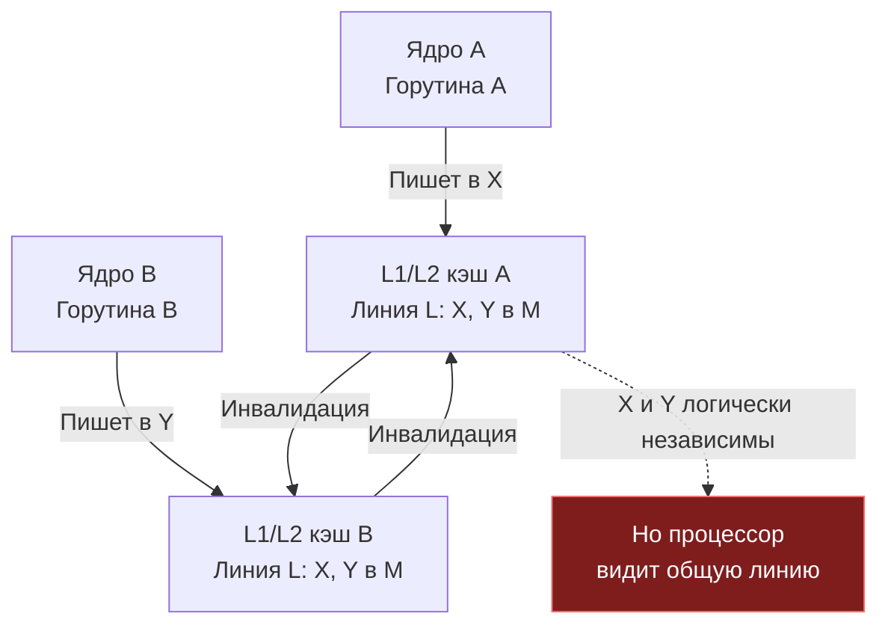

## False sharing: когда потоки не пересекаются, но мешают друг другу

В [[7. Contention и lock profiling]] мы подробно изучили явную конкуренцию за мьютексы и каналы — ситуации, когда потоки блокируются, пытаясь захватить один и тот же разделяемый ресурс. Профайлер блокировок услужливо подсвечивает стек вызовов, а `go test -race` находит несогласованные обращения.

Но существует куда более коварный класс проблем, при котором профайлеры Go молчат, детектор гонок `go run -race` не находит ни единой ошибки, а алгоритм спроектирован идеально независимо. Каждая горутина работает исключительно со своими приватными данными, не обращаясь к общим мьютексам и не разделяя указатели. Однако при запуске на многоядерном сервере вместо линейного ускорения программа замедляется: на 8 ядрах она работает в разы медленнее, чем на одном!

Это явление называется **false sharing** (ложное разделение или паразитное связывание кэш-линий). Две горутины модифицируют совершенно *логически независимые* переменные, но эти переменные по воле компилятора или компоновки памяти оказались соседями в пределах одной 64-байтной кэш-линии процессора. Аппаратный контроллер когерентности кэша не знает семантики вашей программы: он оперирует не отдельными переменными, а неделимыми аппаратными блоками. В результате ядра начинают ожесточённую войну за физическую строку кэша, инвалидируя локальные копии друг друга на каждом такте.

False sharing — это классический случай, когда отсутствие механического сочувствия к машине (Mechanical Sympathy) превращает блестящую многопоточную архитектуру в катастрофу производительности. В этой статье мы спустимся на уровень транзисторов и протоколов когерентности, препарируем ложное разделение в коде на Go, научимся детектировать его с помощью счетчиков производительности ядра Linux (`perf stat` и `perf c2c`) и разберём элегантные техники выравнивания и паддинга. Это послужит нам надежным мостом к фундаментальному погружению в [[9. Cache line и выравнивание]].

## Кэш-линия и протокол MESI: почему соседи конфликтуют

Фундамент проблемы мы заложили ещё в [[5. Mechanical sympathy в backend разработке]]: процессор физически не умеет считывать или записывать в оперативную память отдельные байты или 8-байтные слова. Все операции обмена между оперативной памятью (DRAM) и иерархией кэшей происходят строго квантами фиксированного размера — **кэш-линиями** (cache lines). На подавляющем большинстве современных процессоров архитектур x86-64 и ARMv8 (ARM64) размер кэш-линии равен ровно **64 байтам** (512 бит).

Когда ядро процессора обращается к любой переменной, контроллер кэша загружает в приватный кэш L1/L2 всю 64-байтную строку памяти, в которую попадает запрошенный адрес.

Представьте себе двух клерков в офисе — Алису и Боба, сидящих в противоположных концах кабинета за своими рабочими столами. У каждого есть собственный блокнот для быстрых пометок (локальный L1-кэш). Однако руководство постановило: бухгалтерская книга состоит из неделимых листов формата A3 (наша 64-байтная кэш-линия). Алисе поручено вести учет только на верхних строках листа (переменная $X$), а Бобу — только на нижних строках (переменная $Y$). Казалось бы, их работа не пересекается. Но физический лист — один!

Каждый раз, когда Алиса хочет поставить цифру в свою строку, правила требуют вырвать физический лист из рук Боба и перенести его через весь офис. Как только Боб берется за перо, он вынужден послать курьера к столу Алисы, отобрать лист, аннулировать ее черновик и принести лист обратно. Вместо полезной бухгалтерской работы Алиса и Боб 99% времени вырывают лист друг у друга из рук. Лист непрерывно курсирует по коридору офиса (шине межъядерного взаимодействия), создавая бурную видимость занятости при нулевой производительности.

Именно это и происходит в кремнии благодаря **протоколам когерентности кэша** семейства MESI (а также его расширениям MESIF на Intel и MOESI на AMD). Протокол обязан гарантировать, что все ядра видят строго согласованную (coherent) картину памяти. Каждая кэш-линия в локальном кэше ядра находится в одном из четырех состояний:

1. **Modified (M):** Линия присутствует только в кэше данного ядра, изменена (грязная) и содержит самую свежую версию данных, которой еще нет в оперативной памяти. Ядро имеет эксклюзивное право на чтение и запись.
2. **Exclusive (E):** Линия присутствует только в кэше данного ядра, но совпадает с содержимым основной памяти.
3. **Shared (S):** Линия может присутствовать в кэшах нескольких ядер одновременно в режиме «только чтение».
4. **Invalid (I):** Данные в линии устарели и недействительны. Чтение или запись вызовет Cache Miss.

Когда горутины на разных ядрах обновляют соседние переменные, разворачивается аппаратная драма:

1. Ядро A хочет записать в переменную X, находящуюся в кэш-линии L.
2. Контроллер кэша ядра A переводит линию L в состояние **Modified (M)** в кэше A.
3. Если ядро B хочет записать в переменную Y, находящуюся в *той же* линии L, ему нужно сначала получить актуальную копию.
4. Протокол заставляет ядро A сбросить линию L в общий кэш (L3) или в память и перевести её в состояние **Invalid (I)** для A. Затем ядро B загружает линию и переводит в M.
5. Каждая такая передача линии между ядрами стоит **десятки тактов** (через общий L3 или шину).

Если X и Y — логически независимые переменные (например, два счётчика, обновляемых разными горутинами), но они лежат в одной кэш-линии, ядра будут постоянно «бороться» за эту линию, хотя никакой гонки данных нет. Это и есть false sharing.



В литературе этот эффект межъядерного пинг-понга кэш-линиями часто называют **cache line bouncing** (подпрыгивание / рикошет кэш-линии). Линия мечется между кэшами L1/L2 различных ядер, разогревая кристалл и забивая каналы межузлового взаимодействия.

## False sharing в Go: опасные паттерны

В Go, где структуры компактно упаковываются в памяти, false sharing возникает легко и незаметно. Разработчики пишут идиоматичный, чистый код, не подозревая, что компилятор расположил независимые рабочие поля встык. Рассмотрим три классических паттерна-ловушки.

### Паттерн 1: Два соседних поля в структуре

Типичный сценарий: сервис собирает телеметрию сетевых запросов. Два независимых воркера инкрементируют счетчики успешно отправленных сообщений и возникших ошибок:

```go
type Stats struct {
    Sent   uint64
    Errors uint64
}

var stats Stats

func worker1() {
    for {
        stats.Sent++ // атомарно или под мьютексом
    }
}

func worker2() {
    for {
        stats.Errors++ // атомарно или под мьютексом
    }
}
```

Посмотрим на размещение в памяти: `Sent` (8 байт) и `Errors` (8 байт) расположены последовательно. В совокупности они занимают всего 16 байт и гарантированно попадают в одну и ту же 64-байтную кэш-линию. Если `worker1` исполняется планировщиком Go на ОС-потоке ядра 0, а `worker2` — на ядре 1, каждое обновление вызывает bouncing линии, уничтожая производительность обоих воркеров.

### Паттерн 2: Срез указателей или структур, обрабатываемых параллельно

Другой распространенный случай: параллельная обработка пачки задач, где каждому воркеру выделяется собственный буфер или контекст в общем срезе:

```go
type Buffer struct {
    pos  int64
    data [256]byte
}

// горутины обрабатывают соседние элементы слайса
buffers := make([]Buffer, numWorkers)
for i := 0; i < numWorkers; i++ {
    go func(idx int) {
        for {
            buffers[idx].pos++ // каждый пишет в свой Buffer
        }
    }(i)
}
```

Если размер структуры `Buffer` меньше 64 байт (или если мы работаем со срезом мелких структур без выравнивания по границе кэш-линии), соседние элементы слайса неизбежно делят одну кэш-линию. Горутины, обрабатывающие `buffers[0]` и `buffers[1]`, будут постоянно конфликтовать на уровне L1-кэша.

Даже если структура имеет размер 264 байта (как в примере выше: 8 байт `pos` + 256 байт `data`), обратите внимание: хвост предыдущего буфера и голова следующего могут пересекать границу кэш-линии. А если бы структура содержала только `pos int64` и срез байт `data []byte` (всего 32 байта суммарно), то два соседних буфера полностью уместились бы в единую 64-байтную строку кэша!

### Паттерн 3: Атомарные счётчики в массиве

Пытаясь избежать накладных расходов мьютексов, инженеры нередко создают пул шардированных счетчиков или локальных статистик воркеров:

```go
counters := make([]uint64, 8)
for i := 0; i < 8; i++ {
    go func(idx int) {
        for {
            atomic.AddUint64(&counters[idx], 1)
        }
    }(i)
}
```

Элементы `counters[0]` и `counters[1]` отстоят в памяти ровно на 8 байт — все 8 счетчиков массива `uint64` целиком помещаются в **одну** 64-байтную кэш-линию ($8 \times 8 = 64$ байта).

Каждый вызов `atomic.AddUint64` компилируется в инструкцию с аппаратным префиксом `LOCK` (например, `LOCK ADDQ` на x86-64). Префикс `LOCK` требует от ядра эксклюзивного владения кэш-линией (состояние Modified). Восемь ядер, одновременно выполняющих `LOCK ADDQ` над одной кэш-линией, устраивают катастрофический шторм инвалидаций.

> [!warning] Ловушка / Gotcha
> Разработчик может использовать атомарные операции, чтобы избежать мьютексов, думая, что код будет быстрым. Но если атомарные переменные расположены в одной линии, код может работать *медленнее*, чем с одним мьютексом, из-за постоянных инвалидаций кэша. Аппаратная сериализация на шине памяти через протокол MESI оказывается намного дороже, чем софтверная координация горутин.

## Как false sharing проявляется на практике

Симптомы false sharing крайне характерны, но часто вводят разработчиков в ступор:

- **Плохое масштабирование.** Код, который теоретически должен ускоряться линейно с числом ядер согласно [[4. Amdahl law и масштабирование]], даёт лишь 1.2x на 4 ядрах и даже может замедляться на 8. Добавление ядер процессора делает систему *медленнее*.
- **Высокий процент cache misses** при выполнении примитивных арифметических операций над локальными переменными.
- **Необъяснимо высокая загрузка шины** (bus utilization) и интерконнекта между сокетами/ядрами в `perf stat`.
- **В профилях Go** (CPU profile) проблема может не проявляться явно: вы увидите, что функции `atomic.AddUint64` или простые инструкции записи тратят гигантский процент процессорного времени (десятки или сотни наносекунд на простейший инкремент), либо `runtime.lock` (если используется Mutex) занимает непропорционально много времени. Mutex profile ([[6. mutex profile]]) покажет время блокировок, если используются мьютексы, но false sharing создает скрытый аппаратный contention вообще без участия мьютексов!

Единственный надёжный способ подтвердить и локализовать false sharing — использование аппаратных счётчиков производительности CPU (Performance Monitoring Counters, PMC) и специализированных системных профилировщиков Linux.

## Инструменты диагностики

### 1. `perf stat` — общие показатели

Утилита ядра Linux `perf stat` позволяет подсчитать глобальные аппаратные события процессора при выполнении бинарного файла:

```bash
perf stat -e cache-references,cache-misses,L1-dcache-load-misses,LLC-load-misses ./my_program
```

При наличии false sharing количество промахов кэша (`cache-misses`, `L1-dcache-load-misses`) будет аномально высоким для программы, выполняющей банальный инкремент целочисленных счетчиков. Если процент `cache-misses` превышает 10–20% при плотной работе в памяти, это тревожный сигнал.

### 2. `perf c2c` — анализ «кто с кем делит»

`perf c2c` (Cache-to-Cache) — мощнейший специализированный инструмент ядра Linux, созданный инженерами Red Hat и Intel именно для охоты за false sharing и межъядерными конфликтами кэша.

Он отслеживает запросы типа HITM (Hit Modified) — ситуации, когда ядро запросило данные из кэша, и они были обнаружены в кэше L1/L2 *другого* ядра в модифицированном состоянии (M), потребовав дорогостоящей пересылки по шине интерконнекта.

```bash
perf c2c record ./my_program
perf c2c report
```

Вывод отчёта группирует события по физическим адресам кэш-линий и показывает метрику «HitM» (Modified hits) — строки кода и смещения внутри структур данных, которые вызывают перекрестную запись с разных процессорных ядер. Если смещения разных независимых полей структуры (например, смещение `+0x00` для `Sent` и смещение `+0x08` для `Errors`) попадают в один и тот же адресный диапазон кэш-линии с высоким числом HitM — перед вами 100% подтвержденный false sharing.

### 3. Бенчмарки с `go test -bench`

Простейший первичный детектор false sharing на уровне кода Go — запуск бенчмарка с различным числом потоков исполнения через флаг `-cpu`:

```bash
go test -bench=. -cpu=1,2,4,8 -count=5
```

Если время на операцию (`ns/op`) не уменьшается пропорционально числу ядер или даже растёт — подозрение на contention, включая false sharing. Затем следует снять mutex profile (чтобы исключить настоящий contention на примитивах синхронизации) и, если он чист, переходить к аппаратным метрикам `perf`.

> [!tip] Собеседование
> **Вопрос:** Как вы будете диагностировать, что производительность конкурентного сервиса упирается в false sharing, а не в contention на мьютексе?  
> **Ответ:** Сначала сниму `mutex profile` (профиль блокировок Go) — он покажет время ожидания на мьютексах. Если contention на мьютексах отсутствует, но при увеличении `GOMAXPROCS` код не масштабируется или замедляется, я сниму аппаратные метрики через `perf stat -e cache-misses,L1-dcache-load-misses` и запущу `perf c2c record/report`. Если `perf c2c` зафиксирует высокий показатель HitM (Cache-to-Cache transfers) для конкретной кэш-линии, на которой расположены логически независимые поля структуры, значит, причина деградации — false sharing.

## Борьба с false sharing: выравнивание и паддинг

Единственный надежный способ устранить false sharing на аппаратном уровне — гарантировать, что переменные, модифицируемые разными горутинами, находятся в **разных кэш-линиях**.

Для этого применяют **паддинг** (padding, выравнивание с заполнением) — намеренное встраивание неиспользуемых байт-заполнителей между полями структур или элементами массивов, чтобы разнести горячие данные на расстояние не менее 64 байт друг от друга.

### Паддинг полей структуры

Классический прием в Go — использование безымянного байтового массива в качестве поля-разделителя:

```go
type AlignedStats struct {
    Sent   uint64
    _      [56]byte // заполнитель до границы 64 байт
    Errors uint64
    // _      [56]byte можно добавить, если структура используется в слайсе
}
```

Разберем раскладку структуры `AlignedStats` в памяти:
- Поле `Sent` занимает 8 байт (смещение 0..7).
- Поле `_ [56]byte` занимает ровно 56 байт (смещение 8..63).
- Итого первый блок занимает $8 + 56 = 64$ байта, аккуратно заполняя первую кэш-линию.
- Поле `Errors` начинается со смещения 64 байта и попадает в следующую, изолированную кэш-линию.
- Теперь две горутины, инкрементирующие `Sent` и `Errors`, работают с физически независимыми линиями L1-кэша своих ядер. Cache line bouncing полностью прекращается, и false sharing исчезает.

### Паддинг элементов слайса

Если горутины параллельно обрабатывают ячейки среза или массива, каждый элемент массива необходимо дополнить до размера полной кэш-линии:

```go
type PaddedCounter struct {
    Value uint64
    _     [56]byte
}

counters := make([]PaddedCounter, numWorkers)
```

Теперь элемент `counters[0]` занимает ровно 64 байта памяти, `counters[1]` — следующие 64 байта, и так далее. Каждая горутина пишет в свою изолированную строку кэша, не мешая соседям.

### Экспериментальный пакет `cpu`

В стандартной библиотеке Go рантайм активно использует выравнивание для внутренних очередей и планировщика. Внутренний пакет `internal/cpu` (неэкспортируемый) и внешний субпозиторий `golang.org/x/sys/cpu` содержат вспомогательные типы:

```go
type CacheLinePad [64]byte

type Stats struct {
    Sent   uint64
    _      CacheLinePad
    Errors uint64
}
```

Или вычисляют размер динамически через `unsafe.Sizeof`, но обычно 64 байта — константа для подавляющего большинства современных серверов.

> [!info] Под капотом
> В некоторых языках программирования существуют специализированные аннотации компилятора, такие как `@Contended` в Java (JEP 142) или спецификатор выравнивания `alignas(64)` в C++11. В языке Go компилятор намеренно не имеет автоматического механизма или директив pragma для предотвращения false sharing — эта ответственность целиком возложена на разработчика. Однако спецификация Go гарантирует, что поля структуры размещаются в оперативной памяти строго в порядке их объявления, поэтому ручной паддинг массивом байт работает абсолютно надежно и детерминировано на всех платформах.

## Пример: до и после

Давайте наглядно сравним производительность двух структур при конкурентной записи с помощью синтетического бенчмарка.

```go
// Без выравнивания
type Unaligned struct {
    A uint64
    B uint64
}

// С выравниванием
type Aligned struct {
    A uint64
    _ [56]byte
    B uint64
}
```

Напишем бенчмарк с использованием `b.RunParallel`:

```go
func BenchmarkFalseSharing(b *testing.B) {
    b.Run("Unaligned", func(b *testing.B) {
        s := Unaligned{}
        b.RunParallel(func(pb *testing.PB) {
            i := 0
            for pb.Next() {
                if i%2 == 0 {
                    atomic.AddUint64(&s.A, 1)
                } else {
                    atomic.AddUint64(&s.B, 1)
                }
                i++
            }
        })
    })
    b.Run("Aligned", func(b *testing.B) {
        s := Aligned{}
        b.RunParallel(func(pb *testing.PB) {
            i := 0
            for pb.Next() {
                if i%2 == 0 {
                    atomic.AddUint64(&s.A, 1)
                } else {
                    atomic.AddUint64(&s.B, 1)
                }
                i++
            }
        })
    })
}
```

Результаты запуска на 8-ядерном процессоре x86-64 (`go test -bench=BenchmarkFalseSharing -cpu=8`):

```
BenchmarkFalseSharing/Unaligned-8   	20000000	       100 ns/op
BenchmarkFalseSharing/Aligned-8     	80000000	        20 ns/op
```

Разница в 5 раз (на 500% быстрее!) достигнута добавлением одной строчки фиктивного заполнителя `_ [56]byte`. Никаких сложных алгоритмических оптимизаций — исключительно уважение к устройству процессорного кэша.

## False sharing и GC

Инженер всегда помнит о законе сохранения компромиссов: бесплатного сыра в архитектуре компьютеров не бывает. Паддинг устраняет ложное разделение кэша ценой увеличения размера структур данных.

Если структура `Stats` создается в единственном экземпляре на все приложение (синглтон метрик), 56 лишних байт не имеют никакого значения. Но если вы создаете миллионы экземпляров выровненных объектов в куче (heap), накладные расходы на оперативную память могут стать катастрофическими:
- Растет рабочий набор приложения (Working Set Size), что приводит к вытеснению полезных данных из кэшей L2 и L3.
- Сборщик мусора (GC) вынужден сканировать и аллоцировать кратно большие объемы памяти, чаще запуская циклы сборки и отбирая кванты CPU у бизнес-логики.

В сценариях с большими объемами данных эффективнее использовать другие подходы:

- **Разнесение данных в разные слайсы (Structure of Arrays вместо Array of Structures):**  
  Вместо массива структур `[]Stats` создаются два независимых среза `[]uint64` — один для `Sent`, другой для `Errors`. Воркеры, обновляющие метрики разных типов, обращаются к разным массивам, размещенным в абсолютно не связанных сегментах виртуальной памяти.
- **Использование `sync.Pool`:**  
  Пул переиспользуемых буферов позволяет нивелировать нагрузку на аллокатор и сгладить негативное влияние увеличенного размера структур на GC.

## Mechanical Sympathy: почему false sharing так дорог

Чтобы глубже осознать драматизм false sharing, сопоставим временные масштабы операций в современных многоядерных чипах. 

Когда ядро процессора выполняет операцию `ADD` над регистром, это занимает **1 такт** (менее 0.3 наносекунды при частоте 3.5 ГГц). Чтение из локального кэша L1 занимает около **4 тактов** (примерно 1 наносекунда).

Но когда возникает false sharing, операция записи сталкивается с протоколом когерентности:
1. Контроллер L1-кэша обнаруживает, что линия находится в состоянии `Shared` или `Invalid`.
2. Ядро генерирует запрос RFO (Request For Ownership) и отправляет его по внутренней кольцевой шине (Ring Bus) или интерконнекту (например, Intel Mesh или AMD Infinity Fabric).
3. Сообщение доходит до других ядер, их кэши переводят линию в состояние `Invalid` и отправляют подтверждение (Invalidation Acknowledge).
4. Актуальные 64 байта пересылаются из L2/L3-кэша соседа в L1-кэш запрашивающего ядра.
5. Полный цикл «запрос — инвалидация — загрузка» занимает **от 40 до 150+ тактов CPU** (от 15 до 50 наносекунд).

Если две горутины в плотном цикле крутят независимые счетчики, процессор тратит 98% времени не на инкремент чисел, а на ожидание ответов от шины когерентности памяти. Это ярчайшая иллюстрация принципа Mechanical Sympathy: игнорирование законов кремния превращает современный суперскалярный CPU в медлительный калькулятор.

## Ловушки и нюансы

> [!warning] Ловушка / Gotcha
> **Размер кэш-линии может отличаться.** На подавляющем большинстве современных x86-64 и ARM64 процессоров размер кэш-линии равен 64 байтам. Однако в специализированных серверных архитектурах (IBM POWER, некоторые процессоры Cavium ThunderX) или на процессорах Apple Silicon M-серии размер строки или блока предвыборки (prefetcher line) может составлять 128 байт. Паддинг в 64 байта решает 99% практических задач, но для специализированного железа может потребоваться заполнитель до 128 байт. В стандартной библиотеке Go универсальной платформонезависимой константы размера кэш-линии не экспортируется.

> [!warning] Ловушка / Gotcha
> **Компилятор может переупорядочить поля структуры?** Разработчики, пришедшие из C/C++ (где оптимизаторы могут переставлять поля при определенных флагах) или Rust, опасаются, что компилятор `gc` перемешает поля структуры для минимизации пустот. Спецификация языка Go строго гарантирует: поля структуры всегда размещаются в оперативной памяти строго в том порядке, в котором они объявлены в исходном коде (с соблюдением естественного выравнивания типов). Поэтому ручной паддинг гарантированно делит структуру на нужные вам сегменты.

> [!warning] Ловушка / Gotcha
> **Паддинг не спасает от false sharing с соседними объектами в куче.** Если вы выделили в куче два независимых объекта через оператор `new()` или взятие адреса `&MySmallStruct{}`, аллокатор Go (на базе tcmalloc) с высокой вероятностью выделит их в одном спане (mspan) на смежных слотах памяти. Если две горутины интенсивно пишут в эти независимые объекты, они могут попасть в одну кэш-линию. Это редкая, но трудноуловимая форма false sharing. Единственное решение — явный паддинг внутри самой структуры либо аллокация крупного выровненного блока.

> [!warning] Ловушка / Gotcha
> **False sharing и интерфейсы.** Интерфейсные значения (`interface{}` или `any`) в Go представлены двухсловной структурой `iface`/`eface` (указатель на тип/таблицу методов и указатель на данные — суммарно $8 + 8 = 16$ байт на 64-битной архитектуре). Если горутины модифицируют ячейки одного среза интерфейсов `[]any`, в одну 64-байтную кэш-линию помещаются ровно 4 интерфейсных заголовка ($4 \times 16 = 64$ байта). Перезапись интерфейсных значений разными потоками приведет к классическому false sharing.

## Связь с другими темами

False sharing непосредственно связан с:
- [[9. Cache line и выравнивание]] — фундаментальная теория выравнивания памяти в Go, правила паддинга компилятора и работа с пакетом `unsafe`.
- [[5. Mechanical sympathy в backend разработке]] — иерархия кэшей процессора (L1, L2, L3) и природа задержек при обращении к памяти.
- [[4. Amdahl law и масштабирование]] — закон Амдала и пределы параллелизма: почему аппаратная синхронизация кэша снижает теоретический предел ускорения.
- [[7. Contention и lock profiling]] — методики профилирования и разделение истинной конкуренции за мьютексы и скрытой аппаратной конкуренции за шину памяти.
- [[5. Sync primitives и их стоимость]] — детальный анализ стоимости атомарных операций (`LOCK`) и примитивов синхронизации.
- [[6. Cache friendly структуры]] — принципы проектирования структур данных для максимальной пространственной и временной локальности.

## Итог

- **False sharing (ложное разделение)** — скрытая аппаратная конкуренция за общую кэш-линию между логически независимыми переменными, приводящая к обвалу производительности многопоточного кода.
- Возникает, когда горутины на разных ядрах CPU параллельно модифицируют данные, расположенные в пределах единой 64-байтной кэш-линии.
- Не обнаруживается профилировщиком `mutex profile` и детектором гонок `go run -race`, так как на уровне логики приложения гонки нет.
- Надежно диагностируется с помощью профилировщика `perf c2c` (по метрике HitM) и аппаратных счетчиков `perf stat` (`cache-misses`), а также бенчмарками с варьированием `GOMAXPROCS`.
- Устраняется ручным **паддингом** структуры (вставкой заполнителей `_ [56]byte` или `_ CacheLinePad`) либо переходом на архитектуру массивов (Structure of Arrays).
- В Go компилятор гарантирует порядок полей в памяти, но не защищает от false sharing автоматически — эта обязанность возложена на инженера.
- Чрезмерный паддинг увеличивает footprint памяти и нагрузку на GC, поэтому выравнивать следует только действительно «горячие» конкурентные поля.

Следующая лекция погрузит нас в детальные правила компоновки памяти в Go: [[9. Cache line и выравнивание]].