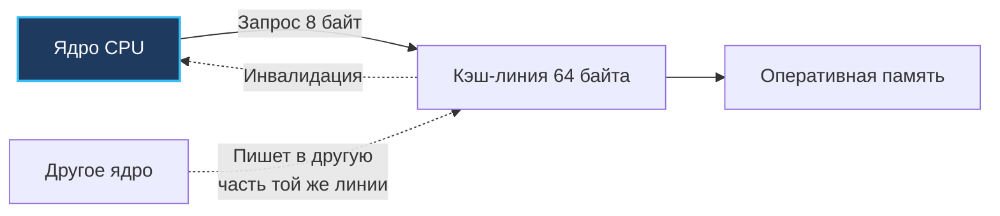

## Cache line и выравнивание: как память становится быстрой или медленной

В [[8. False sharing]] мы детально исследовали ложное разделение кэш-линий — ситуацию, когда независимые горутины непреднамеренно разрушают производительность друг друга из-за того, что их переменные делят одну и ту же физическую строку кэша. Но кэш-линия — это не просто потенциальный источник конфликтов, а фундаментальный строительный блок всей подсистемы оперативной памяти современного компьютера.

**Выравнивание данных** (data alignment) относительно границ машинных слов и 64-байтных кэш-линий непосредственно определяет, сколько физических тактов и циклов шины потратит процессор на доступ к полю структуры, чтение элемента среза или атомарную модификацию счетчика.

В языках низкого уровня (C и C++) системные программисты привыкли вручную управлять выравниванием через спецификаторы `alignas`, директивы `__attribute__((aligned))` и прагмы упаковки `#pragma pack`. В Go компилятор берет на себя рутинную расстановку внутренних заполнителей (padding). Однако профессиональный бэкенд-инженер обязан глубоко понимать внутренние законы компилятора и кремния. Без этого невозможно проектировать структуры, экономящие гигабайты оперативной памяти в высоконагруженных сервисах, избегать аппаратных ловушек `sync/atomic` на архитектурах ARM64 и защищать кэш процессора от деградации.

Эта статья подводит итог подраздела «Конкурентность», объединяя знания о планировщике Go ([[1. Scheduler Go. G-M-P модель]]), цене контекстных переключений и примитивов синхронизации ([[5. Sync primitives и их стоимость]]) с фундаментальным принципом сочувствия к оборудованию ([[5. Mechanical sympathy в backend разработке]]). Мы досконально разберем правила выравнивания в компиляторе Go, научимся препарировать внутренности структур с помощью пакета `unsafe`, оптимизировать порядок полей и виртуозно применять специализированные инструменты анализа.

## Что такое cache line и почему процессор читает память блоками

Современный микропроцессор никогда не читает из оперативной памяти отдельные байты. С точки зрения аппаратного контроллера памяти и системной шины, память представляет собой не непрерывную ленту одиночных символов, а массив строго калиброванных контейнеров — **кэш-линий** (cache lines).

На подавляющем большинстве современных x86-64 и ARMv8 (ARM64) процессоров размер кэш-линии равен ровно **64 байтам** (512 бит). Некоторые архитектуры (например, ядра высокопроизводительных процессоров Apple Silicon M-серии) используют 128-байтные блоки для префетчера (предвыборки), однако протоколы когерентности и ключевые структуры кэша L1/L2 по-прежнему работают со стандартными 64-байтными квантами.

Представьте себе кладовщика на гигантском оптовом складе. Вместо того чтобы бегать к дальним стеллажам за каждым отдельным яйцом или яблоком, он всегда привозит на рокле стандартный паллет или коробку, вмещающую ровно 64 предмета. Если вашей программе понадобилось 8-байтовое число, процессор всё равно загружает в приватный кэш L1/L2 весь 64-байтный блок, в границы которого попал этот адрес.

Если следующая переменная, к которой обратится алгоритм, лежит в пределах тех же 64 байт — она уже мгновенно доступна прямо в регистровом кэше L1 всего за 1–4 такта CPU. Если же данные разбросаны по памяти хаотично, ядру придется снова простаивать сотни тактов (от 150 до 300+ тактов шины DRAM), ожидая доставки следующей кэш-линии из медленной оперативной памяти.



Из этого фундаментального аппаратного устройства вытекают два важнейших следствия:

1. **Пространственная локальность (spatial locality):** чем плотнее упакованы логически связанные данные и чем более последовательно процессор сканирует структуры в памяти, тем выше процент попаданий в кэш (L1/L2 cache hits). Каждая загруженная 64-байтная линия отрабатывает с максимальным КПД, снижая давление на шину памяти.
2. **Ложное разделение (false sharing):** если две независимые переменные попадают в границы одной 64-байтной линии, но модифицируются независимыми горутинами на разных ядрах процессора, протокол когерентности кэша (MESI) превращает параллельную работу в непрерывную межъядерную инвалидацию данных ([[8. False sharing]]).

## Выравнивание в Go: что гарантирует компилятор

Почему переменные в оперативной памяти вообще должны быть выровнены? Физическая шина данных современного 64-битного процессора считывает данные из памяти словами по 8 байт (64 бита). Адрес каждого такого машинного слова в памяти аппаратно кратен 8 (младшие 3 бита адреса равны нулю: `0x...0`, `0x...8`). 

Если 8-байтное целое число расположено по адресу, кратному 8, процессор считывает его за одну неделимую транзакцию шины. Но если число лежит, например, по нечетному адресу `0x1003`, оно перекрывает сразу два 8-байтных машинных слова! Процессору приходится выполнять два последовательных чтения из кэша/памяти, сдвигать байты в битовых масках и склеивать их в регистре.

Чтобы исключить подобные накладные расходы, компиляторы применяют **выравнивание** (alignment). Для каждого элементарного типа данных определено **естественное выравнивание** (natural alignment), которое совпадает с его размером в байтах:

- `bool`, `byte` — 1 байт (может располагаться по абсолютно любому адресу).
- `int16`, `uint16` — 2 байта (адрес должен делиться на 2).
- `int32`, `uint32`, `float32` — 4 байта (адрес должен делиться на 4).
- `int64`, `uint64`, `float64` — 8 байт (адрес должен делиться на 8).
- Указатели (`*T`), `map`, `chan`, `func` — 8 байт на 64-битных системах (размер машинного слова).
- Слайс (`[]T`) — выравнивание 8 байт (внутри слайс состоит из трех 8-байтных полей: указатель на массив, длина `len` и емкость `cap`, суммарно 24 байта).
- Строка (`string`) — выравнивание 8 байт (указатель на данные + длина `len`, суммарно 16 байт).
- Интерфейс (`interface{}` / `any`) — выравнивание 8 байт (два 8-байтных указателя: тип и данные, суммарно 16 байт).
- Структура (`struct`) — выравнивание по самому строгому полю (максимальный `align` среди всех входящих в нее полей).

Компилятор Go строго гарантирует соблюдение естественного выравнивания для каждого поля структуры. Если между полями образуется «зазор», компилятор автоматически вставляет неиспользуемые байты — **паддинг** (padding).

Посмотрим на классический пример расточительной структуры:

```go
type Example struct {
    a bool   // 1 байт, смещение 0. Следующее поле требует кратности 8!
    b int64  // 8 байт, требует адрес % 8 == 0 → 7 байт пустого паддинга!
    c bool   // 1 байт, смещение 16. Хвост структуры должен быть кратен max align (8)!
}
// Итоговый размер структуры:
// 1 (a) + 7 (паддинг) + 8 (b) + 1 (c) + 7 (хвостовой паддинг) = 24 байта!
```

Из 24 байт полезными являются лишь 10 байт ($1 + 8 + 1$). Остальные 14 байт — это чистая пустота, сгенерированная компилятором для соблюдения кратности адресов!

```
Раскладка памяти Example (24 байта):
[ a ] [ PAD 7 байт ] [ b (8 байт) ] [ c ] [ PAD 7 байт ]
  0    1..7            8..15          16    17..23
```

> [!info] Под капотом
> В исходном коде компилятора Go (`cmd/compile/internal/types/align.go`) алгоритм компоновки структур задан предельно четко. Для каждой структуры вычисляется `align = max(align полей)`. Каждое очередное поле размещается со смещением, кратным его собственному выравниванию. А в самом конце размер структуры безусловно округляется вверх до ближайшего кратного числу `align = max(align полей)`. Это фундаментальное требование гарантирует, что если вы создадите массив таких структур (`[100]Example`), каждый следующий элемент массива начнется с адреса, удовлетворяющего выравниванию его внутренних 8-байтных полей.

## Как измерять размер и выравнивание

В языке Go для инспекции низкоуровневой раскладки структур памяти служит стандартный пакет `unsafe`. Он предоставляет три фундаментальные функции:

- **`unsafe.Sizeof(v)`** — возвращает полный размер переменной или типа в байтах (включая весь внутренний и хвостовой паддинг).
- **`unsafe.Alignof(v)`** — возвращает требуемое выравнивание типа (фактор кратности адреса памяти).
- **`unsafe.Offsetof(v.field)`** — возвращает точное смещение поля в байтах относительно начала структуры.

Проверим наши расчеты на практике:

```go
type Example struct {
    a bool
    b int64
    c bool
}

func main() {
    var ex Example
    fmt.Println("Size:", unsafe.Sizeof(ex))   // 24
    fmt.Println("Align:", unsafe.Alignof(ex)) // 8
    fmt.Println("Offset a:", unsafe.Offsetof(ex.a)) // 0
    fmt.Println("Offset b:", unsafe.Offsetof(ex.b)) // 8
    fmt.Println("Offset c:", unsafe.Offsetof(ex.c)) // 16
}
```

Вывод программы на 64-битной машине:
```
Size: 24
Align: 8
Offset a: 0
Offset b: 8
Offset c: 16
```

Знание этих примитивов позволяет проводить точный аудит критичных по памяти структур данных в любых сервисах.

## Оптимизация компоновки полей (field ordering)

Спецификация языка Go гарантирует, что поля структуры располагаются в оперативной памяти строго в порядке их объявления. Компилятор Go намеренно **не переупорядочивает** поля автоматически. Это означает, что ответственность за эффективную упаковку памяти целиком лежит на инженере.

Золотое правило минимизации паддинга звучит просто: **сортируйте поля структуры по убыванию их размера и требований к выравниванию** (от 8-байтных типов к 1-байтным).

Сравним две структуры с абсолютно идентичным набором данных:

```go
// Плохо: 24 байта (14 байт мусора)
type Bad struct {
    a bool
    b int64
    c bool
}

// Хорошо: 16 байт (всего 6 байт хвостового паддинга)
type Good struct {
    b int64
    a bool
    c bool
}
```

Разберем структуру `Good`:
- Поле `b int64` (8 байт) располагается со смещения 0 до 7.
- Поле `a bool` (1 байт) располагается со смещения 8.
- Поле `c bool` (1 байт) располагается сразу следом со смещения 9.
- Далее компилятор добавляет 6 байт хвостового паддинга (смещения 10..15), чтобы размер структуры был кратен 8 байтам.
- Итоговый размер: 16 байт вместо 24! Экономия памяти составляет **33%**.

```
Раскладка памяти Good (16 байт):
[ b (8 байт) ] [ a ] [ c ] [ PAD 6 байт ]
  0..7           8     9     10..15
```

Казалось бы, 8 байт — мелочь? Но представьте срез из 100 миллионов структур в кэше или базе данных в памяти:
- `[]Bad` займет $100\,000\,000 \times 24 = 2.4$ ГБ RAM.
- `[]Good` займет $100\,000\,000 \times 16 = 1.6$ ГБ RAM.
- Мы мгновенно сэкономили **800 мегабайт** оперативной памяти, просто переставив две строчки кода!

Более того, в кэш-линию 64 байта теперь помещается ровно 4 структуры `Good` вместо 2 структур `Bad`. Количество промахов кэша при линейном сканировании массива падает вдвое ([[6. Cache friendly структуры]]).

Для автоматического обнаружения таких неэффективностей сообщество Go создало линтер `fieldalignment` из официального набора инструментов Go:

```bash
# Установка и запуск анализатора
go install golang.org/x/tools/go/analysis/passes/fieldalignment/cmd/fieldalignment@latest
fieldalignment ./...
```

Линтер не только найдет раздутые структуры, но и с флагом `-fix` автоматически переставит поля в оптимальный порядок.

> [!tip] Собеседование
> **Вопрос:** Почему перестановка полей структуры может кардинально ускорить работу Go-приложения?  
> **Ответ:** Перестановка полей от наибольшего к наименьшему минимизирует внутренний паддинг, уменьшая итоговый размер структуры. Это дает двойной выигрыш: во-первых, уменьшается объем выделяемой памяти и нагрузка на GC; во-вторых, улучшается пространственная локальность и cache friendliness: в каждую 64-байтную кэш-линию L1/L2 помещается больше полезных элементов, что резко снижает число Cache Misses при обходе срезов.

## Выравнивание и слайсы, массивы

Элементы массива или базового массива среза (slice backing array) всегда размещаются в памяти с фиксированным шагом (stride), равным размеру типа `unsafe.Sizeof(T)`. 

Поскольку размер любого типа структуры в Go всегда округляется вверх до кратности ее выравнивания, адрес каждого следующего элемента массива `arr[i]` гарантированно оказывается кратным естественному выравниванию полей:

$$\text{Address}(arr[i]) = \text{BaseAddress} + i \times \text{Sizeof}(T)$$

Однако здесь скрывается важная архитектурная тонкость: если размер структуры не кратен размеру кэш-линии (64 байта), структуры будут неизбежно «наезжать» на границы линий кэша. Например, если размер элемента равен 24 байтам:
- Элемент 0 занимает байты 0..23 (кэш-линия 0).
- Элемент 1 занимает байты 24..47 (кэш-линия 0).
- Элемент 2 занимает байты 48..71. Он **пересекает границу**: первые 16 байт лежат в кэш-линии 0, а оставшиеся 8 байт — в кэш-линии 1!

Доступ к элементу 2 требует от процессора загрузки сразу двух линий кэша. В сверхвысоконагруженных алгоритмах элементы критических очередей и кольцевых буферов часто выравнивают ровно до 64 байт (с помощью паддинга), гарантируя, что ни один элемент никогда не пересечет границу кэш-линии и не вызовет split access или ложное разделение ([[8. False sharing]]).

## Выравнивание и атомарные операции

Пакет стандартной библиотеки `sync/atomic` накладывает бескомпромиссное требование: адрес переменной, над которой выполняется атомарная операция, **обязан быть строго выровнен** по границе своего естественного размера.

Для 64-битных атомарных операций (`atomic.AddInt64`, `atomic.LoadUint64`, `atomic.CompareAndSwapInt64`) адрес операнда должен быть строго кратен 8 байтам.

На 64-битных архитектурах компилятор автоматически выравнивает 64-битные поля по 8 байт. Но если вы работаете с сырой памятью через `unsafe.Pointer`, кастуете срезы байт или компилируете бинарник под 32-битные архитектуры (x86 32-bit, ARMv7), возникает смертельная опасность.

На архитектурах x86 процессор аппаратным путем умеет сглаживать невыровненный доступ (хотя и с потерей производительности на блокировку шины). Но на процессорах с архитектурой ARM (включая 64-битные чипы Apple Silicon и серверные ARM Neoverse) невыровненная атомарная инструкция не просто работает медленнее — процессор аппаратно генерирует исключение Alignment Fault, и рантайм Go завершает процесс аварийной паникой:

```
panic: unaligned 64-bit atomic operation
```

Посмотрим на код, который гарантированно упадет на ARM:

```go
// Опасно: buf может быть не выровнен на 8
buf := make([]byte, 16)
ptr := (*int64)(unsafe.Pointer(&buf[1])) // смещение 1, не кратно 8
atomic.AddInt64(ptr, 1) // panic на ARM!
```

В современном Go (начиная с версии 1.19) для безопасной работы с атомиками рекомендуется использовать типизированные структуры из `sync/atomic`: `atomic.Int64`, `atomic.Uint64`, `atomic.Pointer[T]`. Они автоматически гарантируют корректное 8-байтное выравнивание на уровне типа даже на 32-битных платформах.

## Mechanical Sympathy: выравнивание, кэш и TLB

Рассмотрение выравнивания через призму Mechanical Sympathy позволяет понять, какие именно физические узлы процессора страдают при неоптимальной компоновке данных:

- **Кэш-линии и Split Access (расщепленный доступ):**  
  Если 8-байтная переменная пересекает границу двух 64-байтных кэш-линий, процессору необходимо выполнить две транзакции кэша L1, объединить результаты во внутреннем буфере выравнивания (Load/Store Alignment Buffer) и лишь затем подать данные на конвейер. Задержка чтения удваивается. Если такое расщепление происходит внутри атомарной инструкции с префиксом `LOCK`, процессор вынужден заблокировать доступ к шине памяти для всех остальных ядер на время сразу двух циклов шины, парализуя работу соседних потоков!
- **TLB (Translation Lookaside Buffer) и страницы памяти:**  
  Когда структуры раздуты из-за беспечного паддинга, общий рабочий объем памяти сервиса (Working Set) возрастает на десятки процентов. Это приводит к быстрому переполнению кэша трансляции адресов виртуальной памяти (TLB). Промахи TLB (TLB misses) заставляют аппаратный блок Page Table Walker выполнять длительный обход 4- или 5-уровневых таблиц страниц ядра в оперативной памяти (DRAM).
- **Аппаратная предвыборка (Hardware Prefetching):**  
  Современные процессоры оснащены интеллектуальными аппаратными блоками Stream/Stride Prefetcher. Они анализируют паттерны доступа и упреждающе подгружают следующую кэш-линию из оперативной памяти до того, как код запросит ее. Если структуры компактны, выровнены и однородны, предвыборщик работает со 100% точностью, полностью скрывая задержку памяти. Если структуры разрозненны и пересекают границы строк, предвыборщик ошибается и забивает шину ненужным мусором.
- **Шина памяти и burst-транзакции:**  
  Контроллеры оперативной памяти DDR4/DDR5 передают данные пакетными пакетами (burst transfers по 64 байта за такт). Любые выровненные обращения укладываются в единичные burst-циклы, обеспечивая максимальную пропускную способность шины.

## Выравнивание структур для конкурентного доступа (cache line padding)

Мы уже знаем из [[8. False sharing]], что иногда искусственное увеличение размера структуры с помощью паддинга — не недостаток, а осознанная и мощная оптимизация.

Когда несколько горутин на разных ядрах параллельно и с высокой частотой инкрементируют счетчики или флаги состояния, их необходимо принудительно развести по разным 64-байтным кэш-линиям:

```go
type SharedCounters struct {
    Sent   uint64
    _      [56]byte // cache line padding: 8 + 56 = 64 байта
    Errors uint64
    _      [56]byte // гарантирует изоляцию от следующих объектов в массиве
}
```

Здесь `_ [56]byte` гарантирует, что переменные `Sent` и `Errors` никогда не окажутся в одной физической строке кэша. Платой за это является рост размера структуры с 16 до 128 байт.

Поэтому применять кэш-линейный паддинг следует **только** для доказанно узких мест и «горячих» разделяемых ресурсов, выявленных профилированием contention (`perf c2c`, [[7. Contention и lock profiling]]).

## Инструменты для анализа выравнивания

В арсенале Go-инженера есть полный спектр инструментов для детального анализа компоновки памяти:

- **`unsafe.Sizeof`, `unsafe.Alignof`, `unsafe.Offsetof`** — фундаментальные примитивы языка для ручного аудита в юнит-тестах и бенчмарках.
- **`golang.org/x/tools/go/analysis/passes/fieldalignment`** — официальный анализатор неоптимальной компоновки полей с возможностью автоисправления.
- **`go vet` с флагом `-fieldalignment`** — проверка компоновки структур в стандартном пайплайне CI/CD:
  ```bash
  go vet -vettool=$(which fieldalignment) ./...
  ```
- **`structlayout`** (`github.com/ajstarks/svgo/structlayout-svg`, `honnef.co/go/tools/structlayout`) — консольные утилиты от Доминика Хоннефа (автора `staticcheck`), генерирующие наглядную ASCII- или SVG-диаграмму размещения полей и паддинга структуры.
- **`perf` и `perf c2c`** — аппаратные профилировщики ядра Linux для выявления деградации кэша, промахов предвыборщика и конфликтов кэш-линий.

## Ловушки и типичные ошибки

> [!warning] Ловушка / Gotcha
> **Порядок полей имеет значение только внутри структуры.** Компилятор Go гарантирует сохранение порядка объявления полей в памяти (в отличие от компиляторов C/C++, где оптимизаторы с флагами LTO могут переставлять поля). Поэтому ответственность за порядок полей лежит исключительно на программисте. Полагаться на то, что «умный компилятор сам все оптимизирует», в Go категорически нельзя.

> [!warning] Ловушка / Gotcha
> **Невыровненные 64-битные атомарные операции на ARM.** На архитектуре x86 невыровненный атомарный доступ работает, хотя и с кратным падением производительности. На процессорах ARM (включая чипы Apple Silicon M1/M2/M3 и серверные процессоры AWS Graviton) невыровненный доступ к `sync/atomic` вызывает немедленную аппаратную панику рантайма. Код, безупречно работавший на ноутбуке разработчика с Intel, моментально упадет при деплое в ARM-кластер Kubernetes! Используйте типизированные типы `atomic.Int64` из Go 1.19+.

> [!warning] Ловушка / Gotcha
> **Интерфейсы и выравнивание.** Интерфейсное значение (`interface{}` или `any`) занимает 16 байт на 64-битных системах (два 8-байтных указателя: на тип данных и на сами данные). Помещение нескольких интерфейсов или структур с интерфейсными полями требует учета их 8-байтного выравнивания.

> [!warning] Ловушка / Gotcha
> **Паддинг в конце структуры для массивов.** Даже если вы оптимизировали порядок всех полей структуры, итоговый размер структуры всегда округляется вверх до кратности ее максимального выравнивания. Если структура заканчивается 1-байтным полем `bool`, а максимальное поле в ней — `int64`, компилятор обязательно допишет в конец 7 байт пустого паддинга. Это необходимо, чтобы в массивах каждый следующий элемент имел корректно выровненный базовый адрес.

> [!warning] Ловушка / Gotcha
> **Пустая структура `struct{}` в конце другой структуры.** Пустая структура `struct{}` имеет нулевой размер (`unsafe.Sizeof(struct{}{}) == 0`). Однако если `struct{}` помещена **самым последним полем** структуры, компилятор Go принудительно выделяет под нее 8 байт паддинга (на 64-битных системах)! Это сделано для безопасности сборщика мусора (GC): если бы адреса у последнего поля не было, взятие указателя на него указывало бы на адрес за пределами аллоцированного блока памяти в куче, что сломало бы сканирование объектов сборщиком мусора. Размещайте нулевые структуры в начале объекта!

## Связь с другими темами

- [[5. Mechanical sympathy в backend разработке]] — иерархия памяти, кэш-линии, аппаратная локальность и архитектура чипов.
- [[8. False sharing]] — прямое следствие законов кэш-линий и применение техники cache line padding для разделения горячих полей.
- [[5. Sync primitives и их стоимость]] — атомарные операции и примитивы синхронизации требуют строгого выравнивания.
- [[6. Cache friendly структуры]] — проектирование структур данных с учетом размеров строк кэша и пространственной локальности.
- [[4. Allocation profiling]], [[5. pprof memory profile]] — измерение профиля аллокаций и оптимизация общего расхода оперативной памяти.
- [[7. Fragmentation]] — влияние внутренней фрагментации и паддинга на распределение страниц аллокатором Go.

## Итог

- **Кэш-линия (64 байта)** — неделимый базовый квант обмена данными между процессором и памятью. Пространственная локальность и выравнивание определяют физический КПД работы кэшей L1, L2 и L3.
- **Естественное выравнивание** — требование размещения данных по адресам, кратным их размеру. Компилятор Go строго соблюдает это правило, вставляя байты паддинга.
- **Порядок полей** критически влияет на итоговый размер структуры: сортировка полей по убыванию размера (от 8 к 1 байту) устраняет внутренние пустоты, экономя до 30–50% памяти.
- **Инструменты аудита:** функции пакета `unsafe`, линтер `fieldalignment` и визуализатор `structlayout` позволяют контролировать компоновку данных.
- **Атомарные операции** требуют 8-байтного выравнивания. Нарушение выравнивания на процессорах архитектуры ARM вызывает немедленный крах программы (`panic: unaligned 64-bit atomic operation`).
- **Cache line padding (паддинг до 64 байт)** — специализированный инструмент предотвращения false sharing в горячих конкурентных структурах.
- Выравнивание оказывает комплексное влияние на производительность: предотвращает split access, снижает количество промахов TLB и ускоряет работу аппаратного предвыборщика памяти.

На этом мы полностью завершаем подраздел «Конкурентность». Мы прошли глубокий путь: от архитектуры планировщика Go (G-M-P) и механики горутин до тонкостей блокировок, false sharing и побайтового выравнивания памяти. Теперь мы готовы перейти к исследованию того, как Go взаимодействует с операционной системой на уровне системных вызовов и сетевого ввода-вывода. Следующая статья: [[1. Системные вызовы и их стоимость]].