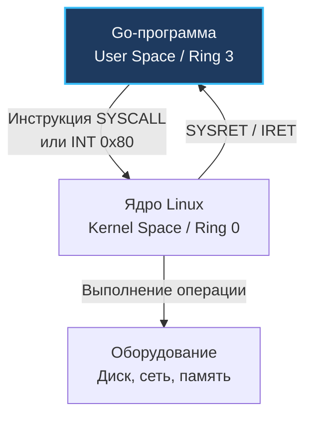
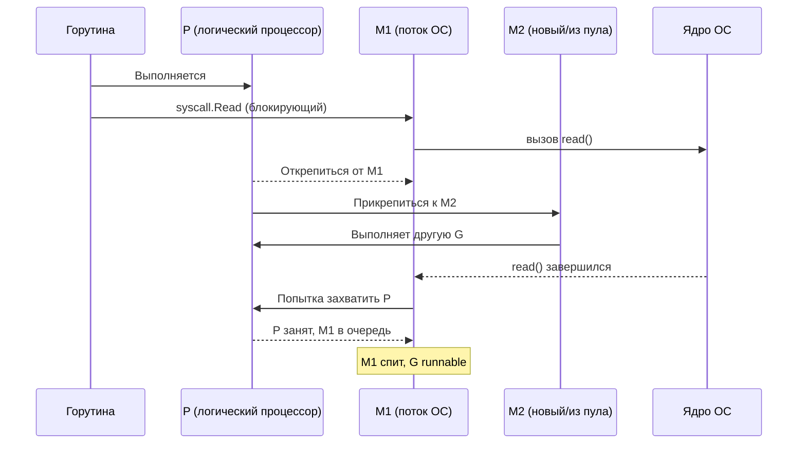

## Почему системные вызовы — главная плата за взаимодействие с ОС

До сих пор в разделе мы в основном говорили о том, что происходит внутри процесса: как работает CPU ([[2. CPU profiling в Go]]), как выделяется и собирается память ([[04. Memory profiling]], [[05. Garbage Collector]]), как планируются горутины ([[1. Scheduler Go. G M P модель]]). Но любое сетевое соединение, чтение файла, работа с часами или аллокация памяти, которая заставляет ОС расширить кучу, требуют **системного вызова** (system call, syscall) — контролируемого перехода из пространства пользователя (userspace) в пространство ядра (kernel space).

Системный вызов — это не просто функция. Это пересечение границы между мирами с разными привилегиями (Ring 3 → Ring 0 на x86), переключение стека, проверка аргументов, смена контекста в ядре и часто — ожидание завершения операции. Все эти шаги стоят **тысячи тактов процессора**. Понимание стоимости syscall'ов и того, как Go их обрабатывает, отделяет разработчика, который просто вызывает `os.ReadFile`, от Senior-инженера, способного объяснить, почему этот вызов может занять 100 микросекунд при пустом диске.

Представьте себе обычного гражданина, пришедшего в охраняемое государственное казначейство. Вы не имеете права самостоятельно зайти за бронированную дверь, взять связку ключей от сейфа и отсчитать себе пачку банкнот. Вместо этого вы обязаны подойти к узкому окошку с пуленепробиваемым стеклом, заполнить строгий бланк установленного образца (записать аргументы в регистры процессора), просунуть его служащему через щель (инструкция `SYSCALL`) и терпеливо ждать, пока офицер службы безопасности проверит ваши документы, обойдет внутренние хранилища и вернет результат через лоток (регистр `RAX`). Каждый поход к такому окошку вырывает процессор из плавного потока вычислений.

Эта статья открывает подраздел «IO и системный уровень». Мы разберём механику syscall от ассемблера до планировщика горутин, научимся измерять их стоимость и рассмотрим паттерны минимизации: буферизацию, пакетную обработку, zero-copy. Это фундамент для понимания [[2. IO bottlenecks]], [[4. epoll, kqueue и netpoller]] и [[5. Zero copy подходы]].

## Что такое системный вызов: архитектурный взгляд

### Два кольца: User Space и Kernel Space

Процессор x86-64 (и ARM в аналогичной модели уровней исключений Exception Levels — EL0 и EL1) исполняет код в нескольких уровнях аппаратных привилегий (protection rings). Ваша программа на Go работает в **Ring 3** (пользовательский режим, User Space) — наименее привилегированном режиме. В этом режиме аппаратно запрещено:

- Напрямую обращаться к оборудованию (диск, сеть).
- Изменять таблицы страниц памяти (Page Tables).
- Читать или писать память ядра.
- Выполнять привилегированные инструкции (HLT, IN, OUT, изменение управляющих регистров, таких как CR3).

Ядро ОС работает в **Ring 0** (режим супервизора, Kernel Space) — режиме полных привилегий. Когда программе нужно записать байт в файл или отправить пакет, она должна **попросить** ядро сделать это от её имени. Этот запрос и есть системный вызов.



Исторически на 32-битных x86 системах системные вызовы выполнялись через программное прерывание `INT 0x80`. Это требовало обращения к таблице дескрипторов прерываний (IDT) и занимало сотни тактов. В современных 64-битных процессорах появились специализированные инструкции быстрого перехода: `SYSCALL`/`SYSRET` для x86-64 и `SVC` (Supervisor Call) для архитектуры ARM64.

### Анатомия syscall на x86-64 (Linux)

Современный syscall в Linux на x86-64 выполняется по жесткому протоколу Системного ABI (System V AMD64 ABI):

1. **Подготовка аргументов.** Go-рантайм помещает номер системного вызова в регистр `RAX`, а аргументы — в регистры `RDI`, `RSI`, `RDX`, `R10`, `R8`, `R9` (в порядке следования).
2. **Инструкция `SYSCALL`.** Процессор аппаратно и атомарно:
   - Переключает привилегии с Ring 3 на Ring 0.
   - Сохраняет адрес возврата пользователя в регистр `RCX`, а текущие флаги `RFLAGS` — в регистр `R11`.
   - Загружает указатель стека ядра и переходит по адресу, записанному в машинном MSR-регистре `IA32_LSTAR` (который при инициализации ОС указывает на точку входа ядра `entry_SYSCALL_64`).
3. **Выполнение в ядре.** Обработчик ядра сохраняет состояние пользовательского процесса, проверяет аргументы на валидность, вызывает конкретную функцию ядра (например, `ksys_write`), выполняет операцию и помещает результат (или отрицательный код ошибки) в `RAX`.
4. **Инструкция `SYSRET` (или `IRET`).** Восстанавливает привилегии Ring 3, восстанавливает `RIP` из `RCX` и `RFLAGS` из `R11`, возвращая управление на следующую инструкцию после `SYSCALL`.

На ARM64 аналог — инструкция `SVC` (Supervisor Call), где номер системного вызова передается в регистре `X8`, а аргументы — в регистрах `X0`–`X5`, логика аналогична.

> [!info] Под капотом — рантайм Go
> В Go системные вызовы инкапсулированы в пакет `syscall` (и низкоуровневый `golang.org/x/sys/unix` для Unix-специфичных флагов). Функции вроде `syscall.Write` написаны на ассемблере (например, `src/syscall/asm_linux_amd64.s`). Они настраивают регистры и выполняют инструкцию `SYSCALL`. После возврата проверяют `RAX` на ошибку (отрицательное значение) и преобразуют результат в Go-типы. Внутренний слой `runtime` содержит обёртки (`runtime.write`, `runtime.open`), которые обрабатывают прерывания и взаимодействие с планировщиком.
> 
> Особый класс вызовов в Linux обслуживается через **vDSO** (Virtual Dynamic Shared Object). Для функций чтения времени (`clock_gettime`, `gettimeofday`) ядро экспортирует страницу памяти со счетчиком времени прямо в адресное пространство процесса. Go вызывает такие функции без смены кольца привилегий (Ring 3 → Ring 0), что снижает стоимость вызова времени с 100 нс до 10–15 нс!

## Стоимость системного вызова: от тактов до контекста

Стоимость системного вызова складывается из нескольких фундаментальных компонент.

### 1. Прямой CPU overhead: переход Ring 3 → Ring 0

- Сохранение/восстановление регистров.
- Смена стека (пользовательский стек → стек ядра в TSS).
- Проверка прав, валидация границ указателей.
- Кэш-промахи: код ядра, скорее всего, не в L1-кэше инструкций, потому что пользовательский код его вытеснил. Аналогично — стек ядра и структуры структур данных ядра отсутствуют в L1-кэше данных.
- Минимальная стоимость «пустого» syscall (например, `getpid()`) — **порядка 50-200 нс** (зависит от процессора и версии ядра). Более сложные вызовы (чтение из сокета) — сотни наносекунд.

### 2. Работа внутри ядра

Ядро может:

- Скопировать данные между буферами пользователя и ядра (`copy_from_user` / `copy_to_user`) — это обход страниц памяти, проверка доступности, запись.
- Заблокировать вызывающий поток, если операция не может быть завершена немедленно (дисковый ввод-вывод, ожидание сети). Тогда стоимость возрастает на порядки (миллисекунды).
- Выполнить планирование внутри ядра (обработка очередей, ожидание на семафорах, межпоточная синхронизация).

### 3. Побочные эффекты: вымывание кэша и TLB

- **Кэш инструкций и данных:** выполнение кода ядра загружает в L1/L2 кэш новые инструкции и данные, вытесняя «прогретые» данные пользовательской программы.
- **TLB (Translation Lookaside Buffer):** при переключении стека и доступе к страницам ядра могут потребоваться обновления TLB. Раньше при syscall сбрасывался весь TLB (очень дорого), современные процессоры используют PCID (Process Context Identifiers) на x86 и ASID (Address Space IDs) на ARM, чтобы изолировать TLB-записи ядра и пользователя.
- **Branch predictor:** код ядра имеет совершенно другой паттерн ветвлений, что сбивает аппаратный предсказатель переходов (Branch Target Buffer).

### 4. Влияние на планировщик Go: hand-off

Когда горутина делает блокирующий системный вызов (например, `read` из файла без `O_NONBLOCK`), рантайм Go предпринимает специальные шаги, чтобы логический процессор P не простаивал:

1. Перед входом в syscall вызывается `entersyscallblock` (или `entersyscall` для потенциально неблокирующих).
2. Поток операционной системы M открепляется от логического процессора P (`P.m = nil`, `M.p = nil`).
3. Логический процессор P переходит в состояние `_Psyscall`. P ищет новый свободный поток M (из пула простаивающих потоков или создает новый поток ОС через `clone()`) и продолжает выполнять другие готовые горутины из своей очереди.
4. Когда syscall в ядре ОС наконец завершается, поток M просыпается и вызывает `exitsyscall`:
   - Пытается снова захватить свой старый P (если тот свободен).
   - Если нет — встаёт в глобальную очередь или засыпает.
   - Горутина переходит в статус `_Grunnable` и попадает в глобальную очередь `sched.runq`, откуда ее может украсть другой логический процессор P ([[3. Work stealing]]).

Этот механизм называется **hand-off** (передача эстафеты). Он позволяет сохранить высокий параллелизм рантайма Go, но создает ощутимые накладные расходы: пробуждение и создание потоков ОС, потерю локальности кэша при миграции горутины на другой поток M и ядро процессора, а также contention на глобальных структурах планировщика.



## Сетевые и дисковые syscall: разница и цена

Разработчики часто ошибочно полагают, что чтение из сети и чтение из файла в Go работают одинаково, поскольку интерфейс `io.Reader` для них идентичен. Но под капотом разница колоссальна.

### Сетевые вызовы (non-blocking I/O)

Go использует **epoll** (в Linux) или **kqueue** (в macOS/BSD) для сетевого ввода-вывода ([[4. epoll, kqueue и netpoller]]). Все сетевые сокеты переводятся рантаймом в неблокирующий режим (`O_NONBLOCK`). Когда горутина вызывает `conn.Read()`:

1. Выполняется вызов `syscall.Read` на сокете. Если данные уже пришли в буфер сетевой карты, вызов мгновенно возвращает прочитанные байты.
2. Если данных нет, системный вызов не блокирует поток, а возвращает ошибку `EAGAIN` (или `EWOULDBLOCK`).
3. Горутина **не блокирует поток ОС** — она регистрирует файловый дескриптор в сетевом поллере (netpoller) и переводится планировщиком в режим ожидания (`gopark`).
4. Поток M не открепляется от P! Он просто берет следующую готовую горутину из очереди.
5. Фоновый netpoller ждёт событий готовности от `epoll_wait` и, когда байты поступают в сокет, переводит заснувшую горутину в состояние `_Grunnable`.

Таким образом, сетевой syscall **не открепляет P** и не порождает лавинообразного создания потоков ОС. Он стоит дешево: сам неблокирующий вызов `read` (~100 нс) + парковка/пробуждение горутины в userspace. Это позволяет Go легко обслуживать сотни тысяч одновременных сетевых соединений (проблема C10K / C1000K).

### Дисковые вызовы (blocking I/O)

В операционной системе Linux обычный файловый ввод-вывод (`os.ReadFile`, `os.Write`, `os.Open`) не поддерживает традиционный `epoll`. Файловые дескрипторы диска всегда считаются «готовыми к чтению», но сам системный вызов (`pread`/`pwrite`) является **блокирующим**.

Если запрашиваемый блок файла не находится в горячем кэше страниц операционной системы (Page Cache), вызов `read` блокирует поток ОС на миллисекунды — пока считывающая головка механического диска HDD переместится к дорожке или контроллер NVMe SSD передаст блок по шине PCIe.

Здесь в рантайме Go неизбежно срабатывает механизм hand-off: поток M блокируется в ядре, планировщик отбирает P и создает новые потоки M. Если программа параллельно запустит тысячи горутин, читающих файлы с диска, число потоков ОС в системе мгновенно вырастет со стандартных `GOMAXPROCS` до сотен или тысяч, что приведет к перегрузке планировщика ОС (kernel thread thrashing) и деградации памяти.

С появлением **io_uring** в ядре Linux (начиная с ядра 5.1+) ситуация изменилась: Linux получил подлинно асинхронный интерфейс ввода-вывода для файлов и сокетов на основе кольцевых очередей в разделяемой памяти, работающий вообще без блокировки M и без лишних syscall'ов. Существуют сторонние Go-пакеты (`github.com/iceber/iouring-go`, `github.com/Aaron945/iouring`), однако стандартная библиотека Go пока сохраняет классическую модель блокирующих файловых вызовов.

## Измерение стоимости syscall'ов в Go

Для точного профилирования системных вызовов применяются специализированные системные утилиты:

### 1. `perf stat`

Запустите программу под `perf stat` и посмотрите на счётчик системных вызовов ядра, например `syscalls:sys_enter_write`:

```bash
perf stat -e 'syscalls:sys_enter_*' ./my_program
```

Либо воспользуйтесь агрегированным счётчиком:
```bash
perf stat -e raw_syscalls:sys_enter ./my_program
```

Вывод покажет точное количество системных вызовов и их распределение по типам (`syscalls:sys_enter_write`, `sys_enter_futex`, `sys_enter_epoll_pwait`).

### 2. `strace`

Классический трассировщик системных вызовов Linux. Запуск с флагом `-c` формирует наглядную сводную таблицу:

```bash
strace -c ./my_program
```

`strace -c` покажет: количество вызовов каждого syscall'а, суммарное время, проведенное в ядре, процент ошибок и среднее время вызова. Это незаменимо для поиска «паразитных» вызовов — например, избыточных `futex` при contention или постоянных вызовов `brk`/`mmap` из-за частых крупных аллокаций.

### 3. `GODEBUG=schedtrace`

Флаг отладки планировщика Go позволяет обнаружить утечку потоков M:

```bash
GODEBUG=schedtrace=1000 ./my_program
```

Рост параметра `threads` (количество M) при выполнении дискового IO — вернейший признак активного срабатывания механизма hand-off из-за блокирующих дисковых системных вызовов.

### 4. `go tool pprof` и execution tracer

Стандартный профилировщик CPU Go (`pprof`) фиксирует время только внутри userspace. Время, пока поток M спал внутри ядра в ожидании диска, в обычном CPU profile отображаться не будет.

Однако execution tracer ([[3. execution tracer]]) визуализирует точные состояния горутин во времени: если горутина находится в статусе `syscall`, это отображается отдельным цветом на таймлайне, наглядно показывая, что сервис заблокирован вводом-выводом ОС.

## Паттерны минимизации стоимости системных вызовов

### 1. Буферизация

Каждый вызов `Write` на небуферизированный файл (`os.File`) — это отдельный системный вызов. Попытка записать 4096 байт по одному байту в цикле породит ровно 4096 системных вызовов!

Использование `bufio.Writer` накапливает данные в памяти (по умолчанию буфер 4 КБ) и сбрасывает их на диск за один системный вызов `write`:

```go
// Плохо: 4096 системных переключений Ring 3 -> Ring 0
for _, b := range data {
    f.Write([]byte{b})
}

// Хорошо: 1 системный вызов write
w := bufio.NewWriter(f)
w.Write(data)
w.Flush()
```

То же самое справедливо и для чтения: `bufio.Reader` выполняет один крупный блочный `read`, после чего отдает данные из памяти в сотни раз быстрее.

### 2. Пакетная обработка (Batching)

При отправке множества мелких сообщений в сеть или базу данных отправляйте данные пачками (батчами). Вместо 100 раздельных вызовов сетевой записи используйте векторный ввод-вывод (scatter-gather I/O) с помощью системных вызовов `writev` и `sendmsg`. В Go базовый интерфейс `net.Conn` не предоставляет метод `writev` напрямую «из коробки», но можно использовать `syscall.Writev` через `golang.org/x/sys/unix` или высокоуровневый тип `net.Buffers`, который под капотом прозрачно оптимизирует отправку пачки слайсов за один системный вызов `writev`.

### 3. Zero-copy подходы

В традиционном конвейере передачи файла в сеть ядро копирует данные с диска в Page Cache ядра, затем по системному вызову `read` копирует данные в пользовательский буфер приложения, после чего по системному вызову `write` копирует их обратно в буфер сокета ядра.

Системные вызовы `sendfile` и `splice` позволяют ядру передавать страницы памяти напрямую между кэшем страниц диска и сетевой картой через DMA (Direct Memory Access), минуя пространство пользователя. В Go функция `io.Copy` автоматически распознает связку файла и TCP-сокета и вызывает оптимизированный метод `sendfile`. Подробнее эта архитектура разобрана в [[5. Zero copy подходы]].

### 4. Использование неблокирующего ввода-вывода и netpoller

Для сетевых соединений рантайм Go делает это автоматически. Для файловых дескрипторов диска, если требуется предотвратить лавину потоков ОС, файловые операции следует изолировать в выделенный пул горутин с ограниченной емкостью (worker pool) либо применять асинхронные интерфейсы (io_uring).

### 5. Memory-mapped файлы (mmap)

Вместо сотен тысяч вызовов `pread`/`pwrite` файл можно спроецировать в виртуальную память процесса с помощью системного вызова `syscall.Mmap`. Чтение и запись в файл превращаются в обычные обращения по указателям в памяти:

```go
data, err := syscall.Mmap(int(f.Fd()), 0, fileSize, syscall.PROT_READ, syscall.MAP_SHARED)
```

Ядро подгружает страницы файла прозрачно через механизм страничных прерываний (Page Fault). Это исключает накладные расходы на копирование буферов и идеально подходит для баз данных (BoltDB, LMDB).

## Сравнение с другими языками

- **C/C++:** Минимальный overhead — прямой вызов `syscall()` или функции glibc. Но разработчик обязан вручную писать весь реактор событий на базе `epoll` или использовать сторонние библиотеки (`libuv`, `asio`).
- **Java:** Вызовы ОС выполняются через Java Native Interface (JNI) и JVM-обертку. Стоимость самого syscall та же, но в классической Java каждый поток потоком ядра (`java.lang.Thread` — это OS thread). Блокирующий ввод-вывод приводил к быстрому исчерпанию пула потоков ОС вплоть до появления Virtual Threads (Project Loom в Java 21).
- **Python / Node.js:** Цена самого syscall'а теряется на фоне накладных расходов динамического интерпретатора. Для сети они используют цикл событий (Event Loop) на базе `epoll`/`kqueue`, но ограничены однопоточной моделью (GIL в Python).

Модель Go уникальна: горутины бесшовно интегрированы с рантаймом. Сетевые операции работают асинхронно через netpoller, сохраняя простой синхронный стиль написания кода, а дисковые блокировки компенсируются механизмом hand-off потоков M.

## Mechanical Sympathy: что происходит на шине и в кэше

- **Шина QPI / Infinity Fabric:** При каждом переключении контекста из User Space в Kernel Space и обратно процессор обращается к структурам ядра, стеку ядра и страницам памяти, которые зачастую не прогреты в локальном L1-кэше. Это генерирует массивный трафик на межъядерной шине (Intel QPI/UPI или AMD Infinity Fabric), отбирая пропускную способность у соседних ядер процессора.
- **Аппаратные митигации Spectre и Meltdown:** В современных ядрах Linux для защиты от атак по сторонним каналам спекулятивного исполнения внедрен механизм KPTI (Kernel Page Table Isolation). До аппаратных исправлений в новых поколениях CPU каждый системный вызов приводил к принудительной смене таблиц страниц памяти и сбросу буфера ассоциативной трансляции (TLB). Это добавляло **от 50 до 300 наносекунд** к абсолютно каждому системному вызову, что особенно ударило по микросервисам с высоким сетевым трафиком.
- **Кэш-линии буферов:** Буфер данных, который ваше приложение передает в системный вызов `write`, ядро обязано прочитать и скопировать. Если размер буфера велик или он был недавно аллоцирован в медленной памяти, процессор столкнется с цепочкой промахов кэша (Cache Misses) еще до передачи данных аппаратному контроллеру.

> [!tip] Собеседование
> **Вопрос:** Почему при профилировании дискового I/O в Go количество потоков операционной системы в `top` или `GODEBUG=schedtrace` может вырасти до сотен, тогда как для сети достаточно нескольких потоков?  
> **Ответ:** Сетевой ввод-вывод в Go обслуживается сетевым поллером (`netpoller`) на базе `epoll`/`kqueue` в неблокирующем режиме: если данных нет, горутина засыпает в userspace, а поток M продолжает выполнять другие горутины. Файловые вызовы в Linux блокирующие. Когда горутина вызывает блокирующий `read` файла, рантайм Go выполняет hand-off: поток M уходит спать в ядро вместе с горутиной, а логический процессор P открепляется и ищет или создает новый поток M. Сотни параллельных горутин, читающих диск, приводят к созданию сотен потоков ОС.

> [!warning] Ловушка / Gotcha
> **Чтение мелких файлов в миллионах горутин.** Запуск тысяч горутин вида `go func() { b, _ := os.ReadFile("file.txt") }()` способен положить даже мощный сервер. Лавина hand-off приводит к созданию сотен потоков M, исчерпанию лимита потоков ядра (`/proc/sys/kernel/threads-max`) или панике рантайма Go `runtime: program exceeds 10000-thread limit`. Дисковые операции в Go всегда должны ограничиваться пулами воркеров или семафорами!

## Итог

- **Системный вызов (syscall)** — контролируемый переход процессора из пользовательского режима (Ring 3) в режим ядра (Ring 0). Минимальная стоимость вызова — 50–200 нс, реальная (с блокировками и диском) — миллисекунды.
- **Сетевой I/O в Go** полностью неблокирующий: netpoller перехватывает `EAGAIN` и усыпляет горутины без открепления потоков M.
- **Дисковый I/O в Go** по умолчанию блокирующий: запускает механизм hand-off планировщика, открепляя P и создавая новые потоки ОС M.
- **Накладные расходы syscall:** сохранение регистров, сброс конвейера, инвалидация кэшей L1/L2, влияние аппаратных митигаций Spectre/Meltdown и трафик на шине QPI/Infinity Fabric.
- **Ключевые приемы оптимизации:** буферизация (`bufio`), пакетная отправка (`writev`), отображение в память (`mmap`), zero-copy технологии (`sendfile`) и пулы горутин для дисковых операций.
- Понимание природы системных вызовов необходимо для точной диагностики узких мест ввода-вывода ([[3. CPU bound vs IO bound задачи]]).

Следующая статья подробно препарирует структуру задержек ввода-вывода и покажет, где теряются миллисекунды: [[2. IO bottlenecks]].