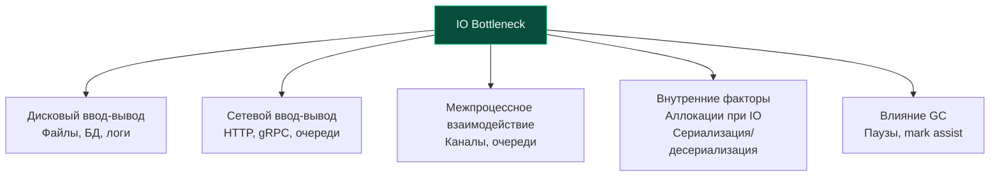

## IO Bottlenecks: почему ввод-вывод становится узким местом

В [[1. Системные вызовы и их стоимость]] мы установили, что даже минимальный переход в ядро операционной системы стоит сотни наносекунд, а блокирующий дисковый ввод-вывод запускает каскад событий в планировщике Go: открепление потоков M от логических процессоров P (hand-off), порождение новых потоков ОС и потерю аппаратной локальности кэша. Теперь мы масштабируем это знание до уровня архитектуры всей распределенной системы.

**IO bottleneck** (узкое место или бутылочное горлышко ввода-вывода) — это состояние системы, при котором пропускная способность (throughput) или задержка (latency) внешних каналов обмена данными (твердотельные накопители, жесткие диски, локальная сеть, удаленные API, очереди сообщений) становится жестким лимитирующим фактором, не позволяющим вычислительным ядрам CPU и легковесным горутинам Go раскрыть свой потенциал.

В современном серверном бэкенде подавляющее большинство сервисов являются именно **IO-bound**: они не занимаются трехмерным рендерингом или обучением нейросетей, а 99% времени ожидают ответа от кластера PostgreSQL, читают партиции из Apache Kafka, парсят входящие HTTP-запросы и сбрасывают структурированные логи на диск. Способность безошибочно локализовать природу задержки — будь то насыщение дисковой очереди ядра, скрытые задержки рукопожатий TLS, аллокации буферов при десериализации или деградация сетевого поллера — отличает инженера высокой квалификации.

Эта статья классифицирует IO bottleneck'и по их физическим и программным источникам, подробно связывает их с внутренними механизмами Go (netpoller, планировщик M:N, сборщик мусора) и вооружает инженера исчерпывающим диагностическим инструментарием. Мы будем опираться на концепции [[2. Latency vs throughput]], [[3. CPU bound vs IO bound задачи]], [[1. Scheduler Go. G M P модель]] и подготовим фундамент для погружения в [[4. epoll, kqueue и netpoller]] и [[5. Zero copy подходы]].

## Классификация IO-бутылочных горлышек

В реальных продуктовых системах узкие места ввода-вывода распределяются по нескольким фундаментальным уровням:

Каждая из этих категорий имеет принципиально разную физическую природу и совершенно по-разному проявляется в системных счетчиках Linux, метриках рантайма и профилях Go.

## Дисковый ввод-вывод: когда файлы и базы данных становятся преградой

### Физика дисковой задержки

Чтобы ощутить масштаб проблемы, полезно перевести машинные времена в привычные человеку физические масштабы. Если приравнять 1 такт современного процессора (около 0.3 наносекунды при частоте 3.3 ГГц) к **одной секунде**:

- Обращение к регистрам и L1-кэшу процессора займет **1–4 секунды** (беглый взгляд на записку на столе).
- Чтение из оперативной памяти (DRAM, 80–100 нс) займет **4–5 минут** (поход к кофемашине в конце коридора).
- Чтение блока с высокоскоростного накопителя NVMe SSD (последовательное чтение, ~10–50 мкс) займет **от 9 часов до 1.5 суток** непрерывного ожидания!
- Чтение со старого SATA SSD (~200–500 мкс) — **от 5 дней до недели**.
- Случайное позиционирование считывающей головки механического диска HDD (~2–10 мс) — **от 2.5 до 10 месяцев**!

Один-единственный промах мимо системного кэша страниц операционной системы (**page cache**) при чтении файла с NVMe диска обходится в сотни тысяч тактов процессора. Пока процессор дожидается ответа контроллера накопителя по шине PCIe, он мог бы обработать десятки тысяч полезных запросов.

### Как дисковая загрузка проявляется в Go

В языке Go стандартные файловые операции пакета `os` (`os.ReadFile`, `os.Write`, `os.Open`, `(*os.File).Read`) являются **синхронными и блокирующими системными вызовами**. Как мы выяснили в [[1. Системные вызовы и их стоимость]], ядро Linux не предоставляет механизма готовности для файлов через `epoll`. Поэтому рантайм Go вынужден отрабатывать классический сценарий:

1. Горутина вызывает блокирующий `syscall.Read` или `syscall.Write`.
2. Поток операционной системы M открепляется от логического процессора P (механизм hand-off).
3. Планировщик Go ищет свободный поток M или запрашивает у ядра создание нового потока ОС (`clone()`).
4. Горутина паркуется и ожидает аппаратного завершения операции дискового ввода-вывода.
5. После пробуждения потока M горутина переводится в статус runnable и возвращается в очередь планирования.

При интенсивной несогласованной работе с диском (например, если тысячи горутин одновременно читают файлы журналов или статику) эти накладные расходы стремительно накапливаются:

- **Лавинообразный рост потоков ОС:** метрика `go_threads` в Prometheus подскакивает вверх, а трассировщик планировщика `GODEBUG=schedtrace` фиксирует опасное увеличение параметра `threads`.
- **Повышенная задержка (tail latency):** время ответа отдельных HTTP-хэндлеров возрастает в десятки раз из-за конкуренции потоков ОС за кванты планировщика CFS/EEVDF ядра Linux.
- **Фрагментированный throughput:** вычислительные ядра CPU простаивают в состоянии ожидания (I/O Wait, `%iowait`), пока тысячи потоков спят в ядре.

### Симптомы в инструментах Go

**Execution tracer** ([[3. execution tracer]]) — главный инструмент локализации дискового узкого места. На визуальной диаграмме вы увидите длинные фиолетовые полосы со статусом `syscall` у горутин, а также постоянную смену потоков M на процессорах P.

**pprof** ([[2. CPU profiling в Go]]): стандартный CPU-профиль не учитывает время сна потоков внутри ядра, однако методы-обёртки стандартной библиотеки вроде `os.(*File).Read` и низкоуровневые вызовы `syscall.Read` покажут аномально высокий кумулятивный вес (`cum`). Косвенно в топе появятся вызовы планировщика `runtime.entersyscall` и `runtime.exitsyscall`.

**Системные утилиты Linux:**
- `iostat -x 1` — ключевая утилита для оценки состояния дисковой подсистемы. Обращайте внимание на метрики:
  - `%util` — процент времени, в течение которого накопитель обрабатывал запросы. Если `%util` приближается к 100%, дисковый интерфейс насыщен.
  - `await` — среднее время (в миллисекундах) обслуживания запроса диском (включая ожидание в очереди ядра).
  - `aqu-sz` — средний размер очереди запросов к устройству (Average Queue Size).
- `strace -c -p <pid>` — подсчет времени и количества блокирующих вызовов `pread64`, `pwrite64`, `fsync`.

### Стратегии устранения дисковых bottleneck

1. **Буферизация через `bufio`:**  
   Использование `bufio.Reader` и `bufio.Writer` сокращает количество системных вызовов в тысячи раз, объединяя мелкие операции чтения/записи в крупные монолитные блоки (обычно по 4–64 КБ). Каждый явный вызов метода `Flush()` выполняет ровно один системный `write`.
2. **Асинхронный ввод-вывод (`io_uring`):**  
   Интерфейс `io_uring` в ядре Linux позволяет обмениваться запросами ввода-вывода через две разделяемые кольцевые очереди (Submission Queue и Completion Queue) без блокировки потоков ОС и вообще без системных вызовов в режиме ядра. Для Go созданы высокопроизводительные библиотеки (например, `github.com/iceber/iouring-go`), применение которых полностью устраняет дисковый hand-off.
3. **Отображение файлов в память (`mmap`):**  
   Для больших файлов произвольного доступа системный вызов `mmap` позволяет проецировать файл в адресное пространство процесса. Подкачка страниц возлагается на ядро ОС через page faults, устраняя промежуточные копирования данных между буферами ядра и пользователем.
4. **Ограничение пулов горутин (Worker Pool / Semaphores):**  
   Категорически запрещено запускать неограниченное число горутин, выполняющих блокирующий дисковый I/O. Ограничение конкурентности через буферизированный канал-семафор (например, максимум 16–32 параллельных дисковых горутины) стабилизирует количество потоков M в рантайме.
5. **Вынос на распределенные объектные хранилища:**  
   Перенос тяжелых статических файлов и медиаданных в S3, MinIO или распределенные файловые системы с агрессивным многоуровневым кэшированием в оперативной памяти сервиса.

## Сетевой ввод-вывод: задержки, потери и очереди

### Природа сетевых задержек

В отличие от локального накопителя, где задержка предсказуема с точностью до десятков микросекунд, сеть вносит колоссальные и нестабильные задержки:

- RTT (Round-Trip Time) внутри одного датацентра: **0.1–1 мс**.
- RTT между зонами доступности (Cross-AZ) одного облачного региона: **1–10 мс**.
- RTT между географическими регионами через публичный интернет: **20–300 мс**.

Помимо чистого физического распространения сигнала по оптоволокну, сеть подвержена перегрузкам очередей маршрутизаторов (bufferbloat), потере пакетов, дрожанию задержки (jitter) и задержкам ретрансмиссии TCP (TCP RTO). В распределенных микросервисных цепочках эти флуктуации накапливаются лавинообразно, порождая так называемый «длинный хвост задержек» ([[7. Tail latency и почему она важна]]).

### Netpoller и его роль

Язык Go обязан своей популярностью в сетевом бэкенде встроенному **сетевому поллеру** (netpoller, [[4. epoll, kqueue и netpoller]]). Все сокеты создаются рантаймом в неблокирующем режиме (`O_NONBLOCK`). 

Когда горутина вызывает `conn.Read()` на сокете, в котором пока нет данных:
- Системный вызов `syscall.Read` немедленно возвращает ошибку `EAGAIN` (или `EWOULDBLOCK`).
- Горутина не блокирует ОС-поток M. Она регистрирует файловый дескриптор сокета в таблице netpoller и переводится в спящий режим вызовом `gopark`.
- ОС-поток M моментально берет следующую готовую задачу из локальной очереди `runq`.
- Выделенный поток netpoller ожидает событий от ядра через `epoll_wait` (в Linux) или `kevent` (в macOS/BSD) и, когда байты прибывают в сетевой буфер сокета, пробуждает горутину, возвращая ее в очередь на исполнение.

Благодаря этому механизму десятки тысяч параллельных сетевых соединений эффективно обслуживаются горсткой ОС-потоков, равной `GOMAXPROCS`. Однако и здесь могут возникать специфические узкие места:

- **Перегрузка очередей пробуждения (Thundering Herd):** при поступлении пачки сетевых пакетов сотни горутин одновременно переводятся в статус runnable, переполняя локальные очереди планировщика и вызывая contention глобальной очереди `sched.runq`.
- **Задержка вызова `epoll_wait`:** если все процессоры P заняты тяжелыми CPU-вычислениями, опрос netpoller может откладываться до срабатывания периодического таймера `sysmon` (до 10 мс задержки!).

### Диагностика сетевых bottleneck в Go

- **Block profile** ([[5. block profile]]): ключевой профиль для сетевых задержек. Он фиксирует время, проведенное горутинами в состоянии ожидания. Если в топе отчета доминирует функция `runtime.netpollblock` — ваши горутины проводят львиную долю времени в ожидании сетевых ответов от внешних зависимостей.
- **Execution tracer:** наглядно визуализирует фазы сетевого ожидания (статус `Waiting`), показывая, какие именно запросы вызывают деградацию латентности.
- **Инспекция планировщика (`GODEBUG=schedtrace=1000`):** высокий показатель `idleprocs` при огромном количестве существующих горутин указывает на то, что вычислительные ядра простаивают, пока приложение ожидает ответы по сети.
- **Prometheus-метрики сетевых клиентов:** стандартные гистограммы задержек клиентских вызовов (например, `http_client_request_duration_seconds` или `grpc_client_handling_seconds`) с обязательной разбивкой по кодам ответов, тайм-аутам и процентилям p95/p99.

### Стратегии устранения сетевых bottleneck

1. **Connection pooling (пулинг соединений):**  
   Повторное использование открытых TCP-соединений (Keep-Alive, пулы соединений к базам данных и микросервисам). Установление каждого нового TCP-соединения требует тройного рукопожатия (3-way handshake), а для защищенного TLS 1.3 — дополнительных двух фаз обмена ключами (TLS-рукопожатие), что добавляет от 2 до 4 RTT к каждому запросу. В Go клиент `net/http.Client` использует переиспользование соединений по умолчанию через встроенный `Transport.MaxIdleConnsPerHost`, значение которого в высоконагруженных сервисах необходимо увеличивать (по умолчанию всего 2!).
2. **Тайм-ауты и Circuit Breaker:**  
   Жесткие тайм-ауты на уровне контекста `context.WithTimeout` и применение паттерна Circuit Breaker предотвращают накопление сотен тысяч зависших горутин при падении нижележащих сервисов.
3. **Компактные бинарные протоколы (Protobuf / gRPC):**  
   Переход с текстового формата JSON на компактные бинарные протоколы Protobuf/gRPC сокращает объем сетевого трафика в 3–5 раз и радикально ускоряет сериализацию.
4. **Локальность данных и кэширование:**  
   Размещение микросервисов в одной зоне доступности (AZ) и внедрение in-memory кэшей (Redis, Dragonfly, локальные кэши в Go) отсекают избыточный сетевой трафик.
5. **Клиентская балансировка нагрузки (Client-side load balancing):**  
   Распределение запросов по репликам на стороне клиента gRPC исключает узкие горлышки промежуточных прокси-серверов.

## Внутренние факторы: аллокации при IO и сериализация

Зачастую узкое место, которое внешне выглядит как сетевая или дисковая задержка, на самом деле рождается внутри самого приложения из-за неэффективной обработки потока данных.

### Аллокации при чтении/записи

Классический антипаттерн в Go — повсеместное использование `io.ReadAll(r)` или наивный `json.Unmarshal(data, &v)` на каждом входящем сетевом запросе:

- Для каждого запроса аллоцируются новые слайсы памяти под тело запроса и промежуточные структуры.
- Сверхвысокий темп выделения памяти в куче перегружает аллокатор и провоцирует частые циклы сборки мусора ([[9. Когда GC становится bottleneck]]).
- Аллокатор начинает принудительно привлекать горутины к процессу маркировки мусора (механизм **Mark Assist**), искусственно раздувая задержку сетевого хэндлера на десятки миллисекунд.
- Объем выделенной памяти приближается к установленному мягкому лимиту `GOMEMLIMIT` ([[8. GOMEMLIMIT]]), вводя рантайм в режим троттлинга.

**Диагностика:** профиль памяти pprof ([[5. pprof memory profile]]) покажет высокий объем `alloc_space` непосредственно внутри сетевых обработчиков. CPU-профиль выявит высокую долю системных функций `runtime.mallocgc` и `runtime.gcAssistAlloc`.

**Решение:**
- Переиспользование буферов через `sync.Pool` ([[2. sync Pool]]).
- Потоковая обработка данных через `json.NewDecoder(r)` вместо вычитывания всего тела в память через `io.ReadAll`.
- Использование методов Zero-copy парсинга ([[5. Zero copy подходы]]).

### Сериализация/десериализация

Стандартный пакет `encoding/json` полагается на рефлексию (`reflect`), порождая массивные аллокации и выполняя миллионы виртуальных проверок типов на лету. В микросервисах с пропускной способностью в десятки тысяч RPS ядра CPU утилизируются не полезной бизнес-логикой, а разбором JSON-строк.

Переход на кодогенераторы (`easyjson`) или библиотеки с прямым парсингом без рефлексии (например, `sonic` от ByteDance на базе JIT/SIMD-ассемблера) позволяет снизить расход CPU на сериализацию в 2–4 раза, мгновенно ликвидируя мнимый «сетевой bottleneck».

## Влияние GC на IO

Сборщик мусора Go является конкурентным, однако его работа не бесплатна. Он разделяет вычислительные ресурсы процессора и пропускную способность шины памяти с бизнес-горутинами:

- **Фазы Stop-The-World (STW):** короткие паузы в начале и конце цикла сборки ([[3. Stop the world]]) замораживают все горутины, включая сетевые обработчики, откладывая отправку сетевых пакетов.
- **Mark assist:** горутина, активно вычитывающая данные из сети и аллоцирующая память быстрее, чем фоновый GC успевает сканировать граф объектов, принудительно переключается рантаймом на маркировку объектов кучи. В результате чтение из сокета задерживается.
- **Вымывание данных из кэша (Cache Pollution):** во время фазы конкурентной маркировки ([[4. Concurrent GC]]) сборщик мусора обходит миллионы указателей в куче, загружая их в L1/L2/L3 кэши процессора и вытесняя оттуда прогретые сетевые буферы ввода-вывода.

Именно поэтому грамотная настройка параметров `GOGC` ([[7. GOGC и tuning]]) и `GOMEMLIMIT` ([[8. GOMEMLIMIT]]) напрямую влияет на стабильность задержек ввода-вывода.

## Инструментарий диагностики IO bottleneck'ов

Сводная таблица инструментов локализации узких мест ввода-вывода:

| Инструмент | Уровень анализа | Что диагностирует и подсвечивает |
|---|---|---|
| `GODEBUG=schedtrace=1000` | Рантайм Go | Рост потоков ОС (`threads`) при блокирующих системных вызовах диска |
| `go tool pprof --http` (CPU) | Профиль Go | Долю `syscall.Read`, `runtime.mallocgc`, `growslice` и `gcAssistAlloc` |
| `go tool pprof --http` (Memory) | Профиль Go | Источники массивных аллокаций при сетевом и дисковом IO (`alloc_space`) |
| Block profile | Рантайм Go | Время задержки в сетевом поллере (`runtime.netpollblock`) и блокировках |
| Execution tracer | Трассировка Go | Точные фазы сна горутин в `syscall` и `Waiting`, миграцию M между P |
| `strace -c -p <pid>` | Системный уровень | Точное число и суммарную длительность системных вызовов в ядре |
| `iostat -x 1` | Дисковая подсистема | Утилизацию физического накопителя (`%util`), латентность `await` и длину очереди |
| `netstat` / `ss -tin` | Сетевой стек ядра | Состояние буферов сокетов (`Send-Q`, `Recv-Q`), ретрансмиссии TCP, RTT |
| `perf stat` | Аппаратные PMC | Промахи кэша (Cache Misses), количество тактов на инструкцию (IPC) в ядре |

## Mechanical Sympathy: IO и процессор

Понимание того, как данные физически путешествуют между контроллерами устройств, шинами материнской платы и кремниевым кристаллом процессора, формирует истинное механическое сочувствие к машине (Mechanical Sympathy):

- **DMA (Direct Memory Access):**  
  Современные сетевые адаптеры (NIC) и контроллеры NVMe не задействуют центральный процессор для копирования байтов. Сетевая карта записывает входящие Ethernet-фреймы напрямую в оперативную память через кольцевые буферы дескрипторов (Rx Ring) по шине PCIe. Лишь после завершения передачи контроллер генерирует аппаратное прерывание (MSI-X), сигнализируя ядру. Процессор не тратит такты на саму пересылку, но если контроллер DMA записывает данные в область памяти, которую процессор держал в своем L3-кэше, кэш-линии аппаратно инвалидируются.
- **IOMMU и накладные расходы виртуализации:**  
  В облачных гипервизорах (AWS EC2, Google Compute Engine) операции DMA проходят обязательную аппаратную трансляцию адресов через блок IOMMU (Input-Output Memory Management Unit), что добавляет небольшую, но неустранимую аппаратную задержку к каждому физическому пакету.
- **NUMA-топология и сетевой адаптер:**  
  На многосокетных серверах сетевая карта физически подключена линиями PCIe к конкретному сокету процессора (NUMA Node 0). Если горутина, обрабатывающая сокет, запланирована на ядре из сокета NUMA Node 1, каждый пакет должен пересечь межсокетную шину (Intel UPI или AMD Infinity Fabric), удваивая латентность доступа к памяти.
- **Миграция кэш-линий при `copy_to_user`:**  
  Когда ядро ОС передает сетевой пакет из пространства ядра в буфер горутины в userspace, процессор вынужден прочитать данные из сетевого буфера ядра и записать их в пользовательский буфер Go, порождая массированное перемещение 64-байтных кэш-линий между L1/L2 кэшами.

> [!tip] Собеседование
> **Вопрос:** Как отличить истинный сетевой bottleneck от ложного узкого места, вызванного работой приложения?  
> **Ответ:** При истинном сетевом bottleneck утилизация CPU низкая, метрика `runtime.netpollblock` в block profile высока, системные утилиты `ss -tin` фиксируют высокий сетевой RTT или потери пакетов, а метрики внешних API показывают высокую внешнюю задержку. При ложном «сетевом» bottleneck задержка вызвана внутри процесса: в CPU-профиле доминирует `json.Unmarshal` или `gcAssistAlloc`, а в профиле памяти — миллионы аллокаций. Сеть работает быстро, но приложение тратит миллисекунды на парсинг и сборку мусора перед отправкой ответа.

> [!warning] Ловушка / Gotcha
> **Паралич сервиса из-за дефолтных настроек `http.Transport`.** В стандартной библиотеке Go структура `http.Transport` по умолчанию имеет поле `MaxIdleConnsPerHost = 2`. Если ваш сервис отправляет 500 RPS к микросервису авторизации, рантайм сможет переиспользовать только 2 открытых TCP-соединения, а остальные 498 запросов будут открывать новое TCP-соединение с полным циклом рукопожатий TCP и TLS, создавая искусственный сетевой коллапс. Всегда настраивайте `MaxIdleConnsPerHost` под реальную пиковую нагрузку!

## Итог

- **IO bottleneck** наступает тогда, когда вычислительные ядра процессора простаивают в ожидании передачи данных по дисковым или сетевым интерфейсам.
- **Дисковые операции** в Go вызывают блокирующие системные вызовы ядра, запуская механизм hand-off потоков M и приводя к росту числа потоков ОС и нестабильной задержке.
- **Сетевой ввод-вывод** эффективно масштабируется через встроенный netpoller, однако может страдать от задержек сетевой инфраструктуры, перегрузок очередей событий и рукопожатий соединений.
- **Внутренние факторы** — неэффективная сериализация JSON и аллокации временных буферов — часто маскируются под сетевые проблемы, провоцируя вмешательство GC и mark assist.
- **Инструментарий диагностики** включает системные утилиты (`iostat`, `ss`, `strace`) и встроенные инструменты Go (`schedtrace`, `pprof`, `execution tracer`, `block profile`).
- Понимание принципов Mechanical Sympathy (DMA, NUMA, шины PCIe) позволяет безошибочно разделять аппаратные и программные причины задержек ввода-вывода.

В следующей лекции мы детально разберем сетевые задержки и методы оптимизации TCP-стека: [[3. Network latency]].