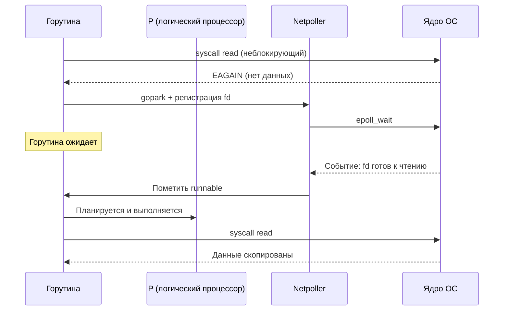

## Почему сетевая задержка — главный враг распределённых систем

В [[2. IO bottlenecks]] мы классифицировали узкие места ввода-вывода, детально рассмотрев дисковые и внутренние архитектурные факторы. Теперь мы сосредотачиваемся на самой неизбежной, физически обусловленной и трудно контролируемой составляющей современных распределенных систем — **сетевой задержке** (network latency).

В отличие от твердотельного накопителя или локального процессора, компьютерная сеть выходит далеко за пределы материнской платы и серверной стойки: она включает в себя десятки промежуточных маршрутизаторов, оптических коммутаторов, балансировщиков нагрузки, межсетевых экранов и физических оптоволоконных магистралей, протянувшихся на тысячи километров по дну океанов. Сетевая задержка жестко скована законами фундаментальной физики — конечной скоростью света в среде, топологией кабельных трасс и динамикой очередей буферов на промежуточных узлах. Никакая оптимизация рантайма Go, ассемблерные вставки или ключи компилятора не заставят фотоны в стеклянной жиле двигаться быстрее физического предела.

Однако Senior Go-инженер способен спроектировать архитектуру приложения так, чтобы оно **не ухудшало** ситуацию, не плодило паразитных сетевых циклов и сводило к минимуму эффективную задержку, воспринимаемую конечным пользователем. Для этого необходимо досконально понимать анатомию сетевой задержки, ее влияние на планировщик горутин и сетевой поллер ([[4. epoll, kqueue и netpoller]]), а также типичные антипаттерны, превращающие миллисекунды в мучительные секунды ожидания ([[7. Tail latency и почему она важна]]).

В этой статье мы препарируем сетевую задержку на физические и программные составляющие, научимся измерять ее на всех уровнях стека — от системных утилит `ping` и `ss` до распределенной трассировки OpenTelemetry, — и освоим проверенные инженерные паттерны снижения задержки в сервисах на Go: от постоянных TCP-соединений (Keep-Alive) и пулов соединений до мультиплексирования HTTP/2 и gRPC-стриминга.

## Из чего состоит сетевая задержка

Время, за которое один байт полезной нагрузки доставляется от приложения-отправителя к приложению-получателю, представляет собой строгую сумму нескольких физических компонент:

$$\text{Latency} = \text{Propagation} + \text{Transmission} + \text{Processing} + \text{Queuing}$$


### Propagation delay (задержка распространения)

Определяется физическим расстоянием между хостами и скоростью распространения электромагнитной волны в среде (стеклянная сердцевина оптоволокна или медная витая пара). Скорость света в вакууме составляет около $300\,000$ км/с, но в кварцевом оптоволоконном кабеле из-за коэффициента преломления стекла ($n \approx 1.47$) свет распространяется со скоростью примерно **$200\,000$ км/с** (около 5 микросекунд на 1 километр пути).

Межконтинентальная задержка между Лондоном и Нью-Йорком через трансатлантический подводный кабель (около 6000 км по извилистой трассе кабеля) составляет минимум **~40 мс в одну сторону** (One-Way) и **~70–80 мс RTT** (Round-Trip Time). Это фундаментальный физический предел: никакая софтверная оптимизация не способна уменьшить это время.

### Transmission delay (задержка передачи)

Время, физически необходимое сетевой карте (NIC) для последовательной модуляции и «выталкивания» всех битов пакета в среду передачи. Оно зависит исключительно от пропускной способности (Bandwidth) физического канала:

$$\text{Transmission Delay} = \frac{\text{Packet Size (bits)}}{\text{Bandwidth (bps)}}$$

Стандартный Ethernet-пакет размером 1500 байт (MTU) на старом канале 100 Мбит/с передается за $120$ мкс. На гигабитном канале (1 Гбит/с) это время падает до $12$ мкс, а в современных дата-центрах на интерфейсах 10/25/100 Гбит/с передача пакета занимает всего **0.12–1.2 мкс**. В современных центрах обработки данных эта составляющая пренебрежимо мала по сравнению с задержками распространения и очередей.

### Processing delay (задержка обработки)

Время, которое затрачивает процессор каждого промежуточного сетевого узла (маршрутизатор, коммутатор, программный фаервол, NAT-шлюз, балансировщик нагрузки) на чтение заголовков сетевых пакетов, валидацию контрольных сумм IP/TCP, поиск в таблице маршрутизации (FIB), инкапсуляцию и применение списков доступа (ACL). В современной специализированной аппаратуре с матрицами ASIC задержка на один хоп составляет **от 10 до 100 мкс**.

### Queuing delay (задержка в очередях)

Самая коварная, динамичная и непредсказуемая компонента сетевой задержки. Если интенсивность входящего трафика на порт коммутатора или сетевой карты кратковременно превышает скорость передачи линии, пакеты помещаются в аппаратные буферы FIFO.

Когда буферы переполняются (явление **bufferbloat**), задержка в очередях может мгновенно подскакивать с 0.5 мс до сотен миллисекунд. Когда буфер исчерпан, коммутатор просто отбрасывает (drop) новые пакеты, вынуждая протокол TCP инициировать процедуру повторной передачи (Retransmission Timeout, RTO) и обрушивая размер окна передачи `cwnd`. Это ключевая причина нестабильности времени ответа и всплесков перцентилей p99 в нагруженных сетях.

## Как Go взаимодействует с сетью: от горутины до провода

В языке Go работа с сетью построена на привычном блокирующем API: горутина вызывает `conn.Read(b []byte)` или `conn.Write(b []byte)`. Однако за этим классическим фасадом скрывается высокоэффективная асинхронная архитектура:

1. Горутина выполняет системный вызов `read` ([[1. Системные вызовы и их стоимость]]). Все сетевые сокеты в Go рантайм предварительно переводит в неблокирующий режим (`O_NONBLOCK`).
2. Если входящие данные уже доставлены контроллером сетевой карты через DMA в кольцевой буфер ядра ОС, они мгновенно копируются в пользовательский слайс `b`, и вызов возвращается без задержки (быстрый путь — fast path).
3. Если данных в буфере сокета нет, ядро ОС не блокирует поток, а мгновенно возвращает код ошибки `EAGAIN` (или `EWOULDBLOCK`).
4. Рантайм Go **не блокирует** операционный поток M! Вместо этого горутина переводится в спящий режим вызовом `gopark`, а файловый дескриптор сокета регистрируется в подсистеме **netpoller** ([[4. epoll, kqueue и netpoller]]).
5. Netpoller использует системный мультиплексор `epoll_wait` (в Linux) или `kevent` (в macOS/BSD). Когда сетевая карта доставляет пакет и сокет становится готовым к чтению, netpoller переводит горутину в статус `_Grunnable`, и логический процессор P возобновляет ее исполнение.



Ключевое архитектурное следствие: пока горутина находится в сетевом ожидании, она **вообще не занимает поток операционной системы (M)**. Горстка потоков ОС, равная `GOMAXPROCS`, может параллельно обслуживать сотни тысяч таких пассивных горутин.

> [!info] Под капотом
> Сетевой поллер Go реализован в файле `src/runtime/netpoll.go` (с платформозависимыми частями `netpoll_epoll.go`, `netpoll_kqueue.go`). Рантайм связывает каждый сетевой дескриптор со структурой `pollDesc`. Структура `pollDesc` хранит указатели на ждущие горутины (для чтения `rg` и для записи `wg`). Когда фоновый вызов `epoll_wait` возвращает список дескрипторов с готовыми событиями, функция `netpollready` атомарно извлекает дескриптор, переводит соответствующую горутину из состояния `_Gwaiting` в состояние `_Grunnable` и добавляет её в локальную или глобальную очередь планировщика. Поиск дескриптора выполняется за $O(1)$.

## Сетевая задержка и производительность Go-приложения

Сетевая задержка формирует неустранимый нижний предел латентности сервиса.

### Влияние на Latency

Если бизнес-логика Go-обработчика выполняется за 20 микросекунд, но для ответа требуется сделать запрос к СУБД с сетевым пингом в 1 мс, минимальное время ответа сервиса физически не может быть меньше 1.02 мс.

В микросервисной архитектуре задержки ведут себя коварно:
- **Последовательные запросы:** задержки строго складываются ($\text{Latency} = L_1 + L_2 + L_3$). Цепочка из 5 микросервисов с пингом по 2 мс гарантированно добавляет 10 мс сетевой задержки.
- **Параллельные запросы (fan-out / fan-in):** когда сервис параллельно опрашивает 10 источников, суммарное время ожидания определяется **самым медленным** из них ($\text{Latency} = \max(L_1, L_2, \dots, L_{10})$). Согласно теории вероятностей, если каждый отдельный сервис имеет хвостовую задержку p99 = 50 мс, то при параллельном вызове 10 сервисов вероятность зацепить хвостовую задержку составляет $1 - (1 - 0.01)^{10} \approx 9.56\%$! Это означает, что почти каждый десятый пользовательский запрос окажется в медленном хвосте ([[7. Tail latency и почему она важна]]).

### Влияние на Throughput

Пока горутина ждет сетевого пакета, она не потребляет процессорное время. Пропускная способность (RPS) сетевого сервиса на Go часто упирается не в вычисления CPU, а в количество одновременно открытых TCP-сокетов и пропускную способность сетевых интерфейсов.

Однако за сотни тысяч спящих соединений приходится платить:
- **Память под стеки горутин:** даже минимальный начальный стек горутины в 2 КБ ([[2. Goroutines под капотом]]) для $100\,000$ горутин потребует $200$ МБ RAM только на базовые стеки, не считая буферов сокетов ядра (`SO_RCVBUF` и `SO_SNDBUF`).
- **Переключения контекста при пробуждении:** лавинообразное пробуждение тысяч горутин создает кратковременный шторм планирования ([[4. Контекстные переключения]]), перегружая локальные очереди `runq`.

## Источники задержек: не всё — сеть

Очень часто задержка, которую разработчики списывают на «медленную сеть», генерируется не физической средой передачи, а протокольным стеком и операционной системой.

### 1. DNS-резолвинг

Первый же вызов `net.Dial("tcp", "api.example.com:443")` неявно запускает разрешение доменного имени через DNS. Если DNS-сервер перегружен или находится далеко, резолвинг может занять от 10 до 200 миллисекунд! 

В Go по умолчанию используется встроенный чистый Go-резолвер (Pure Go Resolver), однако в некоторых дистрибутивах Linux или при сборке с cgo может активироваться блокирующий резолвер glibc (`getaddrinfo`), порождающий лишние потоки ОС. Кэширование DNS-записей на уровне сервиса или локальный DNS-прокси (dnsmasq, CoreDNS) — фундаментальное требование для микросервисов.

### 2. TCP handshake и TLS

Создание нового TCP-соединения требует трехстороннего рукопожатия (SYN → SYN-ACK → ACK), что отнимает ровно **1 полный RTT**.

Если поверх TCP используется протокол шифрования TLS:
- В устаревшем **TLS 1.2** требуется еще **2 полных RTT** на обмен сертификатами и согласование ключей.
- В современном **TLS 1.3** рукопожатие сокращено до **1 RTT** (а при использовании сессионных тикетов 0-RTT — до нуля).

В итоге открытие нового соединения HTTPS/gRPC требует от 2 до 4 RTT еще до того, как будет отправлен первый байт полезных данных! В дата-центре при пинге 1 мс это 4 мс потерь, а при межрегиональном запросе с пингом 50 мс открытие соединения задержит запрос на **200 миллисекунд**. Повторное использование открытых соединений через Keep-Alive полностью нивелирует эти накладные расходы.

### 3. Алгоритм Нейгла (Nagle) и Delayed ACK

Классическая ловушка протоколов TCP. Алгоритм Нейгла (Nagle's Algorithm, RFC 896) был создан для предотвращения забивания сети крошечными пакетами: если у сокета есть неподтвержденные отправленные данные, мелкие новые порции не отправляются в сеть немедленно, а накапливаются в буфере до заполнения полного сегмента (MSS).

В то же время стек TCP на стороне получателя использует механизм **Delayed ACK** (отложенное подтверждение): стек не подтверждает каждый пакет мгновенно, а выжидает до 40–200 мс в надежде объединить подтверждение с исходящим ответом.

Когда алгоритм Нейгла на стороне клиента встречается с Delayed ACK на стороне сервера, возникает тупик: клиент ждет подтверждения, чтобы отправить остаток данных, а сервер ждет данных, чтобы отправить подтверждение! Результат — **искусственная задержка ровно в 40 миллисекунд** на пустом месте.

В Go алгоритм Нейгла можно и нужно отключать для latency-чувствительных интерактивных сервисов с помощью вызова `tcpConn.SetNoDelay(true)` (что соответствует сокетной опции `TCP_NODELAY`). В стандартном пакете `net/http` Go опция `TCP_NODELAY` включена по умолчанию для всех TCP-соединений.

### 4. Перегрузка сети и bufferbloat

Раздутые очереди буферов сетевого оборудования приводят к непредсказуемому росту задержки. Диагностируется утилитой `ping` с увеличенным размером пакета и мониторингом процента потерь пакетов (packet drop rate).

## Инструменты измерения сетевой задержки

### На уровне ОС

- **`ping`:** классический инструмент оценки RTT по протоколу ICMP. Позволяет мгновенно оценить физическую компоненту Propagation Delay.
- **`traceroute` / `mtr`:** поэтапный анализ маршрута с отображением задержки и процента потерь на каждом промежуточном маршрутизаторе (хопе).
- **`ss -ti` (Socket Statistics):** мощнейшая утилита Linux для детальной инспекции внутреннего состояния TCP-сокета. Показывает метрики:
  - `rtt` — сглаженное значение Round-Trip Time (RTT) и вариацию `rttvar`.
  - `rto` — текущий тайм-аут повторной передачи (Retransmission Timeout).
  - `cwnd` — размер текущего окна перегрузки в пакетах (Congestion Window).
  - `retrans` — количество зафиксированных ретрансмиссий.
- **`tcpdump` / `wireshark`:** захват сетевых пакетов на интерфейсе. Позволяет увидеть побайтовую хронологию: точные временные дельты между пакетами SYN, ACK и первыми байтами полезной нагрузки (Time to First Byte, TTFB).

### На уровне Go-приложения

- **Кастомная телеметрия (`http.RoundTripper`):**  
  Обертка над транспортным уровнем `net/http.RoundTripper` с использованием структуры `net/http/httptrace.ClientTrace`. Позволяет замерить время DNS-резолвинга, установления TCP, завершения TLS-рукопожатия и времени ожидания первого байта (TTFB). Метрики экспортируются в Prometheus в виде гистограмм.
- **Распределённая трассировка (OpenTelemetry, Jaeger):**  
  Сквозные спаны позволяют точно локализовать, какая часть времени запроса ушла на сетевую передачу, а какая — на сериализацию и исполнение обработчика на целевом сервере.
- **Block profile** ([[5. block profile]]):  
  Фиксирует время ожидания горутин на сетевом поллере (`runtime.netpollblock`), помогая выявить зависание сервиса на медленных сетевых вызовах.
- **Execution tracer** ([[3. execution tracer]]):  
  Наглядно визуализирует на временной шкале фазы, когда горутины находились в сетевом статусе `Waiting`.

> [!tip] Собеседование
> **Вопрос:** Как вы будете измерять сетевую задержку конкретного gRPC-вызова в Go-сервисе?  
> **Ответ:** Я настрою клиентский интерцептор gRPC (Client Interceptor). Перед выполнением вызова интерцептор фиксирует стартовое время `time.Now()`, а после возврата вычисляет длительность операции и отправляет метрику в Prometheus в формате гистограммы с метками имени метода и кода статуса. Для глубокой диагностики я подключу библиотеку OpenTelemetry gRPC instrumentation, которая автоматически создаст спаны трассировки и покажет точную длительность передачи запроса по проводу в Jaeger/Tempo.

## Паттерны снижения эффективной сетевой задержки

### 1. Keep-alive и пулы соединений

Повторное использование однажды установленных TCP-соединений амортизирует стоимость сетевых рукопожатий. Клиент `net/http` в Go по умолчанию поддерживает Keep-Alive и пул свободных соединений. Для баз данных пул соединений прозрачно обеспечивает пакет `database/sql`, а для gRPC — пул каналов `grpc.Dial`.

Критически важно корректно настраивать параметры пула: `MaxIdleConns`, `MaxOpenConns` и `MaxIdleConnsPerHost` в `http.Transport`, чтобы избежать постоянного открытия новых TCP-сокетов под нагрузкой.

### 2. HTTP/2 и gRPC мультиплексирование

В отличие от устаревшего HTTP/1.1, где для каждого одновременного запроса требуется отдельное физическое TCP-соединение, протоколы HTTP/2 и gRPC поддерживают **мультиплексирование потоков** (Multiplexing) внутри одного постоянного TCP-соединения. Десятки параллельных запросов передаются через единый сокет независимыми фреймами, полностью устраняя задержки на открытие соединений.

### 3. Сжатие данных

Снижение физического размера передаваемых данных уменьшает transmission delay и снижает вероятность переполнения промежуточных сетевых очередей. Бинарный формат Protobuf компактнее JSON в 3–10 раз. Дополнительное потоковое сжатие алгоритмами `gzip` или скоростным `snappy`/`zstd` на уровне gRPC сжимает трафик еще сильнее ценой незначительных затрат CPU.

### 4. Локальность и кэширование

Размещение связанных микросервисов и реплик баз данных в пределах одной зоны доступности (Availability Zone) снижает сетевой пинг с 5–10 мс до долей миллисекунды. А внедрение in-memory кэшей полностью исключает сетевой переход для горячих данных.

### 5. Тайм-ауты и fallback

Ни одна горутина не должна ожидать ответа из сети бесконечно. Каждый сетевой запрос обязан быть ограничен жестким контекстным дедлайном:

```go
ctx, cancel := context.WithTimeout(r.Context(), 100*time.Millisecond)
defer cancel()
resp, err := client.Do(req.WithContext(ctx))
```

Быстрый отказ при превышении бюджета времени (fail-fast) сохраняет ресурсы сервера и защищает распределенную систему от эффекта каскадного отказа ([[7. Tail latency и почему она важна]]).

> [!warning] Ловушка / Gotcha
> **Слишком агрессивный сетевой тайм-аут.** Если тайм-аут контекста установлен меньше реального 99-го перцентиля задержки целевого сервиса, клиент начнет массово отбрасывать вполне успешные ответы, генерируя лавину повторных запросов (retry storm) и окончательно добивая медленный сервис. Сетевой тайм-аут должен рассчитываться как целевой p99 плюс запас на 2–3 сетевых RTT.

## Mechanical Sympathy: как процессор обрабатывает сетевые пакеты

Сетевой ввод-вывод нагружает не только транзисторы сетевой карты, но и архитектурные узлы центрального процессора:

- **Аппаратные прерывания (IRQ) и подсистема NAPI:**  
  Когда в сетевую карту поступает пакет, контроллер генерирует аппаратное прерывание (IRQ), заставляя процессор сохранить контекст и переключиться на обработчик ядра. При потоке в миллионы пакетов в секунду (10–40 Гбит/с) поток прерываний способен полностью парализовать CPU. Для защиты ядро Linux использует интерфейс NAPI (New API): при высокой нагрузке прерывания отключаются, и ядро переходит в режим периодического опроса дескрипторов сетевой карты (polling).
- **DMA и копирование данных:**  
  Контроллер сетевой карты помещает пакеты напрямую в память ядра через DMA. Однако последующее копирование пакета из системной структуры `sk_buff` ядра в пользовательский буфер приложения Go (`copy_to_user`) выполняется процессором. Это копирование разогревает L1/L2 кэши и тратит такты CPU. Техники Zero-copy ([[5. Zero copy подходы]]) направлены на полное устранение этого этапа.
- **Вымывание кэша (Cache Pollution):**  
  Сетевые буферы ядра непрерывно сменяют друг друга в оперативной памяти, вытесняя из кэшей процессора структуры данных и стек вашего приложения Go.
- **Привязка к ядрам (Affinity) и RSS:**  
  Механизм Receive Side Scaling (RSS) на сетевой карте распределяет обработку входящих очередей пакетов по разным ядрам CPU на основе хэша заголовков (IP/порт). Если поток ядра, обработавший пакет по RSS, находится на одном процессорном ядре, а горутина Go, читающая сокет, исполняется на другом ядре или сокете NUMA, возникает дорогостоящий межъядерный трансфер кэш-линий.

## Сравнение с другими языками

- **C/C++:** Предоставляет максимальный контроль над сокетами, позволяя напрямую управлять буферами и использовать технологии обхода ядра (Kernel Bypass через DPDK или `io_uring`). Однако вся сложность неблокирующей синхронизации и построения реакторов событий целиком возлагается на инженера.
- **Java (Netty, Project Loom):** Библиотека Netty реализует сложный цикл событий (Event Loop) поверх `epoll`. Новейший Project Loom (виртуальные потоки в Java 21) концептуально приближает модель Java к горутинам Go. Однако более высокое потребление памяти и паузы сборщика мусора (GC) могут приводить к нежелательным всплескам сетевой латентности.
- **Rust (tokio, async/await):** Модель асинхронного стека Rust обеспечивает исключительную производительность без сборщика мусора, однако требует явного написания асинхронного кода через конечные автоматы `async/await`, что существенно увеличивает когнитивную нагрузку на разработчика.
- **Язык Go:** Уникальный баланс: прозрачный netpoller позволяет писать абсолютно прямолинейный, синхронный и безопасный код, который рантайм автоматически превращает в высокоэффективный неблокирующий ввод-вывод. Грамотное использование `sync.Pool` и буферизации закрывает 99% потребностей высоконагруженных бэкендов.

## Практический пример: диагностика роста задержки

Рассмотрим классический инцидент в продакшене. Сервис A вызывает сервис B по HTTP. Мониторинг сервиса A фиксирует резкий скачок 99-го перцентиля задержки (p99) с 20 мс до 100 мс.

План расследования инженера:
1. **Метрики клиента сервиса A:** гистограмма `http_client_request_duration_seconds` показывает, что львиная доля времени тратится на фазу ожидания первого байта (TTFB), а не на установление соединения.
2. **Распределенный трейсинг (Jaeger):** трейс запроса наглядно подтверждает, что вызов к сервису B длится 92 мс.
3. **Метрики сервера B:** внутренний тайминг сервиса B рапортует, что время выполнения бизнес-логики составляет p50 = 5 мс, p99 = 8 мс! Сервер B обработал запрос мгновенно. Следовательно, задержка локализована строго в сетевом транспорте.
4. **Системная диагностика Linux:** запуск `ss -ti` на целевом хосте выявляет аномально высокий параметр `rto` и сотни повторных передач `retrans`. Проверка утилитой `ping` фиксирует потерю 2% пакетов между виртуальными машинами.
5. **Диагноз:** Проблема локализована на уровне физического сетевого интерфейса или перегрузки виртуального коммутатора облачного провайдера. Потери пакетов вызывают ретрансмиссии TCP, взвинчивая хвостовую задержку p99. Проблема эскалируется сетевым инженерам без необходимости переписывать код Go-сервиса.

## Итог

- **Сетевая задержка** — фундаментальный предел скорости работы распределенных систем, складывающийся из propagation, transmission, processing и queuing delay.
- Go благодаря неблокирующим сокетам и фоновому **netpoller** позволяет сотням тысяч горутин эффективно ожидать сетевые данные без накладных расходов на создание потоков ОС.
- Главные скрытые источники задержек: DNS-резолвинг, рукопожатия TCP и TLS, паразитная связка алгоритма Нейгла и Delayed ACK, а также переполнение очередей коммутаторов (bufferbloat).
- Измерение задержки проводится системными утилитами (`ping`, `traceroute`, `ss`, `tcpdump`) и средствами прикладной телеметрии Go (Prometheus, Jaeger, block profile, execution tracer).
- Снижение эффективной задержки достигается повторным использованием соединений (Keep-Alive), пулами сокетов, мультиплексированием HTTP/2, компактными бинарными протоколами и жесткими контекстными тайм-аутами.
- Механическое сочувствие (Mechanical Sympathy) учитывает аппаратные прерывания NAPI, работу DMA, RSS и влияние сетевых буферов на кэш-память процессора.

Далее мы детально разберем внутреннее устройство главного сетевого механизма языка Go: [[4. epoll, kqueue и netpoller]].